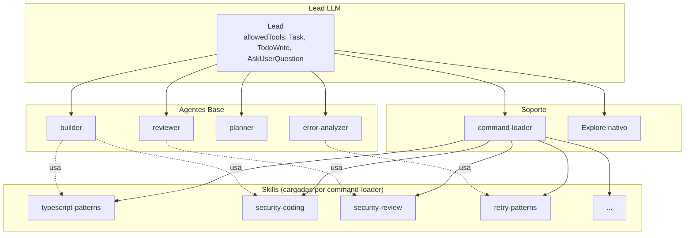
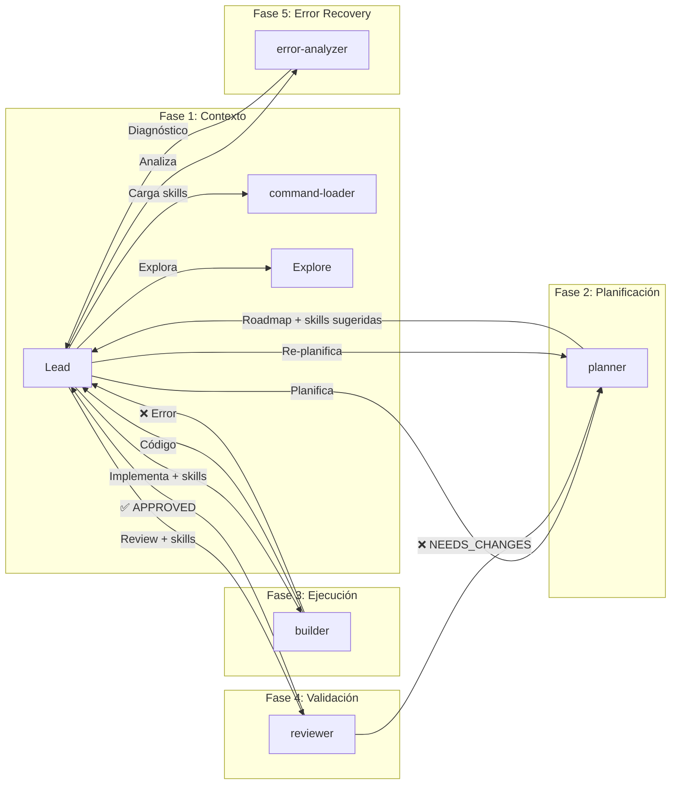

# Specs Index

## Arquitectura: Agentes Base + Skills

> **Principio**: Pocos agentes base bien definidos + muchas skills para especialización.

### Agentes Base (4)

| Agente | Rol | Tools | Specs |
|--------|-----|-------|-------|
| `builder` | Implementa código | All | SPEC-004 |
| `reviewer` | Valida código | Read-only | SPEC-005 |
| `planner` | Planifica ejecución | Read-only + MCPs | SPEC-003 |
| `error-analyzer` | Analiza errores | Read-only | SPEC-008 |

### Diagrama del Sistema

---

## Specs Registry

<!-- SPEC_TABLE_START -->
| ID | File | Status | Version | Priority | Depends | Updated |
|----|------|--------|---------|----------|---------|---------|
| SPEC-001 | [lead-llm-orchestrator.md](./lead-llm-orchestrator.md) | approved | 2.0 | high | - | 2026-01-18 |
| SPEC-002 | [scout-explorer-agent.md](./scout-explorer-agent.md) | approved | 1.1 | high | SPEC-001 | 2026-01-18 |
| SPEC-003 | [planner-agent.md](./planner-agent.md) | approved | 3.0 | high | SPEC-001, SPEC-002 | 2026-01-18 |
| SPEC-004 | [builder-agent.md](./builder-agent.md) | approved | 2.0 | high | SPEC-001, SPEC-003 | 2026-01-18 |
| SPEC-005 | [reviewer-agent.md](./reviewer-agent.md) | approved | 3.0 | high | SPEC-001, SPEC-004 | 2026-01-18 |
| SPEC-006 | [spec-gen-command.md](./spec-gen-command.md) | approved | 2.0 | high | - | 2026-01-18 |
| SPEC-007 | [command-loader-agent.md](./command-loader-agent.md) | approved | 1.0 | high | SPEC-001 | 2026-01-18 |
| SPEC-008 | [error-analyzer-agent.md](./error-analyzer-agent.md) | approved | 1.0 | high | SPEC-001 | 2026-01-18 |
| SPEC-009 | [skills-system.md](./skills-system.md) | approved | 1.0 | high | SPEC-001, SPEC-007 | 2026-01-18 |
| SPEC-010 | [validation-hooks-system.md](./validation-hooks-system.md) | approved | 1.0 | high | SPEC-004, SPEC-005 | 2026-01-20 |
| SPEC-011 | [thread-metrics-observability.md](./thread-metrics-observability.md) | approved | 1.0 | medium | SPEC-001, SPEC-003, SPEC-010 | 2026-01-20 |
| SPEC-012 | [thread-metrics-ui.md](./thread-metrics-ui.md) | approved | 1.0 | medium | SPEC-011, SPEC-014 | 2026-01-21 |
| SPEC-013 | [validation-hooks-ui.md](./validation-hooks-ui.md) | approved | 1.0 | medium | SPEC-010, SPEC-014 | 2026-01-21 |
| SPEC-014 | [frontend-architecture-refactor.md](./frontend-architecture-refactor.md) | approved | 1.0 | high | - | 2026-01-21 |
| SPEC-015 | [session-management-persistence.md](./session-management-persistence.md) | approved | 1.0 | high | SPEC-014 | 2026-01-21 |
| SPEC-016 | [error-recovery-resilience.md](./error-recovery-resilience.md) | approved | 1.0 | high | SPEC-008 | 2026-01-21 |
| SPEC-017 | [testing-strategy.md](./testing-strategy.md) | approved | 1.0 | high | - | 2026-01-21 |
| SPEC-018 | [skills-implementation-catalog.md](./skills-implementation-catalog.md) | approved | 1.0 | high | SPEC-009 | 2026-01-21 |
| SPEC-019 | [ai-friendly-logging.md](./ai-friendly-logging.md) | approved | 1.0 | high | SPEC-011 | 2026-01-21 |
| SPEC-020 | [skills-extension-system.md](./skills-extension-system.md) | approved | 1.0 | high | SPEC-009 | 2026-01-21 |
| SPEC-021 | [subagents-extension-system.md](./subagents-extension-system.md) | approved | 1.0 | high | SPEC-001 | 2026-01-21 |
| SPEC-022 | [hooks-extension-system.md](./hooks-extension-system.md) | approved | 1.0 | high | SPEC-010 | 2026-01-21 |
| SPEC-023 | [mcp-integration-system.md](./mcp-integration-system.md) | approved | 1.0 | high | - | 2026-01-21 |
| - | [ARCHITECTURE.md](./ARCHITECTURE.md) | approved | 1.0 | critical | - | 2026-01-18 |
<!-- SPEC_TABLE_END -->

---

## Decision Log

### Arquitectura Base + Skills (2026-01-18)

| Decisión | Rationale |
|----------|-----------|
| **4 agentes base solamente** | Simplicidad de routing, Lead elige entre 4, no 10+ |
| **Skills para especialización** | Lazy loading, combinables, evolucionan independientemente |
| **Comportamiento inmutable** | Agentes no cambian con skills, skills aportan conocimiento |
| **Eliminar agentes especializados** | refactor-agent, security-auditor, experts → builder/reviewer + skills |

### Decisiones por Spec

| Date | Spec | Decision | Rationale |
|------|------|----------|-----------|
| 2026-01-18 | SPEC-001 | Lead como Claude Code CLI con allowedTools restringido | Fuerza delegación |
| 2026-01-18 | SPEC-002 | Usar Explore nativo de Claude Code | Ya existe, sin overhead |
| 2026-01-18 | SPEC-003 | **v3.0** Planner asigna agente base + sugiere skills | Ya no descubre agentes especializados |
| 2026-01-18 | SPEC-004 | **v2.0** Builder es único implementador + skills | Elimina refactor-agent, security-auditor |
| 2026-01-18 | SPEC-005 | **v3.0** Reviewer único + skills de dominio | Elimina Two-Pass con experts separados |
| 2026-01-18 | SPEC-006 | Research Phase obligatoria | Investigar antes de facilitar |
| 2026-01-18 | SPEC-007 | command-loader expande @files y !bash | Lead necesita contexto completo |
| 2026-01-18 | SPEC-008 | error-analyzer solo analiza, Lead ejecuta | Separación de concerns |

---

## Quick Stats

- Draft: 0 | Review: 0 | Approved: 23
- Agentes Base: 4 (builder, reviewer, planner, error-analyzer)
- Agentes Soporte: 2 (command-loader, Explore nativo)
- Claude Code Extensions: 4 (skills, subagents, hooks, MCP)

---

## Agent Pipeline

---

## Skills Mapping

### Para Builder

| Skill | Keywords | Cuándo |
|-------|----------|--------|
| typescript-patterns | typescript, async, types | Código TypeScript |
| bun-best-practices | bun, elysia, test | Código con Bun |
| security-coding | security, auth, validation | Auth, data handling |
| refactoring-patterns | refactor, SOLID, extract | Refactorizar código |
| websocket-patterns | websocket, realtime, ws | Código realtime |

### Para Reviewer

| Skill | Keywords | Cuándo |
|-------|----------|--------|
| security-review | security, owasp, vuln | Revisar código de auth |
| performance-review | performance, memory | Código crítico |
| code-quality | quality, smell | Review general |

### Para Error-Analyzer

| Skill | Keywords | Cuándo |
|-------|----------|--------|
| retry-patterns | retry, timeout, backoff | Errores transitorios |
| diagnostic-patterns | error, debug | Errores complejos |
| recovery-strategies | recovery, rollback | Fallos de workflow |

---

## Agentes Eliminados (migrados a skills)

| Agente Anterior | Ahora es |
|-----------------|----------|
| ~~refactor-agent~~ | builder + skill:refactoring-patterns |
| ~~security-auditor~~ | reviewer + skill:security-review |
| ~~code-quality~~ | reviewer + skill:code-quality |
| ~~expert:websocket~~ | builder/reviewer + skill:websocket-patterns |
| ~~test-watcher~~ | reviewer + skill:testing-strategy |

---

## Changelog

| Fecha | Cambio |
|-------|--------|
| 2026-01-21 | SPEC-023 v1.0: MCP Integration System - Protocol, servers, custom development |
| 2026-01-21 | SPEC-022 v1.0: Hooks Extension System - Events, validators, security patterns |
| 2026-01-21 | SPEC-021 v1.0: Subagents Extension System - Templates, permissions, delegation |
| 2026-01-21 | SPEC-020 v1.0: Skills Extension System - SKILL.md format, activation, types |
| 2026-01-21 | SPEC-019 v1.0: AI-Friendly Logging - Logs estructurados para debugging con IA |
| 2026-01-21 | SPEC-018 v1.0: Skills Implementation Catalog - 10 skills faltantes detalladas |
| 2026-01-21 | SPEC-017 v1.0: Testing Strategy - Coverage targets, patterns, CI |
| 2026-01-21 | SPEC-016 v1.0: Error Recovery & Resilience - Circuit breaker, retry, fallback |
| 2026-01-21 | SPEC-015 v1.0: Session Management - Persistence, export/import, summarization |
| 2026-01-21 | SPEC-014 v1.0: Frontend Architecture Refactor - Zustand + slices pattern |
| 2026-01-21 | SPEC-013 v1.0: Validation Hooks UI - Feedback visual para SPEC-010 |
| 2026-01-21 | SPEC-012 v1.0: Thread Metrics UI - Dashboard para SPEC-011 |
| 2026-01-20 | SPEC-011 v1.0: Thread Metrics & Observability - Framework de métricas |
| 2026-01-20 | SPEC-010 v1.0: Validation Hooks System - Self-validating agents |
| 2026-01-18 | SPEC-009 v1.0: Skills System - 12 skills standalone |
| 2026-01-18 | SPEC-001 v2.0: Lead Orchestrator con Research Summary |
| 2026-01-18 | Arquitectura Base + Skills v1.0 |
| 2026-01-18 | SPEC-003 v3.0: Planner asigna agente + skills |
| 2026-01-18 | SPEC-004 v2.0: Builder único implementador |
| 2026-01-18 | SPEC-005 v3.0: Reviewer único con skills |
| 2026-01-18 | SPEC-008 v1.0: Error Analyzer nuevo |
