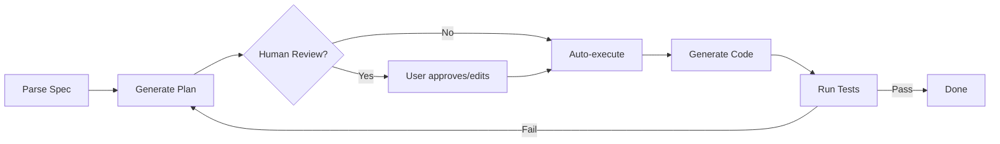
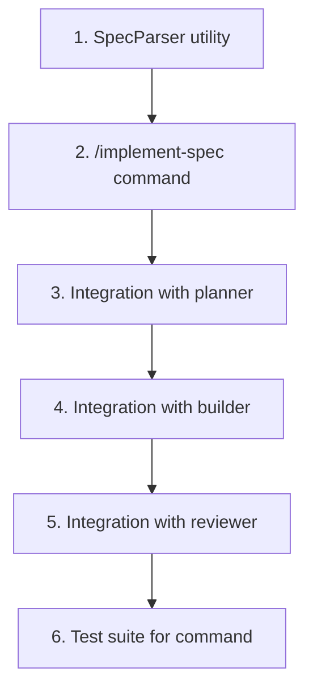

# Research: Implement Spec Command

> **Date**: 2026-01-21 | **Status**: Research Complete

## 1. Soluciones Existentes Analizadas

### 1.1 claude-code-spec-workflow (Pimzino)
**Source**: [GitHub](https://github.com/Pimzino/claude-code-spec-workflow)

| Aspecto | Detalle |
|---------|---------|
| **Workflow** | Requirements → Design → Tasks → Implementation |
| **Documentos por spec** | 4: Requirements, Design, Tasks, Commands |
| **Agentes** | 4 especializados: executor, requirements-validator, design-validator, task-validator |
| **Context optimization** | 60-80% token reduction via steering docs |
| **Commands** | `/spec-create`, `/spec-implement`, auto-generated per task |

**Estructura**:
```
.claude/
├── commands/          # Slash commands
├── steering/          # product.md, tech.md, structure.md
├── templates/         # Document templates
├── specs/             # Generated specifications
└── agents/            # AI agent definitions
```

**Key Insight**: Steering documents (`product.md`, `tech.md`, `structure.md`) mantienen contexto persistente.

---

### 1.2 Aider Architect Mode
**Source**: [aider.chat](https://aider.chat/2024/09/26/architect.html)

| Aspecto | Detalle |
|---------|---------|
| **Patrón** | Architect/Editor (2-step) |
| **Architect** | Resuelve el problema, propone cambios |
| **Editor** | Traduce propuesta a edits específicos |
| **Best combo** | o1-preview (Architect) + DeepSeek/o1-mini (Editor) = 85% SOTA |

**Workflow**:
```
User Request → Architect (planning LLM) → Proposal → Editor (editing LLM) → File Edits
```

**Key Insight**: Separar razonamiento de edición permite usar modelos especializados para cada tarea.

---

### 1.3 Cursor Plan Mode
**Source**: [Cursor Docs](https://cursor.com/agents)

| Aspecto | Detalle |
|---------|---------|
| **Plan Mode** | Genera plan editable en Markdown antes de ejecutar |
| **Skills** | Cargadas dinámicamente cuando relevantes |
| **Multi-agent** | Hasta 8 agentes simultáneos |
| **Separation** | Planning model ≠ Execution model |

**Workflow**:
```
Prompt → Plan Mode → Editable Markdown Plan → Review → Execute
```

**Key Insight**: Plan guardado en repo como `.md`, permite revisión humana antes de ejecución.

---

### 1.4 LangGraph Orchestrator-Worker
**Source**: [LangChain Docs](https://docs.langchain.com/oss/python/langgraph/workflows-agents)

| Aspecto | Detalle |
|---------|---------|
| **Patrón** | Orchestrator genera plan, Workers ejecutan partes |
| **Structured output** | Schema Pydantic/Zod para parsing |
| **Parallelism** | Workers ejecutan en paralelo |
| **Synthesis** | Task final combina outputs |

```python
@task
def orchestrator(topic: str):
    """Generates plan for the report"""
    return planner.invoke([...])  # Returns Sections schema

@task
def llm_call(section: Section):
    """Worker writes a section"""
    return llm.invoke([...])

@entrypoint()
def orchestrator_worker(topic: str):
    sections = orchestrator(topic).result()
    section_futures = [llm_call(s) for s in sections]  # Parallel
    return synthesizer([f.result() for f in section_futures])
```

**Key Insight**: Structured output con schemas fuerza consistencia en plan parsing.

---

### 1.5 Spec-Driven Development (SDD) - Industry Trend
**Sources**:
- [Thoughtworks](https://www.thoughtworks.com/insights/blog/agile-engineering-practices/spec-driven-development-unpacking-2025-new-engineering-practices)
- [Red Hat](https://developers.redhat.com/articles/2025/10/22/how-spec-driven-development-improves-ai-coding-quality)
- [Kinde](https://kinde.com/learn/ai-for-software-engineering/using-ai-for-apis/spec-driven-development-from-requirements-to-reliable-code-with-ai/)

| Principio | Aplicación |
|-----------|------------|
| **Specs como first-class artifacts** | Viven más que el código |
| **BDD como few-shot prompting** | Given-When-Then = ejemplos para LLM |
| **Multiple "how" specs** | Architecture, testing, security separados |
| **CI/CD validation** | Specs no son deterministas, validar siempre |

**Key Insight**: "Specs should live longer than the code; code becomes a by-product."

---

## 2. Patrones Clave Identificados

### 2.1 Separation of Concerns

| Step | Responsable | Output |
|------|-------------|--------|
| **Plan** | Architect/Planner LLM | Structured plan (tasks, files) |
| **Implement** | Builder/Editor LLM | Code edits |
| **Validate** | Reviewer/Evaluator | Pass/Fail + feedback |
| **Loop** | Orchestrator | Re-plan if failed |

### 2.2 Structured Output for Parsing

```typescript
// Schema forces consistent spec parsing
interface ParsedSpec {
  id: string;
  design: {
    types: CodeBlock[];
    api: Endpoint[];
    components: Component[];
  };
  bdd: GherkinScenario[];
  nextSteps: Task[];
}
```

### 2.3 Context Optimization

| Técnica | Beneficio |
|---------|-----------|
| Steering docs | Contexto compartido sin repetir |
| Template inheritance | Consistencia sin tokens extra |
| Lazy skill loading | Solo cargar cuando relevante |

### 2.4 Human-in-the-Loop



---

## 3. Alternativas de Implementación

### Alternativa A: Simple Command (Current)

```
/implement-spec SPEC-014 → Read spec → Generate code → Run tests
```

| Pro | Con |
|-----|-----|
| Simple | Sin revisión humana |
| Rápido | Sin structured parsing |
| Ya funciona | Sin separation of concerns |

**Effort**: Low | **Quality**: Medium

---

### Alternativa B: Architect/Editor Pattern

```
/implement-spec SPEC-014
  → Architect agent parses spec + generates plan
  → User reviews plan
  → Editor agent executes plan
  → Reviewer validates
  → Loop if failed
```

| Pro | Con |
|-----|-----|
| Separation of concerns | Más lento (2 LLM calls) |
| Human review | Más complejo |
| Better quality | Más tokens |

**Effort**: Medium | **Quality**: High

---

### Alternativa C: Full Orchestrator-Worker

```
/implement-spec SPEC-014
  → Planner agent creates task graph
  → Builder agents work in parallel
  → Reviewer validates each
  → Synthesizer combines
```

| Pro | Con |
|-----|-----|
| Parallel execution | Muy complejo |
| Scalable | Overhead para specs pequeñas |
| Best quality | Más tokens |

**Effort**: High | **Quality**: Very High

---

### Alternativa D: Hybrid (Recomendada)

```
/implement-spec SPEC-014 [--dry-run]

Phase 1 (Parse):
  → Read spec from .specs/
  → Parse sections (Design, BDD, Goals)
  → Extract structured data (types, endpoints, scenarios)

Phase 2 (Plan):
  → Generate implementation plan
  → Show plan to user (or --dry-run stops here)
  → User approves or edits

Phase 3 (Execute):
  → Generate types from Design
  → Generate implementation from Design
  → Generate tests from BDD

Phase 4 (Validate):
  → Run tests
  → If fail: show errors + suggestion
  → If pass: mark Next Steps complete
```

| Pro | Con |
|-----|-----|
| Human review optional | Medium complexity |
| Uses existing agents | - |
| Incremental (--dry-run) | - |
| Leverages our specs | - |

**Effort**: Medium | **Quality**: High

---

## 4. Decisiones Técnicas

### 4.1 Parsing de Specs

**Opción elegida**: Regex + Markdown AST

```typescript
interface SpecParser {
  parseDesign(content: string): {
    types: CodeBlock[];
    api: TableRow[];
    diagrams: MermaidBlock[];
  };

  parseBDD(content: string): GherkinScenario[];

  parseNextSteps(content: string): Task[];
}
```

### 4.2 Agentes a Usar

| Fase | Agente | Rol |
|------|--------|-----|
| Parse | `command-loader` | Lee spec, extrae secciones |
| Plan | `planner` | Genera roadmap de implementación |
| Execute | `builder` | Implementa código |
| Validate | `reviewer` | Valida código generado |

### 4.3 Output Locations

| Spec Type | Output |
|-----------|--------|
| Types | `server/src/types/` o `web/src/types/` |
| Services | `server/src/services/` |
| Stores | `web/src/store/slices/` |
| Components | `web/src/components/` |
| Tests | `*.test.ts` adjacent |

---

## 5. Recomendación Final

**Implementar Alternativa D (Hybrid)** con:

1. **Fase 1**: Crear `spec-parser` utility que extrae structured data
2. **Fase 2**: Integrar con `planner` agent para generar roadmap
3. **Fase 3**: Usar `builder` agent con skills relevantes
4. **Fase 4**: Validar con `reviewer` agent

### Implementation Order



### Estimated Complexity

| Component | Files | Complexity |
|-----------|-------|------------|
| SpecParser | 2 | Medium |
| Command update | 1 | Low |
| Planner integration | 1 | Medium |
| Builder integration | 1 | Low |
| Tests | 2 | Medium |
| **Total** | **7** | **Medium** |

---

## 6. Sources

- [claude-code-spec-workflow](https://github.com/Pimzino/claude-code-spec-workflow) - Full spec workflow
- [Aider Architect Mode](https://aider.chat/2024/09/26/architect.html) - Architect/Editor pattern
- [Cursor Agents](https://cursor.com/agents) - Plan Mode + Skills
- [LangGraph Workflows](https://docs.langchain.com/oss/python/langgraph/workflows-agents) - Orchestrator-Worker
- [Thoughtworks SDD](https://www.thoughtworks.com/insights/blog/agile-engineering-practices/spec-driven-development-unpacking-2025-new-engineering-practices) - Industry trends
- [Red Hat SDD](https://developers.redhat.com/articles/2025/10/22/how-spec-driven-development-improves-ai-coding-quality) - Best practices
- [Anthropic Claude Code Best Practices](https://www.anthropic.com/engineering/claude-code-best-practices) - Claude patterns
