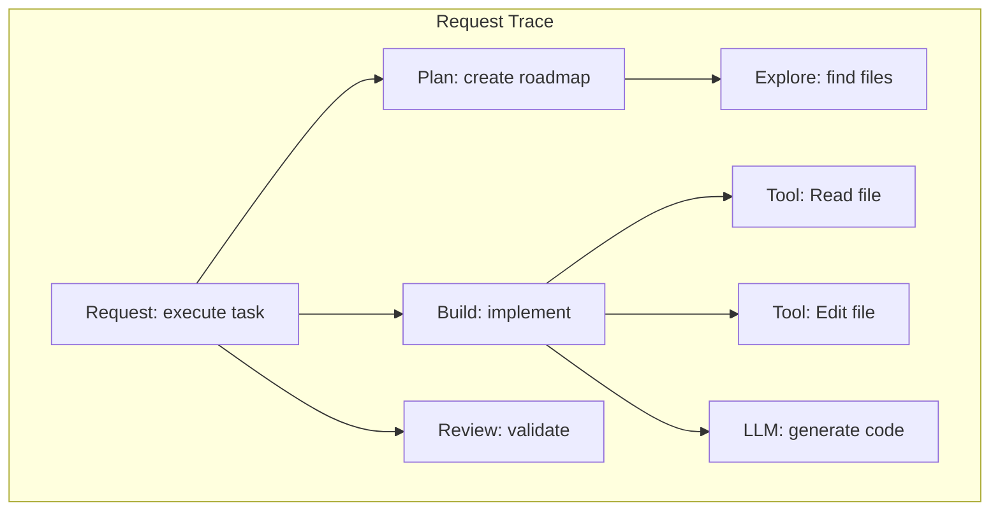
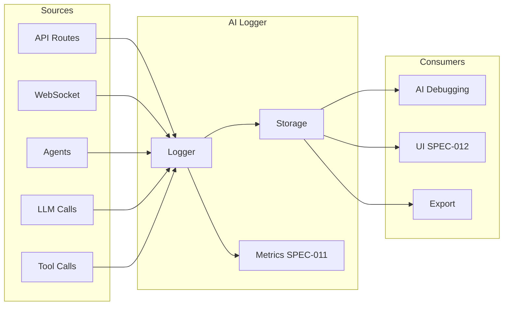

# SPEC-019: AI-Friendly Logging System

> **Status**: approved | **Version**: 1.0 | **Updated**: 2026-01-21

## 0. Research Summary

### Fuentes Consultadas

| Tipo | Fuente | Link | Relevancia |
|------|--------|------|------------|
| LLM Observability | Langfuse | [Link](https://langfuse.com/docs/observability/overview) | Alta |
| LLM Logging | Medium/Elementor | [Link](https://medium.com/elementor-engineers/why-logging-isnt-enough-for-llm-systems-and-how-observability-fixes-it-018e528e9f89) | Alta |
| Minimal Logger | smol-ai/logger | [Link](https://github.com/smol-ai/logger) | Alta |
| Log Analysis | Splunk | [Link](https://www.splunk.com/en_us/blog/learn/log-file-analysis-llms.html) | Media |
| Claude Debugging | Eesel.ai | [Link](https://www.eesel.ai/blog/debug-with-claude-code) | Media |

### Decisiones Informadas por Research

| Decisión | Basada en |
|----------|-----------|
| Structured JSON logs | Langfuse, Splunk - LLM needs structure |
| Trace hierarchies | Langfuse - traditional logs can't show call flows |
| Context preservation | Claude debugging article - context matters |
| Human + AI readable | smol-ai/logger - IDE as Log UI |
| Prompt/response pairs | Multiple sources - essential for LLM debugging |

### Información No Encontrada

- Benchmarks de formatos de log para Claude específicamente
- Optimal log verbosity levels for AI comprehension

### Confidence Assessment

| Área | Nivel | Razón |
|------|-------|-------|
| Structured logging | Alta | Industry consensus |
| Trace hierarchies | Alta | Langfuse docs |
| AI-specific formatting | Media | Less documented |

---

## 1. Vision

> **Press Release**: El AI-Friendly Logging System genera logs estructurados optimizados para que la IA pueda debuggear más efectivamente. Incluye traces jerárquicos, contexto de ejecución, y formato que tanto humanos como LLMs pueden parsear fácilmente.

**Background**:
- Los logs actuales son texto plano difícil de parsear
- Claude Code es más efectivo con logs detallados y estructurados
- Copilot fue criticado por mal manejo de logs ([jgandrews](https://jgandrews.com/posts/claude-and-copilot/))

**Usuario objetivo**: La IA (Claude) que necesita debuggear código + desarrolladores humanos.

**Métricas de éxito**:
- Reducir tiempo de debugging en 50%
- AI puede identificar root cause en <3 iteraciones
- Logs parseable tanto por humanos como por LLM

---

## 2. Goals & Non-Goals

### Goals

- [ ] Logs estructurados en JSON con schema consistente
- [ ] Trace hierarchies para llamadas anidadas
- [ ] Context preservation (qué se estaba haciendo)
- [ ] Prompt/response logging para LLM calls
- [ ] Error context con stack trace parseado
- [ ] Correlation IDs para seguir flujos
- [ ] Human-readable summary + machine-readable detail
- [ ] Integration con SPEC-011 (Thread Metrics)

### Non-Goals

- [ ] Log aggregation service (ELK, Datadog) - futuro
- [ ] Real-time log streaming a UI - ver SPEC-012
- [ ] Log rotation/archival policies
- [ ] PII masking automático - manual por ahora

---

## 3. Alternatives Considered

| Alternativa | Pros | Cons | Fuente | Decisión |
|-------------|------|------|--------|----------|
| **Custom structured** | Control total, optimizado para AI | Más trabajo | - | ✅ Elegida |
| Langfuse | Feature-rich, traces | SaaS, overhead | [Langfuse](https://langfuse.com) | ❌ Overkill para dev |
| Pino | Fast, JSON native | No AI-specific | - | ⚠️ Base library |
| Console.log | Simple | Unstructured, hard to parse | - | ❌ Current problem |

---

## 4. Design

### 4.1 Log Schema

```typescript
interface AILog {
  // Identity
  id: string;                    // Unique log ID (ULID)
  timestamp: string;             // ISO 8601
  level: 'debug' | 'info' | 'warn' | 'error' | 'fatal';

  // Context for AI
  context: {
    sessionId: string;           // Session being debugged
    threadId?: string;           // Thread from SPEC-011
    agentId?: string;            // Which agent (builder, reviewer, etc.)
    operation: string;           // What operation (e.g., "file.edit", "api.call")
    phase: string;               // Workflow phase (explore, plan, build, review)
  };

  // Human-readable
  message: string;               // Short description
  summary?: string;              // AI-generated summary for long logs

  // Machine-readable
  data: Record<string, unknown>; // Structured payload

  // For debugging
  trace?: TraceInfo;
  error?: ErrorInfo;

  // Relationships
  parentId?: string;             // Parent log for hierarchies
  correlationId?: string;        // Request correlation
  causedBy?: string;             // What triggered this
}

interface TraceInfo {
  spanId: string;
  parentSpanId?: string;
  duration?: number;             // ms
  status: 'started' | 'completed' | 'failed';
}

interface ErrorInfo {
  name: string;
  message: string;
  stack: string[];               // Parsed stack frames
  cause?: ErrorInfo;             // Nested cause
  context: {
    file?: string;
    line?: number;
    function?: string;
    args?: unknown[];
  };
}
```

### 4.2 Log Levels for AI

| Level | When | AI Behavior |
|-------|------|-------------|
| `debug` | Detailed internals | AI reads when debugging specific issues |
| `info` | Normal operations | AI scans for context |
| `warn` | Potential issues | AI investigates if related to error |
| `error` | Failures | AI focuses here first |
| `fatal` | System failures | AI reports immediately |

### 4.3 AI-Optimized Formatting

```typescript
// Example: Tool execution log

const log: AILog = {
  id: "01HX7...",
  timestamp: "2026-01-21T10:30:45.123Z",
  level: "info",

  context: {
    sessionId: "sess_abc123",
    threadId: "thread_xyz",
    agentId: "builder",
    operation: "tool.edit",
    phase: "build"
  },

  message: "Edit tool executed on src/services/auth.ts",

  data: {
    tool: "Edit",
    file: "src/services/auth.ts",
    changes: {
      linesAdded: 5,
      linesRemoved: 2,
      hunks: [
        { start: 45, end: 52, description: "Added JWT validation" }
      ]
    },
    duration: 234,
    success: true
  },

  trace: {
    spanId: "span_123",
    parentSpanId: "span_100",
    duration: 234,
    status: "completed"
  }
};
```

### 4.4 Error Logging for AI Debugging

```typescript
// Error log with parsed context

const errorLog: AILog = {
  id: "01HX8...",
  timestamp: "2026-01-21T10:31:00.456Z",
  level: "error",

  context: {
    sessionId: "sess_abc123",
    threadId: "thread_xyz",
    agentId: "builder",
    operation: "api.call",
    phase: "build"
  },

  message: "Claude API call failed with rate limit",

  data: {
    endpoint: "/v1/messages",
    statusCode: 429,
    retryAfter: 30,
    requestId: "req_abc"
  },

  error: {
    name: "RateLimitError",
    message: "Rate limit exceeded. Please retry after 30 seconds.",
    stack: [
      { file: "src/services/claude.ts", line: 145, function: "sendMessage" },
      { file: "src/services/orchestrator.ts", line: 89, function: "executeTask" },
      { file: "src/routes/api.ts", line: 34, function: "handleExecute" }
    ],
    context: {
      file: "src/services/claude.ts",
      line: 145,
      function: "sendMessage",
      args: ["prompt length: 2500 tokens"]
    }
  },

  // What AI should try
  summary: "Rate limit hit on Claude API. Retry after 30s or use fallback provider."
};
```

### 4.5 LLM Call Logging

```typescript
interface LLMCallLog extends AILog {
  data: {
    provider: 'claude' | 'openai' | 'xai';
    model: string;
    prompt: {
      system?: string;
      user: string;
      truncated: boolean;        // If prompt was truncated for log
      tokenEstimate: number;
    };
    response?: {
      content: string;
      truncated: boolean;
      tokenEstimate: number;
      finishReason: string;
    };
    metrics: {
      latency: number;
      inputTokens: number;
      outputTokens: number;
      cost?: number;
    };
    toolCalls?: Array<{
      name: string;
      input: unknown;
      output?: unknown;
    }>;
  };
}
```

### 4.6 Trace Hierarchy



```typescript
// Trace spans
const spans = [
  { spanId: "span_001", operation: "request.execute", parentSpanId: null },
  { spanId: "span_002", operation: "plan.create", parentSpanId: "span_001" },
  { spanId: "span_003", operation: "explore.files", parentSpanId: "span_002" },
  { spanId: "span_004", operation: "build.implement", parentSpanId: "span_001" },
  { spanId: "span_005", operation: "tool.read", parentSpanId: "span_004" },
  { spanId: "span_006", operation: "tool.edit", parentSpanId: "span_004" },
  { spanId: "span_007", operation: "llm.generate", parentSpanId: "span_004" },
  { spanId: "span_008", operation: "review.validate", parentSpanId: "span_001" },
];
```

### 4.7 Logger API

```typescript
// server/src/lib/ai-logger.ts

interface AILogger {
  // Basic logging
  debug(message: string, data?: Record<string, unknown>): void;
  info(message: string, data?: Record<string, unknown>): void;
  warn(message: string, data?: Record<string, unknown>): void;
  error(message: string, error: Error, data?: Record<string, unknown>): void;

  // Tracing
  startSpan(operation: string): Span;
  endSpan(span: Span, status: 'completed' | 'failed'): void;

  // Context
  withContext(context: Partial<AILog['context']>): AILogger;
  withCorrelation(correlationId: string): AILogger;

  // LLM specific
  logLLMCall(call: LLMCallLog['data']): void;
  logToolCall(tool: string, input: unknown, output: unknown): void;

  // Query (for AI to read)
  getLogs(filter: LogFilter): AILog[];
  getTrace(correlationId: string): AILog[];
  getErrors(since: Date): AILog[];
}

// Usage example
const logger = createAILogger();

const span = logger.startSpan('build.implement');
const buildLogger = logger.withContext({
  agentId: 'builder',
  phase: 'build'
});

buildLogger.info('Starting implementation', { taskId: 'task_123' });

try {
  // ... do work
  logger.endSpan(span, 'completed');
} catch (error) {
  buildLogger.error('Implementation failed', error, { taskId: 'task_123' });
  logger.endSpan(span, 'failed');
}
```

### 4.8 Log Storage

```
.claude/
├── logs/
│   ├── current.jsonl          # Current session logs (JSONL format)
│   ├── sessions/
│   │   └── {sessionId}.jsonl  # Per-session logs
│   └── errors/
│       └── {date}.jsonl       # Error logs aggregated by day
```

**JSONL Format** (one JSON per line):
```jsonl
{"id":"01HX7...","timestamp":"2026-01-21T10:30:45.123Z","level":"info",...}
{"id":"01HX8...","timestamp":"2026-01-21T10:30:46.456Z","level":"debug",...}
```

### 4.9 AI Query Interface

```typescript
// Commands for AI to query logs

// Get recent errors
const errors = logger.getErrors(new Date(Date.now() - 3600000)); // Last hour

// Get full trace for a request
const trace = logger.getTrace('corr_abc123');

// Filter logs
const buildLogs = logger.getLogs({
  level: ['info', 'warn', 'error'],
  agentId: 'builder',
  since: new Date(Date.now() - 600000), // Last 10 min
  operation: 'tool.*'
});
```

### 4.10 Integration Points



---

## 5. FAQ

**Q: ¿Por qué no usar Langfuse directamente?**
A: Es overkill para desarrollo local. Nuestro logger es más simple y optimizado para debugging con Claude Code. [Langfuse](https://langfuse.com) es mejor para producción con múltiples usuarios.

**Q: ¿Cuánto espacio ocupan los logs?**
A: ~1KB por log entry. Una sesión típica genera ~500 logs = 500KB. Rotamos diariamente.

**Q: ¿Cómo accede la IA a los logs?**
A: Via `logger.getLogs()` o leyendo `.claude/logs/current.jsonl` directamente.

**Q: ¿Se loggean prompts completos?**
A: Prompts largos se truncan a 500 chars en el log con flag `truncated: true`. Full content en archivo separado si es necesario.

---

## 6. Acceptance Criteria (BDD)

```gherkin
Feature: AI-Friendly Logging

Scenario: Structured log creation
  Given una operación de tool edit
  When se ejecuta el tool
  Then se crea un log con schema AILog
  And contiene context con sessionId, agentId, operation
  And es parseable como JSON

Scenario: Error logging with stack
  Given un error en claude.ts:145
  When se loggea el error
  Then stack trace está parseado en array
  And incluye file, line, function
  And incluye context con args

Scenario: Trace hierarchy
  Given una request con múltiples operaciones
  When completa la request
  Then todos los logs tienen correlationId común
  And spanIds forman jerarquía parent-child
  And se puede reconstruir el flujo

Scenario: AI can query errors
  Given múltiples errores en la última hora
  When AI llama logger.getErrors(lastHour)
  Then recibe array de AILog
  And están ordenados por timestamp
  And incluyen error context parseado

Scenario: LLM call logging
  Given una llamada a Claude API
  When la llamada completa
  Then se loggea prompt (truncado si largo)
  And se loggea response
  And se incluyen métricas (latency, tokens)
```

---

## 7. Open Questions

- [ ] ¿Nivel de verbosidad configurable por agente?
- [ ] ¿Auto-summarization de logs largos con LLM?
- [ ] ¿Exportar a formato que Langfuse pueda importar?

---

## 8. Sources

- [Langfuse - LLM Observability](https://langfuse.com/docs/observability/overview) - Trace hierarchies
- [Why Logging Isn't Enough for LLM Systems](https://medium.com/elementor-engineers/why-logging-isnt-enough-for-llm-systems-and-how-observability-fixes-it-018e528e9f89) - LLM-specific needs
- [smol-ai/logger](https://github.com/smol-ai/logger) - Minimal AI-friendly logger
- [Splunk - LLM Log Analysis](https://www.splunk.com/en_us/blog/learn/log-file-analysis-llms.html) - AI parsing logs
- [Debug with Claude Code](https://www.eesel.ai/blog/debug-with-claude-code) - Claude debugging patterns
- [Claude vs Copilot Logging](https://jgandrews.com/posts/claude-and-copilot/) - Logging differences

---

## 9. Next Steps

- [ ] Crear AILog types en `server/src/types/logging.ts`
- [ ] Implementar AILogger class
- [ ] Crear storage layer (JSONL files)
- [ ] Integrar en services existentes
- [ ] Crear query interface para AI
- [ ] Documentar log schema en CLAUDE.md
