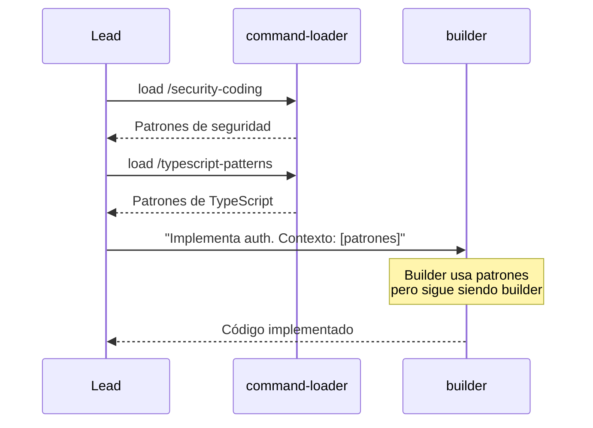
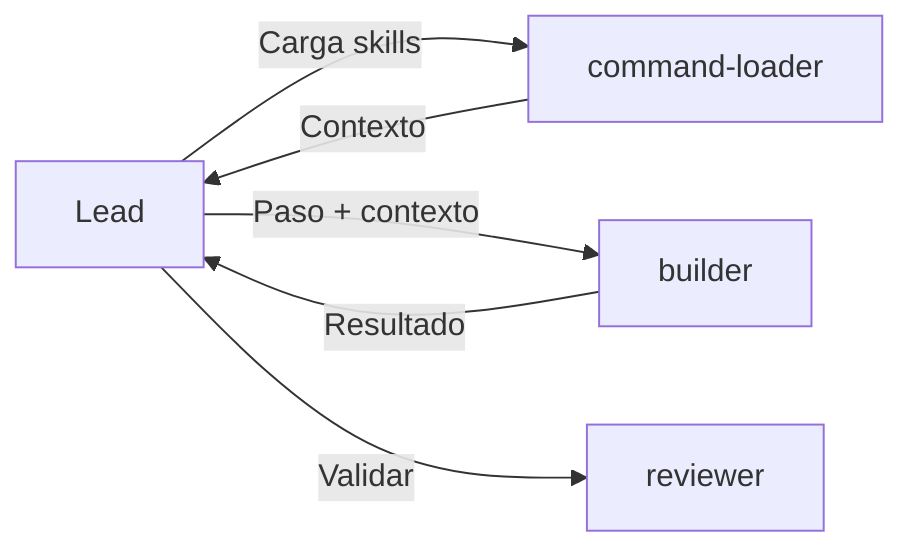

# Spec: Builder Agent

<!--
status: approved
priority: high
depends_on: [lead-llm-orchestrator, planner-agent]
enables: [reviewer-agent]
created: 2026-01-18
updated: 2026-01-18
version: 2.0
architecture: base-agents-plus-skills
-->

## 1. Vision

> Agente base de implementación que **ejecuta UN paso** del roadmap. Su comportamiento es inmutable; la especialización viene de **skills cargadas en contexto**.

**Cambio v2.0**: Ya no existen agentes especializados (refactor-agent, security-auditor). El builder es el único implementador, especializado vía skills.

## 2. Decisión

| Aspecto | Decisión |
|---------|----------|
| **Tipo** | Agente Base |
| **Nombre** | `builder` |
| **Model** | `sonnet` (balance velocidad/calidad) |
| **Tools** | Todas (puede escribir y ejecutar) |
| **Especialización** | Vía skills (typescript, security, refactoring, etc.) |

## 3. Comportamiento Base (INMUTABLE)

El builder SIEMPRE:
- Recibe UN paso del roadmap
- Implementa ESE paso
- Ejecuta tests del código que crea
- Devuelve resultado estructurado

El builder NUNCA:
- Planifica (eso es `planner`)
- Revisa código de otros (eso es `reviewer`)
- Decide qué implementar
- Modifica código no solicitado

## 4. Especialización vía Skills

### 4.1 Cómo Funciona



### 4.2 Skills Compatibles

| Skill | Cuándo el Lead la carga | Qué aporta |
|-------|-------------------------|------------|
| `typescript-patterns` | Código TypeScript | Async/await, types, interfaces |
| `bun-best-practices` | Código con Bun | APIs de Bun, Elysia patterns |
| `security-coding` | Auth, validation, data | OWASP coding, input validation |
| `refactoring-patterns` | Refactorizar código | SOLID, extract-function, clean code |
| `websocket-patterns` | Realtime features | Reconnection, message ordering |

### 4.3 Lo que NO Cambia con Skills

| Aspecto | Con/Sin Skills |
|---------|----------------|
| Tools disponibles | Siempre: Edit, Write, Bash, Read, Glob, Grep |
| Scope | Siempre: UN paso |
| Output format | Siempre: resultado estructurado |
| TDD enforcement | Siempre: test si crea función |
| Rol | Siempre: implementador |

## 5. Migración de Agentes Especializados

### Antes → Después

| Antes (agente separado) | Después (builder + skill) |
|-------------------------|---------------------------|
| `refactor-agent` | `builder` + skill:refactoring-patterns |
| `security-auditor` (modo impl) | `builder` + skill:security-coding |
| `expert:websocket` (modo impl) | `builder` + skill:websocket-patterns |

### Por qué Mejor

| Muchos Agentes | Builder + Skills |
|----------------|------------------|
| Lead elige entre 5+ implementadores | Lead siempre elige `builder` |
| Cada agente tiene su prompt | Un prompt base + contexto de skill |
| Duplicación de comportamiento | Comportamiento único |
| Difícil combinar especializaciones | Fácil: cargar múltiples skills |

## 6. Input Esperado

El Lead le pasa:
1. Paso específico del roadmap
2. Contexto de skills (si aplica)

```markdown
## Contexto de Skills

### security-coding
[Contenido expandido de la skill]

### typescript-patterns
[Contenido expandido de la skill]

---

## Paso a Implementar

**ID**: 2.1
**Archivo**: server/src/services/auth.ts
**Acción**: Create
**Descripción**: Servicio de autenticación JWT

### Requisitos
- Función `generateToken(user: User): string`
- Función `verifyToken(token: string): User | null`
- Usar librería `jose` ya instalada
- APLICAR patrones de security-coding del contexto

### Test requerido
- `auth.test.ts` con casos: token válido, token expirado, token inválido
```

## 7. Output Esperado

```markdown
## Resultado Paso 2.1

### Archivos Creados/Modificados
| Archivo | Acción | Líneas |
|---------|--------|--------|
| `server/src/services/auth.ts` | Created | 45 |
| `server/src/services/auth.test.ts` | Created | 32 |

### Skills Aplicadas
| Skill | Cómo se aplicó |
|-------|----------------|
| security-coding | Input validation en verifyToken |
| typescript-patterns | Async/await pattern, explicit return types |

### Tests Ejecutados
```
bun test server/src/services/auth.test.ts
✓ generateToken creates valid JWT (3ms)
✓ verifyToken returns user for valid token (2ms)
✓ verifyToken returns null for expired token (1ms)
✓ verifyToken returns null for invalid token (1ms)

4 pass | 0 fail
```

### Observaciones
- Usé `jose` como especificado
- Añadí validación de input según skill:security-coding

### Issues
- Ninguno
```

## 8. Invocación

```typescript
Task(
  subagent_type: "builder",
  description: "Implementar paso 2.1 - Auth service",
  prompt: `
    ## Contexto de Skills
    [Skills cargadas por el Lead]

    ## Paso a Implementar
    [Detalles del paso]
  `
)
```

## 9. Tools Permitidas

```yaml
allowed-tools:
  - Read
  - Glob
  - Grep
  - Edit
  - Write
  - Bash
  - mcp__context7__query-docs

disallowedTools:
  - Task  # No puede delegar
```

## 10. Reglas de Ejecución

### Antes de escribir código
1. `Read` archivo si existe (para Edit)
2. `Glob` para verificar estructura
3. Consultar Context7 si hay duda sobre API
4. Revisar skills en contexto para aplicar patrones

### Después de escribir código
1. Ejecutar `bun typecheck` en archivo
2. Ejecutar test si lo creó
3. Reportar skills aplicadas
4. Reportar resultado

### Si falla
- Reportar error exacto
- NO intentar múltiples fixes
- Devolver al Lead para decisión

## 11. Relación con Otros Agentes



## 12. Implementación

Crear archivo `.claude/agents/builder.md` con:
- Comportamiento base inmutable
- Sección de cómo aplicar skills del contexto
- Formato de output estructurado

---

**Status: APPROVED**
**Version: 2.0** - Arquitectura Base + Skills. Builder es el único implementador, especialización vía skills.
