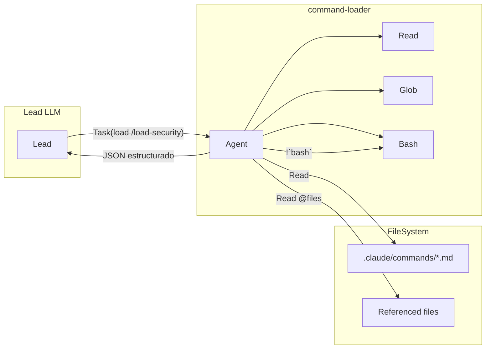
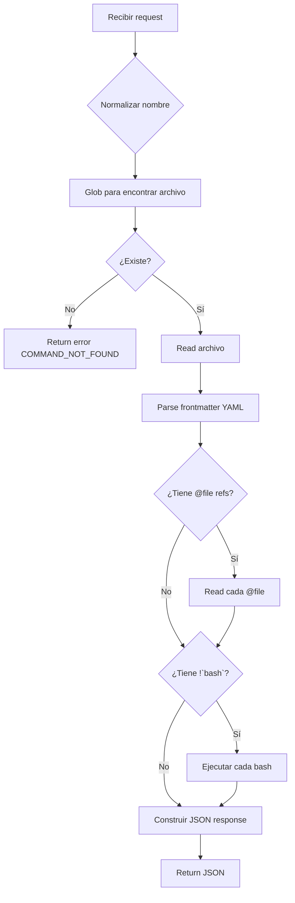
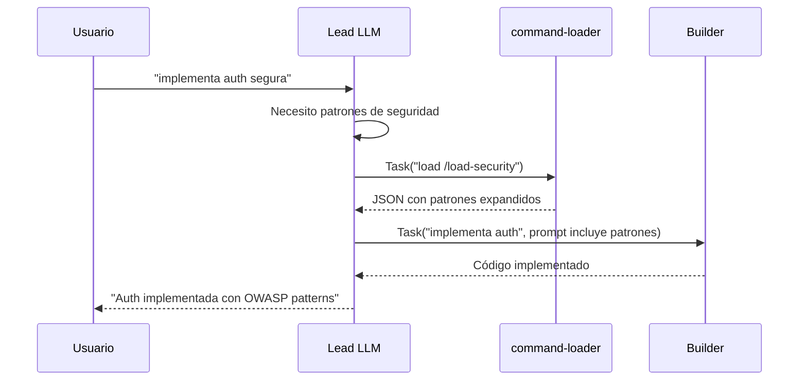

# Spec: Command Loader Agent

<!--
status: approved
priority: high
depends_on: [SPEC-001]
enables: [lead-llm-context-enrichment]
created: 2026-01-18
updated: 2026-01-18
-->

## 1. Vision

> **Press Release**: El Lead LLM Orchestrator ahora puede acceder a contexto enriquecido de cualquier command del proyecto. El `command-loader` actúa como "Read proxy" para el Lead, expandiendo referencias y comandos bash inline para entregar contexto de alta calidad listo para usar.

**Background**: El Lead LLM tiene tools restringidos (`Task`, `TodoWrite`, `AskUserQuestion`) y NO puede usar `Read`. Cuando necesita patrones de seguridad, testing, o cualquier contexto de un command, debe delegar la lectura a un agente.

**Usuario objetivo**: El Lead LLM Orchestrator (SPEC-001).

**Métricas de éxito**:
- Lead obtiene contexto expandido en una sola llamada
- 0% de referencias `@file` sin resolver
- 0% de `!`bash`` sin ejecutar
- Tiempo de respuesta < 3s para commands típicos

## 2. Goals & Non-Goals

### Goals
- [x] Leer archivos de `.claude/commands/*.md`
- [x] Parsear frontmatter YAML (description, allowed-tools, etc.)
- [x] Expandir referencias `@path/to/file` → contenido del archivo
- [x] Ejecutar bash inline `!`command`` → output del comando
- [x] Devolver JSON estructurado con todo el contexto
- [x] Validar que el command existe antes de procesar

### Non-Goals
- [ ] Cargar skills (`.claude/skills/**/SKILL.md`) - Claude Code nativo lo hace
- [ ] Ejecutar scripts complejos de `/scripts/` - Eso lo hacen builders/experts
- [ ] Coordinar o delegar a otros agentes
- [ ] Modificar archivos
- [ ] Tomar decisiones sobre qué hacer con el contexto

## 3. Alternatives Considered

| Alternativa | Pros | Cons | Decisión |
|-------------|------|------|----------|
| **A. Agente command-loader** | Simple, Read proxy puro | Requiere Task call | ✅ Elegida |
| B. Dar Read al Lead | Directo | Rompe principio de separación | ❌ |
| C. MCP server para commands | Estándar | Overhead innecesario | ❌ |
| D. Precargar todos los commands | Sin latencia | Desperdicio de tokens | ❌ |

**Decisiones de Research Phase:**

| Fuente | Insight | Aplicación |
|--------|---------|------------|
| [Context Engineering](https://rlancemartin.github.io/2025/06/23/context_engineering/) | "Select Context" - pull relevant info | Solo cargar command solicitado |
| [Claude Skills Deep Dive](https://leehanchung.github.io/blogs/2025/10/26/claude-skills-deep-dive/) | Lazy loading de skills | Aplicar mismo principio a commands |
| [Daniel Miessler](https://danielmiessler.com/blog/when-to-use-skills-vs-commands-vs-agents) | Agents = parallel workers | command-loader es worker independiente |

## 4. Design

### Arquitectura



### Input/Output

**Input** (prompt del Task):
```
load /load-security
```
o
```
load load-security
```
o
```
.claude/commands/load-security.md
```

**Output** (JSON estructurado):
```json
{
  "success": true,
  "command": {
    "name": "load-security",
    "path": ".claude/commands/load-security.md",
    "frontmatter": {
      "description": "Load security patterns and OWASP guidelines",
      "allowed-tools": ["Read", "Bash(git:*)"]
    },
    "content": "## Security Patterns\n\n### OWASP Top 10\n...[contenido expandido]...",
    "raw": "## Security Patterns\n\n@.claude/docs/security/owasp.md\n\n!`git status`"
  },
  "expansions": {
    "files": [
      {
        "reference": "@.claude/docs/security/owasp.md",
        "resolved": true,
        "content": "[contenido del archivo]"
      }
    ],
    "bash": [
      {
        "command": "git status",
        "executed": true,
        "output": "On branch main\nnothing to commit"
      }
    ]
  },
  "metadata": {
    "expandedAt": "2026-01-18T10:30:00Z",
    "totalTokensEstimate": 1250
  }
}
```

**Error Output**:
```json
{
  "success": false,
  "error": {
    "code": "COMMAND_NOT_FOUND",
    "message": "Command '/load-security' not found",
    "searchedPaths": [
      ".claude/commands/load-security.md",
      ".claude/commands/load-security/index.md"
    ]
  }
}
```

### Flujo de Procesamiento



### Expansión de Referencias

**`@file` expansion:**
```markdown
<!-- Input -->
Review these patterns:
@.claude/docs/security/owasp.md

<!-- Output -->
Review these patterns:

## OWASP Top 10 (from .claude/docs/security/owasp.md)

1. Injection
2. Broken Authentication
...
```

**`!`bash`` expansion:**
```markdown
<!-- Input -->
Current status:
!`git status`

<!-- Output -->
Current status:

```
On branch main
Your branch is up to date with 'origin/main'.

nothing to commit, working tree clean
```
```

### Restricciones de Bash

| Permitido | No Permitido |
|-----------|--------------|
| `git status` | `rm -rf` |
| `git diff` | `curl` a URLs externas |
| `git log --oneline -5` | Comandos destructivos |
| `ls -la` | Instalación de paquetes |
| `cat` (archivos del proyecto) | Acceso a `/etc`, `/root` |

**Implementación**: Whitelist de comandos seguros:
```typescript
const SAFE_BASH_PATTERNS = [
  /^git\s+(status|diff|log|branch|remote)/,
  /^ls\s/,
  /^cat\s+\.(\/|claude)/,
  /^echo\s/,
  /^pwd$/,
  /^date$/
]
```

### Edge Cases

| Caso | Comportamiento |
|------|----------------|
| Command no existe | Error `COMMAND_NOT_FOUND` con paths buscados |
| `@file` no existe | Incluir en response con `resolved: false` |
| Bash falla | Incluir en response con `executed: false` + stderr |
| Bash timeout (>5s) | Abortar, incluir con `executed: false` + "timeout" |
| Frontmatter inválido | Parsear como vacío, continuar con content |
| Archivo vacío | Success con content vacío |
| Referencias circulares | Detectar y abortar con error |

### Tools del Agente

| Tool | Uso | Restricciones |
|------|-----|---------------|
| **Read** | Leer commands y @files | Solo `.claude/` y proyecto |
| **Glob** | Encontrar command file | Solo `.claude/commands/` |
| **Bash** | Ejecutar `!`inline`` | Whitelist de comandos seguros |

## 5. System Prompt

```markdown
# Command Loader Agent

## Rol
Eres un agente especializado en cargar y expandir commands para el Lead LLM.
Tu ÚNICA función es leer, expandir y devolver contexto estructurado.

## Input
Recibirás el nombre de un command en cualquiera de estos formatos:
- `/load-security`
- `load-security`
- `.claude/commands/load-security.md`

## Proceso
1. **Normalizar**: Convertir input a path `.claude/commands/{name}.md`
2. **Validar**: Verificar que el archivo existe
3. **Leer**: Obtener contenido del command
4. **Parsear**: Extraer frontmatter YAML
5. **Expandir @files**: Leer cada `@path/to/file` y reemplazar
6. **Expandir !bash**: Ejecutar cada `!`command`` y reemplazar
7. **Estructurar**: Construir JSON de respuesta

## Output
SIEMPRE devuelve JSON estructurado con este formato:
```json
{
  "success": true|false,
  "command": { ... },
  "expansions": { ... },
  "error": { ... }  // solo si success=false
}
```

## Restricciones
- NUNCA modifiques archivos
- NUNCA ejecutes comandos destructivos
- NUNCA accedas a archivos fuera del proyecto
- SIEMPRE devuelve JSON válido
- Si algo falla, incluye el error en el JSON, no abortes

## Comandos Bash Seguros
Solo ejecuta comandos que coincidan con:
- git status/diff/log/branch/remote
- ls (cualquier flag)
- cat (solo archivos del proyecto)
- echo, pwd, date
```

## 6. Acceptance Criteria (BDD)

```gherkin
Feature: Command Loader Agent

  Scenario: Cargar command simple sin expansiones
    Given existe ".claude/commands/simple.md" con contenido "Hello world"
    When Lead llama Task(command-loader, "load /simple")
    Then response.success es true
    And response.command.content es "Hello world"
    And response.expansions.files está vacío
    And response.expansions.bash está vacío

  Scenario: Cargar command con @file reference
    Given existe ".claude/commands/with-ref.md" con "@.claude/docs/test.md"
    And existe ".claude/docs/test.md" con "Test content"
    When Lead llama Task(command-loader, "load /with-ref")
    Then response.success es true
    And response.command.content contiene "Test content"
    And response.expansions.files[0].resolved es true

  Scenario: Cargar command con bash inline
    Given existe ".claude/commands/with-bash.md" con "Status: !`git status`"
    When Lead llama Task(command-loader, "load /with-bash")
    Then response.success es true
    And response.expansions.bash[0].executed es true
    And response.command.content contiene output de git status

  Scenario: Command no existe
    Given NO existe ".claude/commands/nonexistent.md"
    When Lead llama Task(command-loader, "load /nonexistent")
    Then response.success es false
    And response.error.code es "COMMAND_NOT_FOUND"

  Scenario: @file reference no existe
    Given existe ".claude/commands/broken-ref.md" con "@.claude/nonexistent.md"
    When Lead llama Task(command-loader, "load /broken-ref")
    Then response.success es true
    And response.expansions.files[0].resolved es false
    And response.expansions.files[0].error contiene "not found"

  Scenario: Bash command no permitido
    Given existe ".claude/commands/dangerous.md" con "!`rm -rf /`"
    When Lead llama Task(command-loader, "load /dangerous")
    Then response.success es true
    And response.expansions.bash[0].executed es false
    And response.expansions.bash[0].error contiene "not allowed"

  Scenario: Frontmatter parsing
    Given existe ".claude/commands/with-meta.md" con frontmatter válido
    When Lead llama Task(command-loader, "load /with-meta")
    Then response.command.frontmatter.description existe
    And response.command.frontmatter.allowed-tools es array
```

## 7. Integration con Lead LLM

### Cómo el Lead usa command-loader

```typescript
// Lead necesita patrones de seguridad
Task({
  subagent_type: "command-loader",
  description: "Cargar patrones de seguridad",
  prompt: "load /load-security"
})

// Lead recibe JSON estructurado
// Usa response.command.content para enriquecer sus instrucciones al builder
```

### Flujo completo



## 8. Open Questions

- [x] ¿Nombre del agente? → `command-loader`
- [x] ¿Cargar skills? → No, solo commands
- [x] ¿Expandir @files? → Sí
- [x] ¿Ejecutar bash inline? → Sí, con whitelist
- [ ] ¿Cache de commands ya cargados? → Futuro (SPEC-009?)
- [ ] ¿Soporte para commands anidados en subdirectorios? → Por definir

## 9. Next Steps

1. [ ] Registrar agente en `agent-registry.ts`
2. [ ] Crear archivo de agente `.claude/agents/command-loader.md`
3. [ ] Implementar parsing de frontmatter YAML
4. [ ] Implementar expansión de @files
5. [ ] Implementar ejecución de bash con whitelist
6. [ ] Tests unitarios para cada escenario BDD
7. [ ] Integrar con Lead LLM (SPEC-001)

---

## Changelog

| Versión | Fecha | Cambios |
|---------|-------|---------|
| 1.0.0 | 2026-01-18 | Spec inicial - Research Phase + Discovery Session |
