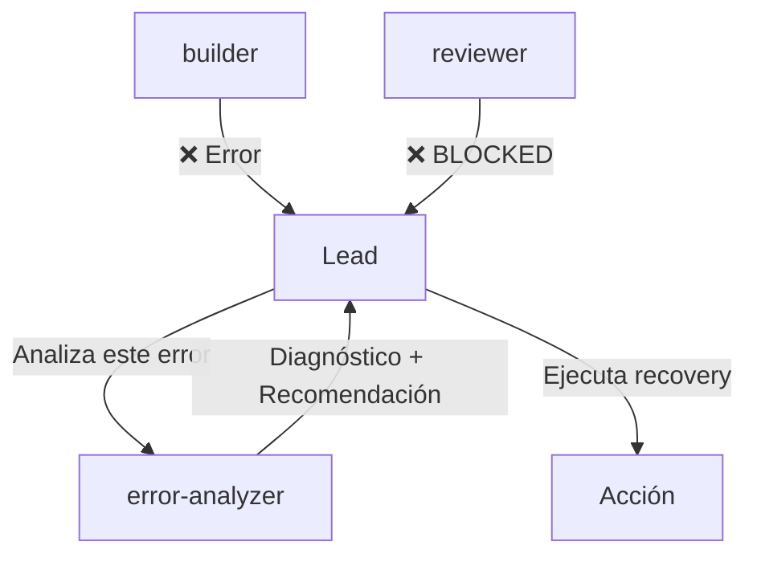
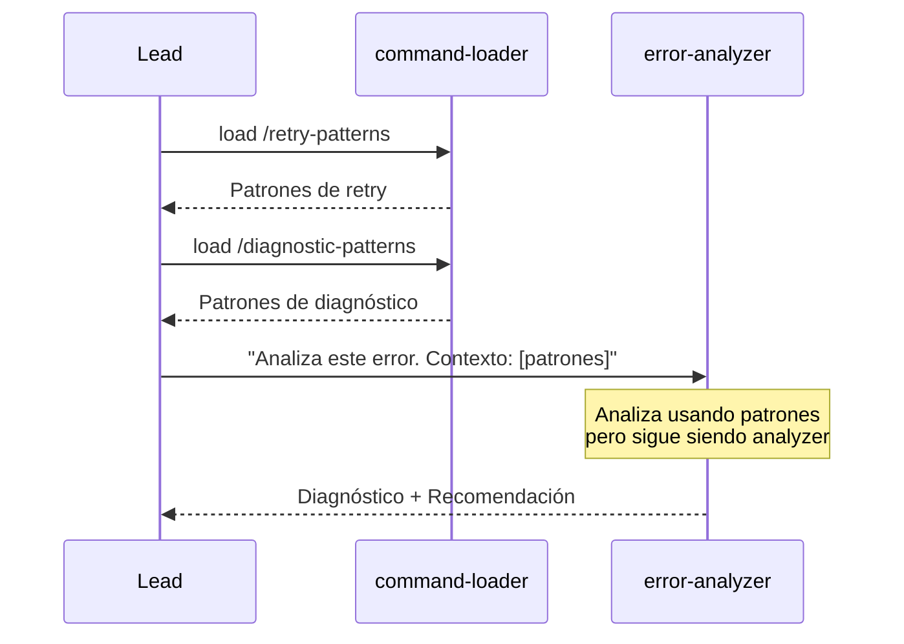
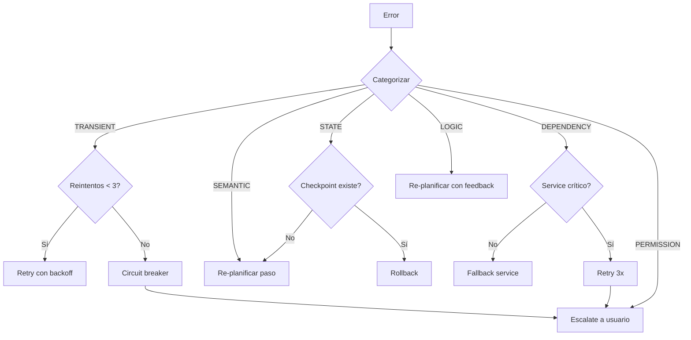
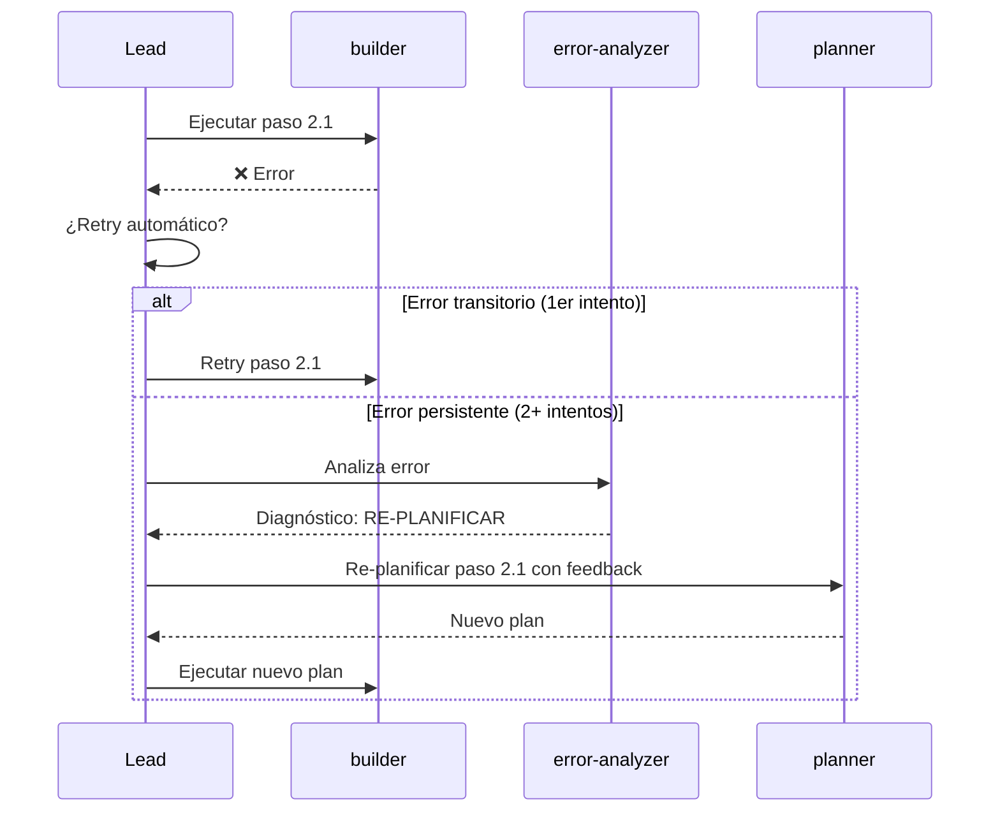
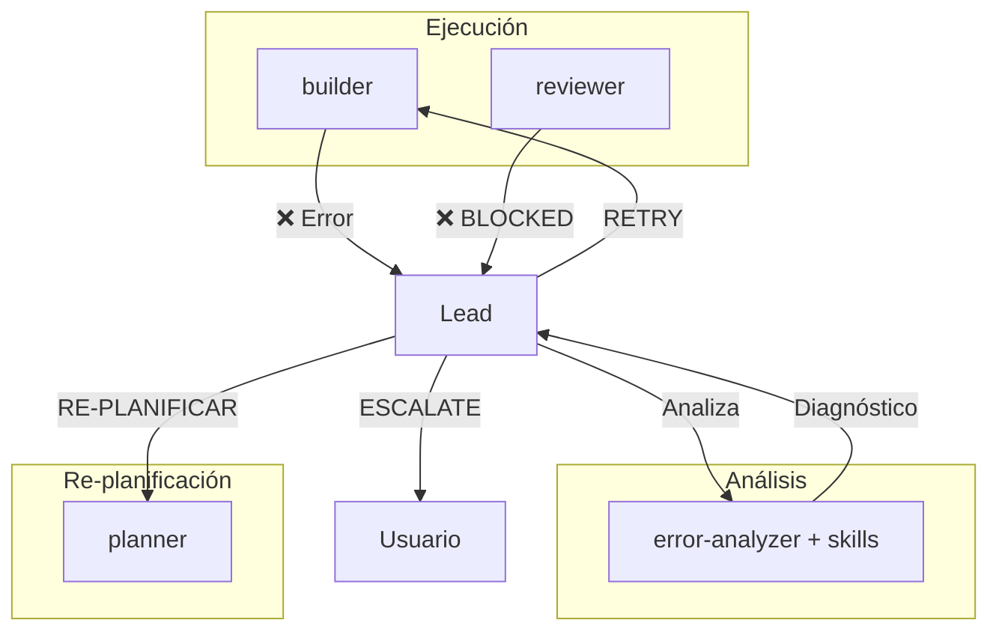

# Spec: Error Analyzer Agent

<!--
status: approved
priority: high
depends_on: [lead-llm-orchestrator]
enables: []
created: 2026-01-18
updated: 2026-01-18
version: 1.0
architecture: base-agents-plus-skills
-->

## 1. Vision

> Agente base de análisis de errores que diagnostica fallos y recomienda estrategias de recovery. Su comportamiento es inmutable; la especialización viene de **skills cargadas en contexto**. NUNCA implementa fixes, solo analiza y recomienda.

## 2. Decisión

| Aspecto | Decisión |
|---------|----------|
| **Tipo** | Agente Base |
| **Nombre** | `error-analyzer` |
| **Model** | `sonnet` (balance velocidad/calidad) |
| **Tools** | Read-only |
| **Especialización** | Vía skills (retry-patterns, diagnostic-patterns, etc.) |
| **Output** | Diagnóstico + Recomendación (Lead ejecuta) |

## 3. Comportamiento Base (INMUTABLE)

El error-analyzer SIEMPRE:
- Recibe error/fallo a analizar
- Diagnostica causa raíz
- Clasifica tipo de error
- Recomienda estrategia de recovery
- Devuelve análisis estructurado

El error-analyzer NUNCA:
- Implementa fixes
- Modifica código
- Ejecuta comandos destructivos
- Delega a otros agentes
- Decide por el Lead

## 4. Cuándo se Invoca



### Triggers

| Situación | Lead invoca error-analyzer |
|-----------|---------------------------|
| Builder falla al implementar | Sí |
| Reviewer da BLOCKED | Sí |
| Tests fallan repetidamente | Sí |
| Timeout en agente | Sí |
| Error de API/dependencia | Sí |

## 5. Especialización vía Skills

### 5.1 Cómo Funciona



### 5.2 Skills Compatibles

| Skill | Cuándo el Lead la carga | Qué aporta |
|-------|-------------------------|------------|
| `retry-patterns` | Errores transitorios | Exponential backoff, circuit breaker |
| `diagnostic-patterns` | Errores complejos | Root cause analysis, error taxonomy |
| `recovery-strategies` | Fallos de workflow | Checkpoint, rollback, escalation |

### 5.3 Lo que NO Cambia con Skills

| Aspecto | Con/Sin Skills |
|---------|----------------|
| Tools disponibles | Siempre: Read, Glob, Grep (read-only) |
| Output format | Siempre: diagnóstico estructurado |
| Rol | Siempre: analista (no implementador) |
| Acción | Siempre: recomendar (Lead ejecuta) |

## 6. Taxonomía de Errores

### 6.1 Categorías

| Categoría | Descripción | Ejemplos |
|-----------|-------------|----------|
| **TRANSIENT** | Error temporal, retry puede funcionar | Network timeout, rate limit |
| **SEMANTIC** | Output incorrecto, no error técnico | Código genera pero está mal |
| **STATE** | Estado diverge de esperado | Archivo no existe, variable undefined |
| **DEPENDENCY** | Servicio externo falla | API down, DB connection |
| **LOGIC** | Error en la lógica del código | Bug, edge case no manejado |
| **PERMISSION** | Falta de permisos | File access denied |

### 6.2 Severidad

| Nivel | Descripción | Acción típica |
|-------|-------------|---------------|
| **LOW** | Recuperable automáticamente | Retry |
| **MEDIUM** | Requiere intervención menor | Re-planificar paso |
| **HIGH** | Requiere cambio de approach | Re-planificar workflow |
| **CRITICAL** | Requiere intervención humana | Escalate |

## 7. Estrategias de Recovery

### 7.1 Por Tipo de Error

| Categoría | Estrategia Primaria | Estrategia Fallback |
|-----------|---------------------|---------------------|
| TRANSIENT | Retry con backoff | Circuit breaker → Escalate |
| SEMANTIC | Re-planificar paso | Cambiar agente/skill |
| STATE | Verificar estado real | Rollback a checkpoint |
| DEPENDENCY | Retry → Fallback service | Escalate |
| LOGIC | Re-planificar con feedback | Pedir más contexto |
| PERMISSION | Verificar permisos | Escalate |

### 7.2 Diagrama de Decisión



## 8. Input Esperado

```markdown
## Contexto de Skills

### retry-patterns
[Patrones de retry expandidos]

### diagnostic-patterns
[Patrones de diagnóstico expandidos]

---

## Error a Analizar

### Fuente
- Agente: builder
- Paso: 2.1 - Crear auth service
- Intento: 2 de 3

### Error
```
TypeError: Cannot read property 'sign' of undefined
    at generateToken (auth.ts:23)
    at Object.<anonymous> (auth.test.ts:15)
```

### Contexto
- Archivo: server/src/services/auth.ts
- Línea: 23
- Librería esperada: jose
- Código relevante: [snippet]

### Historial
- Intento 1: Mismo error
- Intento 2: Mismo error
```

## 9. Output Esperado

```markdown
## Error Analysis

### Clasificación
| Campo | Valor |
|-------|-------|
| Categoría | DEPENDENCY |
| Severidad | MEDIUM |
| Recuperable | Sí, con cambio de approach |

### Diagnóstico

#### Causa Raíz
La librería `jose` no está importada correctamente. El error indica que `jose` es `undefined` en el scope donde se llama `.sign()`.

#### Evidencia
- Línea 23 usa `jose.sign()` pero `jose` no está definido
- El import puede estar mal escrito o la librería no instalada

#### Análisis de Patrones (skill: diagnostic-patterns)
- Patrón: "undefined property access" → típico de import faltante
- No es error transitorio (mismo error en 2 intentos)

### Recomendación

#### Estrategia: RE-PLANIFICAR
| Acción | Detalle |
|--------|---------|
| Tipo | Re-planificar paso 2.1 |
| Razón | Error de dependencia, no de implementación |
| Skill sugerida | bun-best-practices (imports de Bun) |

#### Pasos Concretos
1. Verificar que `jose` está en package.json
2. Verificar import correcto: `import * as jose from 'jose'`
3. Re-ejecutar paso 2.1 con skill:bun-best-practices

#### Alternativas
| Alternativa | Cuándo |
|-------------|--------|
| Usar otra librería (jsonwebtoken) | Si jose no compatible con Bun |
| Implementar JWT manual | Si ninguna librería funciona |

### Confianza
| Aspecto | Nivel | Razón |
|---------|-------|-------|
| Diagnóstico | Alta | Error claro, patrón conocido |
| Recomendación | Media | Depende de si jose es compatible |

### Acción del Lead
🔄 **RE-PLANIFICAR** paso 2.1 con feedback de este análisis
```

## 10. Tools Permitidas

```yaml
allowed-tools:
  - Read
  - Glob
  - Grep
  # Para investigar el error

disallowedTools:
  - Edit
  - Write
  - Bash  # No ejecutar nada
  - Task  # No delegar
```

## 11. Invocación

```typescript
Task(
  subagent_type: "error-analyzer",
  description: "Analizar error en builder paso 2.1",
  prompt: `
    ## Contexto de Skills

    ### retry-patterns
    [Skill content]

    ### diagnostic-patterns
    [Skill content]

    ---

    ## Error a Analizar

    ### Fuente
    - Agente: builder
    - Paso: 2.1

    ### Error
    [Error message]

    ### Contexto
    [Relevant code and state]
  `
)
```

## 12. Integración con Lead

### 12.1 Flujo Completo



### 12.2 Reglas del Lead

| Condición | Acción |
|-----------|--------|
| 1er error transitorio | Retry automático |
| 2do error mismo tipo | Invocar error-analyzer |
| Error CRITICAL | Invocar error-analyzer → Escalate |
| Diagnóstico: RETRY | Lead hace retry |
| Diagnóstico: RE-PLANIFICAR | Lead invoca planner |
| Diagnóstico: ESCALATE | Lead pregunta al usuario |

## 13. Relación con Otros Agentes



## 14. Implementación

Crear archivo `.claude/agents/error-analyzer.md` con:
- Comportamiento base inmutable
- Taxonomía de errores
- Estrategias de recovery
- Formato de output estructurado
- Sección de cómo aplicar skills del contexto

---

**Status: APPROVED**
**Version: 1.0** - Arquitectura Base + Skills. Agente base de análisis de errores con especialización vía skills.
