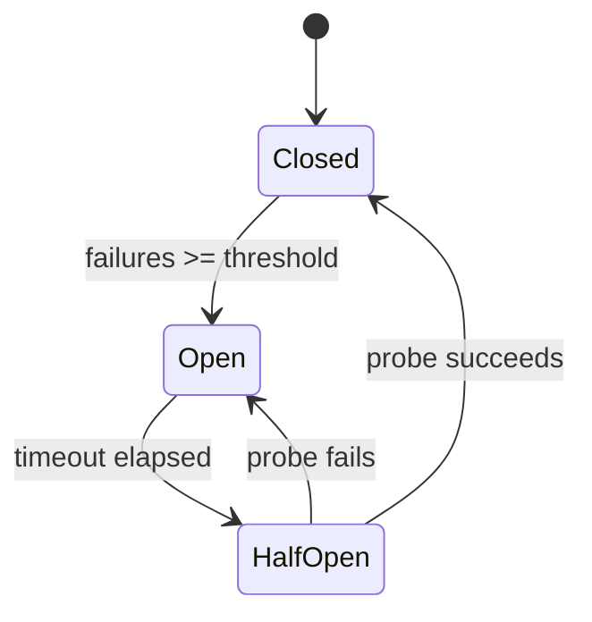
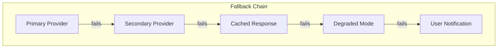

# SPEC-016: Error Recovery & Resilience

> **Status**: approved | **Version**: 1.0 | **Updated**: 2026-01-21

## 0. Research Summary

### Fuentes Consultadas

| Tipo | Fuente | Link | Relevancia |
|------|--------|------|------------|
| LLM patterns | Portkey.ai | [Link](https://portkey.ai/blog/retries-fallbacks-and-circuit-breakers-in-llm-apps/) | Alta |
| Multi-agent | Galileo.ai | [Link](https://galileo.ai/blog/multi-agent-ai-system-failure-recovery) | Alta |
| Circuit breaker | Microsoft Azure | [Link](https://learn.microsoft.com/en-us/azure/architecture/patterns/circuit-breaker) | Alta |
| MCP resilience | Octopus.com | [Link](https://octopus.com/blog/mcp-timeout-retry) | Alta |
| Fail-safe patterns | Engineers Meet AI | [Link](https://engineersmeetai.substack.com/p/fail-safe-patterns-for-ai-agent-workflows) | Alta |

### Decisiones Informadas por Research

| Decisión | Basada en |
|----------|-----------|
| Layered approach: Retry → Fallback → Circuit Breaker | Portkey.ai - standard LLM pattern |
| Exponential backoff + jitter | SparkCo.ai - prevents thundering herd |
| Adaptive circuit breaker thresholds | Galileo.ai - AI systems change over time |
| Agent-level isolation | Galileo.ai - contain failures per agent |
| Graceful degradation to simpler agents | Engineers Meet AI - chain-of-responsibility |

### Confidence Assessment

| Área | Nivel | Razón |
|------|-------|-------|
| Retry patterns | Alta | Well-established, múltiples fuentes |
| Circuit breaker | Alta | Microsoft + otros |
| Multi-agent recovery | Media | Relativamente nuevo, menos ejemplos |

---

## 1. Vision

> **Press Release**: El sistema de Error Recovery proporciona resiliencia automática para el orquestador, con retry inteligente, circuit breakers por agente, y fallback a modos degradados cuando los servicios fallan.

**Background**: Actualmente los errores de API o agentes causan fallas silenciosas o loops infinitos.

**Usuario objetivo**: Sistema (automático) + desarrolladores (visibilidad).

**Métricas de éxito**:
- 90% de errores transitorios se recuperan automáticamente
- Circuit breaker previene >95% de llamadas a servicios caídos
- Tiempo de recovery <30s para errores típicos

---

## 2. Goals & Non-Goals

### Goals

- [ ] Retry con exponential backoff + jitter para API calls
- [ ] Circuit breaker por provider (Claude/OpenAI/XAI)
- [ ] Circuit breaker por agente (builder/reviewer/planner)
- [ ] Fallback chain: primary → secondary → cached/degraded
- [ ] Timeout handling para tool calls largos
- [ ] Error classification (transient vs permanent)
- [ ] Recovery UI feedback (SPEC-013 integration)

### Non-Goals

- [ ] Auto-healing de código (ya lo hace SPEC-010)
- [ ] Recovery de errores de negocio (lógica incorrecta)
- [ ] Multi-region failover
- [ ] Automatic provider switching sin user consent

---

## 3. Alternatives Considered

| Alternativa | Pros | Cons | Fuente | Decisión |
|-------------|------|------|--------|----------|
| **Custom implementation** | Control total, no deps | Más código | - | ✅ Elegida |
| Resilience4j (Java) | Battle-tested | Wrong ecosystem | [Mobisoftinfotech](https://mobisoftinfotech.com/resources/blog/microservices/resilience4j-circuit-breaker-retry-bulkhead-spring-boot/) | ❌ Java only |
| cockatiel (TS) | TS native | Limited features | - | ❌ Insufficient |
| Temporal.io | Distributed, durable | Heavy, SaaS | [Temporal](https://temporal.io/blog/error-handling-in-distributed-systems) | ❌ Overkill |

---

## 4. Design

### 4.1 Error Classification

```typescript
enum ErrorCategory {
  // Transient - retry
  RATE_LIMIT = 'rate_limit',           // 429
  TIMEOUT = 'timeout',                  // Request timeout
  NETWORK = 'network',                  // Connection issues
  SERVICE_UNAVAILABLE = 'unavailable',  // 503

  // Permanent - don't retry
  AUTH_ERROR = 'auth',                  // 401, 403
  INVALID_REQUEST = 'invalid',          // 400
  NOT_FOUND = 'not_found',              // 404
  CONTEXT_OVERFLOW = 'overflow',        // Token limit

  // Agent-specific
  TOOL_ERROR = 'tool_error',            // Tool execution failed
  AGENT_CRASH = 'agent_crash',          // Agent process died
  VALIDATION_FAILED = 'validation',     // SPEC-010 hook failed
}

interface ClassifiedError {
  category: ErrorCategory;
  isRetryable: boolean;
  suggestedDelay: number;
  maxRetries: number;
  message: string;
  originalError: Error;
}
```

### 4.2 Retry Strategy

```typescript
interface RetryConfig {
  maxAttempts: number;           // Default: 3
  initialDelayMs: number;        // Default: 1000
  maxDelayMs: number;            // Default: 30000
  backoffMultiplier: number;     // Default: 2
  jitterFactor: number;          // Default: 0.2 (20%)
}

// Exponential backoff with jitter
function calculateDelay(attempt: number, config: RetryConfig): number {
  const exponentialDelay = config.initialDelayMs * Math.pow(config.backoffMultiplier, attempt);
  const cappedDelay = Math.min(exponentialDelay, config.maxDelayMs);
  const jitter = cappedDelay * config.jitterFactor * (Math.random() * 2 - 1);
  return Math.max(0, cappedDelay + jitter);
}

// Usage
async function withRetry<T>(
  operation: () => Promise<T>,
  config: RetryConfig = DEFAULT_RETRY_CONFIG
): Promise<T> {
  let lastError: Error;

  for (let attempt = 0; attempt < config.maxAttempts; attempt++) {
    try {
      return await operation();
    } catch (error) {
      const classified = classifyError(error);

      if (!classified.isRetryable) {
        throw error;
      }

      lastError = error;
      const delay = calculateDelay(attempt, config);

      emit('retry', { attempt, delay, error: classified });
      await sleep(delay);
    }
  }

  throw lastError;
}
```

### 4.3 Circuit Breaker



```typescript
interface CircuitBreakerConfig {
  failureThreshold: number;      // Default: 5
  successThreshold: number;      // Default: 2
  timeout: number;               // Default: 30000ms
  volumeThreshold: number;       // Min calls before opening: 10
}

type CircuitState = 'closed' | 'open' | 'half-open';

interface CircuitBreaker {
  name: string;
  state: CircuitState;
  failures: number;
  successes: number;
  lastFailure: number;

  // Methods
  execute<T>(operation: () => Promise<T>): Promise<T>;
  recordSuccess(): void;
  recordFailure(): void;
  reset(): void;
}

// Per-provider circuit breakers
const providerCircuits = {
  claude: createCircuitBreaker('claude'),
  openai: createCircuitBreaker('openai'),
  xai: createCircuitBreaker('xai'),
};

// Per-agent circuit breakers
const agentCircuits = {
  builder: createCircuitBreaker('builder'),
  reviewer: createCircuitBreaker('reviewer'),
  planner: createCircuitBreaker('planner'),
  'error-analyzer': createCircuitBreaker('error-analyzer'),
};
```

### 4.4 Fallback Chain



```typescript
interface FallbackChain<T> {
  primary: () => Promise<T>;
  fallbacks: Array<{
    name: string;
    operation: () => Promise<T>;
    condition?: (error: Error) => boolean;
  }>;
  degraded?: () => T;
}

async function withFallback<T>(chain: FallbackChain<T>): Promise<T> {
  try {
    return await chain.primary();
  } catch (primaryError) {
    for (const fallback of chain.fallbacks) {
      if (fallback.condition && !fallback.condition(primaryError)) {
        continue;
      }

      try {
        emit('fallback', { to: fallback.name, from: 'primary' });
        return await fallback.operation();
      } catch (fallbackError) {
        continue;
      }
    }

    if (chain.degraded) {
      emit('degraded', { reason: primaryError.message });
      return chain.degraded();
    }

    throw primaryError;
  }
}
```

### 4.5 Agent Recovery Patterns

```typescript
// Agent-level isolation
interface AgentExecutionContext {
  agentId: string;
  circuitBreaker: CircuitBreaker;
  retryConfig: RetryConfig;
  timeout: number;
  fallbackAgent?: string;  // Simpler agent to fallback to
}

// Chain of responsibility: complex → simple
const agentFallbackChain = {
  builder: ['builder-simple', 'manual-mode'],
  reviewer: ['reviewer-quick', 'skip-review'],
  planner: ['planner-simple', 'no-plan'],
};

// Graceful degradation
async function executeWithRecovery(
  agent: string,
  task: Task,
  context: AgentExecutionContext
): Promise<Result> {
  const circuit = context.circuitBreaker;

  if (circuit.state === 'open') {
    // Try fallback immediately
    if (context.fallbackAgent) {
      return executeAgent(context.fallbackAgent, task);
    }
    throw new CircuitOpenError(agent);
  }

  try {
    const result = await withRetry(
      () => withTimeout(
        () => executeAgent(agent, task),
        context.timeout
      ),
      context.retryConfig
    );

    circuit.recordSuccess();
    return result;

  } catch (error) {
    circuit.recordFailure();

    // Try fallback chain
    const fallbacks = agentFallbackChain[agent] || [];
    for (const fallback of fallbacks) {
      try {
        emit('agent-fallback', { from: agent, to: fallback });
        return await executeAgent(fallback, task);
      } catch {
        continue;
      }
    }

    throw error;
  }
}
```

### 4.6 Timeout Handling

```typescript
interface TimeoutConfig {
  default: number;           // 30000ms
  byOperation: {
    'llm-call': number;      // 60000ms
    'tool-execution': number; // 120000ms
    'file-read': number;      // 5000ms
    'web-fetch': number;      // 30000ms
  };
}

async function withTimeout<T>(
  operation: () => Promise<T>,
  timeoutMs: number
): Promise<T> {
  const timeoutPromise = new Promise<never>((_, reject) => {
    setTimeout(() => {
      reject(new TimeoutError(`Operation timed out after ${timeoutMs}ms`));
    }, timeoutMs);
  });

  return Promise.race([operation(), timeoutPromise]);
}
```

### 4.7 Recovery Events (for UI)

```typescript
// Events emitted during recovery
type RecoveryEvent =
  | { type: 'retry'; attempt: number; delay: number; error: ClassifiedError }
  | { type: 'circuit-state-change'; circuit: string; from: CircuitState; to: CircuitState }
  | { type: 'fallback'; from: string; to: string }
  | { type: 'degraded'; reason: string }
  | { type: 'recovered'; after: number; attempts: number }
  | { type: 'failed'; error: ClassifiedError; exhausted: boolean };

// Integration with SPEC-013 (Validation Hooks UI)
// These events appear in the UI as recovery indicators
```

### 4.8 Resilience Manager

```typescript
// server/src/services/resilience-manager.ts
interface ResilienceManager {
  // Circuit breakers
  getCircuit(name: string): CircuitBreaker;
  getCircuitStates(): Record<string, CircuitState>;
  resetCircuit(name: string): void;
  resetAllCircuits(): void;

  // Execution wrappers
  executeWithResilience<T>(
    operation: () => Promise<T>,
    options: ResilienceOptions
  ): Promise<T>;

  // Metrics
  getMetrics(): ResilienceMetrics;

  // Events
  on(event: string, handler: (data: RecoveryEvent) => void): void;
}

interface ResilienceMetrics {
  totalAttempts: number;
  successfulRetries: number;
  failedRetries: number;
  circuitOpens: number;
  fallbacksUsed: number;
  avgRecoveryTime: number;
}
```

---

## 5. FAQ

**Q: ¿Qué pasa si todos los providers fallan?**
A: Circuit breakers se abren para todos. Usuario ve mensaje de degraded mode. Puede intentar manualmente después.

**Q: ¿Se puede desactivar retry para debugging?**
A: Sí, `RESILIENCE_ENABLED=false` en env vars.

**Q: ¿Cómo afecta al rate limit de APIs?**
A: Retry con backoff respeta rate limits. Si es 429, delay es el suggested por la API.

**Q: ¿Circuit breaker es global o por sesión?**
A: Global por provider/agent. Si Claude falla para un usuario, se abre para todos.

---

## 6. Acceptance Criteria (BDD)

```gherkin
Feature: Error Recovery & Resilience

Scenario: Retry en error transitorio
  Given una llamada a Claude API
  When retorna 503 Service Unavailable
  Then se reintenta hasta 3 veces
  And cada retry tiene exponential backoff
  And el UI muestra "Retrying... (2/3)"

Scenario: Circuit breaker se abre
  Given 5 errores consecutivos en Claude API
  When se intenta una nueva llamada
  Then el circuit breaker está open
  And la llamada falla inmediatamente
  And se intenta el fallback (OpenAI si configurado)

Scenario: Circuit breaker se recupera
  Given circuit breaker en estado open
  When pasan 30 segundos
  Then el estado cambia a half-open
  And la próxima llamada es un probe
  And si tiene éxito, vuelve a closed

Scenario: Fallback a agente más simple
  Given builder agent con error
  When se agota retry
  Then se intenta builder-simple
  And si falla, se notifica al usuario

Scenario: Timeout en tool execution
  Given un tool call ejecutándose
  When excede 120 segundos
  Then se cancela con TimeoutError
  And se clasifica como retryable
```

---

## 7. Open Questions

- [ ] ¿Persistir estado de circuit breakers entre reinicios?
- [ ] ¿Adaptive thresholds basados en histórico?
- [ ] ¿Rate limiting propio además del de providers?

---

## 8. Sources

- [Portkey.ai - Retries, Fallbacks, Circuit Breakers](https://portkey.ai/blog/retries-fallbacks-and-circuit-breakers-in-llm-apps/) - LLM-specific patterns
- [Galileo.ai - Multi-Agent Failure Recovery](https://galileo.ai/blog/multi-agent-ai-system-failure-recovery) - Agent isolation
- [Microsoft Azure - Circuit Breaker Pattern](https://learn.microsoft.com/en-us/azure/architecture/patterns/circuit-breaker) - Standard pattern
- [Octopus - MCP Timeout & Retry](https://octopus.com/blog/mcp-timeout-retry) - MCP-specific
- [Engineers Meet AI - Fail-Safe Patterns](https://engineersmeetai.substack.com/p/fail-safe-patterns-for-ai-agent-workflows) - Agent workflows
- [SparkCo - Retry Logic Agents](https://sparkco.ai/blog/mastering-retry-logic-agents-a-deep-dive-into-2025-best-practices) - 2025 best practices

---

## 9. Next Steps

- [ ] Implementar error classifier
- [ ] Crear retry wrapper con backoff + jitter
- [ ] Implementar CircuitBreaker class
- [ ] Crear ResilienceManager service
- [ ] Integrar con providers (Claude, OpenAI, XAI)
- [ ] Integrar con agent execution
- [ ] Emitir eventos para UI (SPEC-013)
- [ ] Añadir métricas a SPEC-011
