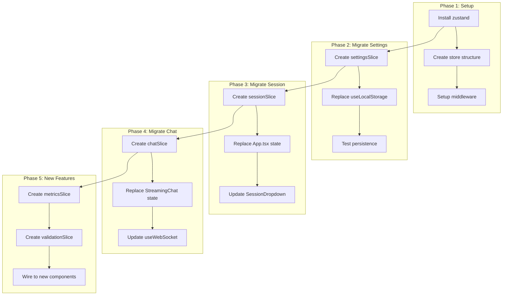

# SPEC-014: Frontend Architecture Refactor

> **Status**: approved | **Version**: 1.0 | **Updated**: 2026-01-21

## 0. Research Summary

### Fuentes Consultadas

| Tipo | Fuente | Link | Relevancia |
|------|--------|------|------------|
| Zustand docs | Context7 | [Link](https://zustand.docs.pmnd.rs/) | Alta |
| State comparison | DEV.to | [Link](https://dev.to/hijazi313/state-management-in-2025-when-to-use-context-redux-zustand-or-jotai-2d2k) | Alta |
| State comparison | BetterStack | [Link](https://betterstack.com/community/guides/scaling-nodejs/zustand-vs-redux-toolkit-vs-jotai/) | Alta |
| React patterns | Patterns.dev | [Link](https://www.patterns.dev/react/react-2026/) | Media |

### Decisiones Informadas por Research

| Decisión | Basada en |
|----------|-----------|
| **Zustand** sobre Redux/Jotai | 90% de proyectos 2025, ~3KB, sin boilerplate |
| **Slices pattern** | Zustand docs oficiales |
| **devtools + persist** middlewares | Zustand docs oficiales |
| **Selectors para re-renders** | BetterStack comparison |

### Confidence Assessment

| Área | Nivel | Razón |
|------|-------|-------|
| Zustand adoption | Alta | Consenso 2025, docs oficiales claros |
| Slices pattern | Alta | Official Zustand pattern |
| Migration strategy | Media | Custom al proyecto |

---

## 1. Vision

> **Press Release**: El refactor de arquitectura frontend migra el estado global a Zustand con slices pattern, mejorando performance, developer experience y preparando la base para features futuros (SPEC-012, SPEC-013).

**Background**: Frontend actual usa `useState` + `useLocalStorage` + `ToastContext`. Funcional pero no escalable.

**Usuario objetivo**: Desarrolladores que mantienen el frontend.

**Métricas de éxito**:
- Reducción de prop drilling
- DevTools para debugging
- Persist automático de preferencias
- Re-renders optimizados con selectors

---

## 2. Goals & Non-Goals

### Goals

- [ ] Migrar estado global a Zustand
- [ ] Implementar slices pattern para modularidad
- [ ] Añadir devtools middleware para debugging
- [ ] Añadir persist middleware para preferencias
- [ ] Crear selectors para evitar re-renders innecesarios
- [ ] Mantener backward compatibility con hooks existentes

### Non-Goals

- [ ] Reescribir componentes UI
- [ ] Cambiar estructura de directorios
- [ ] Añadir testing adicional (solo mantener existentes)
- [ ] Server-side rendering

---

## 3. Alternatives Considered

| Alternativa | Pros | Cons | Fuente | Decisión |
|-------------|------|------|--------|----------|
| **Zustand** | Simple, 3KB, slices | Manual selectors | [DEV.to](https://dev.to/hijazi313/state-management-in-2025-when-to-use-context-redux-zustand-or-jotai-2d2k) | ✅ Elegida |
| Redux Toolkit | DevTools, middleware | Boilerplate, overkill | [BetterStack](https://betterstack.com/community/guides/scaling-nodejs/zustand-vs-redux-toolkit-vs-jotai/) | ❌ Demasiado |
| Jotai | Fine-grained | Different mental model | [Meerako](https://www.meerako.com/blogs/react-state-management-zustand-vs-redux-vs-context-2025) | ❌ Overkill |
| Context API | Built-in | Re-render issues | [DEV.to](https://dev.to/saswatapal/do-you-need-state-management-in-2025-react-context-vs-zustand-vs-jotai-vs-redux-1ho) | ❌ Ya tenemos problemas |

---

## 4. Design

### 4.1 Store Architecture

```
src/store/
├── index.ts                 # Combined store export
├── middleware.ts            # devtools + persist config
├── slices/
│   ├── sessionSlice.ts      # Session management
│   ├── chatSlice.ts         # Chat state (logs, input)
│   ├── settingsSlice.ts     # User preferences
│   ├── metricsSlice.ts      # Thread metrics (SPEC-012)
│   ├── validationSlice.ts   # Validation events (SPEC-013)
│   └── uiSlice.ts           # UI state (modals, panels)
└── selectors/
    ├── sessionSelectors.ts
    ├── chatSelectors.ts
    └── metricsSelectors.ts
```

### 4.2 Slices Pattern

```typescript
// src/store/slices/sessionSlice.ts
import { StateCreator } from 'zustand';

export interface SessionSlice {
  // State
  currentSessionId: string | null;
  sessions: Session[];

  // Actions
  setCurrentSession: (id: string) => void;
  addSession: (session: Session) => void;
  removeSession: (id: string) => void;
  clearSessions: () => void;
}

export const createSessionSlice: StateCreator<
  SessionSlice & /* other slices */,
  [],
  [],
  SessionSlice
> = (set) => ({
  currentSessionId: null,
  sessions: [],

  setCurrentSession: (id) => set({ currentSessionId: id }),
  addSession: (session) =>
    set((state) => ({ sessions: [...state.sessions, session] })),
  removeSession: (id) =>
    set((state) => ({
      sessions: state.sessions.filter((s) => s.id !== id),
      currentSessionId: state.currentSessionId === id ? null : state.currentSessionId,
    })),
  clearSessions: () => set({ sessions: [], currentSessionId: null }),
});
```

### 4.3 Combined Store

```typescript
// src/store/index.ts
import { create } from 'zustand';
import { devtools, persist } from 'zustand/middleware';
import { createSessionSlice, SessionSlice } from './slices/sessionSlice';
import { createChatSlice, ChatSlice } from './slices/chatSlice';
import { createSettingsSlice, SettingsSlice } from './slices/settingsSlice';
import { createMetricsSlice, MetricsSlice } from './slices/metricsSlice';
import { createValidationSlice, ValidationSlice } from './slices/validationSlice';
import { createUISlice, UISlice } from './slices/uiSlice';

export type AppStore = SessionSlice &
  ChatSlice &
  SettingsSlice &
  MetricsSlice &
  ValidationSlice &
  UISlice;

export const useAppStore = create<AppStore>()(
  devtools(
    persist(
      (...a) => ({
        ...createSessionSlice(...a),
        ...createChatSlice(...a),
        ...createSettingsSlice(...a),
        ...createMetricsSlice(...a),
        ...createValidationSlice(...a),
        ...createUISlice(...a),
      }),
      {
        name: 'poneglyph-store',
        partialize: (state) => ({
          // Solo persistir settings, no chat/metrics
          settings: {
            provider: state.provider,
            orchestrateMode: state.orchestrateMode,
            planMode: state.planMode,
            // ... otros settings
          },
        }),
      }
    ),
    { name: 'Poneglyph' }
  )
);
```

### 4.4 Slices Overview

#### SessionSlice

```typescript
interface SessionSlice {
  currentSessionId: string | null;
  sessions: Session[];

  setCurrentSession: (id: string) => void;
  addSession: (session: Session) => void;
  removeSession: (id: string) => void;
  clearSessions: () => void;
}
```

#### ChatSlice

```typescript
interface ChatSlice {
  logs: LogEntry[];
  inputValue: string;
  isProcessing: boolean;
  messageQueue: string[];

  addLog: (log: LogEntry) => void;
  updateLog: (id: string, update: Partial<LogEntry>) => void;
  clearLogs: () => void;
  setInputValue: (value: string) => void;
  setProcessing: (processing: boolean) => void;
  enqueueMessage: (message: string) => void;
  dequeueMessage: () => string | undefined;
}
```

#### SettingsSlice

```typescript
interface SettingsSlice {
  // Provider
  provider: 'claude' | 'openai' | 'xai';
  apiKey: string | null;

  // Modes
  orchestrateMode: boolean;
  planMode: boolean;
  bypassPermissions: boolean;
  allowFullPC: boolean;

  // UI preferences
  filterMode: FilterMode;
  contextPanelOpen: boolean;
  autoScroll: boolean;

  // Actions
  setProvider: (provider: Provider) => void;
  setMode: (mode: ModeKey, value: boolean) => void;
  setFilterMode: (filter: FilterMode) => void;
  toggleContextPanel: () => void;
}
```

#### MetricsSlice (SPEC-012)

```typescript
interface MetricsSlice {
  threads: Map<string, ThreadMetrics>;
  toolCalls: ToolCallMetric[];
  sessionStats: SessionMetrics;

  // Actions
  startThread: (data: ThreadStartData) => void;
  endThread: (threadId: string) => void;
  addToolCall: (call: ToolCallData) => void;
  resetMetrics: () => void;

  // Computed (via selectors)
  // parallelEfficiency, improvementVectors
}
```

#### ValidationSlice (SPEC-013)

```typescript
interface ValidationSlice {
  hookEvents: HookEvent[];
  eventsByToolCall: Map<string, HookEvent[]>;

  // Actions
  addHookEvent: (event: HookEvent) => void;
  clearEvents: () => void;

  // Computed (via selectors)
  // stats, recentEvents
}
```

#### UISlice

```typescript
interface UISlice {
  // Modals
  settingsModalOpen: boolean;
  sessionsModalOpen: boolean;

  // Panels
  contextPanelOpen: boolean;
  validationPanelOpen: boolean;
  metricsPanelOpen: boolean;

  // Actions
  openModal: (modal: ModalKey) => void;
  closeModal: (modal: ModalKey) => void;
  togglePanel: (panel: PanelKey) => void;
}
```

### 4.5 Selectors Pattern

```typescript
// src/store/selectors/chatSelectors.ts
import { useAppStore } from '../index';
import { shallow } from 'zustand/shallow';

// Selector para evitar re-renders
export const useFilteredLogs = () =>
  useAppStore(
    (state) => {
      const { logs, filterMode } = state;
      if (filterMode === 'all') return logs;
      return logs.filter((log) => log.type === filterMode);
    },
    shallow
  );

// Selector compuesto
export const useChatState = () =>
  useAppStore(
    (state) => ({
      logs: state.logs,
      isProcessing: state.isProcessing,
      inputValue: state.inputValue,
    }),
    shallow
  );

// Selector para metrics
export const useParallelEfficiency = () =>
  useAppStore((state) => {
    const threads = Array.from(state.threads.values());
    const parallelizable = threads.filter((t) => t.threadType === 'P').length;
    const total = threads.length;
    return total > 0 ? (parallelizable / total) * 100 : 0;
  });
```

### 4.6 Migration Strategy



### 4.7 Backward Compatibility Hooks

```typescript
// src/hooks/useSession.ts (wrapper para migración gradual)
import { useAppStore } from '../store';

export const useSession = () => {
  const currentSessionId = useAppStore((s) => s.currentSessionId);
  const sessions = useAppStore((s) => s.sessions);
  const setCurrentSession = useAppStore((s) => s.setCurrentSession);
  const addSession = useAppStore((s) => s.addSession);
  const removeSession = useAppStore((s) => s.removeSession);

  return {
    currentSessionId,
    sessions,
    setCurrentSession,
    addSession,
    removeSession,
  };
};

// Componentes existentes pueden seguir usando el hook
// sin saber que internamente usa Zustand
```

### 4.8 DevTools Integration

```typescript
// Con devtools middleware, Redux DevTools muestra:
// - State tree completo
// - Action history
// - Time-travel debugging
// - State diff

// Actions aparecen como:
// sessionSlice/setCurrentSession
// chatSlice/addLog
// settingsSlice/setProvider
```

---

## 5. FAQ

**Q: ¿Por qué no usar Context para estado global?**
A: Context causa re-renders de todos los consumers. Zustand usa selectors para evitar esto. [Fuente: DEV.to](https://dev.to/hijazi313/state-management-in-2025-when-to-use-context-redux-zustand-or-jotai-2d2k)

**Q: ¿Se pierde el estado cuando se recarga la página?**
A: Solo settings se persisten vía `persist` middleware. Chat/metrics se resetean intencionalmente.

**Q: ¿Cómo debuggear el estado?**
A: Instalar Redux DevTools extension. El `devtools` middleware lo integra automáticamente.

**Q: ¿Puedo acceder al store fuera de React?**
A: Sí, `useAppStore.getState()` y `useAppStore.setState()` funcionan fuera de componentes.

---

## 6. Acceptance Criteria (BDD)

```gherkin
Feature: Zustand Store Migration

Scenario: Settings persisten entre recargas
  Given usuario configura provider = "openai"
  When recarga la página
  Then provider sigue siendo "openai"

Scenario: DevTools muestra state
  Given Redux DevTools instalado
  When abro DevTools
  Then veo state tree de Poneglyph
  And veo historial de actions

Scenario: Selectors previenen re-renders
  Given componente usa useFilteredLogs selector
  When se actualiza state no relacionado (e.g., modalOpen)
  Then componente NO re-renderiza

Scenario: Slices son independientes
  Given sessionSlice y chatSlice existen
  When modifico sessionSlice
  Then chatSlice no se ve afectado
  And solo componentes usando sessionSlice re-renderizan
```

---

## 7. Open Questions

- [ ] ¿Añadir immer middleware para immutable updates?
- [ ] ¿Crear test utilities específicas para store?

---

## 8. Sources

- [Zustand Official Docs](https://zustand.docs.pmnd.rs/) - Slices, middleware, TypeScript
- [DEV.to State Management 2025](https://dev.to/hijazi313/state-management-in-2025-when-to-use-context-redux-zustand-or-jotai-2d2k) - Comparison
- [BetterStack Comparison](https://betterstack.com/community/guides/scaling-nodejs/zustand-vs-redux-toolkit-vs-jotai/) - Deep dive
- [Meerako State Management](https://www.meerako.com/blogs/react-state-management-zustand-vs-redux-vs-context-2025) - 2025 recommendations

---

## 9. Next Steps

- [ ] Instalar `zustand` como dependencia
- [ ] Crear estructura de directorios store/slices
- [ ] Implementar settingsSlice primero (más simple)
- [ ] Migrar useLocalStorage a persist middleware
- [ ] Crear sessionSlice y migrar App.tsx
- [ ] Crear chatSlice y migrar StreamingChat
- [ ] Crear metricsSlice (SPEC-012)
- [ ] Crear validationSlice (SPEC-013)
