# Spec: Lead LLM Orchestrator

<!--
status: approved
priority: high
depends_on: []
enables: [planner-agent, builder-agent, reviewer-agent, error-analyzer-agent, command-loader-agent]
created: 2026-01-18
updated: 2026-01-18
version: 2.0
architecture: base-agents-plus-skills
-->

## 0. Research Summary

### Fuentes Consultadas

| Tipo | Fuente | Link | Relevancia |
|------|--------|------|------------|
| Docs oficial | Claude Code Subagents | [code.claude.com](https://code.claude.com/docs/en/sub-agents) | Alta |
| Docs oficial | Context7 /anthropics/claude-code | - | Alta |
| Best practice | Anthropic Building Effective Agents | [anthropic.com](https://www.anthropic.com/research/building-effective-agents) | Alta |
| Best practice | Anthropic Multi-Agent Research System | [anthropic.com](https://www.anthropic.com/engineering/multi-agent-research-system) | Alta |
| Pattern | Azure AI Agent Design Patterns | [learn.microsoft.com](https://learn.microsoft.com/en-us/azure/architecture/ai-ml/guide/ai-agent-design-patterns) | Media |
| Pattern | Google ADK Multi-Agents | [google.github.io](https://google.github.io/adk-docs/agents/multi-agents/) | Media |
| Pattern | AWS Agents as Tools | [dev.to](https://dev.to/aws/build-multi-agent-systems-using-the-agents-as-tools-pattern-jce) | Media |

### Decisiones Informadas por Research

| Decisión | Basada en |
|----------|-----------|
| **Orchestrator-Workers pattern** | Anthropic: "well-suited for complex tasks where you can't predict the subtasks needed" |
| **allowedTools restriction** | Context7: soportado nativamente en Claude Code CLI |
| **Single-level subagents** | Docs oficiales: "Sub-agents are not allowed to create other sub-agents" |
| **4 agentes base** | Anthropic: "most successful implementations weren't using complex frameworks... simple, composable patterns" |
| **Lead da briefs detallados** | eesel.ai: handoff problem y context amnesia en subagents |
| **Parallel execution** | Claude Code: Task tool puede correr hasta 7 agents simultáneos |

### Métricas de Referencia

| Métrica | Valor | Fuente |
|---------|-------|--------|
| Multi-agent vs Single-agent performance | +90.2% | Anthropic internal |
| Token consumption overhead | 15× | Anthropic research |
| Token usage explains performance | 80% | Anthropic tests |

### Información No Encontrada

- Benchmarks específicos de allowedTools restriction en Claude Code
- Métricas de latencia Lead → Agent → Lead roundtrip

### Confidence Assessment

| Área | Nivel | Razón |
|------|-------|-------|
| Patrón Orchestrator-Workers | Alta | Múltiples fuentes Anthropic |
| allowedTools nativo | Alta | Context7 confirma |
| Single-level hierarchy | Alta | Docs oficiales |
| Performance gain | Media | Solo datos Anthropic internos |

---

## 1. Vision

> **Press Release**: Claude Code Poneglyph incluye un Lead Orchestrator que es un LLM real siguiendo el patrón Orchestrator-Workers de Anthropic. El Lead planifica, carga skills, y delega a 4 agentes base especializados, sin poder ejecutar código directamente. Esto garantiza orquestación inteligente donde la complejidad se maneja con patrones simples y composables.

**Background**:
- El sistema necesita un orquestador superior a Claude Code vanilla
- Research confirma: Orchestrator-Workers es el patrón correcto para tareas complejas
- Sub-agents no pueden crear sub-agents → Lead es el único punto de delegación

**Usuario objetivo**: Desarrollador que quiere orquestación multi-agent inteligente sin frameworks complejos.

**Métricas de éxito**:
- Lead NUNCA ejecuta trabajo directo (0% de Read/Edit/Write/Bash)
- 100% de tareas complejas delegadas a agentes base
- Parallel Efficiency Score > 70% (métrica del planner)

## 2. Goals & Non-Goals

### Goals

- [x] Lead es Claude Code CLI con `allowedTools` restringido
- [x] Lead solo puede: `Task`, `TodoWrite`, `AskUserQuestion`
- [x] Lead NO puede: `Read`, `Edit`, `Write`, `Bash`, `Glob`, `Grep`
- [x] Lead delega a exactamente 4 agentes base + Explore nativo
- [x] Lead carga skills vía `command-loader` y las pasa como contexto
- [x] Lead recibe output estructurado de cada agente (según su spec)
- [x] Lead maneja error recovery vía `error-analyzer`

### Non-Goals

- [ ] Lead con acceso a herramientas de código (contradice el objetivo)
- [ ] Más de 4 agentes base (arquitectura fija)
- [ ] Sub-agents que crean sub-agents (no soportado por Claude Code)
- [ ] Framework complejo de routing (simple > complex)
- [ ] Métricas históricas de orquestación (futuro)

## 3. Alternatives Considered

| Alternativa | Pros | Cons | Fuente | Decisión |
|-------------|------|------|--------|----------|
| **A. Orchestrator-Workers Puro** | Simple, patrón probado | Lead sin contexto de ejecución | [Anthropic](https://www.anthropic.com/research/building-effective-agents) | ✅ Base elegida |
| B. Hierarchical (múltiples niveles) | Más robusto | Overkill para 4 agentes | [Google ADK](https://google.github.io/adk-docs/agents/multi-agents/) | ❌ Complejidad |
| C. Hybrid Code+LLM routing | Predecible + flexible | Dos sistemas paralelos | [OpenAI](https://openai.github.io/openai-agents-python/multi_agent/) | ⚠️ Futuro |
| D. allowedTools vacío | Fuerza delegación total | Lead no puede planificar | - | ❌ Muy restrictivo |
| E. allowedTools mínimo | Balance planifica/delega | Requiere system prompt robusto | Elegida | ✅ **Implementar** |

## 4. Design

### 4.1 Arquitectura Base + Skills


### 4.2 Agentes Disponibles para Delegación

| Agente | subagent_type | Cuándo usar | Output |
|--------|---------------|-------------|--------|
| **planner** | `planner` | Tarea compleja que requiere roadmap | Execution Roadmap con agentes + skills |
| **builder** | `builder` | Implementar UN paso del roadmap | Archivos + tests + skills aplicadas |
| **reviewer** | `reviewer` | Validar código en checkpoint | APPROVED/NEEDS_CHANGES + feedback |
| **error-analyzer** | `error-analyzer` | Cuando un agente falla | Diagnóstico + recomendación |
| **Explore** | `Explore` | Explorar codebase rápido | Archivos encontrados + estructura |
| **command-loader** | `command-loader` | Cargar skills/commands | Contenido expandido |

### 4.3 Flujo de Skills

```mermaid
sequenceDiagram
    participant U as Usuario
    participant L as Lead
    participant CL as command-loader
    participant P as planner
    participant B as builder

    U->>L: "Implementa auth JWT"
    L->>CL: load /security-coding
    CL-->>L: [Patrones de seguridad]
    L->>CL: load /typescript-patterns
    CL-->>L: [Patrones de TypeScript]

    L->>P: "Planifica auth JWT"
    P-->>L: Roadmap: [1.1 → builder + security-coding]

    L->>B: "Implementa paso 1.1<br/>Contexto: [security-coding, typescript-patterns]"
    B-->>L: "Código implementado, skills aplicadas: ..."
```



### 4.4 Flujo de Error Recovery

```mermaid
sequenceDiagram
    participant L as Lead
    participant B as builder
    participant EA as error-analyzer
    participant P as planner

    L->>B: Ejecutar paso 2.1
    B-->>L: ❌ Error: "Cannot read property..."

    alt 1er error transitorio
        L->>B: Retry automático
    else Error persistente (2+)
        L->>EA: "Analiza este error"
        EA-->>L: Diagnóstico: DEPENDENCY, Rec: RE-PLANIFICAR
        L->>P: "Re-planifica paso 2.1 con feedback"
        P-->>L: Nuevo plan
        L->>B: Ejecutar nuevo plan
    end
```



### 4.5 System Prompt del Lead

```markdown
# Lead Orchestrator

## Rol
Eres el Lead Orchestrator siguiendo el patrón Orchestrator-Workers de Anthropic.
Tu trabajo es PLANIFICAR, CARGAR SKILLS, y DELEGAR.
NUNCA ejecutas trabajo directo porque no tienes las herramientas.

## Tools Disponibles
| Tool | Propósito |
|------|-----------|
| Task | Delegar trabajo a agentes especializados |
| TodoWrite | Planificar y trackear progreso |
| AskUserQuestion | Clarificar requisitos con el usuario |

## Agentes Base (4) + Soporte (2)
| subagent_type | Rol | Cuándo |
|---------------|-----|--------|
| planner | Planifica roadmap | Tarea compleja (>2 pasos) |
| builder | Implementa código | Crear/modificar archivos |
| reviewer | Valida código | Checkpoints 🔴 del roadmap |
| error-analyzer | Analiza errores | Cuando algo falla |
| Explore | Explora codebase | Antes de planificar |
| command-loader | Carga skills | Antes de delegar con contexto |

## Flujo Obligatorio
1. **Cargar skills** (si necesario): Delegar a command-loader
2. **Explorar** (si necesario): Delegar a Explore
3. **Planificar** (si complejo): Delegar a planner
4. **Ejecutar**: Delegar a builder con contexto de skills
5. **Validar**: Delegar a reviewer en checkpoints
6. **Error recovery**: Delegar a error-analyzer si falla

## Formato de Delegación
Task(
  subagent_type: "builder",
  description: "Implementar auth service paso 2.1",
  prompt: `
    ## Contexto de Skills
    ### security-coding
    [Contenido cargado de command-loader]

    ## Paso a Implementar
    [Detalle del paso del roadmap]
  `
)

## Reglas Críticas
- SIEMPRE carga skills relevantes ANTES de delegar
- SIEMPRE usa planner para tareas >2 pasos
- SIEMPRE pasa contexto completo a agentes (handoff problem)
- SIEMPRE usa TodoWrite para trackear progreso
- SI error: analizar con error-analyzer, luego re-planificar
- NUNCA intentes leer/editar archivos directamente
```

### 4.6 Componentes a Modificar

| Archivo | Cambio |
|---------|--------|
| `websocket.ts` | Nuevo modo `leadLLM` que usa CLI con allowedTools |
| `claude.ts` | Ya soporta `allowedTools` (verificado) |
| Nuevo: `.claude/agents/lead.md` | System prompt del Lead |

### 4.7 Edge Cases

| Caso | Comportamiento |
|------|----------------|
| Lead intenta usar Read | CLI rechaza (tool no permitida) |
| Agente falla | Lead invoca error-analyzer → re-planifica |
| Skill no existe | command-loader devuelve error → Lead informa |
| Tarea trivial | Lead puede responder directo si no requiere código |
| >7 tareas paralelas | Lead ejecuta en batches (límite Task tool) |
| Reviewer da NEEDS_CHANGES | Lead re-invoca planner con feedback |

## 5. FAQ

**Q: ¿El Lead puede responder preguntas sin delegar?**
A: Sí, si no requiere leer/modificar código. El Lead tiene conocimiento general.

**Q: ¿Qué pasa si el planner sugiere una skill que no existe?**
A: command-loader devuelve error. Lead debe informar y continuar sin esa skill.

**Q: ¿Cómo maneja el Lead la paralelización?**
A: Sigue el Execution Roadmap del planner. Tareas 🔵 PARALLEL se ejecutan juntas.

**Q: ¿El modo `orchestrate` actual sigue funcionando?**
A: Sí, coexisten. `leadLLM` es un nuevo modo separado.

**Q: ¿Cuántos tokens consume este patrón?**
A: ~15× más que chat directo ([Anthropic](https://www.anthropic.com/engineering/multi-agent-research-system)), pero +90% mejor performance en tareas complejas.

**Q: ¿Qué es lo más difícil/riesgoso?**
A: **Handoff problem**: Si Lead no da brief detallado, agentes sufren "context amnesia". Mitigación: System prompt enfatiza pasar contexto completo.

## 6. Acceptance Criteria (BDD)

```gherkin
Feature: Lead LLM Orchestrator v2.0

  Background:
    Given modo leadLLM está activo
    And allowedTools es ["Task", "TodoWrite", "AskUserQuestion"]

  Scenario: Lead carga skills antes de delegar
    Given usuario envía "implementa auth JWT seguro"
    When Lead analiza la tarea
    Then Lead usa Task con subagent_type="command-loader" para cargar security-coding
    And Lead incluye el contenido de security-coding en el prompt al builder

  Scenario: Lead sigue roadmap del planner
    Given usuario envía tarea compleja con >3 pasos
    When Lead planifica
    Then Lead usa Task con subagent_type="planner"
    And Lead recibe Execution Roadmap con agentes y skills sugeridas
    And Lead ejecuta tareas según el orden del roadmap

  Scenario: Lead maneja error con error-analyzer
    Given builder falla en paso 2.1 con error "TypeError"
    And es el 2do intento del mismo error
    When Lead recibe el error
    Then Lead usa Task con subagent_type="error-analyzer"
    And Lead recibe diagnóstico con recomendación
    And Lead re-planifica según la recomendación

  Scenario: Lead no puede usar tools de código
    When Lead intenta usar Read
    Then CLI rechaza la llamada
    And Lead debe usar Task con Explore en su lugar

  Scenario: Lead ejecuta tareas paralelas
    Given roadmap tiene wave PARALLEL-1 con 3 tareas
    When Lead ejecuta wave PARALLEL-1
    Then Lead lanza 3 Task calls en paralelo
    And espera resultados de todos antes de continuar

  Scenario: Reviewer da NEEDS_CHANGES
    Given builder completó paso 2.1
    And reviewer da veredicto NEEDS_CHANGES con feedback
    When Lead recibe el veredicto
    Then Lead invoca planner con el feedback
    And Lead recibe nuevo plan para el paso
```

## 7. Open Questions

- [x] ~~¿El Lead debería tener acceso a WebSearch?~~ No, delega a planner que sí tiene
- [ ] ¿Timeout específico para el Lead vs agentes?
- [ ] ¿Límite de re-intentos antes de escalar a usuario?

## 8. Sources

### Links Verificados

- [Anthropic: Building Effective Agents](https://www.anthropic.com/research/building-effective-agents) - Patrones composables, Orchestrator-Workers
- [Anthropic: Multi-Agent Research System](https://www.anthropic.com/engineering/multi-agent-research-system) - Performance +90%, tokens 15×
- [Claude Code: Create Custom Subagents](https://code.claude.com/docs/en/sub-agents) - allowedTools, single-level
- [Google ADK: Multi-Agents](https://google.github.io/adk-docs/agents/multi-agents/) - Centralized pattern
- [eesel.ai: Subagents in Claude Code](https://www.eesel.ai/blog/subagents-in-claude-code) - Handoff problem

## 9. Next Steps

1. [ ] Crear `.claude/agents/lead.md` con system prompt
2. [ ] Implementar modo `leadLLM` en websocket.ts
3. [ ] Testing manual del flujo completo
4. [ ] Validar handoff de skills Lead → Agent

---

## Changelog

| Versión | Fecha | Cambios |
|---------|-------|---------|
| 2.0.0 | 2026-01-18 | Arquitectura Base + Skills. 4 agentes base. Research Summary. Alineación con ARCHITECTURE.md |
| 1.0.0 | 2026-01-18 | Spec inicial basada en discovery session |
