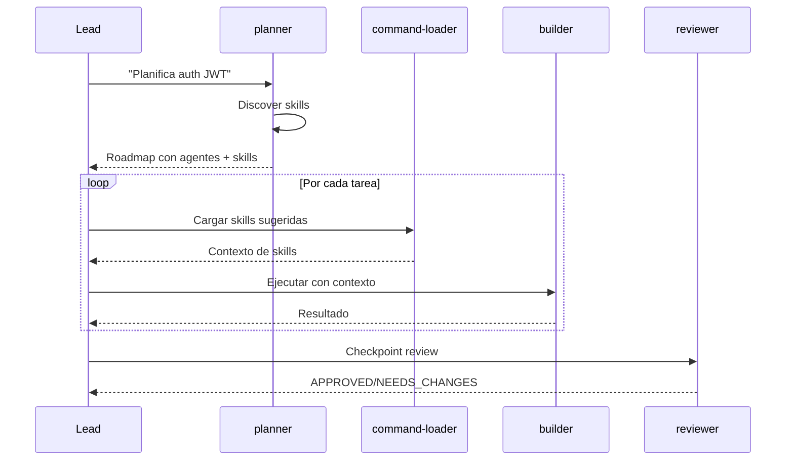

# Spec: Planner Agent

<!--
status: approved
priority: high
depends_on: [lead-llm-orchestrator, scout-explorer-agent]
enables: [builder-agent, reviewer-agent]
created: 2026-01-18
updated: 2026-01-18
version: 3.0
architecture: base-agents-plus-skills
-->

## 1. Vision

> Agente base de planificación que genera **Execution Roadmaps** con tareas asignadas a **agentes base + skills sugeridas**. Optimiza para máxima paralelización.

**Cambio v3.0**: Ya no descubre "agentes especializados". Ahora asigna uno de los 4 agentes base y sugiere skills relevantes.

## 2. Decisión

| Aspecto | Decisión |
|---------|----------|
| **Tipo** | Agente Base |
| **Nombre** | `planner` |
| **Model** | `opus` (tareas de diseño) |
| **Tools** | Read-only + MCPs |
| **Foco** | Asignar agente base + skills, maximizar paralelo |

## 3. Arquitectura Base + Skills

### 3.1 Agentes Disponibles (fijos)

El planner SIEMPRE tiene estos 4 agentes base:

| Agente Base | Rol | Cuándo asignar |
|-------------|-----|----------------|
| `builder` | Implementa código | Crear/modificar archivos |
| `reviewer` | Valida código | Checkpoints de review |
| `planner` | (self) | Sub-planificación |
| `error-analyzer` | Analiza errores | Cuando algo falla |

### 3.2 Skills Discovery

El planner descubre skills disponibles:

```bash
# Descubrir skills
Glob(".claude/skills/**/SKILL.md")
Glob(".claude/commands/*.md")

# Extraer metadata de cada skill
# - name, description, keywords
```

### 3.3 Catálogo de Skills (ejemplo)

```json
{
  "skills": {
    "typescript-patterns": {
      "keywords": ["typescript", "async", "types", "interface"],
      "forAgents": ["builder"]
    },
    "security-coding": {
      "keywords": ["security", "auth", "validation", "owasp"],
      "forAgents": ["builder"]
    },
    "security-review": {
      "keywords": ["security", "audit", "vulnerability"],
      "forAgents": ["reviewer"]
    },
    "websocket-patterns": {
      "keywords": ["websocket", "realtime", "ws", "streaming"],
      "forAgents": ["builder", "reviewer"]
    },
    "retry-patterns": {
      "keywords": ["retry", "error", "recovery", "backoff"],
      "forAgents": ["error-analyzer"]
    }
  }
}
```

## 4. Responsabilidad

| Hace | NO hace |
|------|---------|
| Descubrir skills disponibles | Implementar código |
| Asignar agente base por tarea | Ejecutar tests |
| Sugerir skills relevantes | Escribir archivos |
| Dividir tareas (🔵🟡🔴) | Quality Gates |
| Calcular Parallel Efficiency | Ejecutar tareas |

## 5. Task-Agent-Skill Mapping

### 5.1 Regla de Asignación

```
1. Determinar TIPO de tarea → Agente base
2. Analizar DOMINIO de tarea → Skills sugeridas
3. Combinar: agente + skills
```

### 5.2 Ejemplos de Mapping

| Tarea | Tipo | Agente | Skills Sugeridas | Razón |
|-------|------|--------|------------------|-------|
| Crear servicio auth | Implementar | `builder` | security-coding, typescript-patterns | Auth requiere patrones seguros |
| Refactorizar función | Implementar | `builder` | refactoring-patterns | Refactoring es implementación |
| WebSocket reconnection | Implementar | `builder` | websocket-patterns, bun-best-practices | Dominio específico |
| Revisar código auth | Validar | `reviewer` | security-review | Security necesita checklist |
| Checkpoint general | Validar | `reviewer` | (ninguna) | Review básico |
| Analizar error | Analizar | `error-analyzer` | diagnostic-patterns, retry-patterns | Diagnóstico de fallo |

## 6. Output Esperado

### 6.1 Formato Markdown

```markdown
## Resumen Ejecutivo
Implementar [QUÉ] en [DÓNDE]. Afecta N archivos, riesgo [NIVEL].

**Agentes Base**: builder, reviewer, error-analyzer
**Skills Sugeridas**: typescript-patterns, security-coding, security-review
**Parallel Efficiency Score**: 83%

## Execution Roadmap

### 🔵 PARALLEL-1: Foundation
| # | Archivo | Acción | Agente | Skills | Razón |
|---|---------|--------|--------|--------|-------|
| 1.1 | types/auth.ts | Create | builder | typescript-patterns | Types base |
| 1.2 | - | Security Design | reviewer | security-review | Validar diseño |

### 🟡 SEQ-2: Core
| # | Archivo | Acción | Agente | Skills | Deps |
|---|---------|--------|--------|--------|------|
| 2.1 | services/auth.ts | Create | builder | security-coding, typescript-patterns | 1.1, 1.2 |

### 🔴 CHECKPOINT-3: Validation
| # | Tipo | Agente | Skills | Scope |
|---|------|--------|--------|-------|
| 3.1 | Full Review | reviewer | security-review | 2.1 |
```

### 6.2 Formato JSON

```json
{
  "summary": {
    "description": "Implementar autenticación JWT",
    "totalTasks": 4,
    "parallelEfficiency": 0.83,
    "agentsUsed": ["builder", "reviewer"],
    "skillsUsed": ["typescript-patterns", "security-coding", "security-review"]
  },
  "waves": [
    {
      "id": "PARALLEL-1",
      "type": "parallel",
      "emoji": "🔵",
      "tasks": [
        {
          "id": "1.1",
          "file": "src/types/auth.ts",
          "action": "Create",
          "agent": "builder",
          "suggestedSkills": ["typescript-patterns"],
          "skillReason": "Types de TypeScript",
          "dependencies": [],
          "complexity": 10
        },
        {
          "id": "1.2",
          "description": "Security design review",
          "action": "Review",
          "agent": "reviewer",
          "suggestedSkills": ["security-review"],
          "skillReason": "Auth requiere validación de seguridad",
          "dependencies": [],
          "complexity": 15
        }
      ]
    },
    {
      "id": "SEQ-2",
      "type": "sequential",
      "emoji": "🟡",
      "tasks": [
        {
          "id": "2.1",
          "file": "src/services/auth.ts",
          "action": "Create",
          "agent": "builder",
          "suggestedSkills": ["security-coding", "typescript-patterns"],
          "skillReason": "Auth service requiere patrones seguros",
          "dependencies": ["1.1", "1.2"],
          "complexity": 25
        }
      ]
    },
    {
      "id": "CHECKPOINT-3",
      "type": "checkpoint",
      "emoji": "🔴",
      "tasks": [
        {
          "id": "3.1",
          "type": "review",
          "agent": "reviewer",
          "suggestedSkills": ["security-review"],
          "skillReason": "Validación final de seguridad",
          "scope": ["2.1"]
        }
      ]
    }
  ]
}
```

## 7. Invocación

```typescript
Task(
  subagent_type: "planner",
  description: "Planificar implementación de auth JWT",
  prompt: `
    ## Tarea
    Implementar autenticación JWT con refresh tokens

    ## Requisitos
    1. Descubrir skills disponibles (Glob .claude/skills/, .claude/commands/)
    2. Generar Execution Roadmap
    3. Asignar agente BASE (builder/reviewer/error-analyzer)
    4. Sugerir skills relevantes por tarea
    5. Maximizar paralelización (target: >70%)

    ## Stack
    - Bun + Elysia + React
    - Tests: bun test
    - TypeScript strict
  `
)
```

## 8. Tools Permitidas

```yaml
allowed-tools:
  - Read
  - Glob
  - Grep
  - WebSearch
  - WebFetch

disallowedTools:
  - Edit
  - Write
  - Bash
  - Task
```

## 9. Parallel Efficiency Score

```
Score = (tareas_en_waves_paralelas / total_tareas) × 100
```

| Score | Calificación | Acción |
|-------|--------------|--------|
| > 80% | 🟢 Excelente | Aprobar |
| 60-80% | 🟡 Aceptable | Revisar |
| < 60% | 🔴 Pobre | Re-planificar |

## 10. Clasificación de Waves

| Emoji | Tipo | Lead Action |
|-------|------|-------------|
| 🔵 | PARALLEL | Lanzar todas en paralelo |
| 🟡 | SEQUENTIAL | Ejecutar en orden |
| 🔴 | CHECKPOINT | Esperar review antes de continuar |

## 11. Relación con Lead



---

**Status: APPROVED**
**Version: 3.0** - Arquitectura Base + Skills. Ya no descubre agentes especializados, asigna agentes base + sugiere skills.
