# Spec: Reviewer Agent

<!--
status: approved
priority: high
depends_on: [lead-llm-orchestrator, builder-agent]
enables: []
created: 2026-01-18
updated: 2026-01-18
version: 3.0
architecture: base-agents-plus-skills
-->

## 1. Vision

> Agente base de validación con comportamiento inmutable. La especialización del review (security, performance, etc.) viene de **skills cargadas en contexto**. Si falla → re-bucle al planner.

**Cambio v3.0**: Ya no hay "Two-Pass con Expert". Ahora es: reviewer base + skills de dominio. Un solo agente, múltiples especializaciones.

## 2. Decisión

| Aspecto | Decisión |
|---------|----------|
| **Tipo** | Agente Base |
| **Nombre** | `reviewer` |
| **Model** | `sonnet` (balance velocidad/calidad) |
| **Tools** | Read-only |
| **Especialización** | Vía skills (security-review, performance-review, etc.) |
| **Si falla** | Re-bucle al `planner` |

## 3. Comportamiento Base (INMUTABLE)

El reviewer SIEMPRE:
- Recibe archivos a revisar
- Ejecuta checklist de validación
- Da veredicto claro (APPROVED/NEEDS_CHANGES/BLOCKED)
- Devuelve feedback específico

El reviewer NUNCA:
- Modifica código
- Implementa fixes
- Delega a otros agentes
- Decide arquitectura

## 4. Especialización vía Skills

### 4.1 Cómo Funciona


### 4.2 Skills Compatibles

| Skill | Cuándo el Lead la carga | Qué aporta |
|-------|-------------------------|------------|
| `security-review` | Código de auth, data | OWASP checklist, vulnerabilidades |
| `performance-review` | Código crítico | N+1, memory leaks, profiling |
| `code-quality` | Review general | Code smells, SOLID, complexity |
| `websocket-review` | Código realtime | Reconnection, message ordering |
| `testing-strategy` | Validar tests | Cobertura, edge cases |

### 4.3 Migración de Two-Pass

| Antes (v2.0) | Después (v3.0) |
|--------------|----------------|
| Pass 1: reviewer | reviewer (base checklist) |
| Pass 2: expert:X como reviewer | reviewer + skill:X-review |
| Dos llamadas Task | Una llamada Task con skills |

### 4.4 Lo que NO Cambia con Skills

| Aspecto | Con/Sin Skills |
|---------|----------------|
| Tools disponibles | Siempre: Read, Glob, Grep, Bash(test only) |
| Veredictos | Siempre: APPROVED/NEEDS_CHANGES/BLOCKED |
| Output format | Siempre: checklist + issues + veredicto |
| Rol | Siempre: validador |

## 5. Checklist Base (siempre ejecuta)

```yaml
base_checks:
  tests:
    - bun test [archivos] # Exit 0
    - Cobertura razonable

  types:
    - bun typecheck [archivos] # Exit 0
    - No `any` innecesarios

  quality:
    - Código auto-explicativo
    - Error handling presente
    - Sigue convenciones del proyecto
```

## 6. Checklist por Skill (adicional)

### security-review

```yaml
security_checks:
  - No secrets hardcodeados
  - Input validado en boundaries
  - No SQL/NoSQL injection
  - No XSS (si aplica)
  - Autenticación correcta
  - Autorización correcta
  - Datos sensibles encriptados
```

### performance-review

```yaml
performance_checks:
  - No N+1 queries
  - No memory leaks obvios
  - Lazy loading donde aplica
  - Caching apropiado
  - No blocking operations en hot paths
```

### websocket-review

```yaml
websocket_checks:
  - Reconnection logic presente
  - Exponential backoff
  - Message ordering (si requiere)
  - Heartbeat/ping-pong
  - Error handling de conexión
  - Cleanup en disconnect
```

## 7. Input Esperado

```markdown
## Contexto de Skills

### security-review
[Checklist expandido de seguridad]

---

## Review Request

### Archivos a revisar
- server/src/services/auth.ts
- server/src/services/auth.test.ts

### Contexto
Servicio de autenticación JWT creado por builder.
Paso 2.1 del roadmap.

### Tipo de review
Full (tests + types + quality + security)

### Checklist
1. Base: tests, types, quality
2. Skill: security-review checklist
```

## 8. Output Esperado

```markdown
## Review Result

### Checks Ejecutados
| Check | Resultado | Detalle |
|-------|-----------|---------|
| Tests | ✅ Pass | 8/8 tests |
| Types | ✅ Pass | Sin errores |
| Quality | ✅ Pass | Código limpio |
| Security (skill) | ⚠️ Warning | 1 issue menor |

### Issues Encontrados
| Severidad | Archivo | Línea | Issue | Skill |
|-----------|---------|-------|-------|-------|
| Warning | auth.ts | 45 | Token expiry muy largo (7d) | security-review |

### Skills Aplicadas
| Skill | Checks realizados |
|-------|-------------------|
| security-review | Input validation, secrets, injection |

### Veredicto
**APPROVED_WITH_WARNINGS**

### Feedback
El código es funcional y seguro. Considerar reducir expiry de token a 1d.

### Acción Recomendada
✅ Continuar al siguiente paso (warning es menor)
```

## 9. Veredictos y Acciones

| Veredicto | Significado | Acción del Lead |
|-----------|-------------|-----------------|
| **APPROVED** | Todo OK | ✅ Continuar |
| **APPROVED_WITH_WARNINGS** | Issues menores | ✅ Continuar, fix opcional |
| **NEEDS_CHANGES** | Issues importantes | 🔄 Re-bucle al planner |
| **BLOCKED** | Issues críticos | 🛑 Parar, revisar plan |

### Re-bucle al Planner

Cuando el veredicto es `NEEDS_CHANGES` o `BLOCKED`:


**El Lead NO pide al builder que "arregle".** En su lugar:
1. Envía feedback al planner
2. Planner re-evalúa y puede cambiar approach
3. Builder recibe nuevo plan

## 10. Tools Permitidas

```yaml
allowed-tools:
  - Read
  - Glob
  - Grep
  - Bash  # Solo: bun test, bun typecheck, bun lint

disallowedTools:
  - Edit
  - Write
  - Task
```

## 11. Invocación

### Review Básico

```typescript
Task(
  subagent_type: "reviewer",
  description: "Review paso 2.1 - Auth service",
  prompt: `
    ## Review Request

    ### Archivos
    - server/src/services/auth.ts
    - server/src/services/auth.test.ts

    ### Tipo
    Quick (tests + types)
  `
)
```

### Review con Skills

```typescript
Task(
  subagent_type: "reviewer",
  description: "Security review de Auth service",
  prompt: `
    ## Contexto de Skills

    ### security-review
    [Checklist de security-review expandido]

    ---

    ## Review Request

    ### Archivos
    - server/src/services/auth.ts

    ### Tipo
    Full + Security skill
  `
)
```

## 12. Tipos de Review

| Tipo | Checks Base | Skills | Cuándo |
|------|-------------|--------|--------|
| **Quick** | Tests + Types | Ninguna | Entre pasos |
| **Full** | Tests + Types + Quality | Ninguna | Checkpoints 🔴 |
| **Full + Skill** | Todo base + skill checklist | security/performance/etc | Dominio específico |

## 13. Relación con Otros Agentes

```mermaid
graph TD
    subgraph "Implementación"
        B[builder + skills]
    end

    subgraph "Validación"
        R[reviewer + skills]
    end

    subgraph "Re-planificación"
        P[planner]
    end

    B --> |código| L[Lead]
    L --> |review request + skills| R
    R --> |APPROVED| L
    R --> |NEEDS_CHANGES| L
    L --> |feedback| P
    P --> |nuevo plan| L
```



## 14. Implementación

Crear archivo `.claude/agents/reviewer.md` con:
- Comportamiento base inmutable
- Checklist base (siempre ejecuta)
- Sección de cómo aplicar skills del contexto
- Formato de output estructurado

---

**Status: APPROVED**
**Version: 3.0** - Arquitectura Base + Skills. Un solo reviewer con especialización vía skills. Elimina Two-Pass con experts separados.
