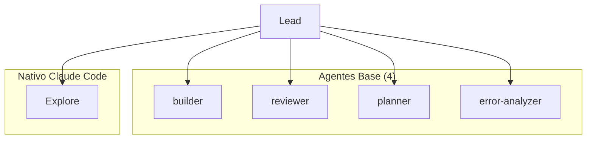

# Spec: Scout/Explorer Agent

<!--
status: approved
priority: high
depends_on: [lead-llm-orchestrator]
enables: []
created: 2026-01-18
updated: 2026-01-18
version: 1.1
architecture: base-agents-plus-skills
-->

## 1. Vision

> Usar el agente **Explore nativo** de Claude Code. El Lead enriquece el prompt con contexto del proyecto. Sin overhead de configuración custom.

## 2. Decisión

| Aspecto | Decisión |
|---------|----------|
| **Agente** | `Explore` nativo de Claude Code |
| **Personalización** | Lead añade contexto en el prompt |
| **Custom agent** | NO necesario |

## 3. Justificación

| Nativo | Custom |
|--------|--------|
| ✅ Funciona garantizado | ⚠️ Overhead de config |
| ✅ Claude lo invoca automáticamente | ⚠️ Puede "gatekeep" contexto |
| ✅ Read-only (sin Edit/Write) | ⚠️ Fuerza workflows rígidos |
| ✅ Probado por Anthropic | |

## 4. Relación con Arquitectura Base + Skills

El `Explore` nativo **no es uno de los 4 agentes base** porque:
- Ya existe en Claude Code
- No necesita skills (su trabajo es explorar, no especializar)
- El Lead lo usa directamente sin modificación



## 5. Uso

El Lead invoca así:

```typescript
Task(
  subagent_type: "Explore",
  description: "Explorar estructura de auth",
  prompt: `
    Proyecto: TypeScript/Bun + Elysia + React
    Dirs clave: claude-code-ui/server/src, claude-code-ui/web/src

    Encuentra todos los archivos relacionados con autenticación.
  `
)
```

## 6. Tools del Explore Nativo

| Puede | No puede |
|-------|----------|
| `Read`, `Glob`, `Grep` | `Edit`, `Write`, `Task` |
| `WebFetch`, `WebSearch` | `Bash`, `NotebookEdit` |

## 7. Cuándo Reconsiderar

Crear Scout custom SI:
- [ ] Necesitas integrar ExpertStore
- [ ] Output con formato muy específico
- [ ] Explorar siempre ciertos dirs primero

---

**Status: APPROVED**
**Version: 1.1** - Añadida relación con arquitectura Base + Skills
