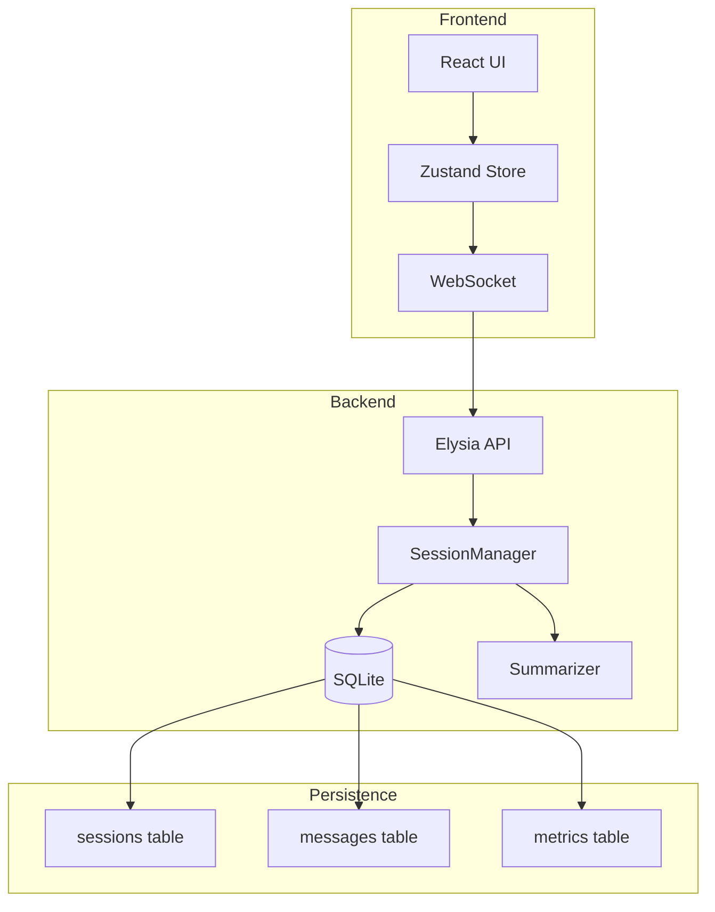
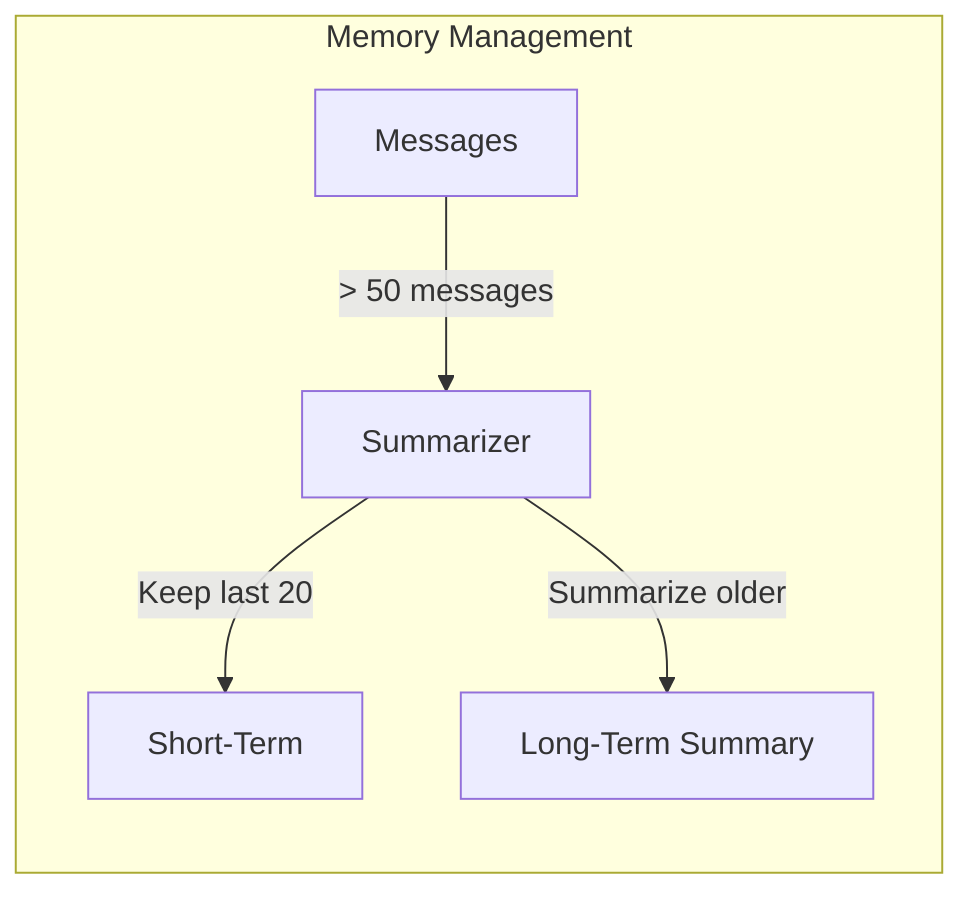
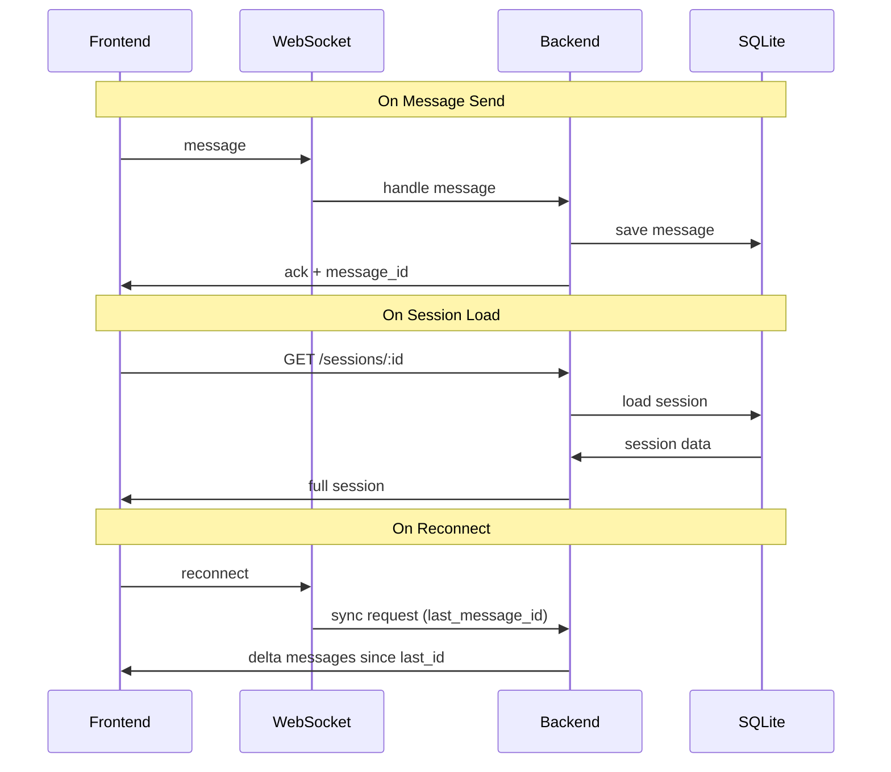

# SPEC-015: Session Management & Persistence

> **Status**: approved | **Version**: 1.0 | **Updated**: 2026-01-21

## 0. Research Summary

### Fuentes Consultadas

| Tipo | Fuente | Link | Relevancia |
|------|--------|------|------------|
| Best practices | Mem0.ai | [Link](https://mem0.ai/blog/memory-in-agents-what-why-and-how) | Alta |
| LangGraph | LangChain Docs | [Link](https://docs.langchain.com/oss/python/langgraph/memory) | Alta |
| OpenAI | Agents SDK Cookbook | [Link](https://cookbook.openai.com/examples/agents_sdk/session_memory) | Alta |
| Context Management | 16x.engineer | [Link](https://eval.16x.engineer/blog/llm-context-management-guide) | Media |

### Decisiones Informadas por Research

| Decisión | Basada en |
|----------|-----------|
| Separar short-term vs long-term memory | Mem0.ai, LangChain - standard architecture |
| Summarization para historial largo | Mem0.ai - reduce tokens ~90% |
| Session isolation por usuario | Security best practices |
| Export/Import como JSON | Portabilidad estándar |

### Confidence Assessment

| Área | Nivel | Razón |
|------|-------|-------|
| Session storage | Alta | Pattern bien establecido |
| Memory summarization | Alta | Múltiples fuentes coinciden |
| Export/Import | Media | Custom implementation |

---

## 1. Vision

> **Press Release**: El sistema de Session Management permite persistir, exportar e importar sesiones completas del orquestador, manteniendo historial de conversaciones, métricas y contexto entre reinicios.

**Background**: Actualmente las sesiones se pierden al cerrar el navegador. Solo hay `useLocalStorage` básico.

**Usuario objetivo**: Desarrolladores que quieren retomar trabajo previo o compartir sesiones.

**Métricas de éxito**:
- Sesiones persisten entre reinicios del servidor
- Export/Import funcional en <2s para sesiones de 1MB
- Historial comprimido reduce tokens en >50%

---

## 2. Goals & Non-Goals

### Goals

- [ ] Persistir sesiones en SQLite (server-side)
- [ ] Sincronizar estado entre frontend y backend
- [ ] Implementar summarization para historial largo
- [ ] Export sesión como JSON
- [ ] Import sesión desde JSON
- [ ] Listar sesiones con metadata (fecha, tokens, resumen)
- [ ] Eliminar sesiones antiguas (configurable)

### Non-Goals

- [ ] Sincronización cross-device (cloud sync)
- [ ] Colaboración multi-usuario en sesión
- [ ] Versionado de sesiones (git-like)
- [ ] Encryption at rest (v1)

---

## 3. Alternatives Considered

| Alternativa | Pros | Cons | Fuente | Decisión |
|-------------|------|------|--------|----------|
| **SQLite + JSON** | Simple, portable, no deps | Queries limitadas | - | ✅ Elegida |
| PostgreSQL | Queries potentes | Overhead para dev | - | ❌ Overkill |
| Redis | Rápido | Volátil, otro servicio | - | ❌ No persiste |
| File-based JSON | Muy simple | Sin queries, no escala | - | ❌ Demasiado simple |

---

## 4. Design

### 4.1 Data Model

```typescript
interface Session {
  id: string;                    // UUID
  name: string;                  // User-defined or auto-generated
  createdAt: number;             // Unix timestamp
  updatedAt: number;             // Unix timestamp

  // Memory
  shortTermMemory: Message[];    // Recent messages (last N)
  longTermSummary: string;       // Summarized history

  // State
  provider: 'claude' | 'openai' | 'xai';
  modes: {
    orchestrate: boolean;
    plan: boolean;
    bypassPermissions: boolean;
  };

  // Metrics (from SPEC-011)
  metrics: SessionMetrics;

  // Context
  workingDirectory: string;
  activeFiles: string[];
}

interface Message {
  id: string;
  role: 'user' | 'assistant' | 'system';
  content: string;
  timestamp: number;
  toolCalls?: ToolCall[];
  metadata?: Record<string, unknown>;
}

interface SessionMetadata {
  id: string;
  name: string;
  createdAt: number;
  updatedAt: number;
  messageCount: number;
  tokenEstimate: number;
  summary: string;            // First 100 chars of last summary
}
```

### 4.2 Storage Architecture



### 4.3 SQLite Schema

```sql
-- Sessions table
CREATE TABLE sessions (
  id TEXT PRIMARY KEY,
  name TEXT NOT NULL,
  created_at INTEGER NOT NULL,
  updated_at INTEGER NOT NULL,
  provider TEXT NOT NULL DEFAULT 'claude',
  modes TEXT NOT NULL DEFAULT '{}',      -- JSON
  long_term_summary TEXT,
  working_directory TEXT,
  active_files TEXT                       -- JSON array
);

-- Messages table (short-term memory)
CREATE TABLE messages (
  id TEXT PRIMARY KEY,
  session_id TEXT NOT NULL,
  role TEXT NOT NULL,
  content TEXT NOT NULL,
  timestamp INTEGER NOT NULL,
  tool_calls TEXT,                        -- JSON
  metadata TEXT,                          -- JSON
  FOREIGN KEY (session_id) REFERENCES sessions(id) ON DELETE CASCADE
);

-- Indexes
CREATE INDEX idx_messages_session ON messages(session_id);
CREATE INDEX idx_sessions_updated ON sessions(updated_at DESC);
```

### 4.4 API Endpoints

```typescript
// GET /api/sessions - List all sessions
interface ListSessionsResponse {
  sessions: SessionMetadata[];
  total: number;
}

// GET /api/sessions/:id - Get full session
interface GetSessionResponse {
  session: Session;
}

// POST /api/sessions - Create new session
interface CreateSessionRequest {
  name?: string;
  provider?: Provider;
}

// PATCH /api/sessions/:id - Update session
interface UpdateSessionRequest {
  name?: string;
  modes?: Partial<Modes>;
}

// DELETE /api/sessions/:id - Delete session

// POST /api/sessions/:id/export - Export session
interface ExportSessionResponse {
  data: string;  // JSON stringified
  filename: string;
}

// POST /api/sessions/import - Import session
interface ImportSessionRequest {
  data: string;  // JSON stringified
}

// POST /api/sessions/:id/summarize - Force summarization
interface SummarizeResponse {
  summary: string;
  tokensSaved: number;
}
```

### 4.5 Summarization Strategy



```typescript
interface SummarizationConfig {
  maxShortTermMessages: number;  // Default: 20
  summarizationThreshold: number; // Default: 50
  summaryMaxTokens: number;       // Default: 500
}

// Summarization prompt
const SUMMARIZATION_PROMPT = `
Summarize the following conversation history into key points:
- What was discussed
- Decisions made
- Code changes implemented
- Outstanding issues

Keep the summary concise but preserve important technical details.
`;
```

### 4.6 Export/Import Format

```typescript
interface SessionExport {
  version: '1.0';
  exportedAt: number;
  session: {
    name: string;
    provider: Provider;
    modes: Modes;
    messages: Message[];
    longTermSummary: string;
    metrics: SessionMetrics;
  };
  // Exclude: id, timestamps (regenerated on import)
}
```

### 4.7 Sync Protocol



### 4.8 SessionManager Service

```typescript
// server/src/services/session-manager.ts
interface SessionManager {
  // CRUD
  create(options?: CreateOptions): Promise<Session>;
  get(id: string): Promise<Session | null>;
  update(id: string, data: Partial<Session>): Promise<Session>;
  delete(id: string): Promise<void>;
  list(options?: ListOptions): Promise<SessionMetadata[]>;

  // Messages
  addMessage(sessionId: string, message: Message): Promise<void>;
  getMessages(sessionId: string, limit?: number): Promise<Message[]>;

  // Memory management
  summarize(sessionId: string): Promise<string>;
  shouldSummarize(sessionId: string): Promise<boolean>;

  // Export/Import
  export(sessionId: string): Promise<SessionExport>;
  import(data: SessionExport): Promise<Session>;

  // Cleanup
  cleanupOldSessions(olderThan: number): Promise<number>;
}
```

---

## 5. FAQ

**Q: ¿Cuánto espacio ocupa una sesión típica?**
A: ~10-50KB para sesiones cortas, ~500KB-2MB para sesiones largas con muchos tool calls.

**Q: ¿Qué pasa si el summarization falla?**
A: Keep messages as-is, retry on next threshold. Log warning.

**Q: ¿Se puede desactivar summarization?**
A: Sí, configurable en settings. Default: enabled.

**Q: ¿Export incluye archivos adjuntos/imágenes?**
A: No en v1. Solo referencias (paths). Imágenes como base64 opcional en v2.

---

## 6. Acceptance Criteria (BDD)

```gherkin
Feature: Session Management

Scenario: Crear nueva sesión
  Given no hay sesión activa
  When inicio una nueva conversación
  Then se crea una sesión con ID único
  And la sesión se guarda en SQLite

Scenario: Persistir entre reinicios
  Given una sesión con 10 mensajes
  When reinicio el servidor
  And cargo la sesión por ID
  Then los 10 mensajes están presentes

Scenario: Auto-summarization
  Given una sesión con 55 mensajes
  When se agrega el mensaje 56
  Then los mensajes 1-35 se resumen en long_term_summary
  And solo los últimos 20 mensajes quedan en messages

Scenario: Export sesión
  Given una sesión activa
  When exporto la sesión
  Then recibo un JSON válido
  And el archivo se descarga como session-{name}-{date}.json

Scenario: Import sesión
  Given un archivo JSON de sesión exportada
  When importo el archivo
  Then se crea una nueva sesión con los datos
  And puedo continuar la conversación
```

---

## 7. Open Questions

- [ ] ¿Límite de sesiones por usuario/instancia?
- [ ] ¿Compression para exports grandes?
- [ ] ¿Merge de sesiones?

---

## 8. Sources

- [Mem0 - Memory in AI Agents](https://mem0.ai/blog/memory-in-agents-what-why-and-how) - Memory hierarchy
- [LangChain - Memory Overview](https://docs.langchain.com/oss/python/langgraph/memory) - Short/long term patterns
- [OpenAI Cookbook - Session Memory](https://cookbook.openai.com/examples/agents_sdk/session_memory) - Session management
- [LLM Chat History Summarization](https://mem0.ai/blog/llm-chat-history-summarization-guide-2025) - Summarization strategies

---

## 9. Next Steps

- [ ] Crear SQLite schema y migrations
- [ ] Implementar SessionManager service
- [ ] Crear API endpoints
- [ ] Implementar summarization con LLM
- [ ] Actualizar frontend para usar nuevo storage
- [ ] Añadir export/import UI
