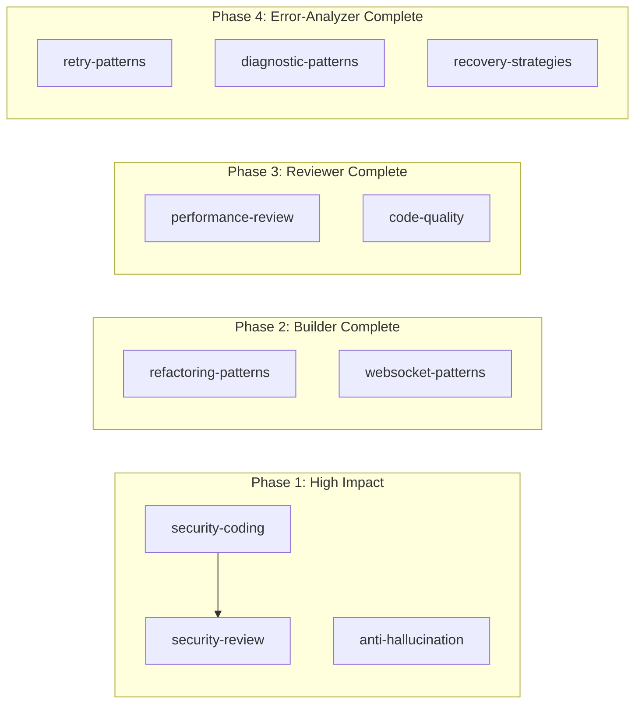

# SPEC-018: Skills Implementation Catalog

> **Status**: implemented | **Version**: 1.1 | **Updated**: 2026-01-24

## 0. Research Summary

### Estado Actual

| Categoría | Implementadas | Faltantes |
|-----------|---------------|-----------|
| Builder skills | 5 | 0 |
| Reviewer skills | 3 | 0 |
| Error-Analyzer skills | 3 | 0 |
| Shared skills | 1 | 0 |
| **Total** | **12/12 (100%)** | **0** |

### Skills Implementadas (8 total, 2 del catálogo SPEC-009)

| Skill | En catálogo SPEC-009 |
|-------|----------------------|
| typescript-patterns | ✅ Sí |
| bun-best-practices | ✅ Sí |
| config-validator | ❌ Extra |
| logging-strategy | ❌ Extra |
| lsp-operations | ❌ Extra |
| code-style-enforcer | ❌ Extra |
| dev-server | ❌ Extra |
| prompt-engineer | ❌ Extra |

### Divergencia de Formato

| Aspecto | SPEC-009 | Actual |
|---------|----------|--------|
| Estructura | `.claude/skills/{agent}/` | `.claude/skills/{skill-name}/` |
| Frontmatter | `for_agents`, `keywords` | `activation.keywords` |
| Archivo | `{skill-name}.md` | `SKILL.md` o `skill.md` |

### Decisión

Mantener estructura actual (flat con subdirectorio por skill) pero normalizar frontmatter.

---

## 1. Vision

> **Press Release**: Implementación completa del catálogo de skills definido en SPEC-009, proporcionando conocimiento especializado para builder, reviewer y error-analyzer.

**Background**: SPEC-009 define 12 skills pero solo 2 están implementadas.

**Usuario objetivo**: Agentes base que necesitan contexto especializado.

**Métricas de éxito**:
- 100% de skills del catálogo implementadas
- Cada skill < 10KB
- Formato normalizado en todas las skills

---

## 2. Goals & Non-Goals

### Goals

- [x] Implementar 10 skills faltantes del catálogo SPEC-009
- [x] Normalizar frontmatter de skills existentes
- [x] Documentar cada skill con patterns, checklist y examples
- [x] Mantener tamaño < 10KB por skill

### Non-Goals

- [ ] Cambiar estructura de directorios existente
- [ ] Eliminar skills extra (config-validator, etc.)
- [ ] Auto-loading de skills (Lead decide)

---

## 3. Skills a Implementar

### 3.1 Builder Skills (3 faltantes)

#### security-coding.md

```yaml
---
name: security-coding
description: Secure coding practices for authentication, validation, and data handling
activation:
  keywords: [security, auth, validation, sanitize, jwt, password, encrypt]
for_agents: [builder]
---
```

**Contenido requerido:**

| Sección | Contenido |
|---------|-----------|
| Input Validation | Zod schemas, sanitization |
| Authentication | JWT handling, password hashing |
| Authorization | Role checks, permission guards |
| Data Protection | Encryption, secure storage |
| Common Vulnerabilities | XSS, SQLi, CSRF prevention |
| Checklist | 10 items de verificación |

**Ejemplo de pattern:**

```typescript
// Input Validation with Zod
const userSchema = z.object({
  email: z.string().email(),
  password: z.string().min(8).regex(/[A-Z]/).regex(/[0-9]/),
});

// Never trust user input
const validated = userSchema.parse(request.body);
```

---

#### refactoring-patterns.md

```yaml
---
name: refactoring-patterns
description: Safe refactoring techniques and SOLID principles
activation:
  keywords: [refactor, extract, SOLID, clean, simplify, decompose]
for_agents: [builder]
---
```

**Contenido requerido:**

| Sección | Contenido |
|---------|-----------|
| Extract Function | When and how |
| Extract Class | Single Responsibility |
| Rename | Safe renaming patterns |
| Move | Relocating code safely |
| SOLID Principles | S, O, L, I, D explained |
| Code Smells | Long method, large class, etc. |
| Checklist | Pre/post refactor verification |

**Ejemplo de pattern:**

```typescript
// BEFORE: Long function
function processOrder(order: Order) {
  // 50 lines of validation
  // 30 lines of calculation
  // 20 lines of persistence
}

// AFTER: Extracted functions
function processOrder(order: Order) {
  validateOrder(order);
  const total = calculateTotal(order);
  await persistOrder(order, total);
}
```

---

#### websocket-patterns.md

```yaml
---
name: websocket-patterns
description: WebSocket and real-time communication patterns
activation:
  keywords: [websocket, ws, realtime, streaming, socket, connection]
for_agents: [builder]
---
```

**Contenido requerido:**

| Sección | Contenido |
|---------|-----------|
| Connection Lifecycle | Open, message, close, error |
| Reconnection | Exponential backoff |
| Message Protocol | JSON structure, types |
| Heartbeat | Ping/pong patterns |
| Room/Channel | Subscription patterns |
| Error Handling | Connection failures |
| Elysia WebSocket | Plugin usage |

**Ejemplo de pattern:**

```typescript
// Elysia WebSocket with reconnection
app.ws('/ws', {
  open(ws) {
    ws.subscribe('updates');
  },
  message(ws, message) {
    const data = JSON.parse(message);
    if (data.type === 'ping') {
      ws.send(JSON.stringify({ type: 'pong' }));
    }
  },
  close(ws) {
    ws.unsubscribe('updates');
  }
});
```

---

### 3.2 Reviewer Skills (3 faltantes)

#### security-review.md

```yaml
---
name: security-review
description: Security audit checklist based on OWASP Top 10
activation:
  keywords: [security, owasp, vulnerability, injection, xss, csrf, audit]
for_agents: [reviewer]
---
```

**Contenido requerido:**

| Sección | Contenido |
|---------|-----------|
| OWASP Top 10 | A01-A10 con ejemplos |
| Injection | SQL, NoSQL, Command |
| XSS | Reflected, Stored, DOM |
| CSRF | Token validation |
| Auth Flaws | Session, JWT issues |
| Secrets | Hardcoded credentials |
| Dependencies | Known vulnerabilities |
| Checklist | 15 items de auditoría |

**Ejemplo de checklist:**

```markdown
## Security Review Checklist

### Input Handling
- [ ] All user input validated with schema
- [ ] SQL queries use parameterized statements
- [ ] HTML output is escaped/sanitized

### Authentication
- [ ] Passwords hashed with bcrypt/argon2
- [ ] JWT secrets not hardcoded
- [ ] Session tokens are httpOnly, secure

### Authorization
- [ ] Every endpoint has auth check
- [ ] Role-based access enforced
- [ ] No horizontal privilege escalation
```

---

#### performance-review.md

```yaml
---
name: performance-review
description: Performance analysis and optimization patterns
activation:
  keywords: [performance, memory, optimize, profiling, slow, latency, cache]
for_agents: [reviewer]
---
```

**Contenido requerido:**

| Sección | Contenido |
|---------|-----------|
| N+1 Queries | Detection and fix |
| Memory Leaks | Event listeners, closures |
| Async Patterns | Promise.all vs sequential |
| Caching | When and where |
| Lazy Loading | Defer expensive ops |
| Bundle Size | Tree shaking, code split |
| Database | Index usage, query plans |
| Checklist | 12 items de performance |

**Ejemplo de pattern:**

```typescript
// BAD: N+1 queries
for (const user of users) {
  const orders = await db.orders.findByUser(user.id); // N queries
}

// GOOD: Single query with join
const usersWithOrders = await db.users.findAll({
  include: ['orders'] // 1 query
});
```

---

#### code-quality.md

```yaml
---
name: code-quality
description: Code quality metrics and smell detection
activation:
  keywords: [quality, smell, complexity, duplication, maintainability]
for_agents: [reviewer]
---
```

**Contenido requerido:**

| Sección | Contenido |
|---------|-----------|
| Code Smells | 10 common smells |
| Complexity | Cyclomatic, cognitive |
| Duplication | DRY violations |
| Naming | Conventions, clarity |
| Comments | When needed vs code smell |
| File Size | Lines per file/function |
| Dependencies | Coupling, cohesion |
| Checklist | 10 quality items |

**Ejemplo de smell detection:**

```markdown
## Code Smell: Long Parameter List

### Detection
Function with > 3 parameters

### Example
```typescript
// BAD
function createUser(name, email, age, address, phone, role) {}

// GOOD - Use object parameter
function createUser(params: CreateUserParams) {}
```

### Fix
Extract to parameter object or builder pattern
```

---

### 3.3 Error-Analyzer Skills (3 faltantes)

#### retry-patterns.md

```yaml
---
name: retry-patterns
description: Retry strategies for transient failures
activation:
  keywords: [retry, timeout, backoff, transient, temporary, network]
for_agents: [error-analyzer]
---
```

**Contenido requerido:**

| Sección | Contenido |
|---------|-----------|
| Error Classification | Transient vs permanent |
| Exponential Backoff | Formula and limits |
| Jitter | Why and how |
| Max Retries | When to stop |
| Circuit Breaker | Integration |
| Idempotency | Safe to retry? |
| Checklist | Retry decision tree |

**Ejemplo de pattern:**

```typescript
// Retry with exponential backoff + jitter
async function withRetry<T>(
  fn: () => Promise<T>,
  maxRetries = 3
): Promise<T> {
  for (let i = 0; i < maxRetries; i++) {
    try {
      return await fn();
    } catch (error) {
      if (!isTransient(error) || i === maxRetries - 1) throw error;
      const delay = Math.min(1000 * 2 ** i, 30000);
      const jitter = delay * 0.2 * Math.random();
      await sleep(delay + jitter);
    }
  }
}
```

---

#### diagnostic-patterns.md

```yaml
---
name: diagnostic-patterns
description: Error diagnosis and debugging strategies
activation:
  keywords: [error, debug, stack, trace, diagnose, investigate]
for_agents: [error-analyzer]
---
```

**Contenido requerido:**

| Sección | Contenido |
|---------|-----------|
| Stack Trace Analysis | Reading and understanding |
| Error Categories | Type, syntax, runtime, logic |
| Common Causes | By error type |
| Debugging Strategy | Systematic approach |
| Log Analysis | What to look for |
| Reproduction | Minimal repro steps |
| Root Cause | 5 Whys technique |

**Ejemplo de analysis:**

```markdown
## Error Analysis Template

### Error Message
`TypeError: Cannot read property 'map' of undefined`

### Stack Trace Location
`src/components/UserList.tsx:15`

### Category
Runtime error - null reference

### Likely Causes
1. API returned null instead of array
2. Initial state is undefined
3. Data not loaded before render

### Investigation Steps
1. Check API response
2. Verify initial state
3. Add loading check

### Fix Pattern
```typescript
// Add defensive check
const users = data?.users ?? [];
return users.map(u => <User key={u.id} {...u} />);
```
```

---

#### recovery-strategies.md

```yaml
---
name: recovery-strategies
description: Error recovery and rollback patterns
activation:
  keywords: [recovery, rollback, checkpoint, failover, restore, undo]
for_agents: [error-analyzer]
---
```

**Contenido requerido:**

| Sección | Contenido |
|---------|-----------|
| Graceful Degradation | Fallback modes |
| Rollback | Database, file changes |
| Checkpoint | Save progress |
| Compensation | Undo partial work |
| State Recovery | Restore from snapshot |
| User Communication | Error messages |
| Escalation | When to involve human |

**Ejemplo de pattern:**

```typescript
// Transaction with rollback
async function transferFunds(from: Account, to: Account, amount: number) {
  const checkpoint = await createCheckpoint([from, to]);

  try {
    await from.debit(amount);
    await to.credit(amount);
    await checkpoint.commit();
  } catch (error) {
    await checkpoint.rollback();
    throw new TransferFailedError(error);
  }
}
```

---

### 3.4 Shared Skills (1 faltante)

#### anti-hallucination.md

```yaml
---
name: anti-hallucination
description: Validation patterns to prevent AI hallucinations
activation:
  keywords: [validate, verify, confidence, claim, check, exists]
for_agents: [builder, reviewer, error-analyzer]
---
```

**Contenido requerido:**

| Sección | Contenido |
|---------|-----------|
| File Validation | Glob before claim |
| Function Validation | LSP/Grep before use |
| Import Validation | Check module exists |
| API Validation | Verify endpoint exists |
| Confidence Levels | When to ask |
| Tools Hierarchy | LSP > Grep > Glob |
| Checklist | Pre-action validation |

**Ejemplo de validation:**

```markdown
## Anti-Hallucination Rules

### Before claiming a file exists
```
Glob("**/filename.ts") → verify exists
```

### Before claiming a function exists
```
LSP.findReferences("functionName") OR
Grep("function functionName")
```

### Before editing
```
Read(file) → understand context → Edit
```

### Confidence Levels
| Level | Action |
|-------|--------|
| >90% | Proceed |
| 70-90% | Verify first |
| <70% | Ask user |
```

---

## 4. Implementation Order



| Phase | Skills | Priority |
|-------|--------|----------|
| 1 | security-coding, security-review, anti-hallucination | Critical |
| 2 | refactoring-patterns, websocket-patterns | High |
| 3 | performance-review, code-quality | Medium |
| 4 | retry-patterns, diagnostic-patterns, recovery-strategies | Medium |

---

## 5. Frontmatter Normalization

Actualizar skills existentes para usar formato consistente:

```yaml
# Formato normalizado
---
name: skill-name
description: One-line description
activation:
  keywords: [keyword1, keyword2]
for_agents: [builder]  # Añadir este campo
version: "1.0"         # Añadir versión
---
```

---

## 6. Acceptance Criteria (BDD)

```gherkin
Feature: Skills Implementation

Scenario: Todas las skills del catálogo implementadas
  Given catálogo SPEC-009 define 12 skills
  When verifico .claude/skills/
  Then existen 12 archivos de skills
  And cada uno tiene frontmatter válido

Scenario: Skill tiene formato correcto
  Given cualquier skill en .claude/skills/
  When leo el archivo
  Then tiene frontmatter con: name, description, activation.keywords, for_agents
  And tiene secciones: Purpose/Rules, Patterns, Checklist
  And tamaño < 10KB

Scenario: Builder puede usar security-coding
  Given skill security-coding implementada
  When builder recibe task de auth
  And Lead carga security-coding
  Then builder aplica patterns de la skill
```

---

## 7. Open Questions

- [ ] ¿Migrar estructura a carpetas por agente (como SPEC-009)?
- [ ] ¿Crear skill index file para discovery?

---

## 8. Sources

- [SPEC-009: Skills System](./skills-system.md) - Catálogo original
- [OWASP Top 10 2021](https://owasp.org/Top10/) - Security review
- [Refactoring.Guru](https://refactoring.guru/) - Refactoring patterns
- [AWS Retry Behavior](https://docs.aws.amazon.com/general/latest/gr/api-retries.html) - Retry patterns

---

## 9. Next Steps

- [x] Crear security-coding.md
- [x] Crear security-review.md
- [x] Crear anti-hallucination.md
- [x] Crear refactoring-patterns.md
- [x] Crear websocket-patterns.md
- [x] Crear performance-review.md
- [x] Crear code-quality.md
- [x] Crear retry-patterns.md
- [x] Crear diagnostic-patterns.md
- [x] Crear recovery-strategies.md
- [x] Normalizar frontmatter de skills existentes
