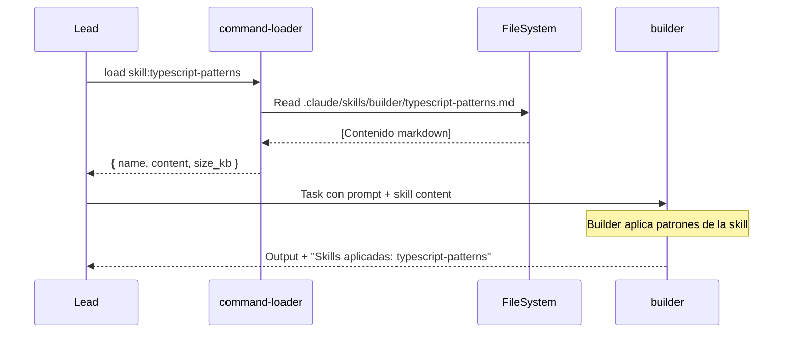

# Spec: Skills System

<!--
status: approved
priority: high
depends_on: [SPEC-001, SPEC-007]
enables: [SPEC-004, SPEC-005, SPEC-008]
created: 2026-01-18
updated: 2026-01-18
version: 1.0
architecture: base-agents-plus-skills
-->

## 0. Research Summary

### Fuentes Consultadas

| Tipo | Fuente | Link | Relevancia |
|------|--------|------|------------|
| Docs oficial | Claude Code Skills | [code.claude.com](https://code.claude.com/docs/en/skills) | Alta |
| Deep dive | Inside Claude Code Skills | [mikhail.io](https://mikhail.io/2025/10/claude-code-skills/) | Alta |
| Deep dive | Claude Agent Skills First Principles | [leehanchung](https://leehanchung.github.io/blogs/2025/10/26/claude-skills-deep-dive/) | Alta |
| Best practice | Composable System Prompts | [Medium](https://medium.com/nick-tune-tech-strategy-blog/composable-claude-code-system-prompts-4a39132e8196) | Media |
| Security | Prompt Injection in Skills | [Lasso Security](https://www.lasso.security/blog/the-hidden-backdoor-in-claude-coding-assistant) | Media |

### Decisiones Informadas por Research

| Decisión | Basada en |
|----------|-----------|
| **Skills = instrucciones inyectadas** | [mikhail.io](https://mikhail.io/2025/10/claude-code-skills/): "Skills aren't separate processes, sub-agents, or external tools: they're injected instructions" |
| **Archivos standalone** | Docs oficiales recomiendan `.claude/skills/` con archivos `.md` |
| **LLM decide qué skill usar** | [leehanchung](https://leehanchung.github.io/blogs/2025/10/26/claude-skills-deep-dive/): "system formats all available skills into a text description... lets Claude's language model make the decision" |
| **Keywords para auto-trigger** | [Medium](https://medium.com/nick-tune-tech-strategy-blog/composable-claude-code-system-prompts-4a39132e8196): "auto-injection based on keywords and phrases" |

### Información No Encontrada

- Benchmarks de context window usage con múltiples skills
- Límite recomendado de skills por agente
- Patrones de composición de skills

### Confidence Assessment

| Área | Nivel | Razón |
|------|-------|-------|
| Mecanismo de inyección | Alta | Múltiples fuentes coinciden |
| Estructura de archivos | Alta | Docs oficiales claros |
| Keywords trigger | Media | Una fuente principal |
| Seguridad (injection) | Alta | CVEs documentados |

---

## 1. Vision

> **Press Release**: Claude Code Poneglyph introduce un sistema de Skills modular donde cada skill es un archivo markdown standalone en `.claude/skills/`. Las skills proveen conocimiento especializado (patrones, checklists, ejemplos) que el Lead carga vía command-loader y pasa a los agentes base. Esto permite especialización sin proliferación de agentes.

**Background**:
- Arquitectura "Base + Skills" requiere un sistema formal de skills
- Los archivos `load-*` actuales son proto-skills pero híbridos
- Necesitamos skills auto-contenidas, versionadas, combinables

**Usuario objetivo**: Agentes (builder, reviewer, error-analyzer) que necesitan contexto especializado.

**Métricas de éxito**:
- Cada skill < 10KB para no saturar context
- Skills cubren 100% de dominios del Skills Mapping (INDEX.md)
- command-loader puede cargar cualquier skill en <100ms

## 2. Goals & Non-Goals

### Goals

- [x] Skills como archivos markdown standalone en `.claude/skills/`
- [x] Estructura estándar con frontmatter YAML
- [x] Keywords para discovery por el planner
- [x] Catálogo inicial de 10 skills core
- [x] Compatibilidad con command-loader (SPEC-007)
- [x] Skills combinables (Lead puede cargar múltiples)

### Non-Goals

- [ ] Skills que modifican comportamiento de agentes (comportamiento es inmutable)
- [ ] Auto-trigger por keywords (Lead decide explícitamente)
- [ ] Skills con código ejecutable (solo conocimiento)
- [ ] Herencia entre skills (mantener simple)
- [ ] Versionado complejo de skills (semver sería overkill)

## 3. Alternatives Considered

| Alternativa | Pros | Cons | Fuente | Decisión |
|-------------|------|------|--------|----------|
| **A. Archivos standalone** | Simple, auto-contenido | Posible duplicación | [Docs oficiales](https://code.claude.com/docs/en/skills) | ✅ Elegida |
| B. Skills como loaders (load-*) | Ya existe | Requiere docs/ separados | Código actual | ❌ Más complejo |
| C. skills.json registry | Estructurado | Over-engineering | - | ❌ Innecesario |
| D. Skills en base de datos | Dinámico | Overkill, no standard | - | ❌ No alineado |

## 4. Design

### 4.1 Estructura de Directorios

```
.claude/
├── skills/                    # Skills standalone
│   ├── builder/               # Skills para builder
│   │   ├── typescript-patterns.md
│   │   ├── bun-best-practices.md
│   │   ├── security-coding.md
│   │   ├── refactoring-patterns.md
│   │   └── websocket-patterns.md
│   ├── reviewer/              # Skills para reviewer
│   │   ├── security-review.md
│   │   ├── performance-review.md
│   │   └── code-quality.md
│   ├── error-analyzer/        # Skills para error-analyzer
│   │   ├── retry-patterns.md
│   │   ├── diagnostic-patterns.md
│   │   └── recovery-strategies.md
│   └── shared/                # Skills compartidas
│       └── anti-hallucination.md
├── commands/                  # Slash commands (existente)
└── agents/                    # Agent definitions (existente)
```

### 4.2 Formato Estándar de Skill

```markdown
---
name: typescript-patterns
version: 1.0
for_agents: [builder]
keywords: [typescript, async, types, interface, generic, promise]
size_kb: 8
---

# TypeScript Patterns

## Purpose
Patrones y mejores prácticas para código TypeScript en este proyecto.

## Patterns

### 1. Type Safety
[Contenido específico...]

### 2. Async/Await
[Contenido específico...]

### 3. Error Handling
[Contenido específico...]

## Checklist
- [ ] Todos los parámetros tipados
- [ ] No usar `any`, preferir `unknown`
- [ ] Interfaces sobre types para objetos
- [ ] Async functions con try/catch

## Examples

### Good
```typescript
// Ejemplo de código correcto
```

### Bad
```typescript
// Ejemplo de código incorrecto
```

## References
- [TypeScript Handbook](https://www.typescriptlang.org/docs/handbook/)
```

### 4.3 Frontmatter Schema

| Campo | Tipo | Requerido | Descripción |
|-------|------|-----------|-------------|
| `name` | string | ✅ | Identificador único de la skill |
| `version` | string | ✅ | Versión semántica simplificada (1.0, 1.1, etc.) |
| `for_agents` | string[] | ✅ | Agentes que pueden usar esta skill |
| `keywords` | string[] | ✅ | Para discovery por planner |
| `size_kb` | number | ⚠️ | Tamaño estimado para budget de context |
| `depends_on` | string[] | ❌ | Skills prerrequisito (opcional) |

### 4.4 Secciones Estándar

| Sección | Obligatoria | Propósito |
|---------|-------------|-----------|
| `# [Skill Name]` | ✅ | Título |
| `## Purpose` | ✅ | Por qué existe esta skill |
| `## Patterns` | ✅ | Patrones organizados por categoría |
| `## Checklist` | ✅ | Verificación rápida |
| `## Examples` | ⚠️ | Good/Bad examples cuando aplica |
| `## References` | ❌ | Links externos (opcional) |

### 4.5 Flujo de Carga



### 4.6 Discovery por Planner

El planner usa keywords para sugerir skills:

```yaml
# Ejemplo de matching
task: "Implementar auth service con JWT"
keywords_detected: [auth, security, jwt]
matched_skills:
  - security-coding (keywords: [security, auth, validation])
  - typescript-patterns (keywords: [typescript])
suggested_skills: [security-coding, typescript-patterns]
```

### 4.7 Límites

| Límite | Valor | Razón |
|--------|-------|-------|
| Max skills por task | 3 | Evitar context overflow |
| Max size por skill | 10KB | ~2500 tokens, manejable |
| Max total size cargado | 25KB | ~6250 tokens para skills |

### 4.8 Catálogo de Skills Core (v1.0)

#### Para Builder (5)

| Skill | Keywords | Size Est. |
|-------|----------|-----------|
| `typescript-patterns` | typescript, async, types, interface | 8KB |
| `bun-best-practices` | bun, elysia, test, file | 6KB |
| `security-coding` | security, auth, validation, sanitize | 8KB |
| `refactoring-patterns` | refactor, extract, SOLID, clean | 7KB |
| `websocket-patterns` | websocket, ws, realtime, streaming | 5KB |

#### Para Reviewer (3)

| Skill | Keywords | Size Est. |
|-------|----------|-----------|
| `security-review` | security, owasp, vulnerability, injection | 9KB |
| `performance-review` | performance, memory, optimize, profiling | 6KB |
| `code-quality` | quality, smell, complexity, duplication | 7KB |

#### Para Error-Analyzer (3)

| Skill | Keywords | Size Est. |
|-------|----------|-----------|
| `retry-patterns` | retry, timeout, backoff, transient | 5KB |
| `diagnostic-patterns` | error, debug, stack, trace | 6KB |
| `recovery-strategies` | recovery, rollback, checkpoint, failover | 5KB |

#### Shared (1)

| Skill | Keywords | Size Est. |
|-------|----------|-----------|
| `anti-hallucination` | validate, verify, confidence, claim | 4KB |

**Total: 12 skills, ~76KB**

## 5. FAQ

**Q: ¿Qué pasa si el planner sugiere una skill que no existe?**
A: command-loader devuelve error con lista de skills disponibles. Lead informa al usuario.

**Q: ¿El agente puede ignorar una skill cargada?**
A: No "ignorar", pero el agente decide qué patrones aplicar. Skill es contexto, no mandato.

**Q: ¿Cómo evitamos skills muy grandes?**
A: Frontmatter incluye `size_kb`. Planner respeta límite de 25KB total.

**Q: ¿Cómo actualizamos skills?**
A: Editar archivo directamente. `version` en frontmatter para tracking.

**Q: ¿Las skills load-* actuales se eliminan?**
A: Se migran. `load-security` → `security-coding` + `security-review`.

**Q: ¿Qué es lo más difícil/riesgoso?**
A: **Prompt injection** via skills. Mitigación: skills son código versionado, no input de usuario.

## 6. Acceptance Criteria (BDD)

```gherkin
Feature: Skills System v1.0

  Background:
    Given directorio .claude/skills/ existe
    And contiene skills con formato estándar

  Scenario: command-loader carga skill existente
    Given skill typescript-patterns.md existe en .claude/skills/builder/
    When Lead pide "load skill:typescript-patterns"
    Then command-loader lee el archivo
    And retorna { name: "typescript-patterns", content: "...", size_kb: 8 }

  Scenario: command-loader maneja skill inexistente
    Given skill "unicorn-patterns" no existe
    When Lead pide "load skill:unicorn-patterns"
    Then command-loader retorna error
    And incluye lista de skills disponibles en .claude/skills/

  Scenario: Planner sugiere skills por keywords
    Given task contiene palabras "auth", "security"
    When planner analiza la task
    Then sugiere skill "security-coding"
    And incluye razón en skillReason

  Scenario: Lead pasa skill a builder
    Given Lead cargó skill "security-coding"
    When Lead invoca builder con task
    Then prompt incluye contenido de security-coding
    And builder reporta "Skills aplicadas: security-coding"

  Scenario: Límite de skills respetado
    Given planner sugiere 5 skills (40KB total)
    When Lead intenta cargar todas
    Then Lead carga solo las 3 más relevantes
    And total size < 25KB

  Scenario: Skill tiene formato válido
    Given cualquier archivo en .claude/skills/
    When se parsea el frontmatter YAML
    Then contiene campos: name, version, for_agents, keywords
    And tiene secciones: Purpose, Patterns, Checklist
```

## 7. Open Questions

- [x] ~~¿Directorio plano o por agente?~~ Por agente (builder/, reviewer/, etc.)
- [x] ~~¿Deberíamos tener un comando `/skills` para listar disponibles?~~ Creado en `.claude/commands/skills.md`
- [ ] ¿Skills pueden tener ejemplos de código ejecutable (tests)?

## 8. Sources

### Links Verificados

- [Claude Code Docs: Skills](https://code.claude.com/docs/en/skills) - Estructura oficial
- [Inside Claude Code Skills](https://mikhail.io/2025/10/claude-code-skills/) - Mecanismo de inyección
- [Claude Agent Skills Deep Dive](https://leehanchung.github.io/blogs/2025/10/26/claude-skills-deep-dive/) - Selection mechanism
- [Composable System Prompts](https://medium.com/nick-tune-tech-strategy-blog/composable-claude-code-system-prompts-4a39132e8196) - Keywords trigger
- [Prompt Injection in Claude Code](https://www.lasso.security/blog/the-hidden-backdoor-in-claude-coding-assistant) - Security considerations

## 9. Next Steps

1. [x] Crear directorio `.claude/skills/` con estructura - **DONE** (20 skills creadas)
2. [x] Crear 12 skills del catalogo core - **DONE** (superado: 20 skills)
3. [x] Actualizar SPEC-007 (command-loader) para soportar skills - **DONE** (v1.1, 2026-01-25)
4. [ ] Migrar load-* commands a skills equivalentes
5. [x] Crear comando `/skills` para listar disponibles - **DONE** (`.claude/commands/skills.md`)

---

## 10. Skills Inventory (Current State)

### Conteo: 20 skills totales

| Categoria | Skills | Status |
|-----------|--------|--------|
| Builder | 7 | typescript-patterns, bun-best-practices, websocket-patterns, security-coding, refactoring-patterns, config-validator, logging-strategy |
| Reviewer | 3 | security-review, performance-review, code-quality |
| Error-Analyzer | 3 | retry-patterns, diagnostic-patterns, recovery-strategies |
| Shared | 2 | anti-hallucination, lsp-operations |
| Meta/Operational | 5 | create-agent, create-skill, dev-server, code-style-enforcer, prompt-engineer |

### Propuesta de Reorganizacion

Estructura actual (flat) vs propuesta (por agente):

```
# Actual
.claude/skills/
|-- typescript-patterns/SKILL.md
|-- security-review/SKILL.md
|-- retry-patterns/SKILL.md
...

# Propuesta (SPEC-009 4.1)
.claude/skills/
|-- builder/
|   |-- typescript-patterns.md
|   |-- bun-best-practices.md
|-- reviewer/
|   |-- security-review.md
|-- error-analyzer/
|   |-- retry-patterns.md
|-- shared/
|   |-- anti-hallucination.md
```

**Nota**: Migracion pendiente. Estructura actual funcional.

---

## Changelog

| Version | Fecha | Cambios |
|---------|-------|---------|
| 1.0.0 | 2026-01-18 | Spec inicial. Estructura standalone, 12 skills core, formato estandar |
| 1.1.0 | 2026-01-24 | Comando /skills creado. 20 skills implementadas. Inventario actualizado |
