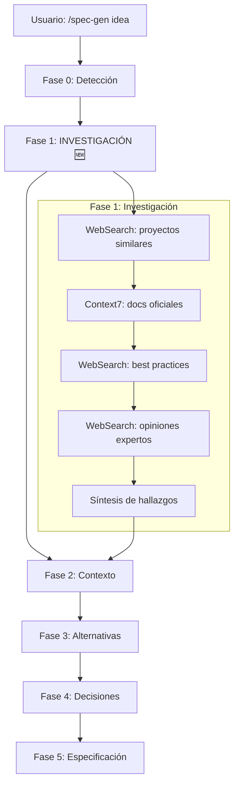

# Spec: /spec-gen Command v2.0

<!--
status: approved
priority: high
depends_on: []
enables: []
created: 2026-01-18
updated: 2026-01-18
version: 2.0
-->

## 1. Vision

> **Press Release**: El comando `/spec-gen` ahora incluye una **Fase de Investigación obligatoria** que busca en internet, consulta documentación oficial, analiza proyectos exitosos similares y recopila opiniones de expertos ANTES de facilitar la sesión de discovery. Esto reduce alucinaciones, fundamenta decisiones en datos actualizados y eleva la calidad de las especificaciones generadas.

**Background**: La versión actual (v1.0) salta directamente a preguntas sin investigar el estado del arte. Esto puede llevar a:
- Decisiones basadas en conocimiento desactualizado
- Ignorar best practices de la industria
- Reinventar la rueda
- Alucinaciones sobre tecnologías o patrones

**Usuario objetivo**: Desarrollador que quiere specs fundamentadas en investigación real, no en suposiciones.

**Métricas de éxito**:
- 100% de specs incluyen sección "Research Findings"
- 0% de recomendaciones sin fuente verificable
- Reducción de re-trabajo por decisiones mal informadas

## 2. Goals & Non-Goals

### Goals
- [x] Nueva **Fase de Investigación** antes de Contexto
- [x] Búsqueda obligatoria en internet (WebSearch)
- [x] Consulta de documentación oficial (Context7)
- [x] Análisis de proyectos similares exitosos
- [x] Recopilación de opiniones de expertos/foros
- [x] **Anti-Hallucination**: Citar fuentes, admitir incertidumbre
- [x] **Priorizar datos actualizados** (2024-2025)
- [x] Sección "Research Findings" en output

### Non-Goals
- [ ] Investigación exhaustiva (limitar a 3-5 fuentes clave)
- [ ] Generar specs sin investigación (siempre investigar)
- [ ] Reemplazar juicio humano (facilitar, no decidir)

## 3. Alternatives Considered

| Alternativa | Pros | Cons | Decisión |
|-------------|------|------|----------|
| **A. Research Phase obligatoria** | Fundamenta decisiones, reduce alucinaciones | Más lento | ✅ Elegida |
| B. Research opcional (flag) | Más rápido para casos simples | Inconsistente, fácil de saltar | ❌ |
| C. Research solo si usuario pide | Mínimo overhead | Specs de baja calidad por defecto | ❌ |
| D. Mantener v1 sin research | Rápido | Alucinaciones, decisiones pobres | ❌ |

## 4. Design

### 4.1 Fases del Proceso (v2.0)



### 4.2 Fase 1: Investigación (NUEVA)

**Objetivo**: Recopilar información actualizada y verificable ANTES de facilitar.

#### 4.2.1 Fuentes de Investigación

| Fuente | Tool | Qué buscar | Prioridad |
|--------|------|------------|-----------|
| **Proyectos similares** | WebSearch | "[tecnología] + [problema] + github + 2024" | Alta |
| **Documentación oficial** | Context7 | API, patrones recomendados | Alta |
| **Best practices** | WebSearch | "[tecnología] best practices 2025" | Alta |
| **Opiniones expertos** | WebSearch | "[tema] + reddit/hackernews/dev.to" | Media |
| **Casos de éxito** | WebSearch | "[empresa] + [problema] + case study" | Media |

#### 4.2.2 Queries de Investigación (Templates)

```yaml
# Para cada spec, ejecutar al menos 3 de estas búsquedas
queries:
  similar_projects: "{stack} {feature} open source github stars:>100"
  official_docs: Context7("{library}") → patterns, best practices
  industry_practices: "{feature} best practices {year} production"
  expert_opinions: "{feature} pros cons {stack} site:reddit.com OR site:news.ycombinator.com"
  case_studies: "{feature} implementation case study {industry}"
  anti_patterns: "{feature} mistakes to avoid common pitfalls"
```

#### 4.2.3 Output de Investigación

```markdown
## Research Findings

### Proyectos Similares Analizados
| Proyecto | Repo/Link | Relevancia | Aprendizaje clave |
|----------|-----------|------------|-------------------|
| Proyecto X | github.com/... | Alta | Usa patrón Y |

### Documentación Oficial Consultada
| Fuente | Link | Versión | Insight |
|--------|------|---------|---------|
| Elysia docs | Context7 | 1.0 | Recomienda middleware X |

### Best Practices Encontradas
| Práctica | Fuente | Aplicabilidad |
|----------|--------|---------------|
| Usar X en lugar de Y | [Link] | Directa |

### Opiniones de Expertos
| Experto/Foro | Opinión | Consenso |
|--------------|---------|----------|
| Reddit r/typescript | Prefieren A sobre B | 70% acuerdo |

### Datos Actualizados (2024-2025)
| Dato | Fuente | Fecha | Relevancia |
|------|--------|-------|------------|
| Library X es 2x más rápida | Benchmark [Link] | 2025-01 | Alta |
```

### 4.3 Anti-Hallucination Patterns

#### 4.3.1 Reglas Obligatorias

| Regla | Implementación |
|-------|----------------|
| **Citar fuentes** | Toda afirmación técnica debe tener `[Fuente]` |
| **Admitir incertidumbre** | Si no hay fuente: "No encontré datos sobre X" |
| **Priorizar reciente** | Preferir fuentes 2024-2025 sobre anteriores |
| **Verificar existencia** | Antes de recomendar lib: verificar que existe |
| **No inventar stats** | Solo citar estadísticas con fuente verificable |

#### 4.3.2 Frases Anti-Hallucination

```yaml
# Usar cuando hay incertidumbre
uncertainty_phrases:
  - "Según [fuente], ..."
  - "No encontré información actualizada sobre X"
  - "Basado en mi investigación (puede haber cambiado): ..."
  - "La documentación oficial no menciona X, pero..."
  - "Opiniones divididas: A dice X, B dice Y"

# NUNCA usar
forbidden_phrases:
  - "Es bien sabido que..." (sin fuente)
  - "La mejor práctica es..." (sin citar quién lo dice)
  - "Todos usan..." (sin datos)
  - "Obviamente..." (puede no ser obvio)
```

#### 4.3.3 Confidence Levels

```yaml
# Añadir a cada recomendación
confidence_levels:
  high: "Documentación oficial + múltiples fuentes coinciden"
  medium: "Una fuente confiable, sin contradicciones"
  low: "Solo opiniones, sin documentación oficial"
  unknown: "No encontré información verificable"
```

### 4.4 Flujo Completo v2.0

```
Usuario: /spec-gen quiero añadir auth JWT

Claude (Detección):
> Detecté proyecto TypeScript/Bun/Elysia. Modo: Brownfield.

Claude (Investigación - NUEVO):
> Iniciando investigación...
>
> 🔍 Buscando proyectos similares...
> 🔍 Consultando documentación Elysia (Context7)...
> 🔍 Buscando best practices JWT 2025...
> 🔍 Revisando opiniones en Reddit/HN...
>
> ## Research Findings
>
> ### Documentación Oficial (Context7)
> - Elysia tiene plugin `@elysiajs/jwt` oficial
> - Recomienda usar `bearer` middleware
> - [Fuente: Context7 Elysia docs]
>
> ### Best Practices 2025
> - Preferir access + refresh tokens
> - httpOnly cookies > localStorage
> - [Fuente: OWASP JWT Cheatsheet 2024]
>
> ### Proyectos Similares
> - `elysia-auth-example` (⭐ 234) usa este patrón
> - [Fuente: github.com/...]
>
> ### Opiniones Expertos
> - Reddit r/typescript: 80% prefiere jose sobre jsonwebtoken
> - [Fuente: reddit.com/r/typescript/...]
>
> **Confidence**: Alta (documentación oficial + múltiples fuentes)

Claude (Contexto):
> Con esta investigación, podemos proceder:
> 1. ¿Access + refresh tokens o solo access?
> 2. ¿Cookies httpOnly o headers?
> ...
```

### 4.5 Sección Research en Output Final

La spec generada DEBE incluir una sección de research:

```markdown
# Spec: [Feature]

## 0. Research Summary (NUEVO)

### Fuentes Consultadas
| Tipo | Fuente | Relevancia |
|------|--------|------------|
| Docs oficial | Context7 Elysia | Alta |
| Best practices | OWASP 2024 | Alta |
| Proyecto similar | github.com/x | Media |

### Decisiones Informadas por Research
| Decisión | Basada en |
|----------|-----------|
| Usar @elysiajs/jwt | Documentación oficial recomienda |
| httpOnly cookies | OWASP best practice |

### Información No Encontrada
- Benchmarks de rendimiento JWT en Bun (no hay datos 2025)

### Confidence Assessment
| Aspecto | Confidence | Razón |
|---------|------------|-------|
| Arquitectura | Alta | Docs oficiales |
| Performance | Baja | Sin benchmarks |
```

## 5. Técnicas de Facilitación (Actualizado)

### Core (siempre usar)

| Técnica | Cuándo | Ahora incluye |
|---------|--------|---------------|
| **Research First** 🆕 | Siempre al inicio | WebSearch + Context7 |
| **5 Whys** | Raíz del problema | Informado por research |
| **Trade-off Analysis** | Comparar alternativas | Con datos reales |
| **MoSCoW** | Priorizar scope | Basado en best practices |
| **Devil's Advocate** | Validar decisiones | Citando contra-argumentos |
| **Source Verification** 🆕 | Toda afirmación | Links verificables |

### Research Techniques (NUEVAS)

| Técnica | Cuándo | Ejemplo |
|---------|--------|---------|
| **Competitive Analysis** | Proyectos similares | "¿Cómo lo hace X?" |
| **Doc Diving** | Antes de recomendar | Context7 → API oficial |
| **Community Pulse** | Opiniones | Reddit/HN sobre tecnología |
| **Recency Check** | Siempre | "¿Esto es de 2024-2025?" |
| **Confidence Calibration** | Al final | "Alta/Media/Baja/Unknown" |

## 6. Tools Requeridas

```yaml
required_tools:
  - WebSearch  # Búsquedas generales
  - WebFetch   # Leer páginas específicas
  - mcp__context7__query-docs  # Documentación oficial
  - mcp__context7__resolve-library-id  # Resolver librerías
  - Read       # Leer codebase existente
  - Glob       # Detectar stack
  - Grep       # Buscar patrones existentes

research_order:
  1. Context7 (documentación oficial - más confiable)
  2. WebSearch (proyectos similares, best practices)
  3. WebSearch (opiniones expertos)
  4. WebFetch (profundizar en links relevantes)
```

## 7. Formato Output v2.0

```markdown
# Spec: [Feature Name]

<!--
status: draft
priority: high
research_confidence: high | medium | low
sources_count: N
-->

## 0. Research Summary 🆕
[Sección obligatoria con fuentes]

## 1. Vision
[Informada por research]

## 2. Goals & Non-Goals
[Basados en best practices encontradas]

## 3. Alternatives Considered
[Con pros/cons de fuentes reales]

## 4. Design
[Siguiendo patrones documentados]

## 5. FAQ
[Respondidas con investigación]

## 6. Acceptance Criteria

## 7. Open Questions
[Lo que NO se encontró en research]

## 8. Sources 🆕
### Links Verificados
- [Nombre](URL) - Qué aporta
- ...

### Confidence Assessment
| Área | Nivel | Razón |
|------|-------|-------|
```

## 8. Ejemplo de Sesión v2.0

```
Usuario: /spec-gen quiero implementar rate limiting

Claude (Detección):
> Detecté: Bun + Elysia + TypeScript. Modo: Brownfield.

Claude (Investigación):
> 🔍 Iniciando Research Phase...
>
> **Context7**: Consultando docs de Elysia...
> - Plugin oficial: `elysia-rate-limit` existe ✓
> - Soporta Redis para distributed ✓
>
> **WebSearch**: "rate limiting best practices 2025"
> - Token bucket > sliding window para APIs (Cloudflare blog)
> - 429 status + Retry-After header obligatorio (RFC 6585)
>
> **WebSearch**: "elysia rate limit production"
> - Proyecto ejemplo: github.com/elysiajs/elysia-rate-limit (⭐ 89)
> - Issue conocido: memoria en cluster (usar Redis)
>
> **Expertos**: Reddit r/node
> - Consenso: Redis para producción, memoria solo para dev
>
> ## Research Findings
>
> | Decisión | Fuente | Confidence |
> |----------|--------|------------|
> | Usar elysia-rate-limit | Docs oficiales | Alta |
> | Token bucket algorithm | Cloudflare 2024 | Alta |
> | Redis para distributed | Reddit + GitHub issues | Media |
>
> **No encontré**: Benchmarks de elysia-rate-limit en Bun

Claude (Contexto):
> Con esta investigación, tengo preguntas:
> 1. ¿Solo API o también WebSocket?
> 2. ¿Single instance o distributed (Redis)?
> 3. ¿Rate por IP, por user, o ambos?

[Continúa sesión informada por research...]
```

## 9. Anti-Patterns

| ❌ No hacer | ✅ Hacer |
|-------------|----------|
| Recomendar sin investigar | Research Phase primero |
| Afirmar sin fuente | Citar [Fuente] siempre |
| Ignorar docs oficiales | Context7 obligatorio |
| Solo conocimiento interno | WebSearch actualizado |
| Inventar estadísticas | Solo stats con fuente |
| Asumir best practices | Verificar en docs/foros |
| Saltarse incertidumbre | Admitir "no encontré X" |

## 10. Implementación

Actualizar `.claude/commands/spec-gen.md`:

1. Añadir Fase 1: Investigación después de Detección
2. Añadir templates de queries de búsqueda
3. Añadir sección "Research Findings" al output
4. Añadir reglas de anti-hallucination
5. Añadir confidence levels

---

**Status: APPROVED**
**Version: 2.0** - Research Phase obligatoria, Anti-Hallucination, Confidence Levels

**Sources**:
- [Pragmatic Engineer: RFCs and Design Docs](https://newsletter.pragmaticengineer.com/p/software-engineering-rfc-and-design)
- [Design Docs at Google](https://www.industrialempathy.com/posts/design-docs-at-google/)
- [HashiCorp RFC Template](https://works.hashicorp.com/articles/rfc-template)
- [Uptech: Project Discovery](https://www.uptech.team/blog/project-discovery)
- [Morphik: Eliminate Hallucinations Guide](https://www.morphik.ai/blog/eliminate-hallucinations-guide)
- [Lakera: LLM Hallucinations 2025](https://www.lakera.ai/blog/guide-to-hallucinations-in-large-language-models)
