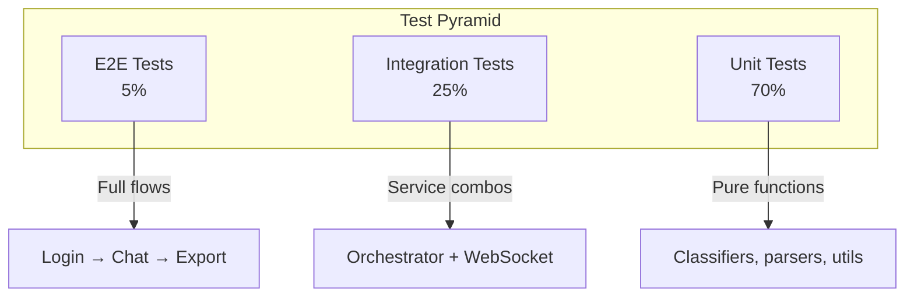

# SPEC-017: Testing Strategy

> **Status**: approved | **Version**: 1.0 | **Updated**: 2026-01-21

## 0. Research Summary

### Fuentes Consultadas

| Tipo | Fuente | Link | Relevancia |
|------|--------|------|------------|
| Bun test docs | Bun.com | [Link](https://bun.com/docs/test) | Alta |
| Bun coverage | Bun.com | [Link](https://bun.com/guides/test/coverage) | Alta |
| Coverage gap | Charpeni | [Link](https://www.charpeni.com/blog/bun-code-coverage-gap) | Alta |
| Context7 | Bun docs | /oven-sh/bun | Alta |
| TDD with Bun | DEV.to | [Link](https://dev.to/robertobutti/test-driven-development-tdd-with-bun-test-4nnh) | Media |

### Decisiones Informadas por Research

| Decisión | Basada en |
|----------|-----------|
| `bun test` como runner único | Native TS support, Jest-compatible |
| Coverage con `--coverage` flag | Built-in, genera lcov |
| Import dinámico para coverage completo | Charpeni - Bun solo trackea archivos importados |
| Lifecycle hooks para setup/teardown | Context7 Bun docs |
| Mock con `mock.module()` | Context7 Bun docs |

### Confidence Assessment

| Área | Nivel | Razón |
|------|-------|-------|
| Test runner | Alta | Official docs + Context7 |
| Coverage | Alta | Documented + known gaps |
| Mocking | Alta | Context7 examples |
| E2E | Baja | No research específico |

---

## 1. Vision

> **Press Release**: La Testing Strategy define estándares, patterns y targets de coverage para asegurar calidad consistente en el orquestador, con tests automatizados en CI y coverage reports.

**Background**: Coverage actual es ~15%. Tests existentes algunos failing. Sin estándar de testing.

**Usuario objetivo**: Desarrolladores que contribuyen al proyecto.

**Métricas de éxito**:
- Coverage >70% en código crítico
- CI bloquea PRs con tests failing
- Tiempo de test suite <60s

---

## 2. Goals & Non-Goals

### Goals

- [ ] Definir test patterns para cada capa (services, hooks, components)
- [ ] Establecer coverage targets por módulo
- [ ] Configurar CI para coverage enforcement
- [ ] Documentar mocking strategies
- [ ] Crear test utilities compartidas
- [ ] Arreglar tests failing existentes

### Non-Goals

- [ ] 100% coverage (overkill para este proyecto)
- [ ] E2E tests con browser automation (futuro)
- [ ] Performance benchmarking (separate concern)
- [ ] Contract testing con APIs externas

---

## 3. Alternatives Considered

| Alternativa | Pros | Cons | Fuente | Decisión |
|-------------|------|------|--------|----------|
| **bun test** | Native, fast, Jest-compatible | Menos mature que Jest | [Bun docs](https://bun.com/docs/test) | ✅ Ya en uso |
| Jest | Battle-tested | Slow con TS, config hell | - | ❌ Overkill |
| Vitest | Fast, modern | Another runtime | - | ❌ Unnecessary |
| No tests | Fast to ship | Regresiones | - | ❌ Inaceptable |

---

## 4. Design

### 4.1 Test Pyramid



### 4.2 Directory Structure

```
claude-code-ui/
├── server/
│   └── src/
│       ├── services/
│       │   ├── claude.ts
│       │   └── claude.test.ts         # Co-located
│       ├── __tests__/
│       │   └── integration/           # Integration tests
│       │       └── orchestrator.int.test.ts
│       └── __mocks__/                 # Shared mocks
│           ├── anthropic.ts
│           └── openai.ts
└── web/
    └── src/
        ├── components/
        │   ├── StreamingChat.tsx
        │   └── StreamingChat.test.tsx # Co-located
        ├── hooks/
        │   ├── useWebSocket.ts
        │   └── useWebSocket.test.ts
        └── __tests__/
            ├── integration/
            └── test-utils.tsx         # Testing utilities
```

### 4.3 Naming Conventions

| Pattern | File | Example |
|---------|------|---------|
| Unit test | `*.test.ts` | `claude.test.ts` |
| Integration test | `*.int.test.ts` | `orchestrator.int.test.ts` |
| E2E test | `*.e2e.test.ts` | `chat-flow.e2e.test.ts` |
| Test utilities | `test-utils.ts` | Custom render, mocks |
| Mocks | `__mocks__/*.ts` | Module mocks |

### 4.4 Coverage Targets

| Módulo | Target | Razón |
|--------|--------|-------|
| `services/claude.ts` | 80% | Core functionality |
| `services/orchestrator.ts` | 80% | Critical orchestration |
| `services/resilience-manager.ts` | 90% | Error handling critical |
| `services/session-manager.ts` | 80% | Data persistence |
| `hooks/useWebSocket.ts` | 70% | Complex state |
| `hooks/useChunkHandler.ts` | 70% | Stream processing |
| `components/` | 50% | UI less critical |
| `utils/` | 90% | Pure functions easy to test |

### 4.5 Configuration

```toml
# bunfig.toml
[test]
coverage = true
coverageReporter = ["text", "lcov"]
coverageThreshold = {
  lines = 60,
  functions = 60,
  branches = 50
}

# Patterns
testDir = "src"
testPattern = "**/*.test.ts"

# Timeouts
timeout = 10000
```

### 4.6 Test Patterns

#### Unit Test Pattern

```typescript
// services/error-classifier.test.ts
import { describe, test, expect, beforeEach } from 'bun:test';
import { classifyError, ErrorCategory } from './error-classifier';

describe('ErrorClassifier', () => {
  describe('classifyError', () => {
    test('classifies 429 as RATE_LIMIT', () => {
      const error = new Error('Rate limited');
      error.status = 429;

      const result = classifyError(error);

      expect(result.category).toBe(ErrorCategory.RATE_LIMIT);
      expect(result.isRetryable).toBe(true);
    });

    test('classifies 401 as AUTH_ERROR', () => {
      const error = new Error('Unauthorized');
      error.status = 401;

      const result = classifyError(error);

      expect(result.category).toBe(ErrorCategory.AUTH_ERROR);
      expect(result.isRetryable).toBe(false);
    });
  });
});
```

#### Async Test Pattern

```typescript
// services/claude.test.ts
import { describe, test, expect, mock, beforeEach, afterEach } from 'bun:test';
import { ClaudeService } from './claude';

describe('ClaudeService', () => {
  let service: ClaudeService;

  beforeEach(() => {
    // Mock Anthropic client
    mock.module('@anthropic-ai/sdk', () => ({
      default: class MockAnthropic {
        messages = {
          create: mock(() => Promise.resolve({
            content: [{ type: 'text', text: 'Hello' }]
          }))
        };
      }
    }));

    service = new ClaudeService({ apiKey: 'test-key' });
  });

  afterEach(() => {
    mock.restore();
  });

  test('sends message and returns response', async () => {
    const result = await service.sendMessage('Hi');

    expect(result.content).toBe('Hello');
  });

  test('handles streaming responses', async () => {
    const chunks: string[] = [];

    await service.streamMessage('Hi', (chunk) => {
      chunks.push(chunk);
    });

    expect(chunks.length).toBeGreaterThan(0);
  });
});
```

#### Hook Test Pattern

```typescript
// hooks/useWebSocket.test.ts
import { describe, test, expect, mock, beforeEach } from 'bun:test';
import { renderHook, act, waitFor } from '@testing-library/react';
import { useWebSocket } from './useWebSocket';

// Mock WebSocket
class MockWebSocket {
  onopen: (() => void) | null = null;
  onmessage: ((e: { data: string }) => void) | null = null;
  onclose: (() => void) | null = null;
  onerror: ((e: Error) => void) | null = null;
  readyState = 0;

  send = mock(() => {});
  close = mock(() => {});

  simulateOpen() {
    this.readyState = 1;
    this.onopen?.();
  }

  simulateMessage(data: unknown) {
    this.onmessage?.({ data: JSON.stringify(data) });
  }
}

describe('useWebSocket', () => {
  let mockWS: MockWebSocket;

  beforeEach(() => {
    mockWS = new MockWebSocket();
    global.WebSocket = mock(() => mockWS) as unknown as typeof WebSocket;
  });

  test('connects on mount', async () => {
    const { result } = renderHook(() => useWebSocket('ws://test'));

    expect(result.current.isConnected).toBe(false);

    act(() => {
      mockWS.simulateOpen();
    });

    await waitFor(() => {
      expect(result.current.isConnected).toBe(true);
    });
  });

  test('handles messages', async () => {
    const { result } = renderHook(() => useWebSocket('ws://test'));

    act(() => {
      mockWS.simulateOpen();
      mockWS.simulateMessage({ type: 'chunk', data: 'Hello' });
    });

    await waitFor(() => {
      expect(result.current.lastMessage).toEqual({
        type: 'chunk',
        data: 'Hello'
      });
    });
  });
});
```

#### Integration Test Pattern

```typescript
// __tests__/integration/orchestrator.int.test.ts
import { describe, test, expect, beforeAll, afterAll } from 'bun:test';
import { Elysia } from 'elysia';
import { orchestratorRoutes } from '../../routes/orchestrator';

describe('Orchestrator Integration', () => {
  let app: Elysia;
  let baseUrl: string;

  beforeAll(async () => {
    app = new Elysia()
      .use(orchestratorRoutes)
      .listen(0); // Random port

    baseUrl = `http://localhost:${app.server!.port}`;
  });

  afterAll(() => {
    app.stop();
  });

  test('POST /api/execute returns streaming response', async () => {
    const response = await fetch(`${baseUrl}/api/execute`, {
      method: 'POST',
      headers: { 'Content-Type': 'application/json' },
      body: JSON.stringify({
        prompt: 'Hello',
        provider: 'claude'
      })
    });

    expect(response.ok).toBe(true);
    expect(response.headers.get('content-type')).toContain('text/event-stream');
  });
});
```

### 4.7 Test Utilities

```typescript
// __tests__/test-utils.tsx
import { ReactElement } from 'react';
import { render, RenderOptions } from '@testing-library/react';
import { ToastProvider } from '../contexts/ToastContext';

// Custom render with providers
function customRender(
  ui: ReactElement,
  options?: Omit<RenderOptions, 'wrapper'>
) {
  return render(ui, {
    wrapper: ({ children }) => (
      <ToastProvider>{children}</ToastProvider>
    ),
    ...options
  });
}

export * from '@testing-library/react';
export { customRender as render };

// Mock factories
export function createMockSession(overrides?: Partial<Session>): Session {
  return {
    id: 'test-session',
    name: 'Test Session',
    createdAt: Date.now(),
    updatedAt: Date.now(),
    provider: 'claude',
    modes: { orchestrate: true, plan: false, bypassPermissions: false },
    ...overrides
  };
}

export function createMockMessage(overrides?: Partial<Message>): Message {
  return {
    id: 'test-message',
    role: 'user',
    content: 'Test content',
    timestamp: Date.now(),
    ...overrides
  };
}
```

### 4.8 Coverage Import Workaround

```typescript
// __tests__/coverage-loader.ts
// Ensures all source files are loaded for coverage tracking
// See: https://www.charpeni.com/blog/bun-code-coverage-gap

import { Glob } from 'bun';

export async function loadAllSourceFiles() {
  const glob = new Glob('**/*.ts');
  const sourceDir = import.meta.dir.replace('__tests__', '');

  for await (const file of glob.scan(sourceDir)) {
    // Skip test files and type definitions
    if (file.endsWith('.test.ts') || file.endsWith('.d.ts')) {
      continue;
    }

    await import(`${sourceDir}/${file}`);
  }
}

// Run in test setup
// beforeAll(async () => { await loadAllSourceFiles(); });
```

### 4.9 CI Configuration

```yaml
# .github/workflows/test.yml
name: Tests

on: [push, pull_request]

jobs:
  test:
    runs-on: ubuntu-latest

    steps:
      - uses: actions/checkout@v4

      - uses: oven-sh/setup-bun@v1
        with:
          bun-version: latest

      - name: Install dependencies
        run: bun install

      - name: Run tests with coverage
        run: bun test --coverage
        working-directory: claude-code-ui/server

      - name: Run frontend tests
        run: bun test --coverage
        working-directory: claude-code-ui/web

      - name: Upload coverage to Codecov
        uses: codecov/codecov-action@v3
        with:
          files: ./claude-code-ui/server/coverage/lcov.info,./claude-code-ui/web/coverage/lcov.info
          fail_ci_if_error: true

      - name: Check coverage threshold
        run: |
          # Fail if coverage below threshold
          bun test --coverage --coverage-threshold-lines=60
```

---

## 5. FAQ

**Q: ¿Por qué no Jest?**
A: Bun test es nativo, más rápido, zero config con TypeScript. Jest requiere config adicional.

**Q: ¿Cómo mockear módulos externos como Anthropic SDK?**
A: Usar `mock.module()` en `beforeEach`, restaurar en `afterEach`.

**Q: ¿Tests de componentes React sin browser?**
A: Usar `@testing-library/react` con happy-dom (ya configurado en web).

**Q: ¿Coverage no incluye todos mis archivos?**
A: Bun solo trackea archivos importados. Usar coverage-loader workaround.

---

## 6. Acceptance Criteria (BDD)

```gherkin
Feature: Testing Strategy

Scenario: Run unit tests
  Given tests en src/**/*.test.ts
  When ejecuto `bun test`
  Then todos los tests pasan
  And el tiempo es <60s

Scenario: Coverage report
  Given tests con coverage
  When ejecuto `bun test --coverage`
  Then se genera reporte en console
  And se genera lcov en coverage/

Scenario: CI blocks failing tests
  Given un PR con tests failing
  When CI ejecuta
  Then el PR no se puede mergear
  And se muestra qué tests fallaron

Scenario: Coverage threshold enforcement
  Given coverage actual 55%
  When CI ejecuta con threshold 60%
  Then CI falla
  And mensaje indica coverage insuficiente
```

---

## 7. Open Questions

- [ ] ¿Snapshot testing para responses de Claude?
- [ ] ¿Mutation testing con Stryker?
- [ ] ¿Contract tests con Provider APIs?

---

## 8. Sources

- [Bun Test Runner](https://bun.com/docs/test) - Official docs
- [Bun Coverage](https://bun.com/guides/test/coverage) - Coverage guide
- [Bun Coverage Gap](https://www.charpeni.com/blog/bun-code-coverage-gap) - Import workaround
- [Context7 /oven-sh/bun](https://context7.com/oven-sh/bun) - Mocking examples
- [TDD with Bun Test](https://dev.to/robertobutti/test-driven-development-tdd-with-bun-test-4nnh) - TDD patterns

---

## 9. Next Steps

- [ ] Arreglar tests failing existentes
- [ ] Configurar bunfig.toml con coverage
- [ ] Crear test-utils compartidas
- [ ] Crear mocks para Anthropic/OpenAI
- [ ] Añadir tests para servicios críticos
- [ ] Configurar CI con coverage enforcement
- [ ] Documentar patterns en README
