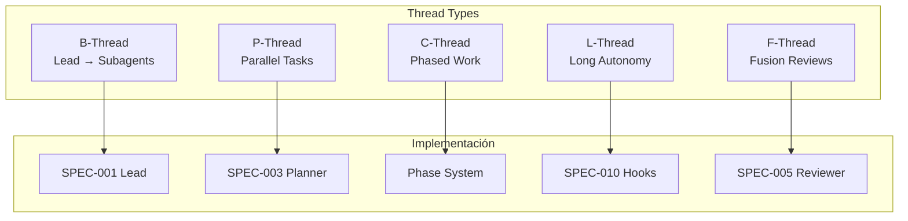
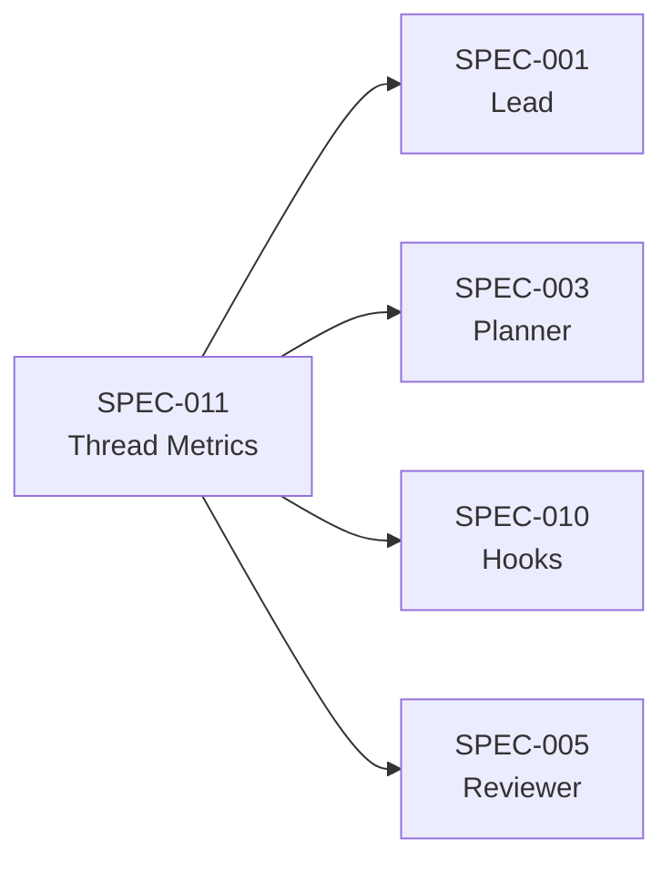

# SPEC-011: Thread Metrics & Observability

> **Status**: approved | **Version**: 1.0 | **Updated**: 2026-01-20

## Overview

Sistema de métricas basado en el framework **Thread-Based Engineering** para medir y optimizar el rendimiento del orquestador. Permite tracking de tool calls, duración, checkpoints y auto-correcciones.

### Origen

Basado en el video "Thread-Based Engineering" que define:
- **Tool calls = impacto medible**
- **4 formas de mejorar**: más threads, threads más largos, threads más gruesos, menos checkpoints

## Thread Types en Poneglyph



| Thread | Descripción | Implementación |
|--------|-------------|----------------|
| **B-Thread** | Agents prompting agents | Lead → builder/reviewer/planner/error-analyzer |
| **P-Thread** | Parallel execution | Planner sugiere tareas paralelizables |
| **C-Thread** | Chained/phased work | Phases con checkpoints |
| **L-Thread** | Long autonomy | SPEC-010 Stop hooks para validación |
| **F-Thread** | Fusion (combine results) | Multiple review passes |

## Core Metrics

### 1. Thread Metrics

```typescript
interface ThreadMetrics {
  threadId: string;
  threadType: 'B' | 'P' | 'C' | 'L' | 'F';
  startTime: number;
  endTime?: number;

  // Impacto medible
  toolCalls: ToolCallMetric[];
  totalToolCalls: number;

  // Eficiencia
  checkpoints: number;
  autoCorrections: number;  // SPEC-010 hook failures

  // Subthreads (para B-Thread)
  childThreads: string[];
}

interface ToolCallMetric {
  tool: string;
  timestamp: number;
  duration: number;
  success: boolean;
  // Para Edit/Write
  linesChanged?: number;
}
```

### 2. Session Metrics

```typescript
interface SessionMetrics {
  sessionId: string;
  startTime: number;

  // Thread counts
  threads: {
    total: number;
    byType: Record<ThreadType, number>;
    parallel: number;      // P-Threads ejecutados
    maxConcurrent: number; // Máximo paralelo alcanzado
  };

  // Tool usage
  tools: {
    total: number;
    byTool: Record<string, number>;
    editWriteCount: number;
    readCount: number;
  };

  // Quality
  quality: {
    hookFailures: number;      // SPEC-010 failures
    autoCorrections: number;   // Successful auto-fixes
    reviewIterations: number;  // Reviewer cycles
  };

  // Efficiency
  efficiency: {
    parallelRatio: number;     // parallel / total que podrían ser paralelas
    avgThreadDuration: number;
    avgToolCallsPerThread: number;
  };
}
```

## Improvement Vectors

Basado en "4 formas de mejorar":

| Vector | Métrica | Cómo mejorar |
|--------|---------|--------------|
| **Más threads** | `threads.total` | Planner descompone más |
| **Threads más largos** | `avgThreadDuration` | Menos interrupciones, más L-Thread |
| **Threads más gruesos** | `avgToolCallsPerThread` | Más tool calls por thread |
| **Menos checkpoints** | `checkpoints / toolCalls` | Mayor confianza, más Z-Thread |

### Parallel Efficiency Score

```typescript
function calculateParallelEfficiency(session: SessionMetrics): number {
  const parallelizable = identifyParallelizable(session);
  const actualParallel = session.threads.parallel;
  return (actualParallel / parallelizable) * 100;
}

// Target: >80%
```

## Events to Track

### Tool Call Events

```typescript
interface ToolCallEvent {
  type: 'tool_call';
  threadId: string;
  tool: string;
  input: Record<string, unknown>;
  output?: unknown;
  duration: number;
  success: boolean;
}
```

### Thread Lifecycle Events

```typescript
interface ThreadEvent {
  type: 'thread_start' | 'thread_end' | 'thread_checkpoint';
  threadId: string;
  threadType: ThreadType;
  parentThreadId?: string;  // Para B-Thread children
  timestamp: number;
  metadata?: Record<string, unknown>;
}
```

### Hook Events (SPEC-010 integration)

```typescript
interface HookEvent {
  type: 'hook_triggered' | 'hook_passed' | 'hook_failed';
  hookType: 'PreToolUse' | 'PostToolUse' | 'Stop';
  validator: string;
  threadId: string;
  exitCode: 0 | 1 | 2;
  autoCorrection?: boolean;
}
```

## Storage

### Metrics File

```
.claude/
├── metrics/
│   ├── sessions/
│   │   └── {sessionId}.json    # Session metrics
│   ├── threads/
│   │   └── {threadId}.json     # Thread details
│   └── aggregated/
│       ├── daily.json          # Daily aggregates
│       └── weekly.json         # Weekly trends
```

### Retention

| Data | Retention | Razón |
|------|-----------|-------|
| Session metrics | 30 días | Análisis de tendencias |
| Thread details | 7 días | Debug reciente |
| Aggregated | 90 días | Trends largo plazo |

## Dashboard Metrics

### Real-time

```
┌─────────────────────────────────────────────────┐
│ Session: abc123                                 │
├─────────────────────────────────────────────────┤
│ Threads: 12 (B:1 P:4 C:3 L:2 F:2)              │
│ Tool Calls: 47                                  │
│ Parallel Efficiency: 85%                        │
│ Auto-corrections: 3                             │
│ Current Phase: Implementation                   │
└─────────────────────────────────────────────────┘
```

### Post-session Summary

```
┌─────────────────────────────────────────────────┐
│ Session Complete                                │
├─────────────────────────────────────────────────┤
│ Duration: 12m 34s                               │
│ Total Threads: 15                               │
│ Total Tool Calls: 89                            │
│                                                 │
│ Improvement Vectors:                            │
│ ├─ Thread Count: ↑ 20% vs avg                   │
│ ├─ Avg Duration: → same as avg                  │
│ ├─ Tool Calls/Thread: ↑ 15% vs avg              │
│ └─ Checkpoint Ratio: ↓ 10% (good!)              │
│                                                 │
│ Quality:                                        │
│ ├─ Hook Failures: 5                             │
│ ├─ Auto-fixed: 4 (80%)                          │
│ └─ Manual fixes: 1                              │
└─────────────────────────────────────────────────┘
```

## Integration Points

### Con SPEC-001 (Lead)

Lead inicia y termina B-Threads, reporta métricas de sesión.

```typescript
// Al iniciar tarea
metrics.startThread({
  type: 'B',
  parentId: null // Root thread
});

// Al delegar a subagent
metrics.startThread({
  type: 'B',
  parentId: currentThreadId
});
```

### Con SPEC-003 (Planner)

Planner marca tareas como paralelizables para tracking de P-Threads.

```typescript
interface PlannerTask {
  // ... existing fields
  parallelizable: boolean;
  parallelGroup?: string; // Tasks con mismo group pueden ser paralelas
}
```

### Con SPEC-010 (Validation Hooks)

Hooks reportan eventos para métricas de calidad.

```typescript
// En validator exit
if (exitCode === 2) {
  metrics.recordHookEvent({
    type: 'hook_failed',
    autoCorrection: true
  });
}
```

## Implementation Phases

### Phase 1: Core Tracking

| Task | Descripción |
|------|-------------|
| Event system | Emitir eventos de tool calls |
| Thread tracking | Start/end de threads |
| Basic storage | Guardar session metrics |

### Phase 2: Analysis

| Task | Descripción |
|------|-------------|
| Aggregation | Daily/weekly rollups |
| Efficiency calc | Parallel efficiency score |
| Trend detection | Compare vs historical |

### Phase 3: Visualization

| Task | Descripción |
|------|-------------|
| Real-time dashboard | Current session stats |
| Post-session report | Summary con improvement vectors |
| Historical trends | Graphs de evolución |

## Success Criteria

| Métrica | Target |
|---------|--------|
| Parallel Efficiency | >80% |
| Auto-correction rate | >75% de hook failures |
| Avg tool calls/thread | Trending up |
| Checkpoint ratio | Trending down |

## Relación con otros specs



| Spec | Relación |
|------|----------|
| SPEC-001 | Lead reporta B-Thread metrics |
| SPEC-003 | Planner marca P-Thread parallelizable |
| SPEC-005 | Reviewer contribuye a F-Thread metrics |
| SPEC-010 | Hooks reportan auto-correction metrics |

## Appendix: Thread-Based Engineering Reference

### Los 6+1 Thread Types (del video)

| Thread | Nombre | Descripción |
|--------|--------|-------------|
| Base | - | Prompt → Agent work → Review |
| P | Parallel | Multiple threads simultáneos |
| C | Chained | Multi-phase con checkpoints |
| F | Fusion | Same prompt → multiple agents → combine |
| B | Big | Agents prompting agents (subagents) |
| L | Long | Extended autonomy, high trust |
| Z | Zero-touch | No review needed, maximum trust |

### Core Four

| Factor | Descripción |
|--------|-------------|
| Context | Lo que el agente sabe |
| Model | Capacidades del LLM |
| Prompt | Instrucciones dadas |
| Tools | Acciones disponibles |

### Cita clave

> "Agents plus code beats agents" - Ralph Wiggum pattern

Código determinístico (validators) + agentes = mejor que solo agentes.
