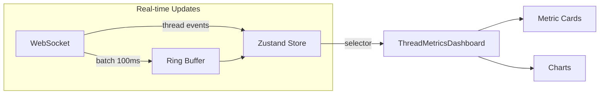

# SPEC-012: Thread Metrics UI

> **Status**: approved | **Version**: 1.0 | **Updated**: 2026-01-21

## 0. Research Summary

### Fuentes Consultadas

| Tipo | Fuente | Link | Relevancia |
|------|--------|------|------------|
| Best practices | DataBrain | [Link](https://www.usedatabrain.com/how-to/create-react-dashboard) | Alta |
| Performance | MakersDen | [Link](https://makersden.io/blog/reactjs-dev-for-real-time-analytics-dashboards) | Alta |
| Charts | Tremor | [Link](https://www.tremor.so/) | Alta |
| Charts | LogRocket | [Link](https://blog.logrocket.com/best-react-chart-libraries-2025/) | Media |

### Decisiones Informadas por Research

| Decisión | Basada en |
|----------|-----------|
| Tremor para charts | Built on Tailwind + Recharts, dashboard-ready |
| Ring buffer para sliding window | MakersDen real-time patterns |
| Batching updates 100-200ms | Performance: 10-15 fps target |
| WebSocket para real-time | Ya implementado en el proyecto |

### Confidence Assessment

| Área | Nivel | Razón |
|------|-------|-------|
| Chart library | Alta | Tremor well-documented + Tailwind match |
| Real-time patterns | Alta | Multiple sources coinciden |
| Thread visualization | Media | Custom implementation needed |

---

## 1. Vision

> **Press Release**: El dashboard de Thread Metrics permite visualizar en tiempo real el rendimiento del orquestador, mostrando threads activos, tool calls, eficiencia de paralelización y auto-correcciones del sistema de validation hooks.

**Background**: SPEC-011 define métricas pero no tiene UI. El frontend actual tiene MetricsDashboard básico.

**Usuario objetivo**: Desarrolladores usando el orquestador que quieren entender y optimizar su uso.

**Métricas de éxito**:
- Dashboard muestra métricas en <100ms de latencia
- Usuarios pueden identificar bottlenecks de performance

---

## 2. Goals & Non-Goals

### Goals

- [ ] Visualizar threads activos por tipo (B/P/C/L/F)
- [ ] Mostrar tool calls en tiempo real con categorización
- [ ] Calcular y mostrar Parallel Efficiency Score
- [ ] Integrar métricas de SPEC-010 (hook failures, auto-corrections)
- [ ] Post-session summary con improvement vectors

### Non-Goals

- [ ] Historical analytics (más allá de sesión actual)
- [ ] Export de métricas a CSV/JSON (futuro)
- [ ] Comparación entre sesiones (futuro)

---

## 3. Alternatives Considered

| Alternativa | Pros | Cons | Fuente | Decisión |
|-------------|------|------|--------|----------|
| Tremor | Tailwind native, dashboard-ready | Opinionated | [Tremor.so](https://www.tremor.so/) | ✅ Elegida |
| Recharts raw | Más control | Más código | [LogRocket](https://blog.logrocket.com/best-react-chart-libraries-2025/) | ❌ Tremor lo usa internamente |
| Visx | Máximo control | Learning curve alta | [Embeddable](https://embeddable.com/blog/react-chart-libraries) | ❌ Overkill |
| Existing MetricsDashboard | Ya existe | No tiene thread metrics | - | ❌ Extend, no replace |

---

## 4. Design

### 4.1 Arquitectura de Componentes

```
src/components/metrics/
├── ThreadMetricsDashboard.tsx    # Container principal
├── ThreadOverview.tsx            # Summary cards
├── ThreadTypeChart.tsx           # Donut chart por tipo
├── ToolCallsTimeline.tsx         # Timeline de tool calls
├── ParallelEfficiencyGauge.tsx   # Gauge 0-100%
├── ImprovementVectors.tsx        # 4 vectores con trends
├── HookMetricsCard.tsx           # SPEC-010 integration
└── SessionSummary.tsx            # Post-session report
```

### 4.2 Flujo de Datos



### 4.3 Thread Type Visualization

```
┌────────────────────────────────────────────────────┐
│ Thread Overview                          [Session] │
├────────────────────────────────────────────────────┤
│ ┌──────┐ ┌──────┐ ┌──────┐ ┌──────┐ ┌──────┐      │
│ │ B: 3 │ │ P: 8 │ │ C: 2 │ │ L: 1 │ │ F: 2 │      │
│ │ Big  │ │ Para │ │Chain │ │ Long │ │Fusion│      │
│ └──────┘ └──────┘ └──────┘ └──────┘ └──────┘      │
├────────────────────────────────────────────────────┤
│ Total Threads: 16 │ Tool Calls: 89 │ Efficiency: 85%│
└────────────────────────────────────────────────────┘
```

### 4.4 Improvement Vectors Display

```
┌─────────────────────────────────────────┐
│ Improvement Vectors                     │
├─────────────────────────────────────────┤
│ More Threads      ████████░░ +20% ↑    │
│ Longer Threads    █████░░░░░ → same    │
│ Thicker Threads   ██████████ +15% ↑    │
│ Fewer Checkpoints ███████░░░ -10% ↓    │
└─────────────────────────────────────────┘
```

### 4.5 Hook Metrics Integration (SPEC-010)

```typescript
interface HookMetrics {
  totalTriggered: number;
  passed: number;
  failed: number;
  autoCorrections: number;
  autoCorrectRate: number; // failed > 0 ? autoCorrections / failed : 100
}
```

```
┌─────────────────────────────────────────┐
│ Validation Hooks (SPEC-010)             │
├─────────────────────────────────────────┤
│ Triggered: 15 │ Passed: 10 │ Failed: 5  │
│                                         │
│ Auto-corrections: 4/5 (80%)             │
│ ████████░░░░░░░░░░░░                    │
└─────────────────────────────────────────┘
```

### 4.6 API Integration

```typescript
// Nuevos eventos WebSocket
type ThreadMetricEvent =
  | { type: 'thread_start'; data: ThreadStartData }
  | { type: 'thread_end'; data: ThreadEndData }
  | { type: 'tool_call'; data: ToolCallData }
  | { type: 'hook_event'; data: HookEventData }
  | { type: 'checkpoint'; data: CheckpointData };

// Store slice (ver SPEC-014)
interface ThreadMetricsSlice {
  threads: Map<string, ThreadMetrics>;
  toolCalls: ToolCallMetric[];
  hookEvents: HookEvent[];

  // Computed
  parallelEfficiency: number;
  improvementVectors: ImprovementVectors;

  // Actions
  addThread: (thread: ThreadStartData) => void;
  endThread: (threadId: string) => void;
  addToolCall: (call: ToolCallData) => void;
  addHookEvent: (event: HookEventData) => void;
}
```

### 4.7 Tremor Components Mapping

| UI Element | Tremor Component |
|------------|------------------|
| Thread counts | `Card` + `Metric` |
| Thread distribution | `DonutChart` |
| Tool calls timeline | `AreaChart` |
| Efficiency gauge | `ProgressCircle` |
| Improvement vectors | `BarList` |
| Hook metrics | `Tracker` |

---

## 5. FAQ

**Q: ¿Cómo manejamos updates de alta frecuencia?**
A: Ring buffer con batching cada 100-200ms, máximo 10-15 renders/sec. [Fuente: MakersDen]

**Q: ¿Qué pasa si no hay datos de threads?**
A: Mostrar empty state con mensaje "No thread metrics yet. Start a task to see metrics."

**Q: ¿Se persiste entre sesiones?**
A: No en v1. Métricas son por sesión. Historical analytics es non-goal.

---

## 6. Acceptance Criteria (BDD)

```gherkin
Feature: Thread Metrics Dashboard

Scenario: Ver thread overview
  Given una sesión activa con 5 threads
  When abro el Thread Metrics Dashboard
  Then veo cards con conteo por tipo (B/P/C/L/F)
  And veo total de tool calls
  And veo Parallel Efficiency percentage

Scenario: Real-time updates
  Given el dashboard está abierto
  When un nuevo thread inicia
  Then el contador se actualiza en <200ms
  And la visualización no causa jank

Scenario: Mostrar hook metrics
  Given validation hooks ejecutados (SPEC-010)
  When veo la sección Hook Metrics
  Then veo triggered/passed/failed counts
  And veo auto-correction rate con progress bar

Scenario: Post-session summary
  Given una sesión completada
  When veo Session Summary
  Then veo improvement vectors con trends (↑/→/↓)
  And veo comparación vs promedio
```

---

## 7. Open Questions

- [ ] ¿Mantener métricas cuando se cambia de sesión?
- [ ] ¿Añadir sonido/notificación para hook failures?

---

## 8. Sources

- [DataBrain - React Dashboard Guide](https://www.usedatabrain.com/how-to/create-react-dashboard)
- [MakersDen - Real-time Analytics](https://makersden.io/blog/reactjs-dev-for-real-time-analytics-dashboards)
- [Tremor - Dashboard Components](https://www.tremor.so/)
- [LogRocket - Chart Libraries 2025](https://blog.logrocket.com/best-react-chart-libraries-2025/)
- [DEV.to - React Performance 2025](https://dev.to/alex_bobes/react-performance-optimization-15-best-practices-for-2025-17l9)

---

## 9. Next Steps

- [ ] Instalar `@tremor/react` como dependencia
- [ ] Crear ThreadMetricsSlice en Zustand (ver SPEC-014)
- [ ] Implementar WebSocket handlers para thread events
- [ ] Implementar componentes UI
