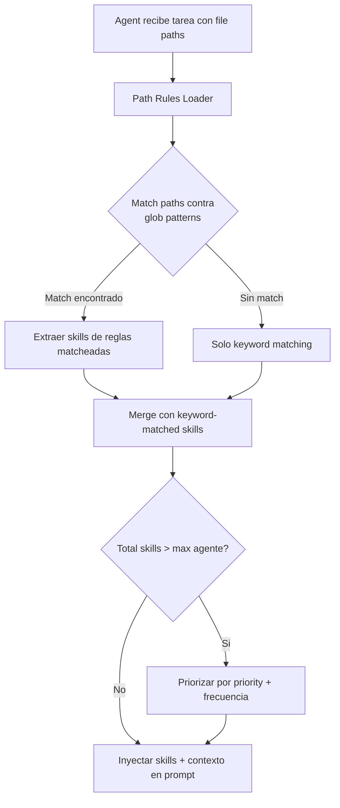

<!--
status: draft
priority: medium
research_confidence: high
sources_count: 3
depends_on: []
enables: [SPEC-008]
created: 2026-03-08
updated: 2026-03-08
-->

# SPEC-001: Path-Specific Rules

## 0. Research Summary

### Fuentes Consultadas

| Tipo | Fuente | Relevancia |
|------|--------|------------|
| Codebase | `.claude/context-rules.json` | Alta -- define 9 reglas path-based existentes con paths, keywords y contexts |
| Codebase | `.claude/rules/skill-matching.md` | Alta -- sistema actual de keyword matching con 11 grupos de keywords |
| Codebase | `.claude/rules/context-management.md` | Media -- define limites de skills por agente y precedencia |

### Decisiones Informadas

| Decision | Basada en |
|----------|-----------|
| Usar archivos Markdown con YAML frontmatter en vez de JSON | Consistencia con el resto de `.claude/rules/` y `.claude/skills/` que usan Markdown |
| Mantener compatibilidad con keyword matching existente | `skill-matching.md` ya funciona y se usa activamente; path rules lo complementan |
| Glob patterns para matching de paths | `context-rules.json` ya usa globs (`**/routes/**`); patron establecido |
| Prioridad numerica para resolver conflictos | Multiples reglas pueden matchear el mismo path; necesita desambiguacion |

### Info No Encontrada

- No hay documentacion sobre rendimiento de glob matching en Bun con muchos patrones
- No hay precedente en el proyecto de hot-reloading de archivos de configuracion
- No se encontro benchmarking del sistema actual de skill-matching para comparar

### Confidence Assessment

| Area | Nivel | Razon |
|------|-------|-------|
| Formato de reglas | Alto | Patron establecido en el proyecto (YAML frontmatter + Markdown body) |
| Glob matching | Alto | `context-rules.json` ya lo usa; Bun tiene `Bun.Glob` nativo |
| Integracion con skill-matching | Alto | Ambos sistemas producen listas de skills; merge es trivial |
| Performance a escala | Medio | Sin benchmarks, pero el numero de reglas es pequeno (<20) |

---

## 1. Vision

### Press Release

Poneglyph ahora selecciona automaticamente las skills correctas basandose en los archivos que un agente va a modificar. Cuando un builder recibe la tarea de editar `src/routes/users.ts`, el sistema detecta que el archivo esta en `**/routes/**` y carga `api-design` y `typescript-patterns` sin que el Lead tenga que especificarlo. Combinado con el keyword matching existente, los agentes reciben contexto preciso y relevante en cada delegacion.

### Background

El archivo `.claude/context-rules.json` define 9 reglas que asocian paths con skills:

```json
{
  "name": "api-routes",
  "paths": ["**/routes/**"],
  "keywords": ["endpoint", "route", "api"],
  "contexts": ["api-design", "typescript-patterns"]
}
```

Este archivo existe pero **no esta conectado a la orquestacion**. Ningun loader lo lee, ningun agente lo consume. Las skills se seleccionan unicamente por keyword matching desde `skill-matching.md`. El resultado es que el Lead debe recordar manualmente que skills cargar cuando el trabajo involucra archivos en directorios especificos.

### Usuario Objetivo

Oriol Macias -- unico usuario del sistema de orquestacion Poneglyph.

### Metricas de Exito

| Metrica | Target |
|---------|--------|
| Tiempo de carga de path rules | < 10ms |
| Skills auto-seleccionadas por directorio de trabajo | 100% de las reglas definidas |
| Reduccion de skills manuales en prompts del Lead | > 50% de los casos con paths conocidos |
| Regresion en keyword matching | 0 -- debe seguir funcionando identico |

---

## 2. Goals & Non-Goals

### Goals

| ID | Goal | Razon |
|----|------|-------|
| G1 | Crear formato de path rules en `.claude/rules/paths/*.md` | Formato consistente con el resto de reglas del proyecto |
| G2 | Implementar loader que lea y matchee path rules | Conectar las reglas con la orquestacion |
| G3 | Integrar con skill-matching existente | Combinar path-based + keyword-based para cobertura completa |
| G4 | Migrar `context-rules.json` al nuevo formato | Eliminar archivo huerfano, consolidar en un sistema |
| G5 | Respetar limites de skills por agente (`context-management.md`) | El merge no debe exceder max skills permitidas |

### Non-Goals

| ID | Non-Goal | Razon |
|----|----------|-------|
| NG1 | Generacion dinamica de reglas | Over-engineering; las reglas son estaticas y mantenidas manualmente |
| NG2 | Reglas per-file (granularidad de archivo individual) | Demasiado granular; glob patterns cubren el caso de uso |
| NG3 | Integracion con IDE (VS Code extension) | Fuera del scope de Poneglyph; solo orquestacion CLI |
| NG4 | Versionado de reglas (historial de cambios por regla) | Git ya provee esto; no necesita sistema propio |
| NG5 | UI para gestionar reglas | Proyecto sin web UI; edicion directa en Markdown |

---

## 3. Alternatives Considered

| # | Alternativa | Pros | Contras | Veredicto |
|---|-------------|------|---------|-----------|
| 1 | **Extender `context-rules.json` directamente** | Simple, ya existe, sin migracion | JSON es limitado para contexto adicional; no permite body en Markdown; inconsistente con el resto del proyecto | Rechazada |
| 2 | **YAML frontmatter + Markdown en `.claude/rules/paths/`** | Consistente con skills y rules existentes; permite body con contexto adicional; facil de leer y editar | Requiere parser de frontmatter; migracion de JSON a archivos individuales | **Adoptada** |
| 3 | **Convencion por nombre de directorio** (directorio = skill) | Zero config; muy simple | Demasiado rigido; no permite multiples skills por path; no soporta globs | Rechazada |
| 4 | **Estilo `.gitattributes`** (un archivo con patrones + atributos) | Familiar para usuarios de Git; compacto | Formato no estandar en el proyecto; no permite contexto extendido en Markdown; parsing custom | Rechazada |

### Justificacion de la Alternativa Adoptada

La alternativa 2 se alinea con las convenciones existentes del proyecto:
- `.claude/skills/*/SKILL.md` usa YAML frontmatter
- `.claude/rules/*.md` usa Markdown puro
- `.claude/agents/*.md` usa YAML frontmatter

Archivos individuales por regla permiten agregar contexto extendido en el body (instrucciones especificas que se inyectan cuando la regla matchea).

---

## 4. Design

### Arquitectura



### Flujo Principal

1. El Lead prepara una delegacion a un agente (builder, reviewer, etc.)
2. Si la tarea incluye file paths (explicitos o inferidos del prompt), el **Path Rules Loader** los matchea contra los glob patterns definidos en `.claude/rules/paths/*.md`
3. Las reglas matcheadas aportan skills adicionales y contexto extendido
4. Estas skills se combinan con las del keyword matching existente (`skill-matching.md`)
5. El merge respeta los limites definidos en `context-management.md` (max 5 para builder, etc.)
6. El agente recibe el prompt enriquecido con skills y contexto path-specific

### Formato de Path Rule

Cada archivo en `.claude/rules/paths/` sigue esta estructura:

```yaml
---
name: api-routes
paths:
  - "**/routes/**"
  - "**/api/**"
keywords:
  - endpoint
  - route
skills:
  - api-design
  - typescript-patterns
priority: 10
---
# API Routes Context

When working in API route files, follow these patterns:

- Use Elysia route groups for organization
- Validate all request bodies with TypeBox schemas
- Return consistent error responses using AppError
- Use proper HTTP status codes (201 for creation, 204 for deletion)
```

### Campos del Frontmatter

| Campo | Tipo | Requerido | Descripcion |
|-------|------|-----------|-------------|
| `name` | `string` | Si | Identificador unico de la regla |
| `paths` | `string[]` | Si | Glob patterns que activan la regla |
| `keywords` | `string[]` | No | Keywords adicionales que refuerzan el match |
| `skills` | `string[]` | Si | Skills a cargar cuando la regla matchea |
| `priority` | `number` | No (default: 0) | Mayor numero = mayor prioridad en conflictos |

### Body del Archivo

El contenido Markdown despues del frontmatter es **contexto adicional** que se inyecta en el prompt del agente cuando la regla matchea. Permite dar instrucciones especificas por directorio sin crear skills nuevas.

### Path Rules Loader (Pseudocodigo)

```typescript
interface PathRule {
  name: string
  paths: string[]
  keywords: string[]
  skills: string[]
  priority: number
  context: string
}

function loadPathRules(rulesDir: string): PathRule[]
function matchPathRules(filePaths: string[], rules: PathRule[]): PathRule[]
function mergeWithKeywordSkills(
  pathSkills: string[],
  keywordSkills: string[],
  maxSkills: number
): string[]
```

### Resolucion de Conflictos

| Escenario | Resolucion |
|-----------|------------|
| Multiples reglas matchean el mismo path | Se combinan todas las skills; duplicados eliminados |
| Total de skills excede max del agente | Priorizar por `priority` descendente, luego por frecuencia de aparicion |
| Path rule y keyword matching producen la misma skill | Se deduplica; cuenta una sola vez |
| Path rule tiene keywords que tambien estan en skill-matching.md | Ambos sistemas operan independientemente; el merge final deduplica |

### Edge Cases

| Edge Case | Comportamiento |
|-----------|----------------|
| Path no matchea ninguna regla | Se usa solo keyword matching (comportamiento actual) |
| Archivo fuera de proyecto (path absoluto externo) | Se ignora; solo aplican paths relativos al proyecto |
| Regla con paths vacios | Se ignora (log warning) |
| Regla sin skills | Se ignora (log warning) |
| Regla con skill inexistente | Warning en log; skill se omite |
| Path con backslashes (Windows) | Normalizar a forward slashes antes de matchear |

### Stack Alignment

| Aspecto | Decision | Alineado con |
|---------|----------|-------------|
| Lenguaje del loader | TypeScript | Todo el proyecto usa TypeScript |
| Glob matching | `Bun.Glob` | Bun runtime nativo |
| Formato de reglas | YAML frontmatter + Markdown | Convenciones de skills y agents |
| Testing | `bun:test` | Framework de test del proyecto |
| Ubicacion | `.claude/rules/paths/` | Dentro del directorio de rules existente |

### Migracion de `context-rules.json`

Las 9 reglas de `context-rules.json` se migran a 9 archivos individuales:

| JSON Rule | Archivo Path Rule |
|-----------|-------------------|
| `api-routes` | `.claude/rules/paths/api-routes.md` |
| `services` | `.claude/rules/paths/services.md` |
| `auth-security` | `.claude/rules/paths/auth-security.md` |
| `database` | `.claude/rules/paths/database.md` |
| `websocket` | `.claude/rules/paths/websocket.md` |
| `testing` | `.claude/rules/paths/testing.md` |
| `config` | `.claude/rules/paths/config.md` |
| `orchestration` | `.claude/rules/paths/orchestration.md` |
| `hooks` | `.claude/rules/paths/hooks.md` |

Despues de verificar la migracion, `context-rules.json` se elimina.

---

## 5. FAQ

**Q: Como se resuelve el matching de paths en Windows vs Unix?**

A: El loader normaliza todos los paths a forward slashes antes de aplicar glob matching. `Bun.Glob` opera sobre paths normalizados. Los backslashes de Windows (`\`) se convierten a `/` en el paso de normalizacion.

**Q: Que pasa si una path rule define una skill que no existe en `.claude/skills/`?**

A: El loader emite un warning en el log pero no falla. La skill inexistente se omite del resultado. Esto permite definir reglas antes de crear las skills correspondientes.

**Q: Como interactua el `priority` con los limites de skills por agente?**

A: Cuando el total de skills (path-based + keyword-based) excede el maximo del agente (ej: 5 para builder), se ordenan por `priority` descendente. Las skills de reglas con mayor prioridad se mantienen; las de menor prioridad se descartan. Si hay empate de prioridad, se prioriza por frecuencia de aparicion en las reglas matcheadas.

**Q: Se pueden usar path rules en proyectos que no son Poneglyph?**

A: Si. Las path rules viven en `.claude/rules/paths/` que es parte de la configuracion global (via symlink `~/.claude/`). Sin embargo, los paths glob son genericos (`**/routes/**`), asi que aplican a cualquier proyecto. Para reglas project-specific, el proyecto destino puede tener su propio `.claude/rules/paths/` que se combina con el global.

---

## 6. Acceptance Criteria (BDD)

### Scenario 1: Path match loads correct skills

```gherkin
Given a path rule "api-routes" with paths ["**/routes/**"] and skills ["api-design"]
When the agent works on file "src/routes/users.ts"
Then the skill "api-design" is loaded into the agent context
```

### Scenario 2: Multiple path matches combine skills

```gherkin
Given a path rule "auth-security" with paths ["**/auth/**"] and skills ["security-review"]
And a path rule "services" with paths ["**/services/**"] and skills ["typescript-patterns"]
When the agent works on files "src/auth/login.ts" and "src/services/user.ts"
Then both "security-review" and "typescript-patterns" are loaded
And duplicates are removed
```

### Scenario 3: Skills respect agent limits

```gherkin
Given 4 path rules each contributing 2 skills (8 total)
And the agent is a builder with max 5 skills
When path rules are applied
Then only the top 5 skills by priority are loaded
```

### Scenario 4: No match falls through to keyword matching

```gherkin
Given no path rules match the working files
And the prompt contains keyword "endpoint"
When skill selection runs
Then "api-design" is loaded via keyword matching only
And no path-based skills are injected
```

### Scenario 5: Priority resolves conflicts

```gherkin
Given a path rule "general" with priority 0 and skills ["typescript-patterns"]
And a path rule "security" with priority 20 and skills ["security-review"]
And the agent max skills is 1
When both rules match the working path
Then "security-review" is loaded (higher priority)
And "typescript-patterns" is discarded
```

### Scenario 6: Migration from context-rules.json

```gherkin
Given the 9 rules from "context-rules.json"
When migrated to individual files in ".claude/rules/paths/"
Then each rule has a corresponding .md file with YAML frontmatter
And the skills mapping is identical to the original JSON
And "context-rules.json" is deleted
```

### Scenario 7: Context body is injected

```gherkin
Given a path rule "hooks" with body "Always run bun test after changes"
When the rule matches working path ".claude/hooks/validators/foo.ts"
Then the agent prompt includes "Always run bun test after changes"
```

### Scenario 8: Windows path normalization

```gherkin
Given a path rule with paths ["**/routes/**"]
When the agent works on file "src\routes\users.ts" (Windows backslashes)
Then the path is normalized to "src/routes/users.ts"
And the rule matches correctly
```

---

## 7. Open Questions

| # | Question | Impact | Proposed Resolution |
|---|----------|--------|---------------------|
| 1 | Debe el loader cachear las reglas en memoria o releerlas en cada delegacion? | Performance vs hot-reload. Con <20 reglas y archivos pequenos, re-leer es <10ms | Empezar sin cache; medir; agregar cache si es necesario |
| 2 | Debe `Bun.Glob` usarse directamente o a traves de una libreria como `micromatch`? | `Bun.Glob` es nativo pero su API puede diferir de estándares. `micromatch` es mas maduro | Usar `Bun.Glob` por consistencia con el stack; evaluar en implementacion |
| 3 | Como maneja el loader paths relativos vs absolutos en las reglas? | Los paths en las reglas son relativos al root del proyecto; el loader necesita saber el root | Recibir `projectRoot` como parametro; resolver paths relativos contra el |
| 4 | Deben las path rules soportar `exclude` patterns (negacion)? | Permite exclusiones como "todo en routes excepto routes/internal" | Diferir a v1.2; mantener simple en v1.1 con solo patterns inclusivos |

---

## 8. Sources

| # | Source | Tipo | Ubicacion |
|---|--------|------|-----------|
| 1 | context-rules.json | Codebase | `.claude/context-rules.json` -- 9 reglas path-based existentes (no wired) |
| 2 | skill-matching.md | Codebase | `.claude/rules/skill-matching.md` -- sistema actual de keyword matching |
| 3 | context-management.md | Codebase | `.claude/rules/context-management.md` -- limites de skills por agente |
| 4 | Bun.Glob documentation | External | https://bun.sh/docs/api/glob -- API nativa de glob matching |

---

## 9. Next Steps

### Implementation Checklist

| # | Task | Complejidad | Dependencia |
|---|------|-------------|-------------|
| 1 | Crear directorio `.claude/rules/paths/` | Trivial | -- |
| 2 | Migrar las 9 reglas de `context-rules.json` a archivos `.md` individuales | Baja | #1 |
| 3 | Implementar `PathRuleLoader` en TypeScript (parse YAML frontmatter + glob matching) | Media | #2 |
| 4 | Implementar funcion `mergeSkills` (combinar path-based + keyword-based con limites) | Baja | #3 |
| 5 | Integrar loader en el flujo de delegacion del Lead (regla o hook) | Media | #3, #4 |
| 6 | Escribir tests para loader, matching y merge | Media | #3, #4 |
| 7 | Eliminar `context-rules.json` tras verificar migracion | Trivial | #2, #6 |
| 8 | Actualizar `skill-matching.md` para documentar la integracion con path rules | Baja | #5 |
| 9 | Actualizar `CLAUDE.md` con referencia al nuevo sistema | Baja | #8 |
