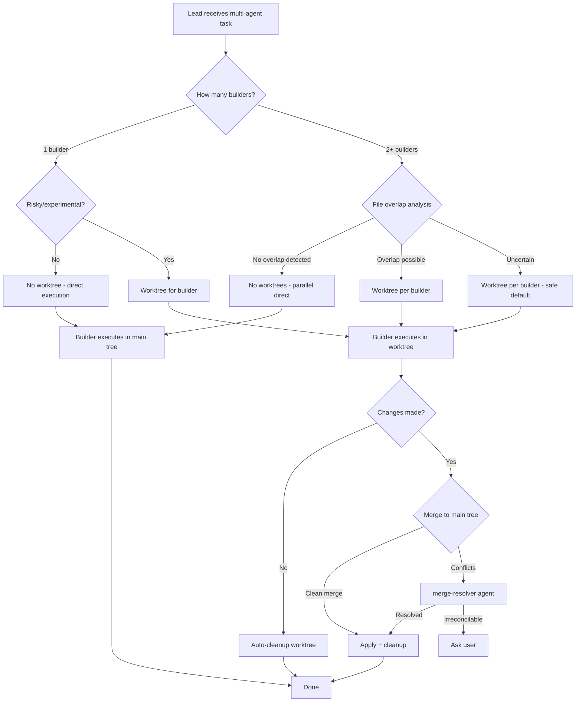
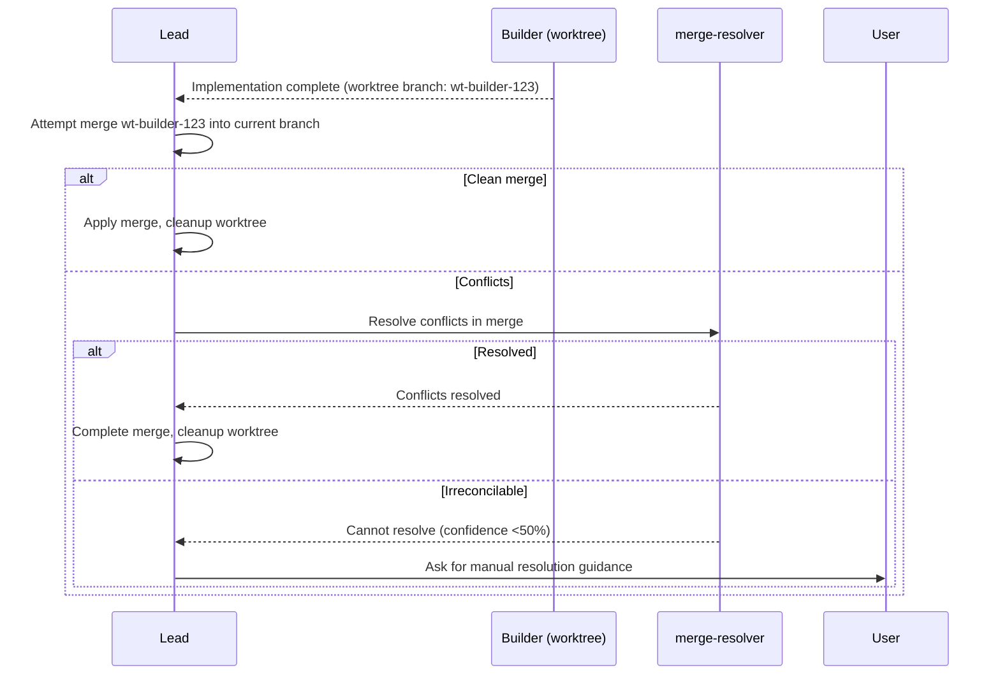

<!--
status: draft
priority: medium
research_confidence: high
sources_count: 3
depends_on: []
enables: [SPEC-006, SPEC-013]
created: 2026-03-08
updated: 2026-03-08
-->

# SPEC-002: Git Worktree Isolation

## 0. Research Summary

| # | Source | Key Insight | Confidence |
|---|--------|-------------|------------|
| 1 | [Git Worktree Documentation](https://git-scm.com/docs/git-worktree) | `git worktree add` creates linked working trees sharing the same `.git` directory. Each worktree has its own checked-out branch. Worktrees are cheap (no full clone), support concurrent operations, and can be pruned with `git worktree prune`. Maximum worktrees limited only by filesystem. | High |
| 2 | Claude Code Agent Tool — `isolation: "worktree"` parameter | When `isolation: "worktree"` is set on the Agent tool, Claude Code creates a temporary git worktree for the sub-agent. The worktree is auto-cleaned if no changes are made. If changes exist, the worktree path and branch name are returned to the caller. `EnterWorktree` tool also available for manual worktree entry. | High |
| 3 | Parallel CI/CD Isolation Patterns (industry practice) | CI systems routinely use isolated working directories per job to prevent artifact contamination. The same principle applies to multi-agent development: each agent operating in its own worktree eliminates file-level race conditions and allows independent rollback without affecting the main tree. | High |

**Synthesis**: Git worktrees provide a lightweight, native mechanism for isolating parallel agent work. Claude Code already exposes this capability via the `isolation: "worktree"` parameter, but the Lead Orchestrator currently has no rules for when to activate it. This spec formalizes the routing logic, merge strategy, and cleanup policies.

---

## 1. Vision

### Press Release

**Poneglyph agents now work in isolated git worktrees, enabling true parallel development without file conflicts.**

Developers using Claude Code Poneglyph can now run multiple builder agents simultaneously on the same repository without worrying about file conflicts, broken intermediate states, or polluted working trees. The Lead Orchestrator automatically detects when parallel agents might touch overlapping files and routes each to an isolated git worktree. When work is complete, changes merge back cleanly — or the merge-resolver agent handles conflicts. Failed experiments vanish without a trace.

### Background

Claude Code already provides `EnterWorktree` and `isolation: "worktree"` on the Agent tool. However, the Lead Orchestrator has no strategic awareness of when to use worktrees. Today, parallel builders operate in the same working tree, leading to:

- File write conflicts when two builders edit the same file
- Broken intermediate states visible to other agents
- Failed experiments that leave orphaned changes in the working tree
- No clean baseline for reviewers to diff against

### Target Metrics

| Metric | Current | Target |
|--------|---------|--------|
| File conflicts between parallel agents | Occasional | Zero |
| Successful auto-merge rate | N/A | >95% |
| Orphaned worktrees after session | N/A | Zero (auto-cleanup) |
| Parallel builder throughput | Limited by conflicts | Linear scaling up to 4 concurrent |

---

## 2. Goals & Non-Goals

### Goals

| # | Goal | Rationale |
|---|------|-----------|
| G1 | Define worktree routing rules in `lead-orchestrator.md` | The Lead needs deterministic criteria for when to isolate agents |
| G2 | Auto-worktree for parallel builders touching overlapping files | Eliminate the primary source of file conflicts |
| G3 | Auto-worktree for experimental/risky changes | Protect the main working tree from speculative work |
| G4 | Merge strategy for completed worktree work | Changes must flow back to the main tree reliably |
| G5 | Automatic cleanup of worktrees after merge or abandonment | Prevent disk space leaks and stale branches |
| G6 | Fallback to non-worktree for simple single-builder tasks | Avoid overhead when isolation is unnecessary |

### Non-Goals

| # | Non-Goal | Reason |
|---|----------|--------|
| NG1 | Custom git hosting or remote management | Out of scope — this is local orchestration only |
| NG2 | Branch protection rules or policies | That is a git platform concern (GitHub, GitLab) |
| NG3 | CI/CD integration or pipeline triggers | Poneglyph orchestrates agents, not deployment |
| NG4 | Multi-repository worktree coordination | Single-repo scope for v1.1 |
| NG5 | User-facing worktree management UI | No UI in Poneglyph (pure orchestration) |

---

## 3. Alternatives Considered

| # | Alternative | Pros | Cons | Verdict |
|---|-------------|------|------|---------|
| 1 | **Always use worktrees** for every agent | Maximum isolation, zero conflicts | Unnecessary overhead for single-builder tasks. Merge step adds latency. Worktree creation on Windows is slow for large repos. | Rejected |
| 2 | **Never use worktrees** (status quo) | Zero overhead, simple mental model | File conflicts in parallel scenarios. Failed experiments pollute main tree. Reviewer cannot diff against clean baseline. | Rejected |
| 3 | **Smart routing based on file overlap detection** | Isolation only when needed. No overhead for simple tasks. Automatic escalation for risky operations. | Requires file-overlap analysis before delegation. Slight latency for routing decision. | **Adopted** |
| 4 | **Docker containers per agent** | Full OS-level isolation | Massive overkill for file-level isolation. Requires Docker daemon. Slow startup. Not available in all environments. Breaks Claude Code tool assumptions. | Rejected |
| 5 | **File locking (advisory locks)** | Lightweight, no worktree overhead | Does not prevent read of intermediate states. Deadlock risk with multiple agents. Does not protect against failed experiments. | Rejected |

**Decision**: Alternative 3 (smart routing) provides the best balance of isolation when needed and zero overhead when not.

---

## 4. Design

### 4.1 Worktree Router Flow



### 4.2 Routing Rules

These rules are evaluated by the Lead Orchestrator before delegating to builders.

| Rule | Condition | Action | Priority |
|------|-----------|--------|----------|
| R1 | 2+ builders delegated in parallel | `isolation: "worktree"` for each | High |
| R2 | Task marked as experimental/risky by planner | `isolation: "worktree"` | High |
| R3 | Reviewer needs clean diff baseline | `isolation: "worktree"` for builder | Medium |
| R4 | Single builder, known file targets, no overlap | No worktree | Low |
| R5 | Uncertainty about file targets (no planner output) | `isolation: "worktree"` (safe default) | Medium |

#### File Overlap Detection

The Lead determines overlap from the planner's roadmap or from explicit file targets in the task:

```
Given builder_A targets: [src/auth/login.ts, src/types/user.ts]
Given builder_B targets: [src/types/user.ts, src/services/email.ts]

Overlap detected: src/types/user.ts
Decision: Worktree for both builders
```

When file targets are unknown (no planner, vague tasks), the Lead defaults to worktree isolation (Rule R5).

### 4.3 Merge Strategy

| Scenario | Strategy | Agent |
|----------|----------|-------|
| Clean fast-forward | Auto-merge via `git merge --ff` | Lead (via builder) |
| Clean merge (no conflicts) | Auto-merge via `git merge --no-ff` | Lead (via builder) |
| Conflicts detected | Delegate to merge-resolver | merge-resolver |
| merge-resolver fails (confidence <50%) | Escalate to user | Lead via AskUserQuestion |
| Builder made no changes | Skip merge, cleanup worktree | Lead (automatic) |

#### Merge Sequence



### 4.4 Cleanup Policy

| Condition | Action | Timing |
|-----------|--------|--------|
| Worktree merged successfully | Remove worktree + branch | Immediately after merge |
| Builder made no changes | Remove worktree + branch | Immediately |
| Builder errored out | Preserve worktree for 1 retry | After error-analyzer diagnosis |
| Retry also failed | Remove worktree + branch | After escalation to user |
| Session ends with unmerged worktrees | Log warning, preserve for user | Session end |

Cleanup command sequence:

```bash
git worktree remove <worktree-path> --force
git branch -D <worktree-branch>
```

### 4.5 Naming Convention

| Component | Format | Example |
|-----------|--------|---------|
| Worktree branch | `wt/<agent>/<task-hash>` | `wt/builder/a3f8c2` |
| Worktree directory | `<repo>/.worktrees/<agent>-<task-hash>` | `.worktrees/builder-a3f8c2` |

### 4.6 Integration with Lead Orchestrator Rules

New section to add to `lead-orchestrator.md`:

```markdown
## Worktree Isolation

| Condition | Use Worktree |
|-----------|-------------|
| 2+ parallel builders | Yes (each gets own worktree) |
| Experimental/risky task | Yes |
| Reviewer needs clean baseline | Yes (builder in worktree) |
| Single builder, known files | No |
| Unknown file targets | Yes (safe default) |

When using worktrees, pass `isolation: "worktree"` to the Agent tool.
After builder completes, merge worktree branch back and cleanup.
```

### 4.7 Edge Cases

| Edge Case | Handling |
|-----------|----------|
| Worktree creation fails (disk full, permissions) | Fall back to direct execution, log warning |
| Merge produces unexpected test failures | Run tests in main tree post-merge; if fail, revert merge and escalate |
| Builder in worktree needs to read files modified by another agent | Worktree is a snapshot at creation time — builder sees consistent state |
| Very large repo makes worktree creation slow | Accept latency; the isolation benefit outweighs the cost |
| Worktree branch name collision | Append random suffix to task hash |
| Agent creates files outside repo root | Not possible in worktree — git only tracks repo-rooted files |

### 4.8 Dependencies

| Dependency | Type | Status |
|------------|------|--------|
| `git` CLI available in PATH | Runtime | Required (always present in dev environments) |
| Claude Code `isolation: "worktree"` parameter | Platform | Available (current Claude Code) |
| Claude Code `EnterWorktree` tool | Platform | Available (current Claude Code) |
| merge-resolver agent | Poneglyph agent | Exists (`.claude/agents/merge-resolver.md`) |
| lead-orchestrator rule | Poneglyph rule | Exists (needs amendment) |

### 4.9 Stack Alignment

| Component | Technology | Notes |
|-----------|-----------|-------|
| Worktree management | `git worktree` (native) | No external dependencies |
| Agent isolation | Claude Code `isolation: "worktree"` | Built-in platform feature |
| Conflict resolution | merge-resolver agent | Existing Poneglyph agent |
| Routing rules | Markdown rules in `.claude/rules/` | Standard Poneglyph pattern |
| Testing | `bun:test` | Standard Poneglyph testing |

---

## 5. FAQ

| # | Question | Answer |
|---|----------|--------|
| Q1 | How many worktrees can run concurrently? | Git imposes no hard limit. Practical limit is ~4-6 concurrent worktrees based on disk I/O and Claude Code's concurrent agent capacity. The orchestrator should cap at 4 parallel worktree builders initially. |
| Q2 | Does this work on Windows? | Yes. Git worktrees work on Windows. However, Windows has a 260-character path length limit by default. Worktree paths should be kept short. The `.worktrees/` directory at repo root keeps paths minimal. Long path support can be enabled via `git config core.longpaths true`. |
| Q3 | Can worktrees be nested (worktree inside a worktree)? | No. Git does not support nested worktrees. Each worktree is a sibling linked to the same `.git` directory. Agents in worktrees should never create sub-worktrees. |
| Q4 | What is the performance overhead of creating a worktree? | Minimal for most repos. `git worktree add` creates a new directory with checked-out files but shares the object store. For a 10K-file repo, creation takes <2 seconds. The merge step adds 1-5 seconds depending on change size. |
| Q5 | What happens if Claude Code session crashes with active worktrees? | Worktrees persist on disk. On next session, `git worktree list` shows orphaned worktrees. The Lead can run `git worktree prune` to clean up stale entries. This is a known edge case that requires manual or hook-based cleanup. |
| Q6 | Do worktree branches appear in `git log` or `git branch`? | Yes. Worktree branches (`wt/*`) are normal git branches. They appear in branch listings. Cleanup removes them. If cleanup fails, they are harmless but should be pruned periodically. |
| Q7 | Can a reviewer agent work inside a builder's worktree? | Yes, but it defeats the purpose. The reviewer should work in the main tree (or its own worktree) and review the worktree branch via `git diff main..wt/builder/xxx`. This gives a clean comparison. |
| Q8 | What if two builders create the same new file? | This is a merge conflict. The merge-resolver agent handles it. The second merge attempt detects the conflict (both added same file), and merge-resolver decides which version to keep or how to combine them. |

---

## 6. Acceptance Criteria (BDD)

### Scenario 1: Parallel builders get separate worktrees

```gherkin
Feature: Worktree isolation for parallel builders

  Scenario: Two parallel builders receive separate worktrees
    Given the Lead receives a task requiring 2 parallel builders
    And builder_A targets ["src/auth/login.ts"]
    And builder_B targets ["src/services/email.ts"]
    When the Lead delegates both builders
    Then builder_A runs with isolation: "worktree"
    And builder_B runs with isolation: "worktree"
    And each builder operates in a separate directory
    And neither builder sees the other's intermediate changes
```

### Scenario 2: Single builder skips worktree

```gherkin
  Scenario: Single non-risky builder runs without worktree
    Given the Lead receives a simple task for 1 builder
    And the task is not marked as experimental
    And the file targets are known and non-overlapping
    When the Lead delegates the builder
    Then the builder runs without worktree isolation
    And the builder operates directly in the main working tree
```

### Scenario 3: Changes merge back cleanly

```gherkin
  Scenario: Worktree changes merge back to main tree
    Given a builder completed work in worktree branch "wt/builder/a3f8c2"
    And the changes do not conflict with the main tree
    When the Lead merges the worktree branch
    Then the merge succeeds without conflicts
    And the worktree directory is removed
    And the worktree branch is deleted
    And the main tree contains all builder changes
```

### Scenario 4: Conflict triggers merge-resolver

```gherkin
  Scenario: Merge conflict triggers merge-resolver agent
    Given builder_A completed in worktree with changes to "src/types/user.ts"
    And builder_B completed in worktree with changes to "src/types/user.ts"
    And builder_A's worktree branch was merged first
    When the Lead attempts to merge builder_B's worktree branch
    Then a merge conflict is detected
    And the Lead delegates to merge-resolver agent
    And the merge-resolver resolves the conflict
    And the resolved merge is applied to the main tree
```

### Scenario 5: Cleanup removes worktree after merge

```gherkin
  Scenario: Worktree is cleaned up after successful merge
    Given a builder's worktree branch was successfully merged
    When cleanup runs
    Then the worktree directory no longer exists on disk
    And the worktree branch no longer exists in git
    And "git worktree list" does not show the removed worktree
```

### Scenario 6: Worktree failure does not block main tree

```gherkin
  Scenario: Worktree creation failure falls back to direct execution
    Given worktree creation fails due to a filesystem error
    When the Lead detects the failure
    Then the builder falls back to direct execution in the main tree
    And a warning is logged about the worktree failure
    And the task continues without isolation
```

### Scenario 7: Experimental task uses worktree

```gherkin
  Scenario: Risky task is isolated in a worktree
    Given the planner marks a task as "experimental"
    And only 1 builder is assigned
    When the Lead delegates the builder
    Then the builder runs with isolation: "worktree"
    And if the experiment fails, the main tree is unaffected
    And the worktree is cleaned up after failure
```

### Scenario 8: Irreconcilable conflict escalates to user

```gherkin
  Scenario: merge-resolver cannot resolve, escalates to user
    Given two worktree branches have incompatible changes
    And merge-resolver reports confidence < 50%
    When the Lead receives the merge-resolver report
    Then the Lead asks the user for resolution guidance via AskUserQuestion
    And both worktree branches are preserved for user inspection
```

---

## 7. Open Questions

| # | Question | Impact | Proposed Answer |
|---|----------|--------|-----------------|
| OQ1 | What is the maximum number of concurrent worktrees the Lead should allow? | Performance, disk space | Start with 4. Make configurable via a constant in the routing rule. Monitor disk usage in traces. |
| OQ2 | How should Windows path length limits (260 chars) be handled? | Worktree paths on Windows | Use short directory names (`.worktrees/b-a3f8c2`). Recommend `core.longpaths=true` in git config. Document in FAQ. |
| OQ3 | Should the worktree naming convention include timestamps? | Collision avoidance, debugging | No timestamps — use task hash for uniqueness. If collision occurs, append random 4-char suffix. Timestamps add length without benefit. |
| OQ4 | Should worktrees persist across Claude Code sessions for long-running tasks? | Session continuity | No for v1.1. Worktrees are ephemeral within a session. Cross-session persistence is a v2.0 concern (SPEC-013 Graduated Autonomy). |
| OQ5 | How does worktree isolation interact with hooks (pre/post/stop)? | Hook execution context | Hooks run in the agent's working directory. In a worktree, hooks execute against the worktree's file state. The stop hook `validate-tests-pass.ts` should work correctly since it runs `bun test` in cwd. Needs validation during implementation. |
| OQ6 | Should the Lead track worktree state in agent memory? | Observability, debugging | Yes — record worktree creation/merge/cleanup events in traces (SPEC-003 dependency for analytics). For v1.1, log to console is sufficient. |

---

## 8. Sources

| # | Source | URL/Location | Used In |
|---|--------|-------------|---------|
| S1 | Git Worktree Documentation | https://git-scm.com/docs/git-worktree | Section 0, 4, 5 |
| S2 | Claude Code Agent Tool — `isolation` parameter | Claude Code built-in documentation (Agent tool API) | Section 0, 4 |
| S3 | Poneglyph merge-resolver agent | `.claude/agents/merge-resolver.md` | Section 4.3, 4.8 |

---

## 9. Next Steps

### Implementation Checklist

| # | Task | File(s) | Complexity | Depends On |
|---|------|---------|------------|------------|
| 1 | Add worktree isolation section to `lead-orchestrator.md` | `.claude/rules/lead-orchestrator.md` | Low | — |
| 2 | Add worktree routing rules to `complexity-routing.md` | `.claude/rules/complexity-routing.md` | Low | — |
| 3 | Update `agent-selection.md` with worktree decision matrix | `.claude/rules/agent-selection.md` | Low | — |
| 4 | Add worktree merge pattern to Lead's delegation flow | `.claude/rules/lead-orchestrator.md` | Medium | Step 1 |
| 5 | Document worktree cleanup in `error-recovery.md` | `.claude/rules/error-recovery.md` | Low | — |
| 6 | Create integration test: parallel builders with worktrees | `.claude/hooks/worktree-isolation.test.ts` | Medium | Steps 1-4 |
| 7 | Validate hooks execute correctly in worktree context | `.claude/hooks/validators/stop/validate-tests-pass.ts` | Low | Step 6 |
| 8 | Update architecture docs with worktree flow diagram | `.claude/agent_docs/architecture.md` | Low | Steps 1-5 |
| 9 | Add worktree events to trace logger | `.claude/hooks/validators/stop/trace-logger.ts` | Low | SPEC-003 |

### Rollout Plan

| Phase | Scope | Validation |
|-------|-------|------------|
| Phase 1 | Add routing rules (steps 1-5) | Manual testing with 2 parallel builders |
| Phase 2 | Integration tests (steps 6-7) | Automated `bun test` |
| Phase 3 | Documentation + traces (steps 8-9) | Reviewer checkpoint |
