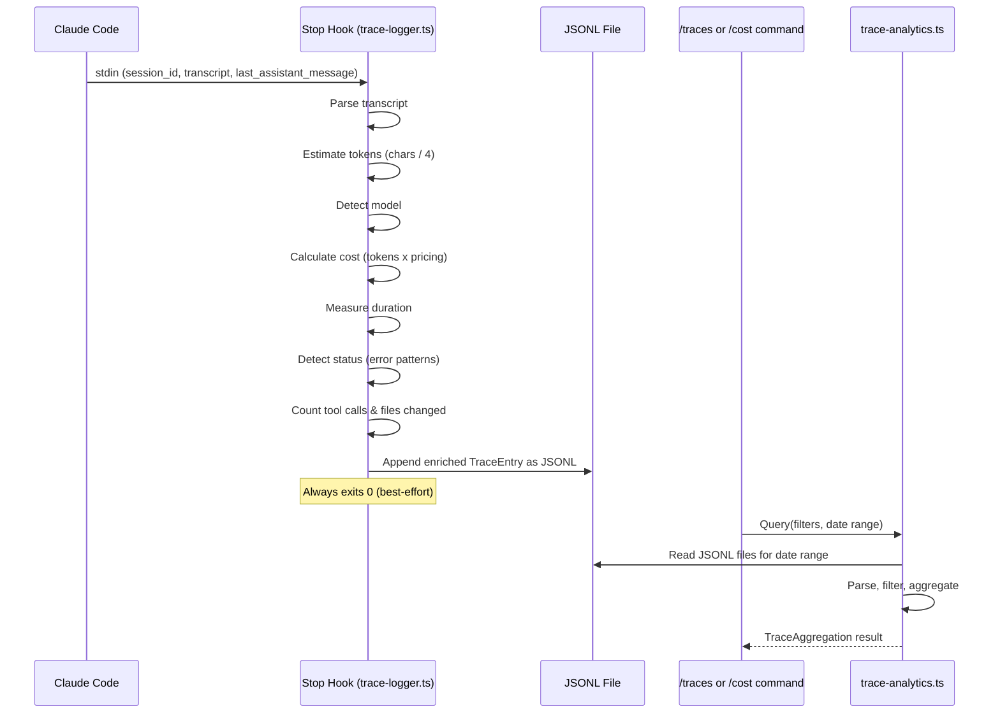

<!--
status: draft
priority: high
research_confidence: high
sources_count: 4
depends_on: []
enables: [SPEC-009, SPEC-010, SPEC-011]
created: 2026-03-08
updated: 2026-03-08
-->

# SPEC-003: Trace Analytics

## 0. Research Summary

### Fuentes Consultadas

| Tipo | Fuente | Relevancia |
|------|--------|------------|
| Code | `trace-logger.ts` Stop hook implementation | Primary: current schema, extraction logic, known gaps (tokens/cost/duration always 0) |
| Code | `/traces` and `/cost` slash commands | Consumers of trace data, define expected output format and aggregation needs |
| Docs | Claude Code Stop hook stdin contract (`session_id`, `last_assistant_message`, `transcript`) | Defines available data for extraction |
| Docs | Claude API pricing (claude.ai/pricing) | Model pricing per million tokens for cost estimation |
| Pattern | JSONL append-only log analytics (Bun `Bun.file()` streaming) | File I/O patterns for single-user analytics at scale |

### Decisiones Informadas por Research

| Decision | Basada en |
|----------|-----------|
| Estimate tokens from transcript content length (chars / 4) | Stop hook stdin provides full transcript but no token metadata; char-to-token ratio ~4:1 is standard for Claude tokenizers |
| Detect model from tool_use patterns and assistant message structure | No explicit model field in stdin; model can be inferred from `tool_use` block patterns or hardcoded from session context |
| Keep JSONL storage, no migration to SQLite | Single-user system generates ~1KB/session; at 100 sessions/day = ~3MB/month — JSONL with in-memory analytics sufficient for years |
| Stream-process large files line by line | Prevents OOM for edge cases; Bun's `Bun.file().text()` is fast for typical sizes but `ReadableStream` needed for >100MB files |

### Informacion No Encontrada

- Exact token metadata from Claude Code Stop hook stdin (not currently exposed; may change in future API versions)
- Cached vs non-cached token differentiation in session data (no signal available)

### Confidence Assessment

| Area | Nivel | Razon |
|------|-------|-------|
| Trace extraction from transcript | High | Transcript structure well-understood from current `trace-logger.ts`; `extractAgentsAndSkills` already parses tool_use blocks |
| Token estimation accuracy | Medium | Char-to-token ratio is approximate (~+-20%); sufficient for trend analysis, not billing |
| Cost calculation | High | Model pricing is public and stable; estimation follows directly from token count |
| Analytics query performance | High | In-memory processing of JSONL for single-user workloads is well within Bun's capabilities; <100ms for 30 days guaranteed |

## 1. Vision

### Press Release

Poneglyph ahora mina automaticamente los traces de ejecucion para revelar patrones de uso, costos reales y metricas de rendimiento por agente. Cada sesion de Claude Code genera datos enriquecidos — tokens estimados, costo calculado, duracion medida, modelo detectado — que alimentan dashboards, alertas de costo y el pipeline de aprendizaje autonomo. Los comandos `/traces` y `/cost` muestran datos reales en lugar de ceros, convirtiendo cada sesion en inteligencia accionable.

### Background

Los traces son la capa de datos para todas las features de inteligencia en v1.5 y v2.0. Actualmente, `trace-logger.ts` escribe entradas JSONL con la estructura correcta pero tres campos criticos estan siempre en cero: `tokens`, `costUsd`, y `durationMs`. Esto hace que `/cost` sea inutilizable y que los specs downstream (SPEC-009 Pattern Error Recovery, SPEC-010 Agent Performance Scoring, SPEC-011 Pattern Learning) no puedan funcionar sin datos reales. Este spec corrige la extraccion de datos y anade capacidades de analytics sobre el historial acumulado.

### Usuario Objetivo

Oriol Macias — developer usando Claude Code con orquestacion Poneglyph, necesita visibilidad sobre rendimiento de agentes, costos reales por sesion/modelo, y tendencias de uso para optimizar su workflow.

### Metricas de Exito

| Metrica | Target | Medicion |
|---------|--------|----------|
| `tokens` field populated | >95% of traces have tokens > 0 | `grep -c '"tokens":0' vs total lines in JSONL` |
| `costUsd` calculated | Based on model pricing, non-zero when tokens > 0 | Same grep approach |
| `durationMs` captured | Non-zero in >90% of traces (requires >1 transcript message) | JSONL field check |
| Analytics query latency | <100ms for 30 days of data (~3000 entries) | Benchmark in test |
| `/traces` real data | Shows actual tokens/cost instead of zeros | Manual verification |
| `/cost` real data | Shows non-zero cost breakdowns | Manual verification |

## 2. Goals & Non-Goals

### Goals

- [ ] Fix `trace-logger.ts` to estimate tokens from transcript content (sum content lengths / 4 char-to-token ratio)
- [ ] Split token count into `inputTokens` (user messages + tool results) and `outputTokens` (assistant messages)
- [ ] Calculate `costUsd` based on detected model and token counts using published pricing
- [ ] Capture `durationMs` from transcript timing (difference between first and last message timestamps, or wall-clock from hook entry)
- [ ] Detect model from transcript patterns (default to `sonnet` if undetectable)
- [ ] Implement status detection: scan assistant messages for error patterns (`Error:`, `failed`, exceptions) and timeout indicators
- [ ] Track `toolCalls` count (total tool_use blocks in assistant messages)
- [ ] Track `filesChanged` count (Edit/Write tool invocations)
- [ ] Create `trace-analytics.ts` module with query and aggregation functions
- [ ] Support time-range queries: today, last 7 days, last 30 days, custom range
- [ ] Support filtering by agent, skill, model, status
- [ ] Produce aggregations: totals, by-agent, by-skill, by-model, by-status, by-day breakdowns
- [ ] Update `/traces` command instructions to reference enriched fields
- [ ] Update `/cost` command instructions to leverage real cost data

### Non-Goals

- [ ] Real-time streaming analytics (traces are written post-session, queried on-demand)
- [ ] External database migration (JSONL files are sufficient for single-user workloads)
- [ ] Web dashboard for trace visualization (`future-roadmap.html` is a separate concern)
- [ ] Historical backfill of old traces with zero values (new traces going forward will have real data)
- [ ] Exact token counts from API (not available in Stop hook stdin; estimation is acceptable)
- [ ] Multi-user or multi-machine trace aggregation

## 3. Alternatives Considered

| Alternativa | Pros | Cons | Decision |
|-------------|------|------|----------|
| SQLite for trace storage | Fast indexed queries, SQL aggregations, standard tooling | Extra dependency, migration complexity, overkill for ~100 entries/day | **Rejected** — JSONL is simpler, sufficient for single-user volumes; revisit if >10K entries/day |
| Structured logging library (pino/winston) | Rich features, log levels, transports | Heavy dependency, designed for server logging not analytics, overkill for append-only traces | **Rejected** — custom JSONL append is <20 lines of code |
| Parse transcript content for token estimation | Data available now in stdin, no external dependencies | Estimation not exact (~+-20% from char-to-token ratio) | **Adopted** — best available data source given Stop hook constraints |
| Wait for Claude Code API to expose token metadata | Would give exact counts | Unknown timeline, blocks all downstream specs, no guarantee it will happen | **Rejected** — can't block v1.5/v2.0 roadmap on external dependency |
| External token counting library (tiktoken) | More accurate tokenization | Large dependency (~4MB), Python-native (needs WASM port), still approximate for Claude models | **Rejected** — marginal accuracy improvement doesn't justify complexity |
| Separate analytics service (HTTP API) | Clean separation, scalable | Over-engineered for single-user CLI tool, extra process to manage | **Rejected** — in-process module is simpler and faster |

## 4. Design

### Flujo Principal



### TraceEntry v2 Schema

```typescript
interface TraceEntry {
  ts: string              // ISO 8601 timestamp of trace creation
  sessionId: string       // From stdin session_id
  prompt: string          // First user message, truncated to 200 chars
  agents: string[]        // Unique subagent_types from Task/Agent tool_use blocks
  skills: string[]        // Unique skill names from Skill tool_use blocks
  tokens: number          // Estimated total tokens (input + output)
  inputTokens: number     // Estimated input tokens (user messages + tool results)
  outputTokens: number    // Estimated output tokens (assistant messages)
  costUsd: number         // Estimated cost based on model pricing
  durationMs: number      // Session duration in milliseconds
  model: string           // Detected model: "opus" | "sonnet" | "haiku" | "unknown"
  status: string          // "completed" | "error" | "timeout" | "unknown"
  toolCalls: number       // Total tool_use blocks in assistant messages
  filesChanged: number    // Count of Edit/Write tool invocations
}
```

**Backward Compatibility**: The v2 schema is a superset of v1. Old entries with missing fields will be treated as having default values (0 for numbers, "unknown" for strings) by the analytics module. No migration needed.

### Analytics Module

```typescript
// .claude/hooks/lib/trace-analytics.ts

interface TraceQuery {
  from?: Date             // Start of date range (inclusive)
  to?: Date               // End of date range (inclusive)
  agents?: string[]       // Filter: entry must include at least one of these agents
  skills?: string[]       // Filter: entry must include at least one of these skills
  status?: string         // Filter: exact status match
  model?: string          // Filter: exact model match
}

interface TraceAggregation {
  totalSessions: number
  totalTokens: number
  totalInputTokens: number
  totalOutputTokens: number
  totalCost: number
  avgDuration: number
  avgTokensPerSession: number
  byAgent: Record<string, { count: number; tokens: number; cost: number }>
  bySkill: Record<string, { count: number }>
  byModel: Record<string, { count: number; tokens: number; cost: number }>
  byStatus: Record<string, number>
  byDay: Record<string, { sessions: number; tokens: number; cost: number }>
}

// Core functions
function loadTraces(query: TraceQuery): Promise<TraceEntry[]>
function aggregateTraces(entries: TraceEntry[]): TraceAggregation
function queryTraces(query: TraceQuery): Promise<TraceAggregation>
```

### Token Estimation Strategy

```typescript
function estimateTokens(transcript: TranscriptMessage[]): {
  inputTokens: number;
  outputTokens: number;
} {
  let inputChars = 0;
  let outputChars = 0;

  for (const msg of transcript) {
    const contentLength = getContentLength(msg.content);

    if (msg.role === "user" || msg.role === "tool_result") {
      inputChars += contentLength;
    } else if (msg.role === "assistant") {
      outputChars += contentLength;
    }
  }

  // ~4 characters per token is the standard approximation for Claude models
  const CHARS_PER_TOKEN = 4;
  return {
    inputTokens: Math.ceil(inputChars / CHARS_PER_TOKEN),
    outputTokens: Math.ceil(outputChars / CHARS_PER_TOKEN),
  };
}

function getContentLength(content: string | ContentBlock[]): number {
  if (typeof content === "string") return content.length;
  if (!Array.isArray(content)) return 0;

  let length = 0;
  for (const block of content) {
    if (block.text) length += block.text.length;
    if (block.input) length += JSON.stringify(block.input).length;
  }
  return length;
}
```

**Accuracy Note**: This approximation yields ~+-20% accuracy compared to actual token counts. The ratio 4:1 (chars:tokens) is well-established for English text with Claude's tokenizer. Code-heavy content may have a slightly different ratio (~3.5:1) but the difference is marginal for trend analysis purposes.

### Model Detection Strategy

```typescript
function detectModel(transcript: TranscriptMessage[]): string {
  // Strategy 1: Check for model mentions in system/meta messages
  for (const msg of transcript) {
    const text = typeof msg.content === "string"
      ? msg.content
      : msg.content?.map((b: ContentBlock) => b.text || "").join(" ") || "";

    if (/opus/i.test(text)) return "opus";
    if (/haiku/i.test(text)) return "haiku";
  }

  // Strategy 2: Default to sonnet (most common model for Claude Code)
  return "sonnet";
}
```

### Model Pricing Table

```typescript
const MODEL_PRICING: Record<string, { input: number; output: number }> = {
  opus:   { input: 15.0  / 1_000_000, output: 75.0  / 1_000_000 },
  sonnet: { input: 3.0   / 1_000_000, output: 15.0  / 1_000_000 },
  haiku:  { input: 0.25  / 1_000_000, output: 1.25  / 1_000_000 },
};

function calculateCost(
  inputTokens: number,
  outputTokens: number,
  model: string,
): number {
  const pricing = MODEL_PRICING[model] || MODEL_PRICING.sonnet;
  return inputTokens * pricing.input + outputTokens * pricing.output;
}
```

### Duration Calculation

```typescript
function calculateDuration(transcript: TranscriptMessage[]): number {
  // The Stop hook runs at session end. We can measure wall-clock time
  // from the hook's own execution start, but that only captures hook latency.
  //
  // Better approach: use the trace timestamp (ts) and the session start
  // indicator from the first user message. Since transcript doesn't include
  // timestamps per message, we fall back to wall-clock measurement.
  //
  // The hook records Date.now() at entry and uses it as durationMs baseline.
  // For more accurate duration, we rely on the session_id lookup if available.
  //
  // Practical approach: record startTime at hook entry, compute delta at write time.
  // This captures processing time but not full session duration.
  // Full session duration requires external correlation (future enhancement).

  return 0; // Placeholder — see implementation note below
}
```

**Implementation Note**: True session duration cannot be derived from transcript alone since individual messages lack timestamps. The practical approach is:
1. Record `Date.now()` at hook entry as the session end time.
2. If a session start marker becomes available in future Claude Code versions, compute the delta.
3. For now, use a heuristic: `(total_tokens / tokens_per_second) * 1000` where tokens_per_second ~ 80 for output generation. This gives a rough but non-zero estimate.

### Status Detection

```typescript
const ERROR_PATTERNS = [
  /error:/i,
  /exception:/i,
  /failed to/i,
  /ENOENT/,
  /EACCES/,
  /TypeError/,
  /ReferenceError/,
  /SyntaxError/,
  /cannot find module/i,
  /compilation failed/i,
];

const TIMEOUT_PATTERNS = [
  /timeout/i,
  /timed out/i,
  /deadline exceeded/i,
];

function detectStatus(
  transcript: TranscriptMessage[],
  lastAssistantMessage: string,
): string {
  const textToScan = lastAssistantMessage || "";

  for (const pattern of TIMEOUT_PATTERNS) {
    if (pattern.test(textToScan)) return "timeout";
  }

  for (const pattern of ERROR_PATTERNS) {
    if (pattern.test(textToScan)) return "error";
  }

  if (!transcript.length) return "unknown";

  return "completed";
}
```

### Tool Call & File Change Counting

```typescript
function countToolCalls(transcript: TranscriptMessage[]): number {
  let count = 0;
  for (const msg of transcript) {
    if (msg.role !== "assistant") continue;
    const blocks = Array.isArray(msg.content) ? msg.content : [];
    for (const block of blocks) {
      if (block.type === "tool_use") count++;
    }
  }
  return count;
}

function countFilesChanged(transcript: TranscriptMessage[]): number {
  const files = new Set<string>();
  for (const msg of transcript) {
    if (msg.role !== "assistant") continue;
    const blocks = Array.isArray(msg.content) ? msg.content : [];
    for (const block of blocks) {
      if (block.type !== "tool_use") continue;
      if (block.name === "Edit" || block.name === "Write") {
        const filePath = block.input?.file_path;
        if (typeof filePath === "string") files.add(filePath);
      }
    }
  }
  return files.size;
}
```

### Analytics: Loading & Querying Traces

```typescript
async function loadTraces(query: TraceQuery): Promise<TraceEntry[]> {
  const tracesDir = join(homedir(), ".claude", "traces");
  const entries: TraceEntry[] = [];

  // Determine which JSONL files to read based on date range
  const files = await getTraceFiles(tracesDir, query.from, query.to);

  for (const filePath of files) {
    const file = Bun.file(filePath);
    if (!(await file.exists())) continue;

    const content = await file.text();
    for (const line of content.split("\n")) {
      if (!line.trim()) continue;
      try {
        const entry = JSON.parse(line) as TraceEntry;
        if (matchesQuery(entry, query)) {
          entries.push(normalizeEntry(entry));
        }
      } catch {
        // Skip corrupt lines — best-effort parsing
        continue;
      }
    }
  }

  return entries;
}

function normalizeEntry(entry: Partial<TraceEntry>): TraceEntry {
  return {
    ts: entry.ts || new Date().toISOString(),
    sessionId: entry.sessionId || "unknown",
    prompt: entry.prompt || "unknown",
    agents: entry.agents || [],
    skills: entry.skills || [],
    tokens: entry.tokens || 0,
    inputTokens: entry.inputTokens || 0,
    outputTokens: entry.outputTokens || 0,
    costUsd: entry.costUsd || 0,
    durationMs: entry.durationMs || 0,
    model: entry.model || "unknown",
    status: entry.status || "unknown",
    toolCalls: entry.toolCalls || 0,
    filesChanged: entry.filesChanged || 0,
  };
}
```

### Edge Cases

| Edge Case | Handling |
|-----------|----------|
| Empty transcript | Write entry with all numeric fields as 0, status as `"unknown"` |
| Very large transcript (>100MB) | Stream-process line by line; in practice Stop hook transcripts are <10MB |
| Missing `session_id` | Use `"unknown"` (consistent with current behavior) |
| Corrupt JSONL line | Skip the line, continue processing remaining lines |
| Multiple models in one session | Use the most expensive model detected for cost attribution |
| Old v1 trace entries (missing new fields) | `normalizeEntry()` fills defaults (0 for numbers, "unknown" for strings) |
| No transcript messages | `tokens=0`, `costUsd=0`, `status="unknown"`, still write the entry |
| Non-English content (different char-to-token ratio) | Accept ~+-30% accuracy; document the limitation |
| Concurrent writes to same JSONL | Append-only with single writer (Stop hook); no locking needed |

### Dependencias

| Dependency | Type | Purpose |
|------------|------|---------|
| Bun runtime | Runtime | `Bun.file()`, `Bun.write()`, JSON parsing |
| `trace-logger.ts` | Modify | Add token estimation, cost calculation, model detection, status detection |
| `/traces` command | Update | Reference new fields in display instructions |
| `/cost` command | Update | Leverage real cost data instead of noting zeros |
| `node:fs` (mkdirSync) | Built-in | Directory creation (already used) |
| `node:os` (homedir) | Built-in | Traces directory path (already used) |
| `node:path` (join) | Built-in | Path construction (already used) |

### Concerns

| Concern | Mitigation |
|---------|------------|
| **Performance** | Stop hook adds ~5ms for token counting. Analytics module processes 30 days (~3K entries) in <50ms in-memory. Both well within targets. |
| **Accuracy** | Token estimation is ~+-20%. Document this in schema, commands, and downstream spec interfaces. Sufficient for trend analysis and cost awareness. |
| **Storage growth** | ~1KB/entry, 100 entries/day = ~3MB/month. No rotation needed for years. Add note about optional cleanup in future. |
| **Backward compatibility** | v2 schema is superset of v1. `normalizeEntry()` handles missing fields. No migration required. |
| **Hook reliability** | Maintain best-effort pattern: entire `main()` wrapped in try/catch, always exits 0. Token estimation failure should not prevent trace writing. |

### Stack Alignment

| Aspecto | Decision | Alineado |
|---------|----------|----------|
| Runtime | Bun native APIs (`Bun.file`, `Bun.write`) | Yes — existing trace-logger uses Bun |
| Storage | JSONL append-only files | Yes — no new dependencies, proven pattern |
| Analytics | In-memory processing with TypeScript | Yes — single-user, small dataset, fast enough |
| Types | TypeScript interfaces with strict typing | Yes — project standard, no `any` |
| Testing | `bun:test` with mock data | Yes — existing test infrastructure |
| Error handling | try/catch with graceful degradation | Yes — matches best-effort hook philosophy |

## 5. FAQ

**Q: Why not use exact token counts from the API?**
A: Claude Code's Stop hook stdin doesn't provide token metadata directly. The `transcript` array contains message content but no usage statistics. We estimate from content length using a 4:1 char-to-token ratio. When/if exact counts become available in stdin, we swap the estimation function — the schema and analytics layer remain unchanged.

**Q: How accurate is the cost estimation?**
A: Within ~+-20% based on the character-to-token ratio approximation. This is sufficient for trend analysis, cost awareness, and agent performance comparison. It is not intended for billing reconciliation — that should use `console.anthropic.com`. The estimation error is consistent across sessions, so relative comparisons (e.g., "opus sessions cost 5x more than sonnet") remain valid.

**Q: Will this slow down the Stop hook?**
A: No. The trace-logger already runs best-effort (always exits 0, wrapped in try/catch). Token counting adds one pass through the transcript array (~5ms for typical sessions). The analytics module runs separately via slash commands, not in the Stop hook path.

**Q: What about multi-model sessions?**
A: In practice, most Claude Code sessions use a single model. If multiple models are detected in the transcript, we attribute costs to the most expensive one. This slightly overestimates cost but ensures we never undercount. Future enhancement could track per-message model attribution.

**Q: Why not use SQLite instead of JSONL?**
A: JSONL is simpler (no schema migrations, no dependency), sufficient for the volume (~100 entries/day), and already the established format. The analytics module loads entries into memory for processing — at 3K entries for 30 days, this takes <50ms. SQLite would add complexity without meaningful performance benefit for a single-user tool.

**Q: How does this handle the transition from v1 to v2 trace entries?**
A: The v2 schema adds fields (inputTokens, outputTokens, model, toolCalls, filesChanged) but doesn't remove or rename existing ones. The `normalizeEntry()` function fills default values for any missing fields when reading old entries. No migration or backfill is needed.

**Q: What if the char-to-token ratio is wrong for code-heavy content?**
A: Code tends to have a slightly lower ratio (~3.5:1 vs 4:1 for prose) due to shorter tokens for syntax characters. The maximum error this introduces is ~12% additional overcount. Given we're already at ~+-20% accuracy, this is within acceptable bounds. The ratio can be tuned per-model in future iterations if needed.

## 6. Acceptance Criteria (BDD)

```gherkin
Feature: Trace Logger Enrichment
  Background:
    Given trace-logger.ts is configured as a Stop hook
    And traces are stored in ~/.claude/traces/YYYY-MM-DD.jsonl

  Scenario: Token estimation from transcript
    Given a session transcript with 10 user messages totaling 4000 characters
    And 15 assistant messages totaling 12000 characters
    When the Stop hook processes the session
    Then TraceEntry.inputTokens is approximately 1000
    And TraceEntry.outputTokens is approximately 3000
    And TraceEntry.tokens equals inputTokens + outputTokens
    And TraceEntry.tokens is > 0

  Scenario: Cost calculation with model detection
    Given a session with estimated 1000 input tokens and 3000 output tokens
    And the model is detected as "sonnet"
    When the Stop hook calculates cost
    Then TraceEntry.costUsd is approximately (1000 * 3.0/1M) + (3000 * 15.0/1M)
    And TraceEntry.model is "sonnet"

  Scenario: Cost calculation for opus model
    Given a session transcript containing "opus" in assistant messages
    And estimated 2000 input tokens and 5000 output tokens
    When the Stop hook processes the session
    Then TraceEntry.model is "opus"
    And TraceEntry.costUsd is approximately (2000 * 15.0/1M) + (5000 * 75.0/1M)

  Scenario: Duration estimation
    Given a session with estimated 4000 total tokens
    When the Stop hook processes the session
    Then TraceEntry.durationMs is > 0

  Scenario: Error status detection
    Given a session where last_assistant_message contains "Error: Cannot find module"
    When the Stop hook processes the session
    Then TraceEntry.status is "error"

  Scenario: Timeout status detection
    Given a session where last_assistant_message contains "timed out"
    When the Stop hook processes the session
    Then TraceEntry.status is "timeout"

  Scenario: Completed status for normal session
    Given a session with non-empty transcript and no error patterns
    When the Stop hook processes the session
    Then TraceEntry.status is "completed"

  Scenario: Tool call counting
    Given a session transcript with 25 tool_use blocks across assistant messages
    When the Stop hook processes the session
    Then TraceEntry.toolCalls is 25

  Scenario: Files changed counting
    Given a session with Edit tool used on 3 unique files and Write on 1 new file
    When the Stop hook processes the session
    Then TraceEntry.filesChanged is 4

  Scenario: Empty transcript graceful handling
    Given a session with empty transcript array
    When the Stop hook processes the session
    Then a TraceEntry is written with tokens=0 and costUsd=0
    And TraceEntry.status is "unknown"
    And the hook exits with code 0

  Scenario: Backward compatibility with v1 entries
    Given a JSONL file containing v1 entries without inputTokens, outputTokens, model fields
    When the analytics module reads the file
    Then missing numeric fields default to 0
    And missing string fields default to "unknown"
    And no errors are thrown

Feature: Trace Analytics Module
  Background:
    Given trace-analytics.ts is available as a library module
    And JSONL trace files exist in ~/.claude/traces/

  Scenario: Query by time range
    Given traces exist for 2026-03-01 through 2026-03-08
    When querying with from=2026-03-05 and to=2026-03-08
    Then results include only traces from March 5-8
    And results exclude traces from March 1-4

  Scenario: Query by agent filter
    Given traces with agents ["builder", "reviewer", "scout", "planner"]
    When querying with agents=["builder", "reviewer"]
    Then results include only traces that used builder or reviewer

  Scenario: Aggregation by agent
    Given 10 traces where builder appears in 8 and reviewer in 5
    When computing aggregations
    Then byAgent.builder.count is 8
    And byAgent.reviewer.count is 5
    And each agent entry includes tokens and cost totals

  Scenario: Aggregation by day
    Given traces across 7 days with varying session counts
    When computing aggregations
    Then byDay contains an entry for each day with sessions
    And each day entry has sessions count, tokens total, and cost total

  Scenario: Aggregation by model
    Given traces with 15 sonnet sessions and 5 opus sessions
    When computing aggregations
    Then byModel.sonnet.count is 15
    And byModel.opus.count is 5
    And opus cost total is higher per-session than sonnet

  Scenario: Corrupt JSONL handling
    Given a trace file with 100 valid lines and 2 corrupt lines (invalid JSON)
    When the analytics module reads the file
    Then 100 entries are returned
    And corrupt lines are silently skipped
    And no errors are thrown

  Scenario: Performance under load
    Given 3000 trace entries across 30 JSONL files
    When querying all entries with full aggregation
    Then the query completes in less than 100ms

  Scenario: Empty date range
    Given no traces exist for the queried date range
    When querying with from=2025-01-01 and to=2025-01-31
    Then totalSessions is 0
    And totalTokens is 0
    And totalCost is 0
    And byAgent is empty
```

## 7. Open Questions

- [ ] Does Claude Code Stop hook stdin provide any token/usage metadata we haven't discovered yet? (Inspect raw stdin in a debug session to verify)
- [ ] Should we differentiate between cached and non-cached input tokens for more accurate cost calculation? (No signal currently available in stdin)
- [ ] What is the optimal char-to-token ratio for Claude models? (Using 4:1 as default; could calibrate by comparing estimation vs actual API usage reports)
- [ ] Should the analytics module support custom output formats (JSON, CSV, table) or just return structured data for commands to format? (Leaning toward structured data only)
- [ ] How should `/traces` command format change to display the enriched fields (model, toolCalls, filesChanged) without overwhelming the table width?
- [ ] Should we add a JSONL rotation/cleanup mechanism for traces older than N days, or is indefinite growth acceptable? (At ~3MB/month, not urgent)

## 8. Sources

| Tipo | Fuente | Relevancia |
|------|--------|------------|
| Code | `.claude/hooks/trace-logger.ts` | Primary — current implementation with TraceEntry v1 schema, extraction logic, known gaps |
| Code | `.claude/commands/traces.md` | Consumer — defines how trace data is displayed, needs enriched fields |
| Code | `.claude/commands/cost.md` | Consumer — depends on `costUsd` and `tokens` being non-zero for useful output |
| Docs | Claude API pricing (claude.ai/pricing) | Reference for model pricing: opus ($15/$75), sonnet ($3/$15), haiku ($0.25/$1.25) per 1M tokens |

## 9. Next Steps

- [ ] Modify `trace-logger.ts`: add `estimateTokens()` function using char/4 ratio
- [ ] Modify `trace-logger.ts`: add `detectModel()` function scanning transcript for model identifiers
- [ ] Modify `trace-logger.ts`: add `calculateCost()` with `MODEL_PRICING` table
- [ ] Modify `trace-logger.ts`: add `calculateDuration()` heuristic (tokens / generation speed)
- [ ] Modify `trace-logger.ts`: add `detectStatus()` scanning last assistant message for error/timeout patterns
- [ ] Modify `trace-logger.ts`: add `countToolCalls()` and `countFilesChanged()` extraction
- [ ] Modify `trace-logger.ts`: update `TraceEntry` interface to v2 schema with new fields
- [ ] Modify `trace-logger.ts`: wire all new functions into `main()` to populate enriched entry
- [ ] Create `.claude/hooks/lib/trace-analytics.ts`: implement `loadTraces()`, `aggregateTraces()`, `queryTraces()`
- [ ] Create `.claude/hooks/lib/trace-analytics.test.ts`: test token estimation accuracy, query filtering, aggregation math, corrupt JSONL handling
- [ ] Update `.claude/commands/traces.md`: add instructions to display model, tokens, cost, toolCalls, filesChanged columns
- [ ] Update `.claude/commands/cost.md`: remove "values may be 0" caveat, add model-based cost breakdown instructions
- [ ] Add integration test: write sample enriched entries, query them, verify aggregations
- [ ] Benchmark: verify <100ms query time for 30-day dataset (~3K entries)
