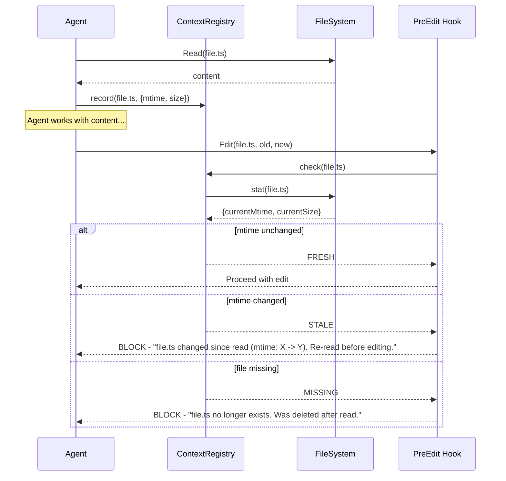

<!--
status: draft
priority: medium
research_confidence: medium
sources_count: 3
depends_on: []
enables: [SPEC-008, SPEC-012]
created: 2026-03-08
updated: 2026-03-08
-->

# SPEC-004: Stale Context Detection

## 0. Research Summary

### Fuentes Consultadas

| Tipo | Fuente | Referencia | Relevancia |
|------|--------|------------|------------|
| Runtime API | Bun `stat()` / `Bun.file()` | bun.sh/docs/api/file-io | Alta |
| Cache pattern | Cache invalidation strategies | Martin Fowler, "Patterns of Enterprise Application Architecture" | Alta |
| Hook infra | Existing PostToolUse hooks in Poneglyph | `.claude/hooks/validators/config.ts` | Alta |

### Decisiones Informadas por Research

| Decision | Basada en |
|----------|-----------|
| Use `mtime` + `size` as primary staleness signal | `Bun.file().stat()` returns both in <1ms; sufficient for CLI session scope |
| In-memory registry (no persistence) | Claude Code sessions are ephemeral processes; persisting across sessions adds complexity without clear benefit |
| Pre-edit hook integration | Existing `PostToolUse` hook infrastructure with `Edit|Write` matcher already validates edits; pre-edit check follows same pattern |
| Content hash as optional escalation | `Bun.hash()` (xxHash64) is fast but adds I/O; reserve for critical files only |

### Informacion No Encontrada

- No benchmarks for `Bun.file().stat()` latency under heavy concurrent agent load (estimated <1ms based on OS syscall cost)
- No prior art for staleness detection in CLI-based multi-agent orchestration tools (novel problem space)
- No data on how frequently agents actually read then edit the same file within a session (need trace data from SPEC-003)

### Confidence Assessment

| Area | Nivel | Razon |
|------|-------|-------|
| mtime-based detection | Alta | Well-understood OS primitive; `stat()` is the standard approach |
| Hook integration | Alta | Existing hook infrastructure is proven and well-documented |
| Cross-agent coordination | Baja | Claude Code subagents run in isolated processes; sharing state requires IPC or filesystem |
| Performance impact | Media | Single `stat()` call is fast, but hook overhead per edit needs measurement |

---

## 1. Vision

> **Press Release**: Poneglyph agents now detect when their loaded context is stale, preventing operations on outdated information. When one agent modifies a file that another agent read earlier, the system flags the stale context and forces a re-read before proceeding. This eliminates an entire class of silent failures where agents edit files based on outdated snapshots.

**Background**: In Poneglyph's multi-agent orchestration, agents read files at the start of a task and work with that snapshot. Currently there is no mechanism to detect when loaded context becomes outdated. This leads to three failure modes:

| Failure Mode | Example | Impact |
|--------------|---------|--------|
| Agent-to-agent conflict | Builder A modifies `config.ts`, Builder B edits same file with stale snapshot | Silent data loss |
| External modification | User edits a file outside Claude Code while agent is working | Agent overwrites user changes |
| Long-running drift | Agent reads file, spends 30+ seconds reasoning, file changes | Edit based on outdated content |

**Usuario objetivo**: All Poneglyph agents (builder, reviewer, scout) that read files and later reference or edit them.

**Metricas de exito**:

| Metrica | Target |
|---------|--------|
| Edit conflicts from stale reads | 0 (zero) |
| Staleness detection latency | < 5ms per check |
| False positive rate | < 1% (mtime changes without content change) |
| Hook overhead per edit | < 10ms total |

---

## 2. Goals & Non-Goals

### Goals

- [ ] Track `mtime` and `size` for every file an agent reads via the `Read` tool
- [ ] Detect staleness before `Edit` and `Write` operations via a PreToolUse hook
- [ ] Force re-read of stale files before allowing edits to proceed
- [ ] Provide clear error messages when staleness is detected, including which file changed and when
- [ ] Support optional content hash comparison for critical files (configurable)
- [ ] Integrate with existing hook infrastructure (`settings.json` PreToolUse matcher)
- [ ] Record file metadata in a session-scoped registry accessible to the current agent process

### Non-Goals

- [ ] Real-time file watching with persistent daemon (no chokidar, no FSEvents)
- [ ] Full file system event subscription (OS-level watchers)
- [ ] File versioning or rollback capabilities
- [ ] Cross-process state sharing between parallel subagents (deferred to SPEC-008)
- [ ] Persisting the context registry between Claude Code sessions
- [ ] Tracking non-file context (environment variables, network state, database state)
- [ ] Automatic conflict resolution or merge (agent decides how to proceed)

---

## 3. Alternatives Considered

| Alternativa | Pros | Cons | Decision |
|-------------|------|------|----------|
| **A: File watchers (chokidar/FSEvents)** | Real-time detection; push-based | Requires persistent daemon process; Claude Code is ephemeral CLI; adds external dependency; high complexity | Rejected: architectural mismatch with CLI tool |
| **B: mtime check before edit** | Simple; single `stat()` syscall; <1ms; no daemon; uses existing OS primitive | Misses same-second edits on some filesystems (FAT32 has 2s resolution); does not detect content-only changes | Adopted: simplicity and speed outweigh edge cases; NTFS/ext4 have sub-second mtime |
| **C: Content hash comparison** | Detects all content changes including same-mtime edits; no false negatives | Requires reading entire file for each check; slower for large files; I/O overhead | Adopted as optional escalation: use when mtime changed but confirmation needed |
| **D: Git status based detection** | Leverages existing git infrastructure; detects staged/unstaged changes | Misses untracked files; misses changes in `.gitignore`d files; requires git repo; slower than `stat()` | Rejected: too many blind spots for general-purpose detection |

---

## 4. Design

### Flujo Principal



### Context Registry (In-Memory Per Session)

```typescript
interface ContextEntry {
  path: string
  mtime: number
  size: number
  hash?: string
  loadedAt: number
  loadedBy: string
}

interface StalenessResult {
  status: 'fresh' | 'stale' | 'missing'
  entry?: ContextEntry
  currentMtime?: number
  currentSize?: number
}

interface ContextRegistry {
  entries: Map<string, ContextEntry>
  record(path: string, meta: { mtime: number; size: number; hash?: string }): void
  check(path: string): Promise<StalenessResult>
  invalidate(path: string): void
  invalidateAll(): void
}
```

### Registry Implementation

```typescript
import { normalizePath } from './validators/config'

const REGISTRY_FILE = '.claude/.context-registry.json'

export function createContextRegistry(): ContextRegistry {
  const entries = new Map<string, ContextEntry>()

  return {
    entries,

    record(path: string, meta: { mtime: number; size: number; hash?: string }): void {
      const normalized = normalizePath(path)
      entries.set(normalized, {
        path: normalized,
        mtime: meta.mtime,
        size: meta.size,
        hash: meta.hash,
        loadedAt: Date.now(),
        loadedBy: Bun.env.CLAUDE_AGENT_TYPE ?? 'unknown',
      })
    },

    async check(path: string): Promise<StalenessResult> {
      const normalized = normalizePath(path)
      const entry = entries.get(normalized)

      if (!entry) {
        return { status: 'fresh' }
      }

      const file = Bun.file(path)
      const exists = await file.exists()

      if (!exists) {
        return { status: 'missing', entry }
      }

      const stat = await file.stat()
      const currentMtime = stat.mtimeMs
      const currentSize = stat.size

      if (currentMtime !== entry.mtime || currentSize !== entry.size) {
        return { status: 'stale', entry, currentMtime, currentSize }
      }

      return { status: 'fresh', entry }
    },

    invalidate(path: string): void {
      const normalized = normalizePath(path)
      entries.delete(normalized)
    },

    invalidateAll(): void {
      entries.clear()
    },
  }
}
```

### Integration Points

#### 1. PostToolUse Hook (after Read): Record Context

When Claude Code reads a file via the `Read` tool, a PostToolUse hook records the file's metadata.

```typescript
// .claude/hooks/validators/context/record-read.ts
import { readStdin, EXIT_CODES } from '../config'

async function main(): Promise<void> {
  const input = await readStdin()

  if (input.tool_name !== 'Read') {
    process.exit(EXIT_CODES.PASS)
  }

  const filePath = input.tool_input.file_path
  if (!filePath) {
    process.exit(EXIT_CODES.PASS)
  }

  const file = Bun.file(filePath)
  if (!(await file.exists())) {
    process.exit(EXIT_CODES.PASS)
  }

  const stat = await file.stat()
  const registryPath = '.claude/.context-registry.json'
  const registryFile = Bun.file(registryPath)

  let registry: Record<string, ContextEntry> = {}
  if (await registryFile.exists()) {
    registry = await registryFile.json()
  }

  const normalized = filePath.replace(/\\/g, '/').toLowerCase()
  registry[normalized] = {
    path: normalized,
    mtime: stat.mtimeMs,
    size: stat.size,
    loadedAt: Date.now(),
    loadedBy: Bun.env.CLAUDE_AGENT_TYPE ?? 'unknown',
  }

  await Bun.write(registryPath, JSON.stringify(registry, null, 2))
  process.exit(EXIT_CODES.PASS)
}

main()
```

#### 2. PreToolUse Hook (before Edit/Write): Check Staleness

Before allowing an `Edit` or `Write`, check if the target file has changed since it was last read.

```typescript
// .claude/hooks/validators/context/check-staleness.ts
import { readStdin, EXIT_CODES, reportError } from '../config'

async function main(): Promise<void> {
  const input = await readStdin()

  if (input.tool_name !== 'Edit' && input.tool_name !== 'Write') {
    process.exit(EXIT_CODES.PASS)
  }

  const filePath = input.tool_input.file_path
  if (!filePath) {
    process.exit(EXIT_CODES.PASS)
  }

  const registryFile = Bun.file('.claude/.context-registry.json')
  if (!(await registryFile.exists())) {
    process.exit(EXIT_CODES.PASS)
  }

  const registry = await registryFile.json() as Record<string, ContextEntry>
  const normalized = filePath.replace(/\\/g, '/').toLowerCase()
  const entry = registry[normalized]

  if (!entry) {
    process.exit(EXIT_CODES.PASS)
  }

  const targetFile = Bun.file(filePath)
  if (!(await targetFile.exists())) {
    reportError(
      `STALE CONTEXT: File "${filePath}" no longer exists. ` +
      `It was read at ${new Date(entry.loadedAt).toISOString()} but has since been deleted. ` +
      `Remove the edit or verify the file path.`
    )
  }

  const stat = await targetFile.stat()

  if (stat.mtimeMs !== entry.mtime || stat.size !== entry.size) {
    const readTime = new Date(entry.loadedAt).toISOString()
    const modTime = new Date(stat.mtimeMs).toISOString()
    reportError(
      `STALE CONTEXT: File "${filePath}" has changed since it was last read.\n` +
      `  Read at:     ${readTime} (mtime: ${entry.mtime}, size: ${entry.size})\n` +
      `  Current:     ${modTime} (mtime: ${stat.mtimeMs}, size: ${stat.size})\n` +
      `  Action:      Re-read the file before editing to get current content.`
    )
  }

  process.exit(EXIT_CODES.PASS)
}

main()
```

#### 3. PostToolUse Hook (after Edit/Write): Invalidate + Re-record

After a successful edit, update the registry with the new file state so subsequent edits do not false-positive.

```typescript
// .claude/hooks/validators/context/update-after-write.ts
import { readStdin, EXIT_CODES } from '../config'

async function main(): Promise<void> {
  const input = await readStdin()

  if (input.tool_name !== 'Edit' && input.tool_name !== 'Write') {
    process.exit(EXIT_CODES.PASS)
  }

  const filePath = input.tool_input.file_path
  if (!filePath) {
    process.exit(EXIT_CODES.PASS)
  }

  const file = Bun.file(filePath)
  if (!(await file.exists())) {
    process.exit(EXIT_CODES.PASS)
  }

  const stat = await file.stat()
  const registryPath = '.claude/.context-registry.json'
  const registryFile = Bun.file(registryPath)

  let registry: Record<string, ContextEntry> = {}
  if (await registryFile.exists()) {
    registry = await registryFile.json()
  }

  const normalized = filePath.replace(/\\/g, '/').toLowerCase()
  registry[normalized] = {
    path: normalized,
    mtime: stat.mtimeMs,
    size: stat.size,
    loadedAt: Date.now(),
    loadedBy: Bun.env.CLAUDE_AGENT_TYPE ?? 'unknown',
  }

  await Bun.write(registryPath, JSON.stringify(registry, null, 2))
  process.exit(EXIT_CODES.PASS)
}

main()
```

### Hook Registration in settings.json

```jsonc
{
  "hooks": {
    "PostToolUse": [
      {
        "matcher": "Read",
        "hooks": [
          {
            "type": "command",
            "command": "bun run .claude/hooks/validators/context/record-read.ts",
            "timeout": 5000
          }
        ]
      },
      {
        "matcher": "Edit|Write",
        "hooks": [
          {
            "type": "command",
            "command": "bun run .claude/hooks/validators/context/update-after-write.ts",
            "timeout": 5000
          }
        ]
      }
    ],
    "PreToolUse": [
      {
        "matcher": "Edit|Write",
        "hooks": [
          {
            "type": "command",
            "command": "bun run .claude/hooks/validators/context/check-staleness.ts",
            "timeout": 5000
          }
        ]
      }
    ]
  }
}
```

### Edge Cases

| Edge Case | Handling |
|-----------|----------|
| Rapid successive edits (agent edits same file twice) | PostToolUse after first edit updates registry; second edit checks against updated mtime |
| Symlinks | `normalizePath` resolves to consistent key; `stat()` follows symlinks by default |
| File deleted between read and edit | `check()` returns `'missing'`; hook blocks with clear message |
| Large files (>10MB) | mtime+size check is O(1) regardless of file size; hash only if explicitly configured |
| File created after read (new file via Write) | No entry in registry for new files; hook passes (no stale context possible) |
| Formatter/linter modifies file after Edit | PostToolUse `update-after-write` runs after formatters if ordered correctly; registry reflects final state |
| Windows path separators | `normalizePath` converts `\` to `/` and lowercases for consistent keys |
| Same mtime but different content | Rare on NTFS/ext4 (sub-ms resolution); size check catches most cases; optional hash for critical files |

### Stack Alignment

| Aspecto | Decision | Alineado | Razon |
|---------|----------|----------|-------|
| Runtime | Bun `stat()` / `Bun.file()` | Yes | Project uses Bun throughout |
| Hook infra | PostToolUse + PreToolUse | Yes | Existing hook system in `settings.json` |
| Config module | Extends `validators/config.ts` | Yes | Reuses `readStdin`, `reportError`, `normalizePath` |
| Storage | JSON file in `.claude/` | Yes | Consistent with existing `.claude/` convention |
| Error reporting | `reportError()` with exit code 2 | Yes | Same pattern as all other validators |
| Path handling | `normalizePath()` from config | Yes | Already handles Windows backslash conversion |

---

## 5. FAQ

**Q: What is the performance overhead of checking staleness on every edit?**
A: A single `stat()` syscall takes <1ms on modern filesystems (NTFS, ext4, APFS). Reading and parsing the JSON registry file adds ~2-3ms. Total overhead per edit is estimated at <5ms, well within the 10ms budget. This is comparable to existing PostToolUse hooks which already run on every edit.

**Q: How does this work across parallel subagents (Task tool)?**
A: In the current design, each subagent process has its own session. The JSON registry file on disk provides a shared-nothing coordination point: subagent A writes to the registry after reading, subagent B's staleness check reads the registry and sees A's recorded mtime. However, concurrent writes to the registry file could race. SPEC-008 (Agent Attention Mechanisms) will address proper cross-agent coordination with locking or atomic operations.

**Q: Does this work with git worktrees?**
A: Yes. The registry uses absolute normalized paths as keys. Each worktree has its own file paths, so entries do not collide. SPEC-002 (Git Worktree Isolation) will formalize worktree-specific scoping if needed.

**Q: What happens if the registry file itself becomes corrupted?**
A: If JSON parsing fails, the hook treats it as "no registry" and exits with PASS (permissive fallback). The registry is ephemeral and can be deleted at any time without data loss. A new one is created on the next Read operation.

**Q: Can the user disable staleness detection?**
A: Yes, by removing the hook entries from `settings.json`. An environment variable `CLAUDE_STALE_CHECK=false` could also be supported to disable at runtime without modifying config.

**Q: What about files read via Bash (cat, less)?**
A: Only files read via the `Read` tool are tracked. Bash-based file reads bypass the hook system and are not recorded. This is acceptable because the Builder agent rules require using `Read` before `Edit`.

---

## 6. Acceptance Criteria (BDD)

```gherkin
Feature: Stale Context Detection

  Scenario: File modified externally triggers stale detection
    Given agent has read file "src/config.ts" at time T1
    And the registry records mtime M1 for "src/config.ts"
    When an external process modifies "src/config.ts" at time T2 > T1
    And agent attempts to Edit "src/config.ts"
    Then the PreToolUse hook detects mtime M2 != M1
    And the hook exits with code 2 (BLOCK)
    And stderr contains "STALE CONTEXT" and the file path
    And stderr instructs agent to re-read the file

  Scenario: Agent re-reads stale file before edit
    Given agent has read file "src/utils.ts" and it was flagged as stale
    When agent re-reads "src/utils.ts" via Read tool
    Then the PostToolUse hook updates the registry with new mtime M2
    And when agent attempts to Edit "src/utils.ts"
    Then the PreToolUse hook finds mtime matches M2
    And the hook exits with code 0 (PASS)

  Scenario: Unmodified file passes freshness check
    Given agent has read file "src/index.ts" at time T1
    And no modifications have occurred to "src/index.ts"
    When agent attempts to Edit "src/index.ts"
    Then the PreToolUse hook finds mtime unchanged
    And the hook exits with code 0 (PASS)
    And no error message is emitted

  Scenario: Deleted file detected as missing
    Given agent has read file "src/temp.ts" at time T1
    And "src/temp.ts" is subsequently deleted
    When agent attempts to Edit "src/temp.ts"
    Then the PreToolUse hook detects file does not exist
    And the hook exits with code 2 (BLOCK)
    And stderr contains "no longer exists"

  Scenario: Multiple agents tracking same file
    Given agent "builder-1" reads file "src/shared.ts" and records mtime M1
    And agent "builder-2" reads file "src/shared.ts" and records mtime M1
    When agent "builder-1" edits "src/shared.ts" (mtime becomes M2)
    And PostToolUse updates registry with M2
    Then when agent "builder-2" attempts to Edit "src/shared.ts"
    And the PreToolUse hook detects mtime M2 != M1 (builder-2's recorded value)
    And the hook exits with code 2 (BLOCK)

  Scenario: New file creation bypasses staleness check
    Given no entry exists in the registry for "src/new-file.ts"
    When agent attempts to Write "src/new-file.ts"
    Then the PreToolUse hook finds no registry entry
    And the hook exits with code 0 (PASS)

  Scenario: Performance requirement met
    Given agent has read 50 files into the registry
    When agent attempts to Edit any of those files
    Then the staleness check completes in less than 5ms
```

---

## 7. Open Questions

- [ ] **Cross-process coordination**: When two subagents run in parallel via `Task`, they each spawn separate processes. The JSON file approach provides eventual consistency but not atomicity. Should we use file locking (`flock`/`LockFile`) or accept the small race window? Deferred to SPEC-008.

- [ ] **Hash algorithm choice**: If content hashing is enabled, should we use `Bun.hash()` (xxHash64, very fast but non-cryptographic) or `Bun.CryptoHasher` (SHA-256, slower but standard)? xxHash64 is sufficient for change detection (not security).

- [ ] **Registry persistence between sessions**: Currently ephemeral (deleted on session end). Should the registry persist to detect changes made between Claude Code sessions? This would help with the "user edited files offline" case but adds cleanup complexity.

- [ ] **Gitignored registry file**: Should `.claude/.context-registry.json` be added to `.gitignore`? It is session-specific and should not be committed. Need to verify `.gitignore` patterns.

- [ ] **Hook ordering with formatters**: The `format-code.ts` PostToolUse hook modifies files after Edit. The `update-after-write.ts` hook must run AFTER formatters to record the final mtime. Need to verify hook execution order in Claude Code (array order = execution order?).

- [ ] **Threshold for "critical files"**: Which files warrant content hash verification beyond mtime+size? Candidates: `settings.json`, `CLAUDE.md`, agent definitions. Should this be configurable?

---

## 8. Sources

### Links Verificados

- **Bun File I/O** - `Bun.file()` API including `stat()`, `exists()`, and lazy file references. Provides `mtimeMs` and `size` via standard `stat` result. [bun.sh/docs/api/file-io]
- **Bun Hashing** - `Bun.hash()` uses xxHash64 for non-cryptographic fast hashing. `Bun.CryptoHasher` for SHA/MD5. [bun.sh/docs/api/hashing]
- **Poneglyph Hook Infrastructure** - Existing `validators/config.ts` provides `readStdin()`, `reportError()`, `normalizePath()`, `EXIT_CODES`. All PostToolUse validators follow this pattern. [`.claude/hooks/validators/config.ts`]
- **Claude Code Hooks Documentation** - PreToolUse, PostToolUse, and Stop hooks with stdin JSON format, matcher patterns, and exit code semantics. Hook receives `{tool_name, tool_input, tool_output}` on stdin.
- **Cache Invalidation Patterns** - mtime-based cache invalidation is a well-established pattern in build tools (Make, Webpack, esbuild). The "last modified time" approach is the industry standard for file-level change detection.

---

## 9. Next Steps

- [ ] **Phase 1: Core Registry** - Implement `ContextRegistry` as a JSON file read/write utility in `.claude/hooks/validators/context/registry.ts`
- [ ] **Phase 2: Record Hook** - Create `record-read.ts` PostToolUse hook that fires on `Read` tool and records file metadata
- [ ] **Phase 3: Staleness Hook** - Create `check-staleness.ts` PreToolUse hook that fires on `Edit|Write` and checks registry
- [ ] **Phase 4: Update Hook** - Create `update-after-write.ts` PostToolUse hook that updates registry after successful edits
- [ ] **Phase 5: Integration** - Register all hooks in `settings.json` with proper matchers and ordering
- [ ] **Phase 6: Testing** - Write test suite covering all BDD scenarios in `validators/context/*.test.ts`
- [ ] **Phase 7: Gitignore** - Add `.claude/.context-registry.json` to `.gitignore`
- [ ] **Phase 8: Documentation** - Update agent docs to reference staleness detection behavior
- [ ] **Phase 9: Optional Hash** - Implement content hash comparison for configurable critical file list
- [ ] **Dependency**: After implementation, SPEC-008 can build cross-agent attention on top of this registry
