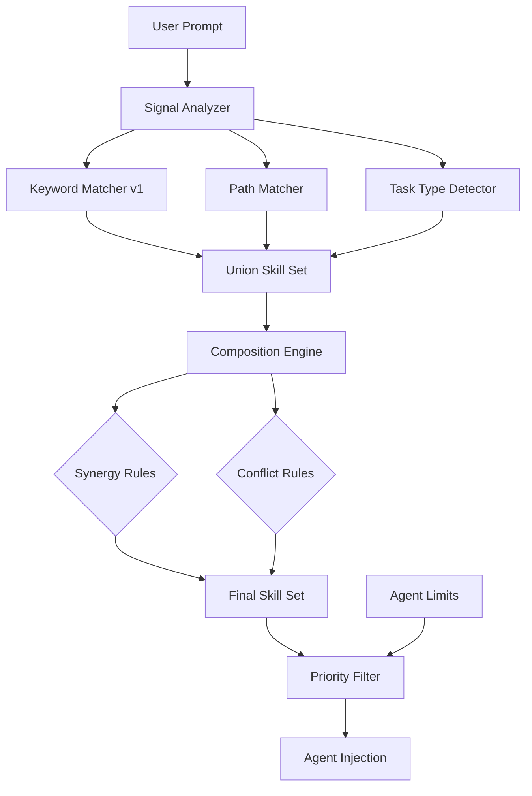

<!--
status: draft
priority: medium
research_confidence: medium
sources_count: 4
depends_on: []
enables: [SPEC-007, SPEC-014]
created: 2026-03-08
updated: 2026-03-08
-->

# SPEC-005: Agent Skill Enrichment v2

## 0. Research Summary

| # | Source | Key Insight | Relevance |
|---|--------|------------|-----------|
| 1 | `skill-matching.md` | 11 keyword-to-skill mappings, max 3 per builder, partial match | Baseline v1 behavior to preserve |
| 2 | `context-management.md` | Agent-specific limits (builder=5, reviewer=4), base skills free, precedence rules | Contradicts skill-matching.md max=3; needs standardization |
| 3 | `context-rules.json` | 9 path-based rules mapping file globs to skill contexts; includes `bun-best-practices` for test/hook paths | Path signals unused by keyword matcher; integration opportunity |
| 4 | Agent frontmatter (builder, reviewer, architect, error-analyzer, planner) | Each agent declares default skills in YAML frontmatter; builder has 4 default skills | Frontmatter skills are auto-loaded, not counted against limits |

**Confidence: Medium.** Keyword matching is well-understood. Skill composition (synergy/conflict detection) in multi-agent orchestration is novel territory without established literature. The composition matrix proposed here is manually curated and should evolve via trace analysis (SPEC-011) once available.

**Gaps:** No empirical data on which skill combinations improve task success rates. The synergy/conflict rules are based on domain reasoning, not measurement. SPEC-003 (Trace Analytics) and SPEC-011 (Pattern Learning) will eventually provide the data to validate and refine these rules.

---

## 1. Vision

### Press Release

> **Poneglyph agents now receive perfectly-tailored skill combinations based on deep task analysis, not just keyword matching.**
>
> Previously, the Lead Orchestrator matched skills to agents using a simple keyword table -- "jwt" maps to `security-review`, "endpoint" maps to `api-design`. This worked for obvious cases but missed nuances: it could not detect that an API endpoint handling authentication benefits from both `api-design` AND `security-review` loaded together, it ignored file path signals entirely, and it had inconsistent limits across documentation.
>
> With Skill Enrichment v2, the orchestrator performs multi-signal task analysis combining keywords, file paths, task type, and complexity score. A composition engine then applies synergy rules to ensure complementary skills load together, while conflict rules prevent redundant overlaps. The result: agents receive the right skills in the right combination every time.

### Background

The v1 skill-matching system in `skill-matching.md` provides 11 keyword-to-skill mappings with simple partial matching. It works for straightforward cases but has structural limitations:

| Limitation | Impact |
|-----------|--------|
| Keywords only -- no path analysis | Misses context from file locations (e.g., editing `auth/` files should trigger `security-review` even without explicit keywords) |
| No composition awareness | Skills loaded independently; no detection of synergistic or conflicting combinations |
| Inconsistent limits | `skill-matching.md` says builder max=3; `context-management.md` says builder max=5 |
| Missing skill mappings | `bun-best-practices` present in `context-rules.json` but absent from keyword table |
| No task-type awareness | "fix a bug" and "create a feature" get same skill treatment despite different needs |
| Static rules | Same matching regardless of past success/failure; no learning path (deferred to SPEC-011) |

### Target Metrics

| Metric | Target | How Measured |
|--------|--------|-------------|
| Skill relevance score | >85% | Percentage of loaded skills actually used by agent (measured via trace analysis when SPEC-003 available) |
| Redundant skill loads | 0 | No conflicting skill pairs loaded simultaneously |
| Backward compatibility | 100% | All v1 keyword matches still produce same results |
| Coverage of 24 skills | 100% reachable | Every skill reachable via at least one signal (keyword, path, or task type) |

---

## 2. Goals & Non-Goals

### Goals

| # | Goal | Rationale |
|---|------|-----------|
| G1 | Deeper matching beyond keywords: task structure analysis (verb detection, path signals, complexity) | Keywords miss contextual signals available from file paths and task type |
| G2 | Skill composition rules: synergy pairs auto-loaded together, conflict pairs prevented | Independent skill loading misses combinatorial value |
| G3 | Runtime skill injection based on discovered context (scout output, file paths in task) | Skills should adapt to what the agent discovers mid-task, not just initial prompt |
| G4 | Resolve max skill inconsistency: standardize all agent limits in one source of truth | Two documents disagree (3 vs 5 for builder); causes unpredictable behavior |
| G5 | Integrate path-based rules from `context-rules.json` with keyword matching | Path signals already defined but unused by the skill matcher |
| G6 | Add `bun-best-practices` to keyword table | Present in path rules and agent frontmatter but unreachable via keywords |
| G7 | Add missing skills to keyword table: `diagnostic-patterns`, `performance-review`, `lsp-operations`, `code-quality`, `anti-hallucination` | 13 of 24 skills have no keyword mapping; some are base-only but others should be matchable |

### Non-Goals

| # | Non-Goal | Reason |
|---|----------|--------|
| NG1 | ML/embedding-based semantic matching | Overkill for 24 skills; adds latency from model calls; keyword + path + task-type covers the space |
| NG2 | Dynamic skill creation at runtime | That is SPEC-014 (Skill Synthesis); this spec only improves selection of existing skills |
| NG3 | User-facing skill picker UI | Project has no UI (archived); orchestration is pure CLI/agent |
| NG4 | Automatic skill deprecation/retirement | Scope creep; skills are manually maintained |
| NG5 | Cross-project skill sharing | Out of scope; this is single-project orchestration |

---

## 3. Alternatives Considered

| # | Alternative | Pros | Cons | Verdict |
|---|-------------|------|------|---------|
| 1 | **Embeddings-based semantic matching** -- encode prompts and skill descriptions as vectors, match by cosine similarity | High accuracy; handles synonyms and paraphrasing naturally | Requires model call per match (latency 200-500ms); overkill for 24 skills; adds external dependency | **Rejected** -- latency cost not justified for small skill catalog |
| 2 | **Rule-based composition matrix** -- manually define synergy/conflict pairs, combine with extended keyword + path matching | Predictable; zero latency; easy to audit and modify; aligns with existing rule-based architecture | Manual maintenance; may miss non-obvious combinations; does not learn | **Adopted** -- fits project philosophy (rules > ML), maintainable at current scale |
| 3 | **LLM decides skills per task** -- prompt the LLM with task description and full skill catalog, let it pick | Smart; handles edge cases; adapts to novel prompts | Expensive (extra LLM call per delegation); non-deterministic; hard to audit | **Rejected** -- cost contradicts SPEC-007 goals; non-determinism conflicts with predictable orchestration |
| 4 | **Extend keyword table only** -- add missing keywords and skills to existing table, fix limits | Simplest change; backward compatible; minimal risk | Does not solve composition; does not integrate paths; does not handle task types | **Rejected** -- necessary but insufficient; included as subset of adopted approach |

---

## 4. Design

### Architecture Overview



### Step-by-Step Flow

| Step | Component | Input | Output | Description |
|------|-----------|-------|--------|-------------|
| 1 | Signal Analyzer | User prompt, file paths (if mentioned) | Keywords, paths, task signals | Extracts all signals from the task context |
| 2 | Keyword Matcher | Keywords | Candidate skills (set A) | v1 behavior preserved: partial match against extended keyword table |
| 3 | Path Matcher | File paths | Candidate skills (set B) | Matches paths against `context-rules.json` glob patterns |
| 4 | Task Type Detector | Action verbs | Candidate skills (set C) | Maps task verbs to preferred skill sets |
| 5 | Union | Sets A, B, C | Combined candidate set | Deduplicated union of all matched skills |
| 6 | Composition Engine | Combined set | Enriched set | Adds synergy partners, removes conflict losers |
| 7 | Priority Filter | Enriched set, agent type | Final skill set | Limits to agent max budget using precedence rules |
| 8 | Agent Injection | Final skill set | Agent prompt enrichment | Skills passed to agent via Task prompt or Skill() tool |

### Extended Keyword Table (v2)

| Keywords | Skill | New in v2 |
|----------|-------|-----------|
| auth, jwt, password, security, token, session | `security-review` | |
| database, sql, drizzle, migration, query, orm, transaction | `database-patterns` | |
| test, mock, tdd, coverage, unit, integration, fixture | `testing-strategy` | |
| api, endpoint, route, rest, openapi, swagger, pagination | `api-design` | |
| typescript, async, promise, generic, interface | `typescript-patterns` | |
| websocket, realtime, ws, streaming, socket | `websocket-patterns` | |
| refactor, extract, SOLID, clean, simplify | `refactoring-patterns` | |
| log, logging, trace, debug, observability | `logging-strategy` | |
| error, retry, circuit, fallback, recovery | `retry-patterns` | |
| config, env, validation, settings | `config-validator` | |
| best practice, pattern, expert, compare, industry standard, owasp, clean code, architecture, design pattern | `expert-patterns` | |
| bun, elysia, runtime, bunfig, bun:test, bun:sqlite | `bun-best-practices` | Yes |
| diagnose, root cause, stack trace, failure analysis | `diagnostic-patterns` | Yes |
| performance, latency, optimize, benchmark, profiling, memory | `performance-review` | Yes |
| lsp, go to definition, find references, symbols, hover | `lsp-operations` | Yes |
| code smell, complexity, duplication, maintainability | `code-quality` | Yes |
| hallucination, verify, confirm, double check, assumption | `anti-hallucination` | Yes |

Skills intentionally NOT in keyword table (loaded only via base skills or path rules):

| Skill | Reason | How Loaded |
|-------|--------|------------|
| `code-style-enforcer` | Auto-loaded via builder frontmatter | Frontmatter |
| `recovery-strategies` | Auto-loaded via error-analyzer frontmatter | Frontmatter |
| `meta-create-agent` | Admin-only, triggered by explicit command | Manual |
| `meta-create-skill` | Admin-only, triggered by explicit command | Manual |
| `prompt-engineer` | Triggered by prompt scoring < 70, not keywords | Rule-based |
| `sync-claude` | Triggered by explicit sync command | Manual |
| `playwright-browser` | Auto-loaded via browser-qa agent frontmatter | Frontmatter |

### Task Type Detection

| Signal Verbs | Task Type | Preferred Skills |
|-------------|-----------|-----------------|
| create, add, implement, build, develop, write | `creation` | `api-design`, `typescript-patterns` |
| fix, bug, error, debug, broken, failing | `debugging` | `diagnostic-patterns`, `retry-patterns` |
| refactor, clean, extract, simplify, reorganize | `refactoring` | `refactoring-patterns`, `code-quality` |
| test, cover, verify, assert, mock | `testing` | `testing-strategy`, `bun-best-practices` |
| review, audit, check, validate, inspect | `review` | `code-quality`, `anti-hallucination` |
| optimize, performance, speed, latency, memory | `optimization` | `performance-review`, `typescript-patterns` |
| secure, harden, vulnerability, auth | `security` | `security-review`, `config-validator` |
| document, sync, update docs | `documentation` | `expert-patterns` |

Task type skills are added as candidates with lower priority than keyword/path matches. They serve as a fallback signal when keyword coverage is thin.

### Skill Composition Matrix

```typescript
interface CompositionRules {
  synergies: [string, string][]
  conflicts: [string, string][]
}

const COMPOSITION: CompositionRules = {
  synergies: [
    // When one is matched, the other gets a priority boost (not auto-loaded)
    ['api-design', 'security-review'],         // APIs handling user data need security
    ['api-design', 'typescript-patterns'],      // API routes benefit from strict typing
    ['database-patterns', 'testing-strategy'],  // DB code is critical, needs tests
    ['database-patterns', 'typescript-patterns'],// DB queries benefit from type safety
    ['security-review', 'config-validator'],    // Security config must be validated
    ['security-review', 'testing-strategy'],    // Auth code must be thoroughly tested
    ['typescript-patterns', 'code-quality'],    // TS patterns + quality = robust code
    ['refactoring-patterns', 'code-quality'],   // Refactoring guided by quality metrics
    ['refactoring-patterns', 'testing-strategy'],// Refactoring needs test safety net
    ['bun-best-practices', 'testing-strategy'], // Bun runtime + bun:test patterns
    ['diagnostic-patterns', 'retry-patterns'],  // Diagnosis informs retry strategy
    ['diagnostic-patterns', 'recovery-strategies'],// Diagnosis informs recovery
    ['logging-strategy', 'diagnostic-patterns'],// Logs are primary diagnostic input
  ],

  conflicts: [
    // When both matched, keep the more specific one
    ['expert-patterns', 'code-quality'],        // Overlap in review guidance; keep code-quality for reviews, expert-patterns for architecture
    ['expert-patterns', 'refactoring-patterns'],// Overlap in structural advice; keep refactoring-patterns for refactoring tasks
  ]
}
```

**Synergy behavior:** When skill A is in the candidate set and skill B is its synergy partner, B gets a +1 priority boost in the priority filter. This makes synergy partners more likely to survive the budget cut, but does NOT force them in if budget is exhausted.

**Conflict behavior:** When both skills in a conflict pair are candidates, the one with fewer keyword matches in the current prompt is dropped. On tie, the more domain-specific skill wins (defined by the task type).

### Standardized Agent Limits (Single Source of Truth)

| Agent | Base Skills (free, always loaded) | Max Additional Skills | Total Max Context |
|-------|----------------------------------|----------------------|-------------------|
| builder | (none -- frontmatter skills count as additional) | 5 | 5 |
| reviewer | code-quality, testing-strategy, anti-hallucination | 2 | 5 (3 base + 2) |
| architect | (none) | 4 | 4 |
| error-analyzer | retry-patterns | 2 | 3 (1 base + 2) |
| planner | (none) | 2 | 2 |
| scout | (none) | 1 | 1 |
| security-auditor | security-review | 2 | 3 (1 base + 2) |

**Clarification on frontmatter skills:** Skills declared in agent frontmatter YAML are auto-loaded by Claude Code infrastructure. They are considered part of the agent's "additional" budget, not "free base." The base skills listed above are skills that the Lead Orchestrator always injects regardless of task context. This resolves the v1 inconsistency: builder has max 5 total (matching `context-management.md`), and the old max=3 in `skill-matching.md` is superseded.

**Frontmatter interaction:** Builder's frontmatter declares `typescript-patterns`, `bun-best-practices`, `code-style-enforcer`, `testing-strategy` (4 skills). This leaves room for 1 additional task-specific skill from the enrichment system. If the task requires more, the Lead should mention the skill in the prompt text rather than loading it formally.

### Path Matching Integration

The existing `context-rules.json` provides 9 path-based rules. Integration:

```typescript
interface PathRule {
  name: string
  paths: string[]        // Glob patterns
  keywords?: string[]    // Optional additional keywords
  contexts: string[]     // Skills to load when path matches
}
```

When the user prompt or task context includes file paths (e.g., "modify `src/auth/login.ts`"), the enrichment system:

1. Extracts file paths from the prompt
2. Matches against `context-rules.json` path globs
3. Adds matched `contexts` as candidate skills (set B)
4. These candidates enter the same composition/priority pipeline as keyword matches

Path matches have equal priority to keyword matches. If a skill appears in both keyword and path results, its priority score increases (dual-signal confirmation).

### Priority Scoring Algorithm

```
For each candidate skill:
  score = 0
  + 2 per keyword match in user prompt
  + 2 per path rule match
  + 1 per task-type match
  + 1 per synergy partner already in candidate set
  - 3 if in conflict with higher-scored candidate

Sort by score descending.
Take top N per agent budget.
```

### Edge Cases

| Edge Case | Handling |
|-----------|---------|
| No keywords, no paths, no task type detected | Fall back to agent's frontmatter skills only; no additional enrichment |
| More candidates than agent budget | Priority scoring selects top N; synergy boost helps complementary skills survive |
| Conflict pair with equal scores | Keep the one matching more specific task type; if still tied, keep the one appearing first in keyword table |
| Path matches skill already in frontmatter | No duplication; skill counted once |
| Scout discovers new paths mid-task | Lead can trigger re-enrichment for subsequent builder delegation; not automatic |
| All 5 builder slots taken by frontmatter | No room for enrichment; Lead must decide which frontmatter skill to deprioritize via prompt |

### Dependencies

| Dependency | Type | Status |
|------------|------|--------|
| `skill-matching.md` | Modified (extended keyword table, updated limits) | Exists, to be updated |
| `context-management.md` | Modified (standardized limits, add composition section) | Exists, to be updated |
| `context-rules.json` | Read-only (path rules consumed by enrichment) | Exists, no changes needed |
| Agent frontmatter files | Read-only (skill declarations consumed by enrichment) | Exist, no changes needed |
| SPEC-001 (Path-Specific Rules) | Optional enhancement | Draft; path matching works without it but improves with it |
| SPEC-003 (Trace Analytics) | Optional for metrics | Draft; relevance scoring deferred until traces available |

### Stack Alignment

This spec modifies orchestration rules and configuration files only. No runtime code changes required (the Lead Orchestrator interprets the rules). All changes are to markdown and JSON files within `.claude/`.

---

## 5. FAQ

| # | Question | Answer |
|---|----------|--------|
| 1 | Is this backward compatible with v1 keyword matching? | Yes. The extended keyword table is a superset of v1. All existing keyword-to-skill mappings are preserved. New signals (paths, task type, composition) add to the candidate set but never remove v1 matches. |
| 2 | What happens if composition rules add too many skills? | The priority filter enforces agent budget limits. Synergy skills get a priority boost but are not force-loaded. If budget is full, they are dropped like any other candidate. |
| 3 | Does composition add latency to task delegation? | No. Composition is a simple rule lookup in the Lead's prompt processing, not an LLM call. The composition matrix is a static data structure evaluated in O(n^2) where n is the small candidate set (typically 2-5 skills). |
| 4 | How do frontmatter skills interact with enrichment limits? | Frontmatter skills are auto-loaded by infrastructure and count toward the agent's total budget. The enrichment system fills remaining slots. For builder (budget=5, frontmatter=4), there is 1 enrichment slot. |
| 5 | What if v1 said max=3 and a downstream agent expects that limit? | No downstream agent enforces the limit programmatically. The limit is advisory for the Lead Orchestrator. Standardizing to 5 for builder is safe because it matches `context-management.md` which was already the authoritative source. |
| 6 | Does skill loading order matter? | Potentially. Skills loaded earlier in the prompt may receive more attention from the LLM. However, this is an LLM attention pattern, not a system constraint. The enrichment system does not prescribe loading order. SPEC-008 (Agent Attention Mechanisms) may address this. |
| 7 | Why not use the LLM to pick skills? | Cost and determinism. Each LLM call costs tokens and adds latency. For 24 skills, rule-based matching is sufficient and predictable. If the catalog grows to 100+ skills, this decision should be revisited. |
| 8 | How are synergy/conflict rules maintained? | Manually, in the composition matrix. SPEC-011 (Pattern Learning) will eventually suggest new rules based on trace data. Until then, the rules are curated by the project owner. |

---

## 6. Acceptance Criteria (BDD)

### Scenario 1: Backward-compatible keyword matching

```gherkin
Given the user prompt contains "implement endpoint with JWT validation"
When the Lead Orchestrator runs skill enrichment
Then the matched skills include "api-design" (keyword: endpoint)
And the matched skills include "security-review" (keyword: jwt)
And the behavior is identical to v1 for these keywords
```

### Scenario 2: Synergy skills receive priority boost

```gherkin
Given the keyword matcher returns "api-design" as a candidate
And "security-review" is a synergy partner of "api-design"
And "security-review" is also a candidate from keyword "password"
When the priority filter runs
Then "security-review" has a higher score than a non-synergy candidate with equal keyword matches
```

### Scenario 3: Conflict skills not loaded together

```gherkin
Given the candidate set contains both "expert-patterns" and "code-quality"
And these are a declared conflict pair
When the composition engine processes the candidates
Then only one of the pair remains in the final set
And the retained skill is the one with higher priority score
```

### Scenario 4: Agent limits respected

```gherkin
Given the enrichment system produces 7 candidate skills for a builder agent
And the builder's max additional skills budget is 5
When the priority filter applies
Then exactly 5 skills are passed to the builder
And they are the top 5 by priority score
```

### Scenario 5: Path and keyword matching combined

```gherkin
Given the user prompt mentions file "src/auth/login.ts"
And "src/auth/**" matches the "auth-security" path rule in context-rules.json
And the keyword "login" does not match any keyword in the table
When the enrichment system runs
Then "security-review" is a candidate (from path rule)
And "typescript-patterns" is a candidate (from path rule)
Even though no keyword in the prompt triggered these skills
```

### Scenario 6: bun-best-practices reachable via keywords

```gherkin
Given the user prompt contains "optimize bun:test performance"
When the keyword matcher runs
Then "bun-best-practices" is matched (keyword: bun, bun:test)
And "testing-strategy" is matched (keyword: test)
And "performance-review" is matched (keyword: performance, optimize)
```

### Scenario 7: Task type provides fallback skills

```gherkin
Given the user prompt is "fix the broken authentication"
And keyword matching returns "security-review" (keyword: authentication)
And task type detection identifies "debugging" (verb: fix, adjective: broken)
When the enrichment system runs
Then "diagnostic-patterns" is a candidate (from task type: debugging)
And "security-review" is a candidate (from keyword)
And "diagnostic-patterns" has lower priority than "security-review"
```

### Scenario 8: No signals produces no enrichment

```gherkin
Given the user prompt is "do the thing"
And no keywords match the table
And no file paths are mentioned
And no task type is detectable
When the enrichment system runs
Then no additional skills are loaded
And the agent uses only its frontmatter defaults
```

### Scenario 9: Dual-signal confirmation boosts priority

```gherkin
Given the user prompt contains "add endpoint" (keyword match: api-design)
And the prompt mentions file "src/routes/users.ts" (path match: api-design)
When the priority scorer runs
Then "api-design" has score 4 (2 keyword + 2 path)
And a skill matched by keyword only has score 2
```

### Scenario 10: All 24 skills are reachable

```gherkin
Given the complete list of 24 skills in the system
When checking reachability through any signal (keyword table, path rules, task type, frontmatter, manual trigger)
Then every skill has at least one path to being loaded
And no skill is orphaned from the enrichment system
```

---

## 7. Open Questions

| # | Question | Impact | Proposed Resolution | Blocked By |
|---|----------|--------|-----------------------|------------|
| OQ1 | Should synergy rules be manually maintained or learned from traces? | Determines long-term maintenance burden | Manual for v2; automated learning deferred to SPEC-011 (Pattern Learning from Traces) | SPEC-011 |
| OQ2 | Does skill loading order affect agent behavior? | If first-loaded skills get more LLM attention, order matters | Needs empirical testing; SPEC-008 (Agent Attention Mechanisms) may address | SPEC-008 |
| OQ3 | What is the right metric for "skill relevance"? | Needed to validate the >85% target | Proposed: measure via traces whether loaded skills correspond to patterns actually used in agent output; requires SPEC-003 | SPEC-003 |
| OQ4 | Should the composition engine run on every delegation or be cached per task? | Performance vs accuracy tradeoff | Run per delegation; the cost is negligible (static rule lookup) and task context may differ between delegations | None |
| OQ5 | How to handle builder's frontmatter consuming 4 of 5 slots? | Limits enrichment to 1 skill for the most common agent | Options: (a) increase builder budget to 6, (b) make some frontmatter skills conditional, (c) accept the constraint and rely on prompt mentions | Needs owner decision |
| OQ6 | Should `context-rules.json` be extended with composition rules or kept separate? | Single file vs separation of concerns | Keep separate; `context-rules.json` is path-to-skill mapping, composition rules are skill-to-skill relationships | None |

---

## 8. Sources

| # | Source | Path | Used For |
|---|--------|------|----------|
| S1 | Skill Matching Rule | `.claude/rules/skill-matching.md` | v1 keyword table, matching process, agent limits, enrichment methods |
| S2 | Context Management Rule | `.claude/rules/context-management.md` | Agent skill limits, precedence rules, anti-patterns |
| S3 | Context Rules Config | `.claude/context-rules.json` | Path-based rules (9 entries), path-to-skill mappings |
| S4 | Agent Frontmatter | `.claude/agents/{builder,reviewer,architect,error-analyzer,planner}.md` | Default skills per agent, model selection, permission modes |
| S5 | INDEX Registry | `.specs/INDEX.md` | Dependency graph: SPEC-005 enables SPEC-007 and SPEC-014 |
| S6 | Agent Selection Rule | `.claude/rules/agent-selection.md` | Multi-agent patterns, agent routing by signal |

---

## 9. Next Steps

### Implementation Checklist

| # | Task | File(s) | Effort | Dependencies |
|---|------|---------|--------|-------------|
| 1 | Extend keyword table with 6 new skill mappings (bun-best-practices, diagnostic-patterns, performance-review, lsp-operations, code-quality, anti-hallucination) | `skill-matching.md` | Small | None |
| 2 | Standardize agent limits: update skill-matching.md to match context-management.md (builder=5); add note that frontmatter skills count toward budget | `skill-matching.md`, `context-management.md` | Small | None |
| 3 | Add task-type detection section to skill-matching.md (verb-to-task-type table with preferred skills) | `skill-matching.md` | Medium | Task 1 |
| 4 | Add composition rules section to skill-matching.md or new file (`skill-composition.md`): synergy pairs, conflict pairs, priority scoring algorithm | `skill-matching.md` or new `skill-composition.md` | Medium | Task 1 |
| 5 | Document path matching integration: how Lead combines `context-rules.json` path matches with keyword matches | `skill-matching.md`, `context-management.md` | Small | Task 1 |
| 6 | Add reachability audit: table showing how each of the 24 skills is reachable (keyword, path, frontmatter, manual) | `skill-matching.md` | Small | Task 1 |
| 7 | Update `context-management.md` to reference composition rules and mark itself as the single source of truth for limits | `context-management.md` | Small | Task 2 |
| 8 | Validate with test scenarios: run through BDD acceptance criteria manually by simulating prompts and checking expected skill sets | Manual | Medium | Tasks 1-5 |
| 9 | Update INDEX.md status from `draft` to `approved` (after review) then `in_progress` | `.specs/INDEX.md` | Trivial | Review pass |

### Post-Implementation Validation

- Verify all 10 BDD scenarios pass via manual walkthrough
- Confirm no agent receives more skills than its budget
- Confirm all 24 skills appear in the reachability audit
- Run `bun test ./.claude/hooks/` to ensure no hook regressions

### Future Work (Out of Scope)

| Enhancement | Target Spec | When |
|-------------|-------------|------|
| Trace-based synergy discovery | SPEC-011 | After SPEC-003 implemented |
| Skill relevance measurement | SPEC-003 + SPEC-010 | After trace analytics available |
| Dynamic skill creation from patterns | SPEC-014 | After SPEC-005 + SPEC-011 |
| Cost-aware skill loading (prefer cheaper combinations) | SPEC-007 | After SPEC-005 implemented |
