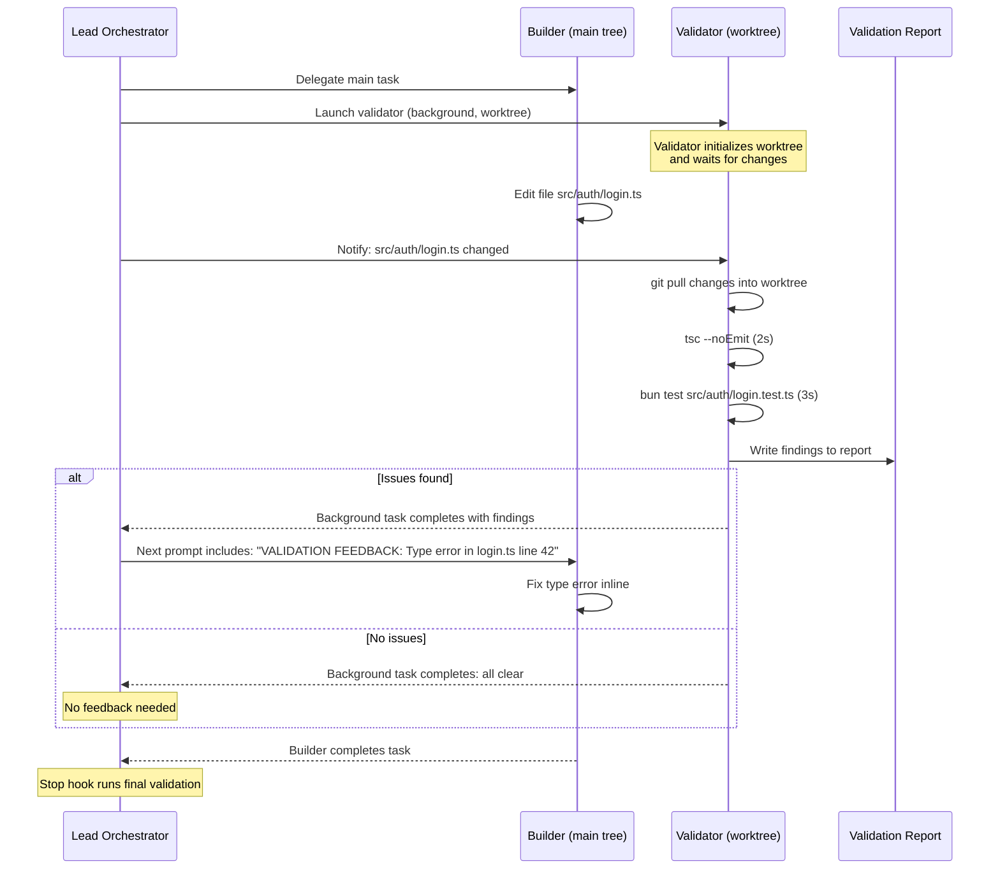
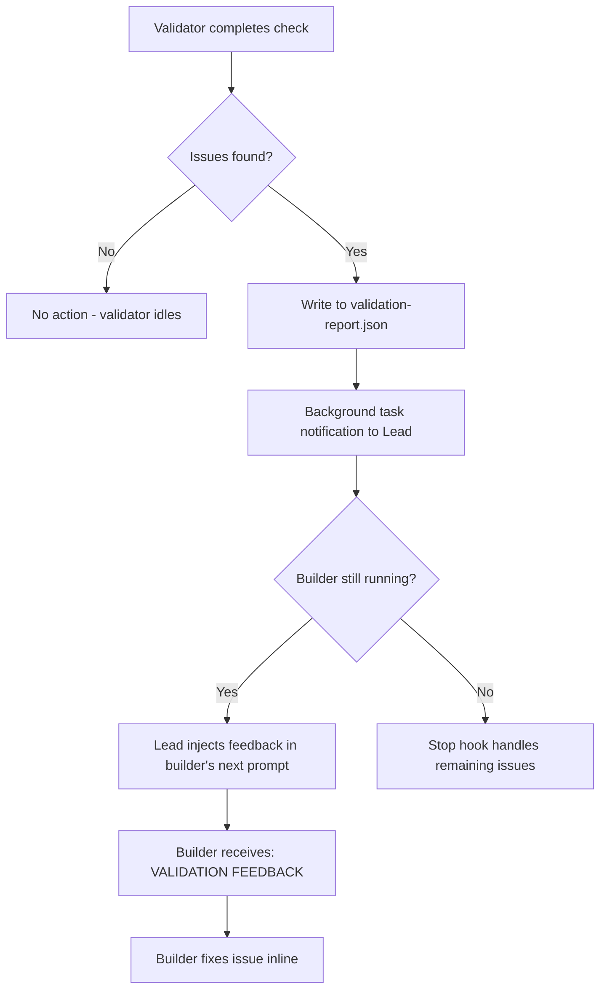

<!--
status: draft
priority: medium
research_confidence: medium
sources_count: 4
depends_on: [SPEC-002]
enables: [SPEC-013]
created: 2026-03-08
updated: 2026-03-08
-->

# SPEC-006: Continuous Validation

## 0. Research Summary

### Fuentes Consultadas

| Tipo | Fuente | Relevancia |
|------|--------|------------|
| Code | `validate-tests-pass.ts` Stop hook | Primary: current post-hoc validation logic, runs `bun test` after builder completes, parses failure counts against baselines |
| Code | Lead Orchestrator rules (`lead-orchestrator.md`, `error-recovery.md`) | Defines current retry budget, escalation flow, and builder feedback mechanisms |
| Pattern | CI/CD continuous testing (GitHub Actions, CircleCI parallel jobs) | Industry practice: run validation checks in parallel with build steps, fail-fast on type errors before full test suite |
| Pattern | IDE background validation (TypeScript Language Server, ESLint watch mode) | Real-time feedback loops: type errors surfaced within seconds of file save, not after full compilation |

### Decisiones Informadas por Research

| Decision | Basada en |
|----------|-----------|
| Use existing agents with `run_in_background=true` instead of new agent type | Lead Orchestrator already supports background agents; adding a new agent type increases complexity without benefit |
| Require `isolation: "worktree"` for validator agents | SPEC-002 provides worktree isolation; validator must not interfere with builder's working tree (reading intermediate states, file locks) |
| Trigger validation per-file-write, not continuous file watching | Claude Code has no file watcher API; tool call completion is the natural trigger point; Lead can observe builder progress via background agent coordination |
| Use shared validation report file for feedback loop | Simpler than inter-agent messaging; Lead polls background agent completion and reads report; works within existing Task tool constraints |

### Informacion No Encontrada

- Claude Code does not expose a mechanism for inter-agent real-time messaging (agents cannot push data to each other mid-execution)
- No API exists for the Lead to inject feedback into a running builder agent (feedback must wait for the builder's next prompt cycle)
- Background agent completion notification timing is not documented (Lead receives notification when `run_in_background` task finishes, but latency is unknown)

### Confidence Assessment

| Area | Nivel | Razon |
|------|-------|-------|
| Background agent launching | High | `run_in_background=true` is documented and tested in Lead Orchestrator rules |
| Worktree isolation for validator | High | SPEC-002 defines worktree isolation; Claude Code supports `isolation: "worktree"` |
| Feedback loop to active builder | Medium | Lead can include validation results in subsequent builder prompts, but cannot interrupt a running builder; feedback is asynchronous |
| Performance overhead of parallel validation | Medium | Running `tsc --noEmit` and `bun test` in a worktree adds CPU/IO load; acceptable on modern machines but untested at scale with 4+ concurrent agents |
| Trigger mechanism (per-file vs batched) | Low | No native hook exists to observe builder tool calls in real-time; Lead must coordinate manually or use polling; optimal strategy unclear |

---

## 1. Vision

### Press Release

**Poneglyph now validates builder output continuously in background, catching type errors, test failures, and lint issues within seconds of code changes rather than after the builder completes its entire task.**

Developers using Claude Code Poneglyph no longer wait until the builder finishes an entire multi-file implementation to discover that a type error was introduced in the first file edit. A background validation agent runs in a separate git worktree, checking each changed file for type correctness, test regressions, and lint violations as the builder works. When issues are found, the Lead Orchestrator feeds the validation results back to the builder in its next prompt cycle, enabling course correction mid-task.

### Background

The current validation model in Poneglyph is **post-hoc**: the Stop hook `validate-tests-pass.ts` runs `bun test` after the builder agent completes. This approach has several limitations:

| Limitation | Impact |
|------------|--------|
| Errors discovered only after builder finishes | Builder may have built 5+ files on top of a type error introduced in file 1 |
| No incremental feedback | Builder cannot self-correct during implementation |
| Retry cycles are expensive | When Stop hook blocks, the entire builder task must be re-attempted with error-analyzer diagnosis |
| No separation of concerns | The Stop hook validates everything at once (all tests), even when only 1 file changed |

Continuous validation addresses these gaps by running checks **in parallel** with the builder, surfacing issues early enough to prevent cascading errors.

### Target Metrics

| Metric | Current | Target |
|--------|---------|--------|
| Time to detect type error after introduction | ~5-15 min (after builder completes) | <30 seconds |
| Builder retry cycles due to type errors | ~2-3 retries per complex task | 50% reduction (catch and fix inline) |
| Test failures caught before Stop hook | 0% (all caught by Stop hook) | >70% of regressions caught by validator |
| Builder tasks blocked by Stop hook | ~30% of multi-file tasks | <15% (most issues resolved inline) |

---

## 2. Goals & Non-Goals

### Goals

| # | Goal | Rationale |
|---|------|-----------|
| G1 | Background type-checking after each file write | Type errors are the fastest to detect (~2s) and most common source of cascading failures |
| G2 | Background test runner on affected test files | Test regressions caught early prevent building on broken foundations |
| G3 | Lint validation on changed files | Catch style violations and import errors before they accumulate |
| G4 | Error feedback loop to active builder | Validator findings must reach the builder to enable inline correction |
| G5 | Complexity-gated activation | Only activate for multi-file tasks (complexity >30); single-file tasks use existing Stop hook |
| G6 | Worktree-isolated validation | Validator runs in its own worktree to avoid interfering with builder's working tree |

### Non-Goals

| # | Non-Goal | Reason |
|---|----------|--------|
| NG1 | New agent type for validation | Reuse existing builder/reviewer agents with `run_in_background=true`; adding a new agent type is unnecessary complexity |
| NG2 | Real-time file watching (inotify/FSEvents) | Claude Code has no file watcher API; trigger on builder tool call completions instead |
| NG3 | Replacing the Stop hook (`validate-tests-pass.ts`) | The Stop hook remains as the final gate; continuous validation is an early-warning system, not a replacement |
| NG4 | Full test suite execution on every change | Only run affected tests (test files that import the changed module); full suite runs at Stop hook |
| NG5 | Blocking the builder on validation results | Validation is advisory; builder continues working while validator checks; feedback is asynchronous |
| NG6 | Cross-repository validation | Single-repo scope for v1.5 |

---

## 3. Alternatives Considered

| # | Alternative | Pros | Cons | Verdict |
|---|-------------|------|------|---------|
| 1 | **Enhanced Stop hook with incremental checks** | Minimal architecture change; reuse existing hook infrastructure | Still post-hoc; runs only after builder completes; does not provide inline feedback; cannot parallelize with builder execution | Rejected |
| 2 | **Pre-edit hooks that validate before each file write** | Catches errors before they happen; prevents invalid states | Blocks builder execution on every edit; adds 2-5s latency per file write; would dramatically slow multi-file tasks; hooks cannot currently intercept individual Edit tool calls | Rejected |
| 3 | **Background agent in worktree with async feedback** | Non-blocking; isolated from builder's working tree; leverages existing `run_in_background` and `isolation: "worktree"` infrastructure; feedback via Lead prompt injection | Requires SPEC-002 (worktree isolation); feedback is asynchronous (cannot interrupt running builder); coordination complexity for Lead | **Adopted** |
| 4 | **External CI service (GitHub Actions, local Jenkins)** | Full isolation; rich validation tooling; parallel runners | Overkill for local development; adds network latency; requires CI configuration; breaks the "pure orchestration" model of Poneglyph | Rejected |
| 5 | **TypeScript Language Server (tsserver) integration** | Real-time type checking; incremental compilation; mature tooling | No API in Claude Code to run tsserver; would require custom process management; LSP protocol overhead; fragile integration | Rejected |

**Decision**: Alternative 3 leverages existing `run_in_background=true` and `isolation: "worktree"` (SPEC-002). No new infrastructure needed — the validator is a builder running validation commands in a worktree, with results fed back through normal Lead coordination.

---

## 4. Design

### 4.1 Validation Pipeline Overview



### 4.2 Activation Criteria

The Lead Orchestrator decides whether to launch a validator based on task complexity and scope.

| Criterion | Activate Validator | Rationale |
|-----------|-------------------|-----------|
| Complexity score >30 | Yes | Multi-domain tasks benefit from early error detection |
| Multi-file task (3+ files) | Yes | Cascading errors more likely across files |
| Single-file, complexity <30 | No | Stop hook is sufficient; validator overhead not justified |
| Experimental/risky task (planner flag) | Yes | Early feedback critical for uncertain work |
| Task involves type-heavy refactoring | Yes | Type errors are the primary risk |

Decision rule for the Lead:

```
IF complexity > 30 OR file_count >= 3 OR task.risky == true:
    launch_validator = true
ELSE:
    launch_validator = false  # rely on Stop hook
```

### 4.3 Validation Checks (Ordered by Speed)

| # | Check | Command | Time | Trigger | Severity |
|---|-------|---------|------|---------|----------|
| 1 | TypeScript type-check | `tsc --noEmit --pretty` | ~2-5s | Any `.ts` file change | Error |
| 2 | Import validation | `grep` for unresolved imports | <1s | Any `.ts` file change | Error |
| 3 | Affected test execution | `bun test <affected-test-file>` | ~2-5s | Any source file change | Error |
| 4 | Lint validation | Existing lint hooks or `biome check` | <1s | Any file change | Warning |

The validator runs checks in this order (fastest first) and short-circuits on the first Error-severity failure to minimize latency.

### 4.4 Feedback Loop Mechanism

The feedback loop is the core innovation of this spec. It operates asynchronously through the Lead.



#### Feedback Injection Template

When the Lead receives validation findings, it includes them in the builder's next prompt:

```
VALIDATION FEEDBACK (from background validator):
- [ERROR] TypeScript: src/auth/login.ts:42 — Property 'token' does not exist on type 'Session'
- [ERROR] Test failure: src/auth/login.test.ts — "should validate JWT" assertion failed
- [WARNING] Lint: src/auth/login.ts:15 — Unused import 'Response'

Please address these issues as part of your current implementation.
```

### 4.5 Worktree Synchronization

The validator runs in a separate worktree (per SPEC-002). It needs to see the builder's changes to validate them.

| Approach | Mechanism | Trade-offs |
|----------|-----------|------------|
| **Git-based sync** | Builder commits/stages changes; validator pulls from shared repo | Clean but requires builder to commit intermediate states (unusual) |
| **File copy sync** | Lead copies changed files from main tree to validator worktree | Simple; no git overhead; files may be in inconsistent state |
| **Shared branch** | Builder and validator on same branch, different worktrees | Git worktrees can share branches but risk lock conflicts |
| **Lead-mediated sync** | Lead tells validator which files changed; validator reads from main tree path | No sync needed; validator accesses main tree files directly for read-only checks | **Adopted** |

**Adopted approach**: The validator does not need its own copy of the changed files for type-checking. Instead, the Lead passes the list of changed file paths to the validator. The validator runs `tsc --noEmit` in the main project directory (read-only) from its worktree context, or the Lead provides file contents directly in the validator prompt. For test execution, the validator runs tests in its worktree after the Lead copies the affected files.

### 4.6 Edge Cases

| Edge Case | Handling |
|-----------|----------|
| Builder finishes before validator completes | Validator results are still useful for the Stop hook; Lead can include them in any error-analyzer diagnosis if Stop hook fails |
| Validator finds issue in code builder has already changed again | Stale finding; Lead discards if the file has been modified since the validator started checking |
| Multiple rapid changes (builder edits 3 files in quick succession) | Batch validation: validator waits for a brief settling period (~2s) before running checks on all changed files at once |
| Validator itself crashes or times out | Non-fatal; Lead logs warning and relies on Stop hook as fallback; does not block builder |
| Builder and validator read same file simultaneously | Read-only access from validator side; no conflict risk; worktree isolation prevents write conflicts |
| No tests exist for the changed file | Validator skips test execution for that file; reports "no tests found" as informational |
| Type-check fails due to unresolved dependency (builder hasn't created the file yet) | Expected during multi-file tasks; validator marks as "pending" rather than "error"; re-checks after next file write |

### 4.7 Lead Orchestrator Integration

New section to add to `lead-orchestrator.md`:

```markdown
## Continuous Validation

| Condition | Launch Validator |
|-----------|-----------------|
| Complexity >30 | Yes |
| 3+ files in task | Yes |
| Experimental/risky task | Yes |
| Simple single-file task | No (Stop hook sufficient) |

When launching a validator:
1. Launch builder: `Task(builder, prompt, run_in_background=false)`
2. Launch validator: `Task(builder, validation_prompt, run_in_background=true, isolation="worktree")`
3. When validator completes with findings, include in builder's next prompt as VALIDATION FEEDBACK
4. When builder completes, Stop hook runs final validation as normal
```

### 4.8 Dependencies

| Dependency | Type | Status | Notes |
|------------|------|--------|-------|
| SPEC-002 (Git Worktree Isolation) | Architecture | Draft | Validator needs worktree to avoid interfering with builder |
| `tsc` CLI available in project | Runtime | Optional | TypeScript projects only; skip if no `tsconfig.json` |
| `bun test` runner | Runtime | Available | Core testing infrastructure already present |
| `validate-tests-pass.ts` Stop hook | Code | Implemented | Remains as final validation gate; not replaced |
| `run_in_background` Task parameter | Platform | Available | Claude Code built-in |
| `isolation: "worktree"` Task parameter | Platform | Available | Claude Code built-in |

### 4.9 Stack Alignment

| Component | Technology | Notes |
|-----------|-----------|-------|
| Validator agent | Existing builder agent (reused) | No new agent type needed |
| Validation execution | `tsc`, `bun test`, `biome check` | Standard project tooling |
| Report format | JSON (in-memory or file) | Lightweight, parseable by Lead |
| Worktree isolation | `git worktree` via SPEC-002 | Platform-provided |
| Feedback delivery | Lead prompt injection | Works within existing Task tool model |

### 4.10 Concerns

| Concern | Mitigation |
|---------|------------|
| CPU overhead from parallel validation | Validator checks are lightweight (~2-5s each); modern machines handle 2 concurrent processes easily; cap at 1 validator per builder |
| Token cost of validator agent | Validator prompt is small (~200 tokens); output is structured and brief; minimal cost compared to builder |
| Feedback latency (validator completes after builder moves on) | Acceptable trade-off; even late feedback prevents Stop hook retry cycles; stale findings are discarded |
| Complexity of Lead coordination | New rules are additive (5 lines in `lead-orchestrator.md`); no changes to existing flows |

---

## 5. FAQ

| # | Question | Answer |
|---|----------|--------|
| Q1 | What is the performance impact of running a validator in parallel? | Minimal. The validator runs `tsc --noEmit` (~2-5s) and targeted `bun test` (~2-5s) in a background worktree. On a modern machine with 8+ cores, this adds negligible overhead. The validator is capped at 1 per builder to prevent resource contention. |
| Q2 | What if the validator is slower than the builder? | The validator's results inform the _next_ iteration, not the current one. If the builder finishes before the validator, the findings are still valuable: they can prevent a Stop hook failure (the Lead pre-emptively addresses issues) or inform the error-analyzer diagnosis if the Stop hook does fail. |
| Q3 | How does validation feedback reach the builder? | The Lead injects it into the builder's prompt. When the validator background task completes with findings, the Lead includes a `VALIDATION FEEDBACK` section in the builder's next tool response or re-delegation prompt. The builder sees it as additional context and can address the issues inline. |
| Q4 | Does this replace the Stop hook? | No. The Stop hook (`validate-tests-pass.ts`) remains as the final validation gate. Continuous validation is an early-warning system that catches issues sooner, reducing the likelihood of Stop hook failures. Both systems complement each other. |
| Q5 | What happens for projects without TypeScript or tests? | The validator gracefully skips inapplicable checks. If no `tsconfig.json` exists, type-checking is skipped. If no test files are found for a changed source file, test execution is skipped. The validator reports what it could check and notes what was skipped. |
| Q6 | Can the validator cause false positives during multi-file tasks? | Yes, temporarily. If the builder creates a type in file A and uses it in file B, the validator may report a type error when file B is written but file A has not been synced to the worktree yet. The validator handles this by marking such errors as "pending" and rechecking after subsequent file changes. Persistent errors (still present after 2+ file writes) are escalated. |
| Q7 | How much does the validator agent cost in tokens? | The validator prompt is ~200 tokens. Its output is structured and brief (~100-300 tokens per check cycle). Total cost per validation cycle is ~500-1000 tokens, which is <5% of a typical builder task. The savings from prevented retry cycles far outweigh this cost. |
| Q8 | Can validation run for tasks with complexity <30? | The Lead can opt to run validation for any task, but the default threshold is complexity >30 or 3+ files. For simple single-file tasks, the Stop hook provides sufficient coverage without the overhead of a background agent. |

---

## 6. Acceptance Criteria (BDD)

### Scenario 1: Validator launches for multi-file tasks

```gherkin
Feature: Continuous validation for complex tasks

  Scenario: Lead launches validator when complexity exceeds threshold
    Given the Lead receives a task with complexity score 45
    And the task involves 4 files
    When the Lead delegates to the builder
    Then the Lead also launches a validator agent with run_in_background=true
    And the validator runs with isolation: "worktree"
    And the validator does not block the builder's execution
```

### Scenario 2: Type error detected within 30 seconds

```gherkin
  Scenario: Validator catches type error shortly after file write
    Given a validator agent is running in background
    And the builder writes a file with a type error
    When the validator runs tsc --noEmit on the changed file
    Then the type error is detected within 30 seconds of the file write
    And the validator reports the error with file, line, and message
```

### Scenario 3: Test failure reported to Lead

```gherkin
  Scenario: Validator detects test regression
    Given a validator agent is running in background
    And the builder modifies src/services/user.ts
    And src/services/user.test.ts exists
    When the validator runs bun test src/services/user.test.ts
    And a test fails
    Then the validator reports the failure to the Lead
    And the report includes the test name and assertion that failed
```

### Scenario 4: Builder receives validation feedback

```gherkin
  Scenario: Lead injects validation feedback into builder prompt
    Given the validator completed with 1 type error finding
    And the builder is still working on the task
    When the Lead prepares the builder's next prompt
    Then the prompt includes a VALIDATION FEEDBACK section
    And the section contains the type error details
    And the builder addresses the issue in its next implementation step
```

### Scenario 5: Validator does not block builder

```gherkin
  Scenario: Builder continues while validator runs
    Given the Lead launched both builder and validator
    And the validator is running tsc --noEmit (takes 3 seconds)
    When the builder writes its next file during those 3 seconds
    Then the builder is not blocked or slowed by the validator
    And both agents operate independently
```

### Scenario 6: Simple tasks skip continuous validation

```gherkin
  Scenario: Single-file simple task does not launch validator
    Given the Lead receives a task with complexity score 20
    And the task involves 1 file
    When the Lead delegates to the builder
    Then no validator agent is launched
    And the Stop hook validate-tests-pass.ts handles validation after completion
```

### Scenario 7: Validator cleanup after builder completes

```gherkin
  Scenario: Validator worktree is cleaned up when builder finishes
    Given a validator agent is running in a worktree
    And the builder completes its task
    When the Lead processes the builder's completion
    Then the validator's worktree is cleaned up per SPEC-002 cleanup policy
    And no orphaned worktrees remain
```

### Scenario 8: Validator crash does not affect builder

```gherkin
  Scenario: Validator failure is non-fatal
    Given a validator agent is running in background
    And the validator crashes due to an unexpected error
    When the Lead receives the validator's failure notification
    Then the builder continues working unaffected
    And the Lead logs a warning about the validator failure
    And the Stop hook provides final validation as fallback
```

### Scenario 9: Stale findings are discarded

```gherkin
  Scenario: Validator findings for already-changed files are ignored
    Given the validator reports a type error in src/auth/login.ts
    And the builder has since modified src/auth/login.ts again
    When the Lead receives the validator's findings
    Then the Lead discards the stale finding for src/auth/login.ts
    And does not include it in the builder's feedback
```

---

## 7. Open Questions

| # | Question | Impact | Proposed Answer |
|---|----------|--------|-----------------|
| OQ1 | What is the optimal trigger mechanism for the validator? | Determines how quickly validation starts after a file change. Options: (a) Lead notifies validator per-file-write, (b) validator polls on interval, (c) Lead re-launches validator per batch of changes. | Start with option (c): Lead launches a new validator check after each batch of builder file writes (natural pause points). Polling adds complexity; per-file is too granular. |
| OQ2 | How should the worktree be synced with the builder's changes? | Validator needs to see the builder's latest code to validate it. Main tree changes are not in the worktree by default. | Lead passes changed file contents in the validator's prompt, or validator reads directly from the main tree path. Avoid git-based sync for intermediate states. |
| OQ3 | Should validation be batched (wait for N files) or per-file? | Per-file means more validation cycles but faster feedback. Batched means fewer cycles but delayed detection. | Batch with a settling window of ~2 seconds. If the builder writes multiple files in quick succession, validate them together. If there is a natural pause (>2s between writes), trigger immediately. |
| OQ4 | What is the maximum number of concurrent validator agents? | Resource contention with multiple validators running simultaneously. | Cap at 1 validator per builder. If 2 builders run in parallel, each gets at most 1 validator (total 2 validators). |
| OQ5 | Should the validator run the full `tsc` project check or only check individual files? | Full project `tsc --noEmit` catches cross-file type errors but is slower. Individual file checks miss dependency issues. | Start with full project `tsc --noEmit` (typically 2-5s for medium projects). If too slow (>10s), switch to incremental checking with `--incremental`. |
| OQ6 | How should "pending" errors (expected during multi-file creation) be distinguished from real errors? | During multi-file tasks, temporary type errors are expected (e.g., importing a type that will be created in the next file). Reporting these creates noise. | Track a "seen" counter per error. Errors seen in only 1 validation cycle are marked "pending". Errors persisting across 2+ cycles are escalated as real errors. |
| OQ7 | Should the validation report be a file on disk or in-memory via agent output? | File on disk persists for debugging but adds I/O. In-memory via agent output is simpler but lost if session crashes. | Use agent output (the validator's final message is the report). The Lead parses it directly. For debugging, traces (SPEC-003) capture the validator's output. |

---

## 8. Sources

| # | Source | Tipo | Ubicacion | Used In |
|---|--------|------|-----------|---------|
| S1 | SPEC-002: Git Worktree Isolation | Spec | `.specs/v1.1/SPEC-002-git-worktree-isolation.md` | Section 0, 4.5, 4.9 (worktree isolation for validator) |
| S2 | `validate-tests-pass.ts` Stop hook | Code | `.claude/hooks/validators/stop/validate-tests-pass.ts` | Section 0, 1, 2 (current post-hoc validation baseline) |
| S3 | Lead Orchestrator rules | Code | `.claude/rules/lead-orchestrator.md` | Section 0, 4.7 (background agent launching, feedback injection) |
| S4 | Error Recovery rules | Code | `.claude/rules/error-recovery.md` | Section 0 (retry budget, escalation flow affected by early detection) |

---

## 9. Next Steps

### Implementation Checklist

| # | Task | File(s) | Complexity | Depends On |
|---|------|---------|------------|------------|
| 1 | Add continuous validation activation rules to `lead-orchestrator.md` | `.claude/rules/lead-orchestrator.md` | Low | -- |
| 2 | Define validator prompt template in `agent_docs/` | `.claude/agent_docs/validator-prompt.md` | Low | -- |
| 3 | Add validation feedback injection pattern to Lead rules | `.claude/rules/lead-orchestrator.md` | Medium | Step 1 |
| 4 | Define `ValidationReport` interface in shared types | `.claude/hooks/validators/types.ts` | Low | -- |
| 5 | Implement settling-window logic for batched validation triggers | `.claude/rules/lead-orchestrator.md` | Medium | Step 1 |
| 6 | Add stale-finding detection rules (discard findings for re-modified files) | `.claude/rules/lead-orchestrator.md` | Low | Step 3 |
| 7 | Update `complexity-routing.md` with validator activation threshold | `.claude/rules/complexity-routing.md` | Low | Step 1 |
| 8 | Write integration test: validator catches type error in multi-file task | `.claude/hooks/continuous-validation.test.ts` | Medium | Steps 1-4 |
| 9 | Update `error-recovery.md` with validator-informed retry strategy | `.claude/rules/error-recovery.md` | Low | Step 3 |
| 10 | Add validator metrics to trace logger for SPEC-003 integration | `.claude/hooks/validators/stop/trace-logger.ts` | Low | SPEC-003 |

### Rollout Plan

| Phase | Scope | Validation | Risk |
|-------|-------|------------|------|
| Phase 1 | Add activation rules and prompt template (Steps 1-2, 7) | Manual testing: verify Lead launches validator for complexity >30 tasks | Low — additive rules only |
| Phase 2 | Implement feedback loop and stale detection (Steps 3, 5, 6) | Manual testing: verify builder receives VALIDATION FEEDBACK in prompt | Medium — new coordination pattern |
| Phase 3 | Integration tests and error recovery update (Steps 4, 8, 9) | Automated `bun test`; verify type error is caught before Stop hook | Medium — end-to-end validation |
| Phase 4 | Trace integration (Step 10) | Verify validator events appear in trace logs | Low — depends on SPEC-003 |

### Success Criteria

| Criterion | Measurement |
|-----------|-------------|
| Validator launches for qualifying tasks | 5 tasks with complexity >30 all trigger validator |
| Type error caught before Stop hook | Deliberate type error in multi-file task detected before builder completes |
| Builder retry cycles reduced | Compare retry rates before/after over 20 multi-file tasks |
| Validator crash does not block builder | Kill validator mid-execution; builder completes normally |
