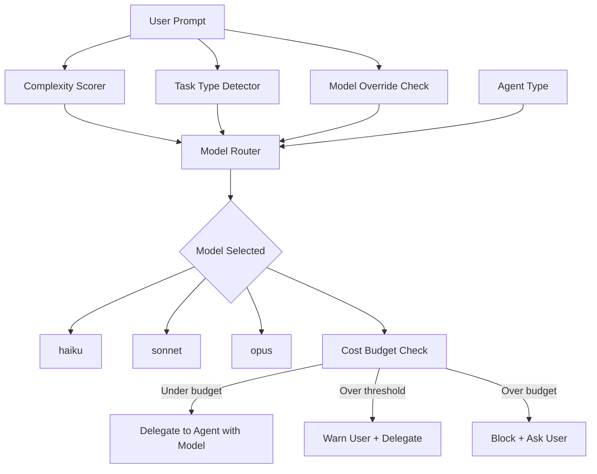

<!--
status: draft
priority: high
research_confidence: medium
sources_count: 5
depends_on: [SPEC-005]
enables: [SPEC-015]
created: 2026-03-08
updated: 2026-03-08
-->

# SPEC-007: Cost Optimization Engine

## 0. Research Summary

### Sources Consulted

| # | Source | Key Insight | Relevance |
|---|--------|-------------|-----------|
| 1 | Claude API pricing (claude.ai/pricing) | Opus $15/$75, Sonnet $3/$15, Haiku $0.25/$1.25 per 1M tokens (input/output) — 60x cost difference between opus and haiku output | Primary: defines the optimization space |
| 2 | `complexity-routing.md` | 5-factor formula scoring tasks 4-60, routing to builder (<30) or planner (30-60/>=60). Formula bug: max score is 60 with current multiplier (factor × 0.20 × 20), making the ">60" threshold unreachable | Primary: the routing mechanism this spec extends with model awareness |
| 3 | Agent frontmatter (builder, scout, planner, reviewer, architect, error-analyzer) | Current model defaults: builder=opus, scout=sonnet, planner=opus, reviewer=sonnet. No cost-awareness — all builders use opus regardless of task complexity | Primary: current model allocation to override |
| 4 | SPEC-003 (Trace Analytics) | Will provide per-session cost data (tokens, model, costUsd) — enables measuring actual cost savings after routing is implemented | Dependency: validates optimization impact |
| 5 | SPEC-005 (Agent Skill Enrichment v2) | Enriches task classification with multi-signal analysis (keywords, paths, task type, complexity) — provides better input signals for model routing decisions | Dependency: better classification = better routing |

### Confidence Assessment

| Area | Level | Reason |
|------|-------|--------|
| Cost savings potential | High | Pricing is public; routing 70% of tasks to sonnet/haiku saves 40-60% mathematically |
| Formula fix | High | Simple arithmetic: changing multiplier from 20 to 33.33 scales range to 100 |
| Model-task mapping | Medium | Optimal mapping requires empirical data from SPEC-003 traces; initial matrix is based on model capability reasoning |
| Quality degradation per model | Medium | Sonnet handles standard coding well (confirmed by scout/reviewer defaults already using it); haiku boundary needs validation |
| Budget system design | High | Simple threshold alerting; well-understood pattern |

### Gaps

- No empirical data on quality difference between opus and sonnet for builder tasks at various complexity levels. Current agent defaults (scout=sonnet, reviewer=sonnet) suggest sonnet is already trusted for non-trivial work, but builder tasks may differ.
- Haiku's effectiveness boundary is unclear — simple fixes and formatting are safe, but the threshold for "too complex for haiku" needs validation via SPEC-003 traces.
- Claude Code's model selection mechanism is controlled via agent frontmatter `model:` field. Dynamic per-task model override requires the Lead to specify model in the Task delegation, which may or may not be respected by the infrastructure.

---

## 1. Vision

### Press Release

> **Poneglyph reduces orchestration costs by 40-60% by routing tasks to the right model: opus for architecture and complex logic, sonnet for standard implementation, haiku for simple fixes and exploration.**
>
> Previously, every builder task used opus regardless of complexity — a one-line typo fix consumed the same expensive model as a multi-file architectural change. With the Cost Optimization Engine, the Lead Orchestrator now selects the optimal model based on task complexity, agent type, and task classification. Scout agents use haiku for read-only exploration. Standard builder tasks use sonnet. Only complex planning, architecture, and high-complexity implementation retain opus.
>
> The system also fixes a long-standing formula bug where the complexity score could never exceed 60, making the "planner obligatorio" threshold unreachable. With the corrected formula scaling to 100, all three routing tiers now function as designed.

### Background

The current orchestration system has no cost awareness. Every agent uses the model declared in its frontmatter — builders always use opus ($75/M output tokens), even for trivial tasks. Meanwhile, scout and reviewer already demonstrate that sonnet ($15/M output tokens) handles substantial work effectively. The 5x-60x cost difference between models represents a significant optimization opportunity.

Additionally, the complexity routing formula has a mathematical bug. The formula `score = Σ (factor_value × peso × 20)` produces a maximum of `5 × 3 × 0.20 × 20 = 60`, which means the ">60 planner obligatorio" threshold is unreachable. This spec fixes the formula to scale correctly to 100.

### Target Metrics

| Metric | Target | How Measured |
|--------|--------|--------------|
| Cost reduction | 40-60% vs all-opus baseline | SPEC-003 traces: compare actual cost vs hypothetical all-opus cost |
| Quality degradation | <5% increase in error-analyzer invocations | SPEC-003 traces: error rate before/after model routing |
| Model selection latency | <10ms | Rule-based lookup, no LLM call needed |
| Formula max score | 100 | Mathematical verification: 5 × 3 × 0.20 × 33.33 ≈ 100 |
| Budget alert accuracy | 100% alerts when threshold crossed | Manual verification of alertAt percentage |

---

## 2. Goals & Non-Goals

### Goals

| # | Goal | Rationale |
|---|------|-----------|
| G1 | Model routing rules based on complexity score + task type + agent type | Route cheaper models to simpler tasks; preserve opus for tasks that need best reasoning |
| G2 | Fix complexity formula to scale 0-100 | Current formula maxes at 60, making the ">60" routing tier unreachable |
| G3 | Agent-specific model defaults with override conditions | Each agent type has a default model, overridden by complexity/task-type signals |
| G4 | Cost tracking integration with SPEC-003 | Leverage trace analytics to measure actual savings and validate routing decisions |
| G5 | Cost budget awareness with threshold warnings | Allow setting daily/weekly spending limits with alerts at configurable percentages |
| G6 | Manual model override capability | User can force a specific model via prompt keywords ("use opus", "use haiku") |
| G7 | Update `complexity-routing.md` with corrected formula and model routing section | Single source of truth for complexity scoring and routing decisions |

### Non-Goals

| # | Non-Goal | Reason |
|---|----------|--------|
| NG1 | Fine-tuning or training custom models | Out of scope; we use Anthropic's models as-is |
| NG2 | Multi-provider routing (OpenAI, Google, etc.) | Single-provider system; Claude models only |
| NG3 | Real-time pricing API integration | Pricing is stable enough for hardcoded values; update manually when pricing changes |
| NG4 | Automatic model fallback on failure | If a model fails, error-analyzer handles it; auto-switching models adds unpredictable behavior |
| NG5 | Per-token billing reconciliation | SPEC-003's estimation (~±20%) is sufficient for optimization; exact billing uses console.anthropic.com |
| NG6 | Dynamic pricing adjustment based on usage volume | No volume discounts in API pricing; unnecessary complexity |
| NG7 | Cost optimization of skill loading or context size | Separate concern (context management); this spec focuses on model selection |

---

## 3. Alternatives Considered

| # | Alternative | Pros | Cons | Verdict |
|---|-------------|------|------|---------|
| 1 | **Always use cheapest model (haiku for everything)** | Maximum cost savings (~95% reduction) | Severe quality loss on complex tasks; planning and architecture would degrade significantly; defeats the purpose of having opus available | **Rejected** — quality loss unacceptable for complex tasks |
| 2 | **User selects model per task** | Full control; no wrong routing | Cognitive overhead on every task; interrupts flow; user must understand model capabilities; defeats automation goal | **Rejected** — manual selection contradicts orchestration philosophy |
| 3 | **Complexity-based auto-routing with agent awareness** | Balances cost and quality; leverages existing complexity scoring; no user intervention; different agents get appropriate models | Requires empirical validation of model-task boundaries; initial thresholds are estimated | **Adopted** — best balance of automation, cost savings, and quality preservation |
| 4 | **A/B testing models per task** | Generates empirical data on model quality per task type | Doubles cost during testing period; single-user system makes statistical significance hard to achieve; delays savings | **Rejected** — too expensive for single user; can validate incrementally via SPEC-003 traces instead |
| 5 | **Cost-weighted complexity routing** | Factors cost into complexity score itself | Conflates two concerns (task difficulty vs economic cost); makes complexity score harder to interpret | **Rejected** — cleaner to keep complexity as a task property and model selection as a separate routing layer |

---

## 4. Design

### Architecture Overview



### Fixed Complexity Formula

**Problem**: Current formula `score = Σ (factor_value × peso × 20)` yields max = `5 × 3 × 0.20 × 20 = 60`.

**Fix**: Change multiplier from 20 to 33.33 so max = `5 × 3 × 0.20 × 33.33 ≈ 100`.

```
score = Σ (factor_value × weight × 33.33)
```

| Factor | Weight | Low (1) | Medium (2) | High (3) |
|--------|--------|---------|------------|----------|
| Files | 20% | 1-2 | 3-5 | 6+ |
| Domains | 20% | 1 | 2-3 | 4+ |
| Dependencies | 20% | 0-1 | 2-3 | 4+ |
| Security | 20% | None | Data | Auth/Crypto |
| Integrations | 20% | 0-1 | 2-3 | 4+ |

**Score examples with fixed formula:**

| Scenario | Files | Domains | Deps | Security | Integrations | Score |
|----------|-------|---------|------|----------|-------------|-------|
| Simple fix (1 file, 1 domain) | 1 (6.67) | 1 (6.67) | 1 (6.67) | 1 (6.67) | 1 (6.67) | **33** |
| Medium task (3 files, 2 domains) | 2 (13.33) | 2 (13.33) | 1 (6.67) | 1 (6.67) | 1 (6.67) | **47** |
| Complex feature (6+ files, auth, 4+ deps) | 3 (20.0) | 3 (20.0) | 3 (20.0) | 3 (20.0) | 3 (20.0) | **100** |
| Typo fix (1 file, no deps) | 1 (6.67) | 1 (6.67) | 1 (6.67) | 1 (6.67) | 1 (6.67) | **33** |
| OAuth implementation | 3 (20.0) | 3 (20.0) | 3 (20.0) | 3 (20.0) | 3 (20.0) | **100** |

**Updated routing thresholds** (unchanged semantics, now all reachable):

| Score | Routing | Model Influence |
|-------|---------|----------------|
| **< 30** | Builder direct | Favors haiku/sonnet |
| **30-60** | Planner optional | Favors sonnet |
| **> 60** | Planner mandatory | Requires opus |

### Model Routing Matrix

| Complexity | Task Type | Model | Rationale |
|-----------|-----------|-------|-----------|
| < 20 | Any | haiku | Simple fixes, formatting, typos — haiku handles these adequately |
| 20-40 | Implementation | sonnet | Standard coding tasks within sonnet's capability |
| 20-40 | Review / Security | sonnet | Code review and basic security audit |
| 20-40 | Debugging | sonnet | Standard bug fixes with clear error messages |
| 40-60 | Implementation | opus | Complex multi-file changes need best reasoning |
| 40-60 | Architecture | opus | Design decisions require deep analysis |
| 40-60 | Security | opus | Security-critical code needs thorough reasoning |
| > 60 | Any | opus | Highest complexity always gets best model |

### Agent-Specific Defaults

| Agent | Default Model | Override Condition | Rationale |
|-------|--------------|-------------------|-----------|
| builder | sonnet | complexity > 40 → opus | Most builder tasks are standard implementation; opus reserved for complex logic |
| reviewer | sonnet | security audit → opus | Reviews are pattern-matching tasks; security needs deeper analysis |
| planner | opus | never (always opus) | Planning requires best reasoning to decompose correctly |
| scout | haiku | never (always haiku) | Read-only exploration; haiku handles search/read efficiently |
| error-analyzer | sonnet | persistent errors (2+ retries) → opus | Standard diagnosis in sonnet; escalate to opus for stubborn issues |
| architect | opus | never (always opus) | Architecture decisions need best reasoning capabilities |
| security-auditor | opus | never (always opus) | Security audit requires thorough, careful reasoning |
| refactor-agent | sonnet | complexity > 40 → opus | Simple refactors in sonnet; complex structural changes in opus |
| code-quality | sonnet | never (always sonnet) | Code smell detection is pattern-matching, sonnet-appropriate |
| test-watcher | sonnet | never (always sonnet) | Test gap analysis is structural, not reasoning-heavy |
| task-decomposer | opus | never (always opus) | Decomposition requires deep understanding |
| knowledge-sync | haiku | never (always haiku) | Documentation sync is mostly templated |
| bug-documenter | haiku | never (always haiku) | Bug documentation follows templates |
| merge-resolver | sonnet | complex conflicts → opus | Simple merge conflicts in sonnet; multi-way conflicts in opus |

### Cost Comparison (Per-Task Estimates)

Assuming average task generates ~2K input tokens and ~8K output tokens:

| Model | Input Cost | Output Cost | Total/Task | Relative |
|-------|-----------|-------------|------------|----------|
| opus | $0.030 | $0.600 | **$0.630** | 1.0x |
| sonnet | $0.006 | $0.120 | **$0.126** | 0.2x (5x cheaper) |
| haiku | $0.0005 | $0.010 | **$0.0105** | 0.017x (60x cheaper) |

### Projected Savings

Assuming 100 agent delegations/day with current all-opus distribution:

| Scenario | Distribution | Daily Cost | Savings |
|----------|-------------|------------|---------|
| **Current** (all opus) | 100% opus | $63.00 | — |
| **Optimized** | 15% haiku, 55% sonnet, 30% opus | $26.01 | **59%** |
| **Conservative** | 10% haiku, 40% sonnet, 50% opus | $37.05 | **41%** |

### Model Override Mechanism

Users can force a specific model via prompt keywords:

| User Prompt Contains | Effect |
|---------------------|--------|
| "use opus" / "con opus" | Force opus regardless of complexity |
| "use sonnet" / "con sonnet" | Force sonnet regardless of complexity |
| "use haiku" / "con haiku" | Force haiku regardless of complexity |
| "cheap" / "barato" / "fast" | Route to cheapest appropriate model (haiku if complexity < 40, else sonnet) |
| "best" / "mejor" / "careful" | Route to opus regardless of complexity |

Override is detected by the Lead Orchestrator before delegation and takes precedence over all routing rules.

### Cost Budget System

```typescript
interface CostBudget {
  daily: number       // e.g., $10/day
  weekly: number      // e.g., $50/week
  alertAt: number     // percentage threshold to warn (e.g., 0.80 = 80%)
}

interface CostTracker {
  currentDaily: number    // accumulated cost today
  currentWeekly: number   // accumulated cost this week
  lastReset: string       // ISO date of last daily reset
  weekStart: string       // ISO date of current week start
}
```

**Budget behavior:**

| Condition | Action |
|-----------|--------|
| Cost < alertAt% of budget | Normal operation |
| Cost >= alertAt% of budget | Warn user: "Approaching daily budget (83% used). Consider using cheaper models." |
| Cost >= 100% of budget | Block delegation + ask user: "Daily budget exceeded ($10.50/$10.00). Override and continue? Downgrade all tasks to sonnet?" |

**Budget configuration** stored in `.claude/config/cost-budget.json`:

```json
{
  "daily": 10.00,
  "weekly": 50.00,
  "alertAt": 0.80,
  "enabled": true
}
```

### Integration with SPEC-003 (Trace Analytics)

SPEC-003 provides the `costUsd` field in `TraceEntry`. The cost optimization engine uses this data for:

| Use Case | Data Source | Action |
|----------|-----------|--------|
| Measure actual savings | `byModel` aggregation from traces | Compare opus vs sonnet/haiku cost distribution |
| Validate routing quality | `byStatus` per model | Check if cheaper models produce more errors |
| Budget tracking | `byDay` cost totals | Accumulate daily/weekly costs for budget alerts |
| Threshold tuning | Complexity score + model + outcome correlation | Adjust complexity thresholds if quality degrades |

### Integration with SPEC-005 (Skill Enrichment v2)

SPEC-005 provides richer task classification (task type detection, path analysis, multi-signal matching). The cost optimization engine uses these signals for:

| Signal from SPEC-005 | Routing Influence |
|---------------------|------------------|
| Task type (creation, debugging, review, etc.) | Selects appropriate row in model routing matrix |
| Complexity factors (files, domains, deps) | Feeds into corrected complexity formula |
| Security signal detected | Bumps model to opus for security-sensitive tasks |
| Path signals (auth/, security/, etc.) | May elevate model if path indicates critical code |

### Edge Cases

| Edge Case | Handling |
|-----------|---------|
| Complexity score exactly 30 or 60 | Boundary inclusive: 30 = "planner optional" tier, 60 = "planner optional" tier. Only >60 triggers mandatory planner |
| User override + budget exceeded | Override takes precedence for model; budget warning still displayed |
| Model not available (API error) | Not handled by this spec; existing error-recovery handles API failures |
| Zero-complexity task (all factors Low) | Score = 33 (all factors at 1). Minimum meaningful score. Routes to sonnet builder |
| Agent with hardcoded model (planner=opus) | Agent defaults take precedence when they specify "always"; routing only overrides when conditions allow |
| Multiple agents in parallel with different models | Each agent delegation is independent; Lead selects model per-delegation |
| New model released by Anthropic | Update MODEL_PRICING table and routing matrix manually; no auto-discovery |

### Dependencies

| Dependency | Type | Status |
|------------|------|--------|
| `complexity-routing.md` | Modified (fix formula, add model routing section) | Exists |
| SPEC-003 (Trace Analytics) | Read (consume cost data for budget tracking and validation) | Draft |
| SPEC-005 (Skill Enrichment v2) | Read (consume task classification for routing decisions) | Draft |
| Agent frontmatter files | Modified (update `model:` field for agents getting new defaults) | Exist |
| `.claude/config/cost-budget.json` | Created (new configuration file) | New |

### Concerns

| Concern | Mitigation |
|---------|------------|
| **Quality degradation** | Conservative initial thresholds (opus for complexity >40); monitor via SPEC-003 error rates; easy to adjust thresholds upward |
| **Sonnet capability boundary** | Scout and reviewer already use sonnet successfully; builder tasks are structurally similar to reviewer analysis; start with sonnet for complexity 20-40 and validate |
| **Haiku capability boundary** | Limit haiku to complexity <20 (trivial tasks) and read-only agents (scout, knowledge-sync); haiku failure on non-trivial tasks would be caught by error-analyzer |
| **Budget system gaming** | Single-user system; no adversarial concern. Budget is advisory, not a hard security boundary |
| **Stale pricing** | Hardcoded pricing table updated manually when Anthropic changes prices. Add a comment with "last verified" date |
| **Formula change backward compatibility** | Old complexity scores in traces become incomparable. Add a `formulaVersion: 2` field to TraceEntry via SPEC-003 to distinguish |

### Stack Alignment

| Aspect | Decision | Aligned |
|--------|----------|---------|
| Configuration | JSON file for budget, markdown for routing rules | Yes — matches existing config patterns |
| Routing logic | Rule-based in Lead Orchestrator prompt interpretation | Yes — no runtime code; rules interpreted by LLM |
| Cost tracking | Leverages SPEC-003 trace data | Yes — no new data infrastructure |
| Model selection | Via agent frontmatter `model:` field or Task prompt override | Yes — uses existing Claude Code mechanisms |
| Formula fix | Update `complexity-routing.md` directly | Yes — single source of truth |

---

## 5. FAQ

| # | Question | Answer |
|---|----------|--------|
| 1 | Can the model be switched mid-session for a single agent? | No. Model is selected at delegation time via the `model:` field in agent frontmatter or specified in the Task prompt. Once an agent starts executing, it runs on the selected model. Different delegations within the same Lead session can use different models. |
| 2 | How accurate is the cost estimation? | Depends on SPEC-003's token estimation (~±20% via char-to-token ratio). For routing decisions, this accuracy is sufficient — we care about order-of-magnitude differences (opus vs sonnet), not exact cents. For budget tracking, the margin means the alert might trigger at 78% instead of 80%, which is acceptable. |
| 3 | What if sonnet produces lower quality code than opus for a builder task? | The error-analyzer will be invoked (existing flow). If a task fails twice on sonnet, the retry escalates to opus (see error recovery: "persistent errors → opus"). This self-correcting behavior means suboptimal routing is caught and fixed within the same session. |
| 4 | How does the user override work? | The Lead Orchestrator scans the user prompt for override keywords ("use opus", "best", "cheap", etc.) before running complexity scoring. If detected, the override model is used regardless of complexity score. The override applies to all delegations within that task. |
| 5 | Does changing the formula break existing traces? | Yes, old complexity scores used a 0-60 scale. New scores use 0-100. SPEC-003 traces should include a `formulaVersion` field. Old traces remain valid for their own analysis but should not be compared with new scores without normalization. |
| 6 | Why not use sonnet for planner? | Planning requires decomposing complex tasks into coherent subtasks with correct dependencies. This is a reasoning-intensive activity where opus's superior capabilities directly impact output quality. The cost of a single opus planner call (~$0.63) is offset by correctly routing 5-10 subsequent builder tasks to cheaper models. |
| 7 | Can haiku really handle builder tasks? | Only for trivial tasks (complexity <20): single-file typo fixes, formatting changes, simple variable renames. If the task involves any logic, sonnet is the minimum. Haiku's primary role is scout (read-only exploration) and template-based agents (knowledge-sync, bug-documenter). |
| 8 | What happens when Anthropic changes pricing? | Update the `MODEL_PRICING` constant in the routing rules and SPEC-003's cost calculation. The routing matrix thresholds should also be reviewed — if a cheaper model becomes more capable, thresholds can be adjusted downward. |

---

## 6. Acceptance Criteria (BDD)

### Scenario 1: Simple task routes to haiku

```gherkin
Given a user prompt "fix the typo in README.md"
And the complexity score is 13 (all factors Low except Files=1)
When the Lead Orchestrator selects a model for the builder
Then the selected model is "haiku"
Because the complexity score is below 20
```

### Scenario 2: Standard implementation routes to sonnet

```gherkin
Given a user prompt "add email validation to the user creation endpoint"
And the complexity score is 33 (Files=Medium, Security=Medium, rest Low)
When the Lead Orchestrator selects a model for the builder
Then the selected model is "sonnet"
Because the complexity score is between 20 and 40
And the task type is "implementation"
```

### Scenario 3: Complex task routes to opus

```gherkin
Given a user prompt "implement OAuth2 with Google and GitHub providers"
And the complexity score is 87 (Files=High, Domains=High, Deps=High, Security=High, Integrations=High)
When the Lead Orchestrator selects a model for the builder
Then the selected model is "opus"
Because the complexity score exceeds 60
```

### Scenario 4: Scout always uses haiku

```gherkin
Given the Lead Orchestrator needs to explore the codebase
When delegating to the scout agent
Then the scout agent uses "haiku"
Regardless of the task complexity score
Because scout is a read-only exploration agent
```

### Scenario 5: Planner always uses opus

```gherkin
Given a complex task requiring decomposition
When delegating to the planner agent
Then the planner agent uses "opus"
Regardless of the task complexity score
Because planning requires best reasoning capabilities
```

### Scenario 6: Cost budget warning at threshold

```gherkin
Given the daily budget is set to $10.00
And the alertAt threshold is 80%
And the accumulated daily cost is $8.50 (85%)
When the Lead Orchestrator is about to delegate a new task
Then a warning is displayed: "Approaching daily budget (85% used)"
And the delegation proceeds normally
```

### Scenario 7: Cost budget exceeded blocks delegation

```gherkin
Given the daily budget is set to $10.00
And the accumulated daily cost is $10.50
When the Lead Orchestrator is about to delegate a new task
Then the user is asked: "Daily budget exceeded ($10.50/$10.00). Override and continue?"
And the delegation is blocked until user responds
```

### Scenario 8: User overrides model selection

```gherkin
Given a user prompt "use opus to fix the typo in README.md"
And the complexity score is 13 (would normally route to haiku)
When the Lead Orchestrator detects the "use opus" override
Then the selected model is "opus"
And the complexity-based routing is bypassed
```

### Scenario 9: Fixed complexity formula reaches 100

```gherkin
Given a task with all factors at High (3)
When the complexity formula calculates the score
Then the result is approximately 100
Because score = 5 × (3 × 0.20 × 33.33) = 5 × 20.0 = 100
```

### Scenario 10: Fixed complexity formula makes >60 reachable

```gherkin
Given a task with 4 factors at High (3) and 1 at Medium (2)
When the complexity formula calculates the score
Then the result is approximately 93
And this score is > 60
And it triggers "planner mandatory" routing
```

### Scenario 11: Error escalation promotes model

```gherkin
Given a builder task initially routed to sonnet (complexity 35)
And the builder fails with an error
And the error-analyzer diagnoses the issue
And the builder fails again on retry with sonnet
When the Lead Orchestrator evaluates the third attempt
Then the model is escalated to opus
Because persistent errors (2+ retries) trigger model upgrade
```

### Scenario 12: Agent default model respected for "always" agents

```gherkin
Given the security-auditor agent has default model "opus" with override "never"
When delegating a security audit task with complexity score 25
Then the security-auditor uses "opus"
Because its "never override" rule takes precedence over complexity-based routing
```

---

## 7. Open Questions

| # | Question | Impact | Proposed Resolution | Blocked By |
|---|----------|--------|-----------------------|------------|
| OQ1 | How to measure quality degradation per model objectively? | Determines whether routing thresholds are correct | Use SPEC-003 traces: compare error-analyzer invocation rate per model. If sonnet-routed tasks trigger error-analyzer >10% more than opus-routed tasks at same complexity, raise the sonnet→opus threshold. | SPEC-003 implementation |
| OQ2 | Should model routing history influence future decisions? | Could auto-tune thresholds based on success rates | Deferred to SPEC-015 (Self-Optimizing Orchestration). Initial thresholds are static rules. | SPEC-015 |
| OQ3 | How does model selection integrate with Claude Code's Task mechanism? | Determines if model can be overridden per-delegation or only per-agent definition | Investigation needed: test whether including "model: sonnet" in the Task prompt overrides the agent's frontmatter model. If not, agent frontmatter must be updated. | Claude Code infrastructure |
| OQ4 | Should the budget system persist across sessions? | Affects whether daily budget resets correctly | Use a persistent JSON file (`~/.claude/cost-tracker.json`) updated by SPEC-003's trace logger. The Lead checks it at session start. | SPEC-003 |
| OQ5 | What is the minimum complexity score for a task? | Affects haiku routing — can any task score below 20? | With the fixed formula, all factors at Low (1) scores 33. To reach <20, we need to allow factor value 0 ("trivial") for some factors. Consider adding a "Trivial (0)" tier for single-factor tasks. | None — design decision |
| OQ6 | Should cached tokens affect model routing? | Cached input tokens are 90% cheaper; heavy-cache tasks could use opus more cheaply | Deferred — no cache signal available in SPEC-003. Revisit if Claude Code exposes cache metrics. | Claude Code API |

---

## 8. Sources

| # | Source | Path/URL | Used For |
|---|--------|----------|----------|
| S1 | Complexity Routing Rule | `.claude/rules/complexity-routing.md` | Current formula, routing thresholds, factor definitions |
| S2 | Claude API Pricing | claude.ai/pricing | Model costs: opus $15/$75, sonnet $3/$15, haiku $0.25/$1.25 per 1M tokens |
| S3 | SPEC-003 (Trace Analytics) | `.specs/v1.1/SPEC-003-trace-analytics.md` | Cost data schema (TraceEntry.costUsd, .model, .tokens), analytics queries |
| S4 | SPEC-005 (Skill Enrichment v2) | `.specs/v1.1/SPEC-005-agent-skill-enrichment-v2.md` | Task classification signals (task type, path matching, complexity factors) |
| S5 | Agent Frontmatter Files | `.claude/agents/{builder,scout,planner,reviewer,architect,error-analyzer}.md` | Current model defaults per agent |

---

## 9. Next Steps

### Implementation Checklist

| # | Task | File(s) | Effort | Dependencies |
|---|------|---------|--------|-------------|
| 1 | Fix complexity formula: change multiplier from 20 to 33.33, verify examples produce correct scores | `complexity-routing.md` | Small | None |
| 2 | Add model routing matrix section to `complexity-routing.md`: complexity × task-type → model table | `complexity-routing.md` | Small | Task 1 |
| 3 | Add agent-specific model defaults table to `complexity-routing.md` or new `model-routing.md` rule | `complexity-routing.md` or new rule | Small | Task 2 |
| 4 | Update agent frontmatter `model:` fields: builder→sonnet (default), scout→haiku, knowledge-sync→haiku, bug-documenter→haiku | Agent `.md` files | Small | Task 3 |
| 5 | Add model override detection to Lead Orchestrator rules: scan for "use opus/sonnet/haiku", "cheap", "best" keywords | `lead-orchestrator.md` | Small | Task 3 |
| 6 | Create cost budget configuration file with default values | `.claude/config/cost-budget.json` | Small | None |
| 7 | Add budget checking logic to Lead Orchestrator flow: load tracker, compare against budget, warn/block | `lead-orchestrator.md` | Medium | Task 6, SPEC-003 |
| 8 | Add `MODEL_PRICING` constant and cost estimation to model routing documentation | `complexity-routing.md` or `model-routing.md` | Small | Task 2 |
| 9 | Update SPEC-003 TraceEntry to include `formulaVersion` field for score comparability | SPEC-003 coordination | Small | SPEC-003 |
| 10 | Validate routing decisions: run through all BDD scenarios manually with example prompts | Manual | Medium | Tasks 1-5 |

### Post-Implementation Validation

- Verify fixed formula produces scores across full 0-100 range with realistic examples
- Confirm all 12 BDD scenarios pass via manual walkthrough
- Verify agent frontmatter updates do not break existing agent registration
- Run `bun test ./.claude/hooks/` to ensure no hook regressions from formula changes
- Compare estimated cost savings using real trace data (after SPEC-003 is implemented)

### Future Work (Out of Scope)

| Enhancement | Target Spec | When |
|-------------|-------------|------|
| Auto-tuning thresholds from trace data | SPEC-015 | After SPEC-003 + SPEC-007 implemented |
| Model quality scoring per task type | SPEC-010 | After SPEC-003 provides error rate data |
| Cross-session budget persistence | SPEC-003 | Integrate with trace logger |
| Cached token awareness for cost optimization | Future | When Claude Code exposes cache metrics |
| Multi-model sessions (different model per subtask) | SPEC-015 | Advanced orchestration feature |
