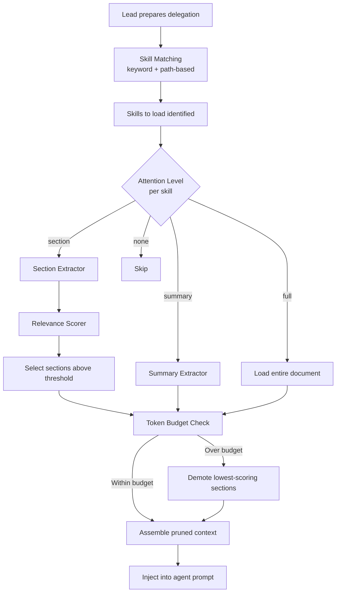
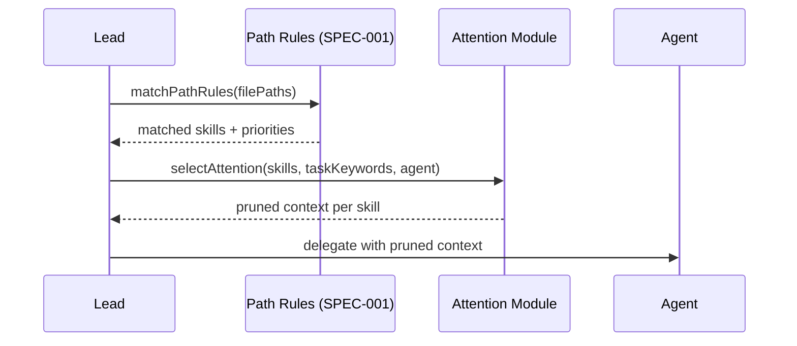
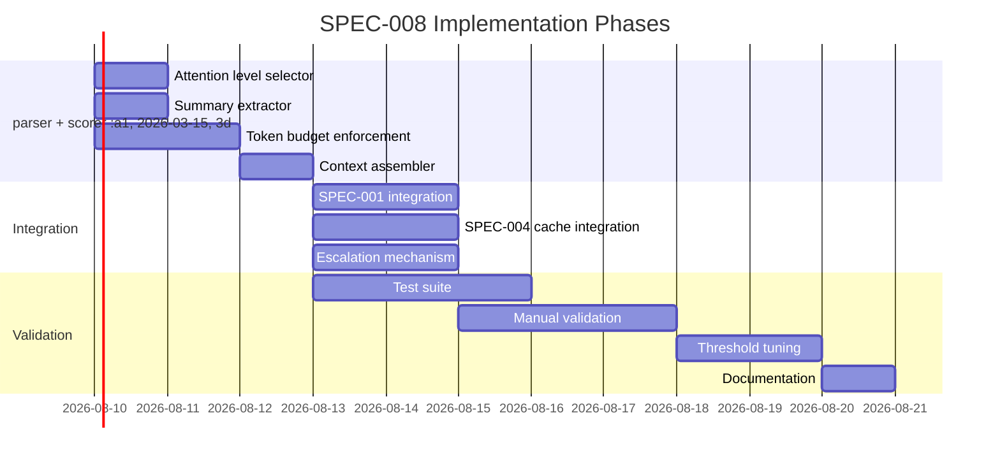

<!--
status: draft
priority: high
research_confidence: low
sources_count: 4
depends_on: [SPEC-001, SPEC-004]
enables: [SPEC-012]
created: 2026-03-08
updated: 2026-03-08
-->

# SPEC-008: Agent Attention Mechanisms

## 0. Research Summary

### Fuentes Consultadas

| Tipo | Fuente | Referencia | Relevancia |
|------|--------|------------|------------|
| Codebase | `context-management.md` | `.claude/rules/context-management.md` | Alta -- defines per-agent skill limits (builder max 5, reviewer 4, planner 2) and precedence rules |
| Codebase | `skill-matching.md` | `.claude/rules/skill-matching.md` | Alta -- keyword-based skill selection; 11 keyword groups; no subsection extraction |
| Spec | SPEC-001 Path-Specific Rules | `.specs/v1.1/SPEC-001-path-specific-rules.md` | Alta -- narrows which skills to consider based on file paths; feeds into attention input |
| Spec | SPEC-004 Stale Context Detection | `.specs/v1.1/SPEC-004-stale-context-detection.md` | Media -- ensures loaded context is fresh; attention should skip stale sections |

### Decisiones Informadas por Research

| Decision | Basada en |
|----------|-----------|
| Section-level extraction from Markdown via `##` headers | Skills already use `##` headers consistently (e.g., `api-design/SKILL.md` has `## REST Conventions`, `## Elysia Route Patterns`, etc.) |
| Keyword relevance scoring over embedding-based retrieval | Project has no vector DB, no embedding infrastructure; keyword matching is the established pattern (`skill-matching.md`) |
| Four attention levels (full/section/summary/none) | `context-management.md` already limits skills per agent; attention levels provide finer granularity within each skill |
| Token budget enforcement per agent role | Existing limits are skill-count-based (max 5); token-based budgets are more precise for actual context window impact |

### Informacion No Encontrada

- No benchmarks for actual token consumption per skill document in current system (needed to validate 30% reduction target)
- No prior art for subsection extraction from Markdown skills in CLI orchestration tools (novel approach)
- No data on correlation between context size and agent output quality in Poneglyph (quality degradation risk unknown)
- No measurement of current keyword matching accuracy (false positive/negative rates)

### Confidence Assessment

| Area | Nivel | Razon |
|------|-------|-------|
| Markdown section parsing | Alto | Skills use consistent `##` header structure; parsing is deterministic |
| Keyword relevance scoring | Medio | Keyword overlap is a crude proxy for semantic relevance; may miss contextually important sections with few keyword matches |
| Token savings estimate (30-40%) | Bajo | No baseline measurements exist; estimate is theoretical based on typical skill document structure |
| Quality preservation after pruning | Bajo | No data on whether removing skill sections degrades agent output; requires empirical validation |
| Integration with SPEC-001/SPEC-004 | Alto | Both specs have well-defined interfaces; attention mechanism consumes their outputs |

---

## 1. Vision

### Press Release

Poneglyph agents now receive laser-focused context: only the specific patterns, rules, and examples relevant to their exact task. When a builder needs to implement a REST endpoint with pagination, instead of loading the entire `api-design` skill (800+ tokens) including versioning patterns, WebSocket conventions, and OpenAPI configuration it never needs, the attention mechanism extracts only the "REST Conventions", "Elysia Route Patterns", and "Pagination" sections. The result: 30-40% fewer tokens per agent call, faster responses, and more focused output that follows the most relevant patterns without distraction from irrelevant ones.

### Background

Today, Poneglyph loads skills as complete documents. The `context-management.md` rule limits the number of skills per agent (builder max 5, reviewer max 4, planner max 2), but every loaded skill is injected in full. A single skill like `api-design` contains 12 sections covering REST conventions, status codes, URL naming, Elysia patterns, OpenAPI configuration, pagination (cursor and offset), error responses, versioning, and reviewer checklists. An agent implementing a simple GET endpoint receives all of this, even though it only needs 2-3 sections.

This is wasteful in three dimensions:

| Dimension | Problem |
|-----------|---------|
| **Tokens** | Full skill documents consume 500-1500 tokens each; 5 skills = 2500-7500 tokens of context |
| **Attention** | LLMs have finite attention; irrelevant sections dilute focus on the relevant patterns |
| **Cost** | Input tokens cost money; unnecessary context = unnecessary spend |

SPEC-001 (Path-Specific Rules) determines which skills to load. SPEC-004 (Stale Context Detection) ensures loaded context is fresh. This spec adds the missing piece: within each loaded skill, extract only the sections relevant to the current task.

### Usuario Objetivo

All Poneglyph agents (builder, reviewer, planner, architect, scout, error-analyzer) that receive skill context through the orchestration pipeline.

### Metricas de Exito

| Metrica | Target | Medicion |
|---------|--------|----------|
| Token reduction per agent call | >= 30% vs full-skill loading | Compare token counts before/after attention in trace logs (SPEC-003) |
| Quality preservation | Zero regression in test pass rate | Run same tasks with full vs pruned context; compare outcomes |
| Context loading latency | < 50ms for section extraction + relevance scoring | Measure in attention module; must not block agent delegation |
| Relevance accuracy | >= 85% of pruned contexts contain all needed sections | Manual audit of 20 representative tasks |
| Agent escalation rate | < 10% of tasks require full-context fallback | Track escalation events in traces |

---

## 2. Goals & Non-Goals

### Goals

| ID | Goal | Razon |
|----|------|-------|
| G1 | Parse skill Markdown documents into sections by `##` headers | Foundation for selective extraction; skills already use consistent header structure |
| G2 | Score each section's relevance to task keywords | Enable data-driven section selection instead of all-or-nothing loading |
| G3 | Support four attention levels: `full`, `section`, `summary`, `none` | Provide granularity between "load everything" and "load nothing" |
| G4 | Enforce token budgets per agent role | Move from skill-count limits to token-based budgets for more precise context control |
| G5 | Allow agents to escalate to full context when pruned context is insufficient | Safety valve to prevent quality degradation from over-aggressive pruning |
| G6 | Integrate with SPEC-001 path rules for targeted skill selection | Path rules narrow skills; attention narrows within skills; combined effect is multiplicative |
| G7 | Integrate with SPEC-004 staleness detection for context freshness | Only load sections from fresh skill documents; skip stale ones |
| G8 | Provide configurable relevance thresholds per agent type | Different agents need different sensitivity; reviewer needs more context than builder |

### Non-Goals

| ID | Non-Goal | Razon |
|----|----------|-------|
| NG1 | Semantic embedding-based retrieval (vector similarity) | Requires vector DB (FAISS, ChromaDB), embedding model, and infrastructure Poneglyph does not have; overkill for <30 skill documents |
| NG2 | Modifying skill file format or structure | Attention mechanism must be additive; skills remain standard Markdown with `##` headers; no new frontmatter fields required |
| NG3 | Real-time attention adjustment during agent generation | Agent context is set at delegation time; mid-generation context injection is not supported by Claude Code's architecture |
| NG4 | Cross-skill section merging or deduplication | If two skills have similar sections (e.g., both mention error handling), each is loaded independently; merging adds complexity without clear benefit |
| NG5 | Automatic skill document rewriting or summarization | Using an LLM to summarize context before passing to another LLM is meta-cost; defeats the purpose of token savings |
| NG6 | Per-user attention preferences | Single user (Oriol); no need for user-level customization |

---

## 3. Alternatives Considered

| # | Alternativa | Pros | Contras | Veredicto |
|---|-------------|------|---------|-----------|
| 1 | **Smaller skill files** (split each skill into micro-documents) | Precise loading; each file is a single topic | Massive fragmentation (24 skills x ~8 sections = ~192 files); maintenance nightmare; cross-references break; skill coherence lost | Rejected: maintenance cost outweighs benefits |
| 2 | **Embedding-based RAG** (vectorize skill sections, retrieve by similarity) | Semantically accurate retrieval; handles synonyms and paraphrasing | Requires vector database, embedding model, indexing pipeline; adds external dependency; overkill for <500 total sections; latency from embedding computation | Rejected: architectural overkill for the scale |
| 3 | **Section-level extraction with keyword relevance scoring** | Lightweight; uses existing keyword matching patterns; no external deps; works with current Markdown structure; configurable thresholds | Keyword matching is crude (misses synonyms, context); relevance scoring accuracy is uncertain; requires threshold tuning | **Adopted**: best balance of simplicity, effectiveness, and alignment with existing patterns |
| 4 | **LLM summarization of context** (use Claude to summarize skills before passing to agent) | Semantically rich summaries; adapts to task | Meta-cost: tokens spent summarizing > tokens saved; adds latency; recursive LLM calls are expensive and unpredictable | Rejected: defeats the purpose of token savings |
| 5 | **Header-based section selection** (match task keywords against `##` header text only) | Simplest possible approach; near-zero implementation cost; headers are descriptive | Only matches header text, not section content; misses sections whose body is relevant but header is generic (e.g., "## Examples" contains relevant code) | Partially adopted: header matching is the first pass in the scoring algorithm; body keywords are the second pass |

### Justificacion de la Alternativa Adoptada

Alternative 3 aligns with Poneglyph's established pattern of keyword-based matching (`skill-matching.md`) while adding section-level granularity. It requires no external dependencies, works with the existing Markdown skill format, and can be implemented as a pure TypeScript module. The main risk (keyword accuracy) is mitigated by the escalation mechanism (G5): if pruned context proves insufficient, the agent can request full context.

---

## 4. Design

### Arquitectura



### Attention Levels

| Level | Content Loaded | Estimated Token Cost | Use When |
|-------|---------------|---------------------|----------|
| `full` | Entire skill document, all sections | 100% of document | Agent's core skill for the task; complex multi-pattern task; agent explicitly requests full context |
| `section` | Only sections matching task keywords above relevance threshold | 30-50% of document | Supplementary skill; specific patterns needed but not all; most common level |
| `summary` | First paragraph of document + all `##` headers (no section bodies) | 10-15% of document | Context awareness without detail; agent needs to know what the skill covers but not the specifics |
| `none` | Nothing loaded | 0% | Skill was matched by path/keyword but is irrelevant to the specific task; explicitly excluded |

### Attention Level Selection

The attention level for each skill is determined by match strength:

| Match Strength | Keyword Matches | Path Match | Attention Level |
|---------------|----------------|------------|-----------------|
| Strong | >= 3 keywords | Any | `full` |
| Moderate | 1-2 keywords | Yes | `section` |
| Moderate | 1-2 keywords | No | `section` |
| Weak | 0 keywords | Yes | `summary` |
| Base skill | N/A | N/A | `full` |
| None | 0 keywords | No | `none` |

### Section Extraction

Skills are parsed into sections by `##` headers. Each section becomes an independently scorable unit.

```typescript
interface SkillSection {
  header: string
  level: number        // 2 for ##, 3 for ###
  content: string
  startLine: number
  endLine: number
  estimatedTokens: number  // ~text.length / 4
}

function parseSkillIntoSections(markdown: string): SkillSection[]
// Split by /^#{2,3}\s+(.+)$/ regex; accumulate content between headers
// Estimate tokens: Math.ceil(text.length / 4)
```

### Relevance Scoring

Each section is scored against the task keywords. Scoring weights position: header matches are worth more than body matches.

```typescript
interface SectionRelevance {
  section: SkillSection
  keywords: string[]     // keywords found in this section
  matchScore: number     // 0.0-1.0 normalized
  tokenCount: number
}

const DEFAULT_WEIGHTS = {
  headerMatch: 3.0,        // keyword found in ## header
  firstParagraphMatch: 2.0, // keyword in first paragraph
  bodyMatch: 1.0,           // keyword anywhere in body
  codeBlockMatch: 1.5,      // keyword in code block
}

function scoreSection(section: SkillSection, taskKeywords: string[]): SectionRelevance
// For each keyword: check header (3x), first paragraph (2x), body (1x)
// Normalize: rawScore / (keywords.length * headerWeight)
```

### Relevance Thresholds

| Agent Type | Threshold | Rationale |
|------------|-----------|-----------|
| builder | 0.15 | Needs specific patterns; moderate threshold filters noise |
| reviewer | 0.10 | Needs broader context for thorough review; lower threshold includes more |
| planner | 0.20 | High-level only; aggressive filtering is appropriate |
| architect | 0.10 | Needs comprehensive view; low threshold |
| scout | 0.25 | Focused search; only highly relevant sections |
| error-analyzer | 0.15 | Needs error patterns and recovery strategies specifically |

### Token Budget Enforcement

```typescript
interface AgentTokenBudget {
  agent: string
  maxContextTokens: number
  allocation: { skills: number; rules: number; files: number } // percentages
}
```

Default budgets:

| Agent | Max Context Tokens | Skills % | Rules % | Files % |
|-------|-------------------|----------|---------|---------|
| builder | 10000 | 50% | 20% | 30% |
| reviewer | 8000 | 40% | 30% | 30% |
| planner | 6000 | 30% | 40% | 30% |
| scout | 4000 | 20% | 20% | 60% |
| architect | 10000 | 45% | 30% | 25% |
| error-analyzer | 6000 | 40% | 30% | 30% |

### Budget Enforcement Algorithm

```typescript
interface PrunedContext {
  sections: SectionRelevance[]
  totalTokens: number
  droppedSections: SectionRelevance[]
  attentionLevel: 'full' | 'section' | 'summary'
}

function enforceTokenBudget(
  scoredSections: SectionRelevance[],
  budgetTokens: number,
  threshold: number
): PrunedContext
// 1. Filter sections below relevance threshold
// 2. Sort remaining by matchScore descending
// 3. Greedily include until budget exhausted
// 4. Excess sections go to droppedSections
```

### Summary Extraction

For the `summary` attention level, only headers and first paragraphs are extracted.

```typescript
function extractSummary(markdown: string): string
// Iterate lines: always include headers (#{1,3})
// After each header, collect first paragraph (until empty line)
// Skip all other content
```

### Context Assembly

After section selection, the pruned context is assembled with navigation markers.

```typescript
function assembleContext(skillName: string, prunedContext: PrunedContext): string
// Output format:
// # {skillName} (pruned: N sections, M tokens)
// ## {section1.header}
// {section1.content}
// ...
// [Omitted K sections: Header1, Header2. Request full context if needed.]
```

### Escalation Mechanism

Agents can request full context if the pruned context is insufficient. This is signaled via a structured output in the agent's response.

```typescript
interface EscalationRequest {
  type: 'context_escalation'
  skill: string
  currentLevel: 'section' | 'summary'
  requestedLevel: 'full'
  reason: string
}
```

The Lead detects escalation requests in agent output and re-delegates with full context. Escalation events are logged to traces (SPEC-003) for threshold tuning.

### Integration with SPEC-001 (Path-Specific Rules)



Path rules narrow the set of candidate skills. The attention module then determines the attention level for each candidate:
- Skills matched by both path and keywords: `section` or `full` (depending on keyword count)
- Skills matched by path only: `summary`
- Skills matched by keywords only: `section`

### Integration with SPEC-004 (Stale Context Detection)

Before extracting sections from a skill document, the attention module checks if the skill file has been modified since it was last parsed and cached:

1. Check skill file `mtime` against cached parse result
2. If `mtime` changed: re-parse, re-score, update cache
3. If `mtime` unchanged: use cached sections and scores

This avoids re-parsing skill documents on every delegation while ensuring edits to skills are immediately reflected.

### Edge Cases

| Edge Case | Handling |
|-----------|----------|
| Skill with no `##` headers | Treat entire document as a single section; always loaded at `full` or `none` |
| Very short skill (< 200 tokens total) | Always load at `full`; pruning overhead exceeds savings |
| Section with only a table (no prose) | Tables are included in content; keyword matching works on cell text |
| Cross-references between sections ("see ## Pagination above") | Each section is independent; cross-reference text is included in the loaded section but referenced section may be omitted; omission note lists dropped sections |
| Empty section (header with no content) | Filtered out during parsing; zero tokens, zero relevance |
| Task with no keywords extractable | All skills loaded at `full` (no basis for pruning); log warning |
| Agent type not in budget table | Fall back to builder budget (most generous skills allocation) |

### Stack Alignment

| Aspecto | Decision | Alineado | Razon |
|---------|----------|----------|-------|
| Language | TypeScript | Yes | Consistent with all Poneglyph modules |
| Runtime | Bun | Yes | `Bun.file()` for skill reading, `Bun.hash()` for cache keys |
| Testing | `bun:test` | Yes | Standard test framework |
| Skill format | Markdown with `##` headers | Yes | No changes to skill format required |
| Location | `.claude/lib/attention/` | Yes | Utility module in `.claude/` hierarchy |
| Config | TypeScript constants (not JSON) | Yes | Thresholds/budgets colocated with implementation |

### Dependencies

| Dependency | From | Purpose |
|------------|------|---------|
| SPEC-001 | Path-specific skill selection | Provides narrowed skill list as input to attention module |
| SPEC-004 | Stale context detection | Ensures skill documents are fresh before section extraction |
| `context-management.md` | Existing rule | Agent skill limits; attention module must respect these |
| `skill-matching.md` | Existing rule | Keyword extraction logic; attention module extends this |

### Concerns

| Concern | Mitigation |
|---------|------------|
| Quality degradation from aggressive pruning | Escalation mechanism (G5); conservative initial thresholds; manual audit of first 20 tasks |
| Keyword matching misses semantically relevant sections | Header matching as first pass catches most cases; body matching as second pass adds coverage; threshold tuning via trace data |
| Overhead of parsing + scoring exceeds savings | Parsing is O(n) on document length; scoring is O(sections x keywords); both are < 10ms for typical skills; caching eliminates repeated work |
| Maintenance burden of threshold tuning | Start with defaults; use SPEC-003 trace data to identify misses; adjust thresholds based on escalation rate |

---

## 5. FAQ

**Q: How do we measure quality impact from context pruning?**

A: Three approaches, in order of implementation priority:
1. **A/B testing**: Run the same 10 representative tasks with full context and pruned context. Compare test pass rates, code quality (reviewer scores), and token usage. If pruned context produces equivalent results with fewer tokens, the attention mechanism is working.
2. **Escalation rate monitoring**: Track how often agents request full context via the escalation mechanism. A rate > 10% indicates thresholds are too aggressive.
3. **Trace analysis** (SPEC-003): Compare agent performance metrics (time to completion, error rate, retry count) between full and pruned context sessions.

**Q: Can agents request more context if the pruned version is insufficient?**

A: Yes. The escalation mechanism allows an agent to include an `EscalationRequest` in its structured output. The Lead detects this, reloads the skill at `full` attention level, and re-delegates the task. This is logged as an escalation event for threshold tuning. The escalation adds one extra agent call but prevents quality degradation.

**Q: What if pruning removes a section that turns out to be critical?**

A: The assembled context includes an "Omitted sections" note listing what was dropped. The agent can see what was omitted and request full context if it suspects a dropped section is relevant. Additionally, the conservative initial thresholds (0.10-0.25) are designed to err on the side of inclusion rather than exclusion.

**Q: How does this interact with base skills (always-loaded)?**

A: Base skills (defined in `context-management.md`, e.g., `code-quality` for reviewer) are always loaded at `full` attention level. They do not count against the token budget's skill allocation. Only non-base skills go through attention level selection and section pruning.

**Q: What happens when multiple skills have overlapping content?**

A: Each skill is processed independently. If `api-design` and `typescript-patterns` both have error handling sections, both are loaded if both match the task. Cross-skill deduplication is a non-goal (NG4) because the implementation complexity outweighs the marginal token savings.

**Q: Is the token estimation accurate enough?**

A: The 4-characters-per-token approximation is rough but sufficient for budget enforcement. It tends to overestimate tokens for code (which has shorter tokens) and underestimate for prose (which has longer tokens). For the purpose of budget enforcement, a ~20% error margin is acceptable because the budgets themselves have built-in headroom.

**Q: Can attention levels be configured per session?**

A: Not in the initial implementation. Attention levels are determined algorithmically based on keyword matches and agent type. Per-session configuration is deferred to Open Questions (see Section 7). If trace data shows that certain task types consistently need different thresholds, per-session overrides could be added.

---

## 6. Acceptance Criteria (BDD)

```gherkin
Feature: Agent Attention Mechanisms

  Background:
    Given a skill "api-design" with sections:
      | Header              | Content Keywords            | Tokens |
      | REST Conventions    | rest, http, method, get     | 200    |
      | Elysia Route        | elysia, route, endpoint     | 250    |
      | OpenAPI Swagger     | openapi, swagger, docs      | 180    |
      | Pagination          | pagination, cursor, offset  | 300    |
      | Error Responses     | error, response, status     | 150    |
      | Versioning          | version, api, v1, v2        | 120    |
      | Checklist           | checklist, reviewer         | 100    |

  Scenario: Section-level extraction loads only relevant sections
    Given a task with keywords ["endpoint", "pagination", "elysia"]
    And the agent is a builder with attention level "section"
    When the attention module processes skill "api-design"
    Then sections "Elysia Route" and "Pagination" are loaded
    And sections "OpenAPI Swagger", "Versioning", and "Checklist" are omitted
    And the omission note lists the dropped sections

  Scenario: Token budget not exceeded
    Given a builder with maxContextTokens 10000 and skills allocation 50%
    And 3 skills each with 2000 estimated tokens
    When the attention module enforces the budget
    Then the total loaded skill tokens do not exceed 5000
    And lower-scoring sections are dropped to fit the budget

  Scenario: Full attention level loads complete document
    Given a task where "api-design" is the agent's base skill
    When the attention module selects the level for "api-design"
    Then the attention level is "full"
    And all 7 sections are loaded
    And no omission note is added

  Scenario: Summary level loads headers and first paragraphs only
    Given a task where "api-design" is matched by path only (0 keyword matches)
    When the attention module selects the level
    Then the attention level is "summary"
    And the output contains all 7 section headers
    And the output contains only the first paragraph of each section
    And estimated tokens are 10-15% of the full document

  Scenario: Relevance scoring prefers keyword-rich sections
    Given a task with keywords ["pagination", "cursor"]
    And section "Pagination" contains both keywords in header and body
    And section "REST Conventions" contains neither keyword
    When sections are scored
    Then "Pagination" has a higher matchScore than "REST Conventions"
    And "Pagination" is included in the pruned context
    And "REST Conventions" is omitted (below threshold)

  Scenario: Agent escalation to full context
    Given a builder received pruned context for "api-design" at "section" level
    And the builder's output contains an EscalationRequest for "api-design"
    When the Lead processes the escalation
    Then "api-design" is reloaded at "full" attention level
    And the task is re-delegated with full context
    And an escalation event is logged to traces

  Scenario: 30% measured token reduction in test scenarios
    Given 10 representative tasks with known skill requirements
    When each task is processed with full context and with attention-pruned context
    Then the average token reduction across all tasks is >= 30%
    And no task produces a worse outcome with pruned context

  Scenario: Short skill always gets full attention
    Given a skill "config-validator" with total tokens < 200
    When the attention module processes "config-validator"
    Then the attention level is always "full" regardless of keyword matches
    And no section pruning is applied

  Scenario: No extractable keywords defaults to full context
    Given a task prompt with no identifiable keywords
    When the attention module selects levels for all matched skills
    Then all skills are loaded at "full" attention level
    And a warning is logged: "No task keywords extracted; loading full context"

  Scenario: Cached parse result used when skill file unchanged
    Given skill "api-design" was parsed and cached with mtime M1
    And the skill file has not been modified (current mtime == M1)
    When the attention module processes "api-design" again
    Then the cached sections are used without re-parsing
    And no file I/O occurs for the skill document

  Scenario: Stale skill file triggers re-parse
    Given skill "api-design" was parsed and cached with mtime M1
    And the skill file has been modified (current mtime M2 != M1)
    When the attention module processes "api-design"
    Then the skill is re-parsed from disk
    And the cache is updated with mtime M2
    And the new sections are scored against the task keywords
```

---

## 7. Open Questions

| # | Question | Impact | Proposed Resolution |
|---|----------|--------|---------------------|
| 1 | What is the optimal relevance threshold per agent type? | Too high = critical sections dropped; too low = no savings | Start with proposed defaults (0.10-0.25); tune using escalation rate data from traces; target <10% escalation rate |
| 2 | How to detect quality degradation from pruning without a ground truth? | Cannot compare against "correct" output; quality is subjective | Use proxy metrics: test pass rate, reviewer approval rate, retry count; if pruned context tasks have worse proxies, loosen thresholds |
| 3 | Should attention levels be configurable per session or per task? | Power users may want manual control for specific tasks | Defer to v1.6; current design uses algorithmic selection; add `--attention-level=full` CLI flag if demand emerges |
| 4 | How should `###` sub-headers be handled? | Some skills use `###` for subsections within `##` sections | Include `###` content within their parent `##` section; do not treat `###` as independent sections (too granular) |
| 5 | Should the attention module produce a token usage report? | Useful for monitoring savings and tuning thresholds | Yes, output a structured report to trace logs: `{skill, level, sectionsLoaded, sectionsDropped, tokensUsed, tokensSaved}` |
| 6 | How to handle skill files with non-standard structure (no headers)? | Some skills might be a flat document | Treat as single section; load at `full` or `none` based on keyword match against entire content |
| 7 | Should keyword extraction from task prompts use stemming? | "paginated" should match "pagination"; "authenticating" should match "auth" | Use simple suffix stripping (remove -ing, -ed, -tion, -s) rather than a full NLP stemmer; keep implementation lightweight |

---

## 8. Sources

### Links Verificados

| # | Source | Tipo | Ubicacion | Relevancia |
|---|--------|------|-----------|------------|
| 1 | `context-management.md` | Codebase | `.claude/rules/context-management.md` | Defines per-agent skill limits, precedence rules, and anti-patterns for context loading |
| 2 | `skill-matching.md` | Codebase | `.claude/rules/skill-matching.md` | Keyword-to-skill mapping table; 11 keyword groups; matching process; agent skill enrichment patterns |
| 3 | SPEC-001 Path-Specific Rules | Spec | `.specs/v1.1/SPEC-001-path-specific-rules.md` | Path-based skill selection; narrows candidate skills before attention is applied |
| 4 | SPEC-004 Stale Context Detection | Spec | `.specs/v1.1/SPEC-004-stale-context-detection.md` | File freshness checking via mtime; context registry; ensures loaded skills are current |

### Additional References

- **Prompt Compression Research**: Studies on context window optimization suggest that removing irrelevant context can improve LLM output quality, not just reduce cost. Relevant to the hypothesis that pruned context produces equivalent or better results.
- **RAG Section Retrieval Patterns**: Retrieval-Augmented Generation systems commonly chunk documents by headers and score chunks by keyword overlap. Poneglyph's section extraction follows this established pattern at a simpler scale.
- **Claude Context Window Behavior**: Anthropic's documentation notes that models attend more strongly to content at the beginning and end of the context window. Placing the most relevant sections first (sorted by relevance score) may further improve attention utilization.

---

## 9. Next Steps

### Implementation Checklist

| # | Task | Complejidad | Dependencia | Descripcion |
|---|------|-------------|-------------|-------------|
| 1 | Create `.claude/lib/attention/` module directory | Trivial | -- | Establish module location for attention mechanism code |
| 2 | Implement `parseSkillIntoSections()` | Baja | #1 | Parse Markdown by `##` headers into `SkillSection[]`; handle edge cases (no headers, empty sections) |
| 3 | Implement `scoreSection()` with weighted keyword matching | Media | #2 | Score sections against task keywords; weights for header, first paragraph, body, code blocks |
| 4 | Implement `selectAttentionLevel()` | Baja | -- | Determine full/section/summary/none based on match strength and agent type |
| 5 | Implement `extractSummary()` | Baja | #2 | Extract headers + first paragraphs for summary attention level |
| 6 | Implement `enforceTokenBudget()` | Media | #3 | Greedy section selection within token budget; drop lowest-scoring sections |
| 7 | Implement `assembleContext()` with omission notes | Baja | #6 | Build final pruned Markdown with navigation markers and dropped section list |
| 8 | Implement section cache with mtime invalidation | Media | #2 | Cache parsed sections per skill; invalidate when skill file mtime changes (SPEC-004 integration) |
| 9 | Integrate with SPEC-001 path rules output | Media | SPEC-001 | Consume path rule skill selections as input; combine with keyword matches |
| 10 | Implement escalation detection in Lead | Media | #7 | Detect `EscalationRequest` in agent output; re-delegate with full context |
| 11 | Add token usage reporting to trace logs | Baja | #6 | Structured report: skill, level, sections loaded/dropped, tokens used/saved |
| 12 | Write test suite covering all BDD scenarios | Media | #2-#7 | Unit tests for parsing, scoring, budgeting; integration tests for full pipeline |
| 13 | Define default budgets and thresholds in config | Baja | #4, #6 | TypeScript constants for agent budgets and relevance thresholds |
| 14 | Manual validation: run 10 representative tasks with pruned vs full context | Alta | #1-#13 | Measure token savings and quality preservation; adjust thresholds |
| 15 | Update `context-management.md` to reference attention mechanism | Baja | #14 | Document the new token-based budgets alongside existing skill-count limits |

### Phase Plan


