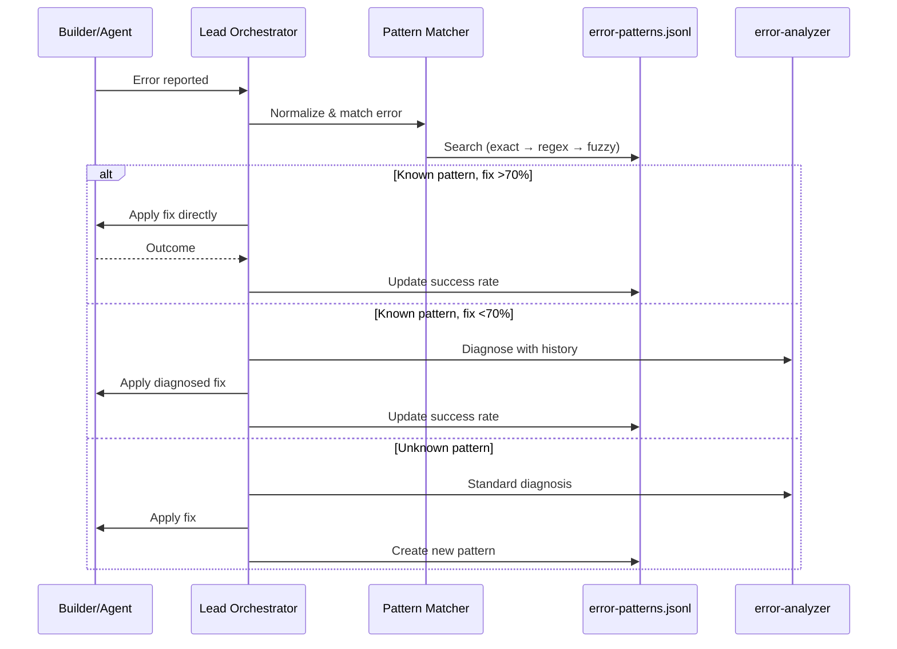
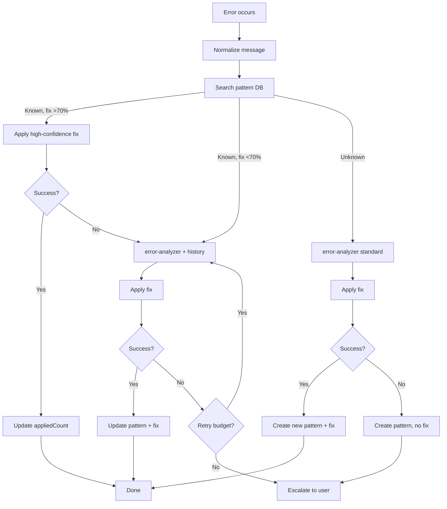

<!--
status: draft
priority: high
research_confidence: medium
sources_count: 4
depends_on: [SPEC-003]
enables: [SPEC-011]
created: 2026-03-08
updated: 2026-03-08
-->

# SPEC-009: Pattern-Based Error Recovery

## 0. Research Summary

### Fuentes Consultadas

| Tipo | Fuente | Relevancia |
|------|--------|------------|
| Code | `.claude/rules/error-recovery.md` | Primary: current retry budgets, escalation tree, recovery prompt template, stuck detection |
| Code | `.claude/hooks/trace-logger.ts` | Trace schema and status detection; errors logged as `status: "error"` but no structured error message capture |
| Docs | SPEC-003 (Trace Analytics) | Defines enriched trace schema with `status`, error pattern detection (`ERROR_PATTERNS`), analytics query infrastructure |
| Pattern | Incident management systems (PagerDuty runbooks, Opsgenie automation rules) | Error fingerprinting via normalized messages, runbook association, success rate tracking |

### Decisiones Informadas por Research

| Decision | Basada en |
|----------|-----------|
| Use regex + normalized string matching instead of ML/embeddings | Single-user system with <100 distinct error patterns; string similarity is fast, explainable, sufficient |
| Store patterns in JSONL (not SQLite) | Aligned with SPEC-003 trace storage format; single-user volumes; no query joins needed |
| Normalize errors by stripping paths, line numbers, variable names | Incident management best practice: structurally identical errors should match regardless of variable details |
| Integrate at error-analyzer prompt level, not auto-apply fixes | Fixes need context-dependent adaptation; past fix is a starting point, not a blind script |

### Informacion No Encontrada

- Empirical data on error similarity matching effectiveness for TypeScript/Bun errors
- Optimal Levenshtein distance threshold for fuzzy matching (proposed 30% needs validation)
- Distribution of error types across Poneglyph sessions (need SPEC-003 trace data)

### Confidence Assessment

| Area | Nivel | Razon |
|------|-------|-------|
| Error normalization | High | Well-established practice in log aggregation (Sentry, Datadog) |
| Regex pattern matching | High | Simple, fast, deterministic |
| Fix suggestion effectiveness | Medium | Past fixes are contextual; may not always transfer |
| Fuzzy matching threshold | Low | 30% Levenshtein distance needs empirical tuning |

---

## 1. Vision

### Press Release

Poneglyph learns from every error. When a `TypeError: Cannot read property 'id' of undefined` occurs, the system instantly searches its pattern database for past instances and the fixes that resolved them. Instead of starting from scratch, the error-analyzer receives: "Add null check before accessing user properties (85% success, applied 12 times)." Recovery time drops by 70% for known patterns. The pattern database grows automatically from every resolved error, requiring zero manual entry.

### Background

The current error recovery system (`error-recovery.md`) treats every error as novel. If the same `TypeError` occurs across 10 sessions, the system performs 10 independent diagnoses with no memory of past resolutions. SPEC-003 adds error status detection and trace persistence. This spec builds the intelligence layer on top.

| Current Limitation | Impact |
|-------------------|--------|
| No error memory across sessions | Same errors diagnosed from scratch repeatedly |
| Recovery prompts are session-scoped | "Do NOT repeat" constraints lost after session |
| No pattern recognition | Similar errors treated as unrelated |
| No fix success tracking | No way to know which fixes actually worked |

### Target Metrics

| Metric | Target | How Measured |
|--------|--------|-------------|
| Recovery time for known patterns | 70% faster | Compare retry count before/after pattern match |
| Pattern auto-population | 100% of resolved errors | Entries added per resolved error |
| Manual pattern entry | 0 required | All patterns auto-extracted from traces |
| False positive matches | <10% | Track cases where suggested fix failed |

---

## 2. Goals & Non-Goals

### Goals

| # | Goal | Rationale |
|---|------|-----------|
| G1 | Extract error patterns from trace data automatically | No manual curation required |
| G2 | Normalize error messages for similarity matching | Strip paths, line numbers, variable names |
| G3 | Three-tier matching: exact, regex category, fuzzy Levenshtein | Balance precision with recall |
| G4 | Inject past fix suggestions into error-analyzer prompt | Historical context as starting point |
| G5 | Track fix outcomes and compute success rates | Best fix bubbles up based on results |
| G6 | Pattern database in JSONL at `~/.claude/error-patterns.jsonl` | Aligned with SPEC-003 trace storage |
| G7 | High-confidence shortcut: fix >70% success skips error-analyzer | Save agent invocations for known fixes |
| G8 | Auto-record new patterns when unknown errors are resolved | First occurrence creates pattern |

### Non-Goals

| # | Non-Goal | Reason |
|---|----------|--------|
| N1 | ML-based error classification | Overkill for <100 distinct patterns |
| N2 | Cross-project pattern sharing | Patterns are project-contextual |
| N3 | Error prediction | Deferred to SPEC-011 |
| N4 | Auto-fix without agent involvement | Fixes need context adaptation |
| N5 | Real-time matching during execution | Matching at recovery time only |

---

## 3. Alternatives Considered

| Alternativa | Pros | Cons | Decision |
|-------------|------|------|----------|
| Manual error knowledge base | Curated, high quality | Maintenance burden, becomes stale | **Rejected** |
| LLM-based similarity | Semantic understanding | Expensive per lookup, adds latency, non-deterministic | **Rejected** |
| String/regex matching | Fast (<1ms), deterministic, explainable | Requires good normalization | **Adopted** |
| Error code taxonomy | Clean categorization | Too rigid for diverse TS/Bun errors | **Rejected** |
| SQLite storage | Fast indexed queries | Overkill for <1000 patterns, breaks JSONL alignment | **Rejected** |
| Embedding vector search | Handles semantic similarity | Requires embedding model, >100ms latency | **Rejected** |

---

## 4. Design

### Error Pattern Schema

```typescript
interface ErrorPattern {
  id: string                // UUID
  pattern: string           // Normalized error message
  category: ErrorCategory   // 'TypeError' | 'SyntaxError' | 'EditConflict' | ...
  occurrences: number
  firstSeen: string         // ISO date
  lastSeen: string          // ISO date
  fixes: ErrorFix[]         // Ordered by success rate descending
  context: ErrorContext
}

interface ErrorFix {
  description: string       // What was done to fix
  successRate: number        // 0.0 - 1.0
  appliedCount: number
  failedCount: number
  lastApplied: string
  constraints: string[]      // "Do NOT repeat" items
  agents: string[]           // Which agents applied this fix
}

interface ErrorContext {
  agents: string[]           // Agents that encounter this error
  filePatterns: string[]     // File globs where this occurs
  skills: string[]           // Active skills when error occurred
  triggerActions: string[]   // Actions preceding error (e.g., "Edit", "Bash:bun test")
}

type ErrorCategory =
  | "TypeError" | "ReferenceError" | "SyntaxError"
  | "EditConflict" | "TestFailure" | "ModuleNotFound"
  | "CompilationError" | "TimeoutError" | "PermissionError"
  | "NetworkError" | "Unknown"
```

### Flujo Principal



### Error Normalization

Normalization strips context-specific details so structurally identical errors match:

| Replacement | Regex | Example |
|------------|-------|---------|
| File paths (Windows) | `/[A-Z]:\\[\w\\.-]+/g` → `<PATH>` | `D:\app\src\utils.ts` → `<PATH>` |
| File paths (Unix) | `/\/[\w/.-]+\.\w+/g` → `<PATH>` | `/src/utils.ts` → `<PATH>` |
| Line:column | `/:\d+:\d+/g` → `:<LINE>:<COL>` | `:42:10` → `:<LINE>:<COL>` |
| Property names | `/property '(\w+)'/g` → `property '<PROP>'` | `property 'userId'` → `property '<PROP>'` |
| Module names | `/Cannot find module '([^']+)'/g` → `...module '<MODULE>'` | `module './auth'` → `module '<MODULE>'` |
| Hex addresses | `/0x[0-9a-fA-F]+/g` → `<ADDR>` | `0x7fff5fbff8a0` → `<ADDR>` |

### Pattern Matching Strategy

| Level | Method | Confidence | When Used |
|-------|--------|------------|-----------|
| 1. Exact | Normalized string equality | 1.0 | Always tried first |
| 2. Regex | Category-based regex patterns | 0.8 | If exact fails |
| 3. Fuzzy | Levenshtein distance <30% of string length | Variable | If regex fails |

Category regex examples:

| Category | Sample Regexes |
|----------|---------------|
| TypeError | `/TypeError:.*of (undefined\|null)/`, `/TypeError:.*is not a function/` |
| EditConflict | `/old_string.*not (found\|unique)/i` |
| ModuleNotFound | `/Cannot find module/`, `/Could not resolve/` |
| CompilationError | `/Type '.*' is not assignable/`, `/Property '.*' does not exist/` |
| TestFailure | `/expect\(.*\)\.(toBe\|toEqual)/`, `/test failed/i` |

### Integration with error-recovery.md



### Recovery Prompt Enhancement

When a pattern match is found, the recovery prompt is enriched:

```
Previous attempt failed: "<original error>"
Diagnosis: <from error-analyzer or pattern>
Do NOT repeat: <constraints from best fix>

--- Pattern Database Context ---
Known pattern: "<normalized>" (seen <N> times)
Best fix (success rate: <X>%): "<description>"
Alternative fixes:
  - "<fix 2>" (<Y>%)
  - "<fix 3>" (<Z>%)
Typical context: agents=<agents>, files=<patterns>
```

### Core Operations

| Function | Purpose | I/O |
|----------|---------|-----|
| `normalizeErrorMessage(raw)` | Strip paths, vars, line numbers | `string → string` |
| `classifyError(normalized)` | Match against category regexes | `string → ErrorCategory` |
| `matchError(normalized, category, patterns)` | Three-tier pattern search | `→ PatternMatch \| null` |
| `loadPatterns()` | Read JSONL, skip corrupt lines | `→ ErrorPattern[]` |
| `savePatterns(patterns)` | Full rewrite of JSONL | `ErrorPattern[] → void` |
| `recordError(patterns, msg, category, ctx)` | Create or update pattern | `→ ErrorPattern` |
| `recordFixOutcome(pattern, desc, success, constraints, agent)` | Update fix success rate | `→ void` |
| `populateFromTraces(traces, patterns)` | Batch mine error traces | `→ number (new patterns)` |

### Edge Cases

| Edge Case | Handling |
|-----------|----------|
| Empty pattern database | Standard error-analyzer flow; patterns created from outcomes |
| Pattern with 0 fixes | error-analyzer gets occurrence count ("seen 5 times, no fix yet") |
| Multiple matches at different levels | Use highest-confidence match; break ties by occurrence count |
| Fix success rate drops below 30% | Mark as "unreliable" in prompt context |
| Long error messages (>500 chars) | Truncate before normalization |
| JSONL corruption | Skip corrupt lines, process rest (same as SPEC-003) |
| Concurrent writes | Single-writer model (Lead orchestrator); no locking needed |

### Dependencies

| Dependency | Type | Purpose |
|------------|------|---------|
| SPEC-003 (Trace Analytics) | Required | Trace data with error status for auto-population |
| `error-recovery.md` | Modify | Insert pattern lookup before retry/escalation |
| `error-analyzer` agent | Modify prompt | Inject pattern context into diagnosis |
| Bun runtime | Runtime | `Bun.file()`, `Bun.write()`, `crypto.randomUUID()` |

### Concerns

| Concern | Mitigation |
|---------|------------|
| Pattern staleness | Track `lastSeen`; deprioritize patterns not seen in 90+ days |
| Database size | ~500 bytes/pattern, 1000 patterns = ~500KB; no rotation needed |
| False positives | Conservative 30% fuzzy threshold; track via fix failure rate |
| Performance | O(n) exact, O(n*k) regex, O(n*m) fuzzy; <10ms for 1000 patterns |
| Cold start | Graceful degradation to standard error-recovery flow |

### Stack Alignment

| Aspecto | Decision | Alineado |
|---------|----------|----------|
| Runtime | Bun native APIs | Yes -- consistent with SPEC-003 |
| Storage | JSONL at `~/.claude/error-patterns.jsonl` | Yes -- aligned with trace format |
| Types | TypeScript strict, no `any` | Yes -- project standard |
| Matching | Pure TypeScript (no external deps) | Yes |
| Testing | `bun:test` with mock patterns | Yes -- existing infrastructure |

---

## 5. FAQ

**Q: Won't the pattern database become stale?**
A: Each pattern tracks `lastSeen` and `occurrences`. Patterns not seen in 90+ days are deprioritized. The system never auto-deletes since errors can resurface. At <500KB total, staleness is a relevance issue, not a storage issue.

**Q: What if the database grows too large?**
A: Realistic ceiling is ~500 unique patterns (~250KB). Even at 2000 patterns (extreme), full-scan matching takes <10ms. An index map can be added later without changing the format.

**Q: How are false matches handled?**
A: (1) Three-tier matching prioritizes exact matches (zero false positives). (2) Fuzzy matching uses conservative 30% threshold. (3) Fix success rates self-correct -- failed suggestions lower the rate, deprioritizing bad matches.

**Q: How does this interact with retry budgets?**
A: Pattern lookup happens before consuming a retry attempt. High-confidence fixes use the first retry slot. If they fail, normal retry budget rules apply. The database does not change retry limits -- it makes retries more effective.

**Q: What if error-analyzer disagrees with the pattern database?**
A: The error-analyzer receives pattern context as input, not constraint. It can use, modify, or ignore the suggested fix. The database informs; the agent decides. Outcomes update the database regardless.

---

## 6. Acceptance Criteria (BDD)

```gherkin
Feature: Error Pattern Matching
  Background:
    Given the pattern database at ~/.claude/error-patterns.jsonl exists

  Scenario: Exact match for known TypeError
    Given a pattern "TypeError: Cannot read property '<PROP>' of undefined"
    And the pattern has fix "Add null check" with 85% success rate
    When builder reports "TypeError: Cannot read property 'id' of undefined"
    Then the normalized form matches the stored pattern exactly
    And the suggested fix is "Add null check"

  Scenario: Regex match for category variant
    Given CATEGORY_REGEXES includes /TypeError:.*is not a function/
    When builder reports "TypeError: foo.bar is not a function"
    And exact match fails
    Then regex matching finds a category match with confidence 0.8

  Scenario: Fuzzy match for similar error
    Given a pattern "Cannot find module '<MODULE>'"
    When builder reports "Cannot find modul '<MODULE>'"
    Then fuzzy matching finds a match with Levenshtein distance <30%

  Scenario: No match for new error
    When builder reports "BunError: FFI call failed with SIGSEGV"
    Then matchError returns null
    And error-analyzer proceeds with standard diagnosis

  Scenario: High-confidence fix applied without error-analyzer
    Given a pattern match with fix at 85% success rate
    When combined confidence exceeds 70%
    Then the fix is applied directly without invoking error-analyzer

  Scenario: Unknown error creates new pattern after resolution
    Given an error matching no existing pattern
    When error-analyzer diagnoses and fix is applied successfully
    Then a new ErrorPattern is created with successRate=1.0

  Scenario: Failed fix updates success rate
    Given a pattern with fix at 80% (8/10)
    When the fix is applied and fails
    Then success rate updates to 8/11 (72.7%)

  Scenario: Normalization strips file paths and property names
    Given raw error "Cannot read property 'userId' of undefined in D:\app\src\user.ts:42:10"
    When normalized
    Then result is "Cannot read property '<PROP>' of undefined in <PATH>:<LINE>:<COL>"

  Scenario: Pattern database persists across sessions
    Given a pattern recorded in session A
    When session B encounters the same error
    Then the pattern and its fixes are available

  Scenario: Corrupt JSONL handling
    Given 20 valid lines and 1 corrupt line
    When patterns are loaded
    Then 20 patterns are returned and corrupt line is skipped

  Scenario: Empty database graceful start
    Given ~/.claude/error-patterns.jsonl does not exist
    When pattern matching is attempted
    Then matchError returns null without crashing
    And after resolution the file is created with first pattern

Feature: Auto-Population from Traces
  Scenario: Mine traces for new patterns
    Given 100 traces with 15 having status "error" and 10 unique messages
    When populateFromTraces runs
    Then 10 new ErrorPatterns are created with correct categories

  Scenario: Duplicate trace errors consolidated
    Given 5 traces with the same normalized error
    When populateFromTraces runs
    Then 1 ErrorPattern is created with occurrences=5
```

---

## 7. Open Questions

- [ ] **Pattern expiration policy**: Should patterns unseen >90 days be deprioritized or archived? Need confidence decay formula.
- [ ] **Maximum database size**: At what point should low-value patterns be pruned? Define "low-value" (low occurrences + no fixes + stale).
- [ ] **Stack trace normalization**: Normalize only first line of multi-line stack traces? Or extract all unique frame patterns?
- [ ] **Levenshtein threshold tuning**: Should the 30% threshold vary by error category (stricter for short messages)?
- [ ] **Fix description standardization**: Should error-analyzer output a structured format (action + target) to improve cross-session matching?
- [ ] **Integration trigger**: Pattern lookup by Lead orchestrator or built into error-analyzer agent? Leaning Lead (controls escalation flow).

---

## 8. Sources

| Tipo | Fuente | Relevancia |
|------|--------|------------|
| Code | `.claude/rules/error-recovery.md` | Primary -- retry budgets, escalation tree, recovery prompt template |
| Code | `.claude/hooks/trace-logger.ts` | Trace schema, error status detection, JSONL storage pattern |
| Spec | `SPEC-003: Trace Analytics` | Enriched trace schema with status field, error detection, analytics infrastructure |
| Pattern | Incident management automation (PagerDuty, Opsgenie, Rootly) | Error fingerprinting, runbook association, success rate tracking |

---

## 9. Next Steps

- [ ] Create `.claude/hooks/lib/error-patterns.ts`: interfaces + core functions (`normalize`, `classify`, `match`, `load/save`, `record`)
- [ ] Implement `levenshteinDistance()` utility (pure TypeScript)
- [ ] Implement `normalizeErrorMessage()` with path/line/property/module stripping
- [ ] Implement `matchError()` with three-tier strategy (exact, regex, fuzzy)
- [ ] Implement `loadPatterns()` / `savePatterns()` for JSONL I/O with corrupt line handling
- [ ] Implement `recordError()` and `recordFixOutcome()` for CRUD + success rate tracking
- [ ] Implement `populateFromTraces()` for batch mining of SPEC-003 data
- [ ] Modify `error-recovery.md`: add pattern lookup step before retry decision
- [ ] Update error-analyzer agent prompt to accept pattern context section
- [ ] Create `.claude/hooks/lib/error-patterns.test.ts`: normalization, matching, CRUD, edge cases
- [ ] Benchmark pattern lookup with 100, 500, 1000 patterns (target: <10ms)
- [ ] Document integration points for SPEC-011 (Pattern Learning from Traces)
