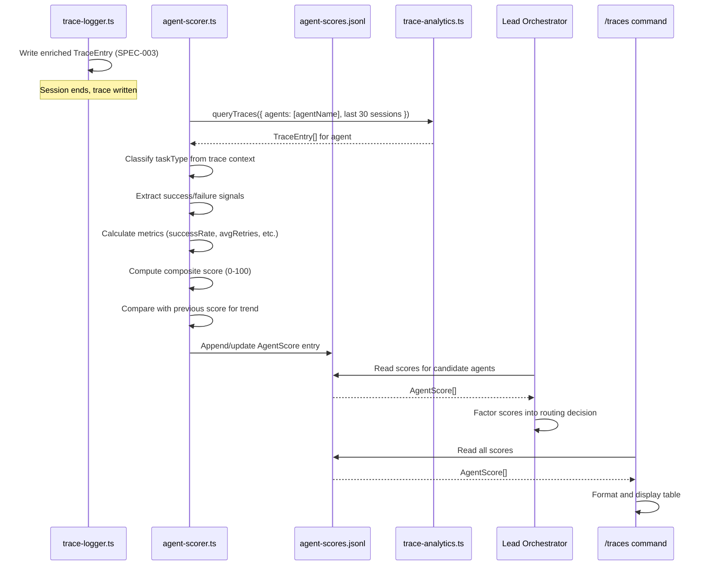

<!--
status: draft
priority: medium
research_confidence: medium
sources_count: 4
depends_on: [SPEC-003]
enables: [SPEC-013]
created: 2026-03-08
updated: 2026-03-08
-->

# SPEC-010: Agent Performance Scoring

## 0. Research Summary

### Fuentes Consultadas

| Tipo | Fuente | Relevancia |
|------|--------|------------|
| Code | `.claude/rules/agent-selection.md` | Primary: defines 16 agents, selection criteria, multi-agent patterns, and anti-patterns for routing |
| Code | `.claude/rules/complexity-routing.md` | Defines routing thresholds (<30, 30-60, >60) that scoring should inform |
| Code | `.claude/rules/error-recovery.md` | Retry budgets, escalation flows, and failure patterns that map to failure signals |
| Spec | SPEC-003 (Trace Analytics) | Upstream dependency: provides `TraceEntry` v2 schema with agents, tokens, costUsd, durationMs, status, toolCalls, filesChanged |

### Decisiones Informadas por Research

| Decision | Basada en |
|----------|-----------|
| Multi-dimensional scoring (not binary pass/fail) | Agent success is nuanced: a builder that passes tests but takes 3 retries is worse than one that succeeds first try; single binary metric loses this signal |
| Per-taskType scoring (not global per-agent) | `agent-selection.md` shows agents handle different task types; a builder may excel at `implementation` but struggle with `debugging` |
| Rolling window of 30 sessions | Aligns with SPEC-003 analytics default query range; provides enough data for trend detection without stale history |
| JSONL storage at `~/.claude/agent-scores.jsonl` | Consistent with trace storage pattern from SPEC-003; single-user, append-friendly, no external dependencies |
| Derive success signals from existing trace fields | SPEC-003 TraceEntry v2 already captures status, retries (inferred from agent count), tokens, cost, duration — no new data collection needed |

### Informacion No Encontrada

- No established industry standard for scoring LLM-based code agents (field is too new)
- No data on what "good" token usage looks like per agent type (requires baseline from real traces)
- No existing scoring systems in comparable multi-agent orchestration tools (most don't expose agent-level metrics)

### Confidence Assessment

| Area | Nivel | Razon |
|------|-------|-------|
| Score dimensions definition | High | Success rate, retries, tokens, duration are universal performance metrics; well-understood in software engineering |
| Success signal mapping per agent | Medium | Defining "success" for reviewer or planner is inherently subjective; signals are reasonable heuristics, not ground truth |
| Scoring formula weights | Medium | Initial weights (0.4/0.2/0.2/0.2) are a starting point; may need calibration after collecting real data |
| Impact on routing decisions | Medium | Unclear how aggressively to use scores; conservative approach (advisory, not mandatory) reduces risk |

---

## 1. Vision

### Press Release

Poneglyph ahora sabe que agentes rinden mejor en que tipos de tarea. Despues de cada sesion, el sistema evalua el rendimiento de cada agente involucrado — tasa de exito, reintentos necesarios, tokens consumidos, tiempo empleado — y mantiene un perfil de rendimiento actualizado. El Lead consulta estos scores antes de rutear tareas, eligiendo el agente con mejor track record para cada tipo de trabajo. Los scores alimentan `/traces` con datos de rendimiento por agente y habilitan el sistema de autonomia graduada de v2.0, donde la confianza se gana con resultados demostrados.

### Background

El sistema de orquestacion Poneglyph tiene 16 agentes especializados, pero actualmente rutea tareas basandose unicamente en keywords del prompt y reglas estaticas de complejidad. No existe retroalimentacion: si un agente falla repetidamente en cierto tipo de tarea, el Lead no lo sabe. Si un agente es excepcionalmente eficiente en un dominio especifico, esa informacion se pierde al terminar la sesion.

SPEC-003 (Trace Analytics) resuelve la mitad del problema: captura datos de cada sesion incluyendo que agentes se usaron, tokens consumidos, costo y estado. SPEC-010 completa el ciclo convirtiendo esos datos crudos en scores accionables por agente y tipo de tarea.

### Usuario Objetivo

Oriol Macias — unico usuario del sistema. Los scores son consumidos por el Lead Orchestrator (automaticamente) y por el usuario (via `/traces` y diagnosticos).

### Metricas de Exito

| Metrica | Target | Medicion |
|---------|--------|----------|
| Scores calculados para los 16 agentes | 100% de agentes con >5 sessions tienen scores | Query `agent-scores.jsonl` |
| Score actualizado tras cada sesion | Latencia <50ms para recalcular | Benchmark en test |
| Trend detection funcional | Detecta "improving"/"declining" con 10+ data points | Test con datos sinteticos |
| Scores visibles en `/traces` | Comando muestra top/bottom agents por score | Manual verification |
| Routing suggestions generados | Lead recibe warning cuando score <50 para task type | Log verification |

---

## 2. Goals & Non-Goals

### Goals

| ID | Goal | Razon |
|----|------|-------|
| G1 | Definir criterios de exito/fallo por tipo de agente | Cada agente tiene senales de exito diferentes; builder != reviewer != planner |
| G2 | Extraer senales de exito/fallo desde TraceEntry v2 (SPEC-003) | Datos ya disponibles post-SPEC-003; sin nueva instrumentacion |
| G3 | Calcular scores multi-dimensionales (success rate, retries, tokens, duration, cost efficiency) | Un solo numero no captura la complejidad del rendimiento |
| G4 | Mantener scores rolling por agente + tipo de tarea (ultimas 30 sesiones) | Evitar bias por datos historicos obsoletos; reflejar rendimiento reciente |
| G5 | Detectar tendencias (improving, stable, declining) por comparacion de ventanas | Alerta temprana de degradacion o mejora |
| G6 | Exponer scores en `/traces` command | Visibilidad para el usuario sin nueva UI |
| G7 | Proveer interfaz para que el Lead consulte scores antes de rutear | Cerrar el feedback loop: datos -> decision |
| G8 | Almacenar scores en `~/.claude/agent-scores.jsonl` | Consistente con patron de SPEC-003; persistente entre sesiones |

### Non-Goals

| ID | Non-Goal | Razon |
|----|----------|-------|
| NG1 | Ranking competitivo entre agentes | Los agentes no compiten; cada uno tiene un rol especializado |
| NG2 | Penalizar agentes con scores bajos (bloquear uso) | Algunos agentes son la unica opcion para ciertos task types; bloquear no es util |
| NG3 | Scoring en tiempo real durante la sesion | Scores se calculan post-sesion desde traces; no hay feedback intra-sesion |
| NG4 | Auto-ajuste de pesos del scoring formula | Requiere mas datos y experimentacion; v2.0 via SPEC-015 |
| NG5 | Scoring de agentes de otros usuarios | Sistema single-user |
| NG6 | Dashboard web para scores | No hay web UI; solo CLI via slash commands |
| NG7 | Reentrenamiento o modificacion de agentes basado en scores | Scores informan al Lead, no modifican definiciones de agentes |

---

## 3. Alternatives Considered

| # | Alternativa | Pros | Contras | Veredicto |
|---|-------------|------|---------|-----------|
| 1 | **Binary success/fail per session** | Simple de implementar; facil de entender | Pierde matices: un builder que pasa tests con 3 retries se considera igual que uno first-try; no captura eficiencia | **Rechazada** — demasiado simplista para decisiones de routing |
| 2 | **Multi-dimensional scoring (success rate, retries, tokens, duration, cost)** | Captura multiples aspectos del rendimiento; permite comparacion granular; pesos ajustables | Mas complejo de implementar y explicar; pesos iniciales son arbitrarios | **Adoptada** — balance entre precision y complejidad |
| 3 | **User ratings post-session** (thumbs up/down) | Ground truth directa del usuario; simple interfaz | Fatiga de rating (usuario ignora despues de 5 sesiones); subjective bias; friccion en CLI workflow | **Rechazada** — demasiada friccion para un solo usuario que prefiere automatizacion |
| 4 | **Peer review scores (agents reviewing agents)** | Perspectiva complementaria; automated | Circular (reviewer scores depend on reviewer accuracy); adds latency and cost; complex to implement | **Rechazada** — circularidad invalida la metrica |
| 5 | **Weighted ELO rating** (like chess) | Well-studied ranking system; handles relative performance | Requires head-to-head comparisons that don't exist; agents don't compete on same task | **Rechazada** — modelo inadecuado para agentes especializados no-competitivos |

### Justificacion de la Alternativa Adoptada

Multi-dimensional scoring permite:
- Identificar agentes que son exitosos pero ineficientes (alto success rate, alto costo)
- Detectar agentes que mejoran con reintentos vs los que fallan definitivamente
- Alimentar SPEC-013 (Graduated Autonomy) con datos granulares para trust levels
- Ajustar pesos en futuras iteraciones sin cambiar la estructura de datos

---

## 4. Design

### Arquitectura

```mermaid
graph TD
    A[Session completes] --> B[trace-logger.ts writes TraceEntry v2]
    B --> C[agent-scorer.ts reads recent traces]
    C --> D[Extract success/failure signals per agent]
    D --> E[Calculate per-agent per-taskType metrics]
    E --> F[Compute composite score 0-100]
    F --> G[Detect trend vs previous window]
    G --> H[Write/update AgentScore to JSONL]

    I[Lead prepares delegation] --> J[Query agent-scores.jsonl]
    J --> K{Score < 50?}
    K -->|Yes| L[Warning: consider alternative agent or add skills]
    K -->|No| M[Proceed with normal routing]

    N[/traces command] --> O[Read agent-scores.jsonl]
    O --> P[Display score table by agent]
```

### Flujo Principal



### AgentScore Interface

```typescript
interface AgentScore {
  agent: string
  taskType: TaskType
  metrics: AgentMetrics
  compositeScore: number
  sampleSize: number
  lastUpdated: string
  trend: Trend
}

type TaskType =
  | "implementation"
  | "review"
  | "planning"
  | "exploration"
  | "debugging"
  | "refactoring"
  | "security-audit"
  | "documentation"
  | "testing"

type Trend = "improving" | "stable" | "declining"

interface AgentMetrics {
  successRate: number
  avgRetries: number
  avgTokens: number
  avgDuration: number
  costEfficiency: number
}
```

### Success Signals by Agent Type

| Agent | Task Type | Success Signal | Failure Signal |
|-------|-----------|----------------|----------------|
| builder | implementation | TraceEntry.status = "completed", no retries (single agent occurrence in trace), reviewer APPROVED (if in same session) | status = "error", multiple builder invocations in same session (retries), reviewer NEEDS_CHANGES |
| builder | debugging | TraceEntry.status = "completed" after error-analyzer diagnosis, no re-escalation | Same error recurs, escalated to user |
| reviewer | review | Finds issues (toolCalls > 0 in review context), or correctly APPROVEs (no subsequent bugs) | False positives (flagged non-issues), missed bugs (error in subsequent session on same files) |
| planner | planning | Plan followed: subsequent builder sessions match plan structure, no replanning | Plan abandoned: builder diverges significantly, Lead creates new plan |
| scout | exploration | Found relevant files (toolCalls for Read/Glob > 0), builder used scout output | Empty results, builder needed to re-explore |
| error-analyzer | debugging | Diagnosis led to fix (subsequent builder session succeeded) | No fix identified, same error repeats |
| refactor-agent | refactoring | Tests still pass after refactor, code-quality score improved | Tests break, reviewer NEEDS_CHANGES |
| security-auditor | security-audit | Vulnerabilities found (non-zero findings) or clean audit confirmed | False positive audit, missed vulnerability found later |
| architect | planning | Design adopted without major changes in implementation | Design abandoned, significant replanning needed |
| test-watcher | testing | Coverage improved, new tests pass | Tests fail, coverage unchanged |
| code-quality | review | Issues identified and accepted by developer | All flagged issues dismissed as false positives |
| merge-resolver | implementation | Merge completed, no subsequent conflicts on same files | Merge breaks tests, conflict recurs |
| task-decomposer | planning | Subtasks completed independently, no circular dependencies | Subtasks needed recomposition, blocked each other |
| knowledge-sync | documentation | Docs match code (no stale references found in subsequent sessions) | Docs immediately outdated |
| bug-documenter | documentation | Bug report useful (referenced in subsequent fix) | Report not referenced, duplicate of existing |
| command-loader | implementation | Command works on first use | Command fails, needs immediate fix |

### Task Type Classification

```typescript
function classifyTaskType(trace: TraceEntry): TaskType {
  const agents = trace.agents

  if (agents.includes("security-auditor")) return "security-audit"
  if (agents.includes("reviewer") || agents.includes("code-quality")) return "review"
  if (agents.includes("planner") || agents.includes("architect") || agents.includes("task-decomposer")) return "planning"
  if (agents.includes("scout")) return "exploration"
  if (agents.includes("error-analyzer")) return "debugging"
  if (agents.includes("refactor-agent")) return "refactoring"
  if (agents.includes("test-watcher")) return "testing"
  if (agents.includes("knowledge-sync") || agents.includes("bug-documenter")) return "documentation"

  return "implementation"
}
```

**Note**: A single session may involve multiple agents. Each agent in the session is scored independently for the session's classified task type. If multiple task types are relevant (e.g., planner + builder), the primary task type is determined by the first specialized agent in the priority list above, and secondary agents receive scores for their respective types.

### Scoring Formula

```typescript
function calculateCompositeScore(metrics: AgentMetrics): number {
  const weights = {
    successRate: 0.4,
    retryEfficiency: 0.2,
    costEfficiency: 0.2,
    speedEfficiency: 0.2,
  }

  const retryScore = metrics.avgRetries === 0
    ? 1.0
    : Math.max(0, 1 - (metrics.avgRetries - 1) * 0.3)

  const costScore = normalizeCostEfficiency(metrics.costEfficiency)

  const speedScore = normalizeSpeed(metrics.avgDuration)

  const raw =
    metrics.successRate * weights.successRate +
    retryScore * weights.retryEfficiency +
    costScore * weights.costEfficiency +
    speedScore * weights.speedEfficiency

  return Math.round(raw * 100)
}
```

**Normalization functions**:

```typescript
function normalizeCostEfficiency(costEfficiency: number): number {
  // costEfficiency = quality (0-1) / normalized cost
  // Higher is better. Clamp to [0, 1]
  return Math.min(1.0, Math.max(0, costEfficiency))
}

function normalizeSpeed(avgDurationMs: number): number {
  // Baseline: 60 seconds is "normal" for a builder task
  // Faster = higher score, slower = lower score
  // Score 1.0 at 0ms, 0.5 at 60s, approaching 0 at 5min
  const BASELINE_MS = 60_000
  if (avgDurationMs <= 0) return 1.0
  return Math.max(0, 1 - avgDurationMs / (BASELINE_MS * 5))
}
```

### Metrics Extraction from Traces

```typescript
function extractMetrics(
  traces: TraceEntry[],
  agent: string,
): AgentMetrics {
  if (traces.length === 0) {
    return {
      successRate: 0,
      avgRetries: 0,
      avgTokens: 0,
      avgDuration: 0,
      costEfficiency: 0,
    }
  }

  const successCount = traces.filter(t => t.status === "completed").length
  const successRate = successCount / traces.length

  // Retries: count how many times the same agent appears in a single session
  const retriesBySession = traces.map(t => {
    const agentCount = t.agents.filter(a => a === agent).length
    return Math.max(0, agentCount - 1)
  })
  const avgRetries = retriesBySession.reduce((a, b) => a + b, 0) / traces.length

  const avgTokens = traces.reduce((sum, t) => sum + t.tokens, 0) / traces.length

  const avgDuration = traces.reduce((sum, t) => sum + t.durationMs, 0) / traces.length

  // Cost efficiency: success rate / normalized cost (higher = better)
  const avgCost = traces.reduce((sum, t) => sum + t.costUsd, 0) / traces.length
  const costEfficiency = avgCost > 0 ? successRate / (avgCost * 10) : successRate

  return { successRate, avgRetries, avgTokens, avgDuration, costEfficiency }
}
```

### Trend Detection

```typescript
function detectTrend(
  currentScore: number,
  previousScores: number[],
): Trend {
  if (previousScores.length < 3) return "stable"

  const recentAvg = previousScores.slice(-3).reduce((a, b) => a + b, 0) / 3
  const delta = currentScore - recentAvg

  const THRESHOLD = 5

  if (delta > THRESHOLD) return "improving"
  if (delta < -THRESHOLD) return "declining"
  return "stable"
}
```

The trend comparison uses a rolling window: the current composite score is compared against the average of the last 3 computed scores. A delta >5 points indicates improvement, <-5 indicates decline, and anything within the band is stable.

### Rolling Window Strategy

```typescript
const ROLLING_WINDOW = 30

async function getAgentTraces(
  agent: string,
  taskType: TaskType,
): Promise<TraceEntry[]> {
  const allTraces = await queryTraces({
    agents: [agent],
  })

  return allTraces
    .filter(t => classifyTaskType(t) === taskType)
    .slice(-ROLLING_WINDOW)
}
```

The window size of 30 sessions per agent-taskType pair ensures:
- Enough data for statistical significance (>10 samples)
- Recent enough to reflect current performance (not stale history)
- Aligned with SPEC-003 default 30-day query range

### Storage Format

```jsonl
{"agent":"builder","taskType":"implementation","metrics":{"successRate":0.85,"avgRetries":0.3,"avgTokens":15000,"avgDuration":45000,"costEfficiency":0.72},"compositeScore":78,"sampleSize":20,"lastUpdated":"2026-03-08T14:30:00Z","trend":"stable"}
{"agent":"reviewer","taskType":"review","metrics":{"successRate":0.92,"avgRetries":0.1,"avgTokens":8000,"avgDuration":20000,"costEfficiency":0.88},"compositeScore":89,"sampleSize":15,"lastUpdated":"2026-03-08T14:30:00Z","trend":"improving"}
```

Each line is one `AgentScore` entry. When recalculating, the scorer reads all existing entries, updates the relevant agent-taskType pair, and rewrites the file. Given the small number of entries (max 16 agents x 9 task types = 144 lines), rewriting is simpler and safer than in-place updates.

### Lead Integration

```typescript
interface RoutingSuggestion {
  agent: string
  score: number
  trend: Trend
  warning: string | null
}

function getRoutingSuggestion(
  candidateAgent: string,
  taskType: TaskType,
  scores: AgentScore[],
): RoutingSuggestion {
  const score = scores.find(
    s => s.agent === candidateAgent && s.taskType === taskType,
  )

  if (!score || score.sampleSize < 5) {
    return {
      agent: candidateAgent,
      score: -1,
      trend: "stable",
      warning: "Insufficient data (< 5 sessions) — no scoring available",
    }
  }

  const warning = score.compositeScore < 50
    ? `Low score (${score.compositeScore}/100) for ${candidateAgent} on ${taskType}. Consider: alternative agent, additional skills, or simpler task decomposition.`
    : score.trend === "declining"
      ? `${candidateAgent} trending declining on ${taskType}. Monitor closely.`
      : null

  return {
    agent: candidateAgent,
    score: score.compositeScore,
    trend: score.trend,
    warning,
  }
}
```

The Lead integrates scores as **advisory**, not mandatory:

| Score Range | Lead Behavior |
|-------------|---------------|
| 80-100 | Proceed confidently with this agent |
| 50-79 | Proceed, consider loading extra skills |
| 30-49 | Warning: consider alternative agent or task decomposition |
| 0-29 | Strong warning: likely to fail, recommend different approach |
| -1 | Insufficient data: proceed with default routing (no scoring bias) |

### Edge Cases

| Edge Case | Handling |
|-----------|----------|
| Agent with 0 sessions (cold start) | Return score -1 with "Insufficient data" warning; use default routing |
| Agent only used for 1 task type | Score only exists for that task type; others return -1 |
| Session with multiple agents of same type | Count as retry: agent appears N times = N-1 retries |
| TraceEntry with empty agents array | Skip: cannot attribute to any agent |
| All sessions have status "completed" (100% success) | Score will be high; trend remains stable until variation occurs |
| Score file corrupted | Rebuild from traces on next calculation; log warning |
| Agent renamed or removed | Old scores persist but become stale; `lastUpdated` indicates staleness |
| Very high token usage skews cost efficiency | Normalization clamps to [0, 1]; outliers don't produce negative scores |

### Dependencias

| Dependency | Type | Purpose |
|------------|------|---------|
| SPEC-003 (Trace Analytics) | Spec dependency | Provides TraceEntry v2 with status, tokens, costUsd, durationMs, agents fields |
| `trace-analytics.ts` (SPEC-003) | Code dependency | `queryTraces()` function for loading filtered traces |
| `agent-selection.md` | Reference | Agent list and routing rules that scores will inform |
| `error-recovery.md` | Reference | Retry patterns that map to retry counting |
| Bun runtime | Runtime | `Bun.file()`, `Bun.write()`, JSON parsing |

### Concerns

| Concern | Mitigation |
|---------|------------|
| **Cold start problem** | Minimum sample size of 5 before generating scores; return -1 for insufficient data to avoid premature routing changes |
| **Scoring formula bias** | Weights are configurable constants; initial 0.4/0.2/0.2/0.2 can be tuned after collecting real data. SPEC-015 may auto-tune in v2.0 |
| **Gaming/manipulation** | Single-user system; no incentive to manipulate. If needed, SPEC-013 adds trust verification |
| **Performance impact** | Score recalculation processes max 30 traces per agent-taskType; <50ms. File rewrite is <1ms for 144 lines |
| **False success signals** | "completed" status doesn't guarantee quality; reviewer checkpoint (error-recovery.md) provides secondary validation |
| **Reviewer accuracy circularity** | Reviewer success is harder to measure (was the review correct?); accept approximation based on subsequent session outcomes |

### Stack Alignment

| Aspecto | Decision | Alineado |
|---------|----------|----------|
| Runtime | Bun native APIs (`Bun.file`, `Bun.write`) | Yes — consistent with SPEC-003 trace storage |
| Storage | JSONL at `~/.claude/agent-scores.jsonl` | Yes — same pattern as traces; small dataset |
| Language | TypeScript with strict types | Yes — project standard |
| Testing | `bun:test` with synthetic trace data | Yes — existing test infrastructure |
| Integration | Module imported by Lead Orchestrator | Yes — same pattern as skill/rule loading |
| Error handling | Try/catch with graceful degradation | Yes — scoring failure should never block routing |

---

## 5. FAQ

**Q: How does the system handle the cold start problem when there are no traces yet?**

A: A minimum sample size of 5 sessions is required before generating a score for any agent-taskType pair. Below this threshold, `getRoutingSuggestion()` returns score -1 with a warning "Insufficient data". The Lead uses its default static routing rules (`agent-selection.md`, `complexity-routing.md`) without scoring influence. As sessions accumulate naturally through normal usage, scores gradually become available. No synthetic data injection or bootstrapping is needed.

**Q: Can scores be manipulated or gamed?**

A: This is a single-user system where Oriol is both the user and the beneficiary of accurate scores. There is no incentive to manipulate. The system observes organic behavior through traces. If hypothetically an agent were "gaming" by producing superficially successful but low-quality results, the reviewer checkpoint and subsequent session failures would lower the success rate over time.

**Q: What is the minimum sample size for reliable scores?**

A: The system requires 5 sessions minimum to compute any score (below this, returns -1). For reliable trend detection, 10+ sessions are needed (3 for the comparison window plus history). Statistical significance improves with more data, but the rolling window caps at 30 to keep scores current. In practice, active agents like builder will reach 30 sessions within a few days of normal usage.

**Q: Should scores be reset when an agent's prompt/definition is updated?**

A: No automatic reset. The rolling window naturally phases out old performance data. If a significant agent change is made, the user can manually delete `agent-scores.jsonl` to force a fresh start. A future enhancement could add a `--reset-scores` flag to the `/traces` command. The `lastUpdated` field provides visibility into score freshness.

**Q: How are multi-agent sessions scored?**

A: Each agent in the session receives an independent score entry. If a session uses builder + reviewer, the builder is scored for its task type (usually "implementation") and the reviewer is scored for "review". The session's overall status and metrics are attributed to each agent, with retry counting scoped to that specific agent's occurrences in the session.

**Q: What happens if the scoring formula produces unfair results for certain agent types?**

A: Some agents (like scout) are inherently cheaper and faster than others (like builder). The normalization functions account for this to some degree, but cross-agent score comparison is explicitly a non-goal. Scores are meaningful within the same agent-taskType pair over time (is builder getting better or worse at implementation?), not across agents (is builder better than reviewer?).

**Q: How does this feed into SPEC-013 (Graduated Autonomy)?**

A: SPEC-013 defines trust levels that determine how much autonomy an agent receives (e.g., can it commit directly, or does it need reviewer approval?). Agent scores from SPEC-010 are the primary input: high composite score + improving trend = increased trust. Low score + declining trend = reduced trust (more checkpoints). The `AgentScore` interface is designed to be directly consumable by SPEC-013's trust calculation.

---

## 6. Acceptance Criteria (BDD)

```gherkin
Feature: Agent Performance Scoring
  Background:
    Given SPEC-003 trace analytics is implemented
    And trace entries are stored in ~/.claude/traces/ as JSONL
    And agent scores are stored in ~/.claude/agent-scores.jsonl

  Scenario: Score calculation from trace data
    Given 10 trace entries where builder was used
    And 8 of those have status "completed"
    And 2 have status "error"
    When agent scores are recalculated
    Then builder's successRate for "implementation" is 0.8
    And builder's compositeScore is between 0 and 100
    And the score entry is written to agent-scores.jsonl

  Scenario: Retry detection from agent occurrences
    Given a trace entry where agents array contains ["builder", "error-analyzer", "builder"]
    When extracting metrics for builder
    Then avgRetries for that session is 1
    And retryEfficiency score is less than 1.0

  Scenario: Cold start - insufficient data
    Given 3 trace entries where architect was used
    When querying routing suggestion for architect on "planning"
    Then score is -1
    And warning contains "Insufficient data"

  Scenario: Minimum sample size met
    Given 5 trace entries where scout was used with status "completed"
    When agent scores are recalculated
    Then scout has a valid compositeScore > 0
    And sampleSize is 5

  Scenario: Trend detection - improving
    Given builder's previous 3 scores were [60, 62, 65]
    And current calculated score is 75
    When trend is computed
    Then trend is "improving"

  Scenario: Trend detection - declining
    Given builder's previous 3 scores were [80, 78, 75]
    And current calculated score is 68
    When trend is computed
    Then trend is "declining"

  Scenario: Trend detection - stable
    Given builder's previous 3 scores were [70, 72, 69]
    And current calculated score is 71
    When trend is computed
    Then trend is "stable"

  Scenario: Trend detection - insufficient history
    Given builder has only 2 previous scores
    When trend is computed
    Then trend defaults to "stable"

  Scenario: Rolling window limits data
    Given 50 trace entries where builder was used
    When extracting metrics
    Then only the most recent 30 entries are considered
    And sampleSize is 30

  Scenario: Multi-agent session scoring
    Given a trace entry with agents ["builder", "reviewer"]
    And status "completed"
    When scores are recalculated
    Then builder receives a score for "implementation"
    And reviewer receives a score for "review"

  Scenario: Task type classification
    Given a trace with agents ["error-analyzer", "builder"]
    When classifying task type
    Then taskType is "debugging"

  Scenario: Lead receives routing warning
    Given builder's compositeScore for "debugging" is 35
    When Lead queries routing suggestion for builder on "debugging"
    Then warning contains "Low score"
    And warning suggests "alternative agent" or "additional skills"

  Scenario: Lead proceeds without warning
    Given builder's compositeScore for "implementation" is 82
    When Lead queries routing suggestion for builder on "implementation"
    Then warning is null

  Scenario: Score file corruption recovery
    Given agent-scores.jsonl contains corrupt lines
    When scores are loaded
    Then corrupt lines are skipped
    And valid entries are returned
    And no errors are thrown

  Scenario: Cost efficiency calculation
    Given a trace with costUsd 0.05 and status "completed"
    And another trace with costUsd 0.50 and status "completed"
    When computing costEfficiency
    Then the first trace contributes higher cost efficiency
    And the second trace contributes lower cost efficiency

  Scenario: Score visibility in /traces
    Given agent scores exist for builder, reviewer, and scout
    When /traces command is executed with agent scoring display
    Then a table shows each agent's compositeScore, trend, and sampleSize

  Scenario: Empty agents array in trace
    Given a trace entry with empty agents array
    When scores are recalculated
    Then the trace is skipped
    And no scores are affected
```

---

## 7. Open Questions

| # | Question | Impact | Proposed Resolution |
|---|----------|--------|---------------------|
| 1 | What is the minimum sample size for statistically meaningful scores: 5, 10, or 20? | Too low = noisy scores that fluctuate wildly; too high = long cold start period | Start with 5 (generates score early) but flag scores with sampleSize < 10 as "low confidence" in routing suggestions |
| 2 | Should scores be reset when an agent definition file changes? | Agent behavior may change significantly after prompt edits | No auto-reset; rolling window naturally phases out old data. Add optional `--reset-scores` flag for manual reset |
| 3 | How to handle cross-task-type scoring for generalist agents (e.g., builder handles implementation, debugging, and refactoring)? | Separate scores per task type may miss overall agent health | Maintain per-taskType scores as primary; optionally compute weighted aggregate for "overall agent health" display |
| 4 | Should the scoring formula weights be user-configurable? | Different users may value speed vs cost vs success differently | Defer to SPEC-015 (Self-Optimizing Orchestration) for auto-tuning; use fixed weights initially |
| 5 | How to validate reviewer accuracy (was the review correct)? | Reviewer "success" is hard to define without ground truth | Use proxy: if files reviewed by reviewer have no errors in subsequent sessions (within 7 days), count as success. Accept approximation |
| 6 | Should the scorer run as a Stop hook (like trace-logger) or as an on-demand module? | Stop hook = auto-update but adds latency; on-demand = explicit but may be forgotten | Run as Stop hook chained after trace-logger for automatic updates; add <50ms to session end |

---

## 8. Sources

| # | Source | Tipo | Relevancia |
|---|--------|------|------------|
| 1 | SPEC-003 (Trace Analytics) | Spec | Upstream dependency: TraceEntry v2 schema, `queryTraces()` function, JSONL storage pattern |
| 2 | `.claude/rules/agent-selection.md` | Codebase | 16 agent definitions, selection matrix, multi-agent patterns — defines what agents exist and when to use them |
| 3 | `.claude/rules/complexity-routing.md` | Codebase | Routing thresholds that scores will supplement with data-driven feedback |
| 4 | `.claude/rules/error-recovery.md` | Codebase | Retry budgets and escalation patterns that map to retry counting in scoring |

---

## 9. Next Steps

### Implementation Checklist

| # | Task | Complejidad | Dependencia |
|---|------|-------------|-------------|
| 1 | Define `AgentScore`, `AgentMetrics`, `TaskType`, `Trend` interfaces in `.claude/hooks/lib/agent-scorer.ts` | Baja | SPEC-003 implemented |
| 2 | Implement `classifyTaskType(trace: TraceEntry): TaskType` function | Baja | #1 |
| 3 | Implement `extractMetrics(traces: TraceEntry[], agent: string): AgentMetrics` function | Media | #1 |
| 4 | Implement `calculateCompositeScore(metrics: AgentMetrics): number` with normalization | Media | #3 |
| 5 | Implement `detectTrend(currentScore: number, previousScores: number[]): Trend` | Baja | #4 |
| 6 | Implement `loadScores(): AgentScore[]` and `saveScores(scores: AgentScore[]): void` for JSONL I/O | Baja | #1 |
| 7 | Implement `recalculateScores(): void` main function that wires extraction, calculation, trend, and persistence | Media | #2-#6 |
| 8 | Implement `getRoutingSuggestion(agent, taskType, scores): RoutingSuggestion` for Lead integration | Baja | #6 |
| 9 | Create Stop hook or post-session trigger that calls `recalculateScores()` | Media | #7, SPEC-003 |
| 10 | Write tests for `classifyTaskType` with all agent combinations | Baja | #2 |
| 11 | Write tests for `extractMetrics` with synthetic traces (success, failure, retries) | Media | #3 |
| 12 | Write tests for `calculateCompositeScore` with edge cases (perfect score, zero score, mixed) | Media | #4 |
| 13 | Write tests for `detectTrend` with improving, declining, stable, and insufficient data scenarios | Baja | #5 |
| 14 | Write tests for JSONL I/O with corrupt data handling | Baja | #6 |
| 15 | Write integration test: generate synthetic traces, recalculate, verify scores and trends | Media | #7 |
| 16 | Update `/traces` command to display agent scores table (compositeScore, trend, sampleSize) | Baja | #6 |
| 17 | Benchmark: verify <50ms recalculation time for 30 traces per agent | Baja | #7 |
