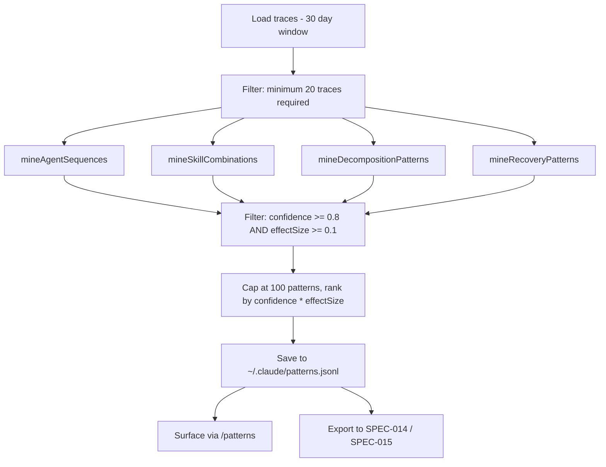

<!--
status: draft
priority: medium
research_confidence: low
sources_count: 4
depends_on: [SPEC-003, SPEC-009]
enables: [SPEC-014]
created: 2026-03-08
updated: 2026-03-08
-->

# SPEC-011: Pattern Learning from Traces

## 0. Research Summary

### Fuentes Consultadas

| Tipo | Fuente | Relevancia |
|------|--------|------------|
| Spec | SPEC-003 (Trace Analytics) | Primary: enriched TraceEntry v2 schema (agents, skills, tokens, costUsd, durationMs, status), `queryTraces()` infrastructure, JSONL storage pattern |
| Spec | SPEC-009 (Pattern-Based Error Recovery) | Error pattern database with fix success rates, normalization patterns, JSONL at `~/.claude/error-patterns.jsonl` |
| Literature | Sequential pattern mining (GSP, PrefixSpan) | Frequent subsequence extraction from ordered event sequences; applicable to agent invocation chains |
| Literature | Association rule mining (Apriori, FP-Growth) | Co-occurrence analysis for skill combinations; support/confidence/lift metrics |

### Decisiones Informadas por Research

| Decision | Basada en |
|----------|-----------|
| Simple frequency counting + conditional probability instead of full SPM/Apriori | Single-user <1000 traces/month; O(n) counting is fast and sufficient |
| Store patterns in JSONL (`~/.claude/patterns.jsonl`) | Consistent with SPEC-003 and SPEC-009; no relational queries needed |
| Batch analysis, not real-time | Pattern mining needs accumulated data; on-demand via `/patterns` avoids latency |
| Correlation only, not causation | Cannot establish causal relationships from observational trace data |

### Informacion No Encontrada

- Minimum trace volume for statistically significant patterns in LLM agent orchestration (no prior art)
- Empirical baselines for agent sequence lengths and skill combination sizes in multi-agent systems
- Optimal time windows for pattern decay (30 days assumed, needs validation)

### Confidence Assessment

| Area | Nivel | Razon |
|------|-------|-------|
| Frequency-based sequence mining | Medium | Well-established, but effectiveness depends on trace volume — unknown for this domain |
| Skill-outcome correlation | Medium | Conditional probability is sound; enough distinct combos in single-user data is uncertain |
| Decomposition pattern analysis | Low | Classifying "optimal" decomposition retroactively has fuzzy success criteria |
| Pattern confidence scoring | Medium | Standard statistical confidence intervals; minimum sample sizes (10+) are reasonable |
| Actionability of discovered patterns | Low | Patterns may be obvious or confounded; real value needs empirical validation |

---

## 1. Vision

### Press Release

Poneglyph discovers hidden patterns in how agents work together, which skill combinations produce the best results, and how tasks should be decomposed — all learned automatically from execution history. After 100 sessions, the system reports: "The sequence scout -> planner -> builder has 92% success rate for complexity >60, compared to 68% when skipping planner." It detects that loading `security-review` + `api-design` together correlates with 30% fewer retries on auth endpoints. These patterns surface via `/patterns` and feed into SPEC-014 (Skill Synthesis) for auto-generating skills from proven workflows.

### Background

SPEC-003 generates enriched trace data per session. SPEC-009 tracks error-fix patterns. But no higher-order analysis exists — patterns that could improve routing, skill selection, and decomposition remain invisible.

| Current Limitation | Impact |
|-------------------|--------|
| No workflow pattern detection | Successful agent sequences discovered by trial, not data |
| No skill combination analysis | Lead loads skills by keyword matching, not outcome data |
| No decomposition optimization | Complexity routing uses static thresholds, not empirical outcomes |
| No recovery path analysis | SPEC-009 tracks individual fixes, not multi-session recovery sequences |

### Target Metrics

| Metric | Target | How Measured |
|--------|--------|-------------|
| Actionable patterns discovered | 5+ per 100 sessions | Patterns with confidence >80% and effect size >20% |
| Pattern confidence threshold | >80% for surfaced patterns | Wilson score interval on success rate difference |
| Improvement when patterns applied | >10% success rate increase | Sessions following vs not following recommendations |
| Analysis latency | <500ms for 30-day window | Benchmark `minePatterns()` with 1000+ traces |
| False pattern rate | <20% | Patterns that lose significance after more data |

---

## 2. Goals & Non-Goals

### Goals

| # | Goal | Rationale |
|---|------|-----------|
| G1 | Mine frequent agent sequences and rank by success rate | Discover optimal agent orderings per task type |
| G2 | Analyze skill combinations correlated with success and low retries | Identify skill sets Lead should load together |
| G3 | Detect optimal decomposition patterns by complexity range | Learn when planner adds value vs overhead |
| G4 | Extract multi-session recovery patterns from error -> fix sequences | Complement SPEC-009 with workflow-level recovery strategies |
| G5 | Score all patterns with statistical confidence and effect size | Prevent surfacing noise as signal |
| G6 | Store patterns in `~/.claude/patterns.jsonl` | Persistent, aligned with existing storage |
| G7 | Surface patterns via `/patterns` slash command | User visibility into learned patterns |
| G8 | Export pattern data for SPEC-014 and SPEC-015 | Enable automated skill generation and orchestration tuning |

### Non-Goals

| # | Non-Goal | Reason |
|---|----------|--------|
| N1 | Real-time pattern detection during sessions | Batch analysis sufficient, avoids latency |
| N2 | Causal inference (X causes Y) | Observational data supports correlation only |
| N3 | Cross-user pattern sharing | Single-user system |
| N4 | Auto-applying patterns to change routing | Advisory only; SPEC-015 closes the loop |
| N5 | Pattern visualization (charts) | No web UI; textual `/patterns` is sufficient |
| N6 | ML model training | Statistical analysis sufficient for single-user volumes |

---

## 3. Alternatives Considered

| # | Alternativa | Pros | Contras | Veredicto |
|---|-------------|------|---------|-----------|
| 1 | Manual pattern documentation | High precision, curated | Doesn't scale; becomes stale; cognitive burden | **Rejected** |
| 2 | Full ML pipeline (embeddings, clustering) | Finds subtle patterns | Overkill for <1000 traces/month; needs GPU, training data | **Rejected** |
| 3 | Statistical correlation on JSONL (frequency, conditional probability) | Simple, fast, deterministic, explainable; no external deps | May miss non-linear patterns; needs minimum data volume | **Adopted** |
| 4 | LLM-based pattern extraction | Semantic understanding, natural language output | ~$0.50-5.00 per run; non-deterministic; recursive | **Rejected** |
| 5 | External process mining tools (ProM, Celonis) | Mature algorithms, rich visualization | Heavyweight deps; designed for enterprise, not agent traces | **Rejected** |

---

## 4. Design

### Core Types

```typescript
interface WorkflowPattern {
  id: string
  type: "sequence" | "skill_combo" | "decomposition" | "recovery"
  pattern: {
    agents?: string[]                   // Ordered agent sequence
    skills?: string[]                   // Skill combination
    taskType?: string                   // Task classification
    complexityRange?: [number, number]  // Complexity band
    recoverySteps?: string[]            // Recovery action sequence
  }
  outcome: {
    successRate: number                 // 0.0-1.0
    avgTokens: number
    avgDuration: number
    avgCost: number
    avgRetries: number
  }
  confidence: number                    // Statistical confidence 0.0-1.0
  effectSize: number                    // Improvement over baseline
  sampleSize: number
  firstSeen: string
  lastSeen: string
}

interface MiningConfig {
  timeWindowDays: number       // Default: 30
  minSupport: number           // Min occurrences (default: 5)
  minConfidence: number        // Min confidence (default: 0.8)
  minEffectSize: number        // Min improvement (default: 0.1)
}
```

### Mining Algorithms

| Pattern Type | Algorithm | Input | Output |
|-------------|-----------|-------|--------|
| Agent sequences | Frequent subsequence counting (length 2-4) | `trace.agents[]` ordered | Sequences where success rate > baseline |
| Skill combos | Conditional probability on subsets (size 2-3) | `trace.skills[]` + status | Skill sets where P(success\|skills) > P(success) |
| Decomposition | Binned statistics by complexity band | Agent count + estimated complexity + status | Optimal agent count per complexity range |
| Recovery | Sequential matching across sessions | Error traces -> success within 3 sessions | Multi-step recovery paths |

### Pipeline



### Algorithm Details

**Sequence Mining**: For each trace, extract all agent subsequences of length 2-4. Count occurrences and successes per unique subsequence. Compare success rate against global baseline. Apply Wilson score confidence interval at 95% level. Keep patterns where the lower bound of the confidence interval exceeds baseline.

**Skill Combination Mining**: For each trace with skills, generate all subsets of size 2-3. Count occurrences and successes per unique skill set (sorted alphabetically for deduplication). Same confidence filtering as sequence mining.

**Decomposition Mining**: Bin traces into complexity ranges [0-29], [30-59], [60-100] using a heuristic (`agentCount * 20 + tokenNormalized * 20`). Within each bin, group by unique agent count. Find the agent count with highest success rate (min 5 samples). Report if effect size >5% over bin baseline.

**Recovery Mining**: Sort traces chronologically. For each error trace, look ahead up to 3 sessions for a successful completion. Group recoveries by the agent sequence of the success trace. Patterns with 3+ occurrences are reported.

### Statistical Confidence (Wilson Score)

```typescript
function calculateConfidence(successes: number, total: number, baselineRate: number): number {
  if (total < 10) return 0
  const z = 1.96
  const phat = successes / total
  const denominator = 1 + z * z / total
  const centre = phat + z * z / (2 * total)
  const spread = z * Math.sqrt((phat * (1 - phat) + z * z / (4 * total)) / total)
  const lowerBound = (centre - spread) / denominator

  if (lowerBound > baselineRate) return Math.min(1.0, 0.8 + (lowerBound - baselineRate) * 2)
  return Math.max(0, lowerBound / baselineRate)
}
```

### Core Operations

| Function | Purpose | I/O |
|----------|---------|-----|
| `minePatterns(config?)` | Main orchestrator: loads traces, runs all miners, filters, saves | `MiningConfig -> WorkflowPattern[]` |
| `mineAgentSequences(traces, minSupport)` | Frequent subsequence mining | `TraceEntry[] -> WorkflowPattern[]` |
| `mineSkillCombinations(traces, minSupport)` | Conditional probability on skill sets | `TraceEntry[] -> WorkflowPattern[]` |
| `mineDecompositionPatterns(traces)` | Binned statistics by complexity | `TraceEntry[] -> WorkflowPattern[]` |
| `mineRecoveryPatterns(traces, errorPatterns)` | Cross-session recovery chains | `TraceEntry[], ErrorPattern[] -> WorkflowPattern[]` |
| `calculateConfidence(s, n, baseline)` | Wilson score confidence interval | `number, number, number -> number` |
| `loadPatterns()` / `savePatterns(patterns)` | JSONL I/O with corrupt line handling | `-> WorkflowPattern[]` / `WorkflowPattern[] -> void` |
| `estimateComplexity(trace)` | Heuristic complexity from agent count + tokens | `TraceEntry -> number` |

### Edge Cases

| Edge Case | Handling |
|-----------|----------|
| Fewer than 20 traces | Return empty; minimum threshold not met |
| All sessions successful (100% baseline) | No improvement possible; return empty |
| All sessions failed (0% baseline) | Any success becomes a pattern; apply stricter minSupport |
| No skills loaded in any session | Skill combo mining returns empty; other types unaffected |
| Pattern database grows indefinitely | Cap at 100; rank by `confidence * effectSize * recency` and prune |
| Corrupt JSONL lines | Skip on read; full rewrite on save eliminates corruption |
| Agent names change between versions | Old patterns stale; `lastSeen` >90 days triggers staleness flag |

### Dependencies

| Dependency | Type | Purpose |
|------------|------|---------|
| SPEC-003 (Trace Analytics) | Required | `queryTraces()`, TraceEntry v2 schema, JSONL trace files |
| SPEC-009 (Error Patterns) | Required | `loadErrorPatterns()` for recovery mining context |
| Bun runtime | Runtime | `Bun.file()`, `Bun.write()`, `crypto.randomUUID()` |

### Concerns

| Concern | Mitigation |
|---------|------------|
| Insufficient data volume | Min 20 traces; patterns need 5+ occurrences; graceful empty return |
| Spurious correlations | Wilson 95% CI; min effect size 10%; labeled as "correlation" |
| Pattern staleness | `lastSeen` tracking; 90+ day deprioritization; re-mining replaces |
| Computational cost | O(n*k) worst case; <500ms for 1000 traces; batch only |
| Confounding variables | Cannot control for task difficulty — acknowledged as correlation only |

### Stack Alignment

| Aspecto | Decision | Alineado |
|---------|----------|----------|
| Runtime | Bun native APIs | Yes — consistent with SPEC-003/009 |
| Storage | JSONL at `~/.claude/patterns.jsonl` | Yes — aligned with existing storage |
| Types | TypeScript strict, no `any` | Yes |
| Algorithms | Pure TypeScript, no external deps | Yes |
| Testing | `bun:test` with synthetic traces | Yes |

---

## 5. FAQ

**Q: How much trace data is needed before patterns become meaningful?**
A: Minimum 20 traces to attempt mining; individual patterns need 5+ occurrences. In practice, 50-100 sessions provide a reasonable foundation. Every pattern includes `sampleSize` and `confidence` for user judgment.

**Q: Won't patterns become stale as agents and skills evolve?**
A: Every pattern tracks `lastSeen`. Patterns not seen in 90+ days are deprioritized. The rolling 30-day window naturally phases out old patterns. Users can force re-mining via `/patterns --refresh`.

**Q: How are false correlations handled?**
A: Three safeguards: (1) Wilson score 95% confidence intervals. (2) Minimum 10% effect size filter. (3) Minimum sample size of 5. Despite these, some false correlations will surface — the system labels all patterns as "correlated with" not "causes".

**Q: Relationship between SPEC-011 and SPEC-009?**
A: SPEC-009 tracks individual error -> fix pairs. SPEC-011 mines multi-step recovery sequences across sessions. They are complementary: SPEC-009 provides granular fixes, SPEC-011 provides workflow-level recovery strategies.

**Q: How does this feed into SPEC-014 (Skill Synthesis)?**
A: SPEC-014 consumes `skill_combo` patterns to identify skill combinations that consistently produce good outcomes, then synthesizes composite skills from proven combinations.

---

## 6. Acceptance Criteria (BDD)

```gherkin
Feature: Pattern Mining from Traces
  Background:
    Given SPEC-003 trace analytics is implemented
    And patterns are stored in ~/.claude/patterns.jsonl

  Scenario: Agent sequence pattern discovery
    Given 50 traces where 30 contain the sequence ["scout", "builder"]
    And 25 of those 30 have status "completed" (83% success)
    And overall baseline success rate is 60%
    When pattern mining runs
    Then a "sequence" pattern is discovered for ["scout", "builder"]
    And its successRate is approximately 0.83
    And its effectSize is approximately 0.23
    And its confidence exceeds 0.8

  Scenario: Skill combination correlation
    Given 40 traces where 20 loaded ["security-review", "api-design"]
    And 18 of those 20 have status "completed" (90% success)
    And baseline success rate is 65%
    When pattern mining runs
    Then a "skill_combo" pattern is discovered for ["api-design", "security-review"]
    And its effectSize is approximately 0.25

  Scenario: Decomposition pattern by complexity
    Given 60 traces with estimated complexity 60-100
    And traces using 3+ agents have 85% success vs 55% for 1-2 agents
    When decomposition mining runs
    Then a "decomposition" pattern indicates 3-agent workflows are optimal

  Scenario: Recovery pattern extraction
    Given 10 error traces followed within 3 sessions by recovery
    And 6 recoveries used ["error-analyzer", "builder"]
    When recovery mining runs
    Then a "recovery" pattern is discovered with sampleSize 6

  Scenario: Insufficient data returns empty
    Given fewer than 20 traces in the time window
    When pattern mining runs
    Then no patterns are returned and no error is thrown

  Scenario: Low-support patterns filtered
    Given a sequence appears only 3 times with minSupport=5
    When mining runs
    Then no pattern is created for that sequence

  Scenario: Low-confidence patterns filtered
    Given a skill combo with 55% success vs 50% baseline (10 samples)
    When confidence is calculated
    Then confidence is below 0.8 and pattern is excluded

  Scenario: Pattern persistence across runs
    Given 5 discovered patterns saved to JSONL
    When loaded in a subsequent run
    Then all 5 are recovered with correct fields

  Scenario: Corrupt JSONL handling
    Given 10 valid lines and 2 corrupt lines
    When patterns are loaded
    Then 10 patterns are returned, corrupt lines skipped

  Scenario: Performance under load
    Given 1000 trace entries across 30 days
    When full mining runs
    Then analysis completes in less than 500ms

  Scenario: Pattern cap at 100
    Given mining produces 150 candidates
    When saved, only top 100 by (confidence * effectSize) are persisted

Feature: Pattern Export
  Scenario: SPEC-014 consumes skill_combo patterns
    Given discovered patterns include skill_combo types
    When SPEC-014 queries loadPatterns()
    Then it receives WorkflowPattern[] with skills, outcome, confidence

  Scenario: SPEC-015 consumes all pattern types
    Given patterns of all types exist
    When SPEC-015 queries loadPatterns()
    Then all types are returned sorted by confidence descending
```

---

## 7. Open Questions

| # | Question | Impact | Proposed Resolution |
|---|----------|--------|---------------------|
| 1 | Minimum trace volume for reliable patterns — 50, 100, or 200? | Below threshold = noise; above = wasted compute | Start at 20 min; track stability across runs to determine empirically |
| 2 | How to communicate correlation vs causation? | Users may treat patterns as prescriptions | Label as "correlated with"; show confidence and sample size prominently |
| 3 | Should patterns auto-influence routing or remain advisory? | Auto-routing risks reinforcing biases | Advisory in SPEC-011; SPEC-015 closes loop with safeguards |
| 4 | Optimal time window — 7, 30, or 90 days? | Short = insufficient data; long = stale | Default 30 days; configurable; consider adaptive window |
| 5 | How to visualize in CLI? | Tables may not convey significance | Compact format: `type | pattern | success% | baseline% | confidence | samples` |
| 6 | Should mining account for project context? | Cross-project patterns may mislead | Defer: trace schema lacks project field; add in TraceEntry v3 |
| 7 | How to prevent feedback loops? | Pattern-following reinforces itself | Track "pattern-influenced" vs "organic" sessions; SPEC-015 responsibility |

---

## 8. Sources

| # | Source | Tipo | Relevancia |
|---|--------|------|------------|
| 1 | SPEC-003 (Trace Analytics) | Spec | Upstream: TraceEntry v2, `queryTraces()`, JSONL storage — provides all input data |
| 2 | SPEC-009 (Pattern-Based Error Recovery) | Spec | Error pattern database (`ErrorPattern`, `ErrorFix`) for recovery mining |
| 3 | Sequential pattern mining (GSP, Agrawal & Srikant 1996; PrefixSpan, Pei et al. 2001) | Literature | Theoretical foundation; simplified to frequency counting |
| 4 | Association rule mining (Apriori, Agrawal et al. 1994) | Literature | Conceptual basis for skill combination analysis |

---

## 9. Next Steps

| # | Task | Complejidad | Dependencia |
|---|------|-------------|-------------|
| 1 | Define `WorkflowPattern`, `PatternType`, `PatternOutcome`, `MiningConfig` interfaces in `.claude/hooks/lib/pattern-learning.ts` | Baja | SPEC-003, SPEC-009 implemented |
| 2 | Implement `computeOutcome()` and `calculateConfidence()` helpers | Baja | #1 |
| 3 | Implement `containsSubsequence()`, `generateSubsets()`, `estimateComplexity()` utilities | Baja | — |
| 4 | Implement `mineAgentSequences()` with frequent subsequence counting | Media | #2, #3 |
| 5 | Implement `mineSkillCombinations()` with conditional probability | Media | #2, #3 |
| 6 | Implement `mineDecompositionPatterns()` with binned statistics | Media | #2, #3 |
| 7 | Implement `mineRecoveryPatterns()` using SPEC-009 error context | Media | #2, SPEC-009 |
| 8 | Implement `minePatterns()` orchestrator with parallel mining and filtering | Media | #4-#7 |
| 9 | Implement `loadPatterns()` / `savePatterns()` JSONL I/O with corruption handling | Baja | #1 |
| 10 | Implement pattern cap (100 max) with ranking | Baja | #9 |
| 11 | Create `/patterns` slash command | Baja | #8, #9 |
| 12 | Create `.claude/hooks/lib/pattern-learning.test.ts`: test all 4 miners with synthetic data | Media | #4-#7 |
| 13 | Test confidence calculation edge cases (small samples, extreme rates) | Baja | #2 |
| 14 | Test JSONL persistence round-trip and corruption handling | Baja | #9 |
| 15 | Benchmark: verify <500ms mining time for 1000 traces | Baja | #8 |
| 16 | Document integration points for SPEC-014 and SPEC-015 | Baja | #9 |
