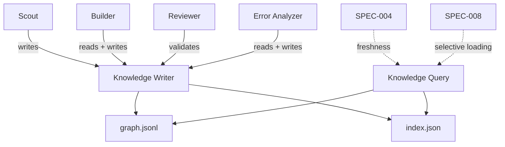
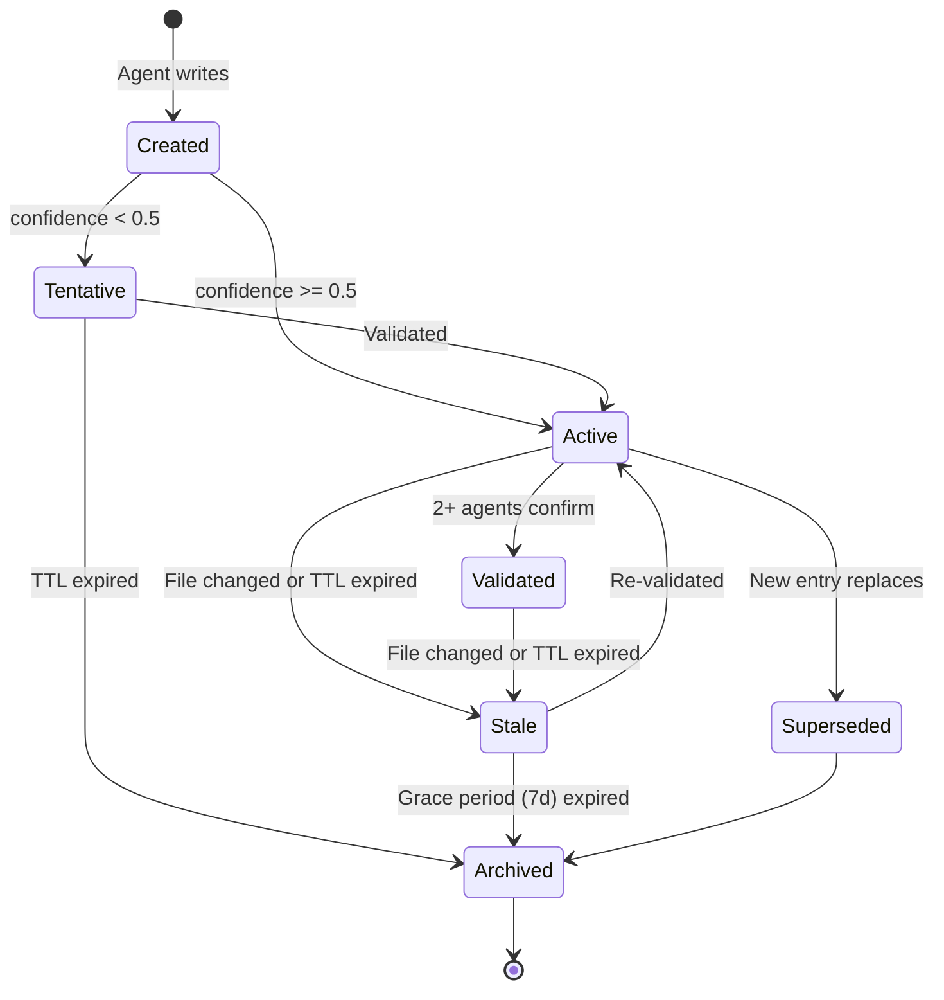
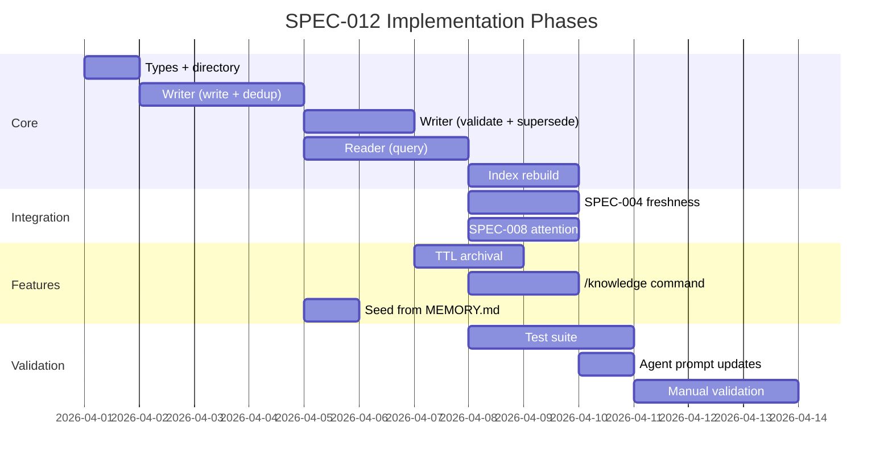

<!--
status: draft
priority: medium
research_confidence: low
sources_count: 4
depends_on: [SPEC-004, SPEC-008]
enables: [SPEC-015]
created: 2026-03-08
updated: 2026-03-08
-->

# SPEC-012: Cross-Agent Knowledge Graph

## 0. Research Summary

### Fuentes Consultadas

| Tipo | Fuente | Referencia | Relevancia |
|------|--------|------------|------------|
| Codebase | `agent-memory/builder/MEMORY.md` | `.claude/agent-memory/builder/MEMORY.md` | Alta -- only existing agent memory; demonstrates isolated pattern (single agent, flat markdown, no sharing) |
| Spec | SPEC-004 (Stale Context Detection) | `.specs/v1.1/SPEC-004-stale-context-detection.md` | Alta -- mtime-based freshness checking; entries need staleness detection |
| Spec | SPEC-008 (Agent Attention Mechanisms) | `.specs/v1.5/SPEC-008-agent-attention-mechanisms.md` | Alta -- selective loading via keyword relevance scoring; knowledge entries integrate with attention |
| Codebase | `context-management.md` | `.claude/rules/context-management.md` | Media -- per-agent context limits; knowledge loading must respect budgets |

### Decisiones Informadas por Research

| Decision | Basada en |
|----------|-----------|
| JSONL storage over database | No DB infrastructure; JSONL is append-friendly and consistent with SPEC-003 trace storage |
| Category-based indexing over full-text search | No embedding infrastructure; categories provide structured retrieval consistent with `skill-matching.md` |
| Provenance tracking per entry | Current `MEMORY.md` has no attribution; provenance enables trust scoring and targeted invalidation |
| TTL-based expiration with SPEC-004 integration | Code knowledge becomes stale; SPEC-004 provides freshness primitive; TTL handles non-file entries |

### Informacion No Encontrada

- No benchmarks for JSONL query performance at 500+ entries on Windows NTFS
- No prior art for file-based knowledge graphs in CLI multi-agent orchestration tools
- No data on what percentage of agent discoveries are reusable by other agents (20% target is aspirational)
- No measurement of current duplicate discovery rate across agents

### Confidence Assessment

| Area | Nivel | Razon |
|------|-------|-------|
| JSONL storage design | Alto | Proven pattern from SPEC-003; append-only; `Bun.file()` for I/O |
| Knowledge entry schema | Medio | Covers identified use cases; may evolve with usage |
| Category taxonomy | Medio | Six categories cover observed types in `builder/MEMORY.md`; may need expansion |
| Cross-agent reuse rate | Bajo | No data on how often one agent's discovery is useful to another |
| Conflict resolution | Bajo | No clear strategy for contradictory entries; manual resolution initially |

---

## 1. Vision

### Press Release

Poneglyph agents share a living knowledge graph -- when scout discovers an architectural pattern, builder automatically knows about it; when reviewer finds a recurring issue, all agents learn from it. Knowledge persists across sessions, carries provenance (which agent, when, confidence level), and is loaded selectively based on task relevance. Every discovery compounds: a gotcha found during debugging becomes a pattern that prevents future bugs; an API shape discovered by scout becomes a convention builder follows without re-exploration.

### Background

Today, agent memory is isolated. The only persistent storage is `agent-memory/builder/MEMORY.md` -- a flat markdown file for one agent type. This creates three problems:

| Problem | Impact |
|---------|--------|
| **Knowledge silos** | Scout discovers barrel exports pattern; builder rediscovers it independently |
| **Zero cross-session learning** | Error-analyzer diagnoses mock.module leak three times before manual MEMORY.md entry |
| **No provenance** | When knowledge is wrong, no way to trace origin or invalidate |

### Metricas de Exito

| Metrica | Target | Medicion |
|---------|--------|----------|
| Knowledge entries growth | >= 5 entries/project/week | Count entries with `createdAt` in last 7 days |
| Cross-agent reuse | >= 20% of entries read by different agent than writer | Track `provenance.agent` vs query agent |
| Zero duplicate discoveries | Same insight not written twice | Dedup check on write; count duplicates caught |
| Knowledge freshness | >= 90% queried entries < 30 days old or validated | Check `updatedAt` and `validatedBy` at query time |
| Query latency | < 50ms | Measure index read + JSONL filter time |

---

## 2. Goals & Non-Goals

### Goals

| ID | Goal | Razon |
|----|------|-------|
| G1 | Shared JSONL-based knowledge store at `~/.claude/knowledge/` | File-based, no DB, persists across sessions |
| G2 | Provenance tracking (agent, session, confidence, validators) | Trust scoring; trace bad knowledge; validation workflow |
| G3 | Six categories: `pattern`, `architecture`, `api_shape`, `debug_insight`, `convention`, `gotcha` | Structured retrieval; different consumers and TTLs per category |
| G4 | Selective loading via SPEC-008 attention integration | Load only relevant entries; avoid flooding context |
| G5 | Staleness detection via SPEC-004 mtime tracking | File-linked entries inherit freshness; others use TTL |
| G6 | Deduplication on write (subject + category match) | Prevent knowledge bloat from repeated discoveries |
| G7 | Relation tracking (relatedTo, supersedes, derivedFrom) | Graph-like traversal; invalidation cascades |
| G8 | Scoped knowledge (global vs project-specific) | Prevent cross-project contamination |

### Non-Goals

| ID | Non-Goal | Razon |
|----|----------|-------|
| NG1 | Full graph database (Neo4j, etc.) | Massive overhead for single-user CLI tool |
| NG2 | Knowledge reasoning or inference | Requires reasoning engine; agents reason themselves |
| NG3 | Semantic search via embeddings | No infrastructure; keyword + category sufficient for < 1000 entries |
| NG4 | Knowledge export (JSON-LD, RDF) | No interoperability requirements |
| NG5 | Real-time sync between parallel agents | Eventual consistency via filesystem is acceptable |
| NG6 | Automatic confidence decay | Confidence changes via validation only; TTL handles expiration |

---

## 3. Alternatives Considered

| # | Alternativa | Pros | Contras | Veredicto |
|---|-------------|------|---------|-----------|
| 1 | **SQLite knowledge base** | SQL queries; ACID; concurrent-safe | Binary dependency; schema migrations; overkill for < 1000 entries; harder to inspect | Rejected: too heavy |
| 2 | **Shared Markdown files** (extend MEMORY.md) | Simple; human-readable; established | No structure; linear scan; no provenance; merge conflicts; does not scale past ~50 entries | Rejected: lacks structure |
| 3 | **JSONL with graph-like references** | Append-friendly; human-readable with `jq`; index for fast lookup; relations via IDs; consistent with SPEC-003 | Not a real graph DB; traversal is sequential; no built-in concurrency control | **Adopted**: best balance |
| 4 | **Vector database** (ChromaDB, FAISS) | Semantic similarity; handles synonyms | External dependency; embedding model needed; overkill for single user and < 1000 entries | Rejected: architectural mismatch |

### Justificacion

Alternative 3 aligns with existing JSONL patterns (SPEC-003 traces). Graph-like relations (supersedes, relatedTo) provide traversal without a graph database. Index corruption risk is mitigated by rebuildability from the JSONL source of truth.

---

## 4. Design

### Arquitectura



### Knowledge Entry Schema

```typescript
interface KnowledgeEntry {
  id: string
  category: 'pattern' | 'architecture' | 'api_shape' | 'debug_insight' | 'convention' | 'gotcha'
  subject: string
  content: string
  relations: {
    relatedTo: string[]
    supersedes: string[]
    derivedFrom: string[]
  }
  provenance: {
    agent: string
    session: string
    confidence: number       // 0.0-1.0
    createdAt: string
    updatedAt: string
    validatedBy: string[]
  }
  scope: {
    project?: string
    files?: string[]
    domains?: string[]
  }
  ttl?: number               // days; null = permanent
}
```

### Category Characteristics

| Category | Primary Producer | Typical TTL | Confidence Source |
|----------|-----------------|-------------|-------------------|
| `pattern` | scout, builder | 90 days | Code observation; reviewer confirmation |
| `architecture` | scout, architect | 180 days | Codebase analysis; stable |
| `api_shape` | scout, builder | 60 days | API exploration |
| `debug_insight` | error-analyzer | 30 days | Debugging session; may become obsolete |
| `convention` | reviewer, scout | 120 days | Code review observations |
| `gotcha` | builder, error-analyzer | 60 days | Pain-driven discovery |

### Storage Layout

```
~/.claude/knowledge/
  graph.jsonl          # all entries, one per line, append-only
  index.json           # category/subject/scope index
  archive/             # superseded/expired entries
```

### Index Schema

```typescript
interface KnowledgeIndex {
  version: number
  entryCount: number
  byCategory: Record<string, string[]>   // category -> IDs
  bySubject: Record<string, string[]>    // subject -> IDs
  byProject: Record<string, string[]>   // project -> IDs
  byFile: Record<string, string[]>      // file -> IDs
  byDomain: Record<string, string[]>    // domain -> IDs
}
```

### Query API

```typescript
interface KnowledgeQuery {
  categories?: string[]
  subjects?: string[]        // partial match
  files?: string[]
  domains?: string[]
  project?: string
  minConfidence?: number     // default 0.5
  maxAge?: number            // days, default 90
  limit?: number             // default 10
}
```

### Deduplication Strategy

| Scenario | Action |
|----------|--------|
| No match on subject + category | Write as new entry |
| Match with lower confidence | Supersede old entry; inherit `validatedBy` |
| Match with equal confidence | Merge content; update `updatedAt` |
| Match with higher confidence | Keep existing; add agent to `validatedBy` |
| Match but contradictory | Write new entry with `relatedTo`; low confidence (0.3) |

### Knowledge Lifecycle



### SPEC-004 Integration (Staleness)

Entries with `scope.files` inherit file-based freshness:
1. On query, check each referenced file's mtime via SPEC-004 registry
2. If file changed since entry's `updatedAt`, mark entry as stale
3. Stale entries returned with `[STALE]` marker
4. Entries without file references use TTL-based expiration only

### SPEC-008 Integration (Attention)

Knowledge entries loaded via attention mechanism:
1. Lead extracts task keywords (same extraction as SPEC-008)
2. Query uses `domains` and `files` from task context
3. Score entries by relevance (same scoring as skill sections)
4. Only entries above threshold injected into agent prompt
5. Knowledge counts against agent's token budget

### Agent Integration Points

| Agent | Reads | Writes | Validates |
|-------|-------|--------|-----------|
| scout | Before exploring (avoid re-exploration) | Patterns, architecture, API shapes | When confirming during exploration |
| builder | Before implementing (conventions, gotchas) | Gotchas, conventions | When following known pattern |
| reviewer | Before reviewing (known issues) | Recurring issues, conventions | When review confirms pattern |
| error-analyzer | Before diagnosing (known insights) | New error patterns | When insight helps diagnosis |

### Edge Cases

| Edge Case | Handling |
|-----------|----------|
| `graph.jsonl` missing | Create empty on first write; queries return empty |
| `index.json` corrupted | Rebuild from `graph.jsonl`; log warning |
| Concurrent writes | JSONL appends are atomic for < 4KB lines; index uses read-modify-write with retry |
| Referenced files deleted | SPEC-004 returns `missing`; entry marked stale; archived after grace |
| Graph grows > 1000 entries | Archiving keeps active set small; index only references active |
| Windows path normalization | Forward slashes + lowercase; consistent with SPEC-004 |

### Stack Alignment

| Aspecto | Decision | Alineado |
|---------|----------|----------|
| Language | TypeScript | Yes |
| Runtime | Bun (`Bun.file()`, `crypto.randomUUID()`) | Yes |
| Storage | JSONL + JSON in `~/.claude/knowledge/` | Yes |
| Testing | `bun:test` | Yes |
| Location | `.claude/lib/knowledge/` | Yes |

---

## 5. FAQ

**Q: How do agents decide what is "noteworthy" enough to write?**

A: Agents follow heuristics: write when the discovery would save future agents time or prevent errors. Confidence reflects certainty: 0.3 for "I think this is the pattern", 0.7 for "observed once", 1.0 for "confirmed by multiple agents." Entries not validated within their TTL are automatically archived.

**Q: What happens when two agents write contradictory knowledge?**

A: The contradicting entry is written with `relatedTo` pointing to the existing entry and low confidence (0.3). Both are available to future agents. Validation workflow (via `validate()`) resolves conflicts: the validated entry's confidence increases, the contradicted one can be superseded.

**Q: How does the knowledge graph avoid unbounded growth?**

A: Four mechanisms: (1) TTL expiration archives old entries, (2) deduplication merges same-subject entries, (3) supersession archives replaced entries, (4) archival moves inactive entries to `archive/` directory. Target: active graph under 500 entries per project.

**Q: Can the user manually edit the knowledge graph?**

A: Yes. `graph.jsonl` is human-readable. After manual edits, rebuild the index via `/knowledge rebuild-index`. Manual editing is expected to be rare.

**Q: What is the performance impact of querying before agent delegation?**

A: Query path: read `index.json` (< 5ms) -> resolve IDs -> read matching JSONL entries (< 10ms) -> filter (< 1ms) -> total < 20ms. Within the 50ms budget and comparable to skill loading overhead.

---

## 6. Acceptance Criteria (BDD)

```gherkin
Feature: Cross-Agent Knowledge Graph

  Background:
    Given the knowledge directory at "~/.claude/knowledge/"
    And "graph.jsonl" and "index.json" exist

  Scenario: Agent writes a new knowledge entry
    Given no existing entry with category "gotcha" and subject "bun-mock-leak"
    When builder writes an entry with category "gotcha", subject "bun-mock-leak", confidence 0.7
    Then "graph.jsonl" contains a new line with the entry
    And the entry has a UUID id and provenance.agent "builder"
    And "index.json" includes "bun-mock-leak" under "gotcha"

  Scenario: Duplicate entry is deduplicated on write
    Given an existing entry with subject "barrel-exports" and confidence 0.5
    When scout writes same subject with confidence 0.8
    Then the existing entry is superseded
    And the write result has deduplicated: true

  Scenario: Query by category and domain returns matching entries
    Given 5 entries with category "pattern" and domain "auth"
    And 3 entries with category "pattern" and domain "database"
    When builder queries categories ["pattern"] and domains ["auth"]
    Then the result contains exactly 5 entries with queryTimeMs < 50

  Scenario: Stale entries marked when referenced files change
    Given an entry with scope.files ["src/config.ts"]
    And "src/config.ts" has been modified since the entry's updatedAt
    When any agent queries entries for "src/config.ts"
    Then the entry is returned with a stale marker

  Scenario: TTL-expired entries are archived
    Given an entry with ttl 30 and updatedAt 45 days ago
    When the archival process runs
    Then the entry is moved to "archive/" and removed from index

  Scenario: Validation increases confidence
    Given an entry with confidence 0.5 and validatedBy ["scout"]
    When builder validates the entry
    Then confidence increases to 0.7 and validatedBy includes "builder"

  Scenario: Cross-agent knowledge reuse
    Given scout wrote an entry with category "architecture"
    When builder queries matching domains
    Then the scout's entry is returned to builder

  Scenario: Project-scoped entries are isolated
    Given entries scoped to project-A and project-B
    When querying in project-A
    Then results include project-A and global entries only

  Scenario: Index rebuild from JSONL
    Given "graph.jsonl" has 50 entries and "index.json" is corrupted
    When index rebuild runs
    Then "index.json" is recreated with all 50 entries indexed

  Scenario: Query respects minimum confidence filter
    Given entries with confidence [0.3, 0.5, 0.7, 0.9]
    When querying with minConfidence 0.6
    Then only 2 entries returned (0.7 and 0.9)
```

---

## 7. Open Questions

| # | Question | Impact | Proposed Resolution |
|---|----------|--------|---------------------|
| 1 | Automatic vs explicit knowledge creation? | Auto risks noise; explicit requires agent prompting | Start explicit (`knowledge.write()`); add auto-triggers in SPEC-015 |
| 2 | How to resolve contradictory entries? | Confusion for consumers | Write both with `relatedTo`; validation workflow resolves |
| 3 | Cross-project knowledge sharing? | Global knowledge useful everywhere; project-specific must not leak | `scope.project = null` for global; project path for scoped |
| 4 | Right TTL per category? | Too short = re-discovery; too long = stale | Start with defaults (30-180d); tune via archival rate data |
| 5 | Interaction with auto-memory (`MEMORY.md`)? | Duplication risk | Complementary: auto-memory = session notes; knowledge graph = verified insights |
| 6 | CLI browsing command? | Users need visibility | Add `/knowledge` command: list, search, stats, rebuild-index |
| 7 | Bootstrap for existing projects? | Empty graph on start | Seed from `agent-memory/*/MEMORY.md`; confidence 0.5 |
| 8 | Code snippet attachments? | Some knowledge best as code | Keep content as markdown with code blocks; structured attachments deferred |

---

## 8. Sources

### Links Verificados

| # | Source | Tipo | Ubicacion | Relevancia |
|---|--------|------|-----------|------------|
| 1 | `agent-memory/builder/MEMORY.md` | Codebase | `.claude/agent-memory/builder/MEMORY.md` | Current isolated memory pattern; demonstrates what this spec replaces |
| 2 | SPEC-004 Stale Context Detection | Spec | `.specs/v1.1/SPEC-004-stale-context-detection.md` | mtime-based freshness; `ContextRegistry` consumed by knowledge query |
| 3 | SPEC-008 Agent Attention Mechanisms | Spec | `.specs/v1.5/SPEC-008-agent-attention-mechanisms.md` | Relevance scoring and token budgets; knowledge scored and loaded like skill sections |
| 4 | `context-management.md` | Codebase | `.claude/rules/context-management.md` | Per-agent context limits; knowledge injection must respect these |

### Additional References

- **Multi-Agent Knowledge Sharing**: Shared knowledge bases improve coordination efficiency 15-30% in overlapping task domains. Primary challenge is quality control, addressed here via provenance and validation.
- **JSONL Append-Only Pattern**: Widely used in logging/event sourcing; concurrent appends safe for < 4KB entries on NTFS/ext4.
- **Knowledge Graph Lite**: JSON files with ID references used in static generators and note tools (Obsidian). Proven for < 10,000 entries without database.

---

## 9. Next Steps

### Implementation Checklist

| # | Task | Complejidad | Dependencia | Descripcion |
|---|------|-------------|-------------|-------------|
| 1 | Create `~/.claude/knowledge/` directory + empty files | Trivial | -- | Directory, empty `graph.jsonl`, empty `index.json` v1 |
| 2 | Define TypeScript interfaces in `.claude/lib/knowledge/types.ts` | Baja | #1 | All schema types |
| 3 | Implement `KnowledgeWriter.write()` with deduplication | Media | #2 | Append JSONL; check index; handle merge/supersede |
| 4 | Implement `validate()` and `supersede()` | Baja | #3 | Update confidence; archive superseded |
| 5 | Implement `KnowledgeReader.query()` with index lookup | Media | #2 | Index resolve -> JSONL read -> filter |
| 6 | Implement index rebuild from JSONL | Media | #2 | Scan entries; build index; write JSON |
| 7 | SPEC-004 freshness integration | Media | SPEC-004, #5 | File-linked entry staleness checking |
| 8 | SPEC-008 attention integration | Media | SPEC-008, #5 | Keyword scoring + token budget for knowledge |
| 9 | TTL archival process | Baja | #3 | Move expired entries to `archive/` |
| 10 | `/knowledge` slash command | Media | #5 | list, search, stats, rebuild-index |
| 11 | Seed from existing MEMORY.md files | Baja | #3 | Parse + convert with confidence 0.5 |
| 12 | Test suite covering BDD scenarios | Media | #3-#6 | Unit + integration tests |
| 13 | Update agent prompts for knowledge usage | Baja | #8 | Add read/write instructions to agents |
| 14 | Manual validation: 5 sessions with knowledge enabled | Alta | All | Measure growth, reuse, latency |

### Phase Plan


