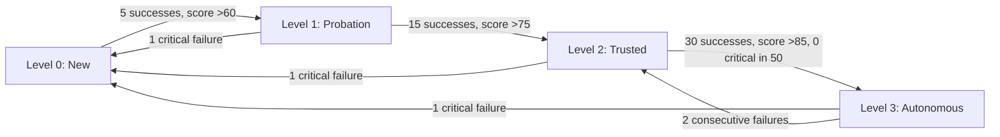

<!--
status: draft
priority: medium
research_confidence: low
sources_count: 4
depends_on: [SPEC-002, SPEC-006, SPEC-010]
enables: [SPEC-015]
created: 2026-03-08
updated: 2026-03-08
-->

# SPEC-013: Graduated Autonomy

## 0. Research Summary

### Fuentes Consultadas

| Tipo | Fuente | Relevancia |
|------|--------|------------|
| Spec | SPEC-002 (Git Worktree Isolation) | Safe isolation for autonomous agents; worktree containment limits blast radius of trust errors |
| Spec | SPEC-006 (Continuous Validation) | Background validation as safety net at all trust levels; replaces mandatory reviewer for Level 2-3 |
| Spec | SPEC-010 (Agent Performance Scoring) | Provides `AgentScore` with `compositeScore`, `trend`, `successRate` — primary input for trust calculation |
| Code | `.claude/rules/lead-orchestrator.md` | Current oversight model: reviewer mandatory for multi-file changes, no trust differentiation |

### Decisiones Informadas por Research

| Decision | Basada en |
|----------|-----------|
| 4 trust levels (not binary or 3-level) | Binary is too coarse; 3 levels lack sufficient graduation; 4 levels provide meaningful behavioral differences at each step |
| Consecutive successes as promotion metric | A high composite score from mixed results is less trustworthy than an unbroken success streak |
| Immediate demotion on critical failure | Trust is asymmetric: many successes to build, one critical failure to destroy; mirrors safety-critical systems |
| Continuous validation (SPEC-006) as universal safety net | Even Level 3 agents need a safety net; continuous validation provides this without human overhead |
| Per agent-taskType trust (not global per agent) | A builder trusted for implementation may not be trusted for security changes; trust must be scoped |

### Informacion No Encontrada

- No established frameworks for trust calibration in multi-agent LLM systems (field too new)
- No empirical data on optimal promotion thresholds (5/15/30 are estimates requiring validation)
- No benchmark for acceptable escaped-bug rates at different trust levels

### Confidence Assessment

| Area | Nivel | Razon |
|------|-------|-------|
| Trust level model (4 levels) | Medium | Well-reasoned but specific oversight rules per level are theoretical |
| Promotion criteria (consecutive successes + scores) | Low | Thresholds not empirically derived; too low risks premature autonomy, too high means Level 3 is unreachable |
| Demotion triggers | Medium | Immediate demotion for critical failures is correct; "critical" vs "major" classification needs care |
| Safety invariants | High | Non-negotiable regardless of trust; well-established in safety engineering |

---

## 1. Vision

### Press Release

Poneglyph adapts its oversight to each agent's proven track record. Trusted builders work autonomously with background validation; new or struggling agents get full review. The system earns its autonomy through demonstrated reliability, not configuration flags.

A builder that completes 30 implementations without a critical failure earns Level 3 (Autonomous) status: it works without reviewer overhead, relying on SPEC-006's continuous validation as its safety net. If it fails, trust drops immediately, and oversight increases until the track record is rebuilt.

### Background

| Current Behavior | Problem |
|-----------------|---------|
| Reviewer mandatory for ALL multi-file changes | Adds latency and token cost even for agents with perfect track records |
| No trust differentiation between agents | A builder succeeding 100 times gets the same scrutiny as one on its first task |
| User confirmation required for all risky operations | Interrupts flow for routine operations the agent handles reliably |
| No mechanism to reduce oversight over time | System never becomes more efficient regardless of accumulated success |

### Metricas de Exito

| Metrica | Target | Medicion |
|---------|--------|----------|
| Reduction in unnecessary reviewer calls | 50% fewer for Level 2-3 agents | Compare reviewer count over 100 sessions |
| Escaped bugs | Zero increase vs current rate | Track bugs found post-implementation over 50 sessions |
| Trust levels automatically updated | 100% of agent-taskType pairs with >5 sessions have a trust level | Query `agent-trust.jsonl` |
| Demotion response time for critical failures | Immediate (same session) | Verify demotion occurs within the failure session |

---

## 2. Goals & Non-Goals

### Goals

| ID | Goal | Razon |
|----|------|-------|
| G1 | 4-level trust system with distinct oversight behaviors | Each level must have measurably different oversight |
| G2 | Automatic promotion based on consecutive successes and SPEC-010 scores | Data-driven promotion ensures objectivity |
| G3 | Automatic demotion with severity-proportional response | Critical failures = immediate reset; minor = proportional |
| G4 | Configurable thresholds for promotion criteria | Different risk tolerances require different calibration |
| G5 | Safety nets at every level via SPEC-002 + SPEC-006 | Graduated safety nets, not absent ones |
| G6 | Audit trail of all trust decisions | Essential for debugging and trust calibration |
| G7 | Trust scoped per agent-taskType pair | Prevents over-generalization of competence |
| G8 | User override capability at all levels | System is advisory, not authoritative |

### Non-Goals

| ID | Non-Goal | Razon |
|----|----------|-------|
| NG1 | Full unsupervised operation (no safety net) | Even Level 3 has continuous validation; never truly unsupervised |
| NG2 | Trust for destructive git operations | Irreversible operations always require user confirmation |
| NG3 | Removing user override capability | User is always the ultimate authority |
| NG4 | Auto-adjusting thresholds | Deferred to SPEC-015 (Self-Optimizing Orchestration) |
| NG5 | Trust transfer between agents | Each agent builds trust independently |

---

## 3. Alternatives Considered

| # | Alternativa | Pros | Contras | Veredicto |
|---|-------------|------|---------|-----------|
| 1 | **Binary trust (review or not)** | Simple to implement | Too coarse; no intermediate states; no graduation path | **Rechazada** |
| 2 | **Per-task trust (each task independently assessed)** | Maximum granularity | Too granular; no benefit from track record; overhead negates gains | **Rechazada** |
| 3 | **4-level graduated system** | Meaningful behavioral differences; clear criteria; leverages SPEC-010 | More complex; thresholds initially arbitrary | **Adoptada** |
| 4 | **User-set trust (manual assignment)** | Full user control | Does not scale (16 agents x N task types); does not adapt | **Rechazada** |

The 4-level system provides clear behavioral contracts per level, meaningful promotion milestones, a simple mental model ("this builder is Trusted"), and direct composability with SPEC-002 worktrees, SPEC-006 validation, and SPEC-010 scores.

---

## 4. Design

### 4.1 Trust Level Flow



### 4.2 Data Model

```typescript
interface AgentTrust {
  agent: string
  taskType: string
  level: 0 | 1 | 2 | 3
  score: number           // from SPEC-010
  consecutiveSuccesses: number
  consecutiveFailures: number
  totalSessions: number
  criticalFailuresInLast50: number
  lastFailure?: string    // ISO date
  lastSuccess?: string
  promotedAt?: string
  demotedAt?: string
  lastActivity: string
  history: TrustEvent[]
}

interface TrustEvent {
  timestamp: string
  action: "promoted" | "demoted" | "reset" | "override"
  fromLevel: number
  toLevel: number
  reason: string
}
```

### 4.3 Promotion Criteria

| From | To | Criteria |
|------|----|----------|
| 0 (New) | 1 (Probation) | 5 consecutive successes AND compositeScore >60 |
| 1 (Probation) | 2 (Trusted) | 15 consecutive successes AND compositeScore >75 |
| 2 (Trusted) | 3 (Autonomous) | 30 consecutive successes AND compositeScore >85 AND 0 critical failures in last 50 |

### 4.4 Demotion Triggers

| Trigger | Action | Rationale |
|---------|--------|-----------|
| 1 critical failure (data loss, security) | Immediate to Level 0 | Fundamental trust violation; full reset |
| 2 consecutive major failures | Demote 1 level | Pattern, not fluke; proportional response |
| Score drops below level threshold | Demote 1 level | Gradual degradation = proportional oversight increase |
| 30 days inactive on taskType | Reset to max Level 1 | Skills/codebase may have changed; re-earn trust |

### 4.5 Failure Classification

| Severity | Examples | Demotion |
|----------|----------|----------|
| Critical | Data loss, security vulnerability, secrets committed, out-of-scope files | Immediate to Level 0 |
| Major | Test failures not caught, reviewer NEEDS_CHANGES on critical issues, type errors in production | Count toward consecutive (2 = demote 1) |
| Minor | Lint warnings, style issues, non-blocking suggestions | No demotion; does not break success streak |

### 4.6 Oversight by Level

| Level | Worktree (SPEC-002) | Reviewer | User Confirm | Validation (SPEC-006) |
|-------|---------------------|----------|-------------|----------------------|
| 0 New | Required | Mandatory | Yes (risky ops) | Full |
| 1 Probation | Required | Mandatory | No (routine) | Full |
| 2 Trusted | Optional | Spot check (20%) | No | Continuous (background) |
| 3 Autonomous | Optional | None | No | Continuous (background) |

At Level 2, 20% of tasks are randomly selected for spot-check review. Spot check results count toward trust tracking (success increments streak, NEEDS_CHANGES counts as failure).

### 4.7 Safety Invariants (NEVER bypassed)

| Invariant | Applies To |
|-----------|-----------|
| Destructive git operations require user confirmation | All levels |
| Security-sensitive changes get security-auditor review | All levels |
| Files outside project scope always flagged | All levels |
| Secrets in code always blocked | All levels |
| User can force full oversight at any time | All levels |

### 4.8 Oversight Decision Function

```typescript
function determineOversight(
  trust: AgentTrust,
  config: TrustConfig,
  taskContext: TaskContext,
): OversightDecision {
  // Safety invariants override trust
  if (taskContext.isSecuritySensitive) {
    return { useWorktree: true, requireReviewer: true, requireUserConfirmation: true, validationMode: "full", spotCheck: false }
  }
  if (taskContext.isDestructiveGit) {
    return { useWorktree: trust.level < 2, requireReviewer: trust.level < 2, requireUserConfirmation: true, validationMode: "full", spotCheck: false }
  }

  switch (trust.level) {
    case 0: return { useWorktree: true, requireReviewer: true, requireUserConfirmation: taskContext.isRisky, validationMode: "full", spotCheck: false }
    case 1: return { useWorktree: true, requireReviewer: true, requireUserConfirmation: false, validationMode: "full", spotCheck: false }
    case 2: return { useWorktree: false, requireReviewer: Math.random() < config.spotCheckRate, requireUserConfirmation: false, validationMode: "continuous", spotCheck: true }
    case 3: return { useWorktree: false, requireReviewer: false, requireUserConfirmation: false, validationMode: "continuous", spotCheck: false }
  }
}
```

### 4.9 Storage

`~/.claude/agent-trust.jsonl` — one line per agent-taskType trust record:

```jsonl
{"agent":"builder","taskType":"implementation","level":2,"score":82,"consecutiveSuccesses":18,"consecutiveFailures":0,"totalSessions":45,"criticalFailuresInLast50":0,"lastActivity":"2026-03-08T14:30:00Z","history":[]}
{"agent":"builder","taskType":"debugging","level":0,"score":45,"consecutiveSuccesses":2,"consecutiveFailures":0,"totalSessions":5,"criticalFailuresInLast50":0,"lastActivity":"2026-03-07T09:00:00Z","history":[]}
```

File size bounded by agents x taskTypes (max ~144 entries). On update: read all, modify relevant entry, rewrite.

### 4.10 Edge Cases

| Edge Case | Handling |
|-----------|----------|
| Cold start (0 sessions) | Default Level 0; all oversight active |
| Promoted then immediately fails | Demotion applies; promotion grants no immunity |
| User overrides trust to Level 3 | Recorded as TrustEvent "override"; auto demotion resumes on failure |
| Multiple failures in single session (retries) | Each retry failure increments consecutiveFailures; final success resets to 0 |
| Score oscillates around threshold | No rapid level changes; promotion requires score AND consecutive successes |
| Trust file corrupted | All agents default to Level 0; log warning |
| New task type for established agent | Starts at Level 0 independently |

### 4.11 Dependencies

| Dependency | Type | Purpose |
|------------|------|---------|
| SPEC-002 (Worktree Isolation) | Spec | Worktree required at Level 0-1; optional at Level 2-3 |
| SPEC-006 (Continuous Validation) | Spec | Background validation as safety net for Level 2-3 |
| SPEC-010 (Performance Scoring) | Spec | compositeScore, trend, successRate for promotion/demotion |
| `lead-orchestrator.md` | Code | Lead queries trust before delegation, updates after completion |
| Bun runtime | Runtime | `Bun.file()`, `Bun.write()`, JSON parsing |

### 4.12 Concerns

| Concern | Mitigation |
|---------|------------|
| Premature autonomy (thresholds too low) | 30 consecutive successes for Level 3 is a high bar; thresholds configurable |
| Trust stagnation (thresholds too high) | Monitor via audit trail; SPEC-015 may auto-tune |
| False security at Level 3 | Continuous validation (SPEC-006) + safety invariants provide non-negotiable nets |
| Cold start (all Level 0) | Expected and safe; maximum oversight relaxes as agents prove themselves |
| Trust data loss | Conservative default: all Level 0; safe because it maximizes oversight |

### 4.13 Stack Alignment

| Aspecto | Decision | Alineado |
|---------|----------|----------|
| Runtime | Bun native APIs | Yes — consistent with SPEC-003, SPEC-010 |
| Storage | JSONL at `~/.claude/agent-trust.jsonl` | Yes — same pattern as traces and scores |
| Language | TypeScript with strict types | Yes — project standard |
| Testing | `bun:test` with synthetic trust scenarios | Yes — existing infrastructure |
| Integration | Module imported by Lead Orchestrator | Yes — same pattern as score loading |

---

## 5. FAQ

**Q: Can the user override trust levels?**
A: Yes. Override is recorded as a `TrustEvent`; automatic promotion/demotion resumes normally afterward. An override does not grant permanent immunity from demotion on failure.

**Q: What about new task types for an established agent?**
A: Trust is per agent-taskType. A builder at Level 3 for "implementation" starts at Level 0 for "debugging". Each task type's trust is earned independently.

**Q: How does trust decay work?**
A: If an agent-taskType pair has no activity for 30 days, trust is capped at Level 1 on next use. The agent re-earns higher trust through new consecutive successes.

**Q: What is the difference between Level 2 spot checks and Level 1 mandatory review?**
A: Level 1: every task reviewed (mandatory, blocking). Level 2: 20% of tasks randomly selected for review; 80% rely on SPEC-006 continuous validation. Spot check results affect trust tracking.

**Q: How are critical vs major failures distinguished?**
A: Classification in Section 4.5 is deterministic. Critical = data loss, security, secrets, out-of-scope. Major = test regressions, type errors, reviewer critical issues. Borderline cases default to "major".

**Q: How much latency does trust evaluation add?**
A: Negligible (<5ms). Reading ~144 JSONL entries, performing a lookup, and checking conditions are in-memory operations.

---

## 6. Acceptance Criteria (BDD)

```gherkin
Feature: Graduated Autonomy Trust System
  Background:
    Given SPEC-010 scoring, SPEC-006 validation, and SPEC-002 worktrees are implemented
    And trust data is stored in ~/.claude/agent-trust.jsonl

  Scenario: Promotion from Level 0 to Level 1
    Given builder has trust level 0 with 4 consecutive successes and score 65
    When builder completes a successful session
    Then builder is promoted to Level 1
    And a TrustEvent is recorded with action "promoted" fromLevel 0 toLevel 1

  Scenario: Promotion from Level 1 to Level 2
    Given builder has trust level 1 with 14 consecutive successes and score 78
    When builder completes a successful session
    Then builder is promoted to Level 2
    And reviewer becomes optional (spot check only)

  Scenario: Promotion from Level 2 to Level 3
    Given builder has trust level 2 with 29 consecutive successes, score 88, and 0 critical in last 50
    When builder completes a successful session
    Then builder is promoted to Level 3
    And no reviewer is required

  Scenario: Promotion blocked by insufficient score
    Given builder has 5 consecutive successes but score 55
    When promotion is evaluated
    Then builder remains at Level 0

  Scenario: Critical failure causes immediate demotion to Level 0
    Given builder has trust level 3 with 45 consecutive successes
    When builder introduces a security vulnerability
    Then builder is immediately demoted to Level 0
    And consecutiveSuccesses resets to 0

  Scenario: Two consecutive major failures demote one level
    Given builder has trust level 2
    When builder fails 2 consecutive sessions (major severity)
    Then builder is demoted to Level 1
    And reviewer becomes mandatory again

  Scenario: Score drop below threshold causes demotion
    Given builder has trust level 2 and score drops to 70
    When trust is evaluated
    Then builder is demoted to Level 1

  Scenario: Destructive git always requires confirmation regardless of trust
    Given builder has trust level 3
    When builder attempts git push --force
    Then user confirmation is required

  Scenario: Security changes always get security-auditor review
    Given builder has trust level 3
    When builder modifies authentication logic
    Then security-auditor review is triggered

  Scenario: Spot check at Level 2 finds issues
    Given builder has trust level 2 and spot check is triggered
    When reviewer returns NEEDS_CHANGES
    Then consecutiveSuccesses resets to 0 and consecutiveFailures increments

  Scenario: Inactivity resets trust to max Level 1
    Given builder has trust level 3 with last activity 35 days ago
    When Lead queries trust
    Then trust level is capped at 1

  Scenario: New task type starts at Level 0
    Given builder has trust level 3 for "implementation"
    When Lead queries trust for "security-audit"
    Then trust level is 0 with full oversight

  Scenario: User override
    Given builder has trust level 0
    When user sets trust to Level 3
    Then trust is set to 3 with TrustEvent action "override"
    And automatic demotion resumes on failure

  Scenario: Trust file corruption
    Given agent-trust.jsonl is corrupted
    When trust is loaded
    Then all agents default to Level 0
    And a warning is logged
```

---

## 7. Open Questions

| # | Question | Impact | Proposed Resolution |
|---|----------|--------|---------------------|
| 1 | Should trust transfer partially between similar task types? | Builder trusted for implementation likely has transferable skills to refactoring | Start with no transfer for safety. After 100+ sessions, analyze cross-taskType correlations. If >0.8, consider starting related types at Level 1. |
| 2 | Are promotion thresholds (5/15/30) optimal? | Too low = premature autonomy; too high = Level 3 unreachable | Track time-to-promotion and escaped-bug-rate. Defer auto-tuning to SPEC-015. |
| 3 | Should there be a trust dashboard beyond `/traces`? | Rich UI would help but Poneglyph has no web UI | Extend `/traces` with `--trust` flag showing trust levels table. Sufficient for v2.0. |
| 4 | How to handle sessions with multiple task types? | Mixed sessions complicate attribution | Follow SPEC-010 classification: primary task type only. Secondary types not updated. |
| 5 | Should consecutive success count include passive participation? | Agent in minor role (scout providing context) should not inflate trust | Only count sessions with substantive action (>100 tokens output). Passive participation excluded. |
| 6 | Optimal spot check rate for Level 2? | 20% is a heuristic; too low misses issues, too high negates efficiency | Start at 20%. If <5% find issues over 50 checks, lower to 10%. If >20% find issues, demote agent. |

---

## 8. Sources

| # | Source | Tipo | Relevancia |
|---|--------|------|------------|
| 1 | SPEC-002 (Git Worktree Isolation) | Spec | Worktree containment for Level 0-1 agents; limits blast radius of trust failures |
| 2 | SPEC-006 (Continuous Validation) | Spec | Background validation replaces mandatory reviewer for Level 2-3; the safety net enabling autonomy |
| 3 | SPEC-010 (Agent Performance Scoring) | Spec | `AgentScore` data for promotion/demotion; compositeScore, trend, successRate as direct inputs |
| 4 | `.claude/rules/lead-orchestrator.md` | Codebase | Current oversight model that graduated autonomy parameterizes by trust level |

---

## 9. Next Steps

### Implementation Checklist

| # | Task | Complejidad | Dependencia |
|---|------|-------------|-------------|
| 1 | Define `AgentTrust`, `TrustEvent`, `TrustConfig` interfaces in `.claude/hooks/lib/agent-trust.ts` | Baja | SPEC-010 implemented |
| 2 | Define `FailureSeverity` and classification rules | Baja | #1 |
| 3 | Implement `loadTrust`/`saveTrust` JSONL I/O with corruption recovery | Baja | #1 |
| 4 | Implement `checkPromotion` with 3-level promotion logic | Media | #1, #3 |
| 5 | Implement `demoteTo`/`demoteOneLevel` with TrustEvent recording | Baja | #1, #3 |
| 6 | Implement `classifyFailure` for critical/major/minor categorization | Media | #2 |
| 7 | Implement `updateTrust` main function wiring promotion, demotion, persistence | Media | #3-#6 |
| 8 | Implement `checkInactivityDecay` for 30-day reset | Baja | #1, #3 |
| 9 | Implement `determineOversight` for Lead integration | Media | #1 |
| 10 | Add graduated autonomy rules to `lead-orchestrator.md` | Baja | #9 |
| 11 | Update `error-recovery.md` with trust-aware demotion triggers | Baja | #6, #7 |
| 12 | Write tests: promotion logic (all transitions, blocked cases) | Media | #4 |
| 13 | Write tests: demotion logic (critical, consecutive, score, inactivity) | Media | #5, #6, #8 |
| 14 | Write tests: `determineOversight` with all levels and safety invariants | Media | #9 |
| 15 | Write tests: JSONL I/O with corruption recovery | Baja | #3 |
| 16 | Write integration test: 35-session simulation with mixed outcomes | Media | #7 |
| 17 | Extend `/traces` with `--trust` flag for trust levels display | Baja | #3 |
| 18 | Create Stop hook calling `updateTrust()` after score recalculation | Media | #7, SPEC-010 |
| 19 | Benchmark: <10ms trust evaluation latency | Baja | #9 |

### Rollout Plan

| Phase | Scope | Validation | Risk |
|-------|-------|------------|------|
| Phase 1 | Types, I/O, promotion/demotion (Steps 1-8) | `bun test` on unit tests | Low — pure data logic |
| Phase 2 | Lead integration, oversight decisions (Steps 9-11) | Manual testing with trust queries | Medium — changes oversight behavior |
| Phase 3 | Full test suite and automation (Steps 12-16, 18) | `bun test` + integration simulation | Medium — end-to-end correctness |
| Phase 4 | User features and benchmarks (Steps 17, 19) | Manual `/traces --trust`; benchmark | Low — additive |
