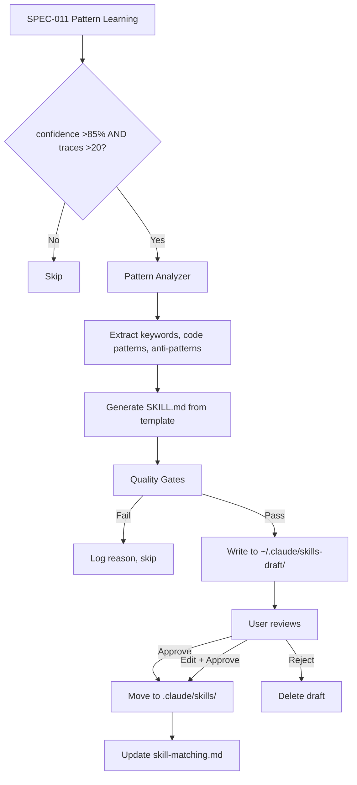

<!--
status: draft
priority: low
research_confidence: low
sources_count: 4
depends_on: [SPEC-005, SPEC-011]
enables: [SPEC-015]
created: 2026-03-08
updated: 2026-03-08
-->

# SPEC-014: Skill Synthesis

## 0. Research Summary

### Fuentes Consultadas

| Tipo | Fuente | Relevancia |
|------|--------|------------|
| Code | `.claude/skills/meta-create-skill/SKILL.md` | Defines SKILL.md format, frontmatter fields, skill types, directory conventions |
| Code | `.claude/rules/skill-matching.md` | Keyword-to-skill mappings; new skills must integrate into this table |
| Spec | SPEC-005 (Agent Skill Enrichment v2) | Skill composition rules, extended keyword table, reachability audit |
| Spec | SPEC-011 (Pattern Learning from Traces) | Provides discovered patterns with confidence scores and trace-backed evidence |

### Decisiones Informadas por Research

| Decision | Basada en |
|----------|-----------|
| Use `meta-create-skill` format for synthesized skills | Synthesized skills must be indistinguishable from manually-created ones |
| Human approval gate before activation | A single bad skill could degrade agent performance across all matching tasks |
| Draft directory (`~/.claude/skills-draft/`) for staging | Separates unreviewed content from active skills |
| Pattern confidence >85% as synthesis trigger | Aligns with SPEC-011's "high confidence" tier; lower thresholds produce noise |
| Keyword uniqueness check against existing skills | SPEC-005 assumes non-overlapping keyword spaces |

### Informacion No Encontrada

- No methodology for auto-generating LLM prompt content from execution patterns (nascent field)
- No benchmarks for skill quality metrics beyond format compliance
- No prior art in multi-agent orchestration systems that auto-evolve skill libraries

### Confidence Assessment

| Area | Nivel | Razon |
|------|-------|-------|
| Pipeline structure | Medium | Logical sequence but end-to-end flow is untested |
| Quality gates (format, uniqueness) | High | Deterministic checks; measurable thresholds |
| Content quality assessment | Low | Heuristics for "actionable" content may need iteration |
| Human approval workflow | High | Simple accept/reject with clear staging area |

---

## 1. Vision

### Press Release

Poneglyph evolves its own skill library. When patterns emerge from successful executions, the system synthesizes new skills -- tested, documented, and ready to use. The skill library grows organically from real experience, not just manual curation.

With Skill Synthesis, SPEC-011's Pattern Learning engine feeds discovered patterns into a synthesis pipeline. When a pattern reaches high confidence (>85%) with sufficient evidence (>20 traces), the system generates a draft skill with frontmatter, keywords, code patterns, anti-patterns, and real examples from traces. The draft lands in `~/.claude/skills-draft/` for user review. Approved skills integrate into the skill-matching system immediately.

The philosophy: "Pocos agentes + muchas skills = fortaleza." Agents stay stable while the skill library grows, encoding institutional knowledge that makes every agent smarter.

### Background

The system has 24 manually-created skills -- effective but static. SPEC-011 discovers recurring patterns from traces but those remain raw data, not actionable by agents. SPEC-014 bridges the gap by converting high-confidence patterns into fully-formed skills. The key constraint is safety: auto-generated content must be reviewed before activation.

### Metricas de Exito

| Metrica | Target | Medicion |
|---------|--------|----------|
| Skills auto-generated per month | 1-2 drafts | Count files in `~/.claude/skills-draft/` |
| Synthesized skill adoption | >70% used within 30 days | Track via SPEC-003 traces |
| Zero harmful skills deployed | 0 degradations | No reviewer failures from synthesized content |
| Draft quality | >80% pass all gates | Gate pass/fail ratio in synthesis logs |

---

## 2. Goals & Non-Goals

### Goals

| ID | Goal | Razon |
|----|------|-------|
| G1 | Pattern-to-skill pipeline from SPEC-011 patterns to SKILL.md | Automates pattern capture; no valuable pattern lost |
| G2 | Human approval gate before activation | Prevents bad skills from degrading performance |
| G3 | Quality validation: format, keyword uniqueness, content quality | Synthesized skills indistinguishable from manual ones |
| G4 | Integration with `meta-create-skill` format | Consistent SKILL.md structure and directory layout |
| G5 | Skill versioning (v1 synthesized, v2 refined) | Enables iteration without losing history |
| G6 | Draft staging at `~/.claude/skills-draft/` with notification | Clear review and activation workflow |
| G7 | Integration with SPEC-005 skill-matching after approval | Skills join keyword table and composition rules |
| G8 | Synthesis audit trail | Traceability from pattern to skill |

### Non-Goals

| ID | Non-Goal | Razon |
|----|----------|-------|
| NG1 | Fully autonomous deployment (no human review) | Too risky for orchestration content |
| NG2 | Replacing existing manually-created skills | Synthesized skills complement, not override |
| NG3 | Cross-project skill synthesis | Patterns may not transfer between projects |
| NG4 | Real-time synthesis during sessions | Background/post-session activity only |
| NG5 | Automatic keyword table updates | Avoid silent routing changes |
| NG6 | Skill deprecation automation | Requires long-term usage data |
| NG7 | Workflow/research skill synthesis | Initial scope: reference-type only |

---

## 3. Alternatives Considered

| # | Alternativa | Pros | Contras | Veredicto |
|---|-------------|------|---------|-----------|
| 1 | **LLM generates skills from scratch** | Any topic; not limited to observed patterns | No empirical basis; hallucination risk; expensive | **Rechazada** -- no data grounding |
| 2 | **Pattern-informed templates** (SPEC-011 data fills template) | Data-backed; consistent format; anti-patterns from errors | Requires SPEC-011; template filling non-trivial | **Adoptada** -- quality + consistency balance |
| 3 | **User requests skills** | Already works via `meta-create-skill`; highest quality | Does not scale; misses subtle patterns | **Complementaria** -- synthesis automates discovery |
| 4 | **Skill merging** (combine related existing skills) | Reduces fragmentation | Different problem; no new knowledge | **Complementaria** -- separate enhancement |

Pattern-informed templates provide data grounding (backed by N traces), quality floor (template ensures format), anti-pattern discovery (error traces), and incremental compounding value.

---

## 4. Design

### Arquitectura



### Core Interfaces

```typescript
interface SynthesizedSkill {
  name: string
  description: string
  triggers: string[]
  content: {
    patterns: string[]
    conventions: string[]
    antiPatterns: string[]
    examples: string[]
  }
  source: {
    patternId: string
    traceCount: number
    confidence: number
  }
  version: number
}

interface PatternData {
  id: string
  domain: string
  subject: string
  confidence: number
  traceCount: number
  successTraces: TraceReference[]
  errorTraces: TraceReference[]
  conventions: string[]
  codePatterns: CodePattern[]
}

interface CodePattern {
  description: string
  code: string
  language: string
  frequency: number
}

interface SynthesisResult {
  status: "created" | "skipped"
  skillName: string | null
  reason: string
  draftPath: string | null
  gateResults: QualityGateResult[]
}

interface QualityGateResult {
  gate: string
  passed: boolean
  detail: string
}
```

### Pipeline Steps

| Step | Input | Output | Logic |
|------|-------|--------|-------|
| 1. Trigger | PatternData | Go/No-Go | confidence >85% AND traceCount >20 |
| 2. Keywords | domain, subject, conventions | `string[]` | Extract terms; deduplicate against existing skills |
| 3. Content | codePatterns, conventions | Structured sections | Map to Patterns, When to Use, Checklist |
| 4. Anti-Patterns | errorTraces | Anti-pattern table | Extract "what went wrong" from error traces |
| 5. Template | Extracted content | SKILL.md content | Fill `meta-create-skill` reference template |
| 6. Validation | SKILL.md | Pass/Fail per gate | Run all quality gates |
| 7. Output | Validated SKILL.md | Draft file | Write to `~/.claude/skills-draft/`; log audit entry |

### Quality Gates

| Gate | Check | Threshold |
|------|-------|-----------|
| Format | Valid YAML frontmatter (`name`, `description`, `activation.keywords`) | Pass/Fail |
| Uniqueness | Keyword overlap with existing skills | <50% overlap |
| Confidence | Source pattern confidence | >85% |
| Sample Size | Contributing traces | >20 |
| Content Quality | Actionable content length | >500 chars |
| Name Uniqueness | No existing skill with same name | Unique (append `-v2` on collision) |

### Keyword Overlap Detection

```typescript
function calculateKeywordOverlap(
  candidateKeywords: string[],
  existingSkillKeywords: string[],
): number {
  if (candidateKeywords.length === 0) return 0
  const candidateSet = new Set(candidateKeywords.map(k => k.toLowerCase()))
  const existingSet = new Set(existingSkillKeywords.map(k => k.toLowerCase()))
  let overlapCount = 0
  for (const keyword of candidateSet) {
    if (existingSet.has(keyword)) overlapCount++
  }
  return overlapCount / candidateSet.size
}
```

### Skill Name Generation

```typescript
function generateSkillName(pattern: PatternData): string {
  const candidate = `${pattern.domain}-${pattern.subject}`
    .toLowerCase()
    .replace(/\s+/g, '-')
    .replace(/[^a-z0-9-]/g, '')
    .replace(/-+/g, '-')
    .replace(/^-|-$/g, '')
  return candidate.length > 40 ? candidate.slice(0, 40).replace(/-$/, '') : candidate
}
```

### Skill Evolution (v1 to v2)

When SPEC-011 discovers a refined version of a pattern already linked to a synthesized skill (via `source_pattern` frontmatter):

1. Synthesizer detects existing skill via `source_pattern` match
2. Generates v2 draft with updated content and diff summary
3. User reviews diff and decides whether to upgrade
4. Old version archived with `.v1.bak` suffix before replacement

### Edge Cases

| Edge Case | Handling |
|-----------|---------|
| Duplicate pattern | Name uniqueness gate catches; logs "already synthesized" |
| Multi-domain pattern | Generate for primary domain; mention secondary in description |
| Confidence drops post-synthesis | Approved skills not auto-retired; user removes manually |
| User ignores drafts | Accumulate harmlessly; reminder at >5 pending via `/traces` |
| Convention-only pattern (no code) | Skip Patterns section; generate Conventions + Checklist only |
| Very long code patterns (>100 lines) | Truncate to 30 lines with reference to source trace |

### Dependencias

| Dependency | Type | Purpose |
|------------|------|---------|
| SPEC-005 | Spec | Composition rules, keyword table, reachability audit |
| SPEC-011 | Spec | PatternData with confidence, conventions, code patterns |
| `meta-create-skill` | Skill | SKILL.md format, frontmatter, directory structure |
| `skill-matching.md` | Rule | Keyword table for approved skill integration |
| Bun runtime | Runtime | `Bun.file()`, `Bun.write()` |

### Concerns

| Concern | Mitigation |
|---------|------------|
| Content quality | Multiple gates + human review + v2 evolution for refinement |
| Keyword pollution | Uniqueness gate; `synthesized: true` frontmatter for filtering |
| Draft accumulation | Strict thresholds limit rate to 1-2/month; periodic purge |
| Template rigidity | Reference-type only initially; expand in future iterations |

### Stack Alignment

| Aspecto | Decision | Alineado |
|---------|----------|----------|
| Runtime | Bun native APIs | Yes -- SPEC-003/010 pattern |
| Draft storage | `~/.claude/skills-draft/{name}/SKILL.md` | Yes -- mirrors `.claude/skills/` |
| Audit log | `~/.claude/synthesis-log.jsonl` | Yes -- JSONL pattern |
| Skill format | `meta-create-skill` reference template | Yes -- consistency |

---

## 5. FAQ

**Q: How often does synthesis run?**
A: Triggered post-session when SPEC-011 detects a pattern crossing 85% confidence with >20 traces. Expected rate: 1-2 drafts per month. Pipeline runs in <5 seconds (template-filling, not LLM generation).

**Q: What if a synthesized skill conflicts with an existing one?**
A: Keyword uniqueness gate catches >50% overlap and skips synthesis, suggesting a merge instead. Below 50%, SPEC-005's composition engine handles co-existence.

**Q: Can the user edit synthesized skills?**
A: Yes. Drafts are standard SKILL.md files. The user edits freely before moving to `.claude/skills/`. The `synthesized: true` frontmatter is preserved for traceability.

**Q: What if the user ignores drafts?**
A: They accumulate harmlessly. At >5 pending, `/traces` includes a reminder. Users can batch-review or bulk-delete.

**Q: Are synthesized skills treated differently by enrichment?**
A: No. Once approved and in `.claude/skills/`, they are identical to manual skills for matching, composition, and agent limits.

---

## 6. Acceptance Criteria (BDD)

```gherkin
Feature: Skill Synthesis from Patterns
  Background:
    Given SPEC-011 pattern learning is implemented
    And SPEC-005 skill enrichment v2 is implemented
    And synthesized skills are staged in ~/.claude/skills-draft/

  Scenario: Synthesis triggers on high-confidence pattern
    Given SPEC-011 discovers pattern "websocket-reconnection" with confidence 0.92 and 25 traces
    When the synthesis pipeline runs
    Then a draft skill is created at ~/.claude/skills-draft/websocket-reconnection/SKILL.md
    And the draft has valid YAML frontmatter with Patterns and Anti-Patterns sections
    And a synthesis log entry is written to ~/.claude/synthesis-log.jsonl

  Scenario: Synthesis skipped for low confidence
    Given a pattern with confidence 0.60 and 30 traces
    When the synthesis pipeline runs
    Then no draft is created
    And log records "confidence 60% below 85% threshold"

  Scenario: Synthesis skipped for insufficient traces
    Given a pattern with confidence 0.95 and 8 traces
    When the synthesis pipeline runs
    Then no draft is created
    And log records "Only 8 traces; need >20"

  Scenario: Keyword uniqueness prevents overlap
    Given existing skill "security-review" with keywords ["auth", "jwt", "password", "security"]
    And synthesizer extracts keywords ["auth", "jwt", "token", "oauth"] (75% overlap)
    When uniqueness check runs
    Then synthesis is skipped with merge suggestion

  Scenario: Content quality gate
    Given generated content is 320 characters
    When quality validation runs
    Then gate fails with "Content too thin (320 chars); need >500"

  Scenario: User approves skill
    Given a draft exists at ~/.claude/skills-draft/error-boundary-patterns/SKILL.md
    When user approves
    Then skill moves to .claude/skills/error-boundary-patterns/SKILL.md
    And is available for agent enrichment

  Scenario: User rejects skill
    Given a draft exists
    When user rejects
    Then draft is deleted and no changes to active skills

  Scenario: Skill evolution v1 to v2
    Given active synthesized skill "stream-processing" v1 from "pattern-042"
    And SPEC-011 discovers refined "pattern-042"
    When synthesis runs
    Then v2 draft is generated with changes summary comparing v1 to v2

  Scenario: Duplicate pattern detection
    Given skill already synthesized from "pattern-017"
    And SPEC-011 reports same pattern again
    When synthesis runs
    Then skipped with "Already synthesized from pattern-017"

  Scenario: Pending drafts notification
    Given 6 drafts in ~/.claude/skills-draft/
    When user runs /traces
    Then output includes "6 synthesized skill drafts pending review"

  Scenario: Convention-only pattern (no code)
    Given pattern with confidence 0.90, 22 traces, and no code patterns
    When synthesis runs
    Then draft is created with Conventions and Checklist but no Patterns section

  Scenario: All quality gates pass
    Given pattern with confidence 0.92, 28 traces, unique keywords, rich content
    When all 6 gates run
    Then all pass and draft is written to ~/.claude/skills-draft/
```

---

## 7. Open Questions

| # | Question | Impact | Proposed Resolution |
|---|----------|--------|---------------------|
| OQ1 | Optimal confidence threshold: 80%, 85%, or 90%? | Too high = few skills; too low = noise | Start at 85%; adjust after 3 months of data |
| OQ2 | How to generate non-awkward skill names? | Poor names reduce adoption | `{domain}-{subject}` kebab-case, max 40 chars; user can rename |
| OQ3 | Best notification mechanism for pending drafts? | Too subtle = ignored; too aggressive = annoying | `/traces` output + session-start message at >5 pending |
| OQ4 | Run as Stop hook or on-demand command? | Hook = automatic; command = explicit | On-demand (`/synthesize-skills`) initially; hook after stabilization |
| OQ5 | Patterns spanning multiple existing skills? | Cross-domain patterns may not fit a single skill | Skip if >50% overlap; log suggestion to update existing skills |
| OQ6 | Content quality beyond character count? | 500 chars of vague content passes but is useless | Add heuristics: 2+ distinct patterns OR 3+ conventions; 1+ code block |

---

## 8. Sources

| # | Source | Tipo | Relevancia |
|---|--------|------|------------|
| 1 | SPEC-005 (Agent Skill Enrichment v2) | Spec | Composition rules, keyword table, reachability audit |
| 2 | SPEC-011 (Pattern Learning from Traces) | Spec | PatternData schema, confidence scores, trace evidence |
| 3 | `meta-create-skill` SKILL.md | Codebase | SKILL.md format, frontmatter, templates |
| 4 | `.claude/rules/skill-matching.md` | Codebase | Keyword mappings, matching process |
| 5 | `.claude/rules/context-management.md` | Reference | Agent skill limits and precedence |
| 6 | SPEC-010 (Agent Performance Scoring) | Reference | Adoption metrics framework |

---

## 9. Next Steps

### Implementation Checklist

| # | Task | Effort | Dependencies |
|---|------|--------|-------------|
| 1 | Define interfaces (`SynthesizedSkill`, `PatternData`, `SynthesisResult`, `QualityGateResult`) in `skill-synthesizer.ts` | Small | SPEC-011 |
| 2 | Implement `generateSkillName()` and `extractKeywords()` | Small | #1 |
| 3 | Implement `calculateKeywordOverlap()` and `checkUniqueness()` | Small | #1 |
| 4 | Implement `synthesizeSkillContent()` -- template filling | Medium | #2, #3 |
| 5 | Implement 6 quality gates | Medium | #3, #4 |
| 6 | Implement `synthesizeSkill()` main pipeline function | Medium | #2-#5 |
| 7 | Create `~/.claude/skills-draft/` directory management | Small | #6 |
| 8 | Implement audit logging to `~/.claude/synthesis-log.jsonl` | Small | #6 |
| 9 | Implement skill evolution detection (v1 to v2) | Medium | #6 |
| 10 | Create `/synthesize-skills` command | Medium | #6, SPEC-011 |
| 11 | Add pending drafts count to `/traces` output | Small | #7 |
| 12 | Tests: name generation, keyword extraction, overlap detection | Small | #2, #3 |
| 13 | Tests: template filling, SKILL.md structure validation | Medium | #4 |
| 14 | Tests: all 6 quality gates (pass + fail scenarios) | Medium | #5 |
| 15 | Tests: full pipeline integration (PatternData to draft) | Medium | #6 |
| 16 | Tests: skill evolution detection and v2 generation | Medium | #9 |
| 17 | Document approved skill activation process in `skill-matching.md` | Small | None |

### Post-Implementation Validation

- Verify all BDD scenarios pass
- Confirm SKILL.md format-compatible with `meta-create-skill` output
- Confirm keyword uniqueness gate works against all 24 existing skills
- Verify draft isolation: no content reaches `.claude/skills/` without user action
- Benchmark: pipeline completes in <5 seconds
- Run `bun test ./.claude/hooks/` for regressions

### Future Work (Out of Scope)

| Enhancement | Target | When |
|-------------|--------|------|
| Auto-tune confidence threshold | SPEC-015 | After adoption data available |
| Workflow/research skill synthesis | SPEC-014 v2 | After reference-type proven stable |
| Automatic skill deprecation | SPEC-015 | After 6+ months of data |
| Skill merging (overlapping skills) | SPEC-014 v2 | Complementary enhancement |
