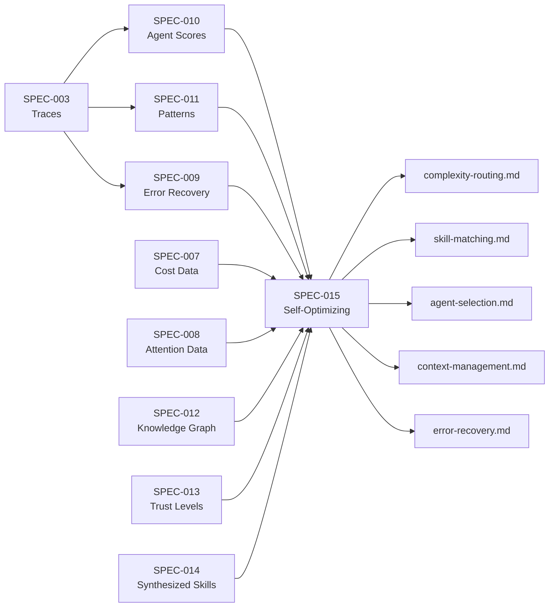
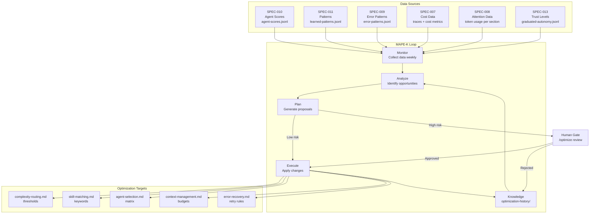
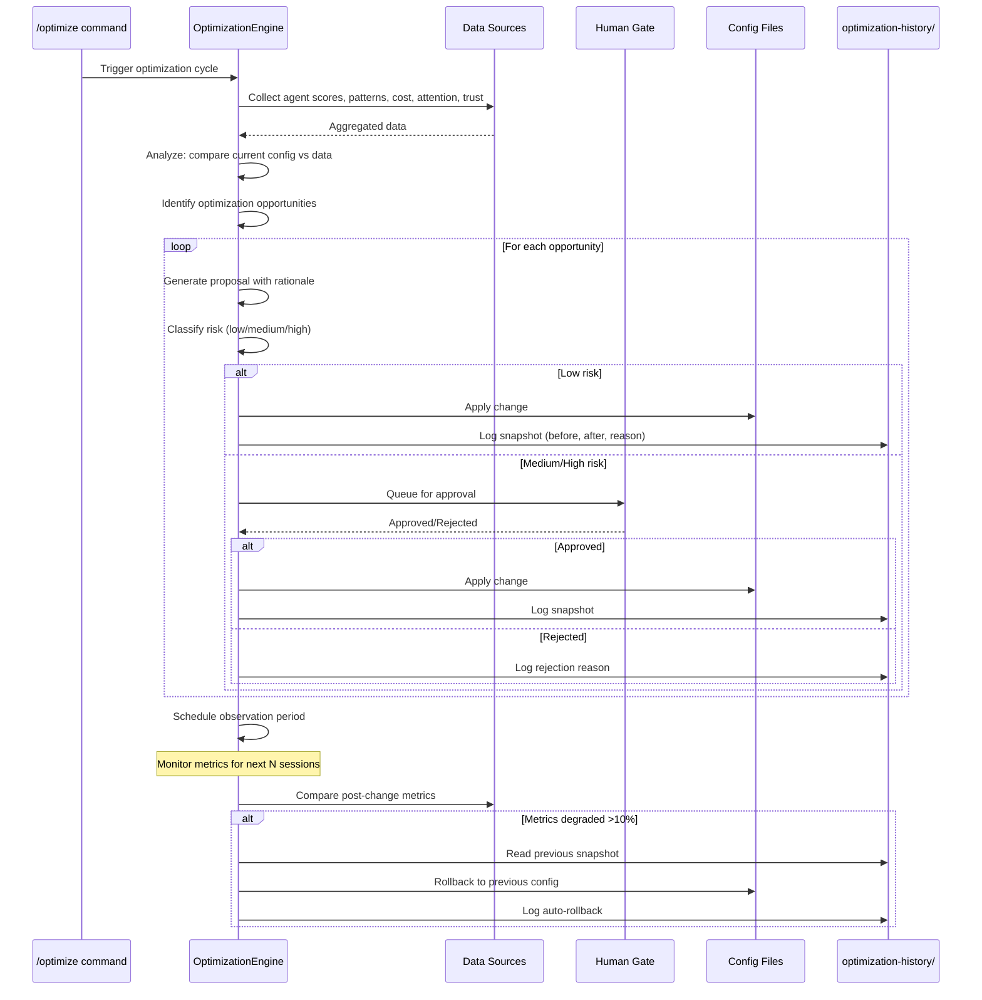
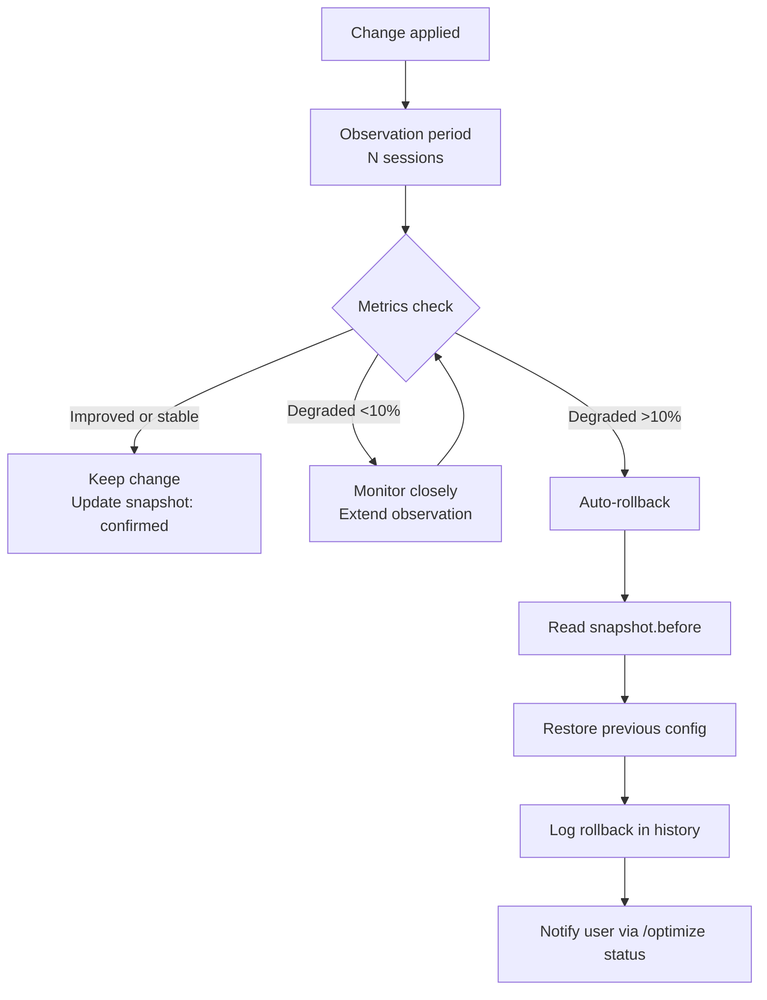

<!--
status: draft
priority: low
research_confidence: low
sources_count: 5
depends_on: [SPEC-007, SPEC-008, SPEC-009, SPEC-010, SPEC-011, SPEC-012, SPEC-013, SPEC-014]
enables: []
created: 2026-03-08
updated: 2026-03-08
-->

# SPEC-015: Self-Optimizing Orchestration

## 0. Research Summary

### Fuentes Consultadas

| Tipo | Fuente | Relevancia |
|------|--------|------------|
| Literature | IBM Autonomic Computing (MAPE-K loop: Monitor, Analyze, Plan, Execute, Knowledge) | High -- foundational model for self-managing systems. MAPE-K maps directly to Poneglyph's optimization loop: traces=Monitor, analysis=Analyze, proposals=Plan, rule updates=Execute, config history=Knowledge |
| Literature | Feedback loops in AI orchestration (DeepMind's population-based training, OpenAI's hyperparameter tuning) | Medium -- demonstrates that system parameters can be tuned from performance data without manual intervention; population-based approaches are overkill for single-config systems |
| Literature | Meta-learning ("learning to learn") | Medium -- concept of a system that improves its own learning process. Applied here at the orchestration level: the system learns to route, match, and allocate better over time |
| Codebase | `.claude/rules/complexity-routing.md`, `skill-matching.md`, `agent-selection.md`, `context-management.md`, `error-recovery.md` | High -- the five configuration files that are optimization targets. Each contains hardcoded thresholds, static keyword tables, or fixed matrices that this spec makes dynamic |
| Specs | SPEC-007 through SPEC-014 | High -- provide the data sources, scoring infrastructure, pattern databases, knowledge graphs, trust levels, and synthesized skills that feed the optimization engine |

### Decisiones Informadas por Research

| Decision | Basada en |
|----------|-----------|
| MAPE-K loop structure (not ad-hoc optimization) | IBM's autonomic computing architecture is the most validated framework for self-managing systems; provides clear separation of concerns across the optimization cycle |
| Rule-based optimization with human gates (not full AutoML) | AutoML-style optimization requires thousands of experiments; single-user CLI system has ~10-50 sessions/week. Human gates for high-risk changes prevent catastrophic misconfigurations |
| Batch optimization cadence (not real-time) | Real-time adaptation introduces instability (oscillating configurations). Weekly batches provide enough data for meaningful analysis while keeping the system predictable |
| Configuration-as-data pattern (not code generation) | Optimizing configuration parameters (thresholds, keywords, budgets) is safer and more reversible than generating new agent code. Configuration changes are atomic and rollbackable |
| Snapshot-based rollback (not version control branching) | Git branches for config history adds unnecessary complexity. JSONL snapshots at `~/.claude/optimization-history/` are simple, queryable, and self-contained |

### Informacion No Encontrada

- No established benchmarks for "good" orchestration parameter values in LLM multi-agent systems (field is too new for standards)
- No empirical data on how quickly routing changes affect output quality (feedback delay unknown)
- No prior art for self-optimizing CLI-based AI orchestration (this is genuinely novel territory)
- No validated methods for measuring "interaction effects" between simultaneous optimizations (e.g., changing thresholds AND keywords at once)
- No data on minimum sample sizes needed for reliable parameter optimization in this domain

### Confidence Assessment

| Area | Nivel | Razon |
|------|-------|-------|
| Optimization loop structure (MAPE-K) | High | Well-established in autonomic computing; clear mapping to Poneglyph's architecture |
| Risk classification and human gates | High | Conservative approach; worst case is slower optimization, not system damage |
| Threshold auto-tuning from performance data | Medium | Concept is sound (if tasks routed to builder at complexity 28 consistently fail, raise the threshold), but requires sufficient data volume |
| Keyword auto-discovery from traces | Medium | Pattern learning (SPEC-011) provides candidates, but validation that new keywords improve matching accuracy requires multiple sessions |
| Cross-optimization interaction effects | Low | Changing multiple parameters simultaneously may produce unexpected compound effects; no methodology for isolating variables |
| Convergence and stability guarantees | Low | No formal proof that the optimization loop converges to an optimal configuration; may oscillate or get stuck in local optima |

---

## 1. Vision

### Press Release

Poneglyph becomes a self-improving system. After hundreds of sessions routing tasks to agents, matching skills by keywords, and adjusting complexity scores, the orchestration system has accumulated rich data about what actually works. It knows which complexity thresholds produce the best outcomes, which skill keywords are missing from the matching table, which agents perform best for which task types, and how token budgets should be allocated.

With Self-Optimizing Orchestration, this knowledge becomes actionable. The system analyzes its own performance data -- from SPEC-010 agent scores, SPEC-011 learned patterns, SPEC-008 attention data, SPEC-007 cost metrics, SPEC-009 error recovery success rates -- and proposes configuration changes. Low-risk changes (adjusting a token budget by 15%) are applied automatically. High-risk changes (rerouting an agent type or modifying trust thresholds) are queued for human approval. Every change is logged with its rationale and can be rolled back instantly if metrics degrade.

The orchestrator that orchestrates its own evolution.

### Background

The current Poneglyph orchestration system is static. All routing decisions flow through hardcoded rules:

| Configuration | Current State | Limitation |
|--------------|---------------|------------|
| Complexity thresholds | `<30`, `30-60`, `>60` in `complexity-routing.md` | Never adjusted; original values may not be optimal |
| Skill matching keywords | 11 keyword groups in `skill-matching.md` | Manually maintained; missing keywords = missed skill matches |
| Agent selection matrix | 15 signal-to-agent mappings in `agent-selection.md` | Static; no feedback from actual agent performance |
| Token budgets | Count-based limits in `context-management.md` | Not data-driven; arbitrary limits per agent type |
| Error recovery rules | Fixed retry budgets in `error-recovery.md` | Same retry count regardless of error type success rate |
| Trust thresholds | Will be defined by SPEC-013 | No performance-based adjustment |

With SPEC-003 through SPEC-014 implemented, Poneglyph has all the data needed to optimize these configurations:



### Usuario Objetivo

Oriol Macias -- sole user and administrator of the system. The optimizer acts as a tireless configuration tuner that proposes improvements based on real usage data, freeing the user from manual rule maintenance.

### Metricas de Exito

| Metrica | Target | Medicion |
|---------|--------|----------|
| Routing accuracy improvement | Measurable increase over 30 sessions post-optimization | Compare pre/post optimization: tasks routed to correct agent on first try (no re-routing needed) |
| Cost reduction from optimized routing | 20% reduction vs pre-optimization baseline | SPEC-007 cost data: actual vs hypothetical pre-optimization cost |
| Manual rule updates needed | Zero after stabilization (30+ sessions) | Count of manual edits to rules/*.md files |
| Optimization proposals generated | At least 3 actionable proposals per optimization cycle | Count proposals in optimization-history/ |
| Rollback rate | <20% of applied optimizations rolled back | Count rollbacks / total applied optimizations |
| Time to detect degradation | <2 sessions after degrading change | Compare metric timestamps: change applied vs degradation detected |

---

## 2. Goals & Non-Goals

### Goals

| ID | Goal | Razon |
|----|------|-------|
| G1 | Auto-tune complexity routing thresholds from SPEC-010 performance data | If builder consistently fails at complexity 28 but succeeds at 25, the threshold should adjust to reflect real capability boundaries |
| G2 | Auto-update skill matching keywords from SPEC-011 learned patterns | Trace analysis reveals which skills correlate with task success; new keyword associations should be added automatically |
| G3 | Auto-adjust agent selection matrix from SPEC-010 performance scores | If a specific agent consistently underperforms for a task type while another excels, routing should shift |
| G4 | Auto-optimize token budgets from SPEC-008 attention data | If builders consistently use only 60% of their token budget, the budget can be reduced; if they hit limits, it should increase |
| G5 | Auto-tune error recovery retry budgets from SPEC-009 success rates | If a specific error category resolves in 1 retry 90% of the time, the retry budget can be reduced from 2 to 1 |
| G6 | Maintain complete optimization audit trail | Every change must be logged with: what changed, why, source data, before/after values, and impact metrics |
| G7 | Provide instant rollback capability | Any optimization can be reverted to previous configuration within one command |
| G8 | Classify optimizations by risk level with appropriate gates | Low-risk changes auto-apply; high-risk changes require human approval |
| G9 | Detect metric degradation and auto-rollback | If a change causes >10% degradation in the target metric, automatically revert |
| G10 | Surface optimization proposals via `/optimize` slash command | User visibility into what the system wants to change and why |

### Non-Goals

| ID | Non-Goal | Razon |
|----|----------|-------|
| NG1 | Modifying agent source code or prompts | Optimization targets configuration parameters only; agent definitions are architectural decisions requiring human judgment |
| NG2 | Unsupervised optimization of high-risk parameters | Trust thresholds, agent routing, and rule logic changes always require human approval. The cost of a bad high-risk change exceeds the benefit of faster optimization |
| NG3 | Cross-project optimization | Configurations are project-contextual (per Poneglyph architecture). Optimizations from one project may not transfer to another |
| NG4 | Optimizing Claude Code itself | Poneglyph optimizes its own orchestration layer, not the underlying Claude Code infrastructure |
| NG5 | Real-time adaptive optimization | Changes applied during a session could cause instability. Batch optimization between sessions is safer |
| NG6 | A/B testing of configurations | Single-user system with sequential sessions; no ability to run parallel experiments. Instead, use before/after comparison with rollback |
| NG7 | Replacing human expertise for architectural decisions | The system optimizes parameters, not strategy. Decisions like "should we add a new agent type?" remain human |

---

## 3. Alternatives Considered

| # | Alternativa | Pros | Contras | Veredicto |
|---|-------------|------|---------|-----------|
| 1 | **Manual periodic tuning** (status quo + awareness) | Simple, human retains full control, no engineering cost | Does not scale; requires remembering to review data; Oriol's time is better spent on features than tuning knobs | **Rejected** -- defeats the purpose of having rich performance data |
| 2 | **Full AutoML-style optimization** (automated parameter search) | Potentially optimal configurations; well-studied algorithms (Bayesian optimization, random search) | Requires hundreds of experiments per parameter; single-user system generates ~10-50 sessions/week; convergence would take months. Risk of unstable configurations during search | **Rejected** -- insufficient data volume for statistical approaches |
| 3 | **Rule-based optimization with human gates** | Deterministic, explainable, safe with approval gates, works with small data volumes (10+ sessions sufficient), audit trail built-in | Cannot discover truly novel optimizations; limited to predefined optimization strategies | **Adopted** -- best balance of safety, explainability, and effectiveness for single-user system |
| 4 | **Genetic algorithm on configurations** | Can explore large configuration spaces; naturally handles multi-objective optimization | Population-based approach needs parallel evaluation; single session = single evaluation; convergence too slow. Implementation complexity disproportionate to benefit | **Rejected** -- overkill for ~20 tunable parameters |
| 5 | **LLM-based configuration review** | Could leverage Claude's reasoning to analyze data and propose changes with natural language rationale | Expensive per review (full LLM call); non-deterministic; may hallucinate improvements; recursive (LLM optimizing LLM orchestration) | **Rejected** -- adds cost and unpredictability to a system meant to reduce both |

### Justificacion de la Alternativa Adoptada

Rule-based optimization with human gates provides:
- **Deterministic behavior**: Same data produces same proposals; no randomness in optimization
- **Explainability**: Every proposal includes "because X metric showed Y pattern in Z sessions"
- **Safety**: High-risk changes gated behind human approval; low-risk changes bounded by conservative thresholds
- **Small-data compatibility**: Works with 10-30 sessions (the realistic volume for this system)
- **Reversibility**: Snapshot-based rollback is trivial to implement and use
- **Incremental value**: Even suboptimal rule-based optimization beats zero optimization

---

## 4. Design

### Arquitectura



### Flujo Principal



### Optimization Targets

| Target | Source Data | Optimization Strategy | Risk | Gate |
|--------|-----------|----------------------|------|------|
| Complexity thresholds (`<30`, `30-60`, `>60`) | SPEC-010 agent scores by complexity bracket | If tasks in bracket N consistently fail (success rate <60%), tighten threshold. If tasks in bracket N+1 consistently succeed (>90%), loosen threshold. Adjust by +-5 per cycle | Low | Auto |
| Skill matching keywords | SPEC-011 patterns + trace skill-success correlation | When a skill correlates with >80% success rate for tasks containing a keyword not in the matching table, propose adding the keyword | Medium | Human |
| Agent selection matrix | SPEC-010 performance + SPEC-007 cost per agent-task pair | If agent A consistently outperforms agent B for task type T (score difference >15 over 10+ sessions), propose re-routing | Medium | Human |
| Token budgets per agent | SPEC-008 attention data (actual token usage vs budget) | If actual usage is consistently <70% of budget (10+ sessions), reduce budget by 20%. If usage hits >95% budget, increase by 20% | Low | Auto |
| Trust thresholds | SPEC-013 graduation data + SPEC-010 scores | If agents consistently meet promotion criteria but threshold blocks graduation, lower threshold. If promoted agents underperform, raise threshold | High | Human |
| Error recovery retry budgets | SPEC-009 pattern success rates per error category | If error category X resolves in 1 retry >85% of the time, reduce retry budget from 2 to 1. If category Y exhausts budget regularly, increase | Low | Auto |

### Risk Classification

| Change Type | Risk Level | Gate | Rationale |
|------------|------------|------|-----------|
| Token budget +-20% | Low | Auto | Bounded change; worst case is slightly more/fewer tokens per agent |
| Complexity threshold +-5 points | Low | Auto | Small adjustment; routing shifts are minimal |
| Error recovery retry budget +-1 | Low | Auto | Bounded; at most one extra retry or one fewer |
| New keyword added to skill matching | Medium | Human | Could cause irrelevant skill loading; needs semantic validation |
| Keyword removed from skill matching | Medium | Human | Could cause skill to stop loading when needed |
| Agent routing changed for task type | Medium | Human | Affects which agent handles entire task categories |
| Trust threshold modified | High | Human | Directly impacts agent autonomy; safety-critical |
| Rule logic modified (beyond parameters) | High | Human | Structural changes to orchestration behavior |
| Security-related rule modification | Blocked | Never auto | Security invariants are inviolable |

### Optimization Engine Interface

```typescript
interface OptimizationProposal {
  id: string
  target: OptimizationTarget
  currentValue: unknown
  proposedValue: unknown
  rationale: string
  dataPoints: number
  confidence: number
  risk: RiskLevel
  expectedImpact: string
  createdAt: string
}

type OptimizationTarget =
  | "complexity.thresholds"
  | "complexity.weights"
  | "skillMatching.keywords"
  | "agentSelection.matrix"
  | "tokenBudgets.perAgent"
  | "trustThresholds.promotion"
  | "trustThresholds.demotion"
  | "errorRecovery.retryBudgets"

type RiskLevel = "low" | "medium" | "high" | "blocked"

interface OptimizationSnapshot {
  id: string
  proposalId: string
  timestamp: string
  target: OptimizationTarget
  before: unknown
  after: unknown
  reason: string
  metricsBefore: OptimizationMetrics
  status: "applied" | "rolled_back" | "rejected"
  rollbackReason?: string
}

interface OptimizationMetrics {
  routingAccuracy: number
  avgCostPerSession: number
  avgRetriesPerSession: number
  avgAgentScore: number
  skillMatchRate: number
}

interface OrchestrationConfig {
  version: number
  complexity: {
    thresholds: [number, number]
    weights: Record<string, number>
  }
  skillMatching: {
    keywords: Record<string, string[]>
  }
  agentSelection: {
    matrix: Record<string, string[]>
  }
  tokenBudgets: {
    perAgent: Record<string, number>
  }
  trustThresholds: {
    promotion: number[]
    demotion: number[]
  }
  errorRecovery: {
    retryBudgets: Record<string, number>
  }
}
```

### Optimization Strategies

#### Strategy 1: Complexity Threshold Tuning

```typescript
function analyzeComplexityThresholds(
  scores: AgentScore[],
  config: OrchestrationConfig,
): OptimizationProposal[] {
  const proposals: OptimizationProposal[] = []
  const [lowHigh, highStart] = config.complexity.thresholds

  const tasksNearLowThreshold = scores.filter(
    s => s.taskType === "implementation" && s.compositeScore > 0
  )

  // If tasks just below threshold (25-30) consistently fail,
  // they might need planner support — lower the threshold
  const justBelowThreshold = tasksNearLowThreshold.filter(
    s => s.compositeScore < 50
  )

  if (justBelowThreshold.length >= 5) {
    const avgScore = justBelowThreshold.reduce(
      (sum, s) => sum + s.compositeScore, 0
    ) / justBelowThreshold.length

    if (avgScore < 50) {
      proposals.push({
        id: crypto.randomUUID(),
        target: "complexity.thresholds",
        currentValue: lowHigh,
        proposedValue: lowHigh - 5,
        rationale: `${justBelowThreshold.length} tasks near threshold (score <50) suggest builder struggles at current boundary. Lowering by 5 would route more tasks through planner for better outcomes.`,
        dataPoints: justBelowThreshold.length,
        confidence: 0.7,
        risk: "low",
        expectedImpact: "More tasks receive planner support; slight increase in session cost, expected improvement in success rate",
        createdAt: new Date().toISOString(),
      })
    }
  }

  return proposals
}
```

#### Strategy 2: Skill Keyword Discovery

```typescript
function analyzeSkillKeywords(
  patterns: LearnedPattern[],
  traceSkillCorrelation: SkillCorrelation[],
  config: OrchestrationConfig,
): OptimizationProposal[] {
  const proposals: OptimizationProposal[] = []
  const existingKeywords = config.skillMatching.keywords

  // Find keywords that appear in successful traces
  // alongside skills not currently matched by those keywords
  for (const correlation of traceSkillCorrelation) {
    const { keyword, skill, successRate, occurrences } = correlation

    if (occurrences < 5) continue
    if (successRate < 0.8) continue

    const currentKeywordsForSkill = existingKeywords[skill] ?? []
    if (currentKeywordsForSkill.includes(keyword)) continue

    proposals.push({
      id: crypto.randomUUID(),
      target: "skillMatching.keywords",
      currentValue: currentKeywordsForSkill,
      proposedValue: [...currentKeywordsForSkill, keyword],
      rationale: `Keyword "${keyword}" appears in ${occurrences} successful sessions using skill "${skill}" (${(successRate * 100).toFixed(0)}% success rate), but is not in the matching table.`,
      dataPoints: occurrences,
      confidence: successRate,
      risk: "medium",
      expectedImpact: `Skill "${skill}" will auto-load for prompts containing "${keyword}"`,
      createdAt: new Date().toISOString(),
    })
  }

  return proposals
}
```

#### Strategy 3: Token Budget Optimization

```typescript
function analyzeTokenBudgets(
  attentionData: AttentionMetrics[],
  config: OrchestrationConfig,
): OptimizationProposal[] {
  const proposals: OptimizationProposal[] = []

  for (const [agent, budget] of Object.entries(config.tokenBudgets.perAgent)) {
    const agentMetrics = attentionData.filter(a => a.agent === agent)
    if (agentMetrics.length < 10) continue

    const avgUsage = agentMetrics.reduce(
      (sum, m) => sum + m.tokensUsed, 0
    ) / agentMetrics.length

    const usageRatio = avgUsage / budget

    if (usageRatio < 0.7) {
      const newBudget = Math.round(budget * 0.8)
      proposals.push({
        id: crypto.randomUUID(),
        target: "tokenBudgets.perAgent",
        currentValue: { [agent]: budget },
        proposedValue: { [agent]: newBudget },
        rationale: `Agent "${agent}" uses ${(usageRatio * 100).toFixed(0)}% of token budget on average (${agentMetrics.length} sessions). Reducing by 20% saves tokens without impacting output.`,
        dataPoints: agentMetrics.length,
        confidence: 0.85,
        risk: "low",
        expectedImpact: `Token budget for "${agent}" reduced from ${budget} to ${newBudget}`,
        createdAt: new Date().toISOString(),
      })
    } else if (usageRatio > 0.95) {
      const newBudget = Math.round(budget * 1.2)
      proposals.push({
        id: crypto.randomUUID(),
        target: "tokenBudgets.perAgent",
        currentValue: { [agent]: budget },
        proposedValue: { [agent]: newBudget },
        rationale: `Agent "${agent}" hits ${(usageRatio * 100).toFixed(0)}% of token budget on average (${agentMetrics.length} sessions). Context truncation likely impacts output quality. Increasing by 20%.`,
        dataPoints: agentMetrics.length,
        confidence: 0.8,
        risk: "low",
        expectedImpact: `Token budget for "${agent}" increased from ${budget} to ${newBudget}`,
        createdAt: new Date().toISOString(),
      })
    }
  }

  return proposals
}
```

#### Strategy 4: Error Recovery Tuning

```typescript
function analyzeRetryBudgets(
  errorPatterns: ErrorPattern[],
  config: OrchestrationConfig,
): OptimizationProposal[] {
  const proposals: OptimizationProposal[] = []

  for (const pattern of errorPatterns) {
    if (pattern.occurrences < 10) continue

    const bestFix = pattern.fixes[0]
    if (!bestFix) continue

    const currentBudget = config.errorRecovery.retryBudgets[pattern.category] ?? 2

    // If best fix succeeds >85% on first try, reduce retry budget
    if (bestFix.successRate > 0.85 && currentBudget > 1) {
      proposals.push({
        id: crypto.randomUUID(),
        target: "errorRecovery.retryBudgets",
        currentValue: { [pattern.category]: currentBudget },
        proposedValue: { [pattern.category]: currentBudget - 1 },
        rationale: `Error category "${pattern.category}" resolves on first retry ${(bestFix.successRate * 100).toFixed(0)}% of the time (${pattern.occurrences} occurrences). Reducing retry budget saves wasted attempts.`,
        dataPoints: pattern.occurrences,
        confidence: bestFix.successRate,
        risk: "low",
        expectedImpact: `Fewer wasted retry attempts for "${pattern.category}" errors`,
        createdAt: new Date().toISOString(),
      })
    }

    // If errors exhaust retry budget >50% of the time, increase
    const exhaustionRate = bestFix.failedCount / (bestFix.appliedCount + bestFix.failedCount)
    if (exhaustionRate > 0.5 && currentBudget < 3) {
      proposals.push({
        id: crypto.randomUUID(),
        target: "errorRecovery.retryBudgets",
        currentValue: { [pattern.category]: currentBudget },
        proposedValue: { [pattern.category]: currentBudget + 1 },
        rationale: `Error category "${pattern.category}" exhausts retry budget ${(exhaustionRate * 100).toFixed(0)}% of the time. Additional retry may prevent escalation to user.`,
        dataPoints: pattern.occurrences,
        confidence: 0.65,
        risk: "low",
        expectedImpact: `One additional retry attempt for "${pattern.category}" before escalation`,
        createdAt: new Date().toISOString(),
      })
    }
  }

  return proposals
}
```

### Rollback Mechanism



Every optimization creates a snapshot:

```jsonl
{"id":"opt-001","proposalId":"prop-xyz","timestamp":"2026-03-15T10:00:00Z","target":"complexity.thresholds","before":[30,60],"after":[25,60],"reason":"Builder tasks near threshold consistently failed","metricsBefore":{"routingAccuracy":0.72,"avgCostPerSession":0.45,"avgRetriesPerSession":1.2,"avgAgentScore":68,"skillMatchRate":0.85},"status":"applied"}
```

Post-observation update:

```jsonl
{"id":"opt-001","proposalId":"prop-xyz","timestamp":"2026-03-22T10:00:00Z","target":"complexity.thresholds","before":[30,60],"after":[25,60],"reason":"Builder tasks near threshold consistently failed","metricsBefore":{"routingAccuracy":0.72,"avgCostPerSession":0.45,"avgRetriesPerSession":1.2,"avgAgentScore":68,"skillMatchRate":0.85},"metricsAfter":{"routingAccuracy":0.81,"avgCostPerSession":0.48,"avgRetriesPerSession":0.8,"avgAgentScore":74,"skillMatchRate":0.85},"status":"applied","confirmed":true}
```

If rollback triggered:

```jsonl
{"id":"opt-001-rollback","proposalId":"prop-xyz","timestamp":"2026-03-20T14:00:00Z","target":"complexity.thresholds","before":[25,60],"after":[30,60],"reason":"Routing accuracy dropped from 0.72 to 0.58 (-19.4%) after threshold change","metricsBefore":{"routingAccuracy":0.58},"status":"rolled_back","rollbackReason":"Metric degradation >10%: routingAccuracy dropped 19.4%"}
```

### Configuration File Updates

The optimization engine modifies `.claude/rules/*.md` files programmatically. Each target file has specific update patterns:

| File | Update Method | What Changes |
|------|--------------|-------------|
| `complexity-routing.md` | Replace threshold values in the "Routing por Complejidad" table | Numbers in `< X` and `X-Y` and `> Y` patterns |
| `skill-matching.md` | Add/remove keywords in the "Keywords en Prompt" column | Comma-separated keyword lists per skill |
| `agent-selection.md` | Update signal-to-agent mappings in the "Selection Matrix" table | Agent names in the "Agent" and "Fallback" columns |
| `context-management.md` | Update max skill counts in the "Skill Loading Limits" table | Numbers in "Max Skills" column |
| `error-recovery.md` | Update retry counts in the "Retry Budget" table | Numbers in "Max Retries" column |

The engine uses Markdown-aware editing: parse table rows, modify values, regenerate the table. This preserves formatting, comments, and non-target content.

### Safety Invariants

These rules are NEVER optimizable and are enforced as hard constraints:

| Invariant | Rationale | Enforcement |
|-----------|-----------|-------------|
| Security-related rules cannot be weakened | Security misconfigurations have outsized impact | `blocked` risk level for any change touching security keywords, trust demotion, or validation rules |
| Trust cannot increase without performance data | SPEC-013 trust levels must be earned, not assumed | Require minimum 10 scored sessions before trust threshold can be lowered |
| Validation for security-sensitive operations cannot be reduced | Reviewer checkpoints for auth/crypto must remain | Hardcoded bypass list of immutable rules |
| All changes logged with full audit trail | Traceability is non-negotiable | Snapshot written before any file modification; engine aborts if write fails |
| Human can freeze optimization for any rule | Ultimate human override | `locked: true` flag in config prevents optimization of that target |
| Maximum change magnitude per cycle | Prevent drastic swings | Thresholds: +-10 for complexity, +-1 for retries, +-20% for budgets, 1 keyword add/remove per skill per cycle |

### Edge Cases

| Edge Case | Handling |
|-----------|----------|
| Conflicting optimizations (lower threshold AND reduce retries) | Apply sequentially, not simultaneously. Each change has its own observation period. Queue conflicts for next cycle |
| Insufficient data for any target | Skip target with log entry "Insufficient data (N < minimum)". Do not extrapolate from small samples |
| Metric regression from external cause (not optimization) | If metrics degrade but no recent optimization was applied, do not auto-rollback. Log "degradation detected, no recent changes to rollback" |
| All optimizations rejected by human | System continues with current config. No penalty. Log rejection reasons for future reference |
| Config file format changes (manual edit) | Re-parse on each cycle. If parsing fails, skip that target with warning |
| Multiple rapid optimization cycles | Enforce minimum 7-day gap between cycles for same target. Different targets can be optimized in parallel |
| Rollback cascade (rollback causes different metric to degrade) | Stop after one rollback per cycle. Notify user if compound effects detected |

### Dependencies

| Dependency | Type | Purpose |
|------------|------|---------|
| SPEC-007 (Cost Optimization) | Data source | Per-session cost metrics, model routing data |
| SPEC-008 (Attention Mechanisms) | Data source | Token usage per agent, section-level attention data |
| SPEC-009 (Error Recovery) | Data source + target | Error pattern success rates; retry budgets are optimization targets |
| SPEC-010 (Agent Scoring) | Data source | Agent performance scores by task type, trends |
| SPEC-011 (Pattern Learning) | Data source | Learned patterns, keyword-skill correlations |
| SPEC-012 (Knowledge Graph) | Data source | Cross-agent knowledge relationships, dependency data |
| SPEC-013 (Graduated Autonomy) | Data source + target | Trust levels; promotion/demotion thresholds are optimization targets |
| SPEC-014 (Skill Synthesis) | Data source | Synthesized skill effectiveness data |
| Bun runtime | Runtime | `Bun.file()`, `Bun.write()`, `crypto.randomUUID()` |
| `rules/*.md` files | Target | The five configuration files that are modified |

### Concerns

| Concern | Mitigation |
|---------|------------|
| **Optimization oscillation** | Maximum change magnitude per cycle + minimum 7-day gap between same-target optimizations prevents ping-pong behavior |
| **Compound effects** | One change per target per cycle; observation period between cycles; rollback cascade protection |
| **Data poisoning** (bad sessions skewing metrics) | Rolling windows (SPEC-010) naturally phase out outliers; minimum sample sizes required |
| **Over-optimization** (diminishing returns) | If consecutive cycles produce no proposals, extend observation period. System naturally converges when config is near-optimal |
| **Human approval fatigue** | Medium-risk changes limited to 3 per cycle; proposals include concise rationale and expected impact |
| **File corruption during write** | Atomic write pattern: write to temp file, validate, rename. If validation fails, abort without modifying original |
| **Conflicting manual edits** | Re-parse config files at start of each cycle. Manual changes are respected as the new baseline |

### Stack Alignment

| Aspecto | Decision | Alineado |
|---------|----------|----------|
| Runtime | Bun native APIs (`Bun.file`, `Bun.write`) | Yes -- consistent with all SPEC-003+ storage patterns |
| Storage | JSONL at `~/.claude/optimization-history/` | Yes -- aligned with traces, patterns, scores |
| Language | TypeScript with strict types | Yes -- project standard |
| Testing | `bun:test` with mock data sources | Yes -- existing test infrastructure |
| Integration | Slash command `/optimize` + stop hook for metric collection | Yes -- established command and hook patterns |
| Config editing | Markdown-aware string replacement | Yes -- preserves existing file format |
| Error handling | Try/catch with graceful degradation; optimization failure never blocks normal orchestration | Yes -- non-critical subsystem |

---

## 5. FAQ

**Q: How often does optimization run?**

A: Optimization is user-triggered via the `/optimize` command, not automatic. The recommended cadence is weekly, after accumulating 10-20 sessions of data. A minimum gap of 7 days is enforced between optimizations of the same target to prevent oscillation. The user can run `/optimize status` at any time to see pending proposals and active observation periods without triggering a new cycle.

**Q: Can the optimization make things worse?**

A: Yes, but with multiple safety nets. (1) Low-risk changes are bounded (+-10 for thresholds, +-20% for budgets, +-1 for retries) so the worst case is modest. (2) High-risk changes require human approval. (3) Auto-rollback triggers if any tracked metric degrades >10% within the observation period. (4) Human can manually rollback any change via `/optimize rollback <id>`. (5) Safety invariants prevent the system from ever weakening security-related rules.

**Q: How to debug unexpected behavior after an optimization?**

A: Run `/optimize history` to see all applied changes with timestamps. Each entry includes before/after values, the rationale, and metrics before the change. If behavior changed unexpectedly, compare the timestamp of the change with when the behavior started. Use `/optimize rollback <id>` to revert specific changes. The JSONL audit trail provides complete forensic data.

**Q: What if I disagree with an optimization?**

A: For human-gated changes (medium/high risk): simply reject the proposal when reviewed. The system logs the rejection and will not re-propose the same change unless underlying data changes significantly. For auto-applied changes: use `/optimize rollback <id>` to revert. To prevent future optimization of a specific target, use `/optimize lock <target>` to freeze it permanently (until unlocked).

**Q: What is the minimum data needed before optimization starts producing useful proposals?**

A: The system requires minimum sample sizes per optimization target: 10 sessions for threshold tuning, 5 sessions for token budget analysis, 10 error occurrences for retry budget tuning, 5 keyword-skill correlations for keyword discovery. In practice, after ~30 sessions with diverse task types, most targets have sufficient data. New installations will see proposals trickle in as data accumulates naturally.

**Q: Can I run optimization more frequently during initial setup?**

A: The 7-day gap applies per target, not globally. You could optimize token budgets on day 1, complexity thresholds on day 2, and retry budgets on day 3 if each has sufficient data. However, this increases the risk of compound effects since observation periods overlap. The conservative approach is to optimize one target per cycle and observe before proceeding.

**Q: What happens if I manually edit a rules file that was previously optimized?**

A: The optimization engine re-parses all config files at the start of each cycle. Your manual edit becomes the new baseline. Previous optimization history still references the old values, but future proposals compare against the manually-set values. Manual edits are always respected -- the system never overwrites deliberate human changes without going through the proposal process.

**Q: How does this interact with SPEC-014 (Skill Synthesis)?**

A: SPEC-014 creates new skills from trace analysis. SPEC-015 can then discover keywords for those synthesized skills and add them to `skill-matching.md`. The flow is: SPEC-014 creates the skill, traces accumulate showing when it is useful, SPEC-015 proposes keywords that would have auto-loaded it. This creates a complete lifecycle: skill creation -> usage observation -> automatic matching rule generation.

---

## 6. Acceptance Criteria (BDD)

```gherkin
Feature: Self-Optimizing Orchestration
  Background:
    Given SPEC-007 through SPEC-014 are implemented
    And orchestration config files exist at .claude/rules/
    And optimization history is stored at ~/.claude/optimization-history/

  # --- Auto-Optimization ---

  Scenario: Complexity threshold auto-adjustment (low risk)
    Given complexity thresholds are [30, 60]
    And SPEC-010 shows builder tasks at complexity 26-30 have average score 42
    And there are 12 such data points
    When optimization cycle runs
    Then a proposal is generated to lower threshold from 30 to 25
    And the proposal has risk level "low"
    And the proposal is auto-applied without human review
    And a snapshot is saved to optimization-history

  Scenario: Token budget auto-reduction (low risk)
    Given builder token budget is 5000
    And SPEC-008 shows builder average usage is 3200 tokens over 15 sessions
    When optimization cycle runs
    Then a proposal is generated to reduce budget to 4000
    And the proposal has risk level "low"
    And the proposal is auto-applied

  Scenario: Retry budget auto-reduction (low risk)
    Given EditConflict retry budget is 2
    And SPEC-009 shows EditConflict best fix has 92% success rate
    And there are 15 occurrences
    When optimization cycle runs
    Then a proposal is generated to reduce retry budget to 1
    And the proposal has risk level "low"

  Scenario: Token budget auto-increase when hitting limits
    Given scout token budget is 2000
    And SPEC-008 shows scout average usage is 1950 tokens over 12 sessions
    When optimization cycle runs
    Then a proposal is generated to increase budget to 2400
    And risk level is "low"

  # --- Human Gates ---

  Scenario: Skill keyword addition requires human approval
    Given skill "security-review" has keywords ["auth", "jwt", "password", "security", "token", "session"]
    And SPEC-011 traces show keyword "oauth" appears in 8 sessions using security-review with 87% success
    When optimization cycle runs
    Then a proposal is generated to add "oauth" to security-review keywords
    And the proposal has risk level "medium"
    And the proposal is queued for human review

  Scenario: Agent routing change requires human approval
    Given builder handles "debugging" tasks
    And SPEC-010 shows error-analyzer scores 85 for debugging while builder scores 55
    And there are 10+ sessions for each
    When optimization cycle runs
    Then a proposal is generated to prefer error-analyzer for debugging
    And the proposal has risk level "medium"
    And the proposal is queued for human review

  Scenario: Trust threshold change requires human approval
    Given SPEC-013 promotion threshold is 80
    And 5 agents consistently score 75-79 without promotion
    When optimization cycle runs
    Then a proposal is generated to lower promotion threshold to 75
    And the proposal has risk level "high"
    And the proposal is queued for human review

  Scenario: Human rejects a proposal
    Given a medium-risk proposal to add keyword "deploy" to "config-validator"
    When the user reviews and rejects the proposal
    Then the rejection is logged with reason
    And the keyword is not added
    And the same proposal is not regenerated unless data changes significantly

  # --- Rollback ---

  Scenario: Auto-rollback on metric degradation
    Given complexity threshold was changed from 30 to 25
    And a snapshot was saved with metricsBefore.routingAccuracy = 0.72
    When post-change routing accuracy drops to 0.58 (>10% degradation)
    Then the system auto-rollbacks threshold to 30
    And a rollback entry is saved to optimization-history
    And the user is notified via /optimize status

  Scenario: Manual rollback via command
    Given optimization "opt-123" changed token budget from 5000 to 4000
    When user runs "/optimize rollback opt-123"
    Then token budget is restored to 5000
    And rollback is logged in optimization-history

  Scenario: No rollback when metrics improve
    Given complexity threshold was changed from 30 to 25
    And post-change routing accuracy improves from 0.72 to 0.81
    When observation period completes
    Then the change is confirmed
    And snapshot is updated with metricsAfter and confirmed=true

  # --- Audit Trail ---

  Scenario: Every optimization creates audit entry
    Given an optimization proposal is generated
    When the proposal is applied (auto or approved)
    Then optimization-history contains an entry with:
      | Field | Present |
      | id | yes |
      | proposalId | yes |
      | timestamp | yes |
      | target | yes |
      | before | yes |
      | after | yes |
      | reason | yes |
      | metricsBefore | yes |

  Scenario: History query via /optimize history
    Given 5 optimizations have been applied over 3 months
    When user runs "/optimize history"
    Then all 5 entries are displayed with status, target, and date
    And rolled-back entries are marked with rollback reason

  # --- Safety Invariants ---

  Scenario: Security rules cannot be weakened
    Given skill-matching has security-review loaded for "auth" keyword
    When optimization proposes removing "auth" from security-review
    Then the proposal is blocked with risk level "blocked"
    And reason states "Security-related rules cannot be weakened"

  Scenario: Trust cannot increase without data
    Given an agent has only 3 scored sessions
    When optimization considers lowering trust threshold for that agent
    Then no proposal is generated
    And log states "Insufficient data (3 < 10 minimum)"

  Scenario: Locked targets are skipped
    Given complexity.thresholds is locked via "/optimize lock complexity.thresholds"
    When optimization cycle runs
    Then no proposals are generated for complexity.thresholds
    And log states "Target locked by user"

  Scenario: Maximum change magnitude enforced
    Given complexity threshold is 30
    And data suggests threshold should be 15
    When optimization cycle runs
    Then proposal adjusts threshold to 25 (max -5 per cycle)
    And further adjustment deferred to next cycle

  # --- Edge Cases ---

  Scenario: Insufficient data for all targets
    Given fewer than 5 sessions exist
    When optimization cycle runs
    Then no proposals are generated
    And log states "Insufficient data for all optimization targets"

  Scenario: Conflicting optimizations detected
    Given a proposal to lower complexity threshold (more tasks to planner)
    And a proposal to reduce planner token budget
    When both are generated in same cycle
    Then only the higher-priority proposal is applied
    And the conflicting proposal is deferred to next cycle

  Scenario: Config file manually edited between cycles
    Given complexity threshold was optimized to 25
    And user manually changes it to 28
    When next optimization cycle runs
    Then baseline is 28 (the manual value)
    And proposals compare against 28, not 25

  Scenario: Optimization produces no proposals
    Given current config is near-optimal
    And all metrics are within acceptable ranges
    When optimization cycle runs
    Then no proposals are generated
    And log states "No optimization opportunities identified"
```

---

## 7. Open Questions

| # | Question | Impact | Proposed Resolution |
|---|----------|--------|---------------------|
| 1 | What is the optimal optimization cadence: weekly, biweekly, or monthly? | Too frequent = oscillation risk, too infrequent = slow improvement | Start weekly; auto-extend to biweekly if consecutive cycles produce <2 proposals |
| 2 | How long should the metric stability window be before acting on data? | If window is too short, transient dips trigger unnecessary rollbacks; too long delays detection of real problems | 5 sessions minimum observation period; auto-extend to 10 if metrics are ambiguous (3-10% change) |
| 3 | How to handle interaction effects between simultaneous optimizations? | Changing thresholds AND budgets at once makes it impossible to attribute metric changes to a specific optimization | One target per cycle as default; advanced mode allows multi-target with explicit acknowledgment of attribution risk |
| 4 | Should the system learn from rejected proposals to improve future proposals? | Repeated rejections for the same type of change waste human review time | Track rejection patterns; if same target rejected 3+ times, increase confidence threshold for that target from 0.7 to 0.9 |
| 5 | What constitutes "significant data change" to re-propose a rejected optimization? | Need a threshold to avoid re-proposing the same thing vs. adapting to genuinely new data | Require 50% more data points AND >15% change in underlying metric vs. when proposal was rejected |
| 6 | How to handle the bootstrapping phase when most targets lack data? | System may appear "broken" or useless during initial sessions | Progressive activation: token budgets first (smallest sample needed), then retries, then thresholds, then keywords/routing last |
| 7 | Should optimization history be pruned after N months? | Unbounded history grows; old entries lose relevance | Keep last 100 entries; archive older to `~/.claude/optimization-archive/`. But at ~200 bytes per entry, 1000 entries = 200KB -- may not need pruning at all |

---

## 8. Sources

| # | Source | Tipo | Relevancia |
|---|--------|------|------------|
| 1 | IBM Autonomic Computing (MAPE-K reference architecture) | Literature | Foundational model for self-managing systems; Monitor-Analyze-Plan-Execute-Knowledge loop maps directly to optimization engine design |
| 2 | SPEC-007 (Cost Optimization Engine) | Spec | Provides per-session cost data and model routing metrics; cost reduction is a primary optimization target |
| 3 | SPEC-008 (Agent Attention Mechanisms) | Spec | Provides token usage data per agent and per section; enables token budget optimization |
| 4 | SPEC-009 (Pattern-Based Error Recovery) | Spec | Provides error pattern success rates; retry budgets are optimization targets |
| 5 | SPEC-010 (Agent Performance Scoring) | Spec | Provides agent scores by task type and trends; primary data source for routing and threshold optimization |
| 6 | SPEC-011 (Pattern Learning from Traces) | Spec | Provides learned patterns and keyword-skill correlations; enables keyword discovery optimization |
| 7 | SPEC-012 (Cross-Agent Knowledge Graph) | Spec | Provides cross-agent dependency data; informs agent routing optimization |
| 8 | SPEC-013 (Graduated Autonomy) | Spec | Provides trust levels and graduation data; trust thresholds are optimization targets |
| 9 | SPEC-014 (Skill Synthesis) | Spec | Provides synthesized skill effectiveness data; synthesized skills need keyword matching rules |
| 10 | `.claude/rules/complexity-routing.md` | Codebase | Current complexity thresholds (<30, 30-60, >60) and formula weights -- primary optimization target |
| 11 | `.claude/rules/skill-matching.md` | Codebase | Current keyword-to-skill mapping table (11 groups) -- optimization target for keyword discovery |
| 12 | `.claude/rules/agent-selection.md` | Codebase | Current signal-to-agent mapping matrix (15 entries) -- optimization target for routing |
| 13 | `.claude/rules/context-management.md` | Codebase | Current token budget limits per agent -- optimization target |
| 14 | `.claude/rules/error-recovery.md` | Codebase | Current retry budgets and escalation rules -- optimization target |

---

## 9. Next Steps

### Implementation Checklist

| # | Task | Complejidad | Dependencia |
|---|------|-------------|-------------|
| 1 | Define `OptimizationProposal`, `OptimizationSnapshot`, `OrchestrationConfig`, `OptimizationMetrics` interfaces in `.claude/hooks/lib/optimization-engine.ts` | Baja | All upstream specs implemented |
| 2 | Implement `collectOptimizationData()`: aggregates data from agent-scores.jsonl, error-patterns.jsonl, attention metrics, cost data | Media | #1, SPEC-007-014 data files exist |
| 3 | Implement `analyzeComplexityThresholds()`: generate proposals from agent score data near threshold boundaries | Media | #2 |
| 4 | Implement `analyzeSkillKeywords()`: discover missing keywords from trace-skill correlations | Media | #2 |
| 5 | Implement `analyzeTokenBudgets()`: identify over/under-utilized token budgets | Baja | #2 |
| 6 | Implement `analyzeRetryBudgets()`: optimize retry counts from error pattern success rates | Baja | #2 |
| 7 | Implement `analyzeAgentRouting()`: propose routing changes from agent performance comparisons | Media | #2 |
| 8 | Implement `analyzeTrustThresholds()`: propose trust threshold adjustments from graduation data | Media | #2 |
| 9 | Implement `classifyRisk(proposal)`: assign risk level based on change type and magnitude | Baja | #1 |
| 10 | Implement `applyProposal(proposal)`: Markdown-aware editing of rules/*.md files | Alta | #9, file parsing logic |
| 11 | Implement `createSnapshot(proposal, metricsBefore)`: write to optimization-history/ JSONL | Baja | #1 |
| 12 | Implement `rollbackSnapshot(snapshotId)`: restore previous configuration from snapshot | Media | #10, #11 |
| 13 | Implement `detectDegradation(snapshot, currentMetrics)`: compare post-change metrics against pre-change | Baja | #11 |
| 14 | Implement `runOptimizationCycle()`: orchestrate full MAPE-K loop (collect, analyze, propose, gate, apply, observe) | Alta | #2-#13 |
| 15 | Create `/optimize` slash command: `run`, `status`, `history`, `rollback <id>`, `lock <target>`, `unlock <target>` | Media | #14 |
| 16 | Implement safety invariant checks: security rule protection, minimum data requirements, maximum change magnitude | Media | #9 |
| 17 | Implement conflict detection between proposals in the same cycle | Media | #3-#8 |
| 18 | Write tests for `analyzeComplexityThresholds()` with synthetic score data | Media | #3 |
| 19 | Write tests for `analyzeSkillKeywords()` with mock correlations | Media | #4 |
| 20 | Write tests for `analyzeTokenBudgets()` with over/under-utilization scenarios | Baja | #5 |
| 21 | Write tests for `analyzeRetryBudgets()` with high/low success rate patterns | Baja | #6 |
| 22 | Write tests for `classifyRisk()` covering all risk levels including "blocked" | Baja | #9 |
| 23 | Write tests for `applyProposal()` verifying Markdown file modifications | Alta | #10 |
| 24 | Write tests for `rollbackSnapshot()` verifying configuration restoration | Media | #12 |
| 25 | Write tests for `detectDegradation()` with improvement, stable, and degradation scenarios | Baja | #13 |
| 26 | Write tests for safety invariants: security rules immutable, data minimums enforced | Media | #16 |
| 27 | Write integration test: full optimization cycle from data collection to proposal application to rollback | Alta | #14 |
| 28 | Benchmark: verify optimization cycle completes in <5 seconds for realistic data volumes | Baja | #14 |
| 29 | Document `/optimize` command usage in `.claude/commands/` | Baja | #15 |

### Implementation Waves

| Wave | Tasks | Rationale |
|------|-------|-----------|
| 1. Core engine | #1, #2, #9, #11, #13, #16 | Foundation: types, data collection, risk classification, snapshots, safety |
| 2. Analysis strategies | #3, #4, #5, #6, #7, #8 | All six optimization strategies (parallelizable) |
| 3. Execution | #10, #12, #14, #17 | Apply changes, rollback, full cycle orchestration |
| 4. User interface | #15, #29 | Slash command and documentation |
| 5. Testing | #18-#28 | Comprehensive test suite |
