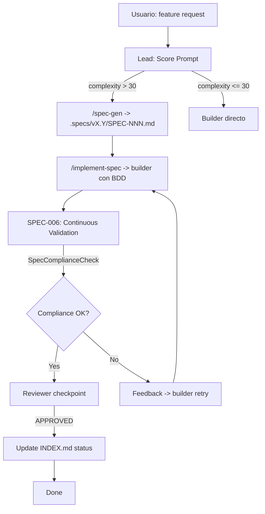
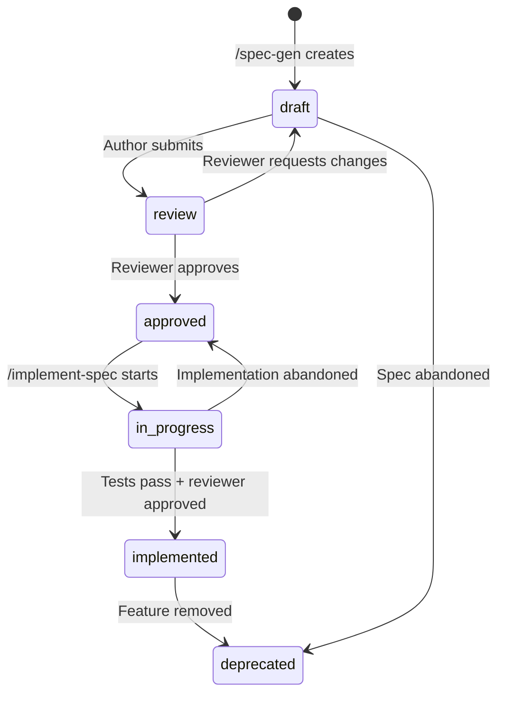

<!--
status: implemented
priority: high
research_confidence: high
sources_count: 18
depends_on: [SPEC-006]
enables: [SPEC-018, SPEC-019]
created: 2026-03-10
updated: 2026-03-10
-->

# SPEC-016: Spec-Driven Development Workflow

## 0. Research Summary

### Fuentes Consultadas

| Tipo | Fuente | Link | Relevancia |
|------|--------|------|------------|
| Industry Analysis | Thoughtworks — SDD 2025 | https://www.thoughtworks.com/en-us/insights/blog/agile-engineering-practices/spec-driven-development-unpacking-2025-new-engineering-practices | Alta |
| Expert Analysis | Martin Fowler — SDD Tools (Kiro, spec-kit, Tessl) | https://martinfowler.com/articles/exploring-gen-ai/sdd-3-tools.html | Alta |
| Academic | arXiv — From Code to Contract | https://arxiv.org/html/2602.00180v1 | Alta |
| Tooling | Microsoft Developer — Spec Kit | https://developer.microsoft.com/blog/spec-driven-development-spec-kit | Alta |
| Implementation Guide | Augment Code — SDD Step-by-Step | https://www.augmentcode.com/guides/mastering-spec-driven-development-with-prompted-ai-workflows-a-step-by-step-implementation-guide | Alta |
| Comparison | Redreamality — BMAD vs spec-kit vs OpenSpec | https://redreamality.com/blog/-sddbmad-vs-spec-kit-vs-openspec-vs-promptx/ | Media |
| BDD Guide | TestRail — BDD Automation | https://www.testrail.com/blog/bdd-automation/ | Alta |
| BDD Lifecycle | Testomat.io — Mastering BDD Workflow | https://testomat.io/blog/mastering-a-robust-bdd-development-workflow/ | Alta |
| TypeScript BDD | Medium — Gherkin + TypeScript + CucumberJS | https://medium.com/@maude.clonet/gherkin-and-typescript-with-cucumberjs-89817b92607a | Alta |
| Design by Contract | GitHub — ts-code-contracts | https://github.com/JanMalch/ts-code-contracts | Alta |
| Contract Testing | Pact Foundation (TypeScript) | https://github.com/pact-foundation?language=typescript | Media |
| Living Docs | Concordion — Specification by Example | https://concordion.org/index.html | Media |
| AI SDD | Beam AI — Build What You Mean | https://beam.ai/agentic-insights/spec-driven-development-build-what-you-mean-not-what-you-guess | Alta |

### Decisiones Informadas por Research

| Decision | Basada en |
|----------|-----------|
| Adoptar modelo "spec-anchored" (specs persisten y evolucionan con el codigo) | Martin Fowler identifica 3 niveles: spec-first, spec-anchored, spec-as-source. Spec-anchored es el balance optimo para Poneglyph [Fowler 2025] |
| Ciclo Intent -> Spec -> Plan -> Execute -> Validate como workflow core | Patron canonico convergente en Thoughtworks, Kiro, beam.ai [Thoughtworks 2025] |
| BDD Given/When/Then como formato de acceptance criteria | Estandar maduro con tooling TypeScript (Cucumber.js + cucumber-tsflow) [TestRail, Testomat.io] |
| Integrar con /spec-gen y /implement-spec existentes, no crear tooling nuevo | Fowler advierte que ningun tool provee 100% compliance automatica; mejor extender lo que funciona [Fowler 2025] |
| Confidence-based review thresholds para quality gates | Augment Code guide: >90% auto-test only, 70-90% PR+senior review, <70% pair programming [Augment Code] |
| No implementar compliance checker AST (dejarlo para SPEC-017) | Fowler: "agents frequently ignore instructions... verbose specifications don't guarantee compliance." AST validation es ortogonal [Fowler 2025] |

### Informacion No Encontrada

- Automated spec diff tooling (spec vs implementation) para TypeScript — gap abierto
- Gauge framework para TypeScript — eclipsado por Playwright + Cucumber
- TypeScript-native Concordion equivalent — Gherkin llena este rol

### Confidence Assessment

| Area | Nivel | Razon |
|------|-------|-------|
| SDD como patron | Alta | Multiples fuentes convergentes (Thoughtworks, Fowler, arXiv) |
| BDD workflow | Alta | Estandar maduro, tooling verificado |
| Compliance automation | Media | No existe solucion 100% automatica segun Fowler |
| Integration con Poneglyph | Alta | /spec-gen y /implement-spec ya existen como base |

## 1. Vision

> **Press Release**: Poneglyph ahora incluye un workflow completo de Spec-Driven Development que garantiza que toda implementacion comienza con una especificacion formal, pasa por validacion BDD automatizada, y mantiene trazabilidad spec<->codigo durante todo el ciclo de vida. Los desarrolladores ya no necesitan recordar el proceso — el sistema lo guia y valida automaticamente.

**Background**: Poneglyph ya tiene `/spec-gen` para crear specs y `/implement-spec` para implementar desde specs. Sin embargo, no existe un workflow que conecte ambos, valide compliance, ni asegure que el desarrollo sigue las specs. El proceso depende de la disciplina manual del desarrollador.

**Usuario objetivo**: Oriol Macias como usuario principal de Poneglyph. El workflow debe ser transparente y no intrusivo.

**Metricas de exito**:

| Metrica | Target | Medicion |
|---------|--------|----------|
| Specs creadas antes de implementar | 100% de features con complexity >30 | Trace analytics |
| BDD scenarios ejecutables | >=5 por spec | Conteo en Section 6 de cada spec |
| Spec<->codigo trazabilidad | 100% de specs implementadas tienen link bidireccional | INDEX.md status tracking |
| Tiempo de feedback | <30s desde implementacion a validacion | SPEC-006 continuous validation |

## 2. Goals & Non-Goals

### Goals

| ID | Goal | Razon |
|----|------|-------|
| G1 | Definir el ciclo completo: Intent -> Spec -> Plan -> Execute -> Validate -> Review | Workflow canonico de SDD [Thoughtworks 2025] |
| G2 | Crear skill que guie al Lead a seguir el ciclo SDD | Automatizar la disciplina, no depender de memoria |
| G3 | Integrar con /spec-gen (crear) y /implement-spec (ejecutar) existentes | Reutilizar tooling probado |
| G4 | Definir SpecComplianceCheck interface para validacion programatica | Contrato tipado para que SPEC-006 pueda verificar compliance |
| G5 | Establecer quality gates por fase del ciclo | Confidence-based thresholds [Augment Code] |
| G6 | Mantener trazabilidad bidireccional spec<->implementacion | Lifecycle tracking en INDEX.md |

### Non-Goals

| ID | Non-Goal | Razon |
|----|----------|-------|
| NG1 | Compliance checker via AST parsing | Scope de SPEC-017 (AST Hallucination Detection) |
| NG2 | Ejecutar tests BDD automaticamente (Cucumber runner) | Poneglyph usa bun test, no Cucumber |
| NG3 | Forzar specs para cambios triviales (complexity <30) | Over-engineering para fixes simples |
| NG4 | Crear un spec-as-source system (codigo generado 100% desde spec) | Fowler advierte que esto no funciona en la practica |

## 3. Alternatives Considered

| # | Alternativa | Pros | Cons | Fuente | Decision |
|---|-------------|------|------|--------|----------|
| 1 | Skill + validation rules integradas con pipeline existente | Reutiliza /spec-gen y /implement-spec; bajo costo; incremental | No provee compliance automatica 100% | Fowler, Thoughtworks | Elegida |
| 2 | Adoptar Kiro-style three-document structure (Requirements/Design/Tasks) | Estructura probada por AWS/Kiro | Requiere reestructurar specs existentes; 15 specs ya siguen formato 10-secciones | Fowler (Kiro analysis) | Incompatible con formato existente |
| 3 | Implementar spec-kit de Microsoft | Tooling maduro | Vendor lock-in, no se integra con Claude Code | Microsoft Developer | No aplica a Poneglyph |
| 4 | No hacer nada (seguir con proceso manual) | Zero esfuerzo | Riesgo de skip specs, sin quality gates, sin trazabilidad | — | No resuelve el problema |

## 4. Design

### Arquitectura



### Flujo Principal

1. Usuario solicita feature
2. Lead evalua prompt (scoring) y calcula complejidad
3. Si complexity >30: Lead invoca `/spec-gen` para crear spec
4. Spec se guarda en `.specs/vX.Y/SPEC-NNN-slug.md` con status `draft`
5. Lead (o usuario) revisa spec -> status `approved`
6. Lead invoca `/implement-spec` que delega a builder con BDD scenarios
7. SPEC-006 (Continuous Validation) ejecuta `SpecComplianceCheck` durante implementacion
8. Builder completa -> reviewer valida
9. Si APPROVED: INDEX.md actualizado a `implemented`
10. Si NEEDS_CHANGES: feedback loop a builder

### Edge Cases

| Edge Case | Handling |
|-----------|---------|
| Spec modificada durante implementacion | Invalidar SpecComplianceCheck, notificar builder |
| Feature requiere cambios a spec existente | Crear nueva version del spec (no editar in-place si status = implemented) |
| Complexity borderline (25-35) | Lead decide; si hay incertidumbre, crear spec |
| Spec sin BDD scenarios | SpecComplianceCheck falla: seccion 6 vacia |
| Implementacion diverge de spec | Reviewer flag: spec drift detected |

### Stack Alignment

| Aspecto | Decision | Alineado | Fuente |
|---------|----------|----------|--------|
| Spec format | 10 secciones markdown (existente) | Si | Formato Poneglyph v1 |
| BDD format | Gherkin Given/When/Then | Si | Seccion 6 de specs existentes |
| Validation trigger | SPEC-006 continuous validation | Si | Pipeline existente |
| Skill location | `.claude/skills/spec-driven/SKILL.md` | Si | Convencion Poneglyph |

### Interfaces

```typescript
interface SpecComplianceCheck {
  specId: string;              // e.g., "SPEC-016"
  specPath: string;            // e.g., ".specs/v2.1/SPEC-016-..."
  status: SpecStatus;
  sections: SectionCheck[];
  bddScenarios: BddCheck[];
  overallCompliance: number;   // 0-100
  issues: ComplianceIssue[];
}

type SpecStatus = 'draft' | 'review' | 'approved' | 'in_progress' | 'implemented' | 'deprecated';

interface SectionCheck {
  section: number;             // 0-9
  name: string;
  present: boolean;
  quality: 'complete' | 'partial' | 'missing';
}

interface BddCheck {
  scenario: string;
  hasGiven: boolean;
  hasWhen: boolean;
  hasThen: boolean;
  isExecutable: boolean;       // Can be translated to test
}

interface ComplianceIssue {
  type: 'missing_section' | 'empty_bdd' | 'no_sources' | 'spec_drift' | 'stale_spec';
  severity: 'critical' | 'major' | 'minor';
  message: string;
  suggestion: string;
}

interface SpecLifecycle {
  transitions: Record<SpecStatus, SpecStatus[]>;
  // draft -> review -> approved -> in_progress -> implemented
  // Any status -> deprecated
}
```

### Spec Lifecycle State Machine



## 5. FAQ

**Q: Cuando NO se necesita spec?**
A: Cambios con complexity <30 (fixes simples, 1-2 archivos, sin incertidumbre). El Lead ya calcula complejidad antes de delegar. [Basado en: complexity-routing.md existente]

**Q: Que pasa si la spec ya existe pero esta desactualizada?**
A: Se crea una nueva version del spec en la wave correspondiente. Las specs implementadas son inmutables como referencia historica. [Basado en: patron spec-anchored, Fowler 2025]

**Q: El workflow bloquea al desarrollador?**
A: No. SpecComplianceCheck es advisory (no-blocking), igual que SPEC-006 continuous validation. El reviewer es quien decide si proceder o no. [Basado en: SPEC-006 design — validator is advisory]

**Q: Como se relaciona con /spec-gen y /implement-spec?**
A: Este skill los orquesta: /spec-gen crea la spec, este skill valida su completitud, /implement-spec ejecuta la implementacion. El skill es el "pegamento" del ciclo. [Basado en: comandos existentes en .claude/commands/]

**Q: Puede Martin Fowler's compliance gap afectar este diseno?**
A: Si. Fowler documenta que "agents frequently ignore instructions." Por eso el diseno es advisory + reviewer humano, no enforcement automatico. SPEC-017 (AST) complementara con verificacion programatica. [Basado en: Fowler 2025]

## 6. Acceptance Criteria (BDD)

```gherkin
Feature: Spec-Driven Development Workflow

  Scenario: Lead triggers spec creation for complex feature
    Given a user request with complexity score >30
    When the Lead evaluates the prompt
    Then the Lead invokes /spec-gen before delegating to builder
    And a new spec file is created in .specs/ with status "draft"

  Scenario: Spec completeness validation
    Given a spec file in .specs/
    When SpecComplianceCheck runs
    Then all 10 sections (0-9) are validated for presence
    And sections with quality "missing" generate a ComplianceIssue
    And overallCompliance score is calculated (0-100)

  Scenario: BDD scenarios are validated
    Given a spec with Section 6 (Acceptance Criteria)
    When SpecComplianceCheck validates BDD
    Then each scenario must have Given, When, and Then clauses
    And scenarios missing clauses generate issues with severity "major"

  Scenario: Spec lifecycle transitions are enforced
    Given a spec with status "draft"
    When an attempt is made to set status to "in_progress"
    Then the transition is rejected
    And the allowed transition is "draft" -> "review"

  Scenario: Implementation triggers spec status update
    Given a spec with status "approved"
    When /implement-spec is invoked for that spec
    Then the spec status transitions to "in_progress"
    And INDEX.md is updated accordingly

  Scenario: Successful implementation completes lifecycle
    Given a spec with status "in_progress"
    And all BDD scenarios pass in tests
    And reviewer status is "APPROVED"
    When the Lead marks implementation complete
    Then the spec status transitions to "implemented"
    And INDEX.md reflects the final status

  Scenario: Spec drift detection
    Given a spec with status "in_progress"
    And the implementation diverges from spec design (Section 4)
    When reviewer runs SpecComplianceCheck
    Then a ComplianceIssue of type "spec_drift" is generated
    And severity is "major"

  Scenario: Simple changes skip spec workflow
    Given a user request with complexity score <30
    When the Lead evaluates the prompt
    Then builder is delegated directly without /spec-gen
    And no spec file is created

  Scenario: Spec without sources fails validation
    Given a spec where Section 8 (Sources) has zero entries
    When SpecComplianceCheck runs
    Then a ComplianceIssue of type "no_sources" is generated
    And research_confidence is flagged as unreliable
```

## 7. Open Questions

| # | Question | Impact | Proposed Resolution |
|---|----------|--------|---------------------|
| 1 | Debe el skill auto-detectar cuando un feature requiere spec, o depender del complexity score del Lead? | Workflow — duplicar logica vs single source | Depender del complexity score existente (DRY) |
| 2 | Como manejar specs cross-wave que dependen unas de otras? | Dependency tracking | Usar campo depends_on/enables en frontmatter + INDEX.md graph |
| 3 | Cual es el threshold de overallCompliance para que reviewer apruebe? | Quality gates | Propuesta: >=70 para aprobar, <50 bloquea |

## 8. Sources

| # | Source | Type | URL |
|---|--------|------|-----|
| 1 | Thoughtworks — Spec-Driven Development 2025 | Industry Analysis | https://www.thoughtworks.com/en-us/insights/blog/agile-engineering-practices/spec-driven-development-unpacking-2025-new-engineering-practices |
| 2 | Martin Fowler — SDD Tools: Kiro, spec-kit, Tessl | Expert Analysis | https://martinfowler.com/articles/exploring-gen-ai/sdd-3-tools.html |
| 3 | arXiv — From Code to Contract | Academic Paper | https://arxiv.org/html/2602.00180v1 |
| 4 | Microsoft Developer — Spec Kit | Tooling Reference | https://developer.microsoft.com/blog/spec-driven-development-spec-kit |
| 5 | Augment Code — SDD Step-by-Step Guide | Implementation Guide | https://www.augmentcode.com/guides/mastering-spec-driven-development-with-prompted-ai-workflows-a-step-by-step-implementation-guide |
| 6 | TestRail — BDD Automation Guide | BDD Reference | https://www.testrail.com/blog/bdd-automation/ |
| 7 | Testomat.io — Mastering BDD Workflow | BDD Lifecycle | https://testomat.io/blog/mastering-a-robust-bdd-development-workflow/ |
| 8 | Medium — Gherkin + TypeScript + CucumberJS | TypeScript BDD | https://medium.com/@maude.clonet/gherkin-and-typescript-with-cucumberjs-89817b92607a |
| 9 | GitHub — ts-code-contracts | Design by Contract | https://github.com/JanMalch/ts-code-contracts |
| 10 | Concordion — Specification by Example | Living Docs | https://concordion.org/index.html |
| 11 | Beam AI — Build What You Mean | AI SDD | https://beam.ai/agentic-insights/spec-driven-development-build-what-you-mean-not-what-you-guess |
| 12 | Redreamality — BMAD vs spec-kit vs OpenSpec | Comparison | https://redreamality.com/blog/-sddbmad-vs-spec-kit-vs-openspec-vs-promptx/ |
| 13 | Pact Foundation (TypeScript) | Contract Testing | https://github.com/pact-foundation?language=typescript |

## 9. Next Steps

| # | Task | Complexity | Dependency |
|---|------|------------|------------|
| 1 | Crear skill `.claude/skills/spec-driven/SKILL.md` con workflow SDD | 20 | — |
| 2 | Implementar `SpecComplianceCheck` como funcion en validation pipeline | 24 | SPEC-006 |
| 3 | Integrar compliance check en reviewer agent base skills | 12 | Task 2 |
| 4 | Actualizar Lead orchestrator rules para trigger spec workflow | 8 | Task 1 |
| 5 | Anadir spec lifecycle state machine a INDEX.md management | 16 | Task 2 |
| 6 | Test suite para SpecComplianceCheck | 16 | Task 2 |
