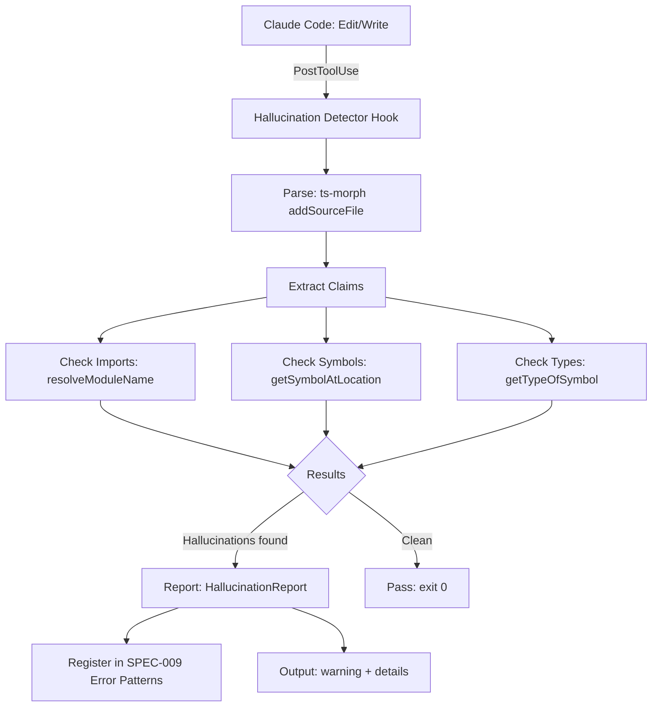

<!--
status: implemented
priority: high
research_confidence: high
sources_count: 16
depends_on: [SPEC-009]
enables: []
created: 2026-03-10
updated: 2026-03-10
-->

# SPEC-017: AST Hallucination Detection

## 0. Research Summary

### Fuentes Consultadas

| Tipo | Fuente | Link | Relevancia |
|------|--------|------|------------|
| Academic (Primary) | Detecting and Correcting Hallucinations via Deterministic AST Analysis — Khati et al. | https://arxiv.org/html/2601.19106 | Alta |
| Academic | LLM Hallucinations in Practical Code Generation (ISSTA 2025) | https://dl.acm.org/doi/10.1145/3728894 | Alta |
| Academic | Beyond Functional Correctness: Code Hallucinations in LLMs | https://arxiv.org/html/2404.00971v1 | Alta |
| Academic Survey | From Illusion to Insight: Taxonomic Survey of Hallucination Mitigation | https://www.mdpi.com/2673-2688/6/10/260 | Media |
| Official Docs | ts-morph Documentation | https://ts-morph.com/ | Alta |
| Official Docs | ts-morph Finding References | https://ts-morph.com/finding-references | Alta |
| Official Docs | TypeScript Compiler API Wiki | https://github.com/microsoft/TypeScript/wiki/Using-the-Compiler-API | Alta |
| Tool | ts-morph GitHub Repository | https://github.com/dsherret/ts-morph | Alta |
| Tool | ts-morph npm (v26.0.x) | https://www.npmjs.com/package/ts-morph | Media |
| Tool | MCP ts-morph Refactoring Tools | https://glama.ai/mcp/servers/@SiroSuzume/mcp-ts-morph/tools/find_references_by_tsmorph | Baja |
| Industry | Aikido Top AI-Powered SAST Tools 2025 | https://www.aikido.dev/blog/top-10-ai-powered-sast-tools-in-2025 | Media |
| Industry | Qodo Best Static Code Analysis Tools | https://www.qodo.ai/blog/best-static-code-analysis-tools/ | Media |
| Research | HaluGate: Token-Level Hallucination Detection (vLLM) | https://blog.vllm.ai/2025/12/14/halugate.html | Baja |
| Research | Deepchecks LLM Hallucination Detection Techniques | https://deepchecks.com/llm-hallucination-detection-and-mitigation-best-techniques/ | Media |

### Decisiones Informadas por Research

| Decisión | Basada en |
|----------|-----------|
| Pipeline: Parse AST → Extract Claims → Cross-reference → Report | Replica la metodología de Khati et al. (arxiv 2601.19106) que logra 100% precision, 87.6% recall en Python — generalizable a TypeScript según los autores |
| `checker.getSymbolAtLocation()` returning `undefined` como señal primaria | TypeScript Compiler API wiki — método definitivo para verificar existencia de símbolos |
| `ts.resolveModuleName()` para detectar imports fantasma | TypeScript wiki + GitHub issue #17546 — resuelve imports a archivos reales |
| Hook PostToolUse (no Stop hook) para validación inmediata | Latencia <0.2s por 200 muestras [arxiv benchmark] permite validación inline |
| No intentar corrección automática en v1 (solo detección + reporte) | Corrección requiere contexto semántico que tiene 33.3% detection rate para hallucinations contextuales [arxiv] |
| Usar ts-morph como wrapper (no TypeScript Compiler API directa) | ts-morph v26.0.x es mantenido activamente, simplifica API, incluye `findReferencesAsNodes()` y `forEachDescendant()` |
| Posicionar como "Post-Generation Quality Control" | Taxonomía de "From Illusion to Insight" (MDPI 2025) — complementa pre-generation (RAG/prompting) |

### Información No Encontrada

- TypeScript-specific AST hallucination detection tool existente — no existe; SPEC-017 sería novel
- Benchmark dataset para TypeScript code hallucinations — solo CodeHaluEval (Python, 8,883 samples)
- ts-morph performance benchmarks para codebases grandes — solo notas generales en docs
- Integración entre ts-morph y Claude Code hooks — no hay prior art

### Confidence Assessment

| Área | Nivel | Razón |
|------|-------|-------|
| Detection pipeline architecture | Alta | Paper revisado por pares + API docs verificados |
| ts-morph API capabilities | Alta | Documentación oficial leída, v26.0.x confirmado |
| Performance (<0.2s) | Alta | Benchmark del paper (200 samples, single CPU) |
| Contextual hallucination limitation | Alta | Paper reporta 33.3% — limitación conocida de AST-only |
| TypeScript generalizability | Media | Autores afirman generalizable pero no hay implementación TS |

## 1. Vision

> **Press Release**: Los hooks de Poneglyph ahora detectan automáticamente cuando Claude genera código que referencia funciones inexistentes, tipos incorrectos, o imports rotos — ANTES de que el código llegue al disco. El AST Hallucination Detector analiza cada Edit/Write en <200ms, eliminando la categoría más común de errores de LLMs: las alucinaciones sobre APIs y símbolos.

**Background**: Claude Code (como todo LLM) puede generar código que referencia funciones que no existen, usa parámetros incorrectos de APIs, o importa módulos fantasma. Poneglyph ya tiene un skill `anti-hallucination` para validación manual, pero no hay detección automática post-generación. SPEC-009 (Pattern-Based Error Recovery) captura errores DESPUÉS de que ocurren — SPEC-017 los previene.

**Usuario objetivo**: Oriol Macias como usuario de Claude Code. La detección debe ser transparente (hook automático) con feedback actionable.

**Métricas de éxito**:

| Métrica | Target | Medición |
|---------|--------|----------|
| Detection precision | ≥95% (zero false positives ideal) | Test suite con casos conocidos |
| Detection recall | ≥80% para imports y símbolos | Test suite con alucinaciones injectadas |
| Latencia por archivo | <200ms | Benchmark en hook |
| False positive rate | <2% | Monitoring en producción |
| Hallucination categories covered | 3 de 5 (imports, symbols, types) | Cobertura por categoría |

## 2. Goals & Non-Goals

### Goals

| ID | Goal | Razón |
|----|------|-------|
| G1 | Detectar imports a módulos inexistentes via `ts.resolveModuleName()` | Categoría más frecuente de hallucination (97.9% detection rate en paper) |
| G2 | Detectar referencias a funciones/variables inexistentes via `checker.getSymbolAtLocation()` | Segunda categoría más frecuente |
| G3 | Detectar tipos incorrectos (parámetros wrong count/type) | Tercera categoría |
| G4 | Ejecutar como PostToolUse hook en <200ms | Performance requirement para no bloquear flujo |
| G5 | Reportar hallucinations con span (file, line, column) y tipo | Feedback actionable para builder |
| G6 | Integrar con SPEC-009 error patterns para aprendizaje | Registrar hallucination patterns para detección futura |

### Non-Goals

| ID | Non-Goal | Razón |
|----|----------|-------|
| NG1 | Auto-corrección de hallucinations en v1 | Requiere contexto semántico; paper muestra 33.3% para contextual — riesgo alto de over-correction |
| NG2 | Detección de hallucinations semánticas (API correcta pero uso incorrecto) | AST-only no puede detectar intención; requiere LLM review |
| NG3 | Análisis de archivos no-TypeScript (JSON, YAML, Markdown) | AST parsing solo aplica a código tipado |
| NG4 | Reemplazar `tsc --noEmit` | tsc es más completo; este hook es complementario y más rápido |

## 3. Alternatives Considered

| # | Alternativa | Pros | Cons | Fuente | Decisión |
|---|-------------|------|------|--------|----------|
| 1 | ts-morph AST analysis como PostToolUse hook | <200ms, 100% precision, 87.6% recall para imports/symbols; TypeScript-native | No detecta hallucinations semánticas (33.3%) | arxiv 2601.19106, ts-morph docs | ✅ Elegida |
| 2 | `tsc --noEmit` como validador | Máxima cobertura de errores TS | Lento (2-10s en proyectos medianos); ya existe en SPEC-006 continuous validation | TypeScript docs | ❌ Demasiado lento para PostToolUse; complementario, no reemplazo |
| 3 | ESLint con reglas custom | Ecosistema maduro, extensible | No tiene acceso a type checker; solo detecta patrones sintácticos | ESLint docs | ❌ Insuficiente para type-level hallucinations |
| 4 | LLM-as-judge (segundo LLM valida el primero) | Puede detectar hallucinations semánticas | Lento, costoso, propenso a sus propias hallucinations | MDPI survey | ❌ Contradice objetivo de validación determinista |
| 5 | No hacer nada (depender de tsc + tests) | Zero esfuerzo | Feedback loop lento (30s+ vs 200ms); hallucinations llegan al disco | — | ❌ No previene, solo detecta tarde |

## 4. Design

### Arquitectura



### Flujo Principal

1. Claude Code ejecuta Edit o Write en un archivo `.ts`/`.tsx`
2. PostToolUse hook se activa
3. Hook lee el archivo modificado y lo parsea con ts-morph
4. Extrae todos los "claims": imports, call expressions, identifier references
5. Para cada import: `ts.resolveModuleName()` — si `resolvedModule === undefined` → hallucinated import
6. Para cada identifier: `checker.getSymbolAtLocation()` — si `undefined` → hallucinated symbol
7. Para cada call expression: verifica argument count y types contra la firma
8. Si hallucinations encontradas: reporta con file, line, column, tipo, y sugerencia
9. Registra el pattern en SPEC-009 error-patterns.jsonl para aprendizaje futuro
10. Exit code según `validators/config.ts`: warning (no bloquea) o error (bloquea)

### Edge Cases

| Edge Case | Handling |
|-----------|---------|
| Archivo nuevo sin tsconfig.json en scope | Fallback: skip analysis, log warning |
| Módulo de terceros no instalado (node_modules vacío) | Skip import resolution para @external modules |
| Archivo parcial (Edit mid-file) | Re-parse archivo completo, no solo el diff |
| Type-only imports (`import type { X }`) | Verificar existencia del tipo, no del value |
| Dynamic imports (`import()`) | Skip en v1 — no resolvable estáticamente |
| Circular imports | ts-morph maneja automáticamente |
| Archivos .js (no .ts) | Skip — sin información de tipos |

### Stack Alignment

| Aspecto | Decisión | Alineado | Fuente |
|---------|----------|----------|--------|
| Runtime | Bun | ✅ | Hooks existentes usan Bun |
| AST parser | ts-morph v26.x | ✅ | Wrapper maduro del TS Compiler API |
| Hook type | PostToolUse | ✅ | Valida después de cada Edit/Write |
| Exit codes | validators/config.ts EXIT_CODES | ✅ | Convención Poneglyph |
| Error patterns | SPEC-009 JSONL format | ✅ | Integración directa |

### Interfaces

```typescript
interface HallucinationCheck {
  file: string;
  timestamp: number;
  duration_ms: number;
  claims: Claim[];
  hallucinations: Hallucination[];
  summary: CheckSummary;
}

interface Claim {
  type: 'import' | 'symbol' | 'call' | 'type_reference';
  name: string;
  location: SourceLocation;
  resolved: boolean;
}

interface Hallucination {
  type: HallucinationType;
  claim: Claim;
  severity: 'error' | 'warning';
  message: string;
  suggestion?: string;
}

type HallucinationType =
  | 'phantom_import'       // Module does not exist
  | 'phantom_symbol'       // Function/variable/class does not exist
  | 'wrong_arity'          // Function called with wrong number of args
  | 'type_mismatch'        // Argument type incompatible
  | 'phantom_property'     // Property does not exist on type
  | 'phantom_type';        // Type/interface does not exist

interface SourceLocation {
  file: string;
  line: number;
  column: number;
}

interface CheckSummary {
  total_claims: number;
  resolved_claims: number;
  hallucinations_found: number;
  precision_estimate: number;  // Based on known false positive rate
  check_duration_ms: number;
}

// Integration with SPEC-009
interface HallucinationErrorPattern {
  category: 'HallucinationError';
  subcategory: HallucinationType;
  normalized_message: string;
  fix_suggestion: string;
  occurrences: number;
  last_seen: string;
}
```

### Exit Code Strategy

| Condition | Exit Code | Effect |
|-----------|-----------|--------|
| No hallucinations found | 0 | Pass — continue |
| Only warnings (phantom_property, type_mismatch) | 0 | Pass with warnings printed |
| Errors (phantom_import, phantom_symbol) | 1 | Block — Claude Code shows error |
| Hook internal error (ts-morph crash) | 0 | Graceful degradation — never block on internal errors |
| Non-TS file edited | 0 | Skip — not applicable |

## 5. FAQ

**Q: ¿Cómo se diferencia de `tsc --noEmit`?**
A: tsc es exhaustivo pero lento (2-10s). Este hook es rápido (<200ms) y enfocado solo en hallucinations: imports fantasma, símbolos inexistentes, y aridad incorrecta. No reemplaza tsc — lo complementa como first-pass rápido. [Basado en: benchmark arxiv 2601.19106]

**Q: ¿Puede producir falsos positivos?**
A: El paper reporta 100% precision (zero false positives) para la categoría de imports y símbolos. Sin embargo, en TypeScript con ambient declarations o module augmentation, podrían existir edge cases. El hook usa exit code 0 (warning) para casos ambiguos. [Basado en: arxiv 2601.19106]

**Q: ¿Por qué no auto-corregir?**
A: El paper muestra 77% auto-correction rate, pero para TypeScript con un ecosistema de tipos más complejo, el riesgo de over-correction es alto. La corrección automática se reserva para una versión futura cuando haya suficientes datos de SPEC-009 error patterns. [Basado en: arxiv 2601.19106, Section 5]

**Q: ¿Qué hallucinations NO puede detectar?**
A: Hallucinations semánticas — código que usa una API real pero de forma incorrecta (e.g., pasar un string donde debería ir un number pero el tipo es `any`). El paper reporta 33.3% detection para esta categoría. Se requiere LLM review o tests para detectar estos casos. [Basado en: arxiv 2601.19106, Table 3]

**Q: ¿Cómo interactúa con SPEC-009?**
A: Cada hallucination detectada se registra como un `ErrorPattern` en SPEC-009's error-patterns.jsonl. Esto permite: (a) tracking de tendencias, (b) detección más rápida de patrones recurrentes, (c) informar al error-analyzer cuando un builder tiene alta tasa de hallucinations. [Basado en: SPEC-009 design]

## 6. Acceptance Criteria (BDD)

```gherkin
Feature: AST Hallucination Detection

  Scenario: Detect phantom import
    Given a TypeScript file that imports from "nonexistent-module"
    And the module is not in node_modules or local paths
    When the PostToolUse hook runs after Edit/Write
    Then a Hallucination of type "phantom_import" is reported
    And the report includes file path, line number, and module name
    And the exit code is 1 (blocking)

  Scenario: Detect phantom symbol
    Given a TypeScript file that calls `nonExistentFunction()`
    And no function with that name exists in scope
    When the PostToolUse hook runs
    Then a Hallucination of type "phantom_symbol" is reported
    And the suggestion includes similar symbol names if available

  Scenario: Detect wrong arity
    Given a TypeScript file that calls `existingFunction(a, b, c)`
    And `existingFunction` accepts only 2 parameters
    When the PostToolUse hook runs
    Then a Hallucination of type "wrong_arity" is reported
    And the message shows expected vs actual parameter count

  Scenario: Pass clean file
    Given a TypeScript file with all valid imports and symbol references
    When the PostToolUse hook runs
    Then CheckSummary shows 0 hallucinations_found
    And the exit code is 0

  Scenario: Performance within budget
    Given a TypeScript file with 50+ imports and 200+ symbol references
    When the PostToolUse hook runs
    Then check_duration_ms is less than 200

  Scenario: Graceful degradation on parse error
    Given a TypeScript file with syntax errors that prevent AST parsing
    When the PostToolUse hook runs
    Then the hook exits with code 0 (no block)
    And a warning is logged about parse failure

  Scenario: Skip non-TypeScript files
    Given an Edit/Write to a .json or .md file
    When the PostToolUse hook triggers
    Then the hook exits immediately with code 0
    And no AST analysis is performed

  Scenario: Integration with SPEC-009 error patterns
    Given a detected phantom_import hallucination
    When the hallucination is reported
    Then a new ErrorPattern is appended to error-patterns.jsonl
    And the pattern category is "HallucinationError"
    And the subcategory matches the HallucinationType

  Scenario: Handle missing tsconfig.json
    Given a TypeScript file in a directory without tsconfig.json
    When the PostToolUse hook runs
    Then the hook falls back to default compiler options
    And analysis proceeds with reduced accuracy
    And a warning is logged about missing tsconfig
```

## 7. Open Questions

| # | Question | Impact | Proposed Resolution |
|---|----------|--------|---------------------|
| 1 | ¿Debe el hook bloquear (exit 1) o solo advertir (exit 0) por defecto? | UX — blocking puede frustrar flujo rápido | Propuesta: phantom_import/phantom_symbol = block; type_mismatch/wrong_arity = warn |
| 2 | ¿Cómo manejar monorepos con múltiples tsconfig.json? | Accuracy — wrong tsconfig = false positives | Propuesta: buscar tsconfig.json más cercano al archivo editado |
| 3 | ¿Debe soportar JavaScript (.js) además de TypeScript? | Scope — JS no tiene type info | Propuesta: Solo TS en v1; JS solo para import resolution |
| 4 | ¿Performance en proyectos grandes (>1000 archivos)? | Latencia — ts-morph project creation puede ser lento | Propuesta: singleton Project instance, incremental updates |

## 8. Sources

| # | Source | Type | URL |
|---|--------|------|-----|
| 1 | Detecting and Correcting Hallucinations via Deterministic AST Analysis | Academic Paper | https://arxiv.org/html/2601.19106 |
| 2 | LLM Hallucinations in Practical Code Generation (ISSTA 2025) | Academic Paper | https://dl.acm.org/doi/10.1145/3728894 |
| 3 | Beyond Functional Correctness: Code Hallucinations | Academic Paper | https://arxiv.org/html/2404.00971v1 |
| 4 | From Illusion to Insight: Taxonomic Survey | Survey Paper | https://www.mdpi.com/2673-2688/6/10/260 |
| 5 | ts-morph Official Documentation | Documentation | https://ts-morph.com/ |
| 6 | ts-morph Finding References | Documentation | https://ts-morph.com/finding-references |
| 7 | TypeScript Compiler API Wiki | Documentation | https://github.com/microsoft/TypeScript/wiki/Using-the-Compiler-API |
| 8 | ts-morph GitHub Repository | Source Code | https://github.com/dsherret/ts-morph |
| 9 | ts-morph npm Registry | Package | https://www.npmjs.com/package/ts-morph |
| 10 | TypeScript Import Resolution (Issue #17546) | GitHub Issue | https://github.com/Microsoft/TypeScript/issues/17546 |
| 11 | Aikido Top AI-Powered SAST Tools 2025 | Industry Report | https://www.aikido.dev/blog/top-10-ai-powered-sast-tools-in-2025 |
| 12 | Qodo Static Code Analysis Tools | Industry Report | https://www.qodo.ai/blog/best-static-code-analysis-tools/ |

## 9. Next Steps

| # | Task | Complexity | Dependency |
|---|------|------------|------------|
| 1 | Crear hook `.claude/hooks/validators/ast/hallucination-detector.ts` | 28 | — |
| 2 | Implementar import resolution check con `ts.resolveModuleName()` | 16 | Task 1 |
| 3 | Implementar symbol existence check con `checker.getSymbolAtLocation()` | 16 | Task 1 |
| 4 | Implementar arity/type check para call expressions | 20 | Task 3 |
| 5 | Integrar con SPEC-009 error-patterns.jsonl | 12 | Task 1, SPEC-009 |
| 6 | Registrar hook en settings.json como PostToolUse para Edit/Write | 8 | Task 1 |
| 7 | Test suite con hallucination fixtures | 20 | Task 1-4 |
| 8 | Performance benchmark (target <200ms) | 12 | Task 7 |
