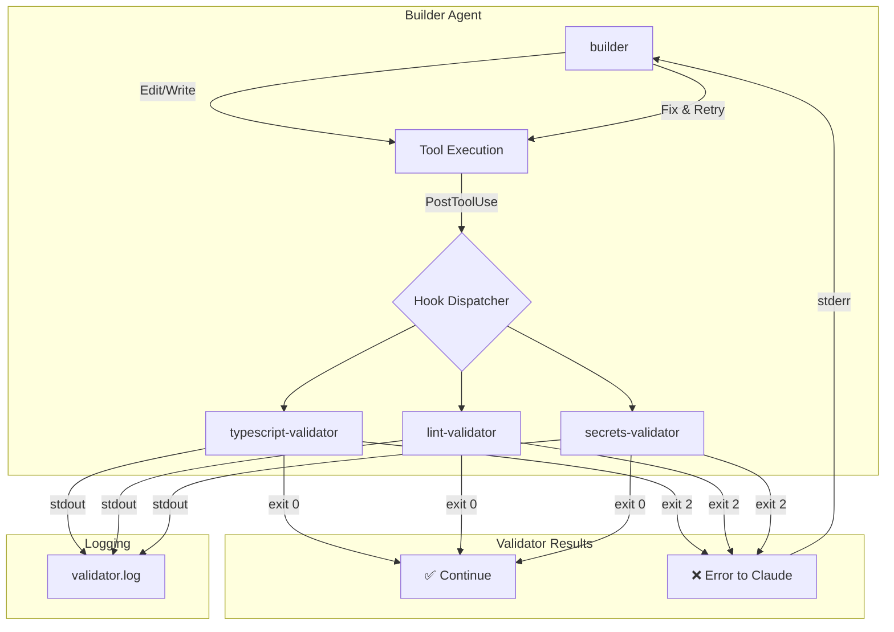
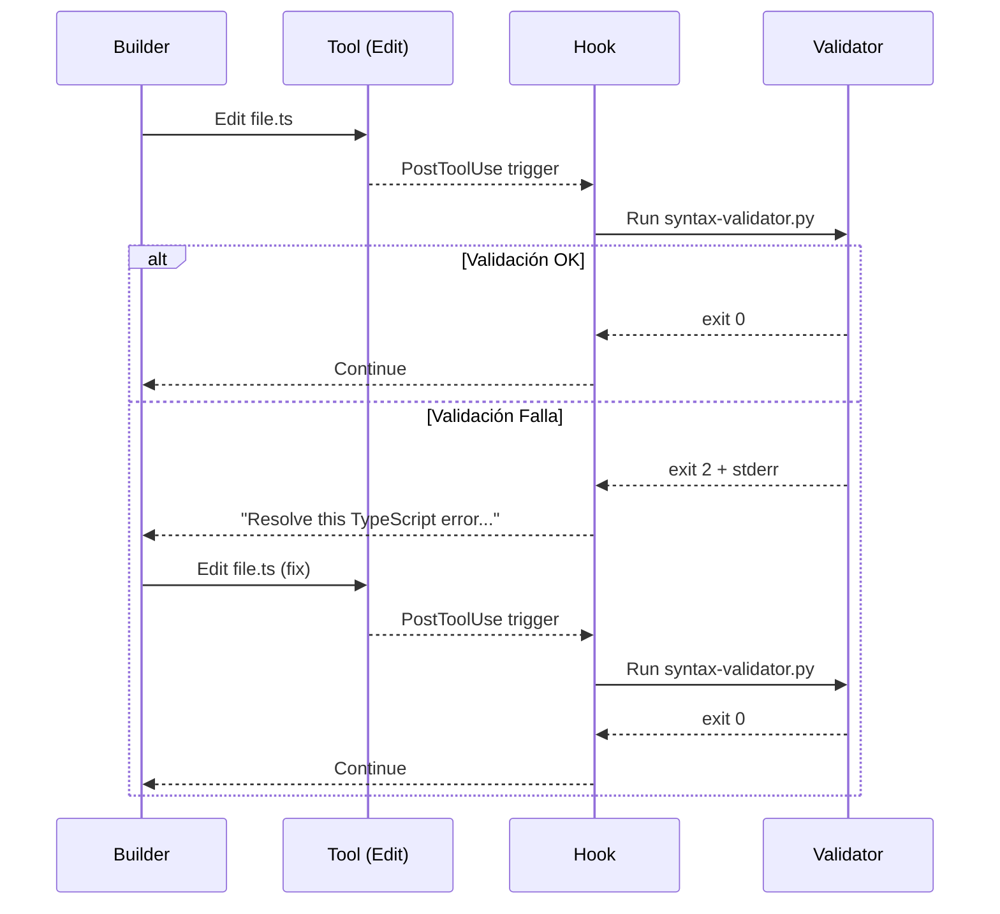
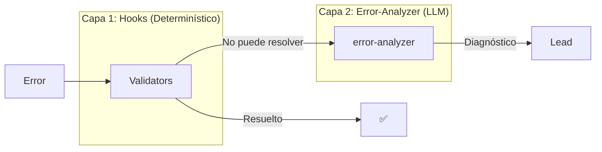

# Spec: Validation Hooks System

<!--
status: approved
priority: high
depends_on: [SPEC-004, SPEC-005, SPEC-008]
enables: []
created: 2026-01-20
updated: 2026-01-20
version: 1.0
architecture: base-agents-plus-skills
research_confidence: high
sources_count: 5
-->

## 0. Research Summary

### Fuentes Consultadas

| Tipo | Fuente | Link | Relevancia |
|------|--------|------|------------|
| Docs oficial | Claude Code Hooks Reference | [code.claude.com](https://code.claude.com/docs/en/hooks) | Alta |
| Tutorial | eesel.ai Hooks Guide | [eesel.ai](https://www.eesel.ai/blog/hooks-in-claude-code) | Alta |
| Video | Specialized Self-Validating Agents | cloudco/disler | Alta |
| Repo | Claude Code Hooks Mastery | [github.com/disler](https://github.com/disler/claude-code-hooks-mastery) | Alta |
| Blog | Claude Hooks Configuration | [claude.com/blog](https://claude.com/blog/how-to-configure-hooks) | Media |

### Decisiones Informadas por Research

| Decisión | Basada en |
|----------|-----------|
| **PostToolUse para validación** | Docs oficiales: "Runs immediately after a tool completes successfully" |
| **Exit code 2 para bloqueo** | Docs: "Blocking error - blocks the action, stderr shown to Claude" |
| **YAML frontmatter en agentes** | Docs: hooks pueden ir en agentes, skills, y commands |
| **Validators en directorio separado** | Video cloudco: `.claude/hooks/validators/` pattern |
| **Validación especializada por agente** | Video: "focused agent with one purpose outperforms unfocused agent" |

### Principio Clave (del Video)

> "Agents plus code beats agents. Self-validation is the closed loop prompt. Every good specialized agent validates that one thing."

### Información No Encontrada

- Benchmarks de overhead de hooks en tiempo de ejecución
- Límite recomendado de validators por agente
- Impacto en token consumption de re-validación

### Confidence Assessment

| Área | Nivel | Razón |
|------|-------|-------|
| Hook types y eventos | Alta | Docs oficiales completos |
| YAML frontmatter | Alta | Ejemplos verificados |
| Exit codes | Alta | Documentación explícita |
| Validators pattern | Media | Solo de video/repo externo |

---

## 1. Vision

> **Press Release**: Claude Code Poneglyph introduce Specialized Self-Validating Agents. Cada agente base (builder, reviewer) ahora incluye hooks que ejecutan validators determinísticos después de cada operación. Cuando un validator falla (exit code 2), Claude recibe el error y lo corrige automáticamente - creando un "closed loop" donde los agentes validan su propio trabajo sin intervención humana.

**Background**:
- Actualmente error-analyzer es **reactivo** (analiza después del hecho)
- Hooks permiten validación **proactiva** (en cada tool use)
- Video de cloudco demuestra el patrón con resultados concretos

**Usuario objetivo**: Agentes que necesitan garantías de calidad en su output.

**Métricas de éxito**:
- 80% de errores detectados por hooks antes de llegar al Lead
- Reducción de ciclos Lead → error-analyzer → re-planificar
- Cada validator < 100ms de ejecución

## 2. Goals & Non-Goals

### Goals

- [x] Hooks en YAML frontmatter de agentes base (builder, reviewer)
- [x] Directorio `.claude/hooks/validators/` con scripts de validación
- [x] Validators especializados por tipo de operación
- [x] Exit code 2 → Claude recibe error y corrige
- [x] Logging de validaciones en `.claude/hooks/logs/`
- [x] Catálogo de 8 validators core

### Non-Goals

- [ ] Validación de prompts del usuario (UserPromptSubmit) - fuera de scope
- [ ] Auto-approval de permisos (PermissionRequest) - riesgo de seguridad
- [ ] Validación de planner/error-analyzer (son read-only)
- [ ] Validators que modifican archivos (solo validan)
- [ ] Integración con CI/CD externo (futuro)

## 3. Alternatives Considered

| Alternativa | Pros | Cons | Fuente | Decisión |
|-------------|------|------|--------|----------|
| **A. Hooks en frontmatter** | Scoped al agente, auto-ejecuta | Requiere actualizar agentes | [Docs](https://code.claude.com/docs/en/hooks) | ✅ Elegida |
| B. Hooks globales en settings.json | Centralizado | No especializado por agente | Docs | ❌ Menos flexible |
| C. Prompt engineering "validate your work" | Simple | No determinístico, puede fallar | Video | ❌ No confiable |
| D. Solo error-analyzer (actual) | Ya existe | Reactivo, no proactivo | Arquitectura actual | ❌ Insuficiente |

## 4. Design

### 4.1 Estructura de Directorios

```
.claude/
├── hooks/
│   ├── validators/           # Scripts de validación
│   │   ├── typescript/
│   │   │   ├── syntax-validator.py
│   │   │   ├── type-check-validator.sh
│   │   │   └── import-validator.py
│   │   ├── code-quality/
│   │   │   ├── lint-validator.sh
│   │   │   └── complexity-validator.py
│   │   ├── security/
│   │   │   ├── secrets-validator.py
│   │   │   └── injection-validator.py
│   │   └── format/
│   │       ├── json-validator.py
│   │       └── yaml-validator.py
│   └── logs/                 # Output de validaciones
│       └── validator-{date}.log
├── agents/
│   ├── builder.md           # + hooks en frontmatter
│   └── reviewer.md          # + hooks en frontmatter
└── skills/
```

### 4.2 Arquitectura de Validación



### 4.3 Formato de Hook en Frontmatter

```yaml
---
name: builder
description: Implementation agent with self-validation
model: sonnet
allowedTools: [Read, Edit, Write, Bash, Glob, Grep]
hooks:
  PostToolUse:
    - matcher: "Edit|Write"
      hooks:
        - type: command
          command: "$CLAUDE_PROJECT_DIR/.claude/hooks/validators/typescript/syntax-validator.py"
          timeout: 30
        - type: command
          command: "$CLAUDE_PROJECT_DIR/.claude/hooks/validators/security/secrets-validator.py"
          timeout: 15
    - matcher: "Bash"
      hooks:
        - type: command
          command: "$CLAUDE_PROJECT_DIR/.claude/hooks/validators/code-quality/lint-validator.sh"
          timeout: 60
  Stop:
    - hooks:
        - type: command
          command: "$CLAUDE_PROJECT_DIR/.claude/hooks/validators/typescript/type-check-validator.sh"
          timeout: 120
---
```

### 4.4 Formato de Validator Script

```python
#!/usr/bin/env python3
"""
Validator: typescript-syntax
Validates TypeScript syntax in edited/written files.
Exit 0 = OK, Exit 2 = Error (blocking)
"""
import json
import sys
import subprocess
from pathlib import Path
from datetime import datetime

LOG_FILE = Path("$CLAUDE_PROJECT_DIR/.claude/hooks/logs/validator.log")

def log(message: str):
    """Log validation result."""
    timestamp = datetime.now().isoformat()
    with open(LOG_FILE, "a") as f:
        f.write(f"[{timestamp}] typescript-syntax: {message}\n")

def main():
    try:
        input_data = json.load(sys.stdin)
    except json.JSONDecodeError as e:
        print(f"Invalid JSON input: {e}", file=sys.stderr)
        sys.exit(1)

    tool_name = input_data.get("tool_name", "")
    tool_input = input_data.get("tool_input", {})

    # Get file path from tool input
    file_path = tool_input.get("file_path", "")

    if not file_path.endswith((".ts", ".tsx")):
        log(f"SKIP: {file_path} (not TypeScript)")
        sys.exit(0)

    # Run TypeScript syntax check
    result = subprocess.run(
        ["bun", "x", "tsc", "--noEmit", file_path],
        capture_output=True,
        text=True,
        timeout=30
    )

    if result.returncode != 0:
        error_msg = f"TypeScript syntax error in {file_path}:\n{result.stderr}"
        log(f"FAIL: {file_path}")

        # Format error for Claude to fix
        print(f"Resolve this TypeScript error in {file_path}:", file=sys.stderr)
        print(result.stderr, file=sys.stderr)
        sys.exit(2)  # Blocking error

    log(f"PASS: {file_path}")
    sys.exit(0)

if __name__ == "__main__":
    main()
```

### 4.5 Catálogo de Validators Core (8)

#### Para Builder (6)

| Validator | Matcher | Qué valida | Exit 2 cuando |
|-----------|---------|------------|---------------|
| `typescript/syntax-validator.py` | Edit\|Write | Sintaxis TS | `tsc --noEmit` falla |
| `typescript/import-validator.py` | Edit\|Write | Imports válidos | Import no resuelve |
| `code-quality/lint-validator.sh` | Bash | ESLint/Biome | Errores de lint |
| `security/secrets-validator.py` | Edit\|Write | No secrets en código | Detecta API keys, passwords |
| `security/injection-validator.py` | Bash | No command injection | Detecta patrones peligrosos |
| `format/json-validator.py` | Edit\|Write | JSON válido | JSON malformado |

#### Para Reviewer (2)

| Validator | Matcher | Qué valida | Exit 2 cuando |
|-----------|---------|------------|---------------|
| `code-quality/complexity-validator.py` | Stop | Complejidad ciclomática | CC > umbral |
| `typescript/type-check-validator.sh` | Stop | Type check completo | `bun run typecheck` falla |

### 4.6 Flujo de Auto-Corrección



### 4.7 Relación con Error-Analyzer

| Escenario | Quién maneja | Por qué |
|-----------|--------------|---------|
| Error de sintaxis en Edit | **Hook** (PostToolUse) | Detección inmediata, auto-fix |
| Error en ejecución de tests | **Hook** (Stop) | Validación final |
| Error lógico/semántico | **Error-Analyzer** | Requiere análisis LLM |
| Error de dependencias | **Error-Analyzer** | Contexto complejo |
| Timeout de API | **Error-Analyzer** | Clasificación TRANSIENT |



### 4.8 Configuración de Logging

```python
# .claude/hooks/validators/config.py
import os
from pathlib import Path

VALIDATORS_CONFIG = {
    "log_dir": Path(os.environ.get("CLAUDE_PROJECT_DIR", ".")) / ".claude/hooks/logs",
    "log_format": "[{timestamp}] {validator}: {status} - {file}",
    "retention_days": 7,
    "verbose": os.environ.get("CLAUDE_HOOK_VERBOSE", "false") == "true"
}
```

### 4.9 Edge Cases

| Caso | Comportamiento |
|------|----------------|
| Validator timeout (>60s) | Hook falla, continúa sin bloquear |
| Archivo no TypeScript | Validator hace exit 0 (skip) |
| Validator script no existe | Hook falla silenciosamente |
| Múltiples validators fallan | Todos los errores se concatenan |
| Archivo fuera de proyecto | Validator hace exit 0 (skip) |

## 5. FAQ

**Q: ¿Los hooks ralentizan la ejecución?**
A: Sí, pero son paralelos. Timeout default 60s. Para validators críticos, usar timeout < 30s.

**Q: ¿Qué pasa si el validator tiene un bug?**
A: Exit code != 0 y != 2 se trata como warning, no bloquea. Revisar logs.

**Q: ¿Los hooks funcionan en subagents?**
A: Sí, si el agente tiene hooks en su frontmatter. También existe `SubagentStop`.

**Q: ¿Cómo desactivo un validator temporalmente?**
A: Comentar en el frontmatter del agente o renombrar el script.

**Q: ¿Qué es lo más difícil/riesgoso?**
A: **Loops infinitos**: Si validator siempre falla → builder intenta arreglar → falla de nuevo. Mitigación: Límite de 3 reintentos por archivo en el mismo tool call.

## 6. Acceptance Criteria (BDD)

```gherkin
Feature: Validation Hooks System v1.0

  Background:
    Given directorio .claude/hooks/validators/ existe
    And builder.md tiene hooks configurados en frontmatter

  Scenario: Validator detecta error de sintaxis y Claude corrige
    Given builder edita un archivo TypeScript con error de sintaxis
    When PostToolUse hook se ejecuta
    Then syntax-validator.py detecta el error
    And retorna exit code 2
    And stderr contiene "Resolve this TypeScript error"
    And Claude recibe el mensaje
    And Claude corrige el error
    And PostToolUse hook se ejecuta de nuevo
    And syntax-validator.py retorna exit code 0

  Scenario: Validator detecta secrets en código
    Given builder escribe código con "API_KEY = 'sk-123'"
    When PostToolUse hook se ejecuta
    Then secrets-validator.py detecta el patrón
    And retorna exit code 2
    And stderr contiene "Remove hardcoded secret"
    And Claude recibe el mensaje

  Scenario: Múltiples validators corren en paralelo
    Given builder edita archivo.ts
    When PostToolUse hook se ejecuta
    Then syntax-validator y secrets-validator corren en paralelo
    And ambos resultados se procesan

  Scenario: Validator hace skip en archivo no-TypeScript
    Given builder edita archivo.md
    When PostToolUse hook se ejecuta
    Then syntax-validator.py retorna exit code 0
    And log muestra "SKIP: archivo.md (not TypeScript)"

  Scenario: Stop hook ejecuta type-check completo
    Given builder termina de implementar feature
    When Stop hook se ejecuta
    Then type-check-validator.sh corre `bun run typecheck`
    And si hay errores, Claude los ve antes de reportar "completado"

  Scenario: Validator timeout no bloquea
    Given validator tarda más de 60s
    When timeout ocurre
    Then hook termina con warning
    And ejecución continúa sin bloquear
```

## 7. Open Questions

- [x] ~~¿Hooks en builder, reviewer, o ambos?~~ Ambos, especializados
- [ ] ¿Límite de reintentos para evitar loops infinitos?
- [ ] ¿Validators pueden recibir configuración vía env vars?
- [ ] ¿Integrar con `bun test` como validator de Stop?

## 8. Sources

### Links Verificados

- [Claude Code Hooks Reference](https://code.claude.com/docs/en/hooks) - Documentación oficial completa
- [eesel.ai: Hooks in Claude Code](https://www.eesel.ai/blog/hooks-in-claude-code) - Guía práctica
- [Claude Blog: How to Configure Hooks](https://claude.com/blog/how-to-configure-hooks) - Configuración avanzada
- [GitHub: claude-code-hooks-mastery](https://github.com/disler/claude-code-hooks-mastery) - Ejemplos y patterns
- Video: "Specialized Self-Validating Agents" by cloudco/disler - Concepto original

## 9. Next Steps

1. [ ] Crear directorio `.claude/hooks/validators/` con estructura
2. [ ] Implementar 8 validators core
3. [ ] Actualizar `.claude/agents/builder.md` con hooks
4. [ ] Actualizar `.claude/agents/reviewer.md` con hooks
5. [ ] Crear logging system para validators
6. [ ] Testing manual del flujo de auto-corrección

---

## Changelog

| Versión | Fecha | Cambios |
|---------|-------|---------|
| 1.0.0 | 2026-01-20 | Spec inicial basada en research + video cloudco |
