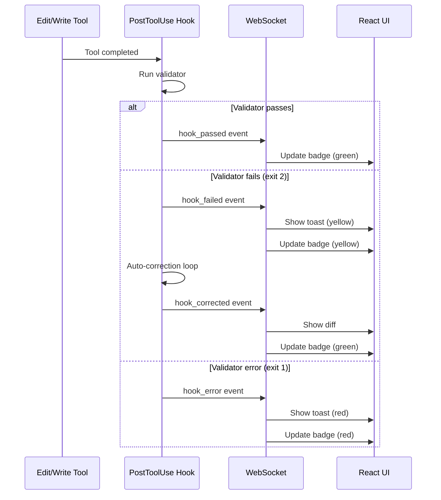

# SPEC-013: Validation Hooks UI

> **Status**: approved | **Version**: 1.0 | **Updated**: 2026-01-21

## 0. Research Summary

### Fuentes Consultadas

| Tipo | Fuente | Link | Relevancia |
|------|--------|------|------------|
| Form validation | React Hook Form | [Link](https://react-hook-form.com/advanced-usage) | Media |
| UI feedback | DEV.to | [Link](https://dev.to/tahamjp/advanced-react-hooks-in-2025-patterns-you-should-know-2e4n) | Media |
| Real-time patterns | MakersDen | [Link](https://makersden.io/blog/reactjs-dev-for-real-time-analytics-dashboards) | Alta |
| SPEC-010 | Internal | validation-hooks-system.md | Alta |

### Decisiones Informadas por Research

| Decisión | Basada en |
|----------|-----------|
| Toast notifications para hook events | Standard UI pattern para feedback |
| Inline indicators en tool cards | Proximity principle - feedback cerca de acción |
| Color coding (green/yellow/red) | Universal comprehension |
| Auto-dismiss vs sticky | Severity-based: errors sticky, success auto-dismiss |

### Confidence Assessment

| Área | Nivel | Razón |
|------|-------|-------|
| UI patterns | Alta | Standard validation feedback patterns |
| Integration con SPEC-010 | Alta | Internal spec, well-defined events |
| Real-time updates | Alta | WebSocket ya implementado |

---

## 1. Vision

> **Press Release**: La UI de Validation Hooks muestra feedback visual inmediato cuando los validators de SPEC-010 ejecutan, permitiendo ver qué se validó, qué falló, y qué se auto-corrigió en tiempo real.

**Background**: SPEC-010 define validators que corren en hooks PostToolUse/Stop. Necesitan feedback visual.

**Usuario objetivo**: Desarrolladores que quieren entender qué validaciones se aplican y por qué.

**Métricas de éxito**:
- 100% de hook events tienen feedback visual
- Auto-corrections visibles con diff before/after
- <200ms latencia entre hook event y UI update

---

## 2. Goals & Non-Goals

### Goals

- [ ] Mostrar badge de validación en ToolCard (Edit/Write)
- [ ] Toast notification para hook failures
- [ ] Panel de "Validation Activity" con historial
- [ ] Visualizar auto-corrections con diff
- [ ] Indicador de "validating..." durante ejecución

### Non-Goals

- [ ] Configurar validators desde UI (config file only)
- [ ] Disable validators desde UI
- [ ] Detailed validator logs (console only)

---

## 3. Alternatives Considered

| Alternativa | Pros | Cons | Decisión |
|-------------|------|------|----------|
| Solo toasts | Simple | Se pierden | ❌ Insuficiente |
| Solo panel | Historial | No inmediato | ❌ Falta feedback |
| Toast + inline badge + panel | Completo | Más complejo | ✅ Elegida |
| Modal para cada failure | Muy visible | Interrumpe flow | ❌ Demasiado intrusivo |

---

## 4. Design

### 4.1 Arquitectura de Componentes

```
src/components/validation/
├── ValidationBadge.tsx          # Badge en ToolCard
├── ValidationToast.tsx          # Toast customizado
├── ValidationPanel.tsx          # Panel lateral/colapsable
├── ValidationDiff.tsx           # Diff de auto-correction
├── ValidatingIndicator.tsx      # Spinner durante validación
└── hooks/
    └── useValidationEvents.ts   # Hook para subscription
```

### 4.2 Flujo de Eventos



### 4.3 Validation Badge States

```typescript
type ValidationState =
  | 'pending'      // Gris - no validado aún
  | 'validating'   // Azul + spinner - en progreso
  | 'passed'       // Verde - validación exitosa
  | 'corrected'    // Amarillo + check - auto-corregido
  | 'failed'       // Rojo - falló, no auto-corregible
  | 'skipped';     // Gris claro - no aplica validator

interface ValidationBadgeProps {
  state: ValidationState;
  validator?: string;        // Nombre del validator
  corrections?: number;      // Cuántas auto-corrections
  onClick?: () => void;      // Abrir detalles
}
```

### 4.4 Visual Design

#### Badge en ToolCard

```
┌─────────────────────────────────────────────────────┐
│ Edit: src/services/auth.ts                    [✓] ✓│
│ ┌─────────────────────────────────────────────────┐ │
│ │ - const user = data                             │ │
│ │ + const user: User = data                       │ │
│ └─────────────────────────────────────────────────┘ │
│                           syntax ✓  types ✓  lint ✓ │
└─────────────────────────────────────────────────────┘

Legend:
[✓] = Collapsed validation badge (all passed)
✓ = Individual validator badges (expandable)
```

#### Toast para Auto-correction

```
┌──────────────────────────────────────────┐
│ ⚠️ Auto-corrected: TypeScript Error      │
│                                          │
│ Validator: typescript-syntax             │
│ File: src/services/auth.ts               │
│ Issue: Missing return type               │
│                                          │
│ [View Diff]              [Dismiss]       │
└──────────────────────────────────────────┘
```

#### Validation Panel

```
┌─────────────────────────────────────────┐
│ Validation Activity            [Expand] │
├─────────────────────────────────────────┤
│ ✓ typescript-syntax   auth.ts    10:32  │
│ ⚠ typescript-types    user.ts    10:31  │
│   └─ Auto-corrected (1 fix)             │
│ ✓ eslint-check        api.ts     10:30  │
│ ✗ security-check      env.ts     10:29  │
│   └─ Manual fix required                │
└─────────────────────────────────────────┘
```

### 4.5 WebSocket Events (from SPEC-010)

```typescript
// Events que el backend emite
interface HookEvent {
  type: 'hook_triggered' | 'hook_passed' | 'hook_failed' | 'hook_corrected' | 'hook_error';
  hookType: 'PreToolUse' | 'PostToolUse' | 'Stop';
  validator: string;
  toolCallId: string;      // Para asociar con ToolCard
  filePath?: string;
  exitCode: 0 | 1 | 2;
  message?: string;
  correction?: {
    before: string;
    after: string;
  };
  timestamp: number;
}
```

### 4.6 Integration con ToolCard existente

```typescript
// Modificación a ToolCard.tsx existente
interface ToolCardProps {
  // ... existing props
  validationState?: ValidationState;
  validationDetails?: ValidationDetails[];
}

// En el render
<ToolCard
  tool="Edit"
  file="src/auth.ts"
  validationState="corrected"
  validationDetails={[
    { validator: 'typescript', state: 'passed' },
    { validator: 'eslint', state: 'corrected', corrections: 1 }
  ]}
/>
```

### 4.7 Toast Configuration

```typescript
const TOAST_CONFIG = {
  passed: {
    duration: 2000,      // Auto-dismiss
    type: 'success',
    show: false,         // No mostrar toast para passed
  },
  corrected: {
    duration: 5000,      // Más tiempo para leer
    type: 'warning',
    show: true,
    action: 'View Diff',
  },
  failed: {
    duration: null,      // Sticky hasta dismiss manual
    type: 'error',
    show: true,
    action: 'View Details',
  },
};
```

### 4.8 Store Slice (ver SPEC-014)

```typescript
interface ValidationSlice {
  events: HookEvent[];
  byToolCall: Map<string, HookEvent[]>;

  // Actions
  addEvent: (event: HookEvent) => void;
  clearEvents: () => void;

  // Selectors
  getEventsForTool: (toolCallId: string) => HookEvent[];
  getRecentEvents: (limit: number) => HookEvent[];
  getStats: () => ValidationStats;
}
```

---

## 5. FAQ

**Q: ¿Qué pasa si hay muchos auto-corrections seguidos?**
A: Batch toasts: "3 auto-corrections applied" con link a panel.

**Q: ¿Se pueden silenciar las notificaciones?**
A: Sí, configuración en Settings: "Show validation notifications" toggle.

**Q: ¿El panel consume mucha memoria con muchos eventos?**
A: Ring buffer de 100 eventos máximo, FIFO.

---

## 6. Acceptance Criteria (BDD)

```gherkin
Feature: Validation Hooks UI

Scenario: Mostrar badge de validación exitosa
  Given un Edit tool ejecutado
  When el validator typescript-syntax pasa
  Then ToolCard muestra badge verde ✓
  And no se muestra toast

Scenario: Mostrar auto-correction
  Given un Edit tool ejecutado
  When el validator detecta error (exit 2)
  And auto-corrige el código
  Then ToolCard muestra badge amarillo ⚠
  And se muestra toast con "Auto-corrected"
  And toast tiene botón "View Diff"

Scenario: Mostrar error no corregible
  Given un Write tool ejecutado
  When el validator falla (exit 1)
  Then ToolCard muestra badge rojo ✗
  And se muestra toast sticky con error
  And toast requiere dismiss manual

Scenario: Ver historial en panel
  Given múltiples validaciones ejecutadas
  When abro Validation Panel
  Then veo lista cronológica de eventos
  And puedo expandir para ver detalles
  And eventos antiguos se eliminan (>100)
```

---

## 7. Open Questions

- [ ] ¿Mostrar validators disponibles aunque no se hayan ejecutado?
- [ ] ¿Añadir filtro por validator type en el panel?

---

## 8. Sources

- [React Hook Form - Advanced Usage](https://react-hook-form.com/advanced-usage) - Error handling patterns
- [DEV.to - React Hooks 2025](https://dev.to/tahamjp/advanced-react-hooks-in-2025-patterns-you-should-know-2e4n) - Custom hooks patterns
- [SPEC-010](./validation-hooks-system.md) - Validation Hooks System

---

## 9. Next Steps

- [ ] Modificar ToolCard para aceptar validation props
- [ ] Crear ValidationBadge component
- [ ] Crear ValidationToast con diff viewer
- [ ] Crear ValidationPanel colapsable
- [ ] Añadir WebSocket handlers para hook events
- [ ] Crear ValidationSlice en Zustand (ver SPEC-014)
