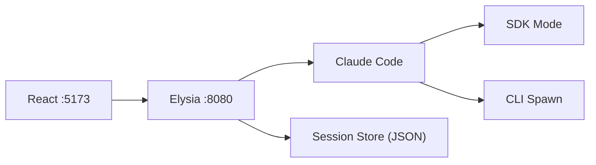

# Claude Code Poneglyph - Reference

Documento de referencia extendido. Cargar con `/load-reference`.

## Arquitectura



## Modos de Ejecucion (detalle)

| Modo | Implementacion | Uso |
|------|----------------|-----|
| SDK | `query()` de @anthropic-ai/claude-agent-sdk | Headless, produccion, sin terminal |
| CLI Spawn | `spawn('claude', ['-p', prompt])` | Interactivo, comandos, skills, agentes |

**Cuando usar cada modo:**
- **SDK**: Tareas automatizadas, paralelas, sin UI de Claude
- **CLI Spawn**: Capacidades completas (comandos, skills, agentes)

## Estructura del Proyecto

```
claude-code-poneglyph/
├── CLAUDE.md               # Core (reducido)
├── CLAUDE-reference.md     # Este archivo
├── claude-code-ui/
│   ├── server/             # Backend Bun/Elysia
│   │   └── src/
│   │       ├── index.ts    # HTTP + WebSocket
│   │       └── services/
│   │           ├── claude.ts      # SDK + Spawn wrapper
│   │           ├── sessions.ts    # Persistencia
│   │           └── memory/        # Sistema memoria
│   └── web/                # Frontend React
│       └── src/
│           ├── App.tsx
│           └── components/
└── .claude/                # Configuracion Claude Code
    ├── agents/             # Agentes personalizados
    ├── commands/           # Comandos slash
    ├── skills/             # Skills activables
    ├── docs/               # Documentacion
    └── rules/              # Reglas de codigo
```

## API Endpoints (completa)

| Metodo | Endpoint | Descripcion |
|--------|----------|-------------|
| GET | `/api/health` | Health check |
| GET | `/api/sessions` | Listar sesiones |
| POST | `/api/sessions` | Crear sesion |
| GET | `/api/sessions/:id` | Obtener sesion por ID |
| DELETE | `/api/sessions/:id` | Eliminar sesion |
| DELETE | `/api/sessions` | Eliminar todas |
| POST | `/api/execute` | Ejecutar prompt (SDK) |
| POST | `/api/execute-cli` | Ejecutar prompt (CLI) |
| GET | `/api/claude-config` | Obtener agents/skills/commands |
| GET | `/api/agents` | Listar agentes |
| GET | `/api/agents/active` | Agentes activos |
| GET | `/api/agents/session/:id` | Agentes por sesion |
| DELETE | `/api/agents/:id` | Eliminar agente |
| POST | `/api/memory/search` | Busqueda en memoria |
| POST | `/api/memory/feedback` | Feedback de memoria |
| GET | `/api/memory/stats` | Estadisticas memoria |
| WS | `/ws` | WebSocket streaming |

## Proveedores Soportados

| Proveedor | Servicio | Descripcion |
|-----------|----------|-------------|
| Claude | `services/claude.ts` | SDK + CLI spawn (principal) |
| Codex | `services/codex.ts` | OpenAI Codex alternativo |
| Gemini | `services/gemini.ts` | Google Gemini alternativo |

## Sistema de Memoria

Ubicacion: `server/src/services/memory/`

| Componente | Archivo | Descripcion |
|------------|---------|-------------|
| Store | `memory-store.ts` | Almacenamiento de memorias |
| Graph | `memory-graph.ts` | Relaciones entre memorias |
| Extraction | `extraction.ts` | Extraccion de informacion |
| Recall | `recall.ts` | Recuperacion de memorias |

## Sistema de Agentes

Registry: `server/src/services/agent-registry.ts`
Dashboard: `web/src/components/AgentsDashboard.tsx`

## Available Tools

### MCP Servers

| MCP | Purpose |
|-----|---------|
| Context7 | Framework documentation |
| Sequential Thinking | Structured reasoning |

### Agents (via Task tool)

| Agent | Model | Proposito |
|-------|-------|-----------|
| architect | opus | Diseno y planificacion de features |
| bug-documenter | sonnet | Documentar bugs y soluciones |
| builder | sonnet | Implementacion segun specs |
| code-quality | opus | Analisis SOLID, complejidad |
| refactor-agent | sonnet | Refactoring seguro |
| reviewer | sonnet | Code review |
| scout | haiku | Exploracion read-only |
| task-decomposer | opus | Descomponer tareas |

### Skills

| Skill | Triggers |
|-------|----------|
| code-style-enforcer | type hints, imports, YOLO |
| config-validator | env, settings, config |
| logging-strategy | structlog, winston, pino |
| typescript-patterns | TypeScript, async, error |
| bun-best-practices | Bun, runtime, test |
| prompt-engineer | prompt, agent, mejorar |

### Commands

| Comando | Descripcion |
|---------|-------------|
| /planner | Motor de Estrategia (Discovery, Gap Analysis, DAG) |
| /commands | Listar comandos disponibles |
| /dev | Iniciar servidores desarrollo |
| /docs | Navegar documentacion |
| /generate-from-spec | Tests + codigo desde BDD |
| /load-anti-hallucination | Patrones validacion |
| /load-reference | Este documento |
| /load-security | Patrones seguridad |
| /load-testing-strategy | Estrategia testing |
| /tools | Listar herramientas |
| /validate-claim | Verificar archivos/funciones |

## Response Style

### Formatos Obligatorios
- **Headers** (`##`, `###`) para secciones
- **Tablas** para comparaciones, datos, listas >3 items
- **Code blocks** con syntax highlighting
- **Bold** para terminos importantes
- **Inline code** para archivos, funciones, variables

### Formatos Prohibidos
- ASCII box drawings (`+-|`)
- Diagramas side-by-side
- Alineacion manual con espacios

### Mermaid Diagrams
Usar para arquitectura, flujos, dependencias, secuencias.

## Anti-Hallucination (completo)

### Core Rules
1. **File Validation**: `Glob` antes de afirmar existencia
2. **Function Validation**: `Grep` antes de afirmar existencia
3. **Read Before Edit**: Leer antes de modificar
4. **Confidence < 70%**: Preguntar al usuario

### Confidence Thresholds

| Domain | Ask | Proceed |
|--------|-----|---------|
| Frontend | <65% | >85% |
| Backend | <70% | >90% |
| DB/Security | <75% | >92% |

### Language by Confidence

| Confidence | Action | Ejemplo |
|------------|--------|---------|
| <65% | ASK | "No encuentro X. Puedes verificar?" |
| 65-85% | HEDGE | "Podria estar en src/auth.ts..." |
| >85% | CONFIDENT | "Voy a actualizar src/auth.ts" |

## Cross-Platform Notes

CLI Spawn requiere `shell: true` para Windows:

```typescript
spawn('claude', args, {
  cwd: workDir,
  shell: true,  // Necesario para Windows
})
```
