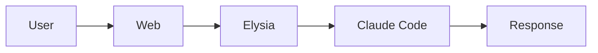

# Claude Code Poneglyph

UI wrapper para Claude Code | Bun + Elysia + React

## WHAT

Plataforma para ejecutar Claude Code con UI web, soporte SDK y CLI spawn.

## WHY

| Problema | Solución |
|----------|----------|
| CLI sin UI | Web interface con streaming |
| Sin memoria persistente | Sistema de memoria semántica |
| Sin orquestación | Multi-agente con especialización |

## HOW



## Commands

```bash
bun dev:server  # Backend :8080
bun dev:web     # Frontend :5173
```

## API

| Endpoint | Descripción |
|----------|-------------|
| POST `/api/execute` | SDK mode |
| POST `/api/execute-cli` | CLI spawn |
| WS `/ws` | Streaming |
| GET `/api/sessions` | Listar sesiones |

## Anti-Hallucination

1. `Glob` antes de afirmar existencia de archivo
2. `LSP/Grep` antes de afirmar existencia de función
3. `Read` antes de `Edit`
4. Preguntar si confidence < 70%

## Tool Hierarchy

LSP (primario) > Grep (fallback) > Glob (archivos)

## Deep Dive

Documentación detallada en `.claude/agent_docs/`:
- `architecture.md` - Arquitectura completa
- `api-reference.md` - Todos los endpoints
- `patterns.md` - Patrones del proyecto
- `troubleshooting.md` - Errores comunes

## Extended Context

| Comando | Contenido |
|---------|-----------|
| `/load-reference` | API, arquitectura, tools |
| `/load-security` | Patrones de seguridad |
| `/load-testing-strategy` | Testing |
