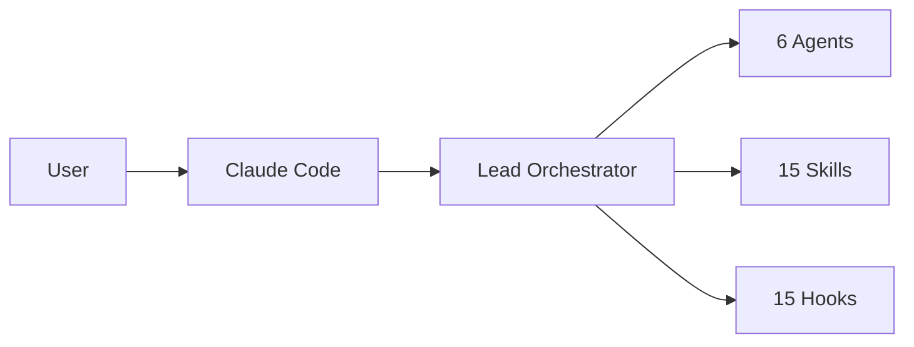
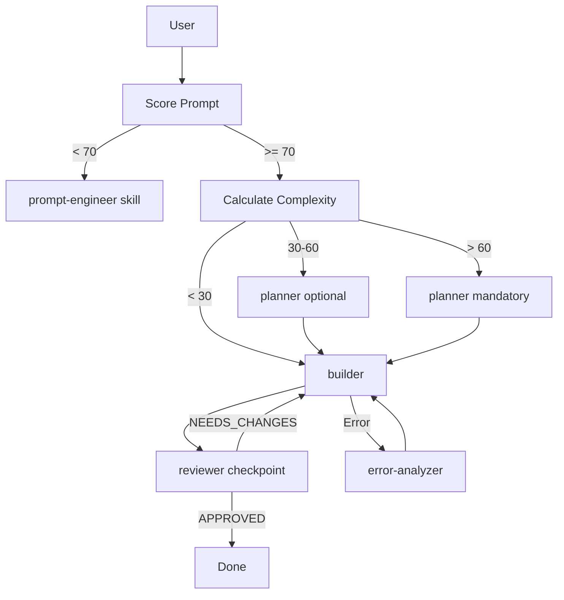

# Claude Code Poneglyph

Multi-agent orchestration system for Claude Code

> **Configuration Architecture**
>
> This project provides the **base orchestration** for Claude Code.
> It syncs to `~/.claude/` and applies to all projects.
>
> | Level | Location | Content |
> |-------|----------|---------|
> | **Global** | `~/.claude/` (symlink here) | Orchestration, agents, skills |
> | **Project** | `./.claude/` of each project | Domain specialization |
>
> Claude Code combines both levels: global + project.

---

## Philosophy

This project is a **private** tool for **Oriol Macias**.

### Objective

Claude Code acts as the best possible **co-programmer**. Together we go further.

### Expected Behavior

| Quality | Meaning |
|---------|---------|
| **Accurate** | Verify before asserting. Glob/LSP before assuming. |
| **Professional** | Clean code, no over-engineering. |
| **Agile** | Parallelize operations, don't waste time. |
| **Resourceful** | Elegant solutions, not brute force. |
| **Explorer** | Understand context before acting. |
| **Hardworking** | Complete tasks, don't leave them half done. |

### NOT

- A commercial product
- A public SaaS
- Something that needs "enterprise security"

---

## WHAT

Orchestration system that powers Claude Code with specialized agents, skills, hooks and rules.

## WHY

| Problem | Solution |
|---------|----------|
| No orchestration | 6 core agents + 1 meta agent with complexity-based routing |
| No automatic validation | 15 hooks (pre/post/stop) |
| No domain knowledge | 15 skills auto-matched by keywords |
| No persistent memory | Semantic memory system |

## HOW


```mermaid
graph LR
    User --> CC[Claude Code]
    CC --> Orch[Lead Orchestrator]
    Orch --> Agents[6 Agents]
    Orch --> Skills[15 Skills]
    Orch --> Hooks[15 Hooks]
```

## Structure

```
.claude/
├── agents/       # 6 core + 1 meta agent
├── skills/       # 15 skills with auto-matching
├── hooks/        # Hooks pre/post/stop
├── rules/        # Orchestration rules
├── commands/     # Slash commands
└── agent_docs/   # Extended documentation
```

## Anti-Hallucination

1. `Glob` before asserting file existence
2. `LSP/Grep` before asserting function existence
3. `Read` before `Edit`
4. Ask if confidence < 70%

## Tool Hierarchy

LSP (primary) > Grep (fallback) > Glob (files)

## Extended Context

| Command | Content |
|---------|---------|
| `/load-security` | Security patterns |
| `/load-testing-strategy` | Testing |

## Lead Orchestrator Mode

This session acts as a **pure orchestrator**. Does NOT execute code directly.

### Allowed Tools

| Tool | Use |
|------|-----|
| `Task` | Delegate to agents (builder, reviewer, planner, error-analyzer, scout) |
| `Skill` | Load skills for context |
| `AskUserQuestion` | Clarify requirements |
| `TaskList/Create/Update` | Manage task list |

### PROHIBITED Tools

| Tool | Alternative |
|------|-------------|
| `Read` | Delegate to scout or builder |
| `Edit` | Delegate to builder |
| `Write` | Delegate to builder |
| `Bash` | Delegate to builder |
| `Glob` | Delegate to scout/Explore |
| `Grep` | Delegate to scout/Explore |
| `WebFetch/WebSearch` | Agents have access |

### Mandatory Flow


```mermaid
graph TD
    U[User] --> S[Score Prompt]
    S -->|< 70| PE[prompt-engineer skill]
    S -->|>= 70| C[Calculate Complexity]
    C -->|< 30| B[builder direct]
    C -->|30-60| P1[planner optional]
    C -->|> 60| P2[planner mandatory]
    P1 & P2 --> B[builder]
    B --> R[reviewer checkpoint]
    R -->|APPROVED| D[Done]
    R -->|NEEDS_CHANGES| B
    B -->|Error| EA[error-analyzer]
    EA --> B
```

### Execution Modes

| Mode | When | How | Cost |
|------|------|-----|------|
| **Subagents** (default) | Always, except team criteria | `Task()` hub-spoke via Lead | 1x |
| **Team Agents** (experimental) | Complexity >60 + 3+ independent domains + inter-agent communication | Independent Claude Code processes per domain | 3-7x |

The planner decides the mode. See `.claude/rules/complexity-routing.md` for criteria.
Requires `CLAUDE_CODE_EXPERIMENTAL_AGENT_TEAMS=1` in settings.json.

### Key Rules

1. **Evaluate prompt** with 5-criteria scoring (see `.claude/rules/prompt-scoring.md`)
2. **Calculate complexity** before delegating (see `.claude/rules/complexity-routing.md`)
3. **Load relevant skills** by keywords (see `.claude/rules/skill-matching.md`)
4. **Delegate implementation** to builder, NEVER implement directly
5. **Validate with reviewer** at critical checkpoints
6. **Analyze errors** with error-analyzer if it fails
7. **Parallelize delegation** when possible (see `.claude/rules/lead-orchestrator.md`)

### Post-Implementation Verification (MANDATORY)

Builder verifies automatically via Stop hook `validate-tests-pass.ts`. Lead does NOT execute commands directly.

| Step | Who | Action |
|------|-----|--------|
| 1 | Builder (auto) | Stop hook runs `bun test` |
| 2 | Lead | Reviews builder report |
| 3 | Lead (if fails) | Delegates to error-analyzer → re-delegates to builder |

**NEVER report "completed" without builder confirming tests passing.**
