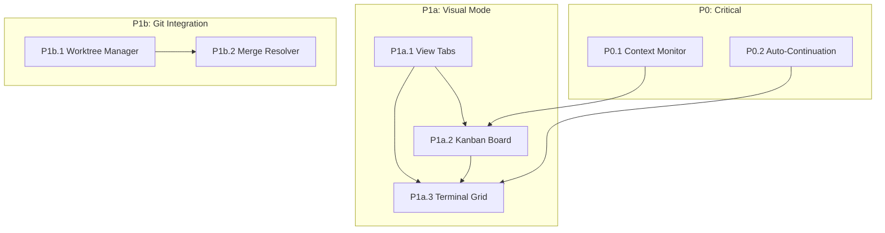

# PLAN-MEJORAS.md - Claude Code Poneglyph

> Documento de especificaciones ejecutables para mejoras del proyecto
> Fecha: 2026-01-02
> Versión: 5.0 - PLAN COMPLETADO

---

## Índice

1. [Resumen Ejecutivo](#resumen-ejecutivo)
2. [Tabla de Seguimiento de Features](#tabla-de-seguimiento-de-features)
3. [Proyectos de Referencia](#proyectos-de-referencia)
4. [Optimizaciones de Rendimiento](#optimizaciones-de-rendimiento)
5. [Fase P0: Context Window + Auto-Continuation](#fase-p0-context-window--auto-continuation)
6. [Fase P1a: Visual - Kanban + Terminales](#fase-p1a-visual---kanban--terminales)
7. [Fase P1b: Git - Worktrees + Auto-merge](#fase-p1b-git---worktrees--auto-merge)
8. [Mejoras Futuras (P2)](#mejoras-futuras-p2)
9. [Dependencias entre Fases](#dependencias-entre-fases)

---

## Resumen Ejecutivo

### Estado Actual del Proyecto

El proyecto `claude-code-poneglyph` está al **98% completado** según PLAN.md. Sistemas implementados:

| Sistema | Estado | Archivos Clave |
|---------|--------|----------------|
| Token Optimization | ✅ Completo | context-optimizer.ts, history-manager.ts, tool-cache.ts, token-tracker.ts |
| UI/UX | ✅ Completo | QuickToolsBar.tsx, ModeToggles.tsx, BottomControlsArea.tsx |
| Agent Experts | ✅ Completo | orchestrator-agent.ts, prompt-classifier.ts, expert-store.ts, learning-loop.ts |
| Agentic Layer | ✅ Completo | workflow-executor.ts, codebase-singularity.ts, 3 workflows |

### Mejoras Priorizadas

| Prioridad | Grupo | Impacto | Esfuerzo | Días Est. |
|-----------|-------|---------|----------|-----------|
| **P0** | Context Window + Auto-Continuation | Alto | Bajo | 2-4 |
| **P1a** | Kanban + Terminales (pestaña separada) | Alto | Medio | 4-6 |
| **P1b** | Git Worktrees + Auto-merge | Medio | Medio | 3-5 |

### Requisitos de Usuario

- **No romper funcionalidad existente**
- **Kanban/Terminales en pestaña separada** - modo de trabajo alternativo
- **Múltiples modos de trabajo** disponibles simultáneamente

---

## Tabla de Seguimiento de Features

### Leyenda de Estados

| Estado | Icono | Descripción |
|--------|-------|-------------|
| Pendiente | ⬜ | No iniciado |
| En Progreso | 🔄 | Trabajando activamente |
| Completado | ✅ | Implementado y testeado |
| Bloqueado | 🔴 | Esperando dependencias |
| Cancelado | ❌ | No se implementará |

### Features Principales

| ID | Feature | Prioridad | Estado | Dependencias | Notas |
|----|---------|-----------|--------|--------------|-------|
| **P0.1** | Context Window Monitor | P0 | ✅ | - | `context-window-monitor.ts` + `ContextWindowIndicator.tsx` |
| **P0.2** | Auto-Continuation (Ralph Loop) | P0 | ✅ | - | `auto-continuation.ts` + `useContinuation.ts` |
| **P1a.1** | Sistema de Pestañas/Modos | P1a | ✅ | - | `useAppView.ts`, `ViewModeTabs.tsx`, `VisualModeContainer.tsx` |
| **P1a.2** | Kanban Board | P1a | ✅ | P1a.1 | `KanbanBoard.tsx`, `useKanbanState.ts` |
| **P1a.3** | Grid de Terminales Paralelos | P1a | ✅ | P1a.1 | `TerminalGrid.tsx`, `useTerminalGrid.ts` |
| **P1b.1** | Git Worktree Manager | P1b | ✅ | - | `worktree-manager.ts` |
| **P1b.2** | Auto-Merge con IA | P1b | ✅ | P1b.1 | `merge-resolver.ts` + agent prompt |

### Optimizaciones de Rendimiento

| ID | Optimización | Fuente | Estado | Impacto | Archivo Creado |
|----|--------------|--------|--------|---------|----------------|
| **OPT.1** | Preemptive Compaction | oh-my-opencode | ✅ | Alto | `context-window-monitor.ts` |
| **OPT.2** | Dynamic Output Truncation | oh-my-opencode | ✅ | Alto | `output-truncator.ts` |
| **OPT.3** | Context Pruning (3 strategies) | oh-my-opencode | ✅ | Alto | `context-pruning.ts` |
| **OPT.4** | Tool Permission Matrix | Auto-Claude | ✅ | Medio | `tool-permissions.ts` |
| **OPT.5** | Confidence Scoring | Auto-Claude | ✅ | Medio | `confidence-scorer.ts` |
| **OPT.6** | Background Tasks (Parallel) | oh-my-opencode | ✅ | Alto | `background-task-manager.ts` |
| **OPT.7** | Session Pooling | ccswarm | ⬜ | Medio | *Skipped - Alta complejidad* |
| **OPT.8** | Result Caching (TTL) | Auto-Claude | ✅ | Medio | `result-cache.ts` |
| **OPT.9** | Anti-Anxiety Messages | oh-my-opencode | ✅ | Bajo | `anti-anxiety.ts` |

### Mejoras Futuras (P2)

| ID | Feature | Prioridad | Estado | Dependencias |
|----|---------|-----------|--------|--------------|
| **P2.1** | Multi-Model Orchestration | P2 | ⬜ | - |
| **P2.2** | Security Agent | P2 | ⬜ | - |
| **P2.3** | Permission Matrix Granular | P2 | ⬜ | OPT.4 |
| **P2.4** | Reflexion Memory | P2 | ⬜ | - |
| **P2.5** | System Doctor | P2 | ⬜ | - |

---

## Proyectos de Referencia

### Ubicación Local

| Proyecto | Path | Uso |
|----------|------|-----|
| Auto-Claude | `D:\PYTHON\Auto-Claude-ref\` | Worktrees, Kanban patterns |
| Oh-My-OpenCode | `D:\PYTHON\oh-my-opencode-ref\` | Ralph Loop, Context management |
| claude-flow | `D:\PYTHON\claude-flow\` | Memory avanzada, Skills |
| ccswarm | `D:\PYTHON\ccswarm\` | ACP Protocol, Security patterns |

### Archivos de Referencia Clave

| Feature | Archivo de Referencia |
|---------|----------------------|
| Ralph Loop (Auto-continuation) | `oh-my-opencode-ref/src/features/builtin-commands/templates/ralph-loop.ts` |
| Tool Permissions | `Auto-Claude-ref/apps/backend/agents/tools_pkg/permissions.py` |
| Git Worktrees | `Auto-Claude-ref/apps/backend/core/worktree.py` |
| Preemptive Compaction | `oh-my-opencode-ref/src/hooks/preemptive-compaction/` |
| Dynamic Truncator | `oh-my-opencode-ref/src/shared/dynamic-truncator.ts` |
| Context Pruning | `oh-my-opencode-ref/src/hooks/anthropic-context-window-limit-recovery/` |
| Sisyphus Orchestrator | `oh-my-opencode-ref/src/agents/sisyphus.ts` |
| Background Manager | `oh-my-opencode-ref/src/features/background-agent/manager.ts` |
| Hive Orchestrator | `claude-flow/src/coordination/hive-orchestrator.ts` |
| AgentDB (Performance) | `claude-flow/src/memory/agentdb-adapter.js` |
| Session Optimization | `ccswarm/crates/ccswarm/src/session/session_optimization.rs` |

---

## Optimizaciones de Rendimiento

> Patrones identificados en proyectos de referencia para maximizar el rendimiento de Claude Code

### Comparativa de Proyectos

| Área | oh-my-opencode | Auto-Claude | claude-flow | ccswarm |
|------|---------------|-------------|-------------|---------|
| **Context Management** | ⭐⭐⭐ Preemptive + Pruning + Truncation | ⭐ Service Context | ⭐ Token Tracking | - |
| **Paralelización** | ⭐⭐⭐ Background Tasks | ⭐⭐ SDK Subagents | ⭐⭐ EventEmitter | ⭐⭐⭐ Rust Channels |
| **Anti-Hallucination** | ⭐⭐ Hooks | ⭐⭐⭐ Trust + Confidence | - | - |
| **Performance** | - | ⭐ File Cache | ⭐⭐⭐ HNSW 96-164x | ⭐⭐⭐ Zero-cost |

---

### OPT.1: Preemptive Compaction

> **Fuente**: oh-my-opencode | **Impacto**: Alto | **Complejidad**: Media

#### Concepto

Monitorear uso del context window y trigger summarization automática antes de overflow.

#### Constantes Clave

| Constante | Valor | Propósito |
|-----------|-------|-----------|
| `DEFAULT_THRESHOLD` | 0.85 (85%) | Trigger compaction |
| `MIN_TOKENS_FOR_COMPACTION` | 50,000 | Mínimo para considerar |
| `COMPACTION_COOLDOWN_MS` | 60,000 | Prevenir spam |
| `CLAUDE_DEFAULT_CONTEXT_LIMIT` | 200,000 | Límite real de Anthropic |

#### Flujo

```mermaid
graph LR
    A[message.updated] --> B{usage > 85%?}
    B -->|Sí| C{cooldown passed?}
    C -->|Sí| D[session.summarize]
    D --> E[Toast notification]
    E --> F[Auto-resume "Continue"]
    B -->|No| G[Continue normal]
    C -->|No| G
```

#### Archivos de Referencia

- `oh-my-opencode-ref/src/hooks/preemptive-compaction/index.ts`
- `oh-my-opencode-ref/src/hooks/preemptive-compaction/types.ts`
- `oh-my-opencode-ref/src/hooks/preemptive-compaction/constants.ts`

---

### OPT.2: Dynamic Output Truncation

> **Fuente**: oh-my-opencode | **Impacto**: Alto | **Complejidad**: Baja

#### Concepto

Limitar output de herramientas search-heavy basándose en capacidad restante del context window.

#### Constantes

| Constante | Valor |
|-----------|-------|
| `DEFAULT_TARGET_MAX_TOKENS` | 50,000 |
| `CHARS_PER_TOKEN_ESTIMATE` | 4 |
| `HEADER_LINES_TO_PRESERVE` | 3 |

#### Herramientas Truncables

- `Grep`, `Glob`, `safe_grep`, `safe_glob`
- `lsp_find_references`, `lsp_document_symbols`, `lsp_workspace_symbols`
- `ast_grep_search`, `interactive_bash`
- `WebFetch`, `skill_mcp`

#### Lógica

```
maxOutput = min(remainingTokens * 0.5, targetMax)
if (outputTokens > maxOutput) {
  truncate(preserveHeaders: 3, addMarker: true)
}
```

#### Archivo de Referencia

- `oh-my-opencode-ref/src/shared/dynamic-truncator.ts`

---

### OPT.3: Context Pruning (3 Strategies)

> **Fuente**: oh-my-opencode | **Impacto**: Alto | **Complejidad**: Media

#### Estrategias

| Estrategia | Archivo | Descripción |
|------------|---------|-------------|
| **Deduplication** | `pruning-deduplication.ts` | Eliminar tool calls duplicados con misma firma |
| **Supersede Writes** | `pruning-supersede.ts` | Podar file writes antiguos supersedidos por reads nuevos |
| **Purge Errors** | `pruning-purge-errors.ts` | Eliminar outputs de tools con errores antiguos |

#### Herramientas Protegidas (Nunca Podar)

```typescript
const PROTECTED_TOOLS = [
  'task', 'todowrite', 'todoread',
  'lsp_rename', 'lsp_code_action_resolve',
  'session_read', 'session_write', 'session_search'
];
```

#### Archivos de Referencia

- `oh-my-opencode-ref/src/hooks/anthropic-context-window-limit-recovery/pruning-deduplication.ts`
- `oh-my-opencode-ref/src/hooks/anthropic-context-window-limit-recovery/pruning-supersede.ts`
- `oh-my-opencode-ref/src/hooks/anthropic-context-window-limit-recovery/pruning-types.ts`

---

### OPT.4: Tool Permission Matrix

> **Fuente**: Auto-Claude | **Impacto**: Medio | **Complejidad**: Baja

#### Concepto

Filtrar herramientas permitidas por tipo de agente para prevenir contaminación de contexto y mal uso.

#### Ejemplo de Configuración

```python
AGENT_CONFIGS = {
    "spec_gatherer": {
        "tools": BASE_READ_TOOLS + WEB_TOOLS,  # Read-only
        "mcp_servers": [],
    },
    "coder": {
        "tools": BASE_READ_TOOLS + BASE_WRITE_TOOLS + WEB_TOOLS,
        "mcp_servers": ["context7", "graphiti", "auto-claude"],
    },
    "qa_reviewer": {
        "tools": BASE_READ_TOOLS + BASE_WRITE_TOOLS,
        "mcp_servers": ["context7", "browser"],
    },
}
```

#### Principios

1. **Least Privilege**: Cada agente solo ve tools relevantes
2. **Dynamic Filtering**: Basado en capacidades del proyecto
3. **Runtime Verification**: `is_tools_available()` antes de agregar

#### Archivo de Referencia

- `Auto-Claude-ref/apps/backend/agents/tools_pkg/permissions.py`
- `Auto-Claude-ref/apps/backend/agents/tools_pkg/models.py`

---

### OPT.5: Confidence Scoring

> **Fuente**: Auto-Claude | **Impacto**: Medio | **Complejidad**: Media

#### Concepto

Sistema de puntuación de confianza para validar findings y prevenir falsos positivos.

#### Thresholds

| Confidence | Significado | Acción |
|------------|-------------|--------|
| 0.90-1.00 | Evidencia definitiva | Proceder |
| 0.80-0.89 | Evidencia fuerte | Proceder |
| 0.70-0.79 | Evidencia moderada | Proceder con cautela |
| 0.50-0.69 | Incierto | **needs_human_review** |
| < 0.50 | Insuficiente | **Escalar obligatorio** |

#### Asymmetric Thresholds

- Para **confirmar** como válido: `confidence >= 0.70`
- Para **descartar** como falso positivo: `confidence >= 0.80` (mayor exigencia)

#### Factores de Scoring

```python
score = BASE_CONFIDENCE (0.5)
if has_file_and_line: score += 0.1
if has_suggested_fix: score += 0.15
if severity == CRITICAL: score += 0.15
```

#### Archivos de Referencia

- `Auto-Claude-ref/apps/backend/runners/github/output_validator.py`
- `Auto-Claude-ref/apps/backend/prompts/github/pr_finding_validator.md`

---

### OPT.6: Background Tasks (Parallel Execution)

> **Fuente**: oh-my-opencode | **Impacto**: Alto | **Complejidad**: Media

#### Concepto

Ejecutar agentes de exploración en background sin bloquear el flujo principal.

#### Patrón Correcto vs Incorrecto

```typescript
// ✅ CORRECTO: Siempre background, siempre paralelo
background_task(agent="explore", prompt="Find auth implementations...")
background_task(agent="explore", prompt="Find error handling patterns...")
background_task(agent="librarian", prompt="Find JWT best practices...")
// Continuar trabajando inmediatamente

// ❌ INCORRECTO: Secuencial o bloqueante
result = task(...)  // Nunca esperar sincrónicamente
```

#### Lifecycle

| Fase | Estado | Descripción |
|------|--------|-------------|
| Launch | `running` | Task creado con session única |
| Progress | `running` | Polling cada 2s |
| Completion | `completed` | Session idle detectado |
| Error | `error` | Agent no encontrado |
| Cancellation | `cancelled` | `background_cancel(all=true)` |

#### Archivo de Referencia

- `oh-my-opencode-ref/src/features/background-agent/manager.ts`
- `oh-my-opencode-ref/src/agents/sisyphus.ts`

---

### OPT.7: Session Pooling

> **Fuente**: ccswarm | **Impacto**: Medio | **Complejidad**: Alta

#### Concepto

Reutilizar sesiones de Claude para reducir overhead de inicialización.

#### Estrategias de Reuso

```rust
pub enum ReuseStrategy {
    Aggressive,                              // Siempre reutilizar
    LoadBased { threshold: f64 },            // Basado en carga
    TimeBased { max_age: Duration },         // Basado en tiempo
    Hybrid { load_threshold, max_age }       // Combinado
}
```

#### Beneficios

- 93% reducción de tokens via context compression (zstd)
- Session pooling inteligente
- Garbage collection automático

#### Archivo de Referencia

- `ccswarm/crates/ccswarm/src/session/session_optimization.rs`

---

### OPT.8: Result Caching (TTL)

> **Fuente**: Auto-Claude | **Impacto**: Medio | **Complejidad**: Baja

#### Concepto

Cachear resultados de análisis con time-to-live para evitar recomputaciones.

#### Implementación Simple

```python
class CacheManager:
    CACHE_VALIDITY_HOURS = 24

    def get_cached_result(self, skip_cache: bool = False):
        if skip_cache:
            return None
        cache_age = time.time() - cache_file.stat().st_mtime
        if cache_age / 3600 >= CACHE_VALIDITY_HOURS:
            return None  # Expired
        return json.loads(cache_file.read_text())
```

#### Archivo de Referencia

- `Auto-Claude-ref/apps/backend/runners/ai_analyzer/cache_manager.py`

---

### OPT.9: Anti-Anxiety Messages

> **Fuente**: oh-my-opencode | **Impacto**: Bajo | **Complejidad**: Baja

#### Concepto

Inyectar mensajes de sistema cuando el contexto supera 70% para prevenir que el modelo "apure" o salte tareas.

#### Mensaje

```
[SYSTEM REMINDER - 1M Context Window]
You are using Anthropic Claude with 1M context window.
You have plenty of context remaining - do NOT rush or skip tasks.
Complete your work thoroughly and methodically.
```

#### Trigger

- Context usage > 70% (`CONTEXT_WARNING_THRESHOLD = 0.70`)

#### Archivo de Referencia

- `oh-my-opencode-ref/src/hooks/context-window-monitor.ts`

---

### Matriz de Prioridad de Implementación

| Prioridad | Optimización | Razón |
|-----------|--------------|-------|
| 1 | OPT.2 Dynamic Truncation | Fácil, impacto inmediato |
| 2 | OPT.1 Preemptive Compaction | Core para context management |
| 3 | OPT.6 Background Tasks | Habilita paralelización |
| 4 | OPT.4 Tool Permissions | Reduce contexto innecesario |
| 5 | OPT.8 Result Caching | Quick win |
| 6 | OPT.3 Context Pruning | Complementa OPT.1 |
| 7 | OPT.5 Confidence Scoring | Mejora calidad |
| 8 | OPT.9 Anti-Anxiety | Nice to have |
| 9 | OPT.7 Session Pooling | Complejo, beneficio marginal |

---

## Fase P0: Context Window + Auto-Continuation

### P0.1: Context Window Monitor

#### Objetivo

Implementar un indicador visual que muestre el uso del context window con warnings a 70% y compaction automática a 85%.

#### Definición de Interfaz

```typescript
// Ubicación: shared/types/context.ts

interface ContextWindowStatus {
  usedTokens: number
  maxTokens: number // Default: 200000 (Claude)
  percentage: number
  status: 'safe' | 'warning' | 'critical' | 'compacting'
  breakdown: {
    system: number
    history: number
    tools: number
    current: number
  }
}

interface ContextThresholds {
  WARNING: 0.70    // Mostrar warning visual
  CRITICAL: 0.85   // Trigger auto-compaction
  EMERGENCY: 0.95  // Compaction agresiva
}
```

#### Archivos a Crear

| Archivo | Tipo | Descripción |
|---------|------|-------------|
| `server/src/services/context-window-monitor.ts` | Service | Lógica de monitoreo y cálculo |
| `web/src/components/ContextWindowIndicator.tsx` | Component | UI circular con colores y tooltip |
| `shared/types/context.ts` | Types | Interfaces TypeScript |

#### Archivos a Modificar

| Archivo | Cambio |
|---------|--------|
| `server/src/routes/websocket.ts` | Emitir evento `context:update` con cada chunk |
| `web/src/components/streaming-chat/BottomControlsArea.tsx` | Integrar ContextWindowIndicator |
| `server/src/services/history-manager.ts` | Trigger compaction cuando status = 'critical' |

#### Especificación del Service

**Archivo**: `server/src/services/context-window-monitor.ts`

**Responsabilidades**:
1. Calcular tokens usados por componente (system, history, tools, current)
2. Determinar status basado en thresholds
3. Emitir eventos cuando status cambia
4. Trigger compaction via history-manager cuando alcanza CRITICAL

**Dependencias**:
- `token-tracker.ts` - Obtener métricas actuales
- `history-manager.ts` - Ejecutar compaction
- EventEmitter para notificaciones

**API**:
```typescript
class ContextWindowMonitor {
  getStatus(): ContextWindowStatus
  checkAndNotify(): void // Llamar después de cada mensaje
  forceCompaction(): Promise<void>
}
```

#### Especificación del Componente UI

**Archivo**: `web/src/components/ContextWindowIndicator.tsx`

**Visual**:
- Círculo SVG con barra de progreso
- Colores: Verde (<70%), Amarillo (70-85%), Rojo (>85%)
- Tooltip on hover con breakdown detallado
- Click para expandir panel con historial

**Props**:
```typescript
interface Props {
  status: ContextWindowStatus
  onCompactRequest?: () => void
}
```

#### Pasos de Implementación

1. Crear `shared/types/context.ts` con interfaces
2. Crear `context-window-monitor.ts`:
   - Importar `tokenTracker` y `historyManager`
   - Implementar cálculo de tokens por componente
   - Implementar lógica de thresholds
   - Exportar singleton
3. Crear `ContextWindowIndicator.tsx`:
   - Implementar círculo SVG con gradientes
   - Conectar a websocket event `context:update`
4. Modificar `websocket.ts`:
   - Importar monitor
   - Llamar `checkAndNotify()` después de cada chunk
   - Emitir evento con status
5. Modificar `BottomControlsArea.tsx`:
   - Agregar indicator junto a ModeToggles

---

### P0.2: Auto-Continuation (Ralph Loop)

#### Objetivo

Detectar respuestas truncadas y auto-continuar hasta marcador de completitud o límite de iteraciones.

#### Definición de Interfaz

```typescript
// Ubicación: shared/types/continuation.ts

interface ContinuationConfig {
  enabled: boolean
  maxIterations: number // Default: 5
  completionMarkers: string[] // ['[DONE]', '</complete>', '<promise>DONE</promise>']
  truncationIndicators: string[] // ['...', '[TRUNCATED]', '[CONTINUE]']
  continuePrompt: string // Default: 'Continue from where you left off'
}

interface ContinuationState {
  isActive: boolean
  currentIteration: number
  totalIterations: number
  startedAt: Date
  lastResponse: string
}
```

#### Archivos a Crear

| Archivo | Tipo | Descripción |
|---------|------|-------------|
| `server/src/services/auto-continuation.ts` | Service | Lógica de detección y continuación |
| `shared/types/continuation.ts` | Types | Interfaces |
| `.claude/config/continuation.yaml` | Config | Configuración por defecto |

#### Archivos a Modificar

| Archivo | Cambio |
|---------|--------|
| `server/src/routes/websocket.ts` | Integrar auto-continue en handler de 'done' |
| `web/src/hooks/useWebSocket.ts` | Manejar eventos de continuation |
| `web/src/components/streaming-chat/BottomControlsArea.tsx` | Mostrar indicador de iteration |

#### Especificación del Service

**Archivo**: `server/src/services/auto-continuation.ts`

**Responsabilidades**:
1. Detectar truncación en respuestas
2. Determinar si debe continuar (no excede maxIterations, no tiene marker)
3. Generar prompt de continuación
4. Manejar estado de iteraciones

**Lógica de Detección**:
```
detectTruncation(response: string) -> boolean:
  1. Verificar si termina con truncationIndicator
  2. Verificar si última línea está incompleta (sin puntuación final)
  3. Verificar si hay tool_use sin tool_result correspondiente
  4. Retornar true si alguna condición se cumple
```

**Lógica de Continuación**:
```
shouldContinue(response: string, iteration: number, config: ContinuationConfig) -> boolean:
  1. Si iteration >= config.maxIterations -> false
  2. Si response contiene algún completionMarker -> false
  3. Si detectTruncation(response) -> true
  4. Retornar false
```

**API**:
```typescript
class AutoContinuation {
  detectTruncation(response: string): boolean
  shouldContinue(response: string, iteration: number): boolean
  getContinuePrompt(): string
  getState(): ContinuationState
  reset(): void
}
```

#### Referencia: Ralph Loop Template

Ver: `D:\PYTHON\oh-my-opencode-ref\src\features\builtin-commands\templates\ralph-loop.ts`

Patrones clave:
- Marcador de completitud: `<promise>DONE</promise>`
- Máximo de iteraciones configurable
- Comando de cancelación disponible

#### Pasos de Implementación

1. Crear `shared/types/continuation.ts`
2. Crear configuración `.claude/config/continuation.yaml`:
   ```yaml
   enabled: true
   maxIterations: 5
   completionMarkers:
     - "[DONE]"
     - "</complete>"
     - "<promise>DONE</promise>"
   truncationIndicators:
     - "..."
     - "[TRUNCATED]"
     - "[CONTINUE]"
   continuePrompt: "Continue from where you left off. Previous response ended with: {lastLine}"
   ```
3. Crear `auto-continuation.ts`:
   - Implementar detección de truncación
   - Implementar lógica de continuación
   - Manejar estado
4. Modificar `websocket.ts`:
   - En handler de 'done' chunk:
     - Llamar `shouldContinue(response, iteration)`
     - Si true: auto-enviar continuePrompt
     - Emitir evento `continuation:status`
5. Modificar UI para mostrar "Continuing... (2/5)"

---

## Fase P1a: Visual - Kanban + Terminales

### Concepto: Modo Visual como Pestaña Separada

El modo visual (Kanban + Terminales) será una **pestaña separada** del chat principal, permitiendo alternar entre:
- **Chat Mode**: Interfaz actual de conversación
- **Visual Mode**: Kanban + Grid de terminales

#### Definición de Navegación

```typescript
// Ubicación: shared/types/app-modes.ts

type AppViewMode = 'chat' | 'visual' | 'split'

interface AppLayout {
  currentView: AppViewMode
  chatWidth: number // % when split
  visualWidth: number // % when split
}
```

---

### P1a.1: Sistema de Pestañas/Modos

#### Archivos a Crear

| Archivo | Tipo | Descripción |
|---------|------|-------------|
| `web/src/components/ViewModeTabs.tsx` | Component | Tabs para cambiar entre Chat/Visual |
| `web/src/hooks/useAppView.ts` | Hook | Estado global de vista activa |
| `web/src/components/visual-mode/VisualModeContainer.tsx` | Component | Container principal del modo visual |

#### Archivos a Modificar

| Archivo | Cambio |
|---------|--------|
| `web/src/App.tsx` | Agregar routing de vistas y ViewModeTabs |
| `web/src/components/StreamingChat.tsx` | Condicionar renderizado según vista activa |

#### Especificación de ViewModeTabs

**Props**:
```typescript
interface Props {
  currentView: AppViewMode
  onViewChange: (view: AppViewMode) => void
  hasActiveAgents: boolean // Para badge en Visual tab
}
```

**Visual**:
- 2-3 tabs horizontales debajo del header
- Icons: Chat (💬), Visual (📊), Split (⬜)
- Badge en Visual cuando hay agentes activos

---

### P1a.2: Kanban Board

#### Objetivo

Visualizar tareas en columnas con estados: Backlog, Running, Completed, Failed.

#### Definición de Interfaz

```typescript
// Ubicación: shared/types/kanban.ts

interface KanbanTask {
  id: string
  title: string
  description?: string
  status: 'backlog' | 'pending' | 'running' | 'completed' | 'failed'
  agentId?: string
  agentType?: string
  toolCalls: number
  createdAt: Date
  startedAt?: Date
  completedAt?: Date
  error?: string
}

interface KanbanColumn {
  id: string
  title: string
  status: KanbanTask['status']
  color: string // Tailwind color class
  tasks: KanbanTask[]
}

interface KanbanState {
  columns: KanbanColumn[]
  selectedTaskId?: string
  filter?: string
}
```

#### Archivos a Crear

| Archivo | Tipo | Descripción |
|---------|------|-------------|
| `web/src/components/visual-mode/KanbanBoard.tsx` | Component | Board principal |
| `web/src/components/visual-mode/kanban/KanbanColumn.tsx` | Component | Columna individual |
| `web/src/components/visual-mode/kanban/KanbanCard.tsx` | Component | Card de tarea |
| `web/src/hooks/useKanbanState.ts` | Hook | Estado del Kanban sincronizado con eventos |
| `shared/types/kanban.ts` | Types | Interfaces |

#### Especificación de Columnas

| Columna | Color | Descripción |
|---------|-------|-------------|
| Backlog | gray-500 | Tareas pendientes de iniciar |
| Running | blue-500 | Tareas en ejecución (con animación pulse) |
| Completed | green-500 | Tareas completadas exitosamente |
| Failed | red-500 | Tareas con error |

#### Integración con Orchestrator Events

El Kanban debe escuchar eventos del `orchestrator-agent.ts`:

| Evento | Acción en Kanban |
|--------|------------------|
| `agent:created` | Crear card en Backlog |
| `agent:started` | Mover a Running |
| `agent:completed` | Mover a Completed |
| `agent:failed` | Mover a Failed |
| `agent:progress` | Actualizar toolCalls en card |

#### Pasos de Implementación

1. Crear `shared/types/kanban.ts`
2. Crear `useKanbanState.ts`:
   - Suscribirse a eventos via websocket
   - Mantener estado local de columnas
   - Exponer funciones de filtrado
3. Crear componentes visuales:
   - `KanbanBoard.tsx`: Grid responsivo de 4 columnas
   - `KanbanColumn.tsx`: Header + lista de cards
   - `KanbanCard.tsx`: Título, agente, tiempo, status

---

### P1a.3: Grid de Terminales Paralelos

#### Objetivo

Mostrar output de agentes ejecutándose en paralelo en un grid visual.

#### Definición de Interfaz

```typescript
// Ubicación: shared/types/terminal-grid.ts

interface TerminalPane {
  agentId: string
  agentType: string
  status: 'running' | 'completed' | 'failed'
  output: string[] // Últimas N líneas (default: 50)
  startedAt: Date
  endedAt?: Date
  isExpanded: boolean
}

interface TerminalGridState {
  panes: TerminalPane[]
  layout: 'auto' | '1x1' | '2x2' | '3x3'
  maxLines: number
  autoScroll: boolean
}
```

#### Archivos a Crear

| Archivo | Tipo | Descripción |
|---------|------|-------------|
| `web/src/components/visual-mode/TerminalGrid.tsx` | Component | Grid de terminales |
| `web/src/components/visual-mode/terminal/TerminalPane.tsx` | Component | Terminal individual |
| `web/src/hooks/useTerminalGrid.ts` | Hook | Estado del grid |
| `shared/types/terminal-grid.ts` | Types | Interfaces |
| `server/src/services/parallel-output-aggregator.ts` | Service | Agregar output de agentes |

#### Especificación del Layout

| Agentes Activos | Layout |
|-----------------|--------|
| 1 | Full width |
| 2 | 2 columnas |
| 3-4 | 2x2 grid |
| 5-6 | 3x2 grid |
| 7+ | 3x3 grid (scroll) |

#### Especificación de TerminalPane

**Visual**:
- Header: Tipo de agente + status badge + botón expand
- Body: Output con scroll automático (monospace font)
- Footer: Tiempo transcurrido

**Comportamiento**:
- Auto-scroll mientras running
- Click para expandir a full-screen modal
- Output persiste después de completed/failed

#### Pasos de Implementación

1. Crear `shared/types/terminal-grid.ts`
2. Crear `parallel-output-aggregator.ts`:
   - Mantener buffer de últimas líneas por agente
   - Emitir eventos de actualización
3. Crear `useTerminalGrid.ts`:
   - Suscribirse a eventos de output
   - Manejar layout automático
4. Crear componentes:
   - `TerminalGrid.tsx`: CSS Grid responsivo
   - `TerminalPane.tsx`: Terminal individual con XTerm.js o pre+code

---

## Fase P1b: Git - Worktrees + Auto-merge

### P1b.1: Git Worktree Manager

#### Objetivo

Aislar cambios de cada agente/tarea en su propio git worktree.

#### Definición de Interfaz

```typescript
// Ubicación: server/src/services/git/types.ts

interface WorktreeInfo {
  path: string
  branch: string
  agentId: string
  specName?: string
  baseBranch: string
  isActive: boolean
  stats: {
    commitCount: number
    filesChanged: number
    additions: number
    deletions: number
  }
  createdAt: Date
}

interface WorktreeConfig {
  enabled: boolean
  basePath: string // Default: '.worktrees'
  branchPrefix: string // Default: 'poneglyph'
  autoCleanupHours: number // Default: 24
  mergeOnSuccess: boolean // Default: false
}
```

#### Archivos a Crear

| Archivo | Tipo | Descripción |
|---------|------|-------------|
| `server/src/services/git/worktree-manager.ts` | Service | Gestión de worktrees |
| `server/src/services/git/types.ts` | Types | Interfaces |
| `.claude/config/git.yaml` | Config | Configuración |

#### Archivos a Modificar

| Archivo | Cambio |
|---------|--------|
| `server/src/services/agent-spawner.ts` | Opción de spawn en worktree |
| `server/src/services/orchestrator-agent.ts` | Usar worktrees para agentes paralelos |

#### Referencia: Auto-Claude Worktree

Ver: `D:\PYTHON\Auto-Claude-ref\apps\backend\core\worktree.py`

Patrones clave:
- Worktree path: `.worktrees/{spec-name}/`
- Branch name: `auto-claude/{spec-name}`
- Detección automática de base branch (main/master)
- Merge con opción --no-commit para review

#### Especificación del Service

**Archivo**: `server/src/services/git/worktree-manager.ts`

**API**:
```typescript
class WorktreeManager {
  constructor(projectDir: string, config?: Partial<WorktreeConfig>)

  // Lifecycle
  create(agentId: string, specName?: string): Promise<WorktreeInfo>
  getOrCreate(agentId: string): Promise<WorktreeInfo>
  remove(agentId: string, deleteBranch?: boolean): Promise<void>

  // Queries
  exists(agentId: string): boolean
  getInfo(agentId: string): WorktreeInfo | null
  listAll(): WorktreeInfo[]

  // Operations
  commit(agentId: string, message: string): Promise<boolean>
  merge(agentId: string, options?: MergeOptions): Promise<MergeResult>
  getChangedFiles(agentId: string): Promise<FileChange[]>

  // Maintenance
  cleanup(olderThanHours?: number): Promise<number>
  prune(): Promise<void>
}
```

#### Pasos de Implementación

1. Crear `server/src/services/git/types.ts`
2. Crear configuración `.claude/config/git.yaml`:
   ```yaml
   worktrees:
     enabled: true
     basePath: ".worktrees"
     branchPrefix: "poneglyph"
     autoCleanupHours: 24
     mergeOnSuccess: false
   ```
3. Crear `worktree-manager.ts`:
   - Implementar comandos git via `child_process.spawn`
   - Detectar base branch automáticamente
   - Manejar errores de namespace conflict
4. Modificar `agent-spawner.ts`:
   - Agregar opción `useWorktree: boolean`
   - Si true: crear worktree antes de spawn
   - Cambiar workDir del proceso al worktree

---

### P1b.2: Auto-Merge con Resolución IA

#### Objetivo

Resolver conflictos de merge automáticamente usando Claude como árbitro.

#### Definición de Interfaz

```typescript
// Ubicación: server/src/services/git/types.ts

interface MergeConflict {
  file: string
  ours: string // Contenido de nuestra versión
  theirs: string // Contenido de la otra versión
  base?: string // Contenido del ancestro común
  markers: {
    start: number // Línea de <<<<<<
    middle: number // Línea de ======
    end: number // Línea de >>>>>>
  }
}

interface MergeResolution {
  file: string
  resolved: string
  strategy: 'ours' | 'theirs' | 'combined' | 'manual'
  confidence: number // 0-100
  reasoning: string
}

interface MergeResult {
  success: boolean
  conflicts: MergeConflict[]
  resolutions: MergeResolution[]
  requiresReview: boolean
}
```

#### Archivos a Crear

| Archivo | Tipo | Descripción |
|---------|------|-------------|
| `server/src/services/git/merge-resolver.ts` | Service | Lógica de resolución |
| `.claude/agents/merge-resolver.md` | Agent | System prompt para resolver conflictos |

#### Especificación del Agent

**Archivo**: `.claude/agents/merge-resolver.md`

```markdown
# Merge Resolver Agent

## Role
Resolve git merge conflicts by understanding the intent of both changes.

## Input
- Conflict markers with ours/theirs/base content
- Context about what each branch was trying to achieve
- File type and purpose

## Output
- Resolved content (combined where possible)
- Confidence score (0-100)
- Reasoning for the resolution

## Rules
1. Preserve functionality from both sides when possible
2. If changes are incompatible, prefer the more complete implementation
3. Never remove tests or safety checks
4. Maintain code style consistency
5. If confidence < 70%, mark as requiresReview
```

#### Especificación del Service

**Archivo**: `server/src/services/git/merge-resolver.ts`

**API**:
```typescript
class MergeResolver {
  constructor(claudeService: ClaudeService)

  parseConflicts(diffOutput: string): MergeConflict[]
  resolveConflict(conflict: MergeConflict, context: string): Promise<MergeResolution>
  applyResolution(file: string, resolution: MergeResolution): Promise<void>
  resolveAll(conflicts: MergeConflict[], context: string): Promise<MergeResult>
}
```

#### Pasos de Implementación

1. Agregar tipos a `server/src/services/git/types.ts`
2. Crear agent `.claude/agents/merge-resolver.md`
3. Crear `merge-resolver.ts`:
   - Parser de conflict markers
   - Llamada a Claude con contexto estructurado
   - Aplicación de resoluciones al archivo
4. Integrar en `worktree-manager.ts`:
   - Detectar conflictos en merge
   - Llamar a resolver si hay conflictos
   - Retornar resultado con resolutions

---

## Mejoras Futuras (P2)

### P2.1: Multi-Model Orchestration

Soporte para Gemini/GPT como fallback con routing por costo/latencia.

**Archivos principales**:
- `server/src/services/model-router.ts`
- `server/src/config/models.ts`

### P2.2: Security Agent

Agente especializado en escaneo OWASP Top 10.

**Archivos principales**:
- `.claude/agents/security-scanner.md`
- `.claude/experts/security/expertise.yaml`

### P2.3: Permission Matrix

Control granular de permisos por agente (edit/bash/webfetch → deny/ask/allow).

**Referencia**: `D:\PYTHON\Auto-Claude-ref\apps\backend\agents\tools_pkg\permissions.py`

### P2.4: Reflexion Memory

Memoria de reflexiones sobre ejecuciones pasadas.

**Referencia**: claude-flow ReasoningBank

### P2.5: System Doctor

Diagnóstico automático y auto-fix de problemas comunes.

**Comando**: `/doctor`

---

## Dependencias entre Fases



### Orden de Ejecución Recomendado

1. **P0.1** Context Window Monitor (independiente)
2. **P0.2** Auto-Continuation (independiente)
3. **P1a.1** View Tabs (base para visual mode)
4. **P1b.1** Worktree Manager (independiente de visual)
5. **P1a.2** Kanban Board (requiere P1a.1)
6. **P1a.3** Terminal Grid (requiere P1a.1, beneficia de P0.2)
7. **P1b.2** Merge Resolver (requiere P1b.1)

---

## Notas para IA Ejecutora

### Convenciones del Proyecto

- **Runtime**: Bun (no Node.js)
- **Framework Backend**: Elysia
- **Framework Frontend**: React + Vite + TailwindCSS
- **Testing**: `bun test`
- **Tipos compartidos**: `shared/types/`
- **Servicios**: `server/src/services/`
- **Componentes**: `web/src/components/`

### Anti-Patterns a Evitar

1. No usar Node.js APIs directamente - usar Bun equivalentes
2. No crear archivos de documentación innecesarios
3. No agregar comentarios excesivos - código auto-explicativo
4. No modificar archivos sin leerlos primero
5. No romper funcionalidad existente - agregar, no reemplazar

### Verificación Post-Implementación

Después de cada fase:
1. `bun run typecheck` en server y web
2. `bun test` para tests existentes
3. `bun run dev` para verificar que la app inicia
4. Verificar que funcionalidad existente sigue funcionando

---

## Changelog

| Fecha | Versión | Cambios |
|-------|---------|---------|
| 2026-01-02 | 1.0 | Documento inicial con P0, P1a, P1b especificados |
| 2026-01-02 | 2.0 | Agregada sección Optimizaciones de Rendimiento (OPT.1-9) basada en análisis de proyectos de referencia. Agregada Tabla de Seguimiento de Features con tracking de estados. |
| 2026-01-02 | 3.0 | **Implementación completada de 8/9 optimizaciones**: OPT.1-6, OPT.8-9. P0.1 Context Window Monitor completado con UI. Archivos creados en `server/src/services/` y `web/src/`. OPT.7 Session Pooling diferido por alta complejidad. |
| 2026-01-02 | 4.0 | **P0.2 Auto-Continuation**, **P1a.1 View Tabs**, **P1b.1 Git Worktrees** completados. Sistema de pestañas Chat/Visual/Split integrado en App.tsx. |
| 2026-01-02 | 5.0 | **TODAS LAS FEATURES COMPLETADAS**: P1a.2 Kanban Board, P1a.3 Terminal Grid, P1b.2 Auto-Merge con IA. Visual Mode 100% funcional. |

---

## Archivos Implementados (v3.0)

### Server Services (`server/src/services/`)

| Archivo | OPT | Descripción |
|---------|-----|-------------|
| `context-window-monitor.ts` | OPT.1 | Thresholds 70%/85%/95%, EventEmitter, auto-compaction |
| `output-truncator.ts` | OPT.2 | 50K token limit, preserve headers, tool filtering |
| `context-pruning.ts` | OPT.3 | Dedup, supersede writes, purge errors |
| `tool-permissions.ts` | OPT.4 | Agent permission matrix (scout, coder, reviewer, etc.) |
| `confidence-scorer.ts` | OPT.5 | Base 0.5, verification boosts (+0.15 file, +0.10 content) |
| `background-task-manager.ts` | OPT.6 | Task queue, priorities, abort, timeout, cleanup |
| `result-cache.ts` | OPT.8 | TTL 24h, memory + disk, LRU eviction |
| `anti-anxiety.ts` | OPT.9 | Calming messages at warning/critical thresholds |

### Archivos Modificados

| Archivo | Cambios |
|---------|---------|
| `shared/types.ts` | +`ContextWindowState`, `TruncationResult`, `CacheStats`, `AgentToolConfig` |
| `token-tracker.ts` | Integración con context monitor, nuevos exports |
| `websocket.ts` | Context window events, listeners setup/cleanup |

### Web Components (`web/src/`)

| Archivo | Descripción |
|---------|-------------|
| `hooks/useContextWindow.ts` | WebSocket hook para eventos de context window |
| `components/ContextWindowIndicator.tsx` | Círculo SVG con tooltip, colores por status |
| `components/StatsBar.tsx` | Props para ContextWindowIndicator |
| `components/streaming-chat/BottomControlsArea.tsx` | Props para context window |

## Archivos Implementados (v4.0)

### P0.2: Auto-Continuation

| Archivo | Descripción |
|---------|-------------|
| `server/src/services/auto-continuation.ts` | Detección truncación, completion markers, iteration tracking |
| `web/src/hooks/useContinuation.ts` | Hook frontend para estado de continuación |
| `shared/types.ts` | +`ContinuationState`, `ContinuationEvent` |

### P1a.1: Sistema de Pestañas

| Archivo | Descripción |
|---------|-------------|
| `web/src/hooks/useAppView.ts` | Estado global de vista (chat/visual/split), localStorage |
| `web/src/components/ViewModeTabs.tsx` | Tabs Chat/Visual/Split con badge de agentes activos |
| `web/src/components/visual-mode/VisualModeContainer.tsx` | Placeholder para Kanban + Terminales |
| `web/src/App.tsx` | Integración de view system, renderizado condicional |

### P1b.1: Git Worktree Manager

| Archivo | Descripción |
|---------|-------------|
| `server/src/services/git/worktree-manager.ts` | CRUD worktrees, commits, merge, cleanup, stats |
| `shared/types.ts` | +`WorktreeInfo`, `WorktreeConfig`, `MergeResult`, `FileChange` |

## Archivos Implementados (v5.0)

### P1a.2: Kanban Board

| Archivo | Descripción |
|---------|-------------|
| `web/src/hooks/useKanbanState.ts` | Estado sincronizado con eventos de agentes |
| `web/src/components/visual-mode/kanban/KanbanBoard.tsx` | Board principal con columnas |
| `web/src/components/visual-mode/kanban/KanbanColumn.tsx` | Columna individual |
| `web/src/components/visual-mode/kanban/KanbanCard.tsx` | Card de tarea con status y duración |
| `shared/types.ts` | +`KanbanTask`, `KanbanColumn`, `KanbanTaskStatus` |

### P1a.3: Terminal Grid

| Archivo | Descripción |
|---------|-------------|
| `web/src/hooks/useTerminalGrid.ts` | Estado sincronizado con output de agentes |
| `web/src/components/visual-mode/terminal/TerminalGrid.tsx` | Grid responsivo de terminales |
| `web/src/components/visual-mode/terminal/TerminalPane.tsx` | Terminal individual con auto-scroll |
| `web/src/components/visual-mode/VisualModeContainer.tsx` | Container integrado Kanban + Terminals |
| `shared/types.ts` | +`TerminalPane`, `TerminalGridLayout`, `TerminalGridState` |

### P1b.2: Auto-Merge con IA

| Archivo | Descripción |
|---------|-------------|
| `server/src/services/git/merge-resolver.ts` | Parser de conflictos + resolución con Claude |
| `.claude/agents/merge-resolver.md` | System prompt para el agente resolutor |
| `shared/types.ts` | +`MergeConflict`, `MergeResolution`, `MergeResolverResult` |
