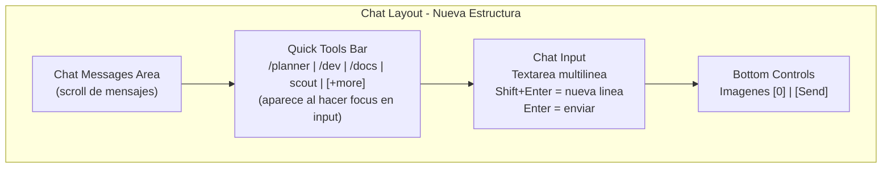
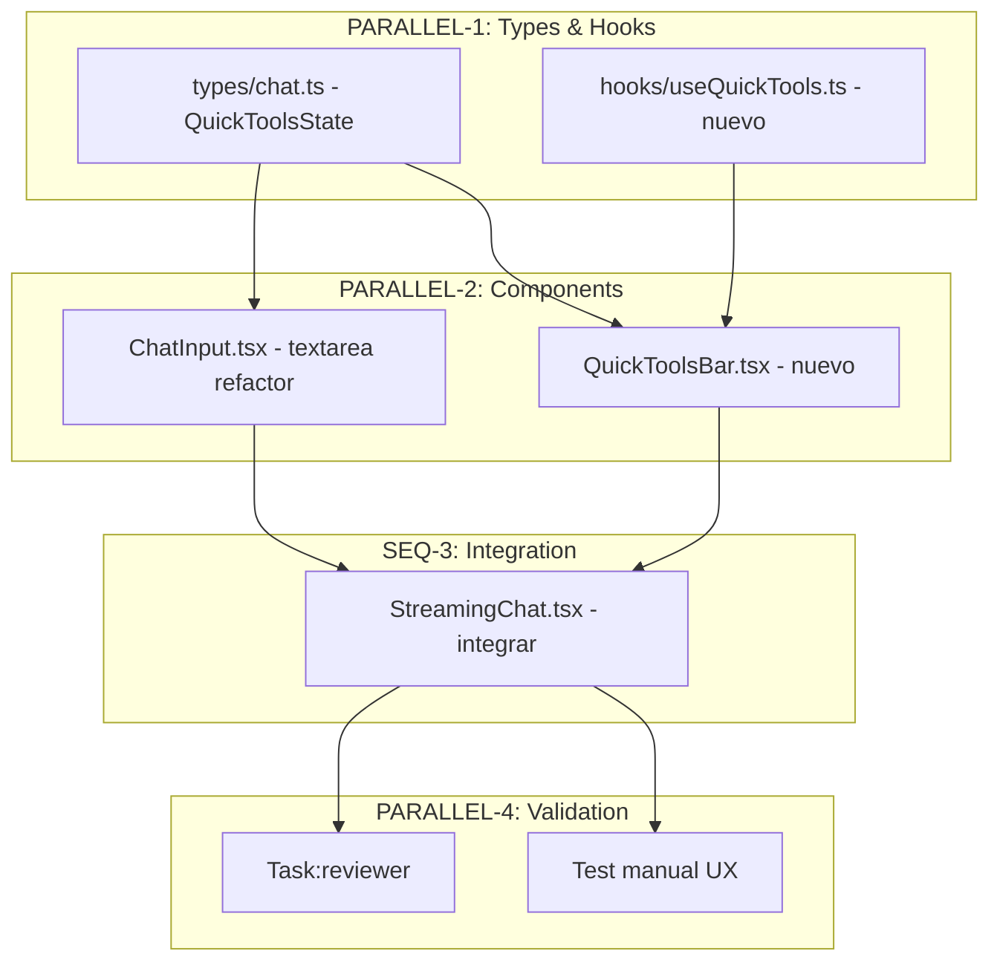
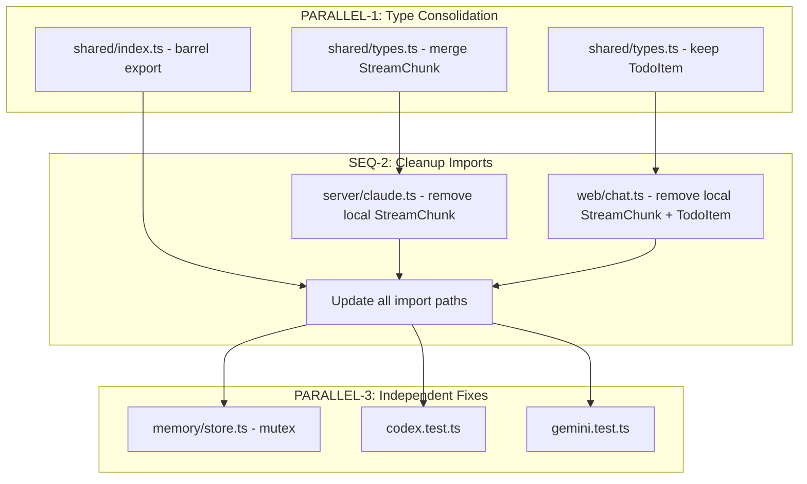
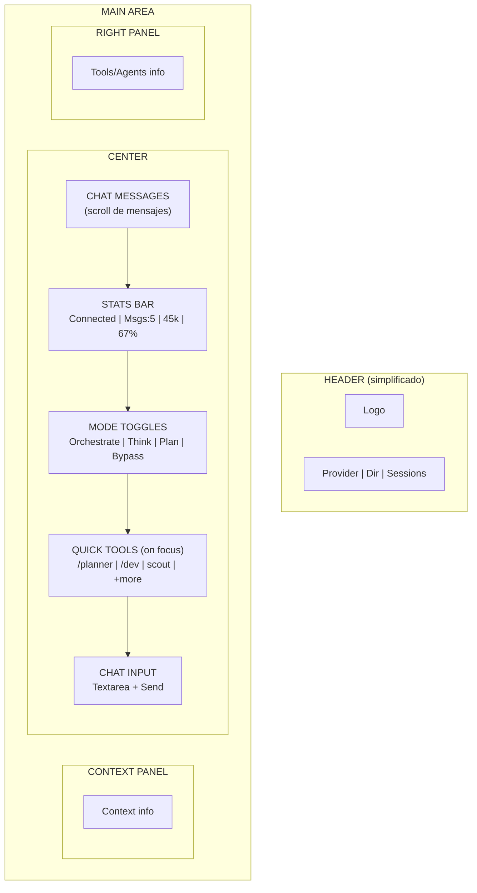
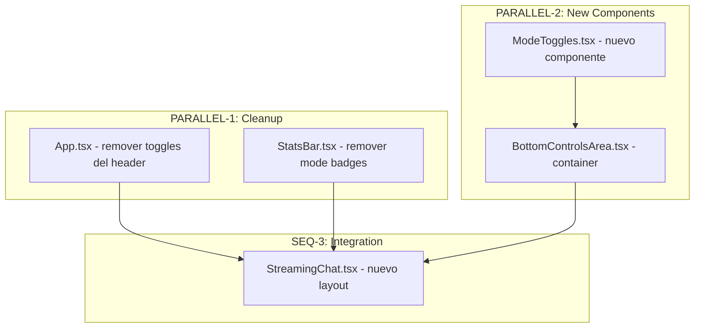
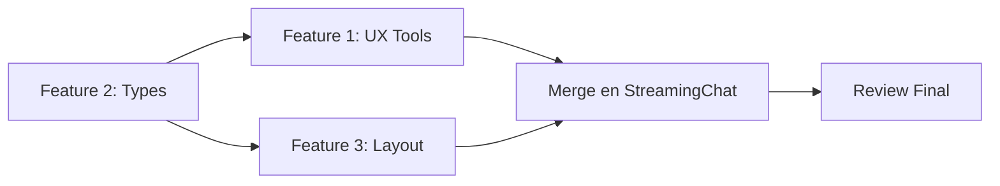
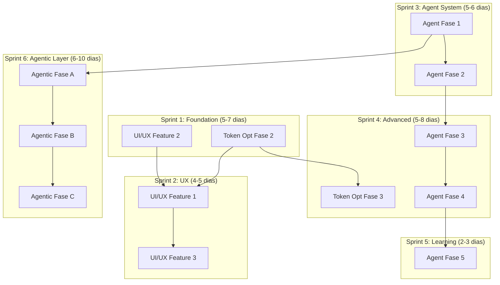

# Claude Code Poneglyph - Plan Maestro

> Consolidacion de todos los planes del proyecto
> Fecha de consolidacion: 2025-12-29

---

## Estado del Proyecto - Checklist

> Última actualización: 2026-01-02 (Verificación estado real + actualización checklist)

### Token Optimization

- [x] **Fase 1: Quick Wins (-74% tokens base)** ✅
  - [x] CLAUDE.md split (1,800t → 350t)
  - [x] Rules compression (1,870t → 600t)
  - [x] CLAUDE-reference.md (lazy load)
  - [x] Deduplicación contenido
- [x] **Fase 2: Medium Term (-7,800t variable)** ✅ COMPLETADA (2026-01-02)
  - [x] `context-optimizer.ts` - Carga condicional de rules
  - [x] `history-manager.ts` - Sliding window + summarization
  - [x] Conditional rules loading por keywords
  - [ ] Skills lazy-load (core + sub-files on-demand) (opcional)
- [x] **Fase 3: Strategic (-30-50% adicional)** ✅ COMPLETADA (2026-01-02)
  - [x] `tool-cache.ts` - Cache de resultados Read/Glob/Grep
  - [x] `token-tracker.ts` - Métricas de monitoreo
  - [ ] Orchestrator slim (-740t) (opcional)
  - [ ] Memory budgeting (-100t avg) (opcional)

### UI/UX Mejoras

- [x] **Feature 1: Refactor UX de Tools** ✅ COMPLETADA (2026-01-02 verificado)
  - [x] `QuickToolsBar.tsx` - Barra de herramientas sobre input
  - [x] `useQuickTools.ts` - Hook para estado de quick tools
  - [x] `useAutoResize.ts` - Hook para auto-height textarea
  - [x] ChatInput refactor (input → textarea multilinea)
  - [x] QuickToolsState interface en types/chat.ts
  - [x] StreamingChat.tsx integración
- [x] **Feature 2: Technical Debt** ✅ COMPLETADA (2026-01-02 verificado)
  - [x] StreamChunk type consolidation (4 → 1 definición en shared/types.ts)
  - [x] TodoItem type consolidation (2 → 1 definición)
  - [x] Barrel export `shared/index.ts`
  - [x] Memory mutex fix (`initPromise` pattern en store.ts)
  - [x] Tests `codex.test.ts`
  - [x] Tests `gemini.test.ts`
- [x] **Feature 3: Layout Reorganization** ✅ COMPLETADA (2026-01-02)
  - [x] `ModeToggles.tsx` - Componente toggles sobre input
  - [x] `BottomControlsArea.tsx` - Container layout creado
  - [x] App.tsx - Remover toggles del header
  - [ ] StatsBar.tsx - Mover abajo del chat (opcional, layout actual funciona)
  - [x] StreamingChat.tsx - Layout con ModeToggles integrado
  - [x] Header simplification

### Agent Experts System

- [x] **Fase 1: Lead Orchestrator + Interceptor** ✅ COMPLETADA
  - [x] `prompt-classifier.ts` - Clasificar complejidad + dominios (175 líneas)
  - [x] `orchestrator-agent.ts` - Lead Orchestrator completo (555 líneas)
  - [x] `agent-spawner.ts` - CRUD programático (349 líneas)
  - [x] `.claude/agents/orchestrator-lead.md` - System prompt (123 líneas)
  - [x] `config/domain-keywords.ts` - Keywords por dominio
  - [x] Integración en `index.ts` y `websocket.ts`
  - [x] Fix ruta de experts (2025-12-30)
  - [x] Activación automática con toggle Orchestrate (2025-12-30)
- [x] **Fase 2: Metrics Tracking** ✅ COMPLETADA
  - [x] `metrics-store.ts` - Persistencia de métricas
  - [x] `agent-registry.ts` - Tracking en eventos (311 líneas)
  - [x] `MetricsDashboard.tsx` - Visualización básica (598 líneas)
  - [x] `routes/metrics.ts` - Endpoints de métricas
- [x] **Fase 3: Expertise Files** ✅ COMPLETADA
  - [x] `.claude/experts/` - Estructura directorios
  - [x] `types/expert.ts` - Tipos TypeScript integrados en expert-store
  - [x] `expert-store.ts` - CRUD expertise files (268 líneas)
- [x] **Fase 4: First Expert (WebSocket)** ✅ COMPLETADA
  - [x] `.claude/experts/websocket/expertise.yaml` - Mental model (186 líneas)
  - [x] `.claude/experts/websocket/agent.md` - System prompt (142 líneas)
  - [x] Expert routing integrado en orchestrator-agent
  - [x] `ExpertSelector.tsx` - UI para selección manual ✅ (2026-01-02)
  - [x] `routes/experts.ts` - Endpoints de experts
- [x] **Fase 5: Self-Improve Loop** ✅ COMPLETADA
  - [x] `.claude/experts/websocket/improve.md` - Template
  - [x] `learning-loop.ts` - Trigger auto-improve (455 líneas)
  - [x] `LearningIndicator.tsx` - UI indicator (fix 2025-12-30: websocket handlers + chunk handler integration)
  - [x] Auto-actualización expertise integrada

---

### Agentic Layer Evolution (NEW)

- [x] Fase A: Completar Clase 1 (Grado 5) ✅ COMPLETADA (2025-12-30)
  - [x] Crear .claude/workflows/
  - [x] Pipeline dev-cycle.md
  - [x] Pipeline bug-fix.md
  - [x] Pipeline refactor.md
- [x] Fase B: Alcanzar Clase 2 ✅ COMPLETADA (2026-01-02)
  - [x] workflow-executor.ts
  - [x] Workflow state machine (WorkflowRun, WorkflowStep)
  - [x] Auto-recovery (retry con maxRetries)
  - [x] Workflow logs (NDJSON por run)
- [x] Fase C: Alcanzar Clase 3 ✅ COMPLETADA (2026-01-02)
  - [x] routes/workflows.ts - API de workflows
  - [ ] Multi-workflow paralelo (parcial, structure exists)
  - [ ] Workflow composition (parcial)
  - [x] Codebase Singularity metrics (codebase-singularity.ts)

---

### Resumen Rápido

| Plan | Completado | Pendiente | Progreso |
|------|------------|-----------|----------|
| Token Optimization | **3/3 fases** | Opcionales (slim, budget) | **100%** ✅ |
| UI/UX Mejoras | **3/3 features** | StatsBar move (opcional) | **100%** ✅ |
| Agent Experts | **5/5 fases** | - | **100%** ✅ |
| Agentic Layer Evolution | **3/3 fases** | Multi-workflow paralelo | **95%** ✅ |
| **TOTAL** | **14/14** | Minor opcionales | **~98%** ✅ |

> **Nota (2026-01-02 - Implementación Final)**:
> - Token Optimization Fases 2-3: `context-optimizer.ts`, `history-manager.ts`, `tool-cache.ts`, `token-tracker.ts`
> - UI/UX: `BottomControlsArea.tsx`, `ExpertSelector.tsx` creados
> - Agentic Layer: `workflow-executor.ts`, `codebase-singularity.ts`, `routes/workflows.ts`
> - shared/types/workflow.ts: Tipos de workflow

> **Nota (2025-12-30)**:
> - **Paso 1**: Fix ruta experts + leadOrchestrate activado automáticamente
> - **Paso 2**: Fix Metrics/Learning flow (websocket handlers, chunk handler, types) + workflows creados

### Esfuerzo Estimado (Actualizado 2026-01-02)

| Plan | Días Estimados | Estado |
|------|----------------|--------|
| Token Optimization (Fases 2-3) | 5-8 días | ✅ Completado |
| UI/UX Mejoras (Feature 3) | 1 día | ✅ Completado |
| Agent Experts (ExpertSelector) | 1 día | ✅ Completado |
| Agentic Layer Evolution (Fases B-C) | 5-7 días | ✅ Completado |
| **TOTAL IMPLEMENTADO** | **12-17 días** | ✅ **Completado en 1 sesión** |

---

## Indice

1. [Optimizacion de Tokens](#1-optimizacion-de-tokens) (Fase 1 Completada, Fases 2-3 Pendientes)
2. [Mejoras UI/UX y Technical Debt](#2-mejoras-uiux-y-technical-debt) (3 Features)
3. [Sistema Agent Experts con Auto-Aprendizaje](#3-sistema-agent-experts-con-auto-aprendizaje) (5 Fases)
4. [Evolucion del Agentic Layer](#4-evolución-del-agentic-layer) (3 Fases: A, B, C)
5. [Roadmap Consolidado](#roadmap-consolidado)

---

## 1. Optimizacion de Tokens

> Meta: Reducir consumo de tokens 70% sin perdida de calidad

### Diagnostico Actual

| Componente | Tokens | Frecuencia |
|------------|--------|------------|
| CLAUDE.md | ~1,800 | Cada request |
| Rules (3 archivos) | ~1,870 | Cada request |
| **Total base fijo** | **~3,670** | **Siempre** |
| Orchestration mode | +500-2,000 | Cuando activo |
| Skills activadas | +950-3,400 c/u | Por keywords |
| Historial conversacion | Ilimitado | Sin resume |

**Problema**: ~3,670 tokens en CADA request, incluso para "hola".

---

### FASE 1: Quick Wins [-2,770t base] ✅ COMPLETADA

| Estrategia | Reduccion | Descripcion |
|------------|-----------|-------------|
| CLAUDE.md split | -1,200t (67%) | Core (~600t) + Reference (lazy) |
| Rules compression | -1,270t (68%) | Tablas concisas vs prosa |
| Deduplicacion | -300t | Eliminar contenido repetido |

**Resultados Fase 1:**

| Archivo | Antes | Despues |
|---------|-------|---------|
| CLAUDE.md | ~1,800t | ~350t |
| code-review.md | ~430t | ~150t |
| formatting.md | ~800t | ~250t |
| orchestration.md | ~640t | ~200t |
| **Total siempre cargado** | **~3,670t** | **~950t (-74%)** |

---

### FASE 2: Medium Term [-7,800t variable] ⏳ PENDIENTE

| Estrategia | Reduccion | Descripcion |
|------------|-----------|-------------|
| Conditional rules | -800t avg | Cargar solo rules relevantes por keywords |
| Skills lazy-load | -2,000t/skill | Core (~200t) + sub-files on-demand |
| History window | -5,000t+ | Sliding window + summarization |

**Implementacion clave** - `context-optimizer.ts`:
```typescript
function detectRequiredContext(prompt: string): ContextConfig {
  return {
    rules: {
      'code-review': /implement|fix|refactor|bug/i.test(prompt),
      'formatting': /format|output|markdown|table/i.test(prompt),
      'orchestration': /agent|task|parallel|delegate/i.test(prompt),
    },
    historyWindow: analyzeComplexity(prompt) === 'simple' ? 3 : 10,
  }
}
```

---

### FASE 3: Strategic [-30-50% adicional] ⏳ PENDIENTE

| Estrategia | Reduccion | Descripcion |
|------------|-----------|-------------|
| Tool deduplication | -30-50% tools | Cache de resultados Read/Glob/Grep |
| Orchestrator slim | -740t | Prompt orquestador mas conciso |
| Memory budgeting | -100t avg | Token budget para recalls |
| Token tracking | N/A | Metricas para monitoreo |

---

### Impacto Proyectado

| Escenario | Actual | Post-F1 | Post-F2 | Post-F3 |
|-----------|--------|---------|---------|---------|
| Pregunta simple | 5K | 2.5K (-50%) | 1.5K (-70%) | **1.2K (-76%)** |
| Tarea estandar | 10K | 6K (-40%) | 4K (-60%) | **3K (-70%)** |
| Feature compleja | 15K | 11K (-27%) | 6K (-60%) | **4.5K (-70%)** |
| Conversacion larga | 20K+ | 15K (-25%) | 8K (-60%) | **5K (-75%)** |

---

### Archivos Token Optimization

| Archivo | Accion | Fase | Estado |
|---------|--------|------|--------|
| `CLAUDE.md` | Modificar (split) | 1 | ✅ |
| `CLAUDE-reference.md` | Crear (lazy) | 1 | ✅ |
| `.claude/rules/*.md` | Comprimir | 1 | ✅ |
| `server/src/services/context-optimizer.ts` | Crear | 2 | ⏳ |
| `server/src/services/history-manager.ts` | Crear | 2 | ⏳ |
| `server/src/services/tool-cache.ts` | Crear | 3 | ⏳ |
| `server/src/services/token-tracker.ts` | Crear | 3 | ⏳ |

---

### Riesgos Token Optimization

| Riesgo | Mitigacion |
|--------|------------|
| Context insufficient | Fallback a carga completa + tracking |
| History summarization pierde info | Mantener ultimos N mensajes completos |
| Tool cache stale | TTL 10min + invalidar en edits |

---

### Proximos Pasos Token Optimization

- [ ] Implementar `context-optimizer.ts` (Fase 2)
- [ ] Implementar `history-manager.ts` (Fase 2)
- [ ] Testing de carga condicional de rules
- [ ] Metricas de token tracking

---

## 2. Mejoras UI/UX y Technical Debt

> Documento original: 2025-12-29
> Estado: Pendiente de implementacion

---

### Feature 1: Refactor UX de Tools (Barra de Input Mejorada) ⏳

#### Problema Actual

| Aspecto | Estado Actual | Problema |
|---------|---------------|----------|
| **Input** | `<input type="text">` single-line (ChatInput.tsx:58) | No soporta prompts multilinea |
| **Tools Display** | RightPanel (separado) | Lejos del input, no contextual |
| **Visibilidad** | Siempre visible en panel derecho | No aparece cuando escribes |
| **Durante procesamiento** | Input deshabilitado | No puedes preparar siguiente prompt |
| **Ref forwarding** | No expone ref | No se puede hacer focus programatico |

#### Propuesta de Diseno



| Componente | Descripcion | Comportamiento |
|------------|-------------|----------------|
| **Chat Messages** | Area de scroll para mensajes | Ocupa espacio principal |
| **Quick Tools** | Barra de herramientas rapidas | Aparece al hacer focus en input |
| **Chat Input** | Textarea multilinea | Shift+Enter nueva linea, Enter enviar |
| **Bottom Controls** | Imagenes adjuntas + boton enviar | Siempre visible |

#### Tool Inventory

| Tipo | Herramienta | Uso en esta tarea |
|------|-------------|-------------------|
| Skill | typescript-patterns | Componentes React + TypeScript |
| Skill | code-style-enforcer | Type hints, imports |
| Agent | builder | Implementacion de componentes |
| Agent | reviewer | Review final |

#### Grafo de Dependencias Feature 1



#### Nodos de Ejecucion Feature 1

**PARALLEL-1: Types & Hooks**
Deps: Ninguna | Paralelo: Si

| # | Archivo | Tool | Descripcion |
|---|---------|------|-------------|
| 1.1 | `web/src/types/chat.ts` | Edit | Anadir `QuickToolsState` interface |
| 1.2 | `web/src/hooks/useQuickTools.ts` | Write | Hook para estado de quick tools |
| 1.3 | `web/src/hooks/useAutoResize.ts` | Write | Hook para auto-height del textarea |

**Contenido 1.1** - Anadir tipos:
```typescript
interface QuickToolsState {
  isVisible: boolean
  searchQuery: string
  filteredTools: ClaudeConfigItem[]
  selectedIndex: number
}

interface QuickToolsConfig {
  blurDelay: number  // ms antes de ocultar (150ms recomendado)
  maxVisibleTools: number  // 4-6 tools visibles
}
```

**Contenido 1.2** - Hook useQuickTools:
- Gestionar visibilidad (focus/blur del input)
- **Delay de 150ms en blur** para permitir clicks en tools
- Filtrar tools por busqueda
- Keyboard navigation (flecha arriba/abajo para seleccionar, Tab para insertar)
- Persistir "tools frecuentes" en localStorage

**Contenido 1.3** - Hook useAutoResize:
```typescript
function useAutoResize(ref: RefObject<HTMLTextAreaElement>, minRows = 1, maxRows = 10) {
  // Auto-resize basado en scrollHeight
  // Resetear a minRows cuando content esta vacio
}
```

---

**PARALLEL-2: Components**
Deps: PARALLEL-1 Completado | Paralelo: Si

| # | Archivo | Tool | Descripcion |
|---|---------|------|-------------|
| 2.1 | `web/src/components/streaming-chat/QuickToolsBar.tsx` | Write | Barra de tools sobre el input |
| 2.2 | `web/src/components/streaming-chat/ChatInput.tsx` | Edit | Refactor a `<textarea>` multilinea |

**Contenido 2.1** - QuickToolsBar:
- Mostrar 4-6 tools mas usados + boton "[+more]"
- Click en tool -> insertar en input
- Animacion de entrada/salida suave (animate-fade-in existente)
- Aparecer cuando: `inputFocused && !isProcessing` OR `inputFocused && allowQueueing`
- **Mantener visible mientras hover** (onMouseEnter/onMouseLeave)
- Ordenar por frecuencia de uso (localStorage counter)

**Contenido 2.2** - ChatInput refactor:

Props a anadir:
```typescript
interface Props {
  // ... existentes ...
  inputRef?: React.RefObject<HTMLTextAreaElement>  // NUEVO
  onFocus?: () => void  // NUEVO
  onBlur?: () => void   // NUEVO
}
```

Cambios internos:
- Cambiar `<input>` -> `<textarea>` con `rows={1}`
- Usar `useAutoResize` hook para auto-height
- Handler `onKeyDown`:
  ```typescript
  const handleKeyDown = (e: React.KeyboardEvent) => {
    if (e.key === 'Enter' && !e.shiftKey) {
      e.preventDefault()
      onSubmit(e)
    }
    // Shift+Enter = nueva linea (comportamiento default de textarea)
  }
  ```
- Mantener compatibilidad con image paste (onPaste ya existe)
- Forward ref con `forwardRef` o prop `inputRef`

---

**SEQ-3: Integration** [Blocking]
Deps: PARALLEL-2 Completado | Paralelo: No

| # | Archivo | Tool | Descripcion |
|---|---------|------|-------------|
| 3.1 | `web/src/components/StreamingChat.tsx` | Edit | Integrar QuickToolsBar + nuevo ChatInput |

**Cambios**:
- Importar `QuickToolsBar` y `useQuickTools`
- Pasar `claudeConfig` a QuickToolsBar
- Manejar `onToolSelect` para insertar en input
- Permitir focus en input durante procesamiento (queue mode)

**Recovery**:
- Import error -> Verificar paths relativos
- State error -> Revisar props drilling vs context

---

**PARALLEL-4: Validation**
Deps: SEQ-3 Completado | Paralelo: Si

| # | Accion | Tool |
|---|--------|------|
| 4.1 | Test manual de UX | Bash (bun run dev) |
| 4.2 | Code review | Task:reviewer |

---

### Feature 2: Mejoras Tecnicas (Technical Debt) ⏳

#### Priorizacion de Issues

| # | Issue | Prioridad | Esfuerzo | ROI |
|---|-------|-----------|----------|-----|
| 1 | **StreamChunk type consolidation** | Alta | Medio | Quick win |
| 2 | **TodoItem type consolidation** | Alta | Bajo | Quick win |
| 3 | **Barrel export shared/index.ts** | Alta | Bajo | DX improvement |
| 4 | **Memory mutex initialization** | Media | Medio | Previene bugs |
| 5 | **Tests para providers** | Media | Medio | Confianza |
| 6 | **Gemini tool support** | Baja | Alto | Feature parity |

#### Detalle de Issues

**Issue 1: StreamChunk Type Consolidation**

Problema: `StreamChunk` esta definido en **4 lugares** con campos diferentes:

| Archivo | Linea | Campos unicos |
|---------|-------|---------------|
| `shared/types.ts` | 145 | Base, `contextType`, `name`, `detail`, `status` |
| `server/src/services/claude.ts` | 73 | `agent_event`, `waitingForAnswer` |
| `web/src/types/chat.ts` | 258 | `type: string` (generico), `event`, `agentId`, `task`, `result` |
| `web/FRONTEND.md` | 190 | Documentacion (no codigo) |

**Solucion** - Merge todos los campos:
```typescript
// shared/types.ts - UNICA FUENTE DE VERDAD
export interface StreamChunk {
  type: 'init' | 'text' | 'tool_use' | 'tool_result' | 'result' |
        'error' | 'done' | 'thinking' | 'context' | 'agent_event'
  data: string
  sessionId?: string
  tool?: string
  toolInput?: unknown
  toolOutput?: string
  toolUseId?: string
  parentToolUseId?: string
  costUsd?: number
  durationMs?: number
  usage?: TokenUsage
  // Context event fields
  contextType?: 'skill' | 'rule' | 'mcp' | 'memory' | 'hook'
  name?: string
  detail?: string
  status?: 'active' | 'completed' | 'failed'
  // Agent event fields (de claude.ts)
  event?: 'created' | 'started' | 'completed' | 'failed'
  agentId?: string
  agentType?: string
  task?: string
  result?: string
  error?: string
  // Sync fields (de claude.ts)
  waitingForAnswer?: boolean
}
```

**Issue 2: TodoItem Type Consolidation**

Problema: `TodoItem` tambien esta duplicado:
- `shared/types.ts:1-5`
- `web/src/types/chat.ts:236-240`

Solucion: Mantener solo en `shared/types.ts`, importar en chat.ts.

**Issue 3: Barrel Export**

Crear `shared/index.ts`:
```typescript
export * from './types'
// Permite: import { StreamChunk, TodoItem } from '@shared'
```

**Issue 4: Memory Mutex Initialization**

Problema: Race condition en `init()` sin mutex (store.ts:25)

Solucion:
```typescript
// server/src/services/memory/store.ts
private initPromise: Promise<void> | null = null

private async init(): Promise<void> {
  if (this.initialized) return
  if (this.initPromise) return this.initPromise

  this.initPromise = this._doInit()
  await this.initPromise
}

private async _doInit(): Promise<void> {
  // Mover logica actual de init() aqui
  if (!existsSync(DATA_DIR)) {
    await mkdir(DATA_DIR, { recursive: true })
  }
  await this.loadIndex()
  this.initialized = true
}
```

**Issue 5: Tests para Providers**

Archivos faltantes (confirmado con Glob):
- `server/src/services/codex.test.ts` - No existe
- `server/src/services/gemini.test.ts` - No existe

Cobertura minima:
- Test de inicializacion (constructor, env vars)
- Test de streaming mock (AsyncGenerator)
- Test de error handling (API errors, timeouts)
- Test de abort functionality

#### Grafo de Dependencias Feature 2



#### Nodos de Ejecucion Feature 2

**PARALLEL-1: Type Consolidation**
Deps: Ninguna | Paralelo: Si

| # | Archivo | Tool | Descripcion |
|---|---------|------|-------------|
| 1.1 | `shared/types.ts` | Edit | Merge todos los campos de StreamChunk |
| 1.2 | `shared/types.ts` | Edit | Verificar TodoItem esta completo |
| 1.3 | `shared/index.ts` | Write | Crear barrel export |

---

**SEQ-2: Cleanup Imports** [Blocking]
Deps: PARALLEL-1 Completado | Paralelo: No

| # | Archivo | Tool | Descripcion |
|---|---------|------|-------------|
| 2.1 | `server/src/services/claude.ts` | Edit | Eliminar interface StreamChunk local (linea 73-97) |
| 2.2 | `web/src/types/chat.ts` | Edit | Eliminar StreamChunk (linea 258-277) y TodoItem (linea 236-240) |
| 2.3 | `web/src/types/chat.ts` | Edit | Anadir import desde shared |
| 2.4 | Verificar | Bash | `bun run typecheck` para confirmar imports correctos |

**Recovery**:
- TypeScript error -> Verificar paths relativos (`../../../shared/types`)
- Missing export -> Verificar barrel export en shared/index.ts

---

**PARALLEL-3: Independent Fixes**
Deps: SEQ-2 Completado | Paralelo: Si

| # | Archivo | Tool | Descripcion |
|---|---------|------|-------------|
| 3.1 | `server/src/services/memory/store.ts` | Edit | Anadir mutex con initPromise |
| 3.2 | `server/src/services/codex.test.ts` | Write | Tests basicos CodexService |
| 3.3 | `server/src/services/gemini.test.ts` | Write | Tests basicos GeminiService |

**Post**: `bun test server/src/services/*.test.ts`

---

### Feature 3: Reorganizacion de Layout UI ⏳

#### Problema Actual

| Aspecto | Estado Actual | Ubicacion | Problema |
|---------|---------------|-----------|----------|
| **Mode Toggles** | Header (App.tsx:106-138) | Arriba | Lejos del input donde escribes |
| **StatsBar** | Top del chat (StreamingChat.tsx:217) | Arriba | Ocupa espacio vertical valioso |
| **Mode Badges** | Duplicados (header + StatsBar.tsx:50-53) | Ambos | Redundancia visual |
| **Jerarquia** | Stats antes que contenido | - | Info secundaria en posicion principal |

#### Nota Importante

**NO mover `modes` state** de App.tsx a StreamingChat.tsx:
- `modes` ya se pasa como prop correctamente
- Moverlo crearia breaking changes innecesarios
- Solo necesitamos **mover los toggles UI**, no el state

#### Propuesta de Nuevo Layout



| Seccion | Contenido | Posicion |
|---------|-----------|----------|
| **Header** | Logo, Provider, Dir, Sessions | Top (simplificado) |
| **Context Panel** | Informacion de contexto | Left sidebar |
| **Chat Messages** | Area de scroll para mensajes | Center - Top |
| **Stats Bar** | Connected, Msgs, Tokens, Progress | Center - Debajo de mensajes |
| **Mode Toggles** | Orchestrate, Think, Plan, Bypass | Center - Debajo de Stats |
| **Quick Tools** | /planner, /dev, scout, +more | Center - On input focus |
| **Chat Input** | Textarea multilinea + Send | Center - Bottom |
| **Right Panel** | Tools/Agents info | Right sidebar |

#### Justificacion de Cambios

| Cambio | Razon | Beneficio |
|--------|-------|-----------|
| **Stats Bar -> Abajo** | Info secundaria no bloquea contenido | Mas espacio para chat |
| **Mode Toggles -> Sobre input** | Contextuales al componer prompt | UX intuitiva |
| **Eliminar duplicacion** | Mode badges solo sobre input | UI mas limpia |
| **Header simplificado** | Solo navegacion esencial | Menos ruido visual |

#### Grafo de Dependencias Feature 3



#### Nodos de Ejecucion Feature 3

**PARALLEL-1: Cleanup (Remover Duplicaciones)**
Deps: Ninguna | Paralelo: Si

| # | Archivo | Tool | Descripcion |
|---|---------|------|-------------|
| 1.1 | `web/src/App.tsx` | Edit | Remover ToggleBadges del header |
| 1.2 | `web/src/components/StatsBar.tsx` | Edit | Remover mode badges, simplificar |

---

**PARALLEL-2: New Components**
Deps: Ninguna | Paralelo: Si

| # | Archivo | Tool | Descripcion |
|---|---------|------|-------------|
| 2.1 | `web/src/components/streaming-chat/ModeToggles.tsx` | Write | Componente con los 4 toggles |
| 2.2 | `web/src/components/streaming-chat/BottomControlsArea.tsx` | Write | Container: Stats + Modes + QuickTools + Input |

**Contenido ModeToggles.tsx**:
```typescript
import { ToggleBadge } from '../ui/Badge'  // REUTILIZAR componente existente

interface Props {
  modes: ClaudeModes
  onToggle: (mode: keyof ClaudeModes) => void  // Callback a App.tsx
}

export function ModeToggles({ modes, onToggle }: Props) {
  return (
    <div className="flex items-center gap-1 px-4 py-2">
      <ToggleBadge active={modes.orchestrate} onClick={() => onToggle('orchestrate')} color="purple" size="sm">
        Orchestrate
      </ToggleBadge>
      {/* ... resto de toggles */}
    </div>
  )
}
```

**Contenido BottomControlsArea.tsx**:
- Componente container **puro** (solo layout, sin logica de state)
- Orden vertical: StatsBar -> ModeToggles -> QuickTools -> ChatInput
- Props: todos los componentes hijos como children o props individuales
- NO maneja state de modes (viene de App.tsx via props)

---

**SEQ-3: Integration** [Blocking]
Deps: PARALLEL-1 + PARALLEL-2 Completado | Paralelo: No

| # | Archivo | Tool | Descripcion |
|---|---------|------|-------------|
| 3.1 | `web/src/App.tsx` | Edit | Pasar callbacks de toggle a StreamingChat |
| 3.2 | `web/src/components/StreamingChat.tsx` | Edit | Integrar BottomControlsArea, remover StatsBar del top |

**Cambios en App.tsx**:
```typescript
// Anadir callback para toggles
const handleModeToggle = (mode: keyof ClaudeModes) => {
  switch(mode) {
    case 'orchestrate': setOrchestrate(!orchestrate); break;
    case 'thinking': setThinking(!thinking); break;
    // ... etc
  }
}

// Pasar a StreamingChat
<StreamingChat
  modes={modes}
  onModeToggle={handleModeToggle}  // NUEVO
  // ... resto de props
/>
```

**Cambios en StreamingChat.tsx**:
- Anadir prop `onModeToggle: (mode: keyof ClaudeModes) => void`
- Remover StatsBar del top (linea 217)
- Renderizar BottomControlsArea despues de los mensajes
- Ajustar scroll para que mensajes terminen antes de controls

**NO hacer**:
- NO mover state de modes a StreamingChat
- NO crear Context para modes (overkill para 4 booleans)

---

#### Beneficios Esperados Feature 3

| Metrica | Antes | Despues |
|---------|-------|---------|
| **Elementos en header** | 6+ | 3-4 |
| **Espacio vertical chat** | -40px (statsbar top) | +40px |
| **Clics para cambiar modo** | Mirar arriba -> click | Ya estas ahi |
| **Duplicacion visual** | 2x mode badges | 1x |

---

### Orden de Ejecucion UI/UX Recomendado

#### Conflicto Identificado

**Feature 1 y Feature 3 modifican el mismo archivo**: `StreamingChat.tsx`

Para evitar conflictos de merge, ejecutar en este orden:



#### Secuencia Recomendada

| Orden | Feature | Razon | Dependencia |
|-------|---------|-------|-------------|
| 1 | **Feature 2** | Limpia tipos que usan F1 y F3 | Ninguna |
| 2 | **Feature 1** | Anade QuickTools + ChatInput refactor | F2 (tipos limpios) |
| 3 | **Feature 3** | Layout final con BottomControlsArea | F1 (integra QuickTools) |

#### Por que este orden

1. **Feature 2 primero**: Consolida `StreamChunk` y `TodoItem` que son usados por F1 y F3
2. **Feature 1 antes de F3**: QuickToolsBar se integra en BottomControlsArea (F3)
3. **Feature 3 ultimo**: Reorganiza layout final incluyendo componentes de F1

#### Comandos de Ejecucion

```bash
# Ejecutar en orden
claude -p "Implementa Feature 2 del archivo PLAN.md seccion Mejoras UI/UX - Mejoras Tecnicas"
# Verificar: bun run typecheck && bun test

claude -p "Implementa Feature 1 del archivo PLAN.md seccion Mejoras UI/UX - Refactor UX Tools"
# Verificar: bun run dev (test manual)

claude -p "Implementa Feature 3 del archivo PLAN.md seccion Mejoras UI/UX - Reorganizacion Layout"
# Verificar: bun run dev (test manual)
```

---

### Resumen Ejecutivo UI/UX

#### Feature 1: Refactor UX Tools

| Metrica | Valor |
|---------|-------|
| **Archivos nuevos** | 3 (`QuickToolsBar.tsx`, `useQuickTools.ts`, `useAutoResize.ts`) |
| **Archivos modificados** | 3 (`chat.ts`, `ChatInput.tsx`, `StreamingChat.tsx`) |
| **Complejidad** | Media-Alta |
| **Grupos de ejecucion** | 4 |

**Beneficios**:
- Input multilinea con Shift+Enter
- Tools visibles al escribir (contextual)
- Posibilidad de preparar siguiente prompt durante procesamiento
- UX mas intuitiva
- Auto-resize del textarea

#### Feature 2: Mejoras Tecnicas

| Metrica | Valor |
|---------|-------|
| **Type consolidations** | 2 (StreamChunk, TodoItem) |
| **Quick wins** | 3 (types, barrel export, mutex) |
| **Tests nuevos** | 2 archivos |
| **Complejidad** | Media |
| **Grupos de ejecucion** | 3 |

**Beneficios**:
- Single source of truth para tipos (4 -> 1 definicion)
- Barrel export simplifica imports
- Prevencion de race conditions en MemoryStore
- Mayor confianza para refactoring
- Cobertura de tests para providers alternativos

#### Feature 3: Reorganizacion Layout

| Metrica | Valor |
|---------|-------|
| **Archivos nuevos** | 2 (`ModeToggles.tsx`, `BottomControlsArea.tsx`) |
| **Archivos modificados** | 4 (`App.tsx`, `StatsBar.tsx`, `StreamingChat.tsx`, props interface) |
| **Complejidad** | Media |
| **Grupos de ejecucion** | 3 |

**Beneficios**:
- Header simplificado (reutiliza `ToggleBadge` existente)
- Mode toggles contextuales (cerca del input)
- Stats bar no bloquea contenido
- Elimina duplicacion de badges
- State management sin cambios (props drilling mantiene simplicidad)

---

## 3. Sistema Agent Experts con Auto-Aprendizaje

**Proyecto**: `claude-code-poneglyph`
**Fecha**: 2025-12-25
**Version**: 2.0

---

### Resumen Ejecutivo Agent Experts

**Objetivo:** Transformar claude-code-poneglyph en un sistema de orquestacion multi-agente con agentes expertos que aprenden automaticamente.

**Veredicto:** VIABLE con expectativas calibradas

| Aspecto | Realidad |
|---------|----------|
| Mejora esperada | 15-35% (no 60% del hype) |
| Tiempo de implementacion | 8-12 dias (MVP: 4-5 dias) |
| Complejidad | Media-Alta |
| Riesgo principal | Expertise desactualizado empeora rendimiento |

---

### Evidencia Cientifica

| Fuente | Hallazgo | Relevancia |
|--------|----------|------------|
| [MultiAgentBench](https://arxiv.org/html/2503.01935v1) | Multi-agent 66-76% win rate vs single-agent | Alta |
| [Memory Survey](https://arxiv.org/abs/2404.13501) | RAG mejora 22-66%, pero debajo de humanos | Alta |
| [A-Mem](https://arxiv.org/html/2502.12110v1) | Agentic memory con Zettelkasten prometedor | Media |

**Conclusion:** Multi-agent y memoria SI mejoran, pero con mejoras modestas (15-35%), no el 60% del hype.

---

### Estado Actual Agent Experts

#### Infraestructura Existente (~70%)

| Componente | Ubicacion | Estado |
|------------|-----------|--------|
| Sistema de Memoria | `server/src/services/memory/` | ✅ Completo |
| Vector Embeddings | `memory/vector.ts` | ✅ Funcional |
| Memory Graph | `memory/graph.ts` | ✅ Funcional |
| Active Learning | `memory/active-learning.ts` | ✅ Triggers |
| Agent Registry | `agent-registry.ts` | ✅ CRUD + Events |
| Dashboard UI | `AgentsDashboard.tsx` | ✅ Extensible |

#### Lo que Falta

| Componente | Prioridad | Razon |
|------------|-----------|-------|
| **Lead Orchestrator** | CRITICO | Claude NO delega autonomamente |
| **Metricas Tracking** | CRITICO | Sin esto no sabremos si funciona |
| **Expertise Files** | HACER | Bajo riesgo, infraestructura existe |
| **Self-Improve Loop** | DESPUES | Solo si expertise funciona |
| **Cross-Validation** | NO AHORA | Overkill para uso personal |

---

### Problema Central: Claude Code NO Delega

**Hallazgo critico:** Claude Code tiene Task tool pero casi NUNCA lo usa autonomamente.

```
COMPORTAMIENTO ACTUAL (problematico):
Usuario -> Claude Code -> Intenta hacerlo TODO el mismo
                       -> Glob x5, Read x10, Grep x8, Edit x5
                       -> Contexto CONTAMINADO con codigo
                       -> Olvida objetivo, respuestas degradadas

COMPORTAMIENTO DESEADO:
Usuario -> Lead Orchestrator -> Clasifica y DELEGA
                             -> Spawn Expert
                             -> Expert hace trabajo pesado
                             -> Orchestrator recibe RESUMEN (max 500 tokens)
                             -> Contexto LIMPIO, vision estrategica
```

---

### Arquitectura Propuesta Agent Experts

```
CAPA 1: INTERCEPTOR
  Prompt Classifier -> Analiza complejidad + dominios
                    -> Inyecta instrucciones de delegacion

CAPA 2: LEAD ORCHESTRATOR
  REGLAS NO NEGOCIABLES:
  1. NUNCA usa Read, Glob, Grep directamente
  2. SOLO recibe resumenes de agentes (max 500 tokens)
  3. SIEMPRE delega tareas > 3 tool calls
  4. Contexto = SAGRADO (vision estrategica, no codigo)

CAPA 3: AGENT EXPERTS
  +-----------+  +-----------+  +-----------+
  | WebSocket |  |  Memory   |  | Frontend  |  ...
  |  Expert   |  |  Expert   |  |  Expert   |
  +-----+-----+  +-----+-----+  +-----+-----+
        |              |              |
        v              v              v
  +-----------------------------------------------+
  |              EXPERTISE FILES                   |
  | expertise.yaml (mental model) + agent.md      |
  +-----------------------------------------------+

CAPA 4: KNOWLEDGE
  Memory System (vectors + graph) <-> Expertise Files
```

---

### Estructura de Expertise File

```yaml
# .claude/experts/websocket/expertise.yaml

domain: websocket
version: 1.0.0
confidence: 0.87

mental_model:
  overview: "WebSocket bidireccional via Elysia con NDJSON streaming"

  key_files:
    - path: server/src/routes/websocket.ts
      purpose: "Handler principal WebSocket"
      patterns: ["NDJSON streaming", "abort handling"]
    - path: web/src/hooks/useWebSocket.ts
      purpose: "React hook para conexion WS"
      patterns: ["exponential backoff", "reconnection"]

patterns:
  - name: "NDJSON Streaming"
    confidence: 0.95
    example: |
      for await (const chunk of reader) {
        const event = JSON.parse(chunk)
      }

known_issues:
  - id: WS-001
    symptom: "Abort no funciona en Windows"
    solution: "Usar SIGKILL con delay"

changelog:
  - date: 2025-12-25
    type: learned
    change: "Added exponential backoff pattern"
```

---

### Fases de Implementacion Agent Experts

#### FASE 1: Lead Orchestrator + Interceptor (3-4 dias) ⏳ CRITICO

| Archivo | Cambio |
|---------|--------|
| `server/src/services/prompt-classifier.ts` | Clasificar complejidad + dominios |
| `server/src/services/orchestrator-agent.ts` | Lead Agent con reglas de no-contaminacion |
| `.claude/agents/orchestrator-lead.md` | System prompt con reglas estrictas |
| `server/src/services/agent-spawner.ts` | CRUD programatico de agentes |

**Entregable:** Prompts complejos se delegan automaticamente.

#### FASE 2: Metricas de Tracking (1 dia) ⏳ CRITICO

| Archivo | Cambio |
|---------|--------|
| `server/src/services/metrics.ts` | Interface TaskMetrics |
| `server/src/services/agent-registry.ts` | Tracking en eventos |
| `web/src/components/MetricsDashboard.tsx` | Visualizacion basica |

**Metricas minimas:**
- `tool_calls_per_task` - Se redujo?
- `time_per_task_ms` - Mas rapido?
- `delegation_rate` - Orchestrator delega?
- `context_size_per_turn` - Contexto limpio?

#### FASE 3: Expertise Files (1-2 dias) ⏳

| Archivo | Cambio |
|---------|--------|
| `.claude/experts/` | Crear estructura directorios |
| `server/src/types/expert.ts` | Tipos TypeScript |
| `server/src/services/expert-store.ts` | CRUD expertise files |

#### FASE 4: Primer Expert - WebSocket (2-3 dias) ⏳

| Archivo | Cambio |
|---------|--------|
| `.claude/experts/websocket/expertise.yaml` | Mental model inicial |
| `.claude/experts/websocket/agent.md` | System prompt del experto |
| `.claude/experts/websocket/improve.md` | Self-improve prompt |

#### FASE 5: Self-Improve Loop (2-3 dias) ⏳ SOLO SI FASE 4 FUNCIONA

| Archivo | Cambio |
|---------|--------|
| `server/src/services/learning-loop.ts` | Trigger auto-improve |
| Integracion con memory system | Persistir learnings |

---

### Componentes Tecnicos Agent Experts

#### Prompt Classifier

```typescript
interface ClassificationResult {
  complexityScore: number        // 0-100
  domains: string[]              // ["websocket", "frontend", ...]
  estimatedToolCalls: number
  requiresDelegation: boolean    // true si complexity > 30
  suggestedExperts: string[]
  suggestedAgents: string[]      // ["scout", "builder", ...]
}
```

#### Domain Keywords

```typescript
const DOMAIN_KEYWORDS = {
  websocket: ["websocket", "ws", "socket", "realtime", "streaming"],
  memory: ["memory", "remember", "recall", "embedding", "vector"],
  frontend: ["react", "component", "hook", "ui", "button"],
  agent: ["agent", "spawn", "task", "orchestrat", "delegate"],
  database: ["database", "db", "sql", "query", "schema"],
  // ...
}
```

#### Expert Executor Flow

```
1. Cargar expertise.yaml (mental model)
2. Validar archivos clave existen
3. Buscar memorias relevantes via Bridge
4. Construir prompt enriquecido
5. Spawn agente experto
6. Esperar resultado + resumen
7. Ejecutar self-improve (background)
8. Retornar resumen al Orchestrator
```

---

### Integracion con Memoria

El proyecto ya tiene sistema de memoria completo. La integracion:

```
Expert -> MemoryExpertBridge -> Memory System
          |
          +-- findRelevantMemories(expertId, task)
          +-- storeExpertLearning(expertId, learning)
          +-- queryCrossDomain(query, excludeDomain)
```

---

### Metricas Dashboard Agent Experts

| Card | Metrica |
|------|---------|
| Avg Tool Calls | Comparar vs baseline |
| Avg Time/Task | Segundos por tarea |
| Delegation Rate | % de tareas delegadas |
| Expert Hit Rate | % con expertise usado |

| Grafico | Datos |
|---------|-------|
| Tool Calls Over Time | Con/sin orchestrator |
| Time Per Task | Tendencia temporal |
| Expert Performance | Confianza, tareas, mejoras |

---

### Analisis Comparativo Agent Experts

| Metrica | Basico | Config Actual | Config Propuesta |
|---------|--------|---------------|------------------|
| Contexto | Se pierde | Persiste (sesiones) | Persiste + Expertise |
| Aprendizaje | Ninguno | Parcial (memory) | Automatico |
| Tool calls/tarea | ~15 | ~15 | ~12 |
| Tiempo/tarea | ~20 min | ~20 min | ~16 min |
| Mejora real | Baseline | +5% | +15-35% |

---

### Riesgos y Mitigaciones Agent Experts

| Riesgo | Probabilidad | Mitigacion |
|--------|--------------|------------|
| Expertise Drift | ALTA | Self-improve tras cambios |
| Learned Garbage | MEDIA | Validar contra codigo real |
| Orchestrator Overhead | ALTA | Classifier decide cuando usar |
| False Improvement Sense | ALTA | Metricas desde dia 1 |

---

### Cuando Usar/No Usar Agent Experts

#### USAR cuando:
- Proyecto > 1 mes de uso
- Dominios complejos con patrones repetitivos
- Dispuesto a medir impacto
- Tareas multi-archivo frecuentes

#### NO USAR cuando:
- Tareas one-off en proyectos nuevos
- Prototipado rapido
- Sin interes en metricas
- Dominios simples

---

### Recomendacion Final Agent Experts

**Empezar con MVP (4-5 dias):**
1. Orchestrator basico (regex + heuristicas)
2. 1 Expert: WebSocket (hardcoded)
3. Metricas en JSON (sin dashboard)

**Validar antes de invertir mas:**
```
MVP 4-5d -> Funciona? -> Si -> Fase 2-5
                      -> No -> Iterar/Pivotar
```

---

### Archivos a Crear/Modificar Agent Experts

#### Backend

| Archivo | Accion | Fase |
|---------|--------|------|
| `services/prompt-classifier.ts` | Crear | 1 |
| `services/orchestrator-agent.ts` | Crear | 1 |
| `services/agent-spawner.ts` | Crear | 1 |
| `services/expert-store.ts` | Crear | 3 |
| `services/expert-executor.ts` | Crear | 4 |
| `services/memory-expert-bridge.ts` | Crear | 4 |
| `services/metrics-store.ts` | Crear | 2 |
| `services/agent-registry.ts` | Modificar | 2 |
| `types/expert.ts` | Crear | 3 |
| `config/domain-keywords.ts` | Crear | 1 |
| `routes/orchestrator.ts` | Crear | 1 |
| `routes/experts.ts` | Crear | 4 |
| `routes/metrics.ts` | Crear | 2 |

#### Frontend

| Archivo | Accion | Fase |
|---------|--------|------|
| `components/MetricsDashboard.tsx` | Crear | 2 |
| `components/ExpertSelector.tsx` | Crear | 4 |
| `components/LearningIndicator.tsx` | Crear | 5 |

#### Configuracion

| Archivo | Accion | Fase |
|---------|--------|------|
| `.claude/experts/websocket/expertise.yaml` | Crear | 4 |
| `.claude/experts/websocket/agent.md` | Crear | 4 |
| `.claude/experts/websocket/improve.md` | Crear | 4 |
| `.claude/agents/orchestrator-lead.md` | Crear | 1 |

---

### Fuentes Agent Experts

#### Papers
- [MultiAgentBench](https://arxiv.org/html/2503.01935v1)
- [Memory Survey](https://arxiv.org/abs/2404.13501)
- [A-Mem](https://arxiv.org/html/2502.12110v1)

#### Proyectos de Referencia
- [Claude Flow](https://github.com/ruvnet/claude-flow) - Queen node + persistent memory
- [Swarms](https://github.com/kyegomez/swarms) - Enterprise multi-agent
- [Agent Squad](https://github.com/awslabs/agent-squad) - SupervisorAgent

---

## 4. Evolución del Agentic Layer

> Basado en: Framework de 3 Clases para Agentic Layers (Agentic Horizon)

### Framework de Clasificación

| Clase | Característica Distintiva |
|-------|---------------------------|
| **Clase 1** | Componentes individuales (memory, agents, tools, feedback) |
| **Clase 2** | Workflows end-to-end autónomos |
| **Clase 3** | Orquestador controlando múltiples workflows |

### Estado Actual: Clase 1, Grado 4-5

| Grado | Componente | Estado |
|-------|------------|--------|
| 1 | Prime prompt + Memory files | ✅ CLAUDE.md + 3 rules |
| 2 | Sub-agents + Specs + AI Docs | ✅ 9 agents + .claude/docs/ |
| 3 | Custom Tools (Skills, MCP) | ✅ 6 skills + 2 MCPs |
| 4 | Closed-loop prompts (feedback) | ✅ reviewer, code-quality, hooks |
| 5 | Orchestration patterns | ⚠️ Parcial (orchestrator-lead existe) |

**Inventario Actual:**
- 9 sub-agents especializados
- 6 skills con auto-activación
- 12 comandos (5 context loaders)
- 2 hooks de lifecycle
- 1 domain expert (websocket)
- 2 MCP servers
- Sistema anti-alucinación con confidence scoring

### Roadmap hacia Clase 3

#### Fase A: Completar Clase 1 (Grado 5) ⏳

| Item | Descripción | Archivo |
|------|-------------|---------|
| [ ] Workflow templates | Pipelines predefinidos reutilizables | `.claude/workflows/` |
| [ ] Pipeline: plan-build-review | Workflow estándar de desarrollo | `workflows/dev-cycle.md` |
| [ ] Pipeline: bug-fix | Reproduce→Fix→Test→Document | `workflows/bug-fix.md` |
| [ ] Pipeline: refactor | Analyze→Plan→Refactor→Review | `workflows/refactor.md` |

#### Fase B: Alcanzar Clase 2 ⏳

| Item | Descripción | Archivo |
|------|-------------|---------|
| [ ] Workflow executor | Servicio que ejecuta workflows E2E | `server/src/services/workflow-executor.ts` |
| [ ] Workflow state machine | Estados: plan→build→review→fix→done | `shared/types/workflow.ts` |
| [ ] Auto-recovery en workflows | Si paso falla, intentar fix automático | Integrado en executor |
| [ ] Workflow logs estructurados | Tracking de cada paso del workflow | `server/data/workflow-runs/` |

#### Fase C: Alcanzar Clase 3 ⏳

| Item | Descripción | Archivo |
|------|-------------|---------|
| [ ] Orchestrator workflow control | orchestrator-lead puede invocar workflows | Actualizar agent |
| [ ] Multi-workflow paralelo | Ejecutar N workflows simultáneos | Executor mejorado |
| [ ] Workflow composition | Workflows que invocan otros workflows | Executor mejorado |
| [ ] Codebase Singularity metrics | Métricas de autonomía y confianza | Dashboard |

### Concepto: Codebase Singularity

> "El momento en que confías en tus agentes para operar tu codebase mejor que tú mismo."

**Métricas propuestas:**

| Métrica | Descripción | Target |
|---------|-------------|--------|
| Autonomy Rate | % tareas completadas sin intervención humana | >80% |
| First-Pass Success | % código que pasa review sin fixes | >70% |
| Workflow Completion | % workflows E2E exitosos | >90% |
| Trust Score | Evaluación subjetiva (1-10) de confianza | >8 |

### Impacto Esperado

| Clase | Compute Advantage | Limitaciones |
|-------|-------------------|--------------|
| 1.5 (actual) | Agentes especializados, feedback loops | Sin workflows E2E |
| 2 | Workflows autónomos, auto-recovery | Workflows aislados |
| 3 | Orquestación de múltiples workflows | Requiere observabilidad |

### Próximos Pasos Inmediatos

1. [ ] Crear directorio `.claude/workflows/`
2. [ ] Diseñar template de workflow (YAML/MD)
3. [ ] Implementar primer workflow: `dev-cycle` (plan→build→review)
4. [ ] Probar con tarea real de feature development

---

## Roadmap Consolidado

| Prioridad | Plan | Fase/Feature | Estado | Dependencias | Esfuerzo |
|-----------|------|--------------|--------|--------------|----------|
| 1 | Token Opt | Fase 2 - Context Optimizer | ⏳ | Fase 1 ✅ | 2-3 dias |
| 2 | Token Opt | Fase 2 - History Manager | ⏳ | Fase 1 ✅ | 1-2 dias |
| 3 | UI/UX | Feature 2 - Technical Debt | ⏳ | None | 1-2 dias |
| 4 | UI/UX | Feature 1 - UX Tools | ⏳ | Feature 2 | 2-3 dias |
| 5 | UI/UX | Feature 3 - Layout Reorg | ⏳ | Feature 1 | 1-2 dias |
| 6 | Agent Experts | Fase 1 - Lead Orchestrator | ⏳ | None | 3-4 dias |
| 7 | Agent Experts | Fase 2 - Metricas Tracking | ⏳ | Fase 1 | 1 dia |
| 8 | Token Opt | Fase 3 - Tool Cache/Tracking | ⏳ | Fase 2 | 2-3 dias |
| 9 | Agent Experts | Fase 3 - Expertise Files | ⏳ | Fase 2 | 1-2 dias |
| 10 | Agent Experts | Fase 4 - WebSocket Expert | ⏳ | Fase 3 | 2-3 dias |
| 11 | Agent Experts | Fase 5 - Self-Improve Loop | ⏳ | Fase 4 funcional | 2-3 dias |
| 12 | Agentic Layer | Fase A - Completar Clase 1 | ⏳ | Agent Experts Fase 1 | 2-3 dias |
| 13 | Agentic Layer | Fase B - Alcanzar Clase 2 | ⏳ | Fase A | 2-4 dias |
| 14 | Agentic Layer | Fase C - Alcanzar Clase 3 | ⏳ | Fase B | 2-3 dias |

### Estrategia de Ejecucion Recomendada



### Resumen por Plan

| Plan | Fases/Features | Completado | Pendiente | Esfuerzo Total |
|------|----------------|------------|-----------|----------------|
| **Token Optimization** | 3 Fases | 1 (Fase 1) | 2 | 5-8 dias |
| **UI/UX Mejoras** | 3 Features | 0 | 3 | 4-7 dias |
| **Agent Experts** | 5 Fases | 0 | 5 | 9-13 dias |
| **Agentic Layer Evolution** | 3 Fases | 0 | 3 | 6-10 dias |
| **TOTAL** | 14 items | 1 | 13 | **24-38 dias** |

---

## Changelog

| Fecha | Version | Cambios |
|-------|---------|---------|
| 2025-12-30 | 4.0 | **Agentic Layer Evolution**: Nueva seccion 4 con framework de 3 clases, roadmap hacia Clase 3, concepto Codebase Singularity |
| 2025-12-29 | 3.0 | **Consolidacion**: Merge de PLAN.md, MEJORAS.md, optimizar.md en documento unico |
| 2025-12-29 | 2.0 (MEJORAS) | Analisis y correcciones: 4 definiciones StreamChunk, TodoItem duplicado, useAutoResize, orden F2->F1->F3 |
| 2025-12-29 | 2.0 (Agent) | Reescritura completa: Lead Orchestrator critico, Experts con self-improve, metricas obligatorias |
| 2025-12-17 | 1.0 (Agent) | Plan inicial Agent Experts |
