# Audit Tasks — Historias de usuario del replanteo poneglyph

Carpeta de tareas atómicas derivadas del análisis en [`../PONEGLYPH-AUDIT.md`](../PONEGLYPH-AUDIT.md).

Cada archivo es una historia de usuario ejecutable de forma independiente. Ordenadas por fase y por dependencias.

## Convención de archivos

`US-XXX-<slug>.md` — XXX numerado para orden lógico de ejecución, slug describe el cambio.

## Estados

- ⏸️ **Pendiente** — sin empezar
- ⏳ **En progreso** — actualizar el frontmatter
- ✅ **Completada** — marcar y dejar el archivo como registro

## Índice — orden de ejecución recomendado

### Fase 1 — Reparar el observatorio (bloqueante para el resto)

| # | Historia | Estimación | Bloquea a |
|---|---|---|---|
| [US-001](US-001-diagnose-trace-logger.md) | Diagnosticar por qué `trace-logger.ts` no escribe | 30 min | US-002, todo Fase 2 |
| [US-002](US-002-decide-trace-logger.md) | Decidir: reparar o cortar `trace-logger.ts` | 30 min | Fase 2 |
| [US-003](US-003-verify-memory-inject.md) | Verificar empíricamente si `memory-inject.ts` inyecta algo | 20 min | US-006 |
| [US-004](US-004-validate-cost-vs-console.md) | Comparar `/cost` con `console.anthropic.com` dashboard | 15 min | — |

### Fase 2.1 — Cortes en hooks (1 hora total)

| # | Historia | Estimación | Bloquea a |
|---|---|---|---|
| [US-005](US-005-cut-parallelism-metrics.md) | CUT hook `parallelism-metrics.ts` | 15 min | US-009 |
| [US-006](US-006-cut-memory-inject.md) | REPAIR (rename) hook `memory-inject.ts` → `prompt-enrichment.ts` — US-003 reveló nombre engañoso | 15 min | — |
| [US-007](US-007-cut-validate-file-contains.md) | CUT código muerto `validate-file-contains.ts` | 10 min | — |

### Fase 2.2 — Cortes en commands (30 min total)

| # | Historia | Estimación | Bloquea a |
|---|---|---|---|
| [US-008](US-008-cut-wrapper-commands.md) | CUT 4 wrappers vacíos (decide, sync-claude, explain-changes, planner) | 15 min | — |
| [US-009](US-009-merge-eval-into-benchmark.md) | MERGE `eval-skill` en `benchmark-skills --single=<name>` | 30 min | — |
| [US-010](US-010-decide-poneglyph-insights.md) | Decidir destino de `poneglyph-insights` (FIX o CUT) | 20 min | — |

### Fase 2.3 — Cortes/merges en skills (3-4 horas total)

| # | Historia | Estimación | Bloquea a |
|---|---|---|---|
| [US-011](US-011-merge-reviews-into-review-patterns.md) | MERGE `code-quality` + `security-review` + `performance-review` → `review-patterns --mode` | 60 min | US-020 |
| [US-012](US-012-cut-meta-create-skills.md) | CUT 6 skills `meta-create-*` (absorbidos por agent en US-020) | 30 min | US-020 |
| [US-013](US-013-merge-decide-skills.md) | MERGE `decide` + `decision-stress-test` → `decide --depth` | 45 min | — |
| [US-014](US-014-compact-orchestrator-protocol.md) | COMPACT `orchestrator-protocol/SKILL.md` a <150 líneas | 30 min | — |
| [US-015](US-015-compact-planner-protocol.md) | COMPACT `planner-protocol/SKILL.md` a <150 líneas | 30 min | — |

### Fase 2.4 — Cortes/merges en rules (1 hora total)

| # | Historia | Estimación | Bloquea a |
|---|---|---|---|
| [US-016](US-016-merge-bootstrap-rules.md) | MERGE `bootstrap-lead.md` + `bootstrap-plan-mode.md` | 30 min | — |
| [US-017](US-017-move-formatting-out-of-rules.md) | MOVE `formatting.md` a `STYLE.md` o sección de CLAUDE.md | 20 min | — |
| [US-018](US-018-merge-performance-into-orchestrator.md) | MERGE `performance.md` en `orchestrator-protocol §Verify First` | 30 min | US-014 |

### Fase 2.5 — Cortes/merges en agents (1 hora total)

| # | Historia | Estimación | Bloquea a |
|---|---|---|---|
| [US-019](US-019-consolidate-architect-into-planner.md) | CONSOLIDATE `architect` agent → `planner` con sección "Architectural Decisions" | 30 min | — |
| [US-020](US-020-absorb-meta-into-extension-architect.md) | ABSORB 6 skills meta-create-* en `extension-architect` agent | 45 min | depende US-012 |
| [US-021](US-021-degrade-scout-trigger.md) | DEGRADE `scout`: usar solo si `Explore` no disponible | 20 min | — |

### Fase 2.6 — Sincronización final

| # | Historia | Estimación | Bloquea a |
|---|---|---|---|
| [US-022](US-022-update-claude-md-root.md) | Actualizar `CLAUDE.md` raíz (contadores + referencias) | 30 min | US-024 |
| [US-023](US-023-update-memory-global.md) | Registrar la decisión y racional en `MEMORY.md` global | 15 min | — |
| [US-024](US-024-verify-end-to-end.md) | Verificación final end-to-end (smoke test + snapshot `/cost`) | 30 min | — |

### Fase 3 — Opcional, follow-up tras 2 semanas

| # | Historia | Estimación | Bloquea a |
|---|---|---|---|
| [US-025](US-025-instrument-skill-counters.md) | Instrumentar contadores de invocación para 6 skills MEASURE | 60 min | US-026 |
| [US-026](US-026-decide-measure-skills.md) | Decidir destino de las 6 skills MEASURE tras 2 semanas | 30 min | — |

## DAG de dependencias

```mermaid
graph TD
  US001[US-001 diagnose trace-logger] --> US002[US-002 decide trace-logger]
  US002 --> F2[Fase 2 entera]
  US003[US-003 verify memory-inject] --> US006[US-006 rename memory-inject]
  US004[US-004 validate cost] -.-> Done
  US005[US-005 cut parallelism-metrics] --> US009[US-009 merge eval]
  US007[US-007 cut validate-file-contains]
  US008[US-008 cut 4 wrappers]
  US010[US-010 decide poneglyph-insights]
  US011[US-011 merge reviews] --> US020[US-020 absorb meta]
  US012[US-012 cut meta-create] --> US020
  US013[US-013 merge decide skills]
  US014[US-014 compact orchestrator] --> US018[US-018 merge performance]
  US015[US-015 compact planner]
  US016[US-016 merge bootstrap rules]
  US017[US-017 move formatting]
  US019[US-019 consolidate architect]
  US021[US-021 degrade scout]
  US022[US-022 update CLAUDE.md] --> US024[US-024 verify e2e]
  US023[US-023 update memory global]
  US025[US-025 instrument counters] --> US026[US-026 decide MEASURE]
```



## Frontmatter sugerido para cada historia

```yaml
---
id: US-XXX
phase: 1|2.1|2.2|2.3|2.4|2.5|2.6|3
status: pending|in_progress|completed
estimate: 15m|30m|45m|60m
blocks: [US-YYY, US-ZZZ]
blockedBy: [US-WWW]
---
```

## Definition of Done global (aplica a todas)

1. `bun test ./.claude/hooks/` sigue pasando
2. Smoke test: 1 sesión nueva con prompt simple no falla por referencia a componente eliminado
3. Si el cambio toca `settings.json`, `git diff` revisado a mano antes de commit
4. Cambio commiteado por separado con mensaje descriptivo (no batch commits)
