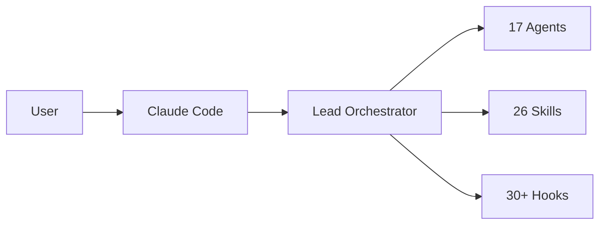

# Claude Code Poneglyph

## Para quien es

Este proyecto es una herramienta **personal** para **Oriol Macias**.
No es un producto comercial ni un SaaS.

El objetivo es maximizar la productividad de un programador trabajando junto a Claude Code como **co-programador**.

> **Filosofia:** Claude no reemplaza al programador, lo amplifica.

---

## Que es

**Claude Code Poneglyph** es un sistema de orquestacion multi-agente para Claude Code. Potencia la experiencia de desarrollo con agentes especializados, skills auto-matcheadas, hooks de validacion y reglas de calidad.

> **En resumen:** Configuracion avanzada que convierte Claude Code en un equipo de agentes especializados.

---

## El Problema que Resuelve

| Problema sin orquestacion | Solucion en Poneglyph |
|---------------------------|----------------------|
| Sin agentes especializados | 17 agentes con routing por complejidad |
| Sin validacion automatica | 30+ hooks (pre/post/stop) |
| Sin conocimiento de dominio | 26 skills auto-matcheadas por keywords |
| Sin memoria persistente | Sistema de memoria semantica por agente |
| Sin reglas de calidad | Rules para prompt scoring, complexity routing |

---

## Como Funciona

### Arquitectura



### Flujo de Trabajo

1. **Evaluar prompt**: Scoring de 5 criterios (clarity, context, structure, success, actionable)
2. **Calcular complejidad**: Routing automatico (builder directo / planner / architect)
3. **Cargar skills**: Auto-matching por keywords del prompt
4. **Delegar**: Builder implementa, reviewer valida, error-analyzer diagnostica
5. **Validar**: Stop hooks ejecutan tests automaticamente

---

## Estructura

```
.claude/
  agents/       # 17 agentes especializados
  skills/       # 26 skills con auto-matching
  hooks/        # Hooks pre/post/stop
  rules/        # Reglas de orquestacion
  commands/     # Slash commands
  workflows/    # Workflows reutilizables
  agent-memory/ # Memoria persistente por agente
  agent_docs/   # Documentacion extendida
```

---

## Como Iniciar

### Requisitos
- Bun 1.x instalado
- Claude Code CLI configurado (`claude` disponible en PATH)

### Setup

```bash
git clone <repo-url>
cd claude-code-poneglyph

# Ejecutar tests de hooks
bun test ./.claude/hooks/
```

El sistema se activa automaticamente via symlink `~/.claude/` apuntando al repo.

---

## Stack

| Capa | Tecnologia |
|------|------------|
| **Runtime** | Bun 1.x |
| **Orquestacion** | Claude Code agents/skills/hooks/rules |
| **Testing** | bun:test |
| **IA** | Claude Code (Anthropic) |
