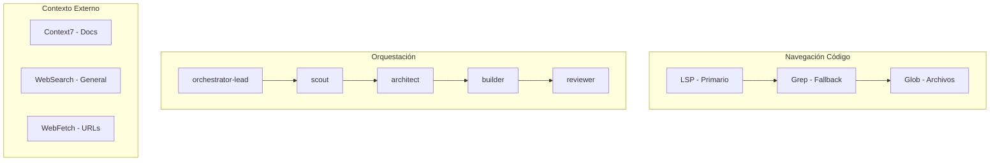

# Claude Code Capabilities

> Inventario completo de herramientas disponibles para orquestación en este repositorio.

## Resumen

| Categoría | Cantidad |
|-----------|----------|
| Agents | 14 |
| Skills | 8 |
| Commands | 11 |
| MCP Servers | 5 |
| Hooks | 5 |

---

## 1. Agents Disponibles

Los agents se invocan con `Task(subagent_type="nombre", prompt="...")`.

| Agent | Model | Descripción | Tools Disponibles |
|-------|-------|-------------|-------------------|
| **orchestrator-lead** | opus | Lead orchestrator. Delega tareas, nunca ejecuta directamente. CEO del workflow. | Task |
| **orchestrator-lead-slim** | sonnet | Versión ligera del orchestrator para workflows simples. | Task |
| **scout** | sonnet | Exploración read-only del codebase. Primer paso antes de cualquier implementación. | Read, Glob, Grep, LSP |
| **architect** | opus | Diseño y planificación técnica. Crea implementation plans detallados. | Read, Glob, Grep, LSP, Sequential Thinking |
| **builder** | sonnet | Implementación de código siguiendo planes del architect. | Read, Edit, Write, Bash, Glob, Grep, LSP |
| **reviewer** | sonnet | Code review para validar implementaciones. Read-only. | Read, Glob, Grep, LSP, Bash |
| **code-quality** | opus | Análisis de code smells, SOLID violations, complexity, duplication. | Read, Glob, Grep, LSP, Bash |
| **refactor-agent** | sonnet | Refactoring: extract functions, apply patterns, simplification. | Read, Glob, Grep, LSP, Edit, Write, Bash |
| **task-decomposer** | opus | Descompone tareas complejas (>40 complexity) en subtasks con dependencias. | Read, Grep, Glob |
| **security-auditor** | opus | Auditoría OWASP Top 10, secrets, vulnerabilities. | Read, Grep, Glob |
| **test-watcher** | sonnet | Monitorea coverage y sugiere tests faltantes. | Read, Grep, Glob, Bash |
| **bug-documenter** | sonnet | Mantiene AI_BUGS_KNOWLEDGE.md con bugs, root causes, solutions. | Read, Glob, Grep, Edit, Write |
| **knowledge-sync** | sonnet | Sincroniza documentación con cambios de código. | Read, Write, Grep, Glob |
| **merge-resolver** | sonnet | Resuelve conflictos de Git merge entendiendo intent de ambos cambios. | Read, Grep, Glob |

### Uso de Agents

```typescript
// Lanzar agent
Task(subagent_type="scout", prompt="Explorar estructura de autenticación")

// Con modelo específico
Task(subagent_type="architect", model="opus", prompt="Diseñar sistema de cache")

// En background
Task(subagent_type="code-quality", run_in_background=true, prompt="Analizar complejidad")
```

---

## 2. Skills Disponibles

Los skills se activan automáticamente por keywords o manualmente con `Skill(skill="nombre")`.

| Skill | Keywords de Activación | Descripción |
|-------|------------------------|-------------|
| **dev-server** | server, start, stop, dev, backend, frontend | Maneja dev servers (Elysia :8080, Vite :5173) |
| **code-style-enforcer** | style, yolo, comments, type hints, imports | Estilo YOLO (minimal comments), type hints requeridos |
| **bun-best-practices** | bun, runtime, elysia, test, file, spawn, websocket | Patterns Bun: file I/O, shell, testing, Elysia |
| **typescript-patterns** | typescript, async, await, promise, type, interface | Type safety, error handling, async/await patterns |
| **lsp-operations** | definition, references, hover, symbols, lsp | Referencia LSP: goToDefinition, findReferences |
| **config-validator** | env, config, validation, zod, environment | Validación de env vars con Zod |
| **logging-strategy** | log, logging, logger, structured, json logs | Structured logging (JSON), log levels, contexto |
| **prompt-engineer** | prompt, agent, crear agente, mejorar prompt, vago | Mejora prompts vagos y genera system prompts |

### Uso de Skills

```typescript
// Activación manual
Skill(skill="bun-best-practices")

// Los skills se cargan automáticamente cuando detectan keywords relevantes
```

---

## 3. Commands Disponibles

Slash commands invocables con `/nombre` o `Skill(skill="nombre")`.

| Command | Descripción | Uso |
|---------|-------------|-----|
| **/commands** | Lista todos los slash commands | `/commands [category]` |
| **/docs** | Navega documentación en .claude/docs/ | `/docs [topic]` |
| **/tools** | Muestra todas las herramientas disponibles | `/tools [category]` |
| **/load-reference** | Carga contexto extendido (API, arquitectura) | `$READ_FILE:CLAUDE-reference.md` |
| **/load-security** | Carga patrones de seguridad (~29 KB) | OWASP Top 10, secret detection |
| **/load-testing-strategy** | Carga estrategia de testing (~42 KB) | Golden Rule, mutation testing |
| **/load-anti-hallucination** | Carga patrones de validación | Verificación de claims |
| **/load-refactoring** | Carga patrones de refactoring | Code smells, safe refactoring |
| **/validate-claim** | Valida path/función antes de usarlo | `/validate-claim src/auth.ts validateJWT` |
| **/generate-from-spec** | Genera tests + implementación de spec BDD | Given-When-Then specs |
| **/advanced-planner** | Planificación avanzada con Execution Roadmap | DAG, dependencias, paralelización |

---

## 4. MCP Servers Configurados

| MCP Server | Descripción | Estado |
|------------|-------------|--------|
| **sequential-thinking** | Razonamiento estructurado paso a paso | ✅ Habilitado |
| **context7** | Documentación actualizada de librerías/frameworks | ✅ Habilitado |
| **github** | Operaciones GitHub (issues, PRs, repos) | ✅ Habilitado |
| **postgres** | Operaciones de base de datos PostgreSQL | ✅ Habilitado |
| **filesystem** | Operaciones de sistema de archivos | ✅ Habilitado |

### Uso de MCP

```typescript
// Sequential Thinking para razonamiento complejo
mcp__sequential-thinking__sequentialthinking({
  thought: "Analizando arquitectura...",
  thoughtNumber: 1,
  totalThoughts: 5,
  nextThoughtNeeded: true
})

// Context7 para documentación de librerías
mcp__context7__resolve-library-id({ libraryName: "elysia", query: "middleware" })
mcp__context7__query-docs({ libraryId: "/elysiajs/elysia", query: "how to add middleware" })

// GitHub para operaciones de repo
mcp__github__list_issues({ owner: "MaciWP", repo: "claude-code-poneglyph" })
```

---

## 5. Hooks Activos

| Hook | Trigger | Descripción |
|------|---------|-------------|
| **memory-inject.ts** | UserPromptSubmit | Inyecta memoria semántica en cada prompt |
| **format-code.sh** | PostToolUse (Edit/Write) | Formatea código después de ediciones |
| **statusline.sh** | statusLine | Genera línea de status |
| **security-scan.ts** | (disponible) | Escaneo de seguridad |
| **quality-gate.ts** | (disponible) | Gate de calidad |

---

## 6. Permisos Configurados

### Bash Permitidos

```
bun, npm, git (diff|status|log|checkout|merge|push), eslint, prettier
```

### Bash Denegados

```
rm -rf /*, curl|bash, wget|sh, eval, exec
```

### Archivos Protegidos (No editar)

```
.env, *.pem, *credentials*, *secret*, *password*
```

---

## 7. Limitaciones Conocidas

| Limitación | Workaround |
|------------|------------|
| No puede ejecutar GUI | Usar CLI equivalentes |
| Timeout Bash 5 min | Dividir comandos largos |
| Archivos >50K tokens | Usar offset/limit en Read |
| Sin acceso a internet directo | Usar WebFetch/WebSearch |
| No puede push --force | Usuario debe hacerlo manualmente |

---

## 8. Variables de Entorno

| Variable | Valor | Propósito |
|----------|-------|-----------|
| `BASH_DEFAULT_TIMEOUT_MS` | 300000 (5 min) | Timeout para comandos Bash |
| `CLAUDE_CODE_SUBAGENT_MODEL` | claude-opus-4-5-20251101 | Modelo para subagentes |
| `ENABLE_LSP_TOOL` | 1 | Habilita navegación LSP |
| `CLAUDE_CODE_FILE_READ_MAX_OUTPUT_TOKENS` | 50000 | Límite de tokens por archivo |

---

## 9. Jerarquía de Herramientas



---

## 10. Cuándo Usar Cada Herramienta

| Necesidad | Herramienta Recomendada |
|-----------|------------------------|
| Entender codebase | `Task:scout` o `Task:Explore` |
| Buscar archivo por nombre | `Glob('**/pattern')` |
| Buscar texto en código | `Grep('pattern', path)` |
| Ir a definición de símbolo | `LSP:goToDefinition` |
| Encontrar usos de función | `LSP:findReferences` |
| Documentación de librería | `mcp__context7__query-docs` |
| Razonamiento complejo | `mcp__sequential-thinking` |
| Diseñar feature | `Task:architect` |
| Implementar código | `Task:builder` |
| Revisar implementación | `Task:reviewer` |
| Analizar calidad | `Task:code-quality` |

---

*Última actualización: 2026-01-11*
*Ubicación: `.claude/agents/`, `.claude/skills/`, `.claude/commands/`*
