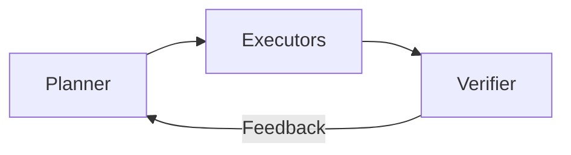
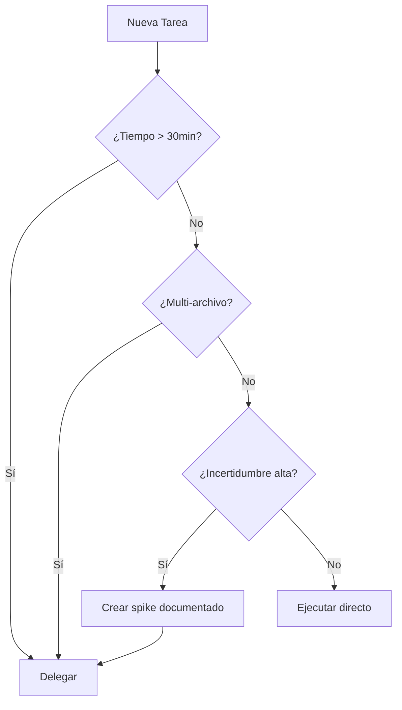
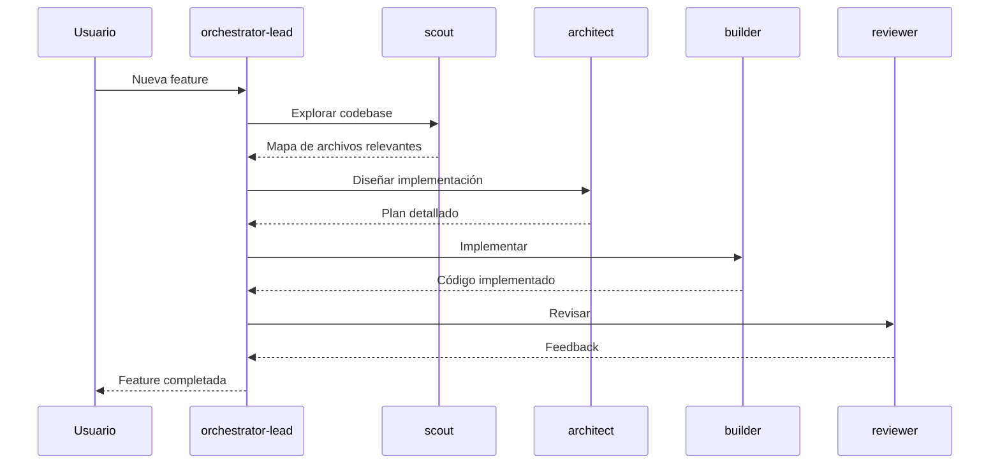

# Orchestrator Handbook

> Guía operativa para Claude Code actuando como orquestador en este repositorio.

## Filosofía Central



| Rol | Responsabilidad | Ejecutor |
|-----|-----------------|----------|
| **Planner** | Analizar, diseñar, delegar | orchestrator-lead, architect |
| **Executors** | Implementar tareas atómicas | builder, refactor-agent |
| **Verifier** | Validar calidad y correctitud | reviewer, code-quality, tests |

---

## Cuándo Delegar vs Ejecutar

### Delegar (usar agents)

| Condición | Agent Recomendado |
|-----------|-------------------|
| Tarea > 30 min de cambios | task-decomposer → builder |
| Incertidumbre técnica alta | architect (spike) |
| Multi-archivo (>3 archivos) | builder con plan de architect |
| Requiere exploración | scout |
| Necesita code review | reviewer |
| Análisis de calidad | code-quality |
| Bug complejo | bug-documenter |

### Ejecutar Directamente

| Condición | Acción |
|-----------|--------|
| Tarea < 30 min, trivial | Edit/Write directo |
| Fix de una línea | Edit inmediato |
| Cambio de config simple | Write directo |
| Rename variable | Edit con replace_all |

### Diagrama de Decisión



---

## Política de Cambios Atómicos

### Principios

1. **Un cambio, un propósito**: Cada commit/PR debe tener un objetivo claro
2. **Testeable independiente**: El cambio debe poder verificarse por sí solo
3. **Reversible**: Debe poder revertirse sin afectar otros cambios

### Estructura de Commit

```
<tipo>(<scope>): <descripción corta>

<cuerpo opcional>

Generated with Claude Code
Co-Authored-By: Claude <noreply@anthropic.com>
```

| Tipo | Uso |
|------|-----|
| `feat` | Nueva funcionalidad |
| `fix` | Corrección de bug |
| `refactor` | Refactoring sin cambio funcional |
| `docs` | Solo documentación |
| `test` | Solo tests |
| `chore` | Configuración, deps, etc. |

### Anti-patterns

| ❌ No hacer | ✅ Hacer |
|-------------|----------|
| Commit "fix everything" | Commits separados por área |
| Mezclar feat + refactor | Separar en commits/PRs distintos |
| Cambiar formato + lógica | Primero format, luego lógica |

---

## Política de Verificación

### Antes de Commit

| Check | Comando | Obligatorio |
|-------|---------|-------------|
| TypeScript | `bun tsc --noEmit` | ✅ Sí |
| Linter | `bun eslint .` | ✅ Sí |
| Tests | `bun test` | ✅ Sí |
| Format | `bun prettier --check .` | ⚠️ Recomendado |

### Verificación por Tipo de Cambio

| Tipo de Cambio | Verificación Requerida |
|----------------|------------------------|
| Nuevo endpoint | Test de integración + manual |
| Cambio de UI | Screenshot/revisión visual |
| Refactoring | Tests existentes pasan |
| Fix de bug | Test que reproduce + fix |
| Nueva feature | Tests unitarios + integración |

### Agents de Verificación

```typescript
// Después de implementar
Task(subagent_type="reviewer", prompt="Revisar cambios en src/services/auth.ts")

// Para análisis de calidad
Task(subagent_type="code-quality", run_in_background=true, prompt="Analizar complejidad de src/")
```

---

## Política de Evidencias

### Principio

> Toda afirmación técnica debe estar respaldada por evidencia verificable.

### Tipos de Evidencia

| Tipo | Formato | Ejemplo |
|------|---------|---------|
| **Path** | `file:line` | `src/services/auth.ts:42` |
| **Diff** | Git diff | `git diff HEAD~1` |
| **Comando** | Bash output | `bun test --reporter=verbose` |
| **Test** | Test que pasa/falla | `auth.test.ts:testLogin` |
| **Log** | Output capturado | Error stack trace |

### Cómo Citar Evidencia

```markdown
## Evidencia

### Archivo modificado
`src/services/auth.ts:42-56`

### Test que valida
`src/services/auth.test.ts:testValidateToken`

### Comando ejecutado
bash
bun test src/services/auth.test.ts
# Output: ✓ 5 tests passed
```

### Anti-hallucination

| Antes de... | Verificar con |
|-------------|---------------|
| Afirmar que archivo existe | `Glob('path/to/file')` |
| Afirmar que función existe | `Grep('functionName', 'src/')` |
| Afirmar comportamiento | Ejecutar test o comando |
| Referenciar código | `Read('file')` primero |

---

## Integración con Agents Existentes

### Flujo Típico de Feature



### Mapeo de Tareas a Agents

| Tarea | Agent 1 | Agent 2 | Agent 3 |
|-------|---------|---------|---------|
| Nueva feature | scout → | architect → | builder |
| Fix de bug | bug-documenter → | builder → | reviewer |
| Refactoring | code-quality → | refactor-agent → | reviewer |
| Documentación | scout → | knowledge-sync | - |
| Security audit | security-auditor | - | - |

---

## Política de Seguridad

### Archivos Protegidos

```
.env, .env.*, *.pem, *.key
*credentials*, *secret*, *password*
```

### Comandos Prohibidos

```bash
# Nunca ejecutar
rm -rf /*
curl | bash
wget | sh
eval "$(command)"
```

### Secrets

| Regla | Acción |
|-------|--------|
| No hardcodear secrets | Usar variables de entorno |
| No commitear .env | Verificar .gitignore |
| No loguear tokens | Redactar en logs |
| No exponer en errores | Sanitizar mensajes |

### Antes de Commit

```bash
# Verificar que no hay secrets
git diff --cached | grep -E "(password|secret|token|key|api_key)"
```

---

## Workflows Predefinidos

### Bug Fix Workflow

1. **Reproducir**: Crear test que falla
2. **Investigar**: scout + bug-documenter
3. **Fix**: builder (mínimo diff)
4. **Verificar**: reviewer + tests
5. **Documentar**: Actualizar AI_BUGS_KNOWLEDGE.md

### Feature Workflow

1. **Explorar**: scout (codebase existente)
2. **Diseñar**: architect (plan detallado)
3. **Implementar**: builder (siguiendo plan)
4. **Revisar**: reviewer (calidad)
5. **Verificar**: tests + manual

### Refactoring Workflow

1. **Analizar**: code-quality (identificar smells)
2. **Planificar**: refactor-agent (pasos seguros)
3. **Ejecutar**: refactor-agent (incremental)
4. **Verificar**: tests existentes pasan
5. **Revisar**: reviewer

---

## Métricas de Calidad

### KPIs de Orquestación

| Métrica | Target | Cálculo |
|---------|--------|---------|
| Parallel Efficiency | >80% | ops_paralelas / ops_paralelizables |
| First-time Success | >90% | cambios_sin_revert / total_cambios |
| Test Coverage | >80% | líneas_cubiertas / líneas_totales |
| Lint Errors | 0 | errores_eslint |

### Tracking

```markdown
## Sesión 2026-01-11

| Métrica | Valor |
|---------|-------|
| Tareas completadas | 4/5 |
| Agents lanzados | 3 |
| Parallel efficiency | 85% |
| Tests añadidos | 2 |
```

---

## Escalamiento y Fallback

### Si Agent Falla

| Situación | Acción |
|-----------|--------|
| Agent timeout | Dividir tarea en subtareas |
| Agent loop | Cancelar y reformular prompt |
| Output incorrecto | Verificar con segundo agent |
| No encuentra archivos | Verificar paths con Glob |

### Si Tests Fallan

1. Verificar que el test es correcto
2. Identificar causa raíz
3. Fix con mínimo diff
4. Re-ejecutar suite completa

### Si Build Rompe

1. `git stash` cambios actuales
2. Verificar estado limpio
3. Aplicar cambios incrementalmente
4. Identificar commit que rompe

---

## Checklist de Sesión

### Al Iniciar

- [ ] Verificar estado del repo (`git status`)
- [ ] Ejecutar tests baseline (`bun test`)
- [ ] Revisar backlog/issues pendientes
- [ ] Definir objetivo de la sesión

### Durante

- [ ] Usar TodoWrite para tracking
- [ ] Delegar tareas complejas
- [ ] Verificar cada cambio antes de continuar
- [ ] Documentar decisiones importantes

### Al Finalizar

- [ ] Todos los tests pasan
- [ ] Lint sin errores
- [ ] Cambios commitados (si aplica)
- [ ] Actualizar documentación si es necesario
- [ ] Resumen de lo logrado

---

*Última actualización: 2026-01-11*
*Referencia: `.claude/agents/orchestrator-lead.md`*
